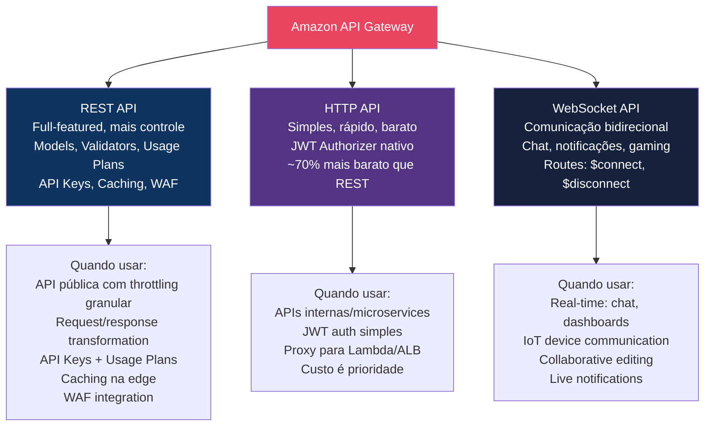

# Amazon API Gateway — Workshop: De Zero a Especialista

> **Level:** 100 → 200 → 300 → 400
> **Tipo:** Hands-on Workshop
> **Duração Total:** ~90-120 horas de labs práticos
> **Custo Estimado:** ~$10-40 (maioria no Free Tier: 1M calls/mês por 12 meses)
> **Última Atualização:** Abril 2026

---

## Sobre Este Workshop

Este workshop contém **65 desafios práticos progressivos** organizados em **10 módulos** que cobrem **100% das funcionalidades do Amazon API Gateway** — REST APIs, HTTP APIs, WebSocket APIs, integrações com Lambda/ECS/Step Functions, autenticação (Cognito, JWT, Lambda Authorizer, IAM), stages, deployments, throttling, caching, custom domains, monitoring, VPC Links e padrões arquiteturais avançados.

```
         ┌─────────────────────────────────────────────────────────────────┐
         │                                                                 │
         │        AMAZON API GATEWAY — WORKSHOP ESPECIALISTA               │
         │                                                                 │
         │   "De zero a referência técnica em API Gateway"                │
         │                                                                 │
         │   65 Desafios  ·  10 Módulos  ·  4 Níveis  ·  ~100h Labs      │
         │                                                                 │
         └─────────────────────────────────────────────────────────────────┘
```

---

## Os 3 Tipos de API Gateway



---

## Mapa de Progressão

```
  LEVEL 100                LEVEL 200                 LEVEL 300                  LEVEL 400
  (Foundational)           (Intermediate)            (Advanced)                 (Expert)
  ──────────────           ──────────────            ──────────────             ──────────────

  ┌──────────┐             ┌──────────┐              ┌──────────┐              ┌──────────┐
  │Módulo 01 │             │Módulo 03 │              │Módulo 05 │              │Módulo 08 │
  │REST API  │────────────→│Integrat. │─────────────→│Stages &  │─────────────→│Performanc│
  │Fundament.│             │Lambda,ECS│              │Deploy    │              │Cost      │
  │D.1 — D.7 │             │Step Func │              │D.28—D.33 │              │D.46—D.51 │
  │ 12-16h   │             │D.14—D.20 │              │ 10-14h   │              │ 10-14h   │
  └──────────┘             │ 12-16h   │              └──────────┘              └──────────┘
  ┌──────────┐             └──────────┘              ┌──────────┐              ┌──────────┐
  │Módulo 02 │             ┌──────────┐              │Módulo 06 │              │Módulo 09 │
  │HTTP API  │────────────→│Módulo 04 │─────────────→│Monitoring│─────────────→│Patterns  │
  │Simples & │             │Auth &    │              │Troublesh.│              │Avançados │
  │Rápido    │             │Security  │              │D.34—D.39 │              │D.52—D.57 │
  │D.8—D.13  │             │D.21—D.27 │              │ 10-14h   │              │ 10-14h   │
  │ 10-14h   │             │ 12-16h   │              └──────────┘              └──────────┘
  └──────────┘             └──────────┘              ┌──────────┐              ┌──────────┐
                                                     │Módulo 07 │              │Módulo 10 │
                                                     │WebSocket │─────────────→│Cenários  │
                                                     │API       │              │Expert    │
                                                     │D.40—D.45 │              │D.58—D.65 │
                                                     │ 10-14h   │              │ 12-16h   │
                                                     └──────────┘              └──────────┘
```

---

## Estrutura dos Módulos

### Level 100 — Foundational (Módulos 01-02)

> *Você é novo em API Gateway. Quer entender os 3 tipos, criar suas primeiras APIs e dominar os conceitos fundamentais.*

| # | Módulo | Desafios | Tempo | O Que Você Vai Aprender |
|---|--------|----------|-------|------------------------|
| 01 | [**REST API — Fundamentos**](modulo-01-rest-api-fundamentos.md) | 1-7 | 12-16h | Primeira REST API, resources e methods, proxy vs non-proxy integration, request/response mapping, models e validators, API Keys e Usage Plans, deploy e stages |
| 02 | [**HTTP API — Simples e Rápido**](modulo-02-http-api.md) | 8-13 | 10-14h | HTTP API vs REST API (quando usar qual), JWT authorizer nativo, Lambda integration, ALB/NLB integration, auto-deploy, CORS simplificado, parameter mapping |

**Ao completar Level 100, você sabe:**
- Criar REST APIs e HTTP APIs do zero
- Integrar com Lambda, HTTP endpoints e AWS services
- Configurar CORS, modelos de dados e validação
- Usar API Keys e Usage Plans para controle de acesso
- Entender quando usar REST API vs HTTP API

---

### Level 200 — Intermediate (Módulos 03-04)

> *Você já criou APIs. Quer dominar integrações avançadas, autenticação e segurança.*

| # | Módulo | Desafios | Tempo | O Que Você Vai Aprender |
|---|--------|----------|-------|------------------------|
| 03 | [**Integrações Avançadas**](modulo-03-integrations.md) | 14-20 | 12-16h | Lambda proxy vs custom, Step Functions (sync/async), DynamoDB direct integration, S3 signed URL via API, SQS/SNS integration, VPC Link para ALB/NLB privado, Mock integration |
| 04 | [**Auth & Security**](modulo-04-auth-security.md) | 21-27 | 12-16h | Cognito User Pool Authorizer, Lambda Authorizer (token + request), IAM Authorization (SigV4), JWT Authorizer (HTTP API), Resource Policies, mutual TLS, WAF integration |

**Ao completar Level 200, você sabe:**
- Integrar API Gateway com 7+ serviços AWS diretamente
- Implementar VPC Link para backends privados
- Configurar 5 métodos de autenticação diferentes
- Proteger APIs com WAF, resource policies e mTLS
- Usar Step Functions para orquestração de workflows

---

### Level 300 — Advanced (Módulos 05-07)

> *Você é proficiente em API Gateway. Quer dominar deployment strategies, monitoring avançado e WebSocket APIs.*

| # | Módulo | Desafios | Tempo | O Que Você Vai Aprender |
|---|--------|----------|-------|------------------------|
| 05 | [**Stages, Deploy & Versioning**](modulo-05-stages-deploy.md) | 28-33 | 10-14h | Stages e stage variables, canary deployments, custom domain names (ACM + Route 53), base path mapping, API export/import (OpenAPI), versioning strategies |
| 06 | [**Monitoring & Troubleshooting**](modulo-06-monitoring.md) | 34-39 | 10-14h | CloudWatch Metrics (todas), access logging (customizado), execution logging, X-Ray tracing, CloudWatch Alarms, troubleshooting 4xx/5xx errors |
| 07 | [**WebSocket API**](modulo-07-websocket.md) | 40-45 | 10-14h | WebSocket routes ($connect, $disconnect, $default, custom), connection management (DynamoDB), Lambda integration, broadcasting, chat application completo, authentication |

**Ao completar Level 300, você sabe:**
- Fazer deploy com canary releases
- Configurar custom domains com multi-level base path mapping
- Implementar observabilidade completa (logs, métricas, tracing)
- Diagnosticar erros 4xx/5xx sistematicamente
- Construir aplicações real-time com WebSocket API

---

### Level 400 — Expert (Módulos 08-10)

> *Você opera API Gateway em produção. Quer otimizar performance, reduzir custos e implementar padrões arquiteturais avançados.*

| # | Módulo | Desafios | Tempo | O Que Você Vai Aprender |
|---|--------|----------|-------|------------------------|
| 08 | [**Performance & Cost Optimization**](modulo-08-performance-cost.md) | 46-51 | 10-14h | API caching (REST), throttling granular, payload compression, connection reuse, cost analysis (REST vs HTTP), edge-optimized vs regional vs private |
| 09 | [**Padrões Avançados**](modulo-09-patterns.md) | 52-57 | 10-14h | API composition (microservices), request/response transformation (VTL), API Gateway como BFF, multi-region failover com Route 53, service mesh pattern, OpenAPI-first development |
| 10 | [**Cenários Expert**](modulo-10-cenarios-expert.md) | 58-65 | 12-16h | **CAPSTONE:** Plataforma SaaS multi-tenant, migração de monolith para microservices, API marketplace com monetização, event-driven architecture, GraphQL vs REST decision, certificação prep |

**Ao completar Level 400, você é:**
- Capaz de arquitetar soluções API Gateway para qualquer cenário
- Referência técnica em API design e management
- Preparado para cenários enterprise de alta escala
- Operacionalmente maduro com monitoring, caching e cost optimization

---

## Cobertura Completa do Console API Gateway

```
API Gateway Console
├── APIs
│   ├── REST API ──────────────────── Módulos 01, 03, 04, 05
│   │   ├── Resources ────────────── Módulo 01 (D.1-3)
│   │   ├── Methods ──────────────── Módulo 01 (D.2-3)
│   │   ├── Models ───────────────── Módulo 01 (D.5)
│   │   ├── Request Validators ───── Módulo 01 (D.5)
│   │   ├── Authorizers ──────────── Módulo 04 (D.21-24)
│   │   ├── Gateway Responses ────── Módulo 06 (D.37)
│   │   ├── Stages ───────────────── Módulo 05 (D.28-29)
│   │   ├── Resource Policy ──────── Módulo 04 (D.25)
│   │   ├── Documentation ────────── Módulo 09 (D.57)
│   │   ├── Dashboard ────────────── Módulo 06 (D.34)
│   │   └── Settings ─────────────── Módulo 08 (D.46-48)
│   │
│   ├── HTTP API ──────────────────── Módulo 02
│   │   ├── Routes ───────────────── Módulo 02 (D.8-9)
│   │   ├── Integrations ─────────── Módulo 02 (D.10)
│   │   ├── Authorization ────────── Módulo 02 (D.11), Módulo 04 (D.24)
│   │   ├── CORS ─────────────────── Módulo 02 (D.12)
│   │   ├── Stages ───────────────── Módulo 02 (D.13)
│   │   └── Throttling ───────────── Módulo 08 (D.47)
│   │
│   └── WebSocket API ─────────────── Módulo 07
│       ├── Routes ───────────────── Módulo 07 (D.40-41)
│       ├── Integrations ─────────── Módulo 07 (D.42)
│       ├── Stages ───────────────── Módulo 07 (D.43)
│       └── Connection Management ── Módulo 07 (D.44)
│
├── Usage Plans ───────────────────── Módulo 01 (D.6)
├── API Keys ──────────────────────── Módulo 01 (D.6)
├── Custom Domain Names ───────────── Módulo 05 (D.30-31)
├── VPC Links ─────────────────────── Módulo 03 (D.19)
├── Client Certificates ───────────── Módulo 04 (D.26)
└── Settings ──────────────────────── Módulo 08 (D.46)
```

---

## Serviços AWS Integrados

```mermaid
graph TB
    APIGW[API Gateway]

    APIGW --> LAMBDA[Lambda<br/>D.3, D.10, D.14-15]
    APIGW --> DDB[DynamoDB<br/>Direct Integration<br/>D.17]
    APIGW --> SFN[Step Functions<br/>Sync + Async<br/>D.16]
    APIGW --> S3[S3<br/>Signed URLs<br/>D.18]
    APIGW --> SQS[SQS / SNS<br/>Async Processing<br/>D.18-19]
    APIGW --> ALB[ALB / NLB<br/>VPC Link<br/>D.19-20]
    APIGW --> COG[Cognito<br/>Authorizer<br/>D.21]
    APIGW --> WAF[WAF<br/>Protection<br/>D.27]
    APIGW --> CF[CloudFront<br/>Edge-Optimized<br/>D.48]
    APIGW --> R53[Route 53<br/>Custom Domain<br/>D.30]
    APIGW --> ACM[ACM<br/>Certificates<br/>D.30]
    APIGW --> CW[CloudWatch<br/>Logs + Metrics<br/>D.34-36]
    APIGW --> XRAY[X-Ray<br/>Tracing<br/>D.36]

    style APIGW fill:#e94560,color:#fff
    style LAMBDA fill:#0f3460,color:#fff
    style DDB fill:#533483,color:#fff
    style SFN fill:#533483,color:#fff
    style COG fill:#16213e,color:#fff
    style WAF fill:#16213e,color:#fff
```



---

## Índice Completo de Desafios

### Módulo 01 — REST API Fundamentos (Level 100)
| # | Desafio | Tempo | Serviços |
|---|---------|-------|----------|
| 1 | Primeira REST API com Lambda (Console + CLI) | 60 min | API GW, Lambda |
| 2 | Resources, Methods e Integration Request | 90 min | API GW |
| 3 | Proxy Integration vs Custom Integration | 90 min | API GW, Lambda |
| 4 | Request/Response Mapping Templates (VTL) | 90 min | API GW |
| 5 | Models e Request Validators | 60 min | API GW |
| 6 | API Keys e Usage Plans | 90 min | API GW |
| 7 | Terraform — REST API Completa | 90 min | API GW, Lambda |

### Módulo 02 — HTTP API (Level 100-200)
| # | Desafio | Tempo | Serviços |
|---|---------|-------|----------|
| 8 | Primeira HTTP API — Simple e Rápido | 60 min | API GW, Lambda |
| 9 | REST API vs HTTP API — Quando Usar Qual | 60 min | API GW |
| 10 | Lambda Integration e Parameter Mapping | 90 min | API GW, Lambda |
| 11 | JWT Authorizer Nativo (Cognito) | 90 min | API GW, Cognito |
| 12 | CORS Configuração Completa | 60 min | API GW |
| 13 | Auto-Deploy e Stages | 60 min | API GW |

### Módulo 03 — Integrações Avançadas (Level 200)
| # | Desafio | Tempo | Serviços |
|---|---------|-------|----------|
| 14 | Lambda Proxy vs Custom — Deep Dive | 90 min | API GW, Lambda |
| 15 | Lambda Async Invocation (Event) | 60 min | API GW, Lambda, SQS |
| 16 | Step Functions Integration (Sync + Async) | 120 min | API GW, Step Functions |
| 17 | DynamoDB Direct Integration (sem Lambda) | 90 min | API GW, DynamoDB |
| 18 | S3 e SQS/SNS Direct Integration | 90 min | API GW, S3, SQS |
| 19 | VPC Link — ALB/NLB Privado | 120 min | API GW, ALB, VPC |
| 20 | Mock Integration e Prototipagem | 60 min | API GW |

### Módulo 04 — Auth & Security (Level 200-300)
| # | Desafio | Tempo | Serviços |
|---|---------|-------|----------|
| 21 | Cognito User Pool Authorizer | 90 min | API GW, Cognito |
| 22 | Lambda Authorizer — Token-Based | 90 min | API GW, Lambda |
| 23 | Lambda Authorizer — Request-Based | 90 min | API GW, Lambda |
| 24 | IAM Authorization (SigV4) | 60 min | API GW, IAM |
| 25 | Resource Policies — Restrict by IP/VPC/Account | 60 min | API GW |
| 26 | Mutual TLS (mTLS) | 90 min | API GW, ACM, S3 |
| 27 | WAF Integration para APIs | 90 min | API GW, WAF |

### Módulo 05 — Stages, Deploy & Versioning (Level 300)
| # | Desafio | Tempo | Serviços |
|---|---------|-------|----------|
| 28 | Stages e Stage Variables | 60 min | API GW |
| 29 | Canary Deployments | 90 min | API GW |
| 30 | Custom Domain Names (ACM + Route 53) | 90 min | API GW, ACM, Route 53 |
| 31 | Base Path Mapping — Multi-API em Um Domínio | 60 min | API GW |
| 32 | Export/Import OpenAPI (Swagger) | 60 min | API GW |
| 33 | Versioning Strategies | 90 min | API GW |

### Módulo 06 — Monitoring & Troubleshooting (Level 300)
| # | Desafio | Tempo | Serviços |
|---|---------|-------|----------|
| 34 | CloudWatch Metrics — Todas as Métricas | 60 min | CloudWatch |
| 35 | Access Logging — Formato Customizado | 90 min | CloudWatch Logs |
| 36 | X-Ray Tracing — End-to-End | 90 min | X-Ray |
| 37 | Gateway Responses Customizadas | 60 min | API GW |
| 38 | Troubleshooting 4xx Errors (400, 401, 403, 429) | 90 min | API GW, CloudWatch |
| 39 | Troubleshooting 5xx Errors (500, 502, 503, 504) | 90 min | API GW, CloudWatch |

### Módulo 07 — WebSocket API (Level 300)
| # | Desafio | Tempo | Serviços |
|---|---------|-------|----------|
| 40 | Primeira WebSocket API — $connect, $disconnect, $default | 90 min | API GW, Lambda |
| 41 | Custom Routes e Route Selection Expression | 60 min | API GW |
| 42 | Connection Management com DynamoDB | 90 min | API GW, Lambda, DynamoDB |
| 43 | Broadcasting — Enviar Mensagem para Todos | 90 min | API GW, Lambda |
| 44 | Chat Application Completo | 120 min | API GW, Lambda, DynamoDB, S3 |
| 45 | WebSocket Auth e Rate Limiting | 60 min | API GW, Lambda |

### Módulo 08 — Performance & Cost (Level 400)
| # | Desafio | Tempo | Serviços |
|---|---------|-------|----------|
| 46 | API Caching (REST API) | 90 min | API GW |
| 47 | Throttling — Account, Stage, Method Level | 60 min | API GW |
| 48 | Edge-Optimized vs Regional vs Private | 90 min | API GW, CloudFront |
| 49 | Payload Compression | 60 min | API GW |
| 50 | Cost Analysis — REST vs HTTP vs WebSocket | 90 min | Cost Explorer |
| 51 | Connection Reuse e Backend Optimization | 60 min | API GW, Lambda |

### Módulo 09 — Padrões Avançados (Level 400)
| # | Desafio | Tempo | Serviços |
|---|---------|-------|----------|
| 52 | API Composition — Microservices Backend | 90 min | API GW, Lambda, Step Functions |
| 53 | Request/Response Transformation (VTL Avançado) | 90 min | API GW |
| 54 | API Gateway como BFF (Backend for Frontend) | 90 min | API GW, Lambda |
| 55 | Multi-Region API com Route 53 Failover | 120 min | API GW, Route 53, Lambda |
| 56 | OpenAPI-First Development | 90 min | API GW |
| 57 | API Documentation e Developer Portal | 60 min | API GW |

### Módulo 10 — Cenários Expert (Level 400)
| # | Desafio | Tempo | Serviços |
|---|---------|-------|----------|
| 58 | **CAPSTONE:** Plataforma SaaS Multi-Tenant | 180 min | Todos |
| 59 | Migração Monolith → Microservices via API Gateway | 120 min | API GW, ALB, Lambda |
| 60 | API Marketplace com Monetização (Usage Plans) | 120 min | API GW |
| 61 | Event-Driven Architecture (API GW → EventBridge) | 90 min | API GW, EventBridge |
| 62 | GraphQL vs REST — Decision Framework | 60 min | API GW, AppSync |
| 63 | Private API para Microservices Internos | 90 min | API GW, VPC Endpoints |
| 64 | API Versioning e Backward Compatibility | 90 min | API GW |
| 65 | Certificação e Próximos Passos | 60 min | — |

---

## Pré-requisitos

### Obrigatórios

- **Conta AWS** — Free Tier inclui 1M API calls/mês por 12 meses
- **AWS CLI v2** — Instalada e configurada
- **Terraform >= 1.5** — Para todos os desafios de IaC
- **Conhecimentos básicos** — HTTP, REST, JSON

### Recomendados

- **Node.js 18+** — Para Lambda functions
- **Python 3.12+** — Para Lambda functions
- **Postman ou curl** — Para testar APIs
- **wscat** — Para testar WebSocket APIs (`npm install -g wscat`)
- **Workshop CloudFront** (Módulo 06) — Se quiser integrar CF + API GW

### Custos Estimados

| Level | Custo Estimado | Nota |
|-------|---------------|------|
| 100 (Módulos 01-02) | ~$0-2 | Free Tier cobre 1M calls/mês |
| 200 (Módulos 03-04) | ~$2-5 | Step Functions, DynamoDB |
| 300 (Módulos 05-07) | ~$5-15 | Custom domains, WebSocket |
| 400 (Módulos 08-10) | ~$10-20 | Caching, multi-region |

---

## Navegação Rápida

### Level 100 — Foundational
- [Módulo 01 — REST API Fundamentos](modulo-01-rest-api-fundamentos.md) (Desafios 1-7)
- [Módulo 02 — HTTP API](modulo-02-http-api.md) (Desafios 8-13)

### Level 200 — Intermediate
- [Módulo 03 — Integrações Avançadas](modulo-03-integrations.md) (Desafios 14-20)
- [Módulo 04 — Auth & Security](modulo-04-auth-security.md) (Desafios 21-27)

### Level 300 — Advanced
- [Módulo 05 — Stages, Deploy & Versioning](modulo-05-stages-deploy.md) (Desafios 28-33)
- [Módulo 06 — Monitoring & Troubleshooting](modulo-06-monitoring.md) (Desafios 34-39)
- [Módulo 07 — WebSocket API](modulo-07-websocket.md) (Desafios 40-45)

### Level 400 — Expert
- [Módulo 08 — Performance & Cost](modulo-08-performance-cost.md) (Desafios 46-51)
- [Módulo 09 — Padrões Avançados](modulo-09-patterns.md) (Desafios 52-57)
- [Módulo 10 — Cenários Expert](modulo-10-cenarios-expert.md) (Desafios 58-65)

---

## Referências

- [API Gateway Developer Guide](https://docs.aws.amazon.com/apigateway/latest/developerguide/)
- [API Gateway REST API Reference](https://docs.aws.amazon.com/apigateway/latest/api/)
- [API Gateway V2 API Reference (HTTP/WebSocket)](https://docs.aws.amazon.com/apigatewayv2/latest/api-reference/)
- [Terraform AWS API Gateway Resources](https://registry.terraform.io/providers/hashicorp/aws/latest/docs/resources/api_gateway_rest_api)
- [OpenAPI Specification](https://swagger.io/specification/)
- [AWS Well-Architected — Serverless Lens](https://docs.aws.amazon.com/wellarchitected/latest/serverless-applications-lens/)

---

> **Workshop criado para transformar você em referência técnica em Amazon API Gateway.
> 65 desafios. 10 módulos. Do zero ao expert.**
