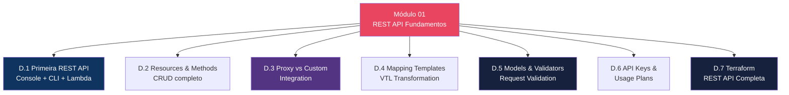
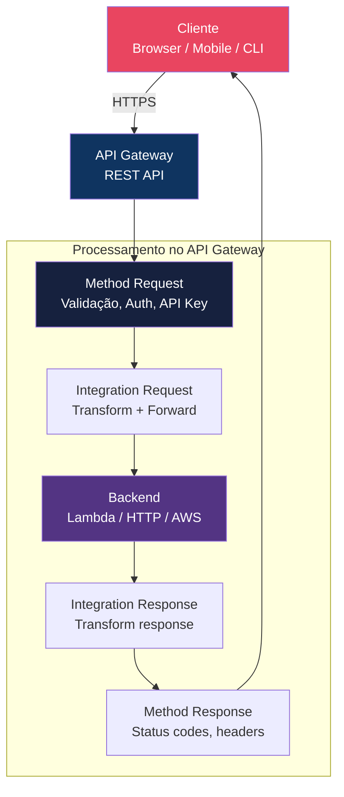
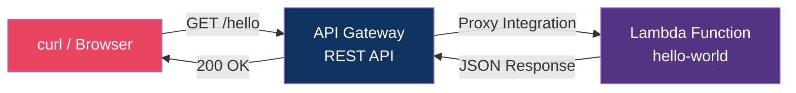
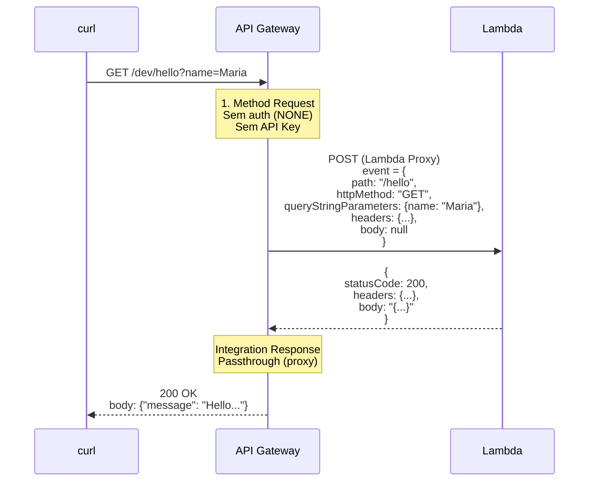
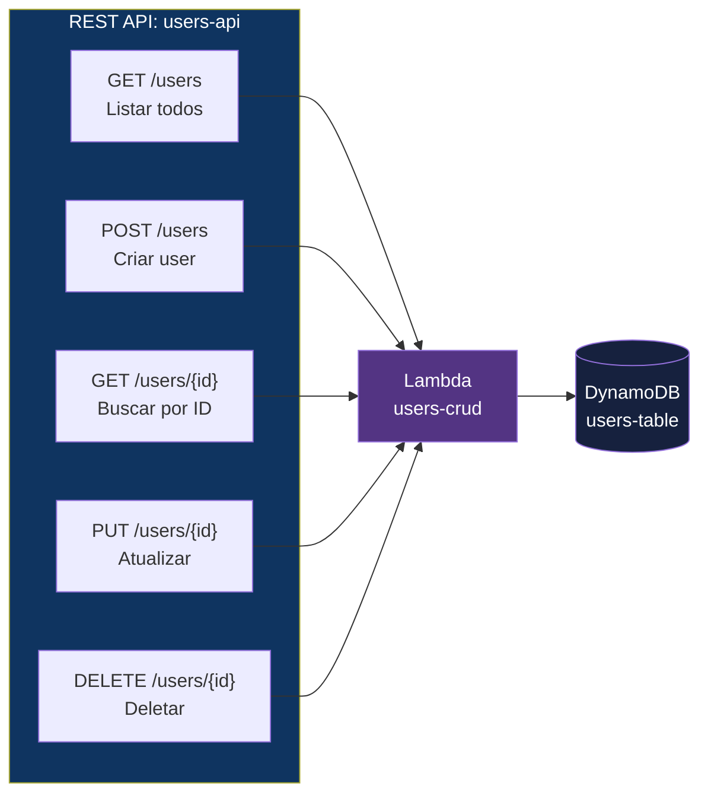
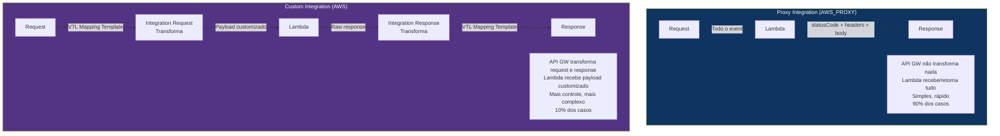
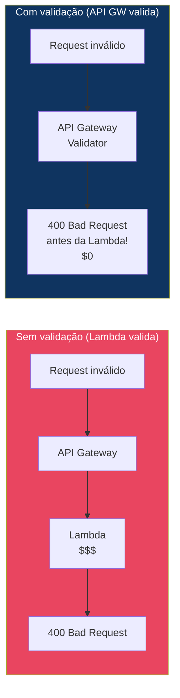
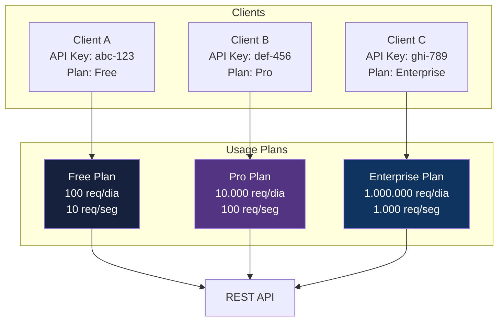

# Módulo 01 — REST API Fundamentos

> **Nível:** 100 (Foundational)
> **Tempo Total Estimado:** 12-16 horas de labs
> **Custo Estimado:** ~$0 (Free Tier: 1M API calls/mês)
> **Objetivo do Módulo:** Dominar os fundamentos do API Gateway REST API — criar APIs do zero, entender resources e methods, integrar com Lambda (proxy e custom), usar mapping templates, models, validators, API Keys e Usage Plans. Tudo com CLI e Terraform.

---

## Mapa do Módulo



---

## Conceitos-Chave Antes de Começar

### O Que é API Gateway?

Amazon API Gateway é um serviço gerenciado para criar, publicar, manter, monitorar e proteger APIs em qualquer escala. Ele funciona como a **porta de entrada** para backends (Lambda, EC2, ECS, outros serviços AWS ou endpoints HTTP).

### Anatomia de uma REST API



### Conceitos Fundamentais

| Conceito | Descrição |
|----------|-----------|
| **REST API** | API que segue o modelo request/response HTTP |
| **Resource** | Entidade da API representada por um path (ex: `/users`, `/orders/{id}`) |
| **Method** | Verbo HTTP em um resource (GET, POST, PUT, DELETE, PATCH) |
| **Integration** | Conexão entre o method e o backend (Lambda, HTTP, AWS service, Mock) |
| **Stage** | Versão deployada da API (dev, staging, prod) |
| **Deployment** | Snapshot da API em um ponto no tempo, associado a um stage |
| **Model** | Schema JSON que define a estrutura do request/response body |
| **Authorizer** | Mecanismo de autenticação (Cognito, Lambda, IAM) |
| **API Key** | Chave de identificação do cliente (não é autenticação!) |
| **Usage Plan** | Plano que define throttling e quota por API Key |

---

## Desafio 1: Primeira REST API com Lambda

> **Level:** 100 | **Tempo:** 60 min | **Custo:** $0 (Free Tier)

### Objetivo

Criar sua primeira REST API no API Gateway integrada com uma Lambda function, testar e entender o fluxo completo de request/response.

### O Que Vamos Construir



### Passo a Passo

#### 1. Criar a Lambda Function

```python
# hello-world/handler.py
import json
from datetime import datetime

def handler(event, context):
    """Handler simples que retorna informações sobre o request."""
    return {
        'statusCode': 200,
        'headers': {
            'Content-Type': 'application/json',
            'X-Custom-Header': 'api-gateway-lab'
        },
        'body': json.dumps({
            'message': 'Hello from API Gateway + Lambda!',
            'timestamp': datetime.utcnow().isoformat(),
            'path': event.get('path', '/'),
            'method': event.get('httpMethod', 'GET'),
            'queryStringParameters': event.get('queryStringParameters'),
            'requestId': context.aws_request_id
        })
    }
```

```bash
# Criar a função Lambda
zip -j /tmp/hello-world.zip hello-world/handler.py

LAMBDA_ARN=$(aws lambda create-function \
  --function-name hello-world-api \
  --runtime python3.12 \
  --handler handler.handler \
  --role "arn:aws:iam::$(aws sts get-caller-identity --query Account --output text):role/lambda-basic-role" \
  --zip-file fileb:///tmp/hello-world.zip \
  --query 'FunctionArn' --output text)

echo "Lambda ARN: $LAMBDA_ARN"
```

> Se não tem a role `lambda-basic-role`, crie primeiro:

```bash
aws iam create-role \
  --role-name lambda-basic-role \
  --assume-role-policy-document '{
    "Version": "2012-10-17",
    "Statement": [{
      "Effect": "Allow",
      "Principal": {"Service": "lambda.amazonaws.com"},
      "Action": "sts:AssumeRole"
    }]
  }'

aws iam attach-role-policy \
  --role-name lambda-basic-role \
  --policy-arn "arn:aws:iam::aws:policy/service-role/AWSLambdaBasicExecutionRole"

# Aguardar propagação da role (~10s)
sleep 10
```

#### 2. Criar a REST API

```bash
# Criar a API
API_ID=$(aws apigateway create-rest-api \
  --name "hello-api" \
  --description "Primeira REST API - Lab" \
  --endpoint-configuration '{"types":["REGIONAL"]}' \
  --query 'id' --output text)

echo "API ID: $API_ID"

# Obter o resource raiz (/)
ROOT_ID=$(aws apigateway get-resources --rest-api-id "$API_ID" \
  --query 'items[0].id' --output text)

echo "Root Resource ID: $ROOT_ID"
```

#### 3. Criar Resource e Method

```bash
# Criar resource /hello
HELLO_ID=$(aws apigateway create-resource \
  --rest-api-id "$API_ID" \
  --parent-id "$ROOT_ID" \
  --path-part "hello" \
  --query 'id' --output text)

echo "Hello Resource ID: $HELLO_ID"

# Criar method GET no resource /hello
aws apigateway put-method \
  --rest-api-id "$API_ID" \
  --resource-id "$HELLO_ID" \
  --http-method GET \
  --authorization-type NONE
```

#### 4. Configurar Integration (Lambda Proxy)

```bash
ACCOUNT_ID=$(aws sts get-caller-identity --query Account --output text)
REGION=$(aws configure get region)

# Integration com Lambda (PROXY)
aws apigateway put-integration \
  --rest-api-id "$API_ID" \
  --resource-id "$HELLO_ID" \
  --http-method GET \
  --type AWS_PROXY \
  --integration-http-method POST \
  --uri "arn:aws:apigateway:$REGION:lambda:path/2015-03-31/functions/$LAMBDA_ARN/invocations"

# Dar permissão ao API Gateway para invocar a Lambda
aws lambda add-permission \
  --function-name hello-world-api \
  --statement-id apigateway-invoke \
  --action lambda:InvokeFunction \
  --principal apigateway.amazonaws.com \
  --source-arn "arn:aws:execute-api:$REGION:$ACCOUNT_ID:$API_ID/*/GET/hello"
```

#### 5. Deploy da API

```bash
# Criar deployment e stage
aws apigateway create-deployment \
  --rest-api-id "$API_ID" \
  --stage-name dev \
  --description "Primeiro deploy"

# Obter a URL
API_URL="https://$API_ID.execute-api.$REGION.amazonaws.com/dev"
echo "API URL: $API_URL"
```

### Como Testar

```bash
# 1. GET /hello
curl -s "$API_URL/hello" | jq .
# {
#   "message": "Hello from API Gateway + Lambda!",
#   "timestamp": "2026-04-11T...",
#   "path": "/hello",
#   "method": "GET",
#   "queryStringParameters": null,
#   "requestId": "abc-123-..."
# }

# 2. GET /hello com query parameters
curl -s "$API_URL/hello?name=Maria&lang=pt" | jq .
# queryStringParameters: {"name": "Maria", "lang": "pt"}

# 3. Verificar headers de resposta
curl -sI "$API_URL/hello"
# HTTP/2 200
# content-type: application/json
# x-custom-header: api-gateway-lab
# x-amzn-requestid: ...
# x-amz-apigw-id: ...

# 4. Testar path que não existe (deve retornar 403)
curl -s "$API_URL/naoexiste"
# {"message":"Missing Authentication Token"}
# (API Gateway retorna 403 para resources não configurados)

# 5. Testar method não configurado
curl -s -X POST "$API_URL/hello"
# {"message":"Missing Authentication Token"}
# (POST não foi configurado no resource /hello)
```

### Entendendo o Fluxo



> **Importante:** Na integration `AWS_PROXY`, o API Gateway envia TUDO para a Lambda (headers, body, path, query params, stage) no formato padronizado do `event`. A Lambda DEVE retornar um objeto com `statusCode`, `headers` e `body`. Se retornar qualquer outro formato, o API Gateway retorna 502 (Internal Server Error).

### O Que Aprendemos

| Conceito | Detalhe |
|----------|---------|
| REST API | API criada no API Gateway com resources e methods |
| Resource | Path da API (ex: `/hello`). Criado como child do root `/` |
| Method | Verbo HTTP (GET, POST, etc.) associado a um resource |
| Integration | Conexão com backend. `AWS_PROXY` = proxy direto para Lambda |
| Deployment | Snapshot da API. Necessário para expor via URL |
| Stage | Ambiente (dev, staging, prod). Cada stage tem sua URL |
| Lambda Permission | API Gateway precisa de permissão explícita para invocar Lambda |
| URL format | `https://{api-id}.execute-api.{region}.amazonaws.com/{stage}/{resource}` |

### Troubleshooting

| Problema | Causa | Solução |
|----------|-------|---------|
| 403 "Missing Authentication Token" | Resource ou method não existe | Verificar se o path e method estão configurados |
| 500 Internal Server Error | Lambda retornou formato errado | Lambda DEVE retornar `{statusCode, headers, body}` |
| 502 Bad Gateway | Lambda crashou ou timeout | Verificar CloudWatch Logs da Lambda |
| Timeout (504) | Lambda demorou > 29s | API Gateway tem timeout máximo de 29s |

> **💡 Expert Tip:** O erro mais comum de iniciantes: esquecer de fazer o deployment. Após qualquer mudança na API (novo resource, method, integration), é necessário criar um novo deployment. Sem deploy, as mudanças existem na configuração mas não estão acessíveis via URL. Em produção, use Terraform — ele faz deploy automaticamente.

---

## Desafio 2: Resources, Methods e CRUD Completo

> **Level:** 100 | **Tempo:** 90 min | **Custo:** $0

### Objetivo

Criar uma API CRUD completa para um recurso `users` — GET (listar/detalhe), POST (criar), PUT (atualizar) e DELETE (remover) — com path parameters.

### O Que Vamos Construir



### Lambda CRUD

```python
# users-crud/handler.py
import json
import boto3
import uuid
from decimal import Decimal

dynamodb = boto3.resource('dynamodb')
table = dynamodb.Table('users-table')

class DecimalEncoder(json.JSONEncoder):
    def default(self, o):
        if isinstance(o, Decimal):
            return float(o)
        return super().default(o)

def handler(event, context):
    method = event['httpMethod']
    path = event['path']
    path_params = event.get('pathParameters') or {}

    try:
        if method == 'GET' and 'id' not in path_params:
            return list_users()
        elif method == 'GET' and 'id' in path_params:
            return get_user(path_params['id'])
        elif method == 'POST':
            body = json.loads(event['body'])
            return create_user(body)
        elif method == 'PUT' and 'id' in path_params:
            body = json.loads(event['body'])
            return update_user(path_params['id'], body)
        elif method == 'DELETE' and 'id' in path_params:
            return delete_user(path_params['id'])
        else:
            return response(400, {'error': 'Invalid request'})
    except Exception as e:
        return response(500, {'error': str(e)})


def list_users():
    result = table.scan()
    return response(200, {'users': result['Items'], 'count': result['Count']})


def get_user(user_id):
    result = table.get_item(Key={'id': user_id})
    if 'Item' not in result:
        return response(404, {'error': f'User {user_id} not found'})
    return response(200, result['Item'])


def create_user(body):
    user_id = str(uuid.uuid4())
    item = {
        'id': user_id,
        'name': body['name'],
        'email': body['email'],
        'role': body.get('role', 'user')
    }
    table.put_item(Item=item)
    return response(201, item)


def update_user(user_id, body):
    result = table.update_item(
        Key={'id': user_id},
        UpdateExpression='SET #n = :n, email = :e, #r = :r',
        ExpressionAttributeNames={'#n': 'name', '#r': 'role'},
        ExpressionAttributeValues={
            ':n': body['name'],
            ':e': body['email'],
            ':r': body.get('role', 'user')
        },
        ReturnValues='ALL_NEW'
    )
    return response(200, result['Attributes'])


def delete_user(user_id):
    table.delete_item(Key={'id': user_id})
    return response(204, None)


def response(status_code, body):
    return {
        'statusCode': status_code,
        'headers': {
            'Content-Type': 'application/json',
            'Access-Control-Allow-Origin': '*'
        },
        'body': json.dumps(body, cls=DecimalEncoder) if body else ''
    }
```

### CLI: Criar Resources e Methods

```bash
# Criar resource /users
USERS_ID=$(aws apigateway create-resource \
  --rest-api-id "$API_ID" \
  --parent-id "$ROOT_ID" \
  --path-part "users" \
  --query 'id' --output text)

# Criar resource /users/{id}
USERID_ID=$(aws apigateway create-resource \
  --rest-api-id "$API_ID" \
  --parent-id "$USERS_ID" \
  --path-part "{id}" \
  --query 'id' --output text)

echo "Resources criados: /users ($USERS_ID) e /users/{id} ($USERID_ID)"

# Methods no /users
for METHOD in GET POST; do
  aws apigateway put-method \
    --rest-api-id "$API_ID" \
    --resource-id "$USERS_ID" \
    --http-method "$METHOD" \
    --authorization-type NONE

  aws apigateway put-integration \
    --rest-api-id "$API_ID" \
    --resource-id "$USERS_ID" \
    --http-method "$METHOD" \
    --type AWS_PROXY \
    --integration-http-method POST \
    --uri "arn:aws:apigateway:$REGION:lambda:path/2015-03-31/functions/$LAMBDA_ARN/invocations"
done

# Methods no /users/{id}
for METHOD in GET PUT DELETE; do
  aws apigateway put-method \
    --rest-api-id "$API_ID" \
    --resource-id "$USERID_ID" \
    --http-method "$METHOD" \
    --authorization-type NONE

  aws apigateway put-integration \
    --rest-api-id "$API_ID" \
    --resource-id "$USERID_ID" \
    --http-method "$METHOD" \
    --type AWS_PROXY \
    --integration-http-method POST \
    --uri "arn:aws:apigateway:$REGION:lambda:path/2015-03-31/functions/$LAMBDA_ARN/invocations"
done

# Permissão Lambda (wildcard para todos os methods)
aws lambda add-permission \
  --function-name users-crud \
  --statement-id apigateway-crud \
  --action lambda:InvokeFunction \
  --principal apigateway.amazonaws.com \
  --source-arn "arn:aws:execute-api:$REGION:$ACCOUNT_ID:$API_ID/*"

# CORS: OPTIONS method (para browsers)
aws apigateway put-method \
  --rest-api-id "$API_ID" \
  --resource-id "$USERS_ID" \
  --http-method OPTIONS \
  --authorization-type NONE

aws apigateway put-integration \
  --rest-api-id "$API_ID" \
  --resource-id "$USERS_ID" \
  --http-method OPTIONS \
  --type MOCK \
  --request-templates '{"application/json": "{\"statusCode\": 200}"}'

aws apigateway put-method-response \
  --rest-api-id "$API_ID" \
  --resource-id "$USERS_ID" \
  --http-method OPTIONS \
  --status-code 200 \
  --response-parameters '{
    "method.response.header.Access-Control-Allow-Headers": false,
    "method.response.header.Access-Control-Allow-Methods": false,
    "method.response.header.Access-Control-Allow-Origin": false
  }'

aws apigateway put-integration-response \
  --rest-api-id "$API_ID" \
  --resource-id "$USERS_ID" \
  --http-method OPTIONS \
  --status-code 200 \
  --response-parameters '{
    "method.response.header.Access-Control-Allow-Headers": "'\''Content-Type,Authorization,X-Api-Key'\''",
    "method.response.header.Access-Control-Allow-Methods": "'\''GET,POST,PUT,DELETE,OPTIONS'\''",
    "method.response.header.Access-Control-Allow-Origin": "'\''*'\''"
  }'

# Deploy
aws apigateway create-deployment \
  --rest-api-id "$API_ID" \
  --stage-name dev
```

### Como Testar

```bash
API_URL="https://$API_ID.execute-api.$REGION.amazonaws.com/dev"

# CREATE — Criar um user
curl -s -X POST "$API_URL/users" \
  -H "Content-Type: application/json" \
  -d '{"name": "Maria Silva", "email": "maria@email.com", "role": "admin"}' | jq .

# Salvar o ID retornado
USER_ID="<id-retornado>"

# LIST — Listar todos
curl -s "$API_URL/users" | jq .

# READ — Buscar por ID
curl -s "$API_URL/users/$USER_ID" | jq .

# UPDATE — Atualizar
curl -s -X PUT "$API_URL/users/$USER_ID" \
  -H "Content-Type: application/json" \
  -d '{"name": "Maria Silva", "email": "maria.nova@email.com", "role": "superadmin"}' | jq .

# DELETE — Deletar
curl -s -X DELETE "$API_URL/users/$USER_ID" -w "\nHTTP Status: %{http_code}\n"
# HTTP Status: 204

# Verificar que foi deletado
curl -s "$API_URL/users/$USER_ID" | jq .
# {"error": "User ... not found"}
```

### O Que Aprendemos

| Conceito | Detalhe |
|----------|---------|
| Path parameters | `{id}` no resource path — acessível via `event['pathParameters']` |
| CRUD pattern | GET (list/detail), POST (create), PUT (update), DELETE (remove) |
| CORS | OPTIONS method com MOCK integration para preflight |
| Lambda permission | Wildcard `/*` para permitir todos os methods/resources |
| DynamoDB integration | Lambda lê/escreve diretamente no DynamoDB |

> **💡 Expert Tip:** Em produção, NUNCA use `scan()` do DynamoDB para listar todos os itens — não escala. Use `query()` com índices. O scan lê a tabela inteira e fica exponencialmente mais lento e caro conforme a tabela cresce. Para o lab está OK, mas em produção use paginação com `LastEvaluatedKey`.

---

## Desafio 3: Proxy Integration vs Custom Integration

> **Level:** 100 | **Tempo:** 90 min | **Custo:** $0

### Objetivo

Entender a diferença fundamental entre **Proxy Integration** (AWS_PROXY) e **Custom Integration** (AWS) — quando usar cada uma e como o request/response é tratado.

### Comparativo



| Aspecto | Proxy (AWS_PROXY) | Custom (AWS) |
|---------|-------------------|--------------|
| **Request** | Lambda recebe event completo | API GW transforma via VTL template |
| **Response** | Lambda DEVE retornar `{statusCode, headers, body}` | API GW transforma via VTL template |
| **Configuração** | Mínima (1 integration) | Complexa (mapping templates + method responses) |
| **Flexibilidade** | Baixa (Lambda controla tudo) | Alta (API GW pode transformar) |
| **CORS** | Lambda retorna headers CORS | API GW configura CORS via method response |
| **Quando usar** | APIs simples, Lambda controla response | Transformação de payload, integração direta com AWS services |

### Custom Integration — Exemplo DynamoDB Direto

```bash
# Integração direta com DynamoDB (sem Lambda!)
# API GW → DynamoDB.GetItem
aws apigateway put-integration \
  --rest-api-id "$API_ID" \
  --resource-id "$RESOURCE_ID" \
  --http-method GET \
  --type AWS \
  --integration-http-method POST \
  --uri "arn:aws:apigateway:$REGION:dynamodb:action/GetItem" \
  --credentials "arn:aws:iam::$ACCOUNT_ID:role/apigw-dynamodb-role" \
  --request-templates '{
    "application/json": "{\"TableName\": \"users-table\", \"Key\": {\"id\": {\"S\": \"$input.params('\''id'\'')\"}}}"}
  }'

# Integration Response: transformar output do DynamoDB
aws apigateway put-integration-response \
  --rest-api-id "$API_ID" \
  --resource-id "$RESOURCE_ID" \
  --http-method GET \
  --status-code 200 \
  --response-templates '{
    "application/json": "#set($item = $input.path(\"$.Item\"))\n{\"id\": \"$item.id.S\", \"name\": \"$item.name.S\", \"email\": \"$item.email.S\"}"
  }'
```

### O Que Aprendemos

| Conceito | Detalhe |
|----------|---------|
| AWS_PROXY | Proxy direto — Lambda recebe tudo, retorna tudo. Simples. |
| AWS (custom) | API GW transforma request/response via VTL mapping templates |
| Quando Proxy | 90% dos casos — APIs com Lambda backend |
| Quando Custom | Integração direta com DynamoDB/S3/SQS sem Lambda |
| VTL | Velocity Template Language — linguagem de transformação |

> **💡 Expert Tip:** Use Proxy Integration por padrão. Custom Integration só vale a pena em 2 cenários: (1) integração direta com DynamoDB/SQS/S3 sem Lambda (economiza custo e latência da Lambda) ou (2) quando precisa transformar o payload antes de enviar ao backend legado. Para todo o resto, Proxy é mais simples e a Lambda tem controle total.

---

## Desafio 4: Request/Response Mapping Templates (VTL)

> **Level:** 200 | **Tempo:** 90 min | **Custo:** $0

### Objetivo

Dominar **Velocity Template Language (VTL)** para transformar requests e responses no API Gateway — útil para integração com serviços AWS diretos e backends legados.

### VTL — Referência Rápida

```
┌──────────────────────────────────────────────────────────────────┐
│              VTL — Cheat Sheet                                    │
│                                                                   │
│  Acessar dados do request:                                       │
│  ├── $input.body              → Body completo (string)           │
│  ├── $input.json('$.field')   → Campo específico do JSON body    │
│  ├── $input.path('$.field')   → Campo como objeto (não string)   │
│  ├── $input.params('name')    → Path/query/header param          │
│  ├── $input.params().path     → Todos os path params             │
│  ├── $input.params().querystring → Todos os query params         │
│  └── $input.params().header   → Todos os headers                 │
│                                                                   │
│  Context:                                                        │
│  ├── $context.requestId       → Request ID do API GW             │
│  ├── $context.stage           → Stage name (dev, prod)           │
│  ├── $context.identity.sourceIp → IP do cliente                  │
│  └── $context.authorizer.claims.sub → Claims do authorizer      │
│                                                                   │
│  Stage Variables:                                                │
│  └── $stageVariables.variableName                                │
│                                                                   │
│  Lógica:                                                         │
│  ├── #set($var = "value")     → Definir variável                │
│  ├── #if($var == "value")     → Condicional                     │
│  ├── #foreach($item in $list) → Loop                            │
│  └── $util.escapeJavaScript() → Escape para JSON                │
└──────────────────────────────────────────────────────────────────┘
```

### O Que Aprendemos

| Conceito | Detalhe |
|----------|---------|
| VTL | Velocity Template Language — transforma payloads no API GW |
| `$input` | Acessa dados do request (body, params, headers) |
| `$context` | Metadados do request (requestId, stage, identity) |
| `$stageVariables` | Variáveis por stage (URLs, flags, versions) |
| Request template | Transforma ANTES de enviar ao backend |
| Response template | Transforma DEPOIS de receber do backend |

---

## Desafio 5: Models e Request Validators

> **Level:** 100 | **Tempo:** 60 min | **Custo:** $0

### Objetivo

Usar **Models** (JSON Schema) e **Request Validators** para validar requests ANTES de chegarem ao backend — rejeitando requests malformados no API Gateway sem custo de Lambda.

### Por Que Validar no API Gateway?



### Criar Model e Validator

```bash
# 1. Criar Model (JSON Schema)
aws apigateway create-model \
  --rest-api-id "$API_ID" \
  --name "CreateUserModel" \
  --content-type "application/json" \
  --schema '{
    "$schema": "http://json-schema.org/draft-04/schema#",
    "title": "CreateUser",
    "type": "object",
    "required": ["name", "email"],
    "properties": {
      "name": {
        "type": "string",
        "minLength": 2,
        "maxLength": 100
      },
      "email": {
        "type": "string",
        "pattern": "^[a-zA-Z0-9._%+-]+@[a-zA-Z0-9.-]+\\.[a-zA-Z]{2,}$"
      },
      "role": {
        "type": "string",
        "enum": ["user", "admin", "moderator"]
      }
    },
    "additionalProperties": false
  }'

# 2. Criar Request Validator
VALIDATOR_ID=$(aws apigateway create-request-validator \
  --rest-api-id "$API_ID" \
  --name "ValidateBodyAndParams" \
  --validate-request-body true \
  --validate-request-parameters true \
  --query 'id' --output text)

# 3. Associar ao method POST /users
aws apigateway update-method \
  --rest-api-id "$API_ID" \
  --resource-id "$USERS_ID" \
  --http-method POST \
  --patch-operations \
    "op=replace,path=/requestValidatorId,value=$VALIDATOR_ID" \
    "op=replace,path=/requestModels/application~1json,value=CreateUserModel"

# 4. Re-deploy
aws apigateway create-deployment \
  --rest-api-id "$API_ID" \
  --stage-name dev
```

### Testar Validação

```bash
# Request válido (deve retornar 201)
curl -s -X POST "$API_URL/users" \
  -H "Content-Type: application/json" \
  -d '{"name": "Maria", "email": "maria@email.com", "role": "admin"}' | jq .

# Request sem campo obrigatório (deve retornar 400)
curl -s -X POST "$API_URL/users" \
  -H "Content-Type: application/json" \
  -d '{"name": "Maria"}' | jq .
# {"message": "Invalid request body"}

# Request com email inválido (deve retornar 400)
curl -s -X POST "$API_URL/users" \
  -H "Content-Type: application/json" \
  -d '{"name": "Maria", "email": "invalido"}' | jq .
# {"message": "Invalid request body"}

# Request com role não permitido (deve retornar 400)
curl -s -X POST "$API_URL/users" \
  -H "Content-Type: application/json" \
  -d '{"name": "Maria", "email": "maria@email.com", "role": "hacker"}' | jq .
# {"message": "Invalid request body"}

# Request com campo extra (deve retornar 400 — additionalProperties: false)
curl -s -X POST "$API_URL/users" \
  -H "Content-Type: application/json" \
  -d '{"name": "Maria", "email": "maria@email.com", "admin": true}' | jq .
# {"message": "Invalid request body"}
```

### O Que Aprendemos

| Conceito | Detalhe |
|----------|---------|
| Model | JSON Schema que define estrutura do body |
| Request Validator | Valida body e/ou parameters no API GW (antes da Lambda) |
| Custo zero | Validação no API GW não invoca Lambda — sem custo |
| additionalProperties: false | Rejeita campos não definidos no schema |
| Pattern validation | Regex para validar formato (email, telefone, etc.) |
| Enum | Lista de valores permitidos |

> **💡 Expert Tip:** Models com `additionalProperties: false` são a melhor defesa contra mass assignment attacks. Sem isso, um atacante pode enviar `{"name":"Maria", "email":"m@e.com", "isAdmin": true}` e se a Lambda não validar, o campo `isAdmin` pode ser gravado no banco. Valide no API Gateway E na Lambda — defense in depth.

---

## Desafio 6: API Keys e Usage Plans

> **Level:** 100 | **Tempo:** 90 min | **Custo:** $0

### Objetivo

Configurar **API Keys** e **Usage Plans** para controlar acesso e limitar uso da API por cliente.

### Arquitetura



> **Importante:** API Keys NÃO são autenticação! São para identificação e throttling. Para autenticação, use Cognito, Lambda Authorizer ou IAM (Módulo 04).

```bash
# 1. Habilitar API Key no method
aws apigateway update-method \
  --rest-api-id "$API_ID" \
  --resource-id "$USERS_ID" \
  --http-method GET \
  --patch-operations "op=replace,path=/apiKeyRequired,value=true"

# 2. Criar Usage Plans
FREE_PLAN=$(aws apigateway create-usage-plan \
  --name "Free" \
  --throttle '{"burstLimit": 10, "rateLimit": 10}' \
  --quota '{"limit": 100, "period": "DAY"}' \
  --api-stages "[{\"apiId\": \"$API_ID\", \"stage\": \"dev\"}]" \
  --query 'id' --output text)

PRO_PLAN=$(aws apigateway create-usage-plan \
  --name "Pro" \
  --throttle '{"burstLimit": 100, "rateLimit": 100}' \
  --quota '{"limit": 10000, "period": "DAY"}' \
  --api-stages "[{\"apiId\": \"$API_ID\", \"stage\": \"dev\"}]" \
  --query 'id' --output text)

# 3. Criar API Keys
KEY_A=$(aws apigateway create-api-key \
  --name "client-a-free" \
  --enabled true \
  --query 'id' --output text)

KEY_A_VALUE=$(aws apigateway get-api-key \
  --api-key "$KEY_A" \
  --include-value \
  --query 'value' --output text)

# 4. Associar key ao plan
aws apigateway create-usage-plan-key \
  --usage-plan-id "$FREE_PLAN" \
  --key-id "$KEY_A" \
  --key-type API_KEY

# 5. Re-deploy
aws apigateway create-deployment --rest-api-id "$API_ID" --stage-name dev

echo "API Key: $KEY_A_VALUE"
```

### Testar

```bash
# Sem API Key (deve retornar 403)
curl -s "$API_URL/users"
# {"message":"Forbidden"}

# Com API Key (deve retornar 200)
curl -s -H "x-api-key: $KEY_A_VALUE" "$API_URL/users" | jq .

# Verificar uso
aws apigateway get-usage \
  --usage-plan-id "$FREE_PLAN" \
  --key-id "$KEY_A" \
  --start-date "$(date +%Y-%m-%d)" \
  --end-date "$(date +%Y-%m-%d)" \
  --output json
```

### O Que Aprendemos

| Conceito | Detalhe |
|----------|---------|
| API Key | Identificação do cliente (header `x-api-key`) — NÃO é auth |
| Usage Plan | Throttle (rate/burst limit) + Quota (requests/dia ou mês) |
| Rate limit | Requests por segundo sustentado |
| Burst limit | Pico momentâneo permitido |
| Quota | Total de requests em um período (dia, semana, mês) |
| Plan → Key | Um plan pode ter muitas keys; uma key pode estar em múltiplos plans |

> **💡 Expert Tip:** API Keys são para controle de uso e monetização, NÃO para segurança. Qualquer pessoa que interceptar a key pode usá-la. Para autenticação real, combine API Key (throttling) + Cognito/Lambda Authorizer (autenticação). API Keys sozinhas são como um crachá de visitante — identifica quem é, mas não prova que deveria estar lá.

---

## Desafio 7: Terraform — REST API Completa

> **Level:** 100 | **Tempo:** 90 min | **Custo:** $0

### Objetivo

Recriar toda a API dos desafios 1-6 usando Terraform, estabelecendo a base de IaC para os módulos seguintes.

### Terraform

```hcl
# ============================================
# REST API — Completa com Terraform
# ============================================

# REST API
resource "aws_api_gateway_rest_api" "users" {
  name        = "users-api"
  description = "Users CRUD API"

  endpoint_configuration {
    types = ["REGIONAL"]
  }

  tags = {
    Environment = var.environment
    Project     = "api-gateway-lab"
    ManagedBy   = "terraform"
  }
}

# Resource: /users
resource "aws_api_gateway_resource" "users" {
  rest_api_id = aws_api_gateway_rest_api.users.id
  parent_id   = aws_api_gateway_rest_api.users.root_resource_id
  path_part   = "users"
}

# Resource: /users/{id}
resource "aws_api_gateway_resource" "user_id" {
  rest_api_id = aws_api_gateway_rest_api.users.id
  parent_id   = aws_api_gateway_resource.users.id
  path_part   = "{id}"
}

# Model: CreateUser
resource "aws_api_gateway_model" "create_user" {
  rest_api_id  = aws_api_gateway_rest_api.users.id
  name         = "CreateUser"
  content_type = "application/json"
  schema = jsonencode({
    "$schema" = "http://json-schema.org/draft-04/schema#"
    title     = "CreateUser"
    type      = "object"
    required  = ["name", "email"]
    properties = {
      name  = { type = "string", minLength = 2, maxLength = 100 }
      email = { type = "string", pattern = "^[a-zA-Z0-9._%+-]+@[a-zA-Z0-9.-]+\\.[a-zA-Z]{2,}$" }
      role  = { type = "string", enum = ["user", "admin", "moderator"] }
    }
    additionalProperties = false
  })
}

# Request Validator
resource "aws_api_gateway_request_validator" "body_and_params" {
  rest_api_id                 = aws_api_gateway_rest_api.users.id
  name                        = "ValidateBodyAndParams"
  validate_request_body       = true
  validate_request_parameters = true
}

# Methods: GET /users, POST /users, GET /users/{id}, PUT /users/{id}, DELETE /users/{id}
locals {
  methods = {
    "users-GET"    = { resource = aws_api_gateway_resource.users.id, method = "GET" }
    "users-POST"   = { resource = aws_api_gateway_resource.users.id, method = "POST" }
    "userid-GET"   = { resource = aws_api_gateway_resource.user_id.id, method = "GET" }
    "userid-PUT"   = { resource = aws_api_gateway_resource.user_id.id, method = "PUT" }
    "userid-DELETE" = { resource = aws_api_gateway_resource.user_id.id, method = "DELETE" }
  }
}

resource "aws_api_gateway_method" "methods" {
  for_each = local.methods

  rest_api_id   = aws_api_gateway_rest_api.users.id
  resource_id   = each.value.resource
  http_method   = each.value.method
  authorization = "NONE"

  api_key_required    = each.key == "users-GET" ? true : false
  request_validator_id = each.key == "users-POST" ? aws_api_gateway_request_validator.body_and_params.id : null

  request_models = each.key == "users-POST" ? {
    "application/json" = aws_api_gateway_model.create_user.name
  } : {}
}

resource "aws_api_gateway_integration" "lambda" {
  for_each = local.methods

  rest_api_id             = aws_api_gateway_rest_api.users.id
  resource_id             = each.value.resource
  http_method             = aws_api_gateway_method.methods[each.key].http_method
  integration_http_method = "POST"
  type                    = "AWS_PROXY"
  uri                     = aws_lambda_function.users_crud.invoke_arn
}

# Lambda Permission
resource "aws_lambda_permission" "apigw" {
  statement_id  = "AllowAPIGatewayInvoke"
  action        = "lambda:InvokeFunction"
  function_name = aws_lambda_function.users_crud.function_name
  principal     = "apigateway.amazonaws.com"
  source_arn    = "${aws_api_gateway_rest_api.users.execution_arn}/*"
}

# Deployment
resource "aws_api_gateway_deployment" "main" {
  rest_api_id = aws_api_gateway_rest_api.users.id

  triggers = {
    redeployment = sha1(jsonencode([
      aws_api_gateway_resource.users,
      aws_api_gateway_resource.user_id,
      aws_api_gateway_method.methods,
      aws_api_gateway_integration.lambda
    ]))
  }

  lifecycle {
    create_before_destroy = true
  }
}

# Stage
resource "aws_api_gateway_stage" "dev" {
  rest_api_id   = aws_api_gateway_rest_api.users.id
  deployment_id = aws_api_gateway_deployment.main.id
  stage_name    = "dev"

  access_log_settings {
    destination_arn = aws_cloudwatch_log_group.api_access.arn
    format = jsonencode({
      requestId      = "$context.requestId"
      ip             = "$context.identity.sourceIp"
      caller         = "$context.identity.caller"
      user           = "$context.identity.user"
      requestTime    = "$context.requestTime"
      httpMethod     = "$context.httpMethod"
      resourcePath   = "$context.resourcePath"
      status         = "$context.status"
      protocol       = "$context.protocol"
      responseLength = "$context.responseLength"
    })
  }

  tags = { Environment = "dev" }
}

# Usage Plans + API Keys
resource "aws_api_gateway_usage_plan" "free" {
  name = "Free"
  throttle_settings {
    burst_limit = 10
    rate_limit  = 10
  }
  quota_settings {
    limit  = 100
    period = "DAY"
  }
  api_stages {
    api_id = aws_api_gateway_rest_api.users.id
    stage  = aws_api_gateway_stage.dev.stage_name
  }
}

resource "aws_api_gateway_api_key" "client_a" {
  name    = "client-a-free"
  enabled = true
}

resource "aws_api_gateway_usage_plan_key" "client_a" {
  key_id        = aws_api_gateway_api_key.client_a.id
  key_type      = "API_KEY"
  usage_plan_id = aws_api_gateway_usage_plan.free.id
}

# Outputs
output "api_url" {
  value       = "${aws_api_gateway_stage.dev.invoke_url}/users"
  description = "API URL for users endpoint"
}

output "api_key" {
  value       = aws_api_gateway_api_key.client_a.value
  sensitive   = true
  description = "API Key for client-a"
}
```

### O Que Aprendemos

| Conceito | Detalhe |
|----------|---------|
| `aws_api_gateway_rest_api` | Recurso raiz da API |
| `aws_api_gateway_resource` | Cada path segment é um resource |
| `aws_api_gateway_method` | Verbo HTTP + auth + validator |
| `aws_api_gateway_integration` | Conexão com Lambda (AWS_PROXY) |
| `triggers + redeployment` | Re-deploy automático quando config muda |
| `create_before_destroy` | Evita downtime durante re-deploy |
| `for_each` | Um bloco Terraform para múltiplos methods |
| `access_log_settings` | Logging customizado por stage |

> **💡 Expert Tip:** O bloco `triggers` com `sha1(jsonencode(...))` é essencial. Sem ele, o Terraform não sabe quando re-deployar a API após mudanças em methods/integrations. Sem re-deploy, suas mudanças existem no API Gateway mas não estão acessíveis. É o erro #1 de Terraform com API Gateway.

---

## Resumo do Módulo 01

```
┌──────────────────────────────────────────────────────────────┐
│               MÓDULO 01 — CONQUISTAS                          │
│                                                               │
│  ✅ Desafio 1: Primeira REST API + Lambda                    │
│     API, resource, method, integration, deployment, stage    │
│                                                               │
│  ✅ Desafio 2: CRUD Completo                                 │
│     GET/POST/PUT/DELETE, path parameters, CORS, DynamoDB     │
│                                                               │
│  ✅ Desafio 3: Proxy vs Custom Integration                   │
│     AWS_PROXY (90%) vs AWS (10%), quando usar cada           │
│                                                               │
│  ✅ Desafio 4: Mapping Templates (VTL)                       │
│     $input, $context, $stageVariables, transformação         │
│                                                               │
│  ✅ Desafio 5: Models e Validators                           │
│     JSON Schema, request validation sem Lambda (custo zero)  │
│                                                               │
│  ✅ Desafio 6: API Keys e Usage Plans                        │
│     Throttling, quotas, monetização (não é autenticação!)    │
│                                                               │
│  ✅ Desafio 7: Terraform Completo                            │
│     IaC com triggers, for_each, access logging               │
│                                                               │
│  Próximo: Módulo 02 — HTTP API                               │
│  (Simples, rápido e 70% mais barato)                        │
└──────────────────────────────────────────────────────────────┘
```

**Próximo:** [Módulo 02 — HTTP API →](modulo-02-http-api.md)
