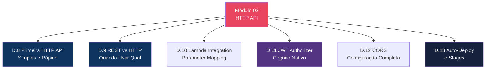
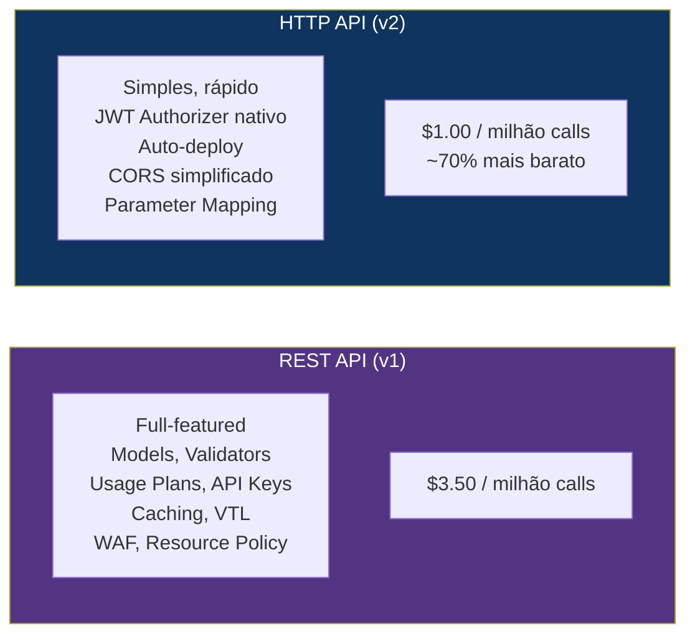
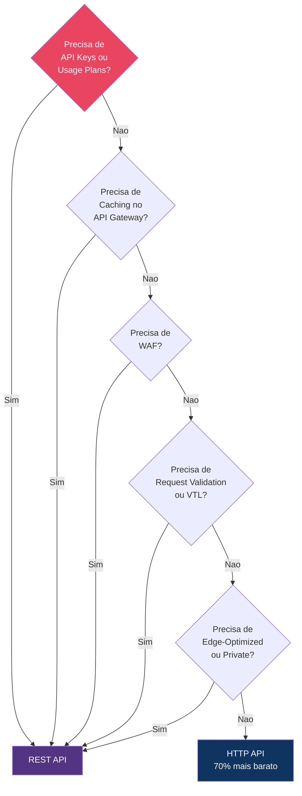
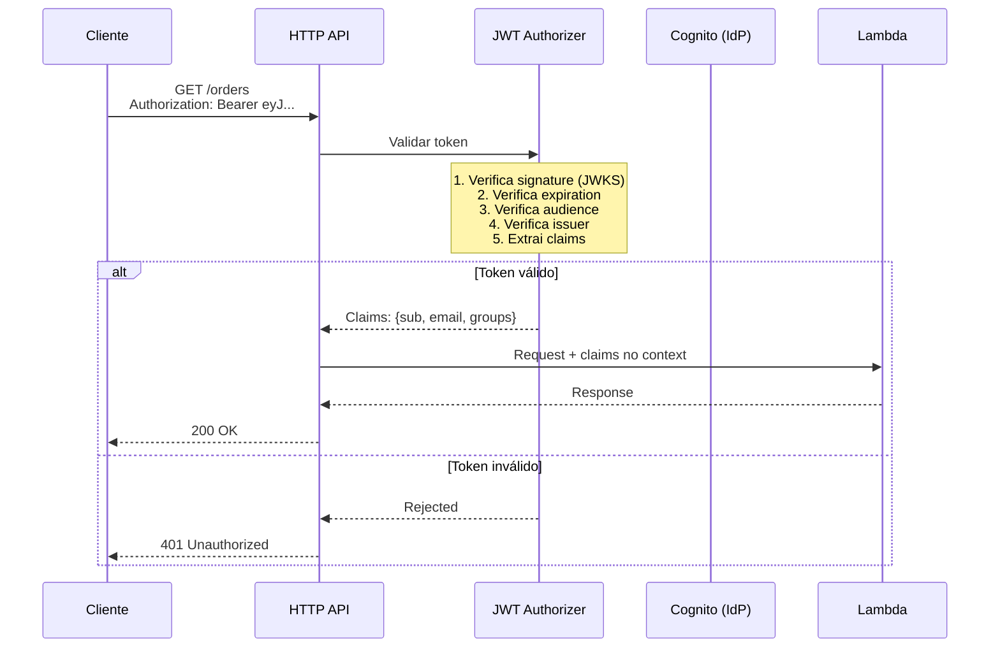
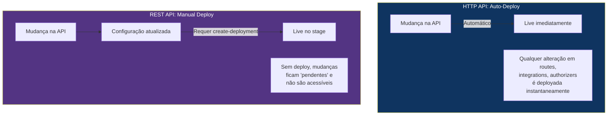

# Módulo 02 — HTTP API

> **Nível:** 100-200 (Foundational/Intermediate)
> **Tempo Total Estimado:** 10-14 horas de labs
> **Custo Estimado:** ~$0 (Free Tier)
> **Objetivo do Módulo:** Dominar HTTP APIs — o tipo mais simples, rápido e barato do API Gateway. Entender quando usar HTTP API vs REST API, configurar JWT authorizer nativo, Lambda integration, CORS simplificado, auto-deploy e parameter mapping.

---

## Mapa do Módulo



---

## Desafio 8: Primeira HTTP API — Simples e Rápido

> **Level:** 100 | **Tempo:** 60 min | **Custo:** $0

### Objetivo

Criar uma HTTP API integrada com Lambda — notar como é mais simples que REST API.

### HTTP API vs REST API — Visão Geral



### Passo a Passo

```bash
# HTTP API: UMA linha para criar API + integration + route + stage
API_ID=$(aws apigatewayv2 create-api \
  --name "orders-api" \
  --protocol-type HTTP \
  --target "arn:aws:lambda:$REGION:$ACCOUNT_ID:function:orders-handler" \
  --query 'ApiId' --output text)

echo "API ID: $API_ID"
echo "URL: https://$API_ID.execute-api.$REGION.amazonaws.com"

# Isso é TUDO. A API já está funcional com:
# - Route: $default (catch-all)
# - Integration: Lambda proxy
# - Stage: $default (auto-deploy)
# - Endpoint: ativo imediatamente
```

Compare com REST API que precisou de ~15 comandos CLI para o mesmo resultado.

Para algo mais estruturado:

```bash
# Criar HTTP API sem target (configurar manualmente)
API_ID=$(aws apigatewayv2 create-api \
  --name "orders-api-v2" \
  --protocol-type HTTP \
  --cors-configuration '{
    "AllowOrigins": ["https://app.meusite.com"],
    "AllowMethods": ["GET", "POST", "PUT", "DELETE"],
    "AllowHeaders": ["Authorization", "Content-Type"],
    "MaxAge": 86400
  }' \
  --query 'ApiId' --output text)

# Criar integration
INTEGRATION_ID=$(aws apigatewayv2 create-integration \
  --api-id "$API_ID" \
  --integration-type AWS_PROXY \
  --integration-uri "arn:aws:lambda:$REGION:$ACCOUNT_ID:function:orders-handler" \
  --payload-format-version "2.0" \
  --query 'IntegrationId' --output text)

# Criar routes
aws apigatewayv2 create-route \
  --api-id "$API_ID" \
  --route-key "GET /orders" \
  --target "integrations/$INTEGRATION_ID"

aws apigatewayv2 create-route \
  --api-id "$API_ID" \
  --route-key "POST /orders" \
  --target "integrations/$INTEGRATION_ID"

aws apigatewayv2 create-route \
  --api-id "$API_ID" \
  --route-key "GET /orders/{id}" \
  --target "integrations/$INTEGRATION_ID"

aws apigatewayv2 create-route \
  --api-id "$API_ID" \
  --route-key "DELETE /orders/{id}" \
  --target "integrations/$INTEGRATION_ID"

# Criar stage com auto-deploy
aws apigatewayv2 create-stage \
  --api-id "$API_ID" \
  --stage-name '$default' \
  --auto-deploy

# Lambda permission
aws lambda add-permission \
  --function-name orders-handler \
  --statement-id httpapi-invoke \
  --action lambda:InvokeFunction \
  --principal apigateway.amazonaws.com \
  --source-arn "arn:aws:execute-api:$REGION:$ACCOUNT_ID:$API_ID/*"

API_URL="https://$API_ID.execute-api.$REGION.amazonaws.com"
echo "API URL: $API_URL"
```

### Payload Format Version 2.0

HTTP API usa **payload format 2.0** — mais limpo que o format 1.0 do REST API:

```json
{
  "version": "2.0",
  "routeKey": "GET /orders/{id}",
  "rawPath": "/orders/abc-123",
  "rawQueryString": "status=active",
  "headers": {
    "accept": "application/json",
    "authorization": "Bearer eyJ..."
  },
  "queryStringParameters": {
    "status": "active"
  },
  "pathParameters": {
    "id": "abc-123"
  },
  "requestContext": {
    "accountId": "111111111111",
    "apiId": "api123",
    "domainName": "api123.execute-api.us-east-1.amazonaws.com",
    "http": {
      "method": "GET",
      "path": "/orders/abc-123",
      "sourceIp": "203.0.113.50"
    },
    "requestId": "req-123",
    "stage": "$default",
    "time": "2026-04-11T12:00:00Z"
  },
  "isBase64Encoded": false
}
```

```python
# Lambda handler para HTTP API (payload 2.0)
def handler(event, context):
    # HTTP API 2.0: mais limpo
    route_key = event['routeKey']         # "GET /orders/{id}"
    path_params = event.get('pathParameters', {})
    query_params = event.get('queryStringParameters', {})
    headers = event.get('headers', {})

    # Resposta simplificada (HTTP API aceita string direta)
    return {
        'statusCode': 200,
        'body': json.dumps({'order_id': path_params.get('id')})
    }
    # Nota: headers são opcionais no format 2.0
    # Content-Type: application/json é inferido automaticamente
```

### Como Testar

```bash
# Criar order
curl -s -X POST "$API_URL/orders" \
  -H "Content-Type: application/json" \
  -d '{"product": "Widget", "quantity": 5}' | jq .

# Listar orders
curl -s "$API_URL/orders" | jq .

# Buscar por ID
curl -s "$API_URL/orders/abc-123" | jq .

# CORS preflight
curl -s -X OPTIONS "$API_URL/orders" \
  -H "Origin: https://app.meusite.com" \
  -H "Access-Control-Request-Method: POST" -I
```

### O Que Aprendemos

| Conceito | Detalhe |
|----------|---------|
| HTTP API | API Gateway v2 — simples, rápido, barato |
| `--target` | Cria API + route + integration + stage em 1 comando |
| Payload 2.0 | Formato mais limpo que REST API (v1.0) |
| `$default` stage | Stage padrão com auto-deploy |
| Route key | `METHOD /path` (ex: `GET /orders/{id}`) |
| Sem deploy manual | Auto-deploy: mudanças são aplicadas imediatamente |

> **💡 Expert Tip:** Para novos projetos com Lambda backend, comece SEMPRE com HTTP API. É 70% mais barato, mais rápido para configurar, e tem JWT authorizer nativo. Migre para REST API SOMENTE se precisar de: caching, WAF, API Keys/Usage Plans, request validation, VTL transformation ou resource policies. Na prática, HTTP API cobre 80% dos casos de uso.

---

## Desafio 9: REST API vs HTTP API — Quando Usar Qual

> **Level:** 100 | **Tempo:** 60 min | **Custo:** $0

### Objetivo

Entender as diferenças detalhadas entre REST API e HTTP API para tomar a decisão correta em cada projeto.

### Comparativo Detalhado

| Feature | REST API | HTTP API |
|---------|----------|----------|
| **Preço** | $3.50/M calls | $1.00/M calls |
| **Latência** | ~10-30ms overhead | ~5-10ms overhead |
| **Endpoint types** | Edge, Regional, Private | Regional |
| **Integrations** | Lambda, HTTP, AWS, Mock, VPC Link | Lambda, HTTP, ALB/NLB, VPC Link, Step Functions |
| **Auth: Cognito** | Cognito Authorizer | JWT Authorizer (Cognito + qualquer OIDC) |
| **Auth: Lambda** | Token + Request based | Request based (v2 payload) |
| **Auth: IAM** | SigV4 | SigV4 |
| **API Keys** | Sim | Nao |
| **Usage Plans** | Sim | Nao |
| **Request Validation** | Models + Validators | Nao |
| **Caching** | Sim (0.5GB-237GB) | Nao |
| **WAF** | Sim | Nao |
| **Resource Policies** | Sim | Nao |
| **VTL Transformation** | Sim | Parameter Mapping (limitado) |
| **CORS** | Manual (OPTIONS mock) | Nativo (configuracao simplificada) |
| **Auto-deploy** | Nao | Sim |
| **Custom domain** | Sim (TLS 1.0+) | Sim (TLS 1.2 only) |
| **OpenAPI import** | Sim | Sim |
| **Canary deploy** | Sim | Nao |
| **Mutual TLS** | Sim | Sim |
| **Payload format** | 1.0 | 1.0 e 2.0 |
| **Throttling** | Account + Stage + Method | Account + Route |

### Decision Framework



### O Que Aprendemos

| Conceito | Detalhe |
|----------|---------|
| REST API | Full-featured, mais caro — APIs publicas com controle granular |
| HTTP API | Simples, barato — APIs internas, microservices, Lambda backend |
| Decision | Se nao precisa de caching/WAF/API keys → HTTP API |
| Migracao | Pode comecar com HTTP e migrar para REST se necessario |

> **💡 Expert Tip:** O erro mais caro que vejo em empresas: usar REST API para TUDO, incluindo APIs internas que só são acessadas por outros serviços AWS. Uma empresa com 100M calls/mês economiza $2.500/mês ($30K/ano) simplesmente trocando APIs internas de REST para HTTP. O esforço de migração é ~1 dia por API.

---

## Desafio 10: Lambda Integration e Parameter Mapping

> **Level:** 200 | **Tempo:** 90 min | **Custo:** $0

### Objetivo

Dominar **Parameter Mapping** no HTTP API — a alternativa simplificada ao VTL do REST API para transformar requests e responses.

### Parameter Mapping vs VTL

```
┌──────────────────────────────────────────────────────────────────┐
│  REST API: VTL (Velocity Template Language)                       │
│  ├── Linguagem de template completa                              │
│  ├── Loops, condicionais, variáveis                              │
│  ├── Complexo mas poderoso                                       │
│  └── Ex: #foreach($item in $list) ... #end                      │
│                                                                   │
│  HTTP API: Parameter Mapping                                      │
│  ├── Operações simples de mapeamento                             │
│  ├── Append, Overwrite, Remove headers/query/status              │
│  ├── Simples mas limitado                                         │
│  └── Ex: overwrite:header.X-Custom = $request.header.Authorization│
└──────────────────────────────────────────────────────────────────┘
```

### Exemplos de Parameter Mapping

```bash
# Adicionar header customizado ao request para o backend
aws apigatewayv2 update-integration \
  --api-id "$API_ID" \
  --integration-id "$INTEGRATION_ID" \
  --request-parameters '{
    "append:header.X-Request-Source": "api-gateway",
    "overwrite:header.X-Forwarded-Stage": "$context.stage",
    "overwrite:header.X-Request-Id": "$context.requestId",
    "remove:header.Cookie": ""
  }'

# Transformar response (adicionar headers CORS customizados)
aws apigatewayv2 update-integration \
  --api-id "$API_ID" \
  --integration-id "$INTEGRATION_ID" \
  --response-parameters '{
    "200": {
      "append:header.X-Powered-By": "api-gateway-http",
      "overwrite:header.Cache-Control": "max-age=300"
    },
    "500": {
      "overwrite:statuscode": "503"
    }
  }'
```

### Terraform — HTTP API Completa

```hcl
# HTTP API
resource "aws_apigatewayv2_api" "orders" {
  name          = "orders-api"
  protocol_type = "HTTP"
  description   = "Orders HTTP API"

  cors_configuration {
    allow_headers = ["Authorization", "Content-Type"]
    allow_methods = ["GET", "POST", "PUT", "DELETE", "OPTIONS"]
    allow_origins = ["https://app.meusite.com"]
    max_age       = 86400
  }

  tags = {
    Environment = var.environment
    ManagedBy   = "terraform"
  }
}

# Lambda Integration
resource "aws_apigatewayv2_integration" "orders" {
  api_id                 = aws_apigatewayv2_api.orders.id
  integration_type       = "AWS_PROXY"
  integration_uri        = aws_lambda_function.orders.invoke_arn
  payload_format_version = "2.0"

  request_parameters = {
    "append:header.X-Source"    = "api-gateway"
    "overwrite:header.X-Stage" = "$context.stage"
  }
}

# Routes
resource "aws_apigatewayv2_route" "get_orders" {
  api_id    = aws_apigatewayv2_api.orders.id
  route_key = "GET /orders"
  target    = "integrations/${aws_apigatewayv2_integration.orders.id}"
}

resource "aws_apigatewayv2_route" "post_orders" {
  api_id    = aws_apigatewayv2_api.orders.id
  route_key = "POST /orders"
  target    = "integrations/${aws_apigatewayv2_integration.orders.id}"
}

resource "aws_apigatewayv2_route" "get_order" {
  api_id    = aws_apigatewayv2_api.orders.id
  route_key = "GET /orders/{id}"
  target    = "integrations/${aws_apigatewayv2_integration.orders.id}"
}

# Stage com auto-deploy
resource "aws_apigatewayv2_stage" "default" {
  api_id      = aws_apigatewayv2_api.orders.id
  name        = "$default"
  auto_deploy = true

  access_log_settings {
    destination_arn = aws_cloudwatch_log_group.api.arn
    format = jsonencode({
      requestId      = "$context.requestId"
      ip             = "$context.identity.sourceIp"
      httpMethod     = "$context.httpMethod"
      routeKey       = "$context.routeKey"
      status         = "$context.status"
      protocol       = "$context.protocol"
      responseLength = "$context.responseLength"
      integrationLatency = "$context.integrationLatency"
    })
  }

  default_route_settings {
    throttling_burst_limit = 100
    throttling_rate_limit  = 50
  }
}

# Lambda permission
resource "aws_lambda_permission" "httpapi" {
  statement_id  = "AllowHTTPAPIInvoke"
  action        = "lambda:InvokeFunction"
  function_name = aws_lambda_function.orders.function_name
  principal     = "apigateway.amazonaws.com"
  source_arn    = "${aws_apigatewayv2_api.orders.execution_arn}/*"
}

output "api_url" {
  value = aws_apigatewayv2_stage.default.invoke_url
}
```

### O Que Aprendemos

| Conceito | Detalhe |
|----------|---------|
| Parameter Mapping | Append, overwrite, remove headers/query/status |
| `$context` variables | requestId, stage, identity, integrationLatency |
| `$request` variables | header, querystring, path params do request |
| Payload 2.0 | Mais limpo, Content-Type inferido, headers opcionais |

---

## Desafio 11: JWT Authorizer Nativo (Cognito)

> **Level:** 200 | **Tempo:** 90 min | **Custo:** $0

### Objetivo

Configurar **JWT Authorizer** nativo do HTTP API — verifica tokens JWT (Cognito, Auth0, Okta, qualquer OIDC provider) sem Lambda Authorizer.

### Como Funciona



### Configurar JWT Authorizer

```bash
# Criar JWT Authorizer (Cognito)
AUTH_ID=$(aws apigatewayv2 create-authorizer \
  --api-id "$API_ID" \
  --authorizer-type JWT \
  --name "cognito-jwt" \
  --identity-source '$request.header.Authorization' \
  --jwt-configuration '{
    "Audience": ["'$COGNITO_CLIENT_ID'"],
    "Issuer": "https://cognito-idp.'$REGION'.amazonaws.com/'$USER_POOL_ID'"
  }' \
  --query 'AuthorizerId' --output text)

echo "Authorizer ID: $AUTH_ID"

# Associar authorizer a uma route
aws apigatewayv2 update-route \
  --api-id "$API_ID" \
  --route-id "$ROUTE_ID" \
  --authorization-type JWT \
  --authorizer-id "$AUTH_ID" \
  --authorization-scopes "openid" "email"
```

### Terraform

```hcl
# JWT Authorizer
resource "aws_apigatewayv2_authorizer" "cognito" {
  api_id           = aws_apigatewayv2_api.orders.id
  authorizer_type  = "JWT"
  name             = "cognito-jwt"
  identity_sources = ["$request.header.Authorization"]

  jwt_configuration {
    audience = [aws_cognito_user_pool_client.api.id]
    issuer   = "https://cognito-idp.${var.region}.amazonaws.com/${aws_cognito_user_pool.main.id}"
  }
}

# Route com authorizer
resource "aws_apigatewayv2_route" "get_orders_auth" {
  api_id             = aws_apigatewayv2_api.orders.id
  route_key          = "GET /orders"
  target             = "integrations/${aws_apigatewayv2_integration.orders.id}"
  authorizer_id      = aws_apigatewayv2_authorizer.cognito.id
  authorization_type = "JWT"
  authorization_scopes = ["openid"]
}

# Route pública (sem auth) — health check
resource "aws_apigatewayv2_route" "health" {
  api_id    = aws_apigatewayv2_api.orders.id
  route_key = "GET /health"
  target    = "integrations/${aws_apigatewayv2_integration.health.id}"
  # Sem authorizer — pública
}
```

### Testar

```bash
# Sem token (deve retornar 401)
curl -s -o /dev/null -w "%{http_code}" "$API_URL/orders"
# 401

# Com token válido
TOKEN=$(aws cognito-idp initiate-auth \
  --auth-flow USER_PASSWORD_AUTH \
  --client-id "$COGNITO_CLIENT_ID" \
  --auth-parameters USERNAME=user@email.com,PASSWORD=Senh@123 \
  --query 'AuthenticationResult.AccessToken' --output text)

curl -s -H "Authorization: Bearer $TOKEN" "$API_URL/orders" | jq .
# 200 OK

# Acessar claims no Lambda (event.requestContext.authorizer.jwt.claims)
```

### Acessar Claims no Lambda

```python
def handler(event, context):
    # HTTP API JWT Authorizer: claims no requestContext
    claims = event['requestContext']['authorizer']['jwt']['claims']

    user_id = claims['sub']
    email = claims.get('email', 'N/A')
    groups = claims.get('cognito:groups', [])

    return {
        'statusCode': 200,
        'body': json.dumps({
            'user_id': user_id,
            'email': email,
            'groups': groups,
            'message': f'Hello {email}!'
        })
    }
```

### O Que Aprendemos

| Conceito | Detalhe |
|----------|---------|
| JWT Authorizer | Validação nativa de JWT sem Lambda — zero código, zero custo extra |
| JWKS | JSON Web Key Set — API GW busca as public keys do IdP automaticamente |
| Audience | Client ID do Cognito (ou app registration no IdP) |
| Issuer | URL do IdP (Cognito, Auth0, Okta) |
| Authorization Scopes | Scopes OAuth2 requeridos (openid, email, profile, custom) |
| Claims | Dados do usuário extraídos do token (sub, email, groups) |

> **💡 Expert Tip:** JWT Authorizer do HTTP API funciona com QUALQUER provedor OIDC — não apenas Cognito. Auth0, Okta, Azure AD, Google, Firebase Auth — todos funcionam. Basta configurar o issuer URL e audience. Isso torna HTTP API a melhor opção para APIs que precisam de auth federada. No REST API, você precisaria de Lambda Authorizer para a mesma funcionalidade.

---

## Desafio 12: CORS — Configuração Completa

> **Level:** 100 | **Tempo:** 60 min | **Custo:** $0

### Objetivo

Configurar **CORS** no HTTP API — comparar com a configuração manual do REST API e entender por que é muito mais simples.

### CORS: REST API vs HTTP API

```
┌──────────────────────────────────────────────────────────────────┐
│  REST API — CORS manual (trabalhoso):                             │
│  ├── Criar OPTIONS method em CADA resource                       │
│  ├── Configurar MOCK integration                                 │
│  ├── Definir method response com CORS headers                    │
│  ├── Definir integration response com CORS headers               │
│  ├── Lambda TAMBÉM deve retornar CORS headers                    │
│  └── ~15 linhas de CLI por resource                              │
│                                                                   │
│  HTTP API — CORS nativo (simples):                                │
│  ├── UMA configuração no nível da API                            │
│  ├── Preflight (OPTIONS) é automático                            │
│  ├── Lambda NÃO precisa retornar CORS headers                   │
│  └── 1 bloco de configuração                                     │
└──────────────────────────────────────────────────────────────────┘
```

```hcl
# HTTP API: CORS em 1 bloco
resource "aws_apigatewayv2_api" "app" {
  name          = "app-api"
  protocol_type = "HTTP"

  cors_configuration {
    allow_origins     = ["https://app.meusite.com", "http://localhost:3000"]
    allow_methods     = ["GET", "POST", "PUT", "DELETE", "OPTIONS"]
    allow_headers     = ["Authorization", "Content-Type", "X-Request-Id"]
    expose_headers    = ["X-Request-Id", "X-RateLimit-Remaining"]
    allow_credentials = true
    max_age           = 86400  # Cache preflight por 24h
  }
}
```

### O Que Aprendemos

| Conceito | Detalhe |
|----------|---------|
| CORS nativo | HTTP API configura CORS no nível da API (não por resource) |
| Preflight automático | OPTIONS handling é automático — sem MOCK integration |
| Lambda simplificado | Lambda não precisa retornar headers CORS |
| `allow_credentials` | `true` se usar cookies/auth headers (requer origins específicos, não `*`) |
| `max_age` | Tempo em segundos que o browser cacheia o preflight response |

---

## Desafio 13: Auto-Deploy e Stages

> **Level:** 100 | **Tempo:** 60 min | **Custo:** $0

### Objetivo

Entender **auto-deploy** e gerenciamento de **stages** no HTTP API.

### Auto-Deploy vs Manual Deploy



```bash
# Criar stage com auto-deploy
aws apigatewayv2 create-stage \
  --api-id "$API_ID" \
  --stage-name "prod" \
  --auto-deploy

# Criar stage SEM auto-deploy (controle manual)
aws apigatewayv2 create-stage \
  --api-id "$API_ID" \
  --stage-name "staging" \
  --no-auto-deploy

# Para staging: deploy manual quando pronto
aws apigatewayv2 create-deployment \
  --api-id "$API_ID" \
  --stage-name "staging"

# Stage variables
aws apigatewayv2 update-stage \
  --api-id "$API_ID" \
  --stage-name "prod" \
  --stage-variables '{
    "lambdaAlias": "prod",
    "tableName": "orders-prod",
    "logLevel": "ERROR"
  }'
```

### Terraform — Multi-Stage

```hcl
# Stage: $default (dev) com auto-deploy
resource "aws_apigatewayv2_stage" "dev" {
  api_id      = aws_apigatewayv2_api.orders.id
  name        = "$default"
  auto_deploy = true

  stage_variables = {
    lambdaAlias = "dev"
    tableName   = "orders-dev"
    logLevel    = "DEBUG"
  }

  default_route_settings {
    throttling_burst_limit = 50
    throttling_rate_limit  = 25
  }
}

# Stage: prod SEM auto-deploy (controle manual)
resource "aws_apigatewayv2_stage" "prod" {
  api_id      = aws_apigatewayv2_api.orders.id
  name        = "prod"
  auto_deploy = false
  deployment_id = aws_apigatewayv2_deployment.prod.id

  stage_variables = {
    lambdaAlias = "prod"
    tableName   = "orders-prod"
    logLevel    = "ERROR"
  }

  default_route_settings {
    throttling_burst_limit = 500
    throttling_rate_limit  = 200
  }

  access_log_settings {
    destination_arn = aws_cloudwatch_log_group.api_prod.arn
    format = jsonencode({
      requestId = "$context.requestId"
      ip        = "$context.identity.sourceIp"
      method    = "$context.httpMethod"
      route     = "$context.routeKey"
      status    = "$context.status"
      latency   = "$context.integrationLatency"
    })
  }
}
```

### O Que Aprendemos

| Conceito | Detalhe |
|----------|---------|
| Auto-deploy | Mudanças são aplicadas instantaneamente (bom para dev) |
| Manual deploy | Controle total de quando mudanças vão ao ar (bom para prod) |
| Stage variables | Variáveis por stage (Lambda alias, table name, log level) |
| Throttling por stage | Burst e rate limit diferentes por ambiente |
| `$default` stage | Stage especial — URL sem prefixo de stage |

> **💡 Expert Tip:** Use auto-deploy para `$default` (dev) e deploy manual para `prod`. Assim, desenvolvimento é ágil (mudanças imediatas) mas produção é controlada (deploy explícito). Stage variables permitem apontar para Lambda aliases diferentes — `dev` → $LATEST, `prod` → alias `prod` com versão fixa.

---

## Resumo do Módulo 02

```
┌──────────────────────────────────────────────────────────────┐
│               MÓDULO 02 — CONQUISTAS                          │
│                                                               │
│  ✅ Desafio 8: Primeira HTTP API                             │
│     1 comando para criar API funcional, payload 2.0          │
│                                                               │
│  ✅ Desafio 9: REST vs HTTP — Decision Framework             │
│     Comparativo detalhado, quando usar qual                  │
│                                                               │
│  ✅ Desafio 10: Parameter Mapping                            │
│     Append/overwrite/remove headers, Terraform completo      │
│                                                               │
│  ✅ Desafio 11: JWT Authorizer Nativo                        │
│     Cognito + qualquer OIDC, claims no Lambda, scopes        │
│                                                               │
│  ✅ Desafio 12: CORS Simplificado                            │
│     1 bloco vs 15 linhas CLI, preflight automático           │
│                                                               │
│  ✅ Desafio 13: Auto-Deploy e Stages                         │
│     Auto-deploy dev, manual deploy prod, stage variables     │
│                                                               │
│  Próximo: Módulo 03 — Integrações Avançadas                  │
│  (Step Functions, DynamoDB direto, VPC Link, SQS)            │
└──────────────────────────────────────────────────────────────┘
```

**Próximo:** [Módulo 03 — Integrações Avançadas →](modulo-03-integrations.md)
