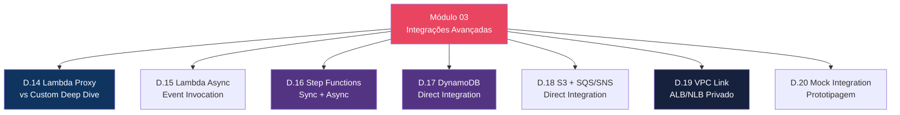
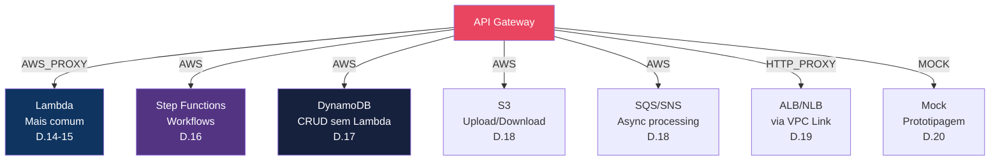
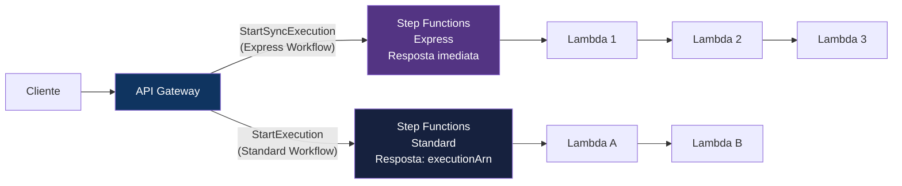
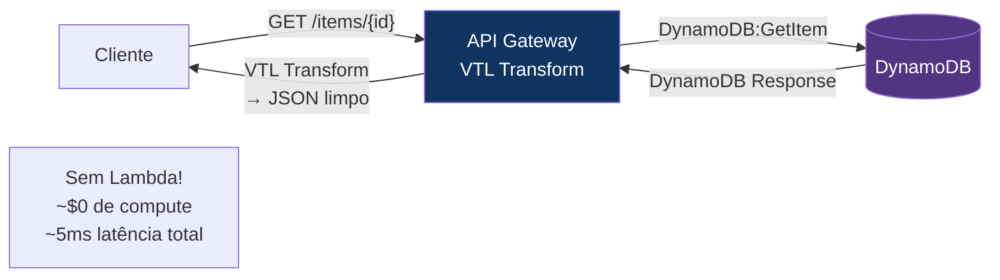
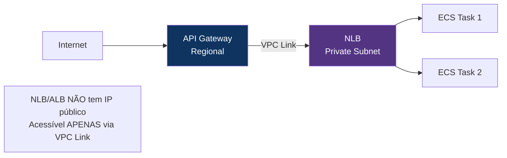

# Módulo 03 — Integrações Avançadas

> **Nível:** 200 (Intermediate)
> **Tempo Total Estimado:** 12-16 horas de labs
> **Custo Estimado:** ~$2-5 (Step Functions, DynamoDB)
> **Objetivo do Módulo:** Dominar todas as integrações do API Gateway — Lambda proxy e custom, Step Functions (sync e async), DynamoDB e S3 direto (sem Lambda), SQS/SNS para processamento assíncrono, VPC Link para backends privados e Mock integration para prototipagem.

---

## Mapa do Módulo



---

## Mapa de Integrações



---

## Desafio 14: Lambda Proxy vs Custom — Deep Dive

> **Level:** 200 | **Tempo:** 90 min | **Custo:** $0

### Objetivo

Aprofundar nas diferenças entre Lambda Proxy (`AWS_PROXY`) e Lambda Custom (`AWS`) com exemplos práticos de quando cada um é a escolha certa.

### Lambda Proxy: Event Format 1.0 vs 2.0

```python
# FORMAT 1.0 (REST API — AWS_PROXY)
# Lambda recebe:
event_v1 = {
    "resource": "/users/{id}",
    "path": "/users/abc-123",
    "httpMethod": "GET",
    "headers": {"Authorization": "Bearer eyJ..."},
    "queryStringParameters": {"status": "active"},
    "pathParameters": {"id": "abc-123"},
    "body": None,
    "isBase64Encoded": False,
    "requestContext": {
        "resourceId": "abcdef",
        "stage": "prod",
        "requestId": "req-123",
        "identity": {"sourceIp": "203.0.113.50"}
    }
}

# FORMAT 2.0 (HTTP API — AWS_PROXY com payloadFormatVersion: "2.0")
# Lambda recebe:
event_v2 = {
    "version": "2.0",
    "routeKey": "GET /users/{id}",
    "rawPath": "/users/abc-123",
    "rawQueryString": "status=active",
    "headers": {"authorization": "Bearer eyJ..."},  # lowercase!
    "queryStringParameters": {"status": "active"},
    "pathParameters": {"id": "abc-123"},
    "requestContext": {
        "http": {
            "method": "GET",
            "path": "/users/abc-123",
            "sourceIp": "203.0.113.50"
        },
        "stage": "$default",
        "requestId": "req-123",
        "authorizer": {
            "jwt": {
                "claims": {"sub": "user-id-123", "email": "user@email.com"}
            }
        }
    },
    "isBase64Encoded": False
}
```

### Lambda Custom Integration — Quando Usar

```
Cenários para Custom Integration (AWS):
├── 1. Integração direta com DynamoDB (sem Lambda) → Desafio 17
├── 2. Integração direta com SQS/SNS (sem Lambda) → Desafio 18
├── 3. Backend legado que espera formato XML
├── 4. Precisa transformar resposta antes de enviar ao client
└── 5. Quer ocultar campos da resposta do backend
```

### O Que Aprendemos

| Conceito | Detalhe |
|----------|---------|
| Payload 1.0 | REST API format — headers case-sensitive, requestContext flat |
| Payload 2.0 | HTTP API format — headers lowercase, http nested, authorizer.jwt |
| Proxy sempre | Use para Lambda backends (90%+ dos casos) |
| Custom quando | Integração direta com AWS services OU transformação de payload |

---

## Desafio 15: Lambda Async Invocation (Event)

> **Level:** 200 | **Tempo:** 60 min | **Custo:** $0

### Objetivo

Configurar invocação **assíncrona** da Lambda via API Gateway — o API Gateway retorna 200 imediatamente e a Lambda processa em background.

### Sync vs Async

```mermaid
sequenceDiagram
    participant C as Cliente
    participant API as API Gateway
    participant L as Lambda

    rect rgb(15, 52, 96)
        Note over C,L: SYNC (padrão — RequestResponse)
        C->>API: POST /process
        API->>L: Invoke (sync)
        Note over L: Processa 5 segundos
        L-->>API: Response
        API-->>C: 200 OK + body (5s depois)
    end

    rect rgb(83, 52, 131)
        Note over C,L: ASYNC (Event)
        C->>API: POST /process-async
        API->>L: Invoke (Event)
        API-->>C: 202 Accepted (imediato!)
        Note over L: Processa em background
    end
```



```bash
# REST API: Integration com invocação async
aws apigateway put-integration \
  --rest-api-id "$API_ID" \
  --resource-id "$RESOURCE_ID" \
  --http-method POST \
  --type AWS \
  --integration-http-method POST \
  --uri "arn:aws:apigateway:$REGION:lambda:path/2015-03-31/functions/$LAMBDA_ARN/invocations" \
  --request-parameters '{"integration.request.header.X-Amz-Invocation-Type": "'\''Event'\''"}'
  # X-Amz-Invocation-Type: Event = async!
```

```hcl
# Terraform: Lambda async via header
resource "aws_api_gateway_integration" "async" {
  rest_api_id             = aws_api_gateway_rest_api.main.id
  resource_id             = aws_api_gateway_resource.process.id
  http_method             = "POST"
  integration_http_method = "POST"
  type                    = "AWS"
  uri                     = aws_lambda_function.processor.invoke_arn

  request_parameters = {
    "integration.request.header.X-Amz-Invocation-Type" = "'Event'"
  }
}
```

### O Que Aprendemos

| Conceito | Detalhe |
|----------|---------|
| Sync (RequestResponse) | API GW espera Lambda responder (max 29s) |
| Async (Event) | API GW retorna 202 imediatamente, Lambda processa em background |
| `X-Amz-Invocation-Type` | Header que controla o tipo de invocação |
| DLQ | Configure Dead Letter Queue na Lambda para capturar falhas async |
| Quando usar async | Processamento longo, envio de emails, geração de relatórios |

---

## Desafio 16: Step Functions Integration (Sync + Async)

> **Level:** 200 | **Tempo:** 120 min | **Custo:** ~$1

### Objetivo

Integrar API Gateway com **AWS Step Functions** para orquestração de workflows — tanto síncrono (Express) quanto assíncrono (Standard).

### Arquitetura



```hcl
# HTTP API → Step Functions (Express, sync)
resource "aws_apigatewayv2_integration" "sfn_sync" {
  api_id                 = aws_apigatewayv2_api.main.id
  integration_type       = "AWS_PROXY"
  integration_subtype    = "StepFunctions-StartSyncExecution"
  payload_format_version = "1.0"
  credentials_arn        = aws_iam_role.apigw_sfn.arn

  request_parameters = {
    "StateMachineArn" = aws_sfn_state_machine.order_workflow.arn
    "Input"           = "$request.body"
  }
}

resource "aws_apigatewayv2_route" "create_order" {
  api_id    = aws_apigatewayv2_api.main.id
  route_key = "POST /orders"
  target    = "integrations/${aws_apigatewayv2_integration.sfn_sync.id}"
}
```

### O Que Aprendemos

| Conceito | Detalhe |
|----------|---------|
| Express Workflow | Sync — resposta em até 5 min, ideal para APIs |
| Standard Workflow | Async — retorna executionArn, ideal para processos longos |
| `integration_subtype` | HTTP API suporta Step Functions diretamente |
| Sem Lambda | API GW → Step Functions → DynamoDB/SQS — sem Lambda no meio |

---

## Desafio 17: DynamoDB Direct Integration (sem Lambda)

> **Level:** 200 | **Tempo:** 90 min | **Custo:** ~$0.50

### Objetivo

Integrar API Gateway **diretamente** com DynamoDB — sem Lambda no meio. Reduz custo, latência e complexidade para operações CRUD simples.

### Arquitetura



### Terraform — CRUD Completo sem Lambda

```hcl
# IAM Role para API GW acessar DynamoDB
resource "aws_iam_role" "apigw_dynamodb" {
  name = "apigw-dynamodb-role"
  assume_role_policy = jsonencode({
    Version = "2012-10-17"
    Statement = [{
      Effect    = "Allow"
      Principal = { Service = "apigateway.amazonaws.com" }
      Action    = "sts:AssumeRole"
    }]
  })
}

resource "aws_iam_role_policy" "apigw_dynamodb" {
  name = "dynamodb-access"
  role = aws_iam_role.apigw_dynamodb.id
  policy = jsonencode({
    Version = "2012-10-17"
    Statement = [{
      Effect   = "Allow"
      Action   = ["dynamodb:GetItem", "dynamodb:PutItem", "dynamodb:DeleteItem", "dynamodb:Scan", "dynamodb:Query"]
      Resource = aws_dynamodb_table.items.arn
    }]
  })
}

# GET /items/{id} → DynamoDB.GetItem
resource "aws_api_gateway_integration" "get_item" {
  rest_api_id             = aws_api_gateway_rest_api.main.id
  resource_id             = aws_api_gateway_resource.item_id.id
  http_method             = "GET"
  integration_http_method = "POST"
  type                    = "AWS"
  uri                     = "arn:aws:apigateway:${var.region}:dynamodb:action/GetItem"
  credentials             = aws_iam_role.apigw_dynamodb.arn

  request_templates = {
    "application/json" = <<-VTL
      {
        "TableName": "${aws_dynamodb_table.items.name}",
        "Key": {
          "id": { "S": "$input.params('id')" }
        }
      }
    VTL
  }
}

resource "aws_api_gateway_integration_response" "get_item" {
  rest_api_id = aws_api_gateway_rest_api.main.id
  resource_id = aws_api_gateway_resource.item_id.id
  http_method = "GET"
  status_code = "200"

  response_templates = {
    "application/json" = <<-VTL
      #set($item = $input.path('$.Item'))
      #if($item == "" || $item == $null)
        #set($context.responseOverride.status = 404)
        {"error": "Item not found"}
      #else
        {
          "id": "$item.id.S",
          "name": "$item.name.S",
          "price": $item.price.N,
          "category": "$item.category.S"
        }
      #end
    VTL
  }
}

# POST /items → DynamoDB.PutItem
resource "aws_api_gateway_integration" "put_item" {
  rest_api_id             = aws_api_gateway_rest_api.main.id
  resource_id             = aws_api_gateway_resource.items.id
  http_method             = "POST"
  integration_http_method = "POST"
  type                    = "AWS"
  uri                     = "arn:aws:apigateway:${var.region}:dynamodb:action/PutItem"
  credentials             = aws_iam_role.apigw_dynamodb.arn

  request_templates = {
    "application/json" = <<-VTL
      {
        "TableName": "${aws_dynamodb_table.items.name}",
        "Item": {
          "id": { "S": "$context.requestId" },
          "name": { "S": $input.json('$.name') },
          "price": { "N": "$input.path('$.price')" },
          "category": { "S": $input.json('$.category') },
          "createdAt": { "S": "$context.requestTime" }
        }
      }
    VTL
  }
}
```

### Quando Usar DynamoDB Direto vs Lambda

| Aspecto | DynamoDB Direto | Lambda + DynamoDB |
|---------|----------------|-------------------|
| **Custo** | $0 compute (só DynamoDB) | Lambda: $0.20/M + DynamoDB |
| **Latência** | ~5-10ms | ~50-200ms (cold start) |
| **Complexidade** | VTL templates (curva de aprendizado) | Código Python/Node.js (familiar) |
| **Lógica de negócio** | Nenhuma (CRUD puro) | Qualquer lógica |
| **Validação** | JSON Schema + VTL básico | Código completo |
| **Quando usar** | CRUD simples, lookup tables, config | Qualquer lógica além de CRUD |

### O Que Aprendemos

| Conceito | Detalhe |
|----------|---------|
| AWS integration | API GW chama DynamoDB diretamente via IAM role |
| VTL request template | Transforma HTTP request → DynamoDB request format |
| VTL response template | Transforma DynamoDB response → JSON limpo |
| Sem Lambda | Zero custo de compute, latência mínima |
| Limitação | Sem lógica de negócio — apenas CRUD direto |

> **💡 Expert Tip:** DynamoDB direct integration é perfeita para tabelas de lookup (configurações, feature flags, traduções) ou APIs simples de CRUD sem lógica. Uma API de feature flags com DynamoDB direto custa ~$0/mês (Free Tier de ambos) e tem latência de ~5ms. Com Lambda no meio, seria ~50ms e $0.20/M calls. Para APIs de alta performance com CRUD simples, eliminar Lambda é um game changer.

---

## Desafio 18: S3 e SQS/SNS — Direct Integration

> **Level:** 200 | **Tempo:** 90 min | **Custo:** ~$0.50

### Objetivo

Integrar API Gateway diretamente com **S3** (upload/download) e **SQS/SNS** (processamento assíncrono) — sem Lambda.

### S3 Direct: Upload via Pre-Signed URL

```hcl
# API GW → S3: gerar pre-signed URL para upload
resource "aws_api_gateway_integration" "s3_upload" {
  rest_api_id             = aws_api_gateway_rest_api.main.id
  resource_id             = aws_api_gateway_resource.upload.id
  http_method             = "PUT"
  integration_http_method = "PUT"
  type                    = "AWS"
  uri                     = "arn:aws:apigateway:${var.region}:s3:path/${aws_s3_bucket.uploads.id}/{key}"
  credentials             = aws_iam_role.apigw_s3.arn

  request_parameters = {
    "integration.request.path.key" = "method.request.path.filename"
  }
}
```

### SQS Direct: Enviar Mensagem sem Lambda

```hcl
# API GW → SQS: enviar mensagem diretamente
resource "aws_api_gateway_integration" "sqs_send" {
  rest_api_id             = aws_api_gateway_rest_api.main.id
  resource_id             = aws_api_gateway_resource.enqueue.id
  http_method             = "POST"
  integration_http_method = "POST"
  type                    = "AWS"
  uri                     = "arn:aws:apigateway:${var.region}:sqs:path/${data.aws_caller_identity.current.account_id}/${aws_sqs_queue.processing.name}"
  credentials             = aws_iam_role.apigw_sqs.arn

  request_parameters = {
    "integration.request.header.Content-Type" = "'application/x-www-form-urlencoded'"
  }

  request_templates = {
    "application/json" = "Action=SendMessage&MessageBody=$input.body"
  }
}
```

### O Que Aprendemos

| Conceito | Detalhe |
|----------|---------|
| S3 direct | Upload/download de arquivos via API GW sem Lambda |
| SQS direct | Enfileirar mensagens sem Lambda — processamento async |
| SNS direct | Publicar em tópico sem Lambda — fan-out pattern |
| IAM credentials | API GW precisa de IAM role para acessar cada serviço |

---

## Desafio 19: VPC Link — ALB/NLB Privado

> **Level:** 200 | **Tempo:** 120 min | **Custo:** ~$2

### Objetivo

Configurar **VPC Link** para conectar API Gateway a backends privados (ALB/NLB dentro de uma VPC) — sem expor o backend à internet.

### Arquitetura



### REST API vs HTTP API — VPC Link

| Aspecto | REST API VPC Link | HTTP API VPC Link |
|---------|-------------------|-------------------|
| Backend | NLB only | ALB, NLB, Cloud Map |
| Criação | `aws apigateway create-vpc-link` | `aws apigatewayv2 create-vpc-link` |
| Config | Integration URI aponta para NLB | Integration URI aponta para ALB/NLB ARN |
| Custo | VPC Link: $0.01/hora | VPC Link v2: $0.01/hora |

```hcl
# HTTP API VPC Link (suporta ALB!)
resource "aws_apigatewayv2_vpc_link" "private" {
  name               = "private-backend"
  security_group_ids = [aws_security_group.vpc_link.id]
  subnet_ids         = aws_subnet.private[*].id

  tags = { Name = "api-vpc-link" }
}

resource "aws_apigatewayv2_integration" "private_alb" {
  api_id                 = aws_apigatewayv2_api.main.id
  integration_type       = "HTTP_PROXY"
  integration_uri        = aws_lb_listener.http.arn
  integration_method     = "ANY"
  connection_type        = "VPC_LINK"
  connection_id          = aws_apigatewayv2_vpc_link.private.id
  payload_format_version = "1.0"
}
```

### O Que Aprendemos

| Conceito | Detalhe |
|----------|---------|
| VPC Link | Ponte privada entre API GW e VPC |
| REST API | VPC Link v1 — apenas NLB |
| HTTP API | VPC Link v2 — ALB, NLB, Cloud Map |
| Private backend | ALB/NLB sem IP público — mais seguro |

> **💡 Expert Tip:** Para microservices com ECS, a combinação HTTP API + VPC Link v2 + ALB é a mais eficiente. O ALB pode ter multiple target groups (um por microservice) e o API GW roteia baseado no path. Isso elimina a necessidade de um API Gateway separado por microservice. Um API GW + 1 VPC Link + 1 ALB + N target groups = arquitetura limpa e barata.

---

## Desafio 20: Mock Integration — Prototipagem

> **Level:** 200 | **Tempo:** 60 min | **Custo:** $0

### Objetivo

Usar **Mock Integration** para prototipar APIs antes de ter o backend pronto — responde com dados fixos configurados no API Gateway.

```bash
# Mock: retornar JSON fixo sem backend
aws apigateway put-integration \
  --rest-api-id "$API_ID" \
  --resource-id "$RESOURCE_ID" \
  --http-method GET \
  --type MOCK \
  --request-templates '{"application/json": "{\"statusCode\": 200}"}'

aws apigateway put-method-response \
  --rest-api-id "$API_ID" \
  --resource-id "$RESOURCE_ID" \
  --http-method GET \
  --status-code 200

aws apigateway put-integration-response \
  --rest-api-id "$API_ID" \
  --resource-id "$RESOURCE_ID" \
  --http-method GET \
  --status-code 200 \
  --response-templates '{
    "application/json": "{\"users\": [{\"id\": \"1\", \"name\": \"Mock User\", \"email\": \"mock@test.com\"}], \"count\": 1}"
  }'
```

### O Que Aprendemos

| Conceito | Detalhe |
|----------|---------|
| Mock Integration | Retorna dados fixos sem backend |
| Use cases | Prototipagem, testes de frontend, documentação |
| CORS OPTIONS | O use case mais comum de Mock (preflight) |
| Custo | $0 — sem Lambda, sem backend |

> **💡 Expert Tip:** Mock integration é subestimada. Em equipes onde frontend e backend trabalham em paralelo, o frontend pode começar a integrar com a API mockada enquanto o backend é desenvolvido. Defina o contrato (OpenAPI spec), crie a API com Mock, e quando o backend estiver pronto, troque Mock por Lambda/HTTP integration sem mudar a API pública.

---

## Resumo do Módulo 03

```
┌──────────────────────────────────────────────────────────────┐
│               MÓDULO 03 — CONQUISTAS                          │
│                                                               │
│  ✅ Desafio 14: Lambda Proxy vs Custom                       │
│     Payload 1.0 vs 2.0, quando usar cada                    │
│                                                               │
│  ✅ Desafio 15: Lambda Async (Event)                         │
│     X-Amz-Invocation-Type: Event, 202 Accepted               │
│                                                               │
│  ✅ Desafio 16: Step Functions Sync + Async                  │
│     Express (sync, <5min), Standard (async)                  │
│                                                               │
│  ✅ Desafio 17: DynamoDB Direct (sem Lambda)                 │
│     CRUD completo com VTL, $0 compute, ~5ms                 │
│                                                               │
│  ✅ Desafio 18: S3 + SQS/SNS Direct                         │
│     Upload, enqueue, publish — tudo sem Lambda               │
│                                                               │
│  ✅ Desafio 19: VPC Link                                     │
│     REST (NLB only), HTTP (ALB+NLB), private backends        │
│                                                               │
│  ✅ Desafio 20: Mock Integration                             │
│     Prototipagem, CORS, frontend-first development           │
│                                                               │
│  Próximo: Módulo 04 — Auth & Security                        │
│  (Cognito, Lambda Authorizer, IAM, mTLS, WAF)               │
└──────────────────────────────────────────────────────────────┘
```

**Próximo:** [Módulo 04 — Auth & Security →](modulo-04-auth-security.md)
