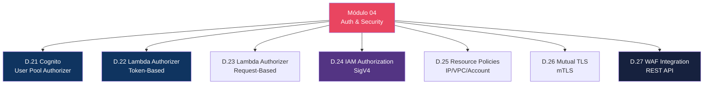
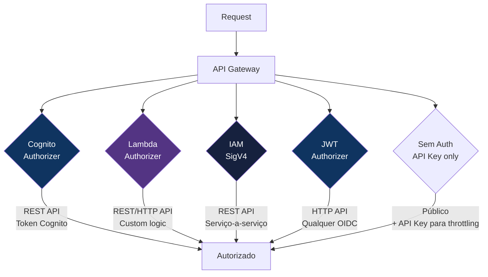
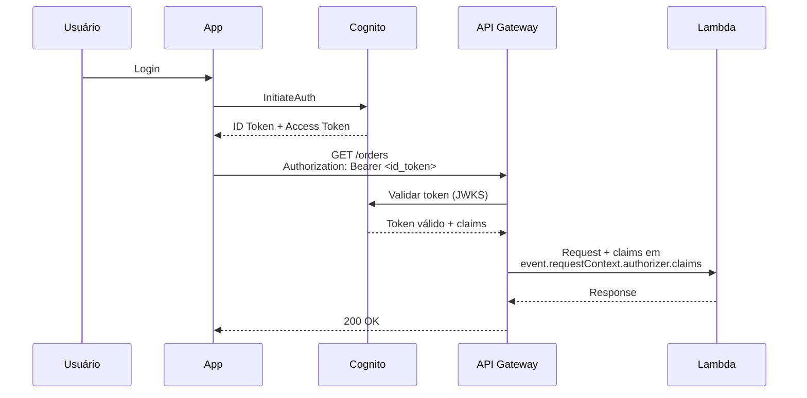
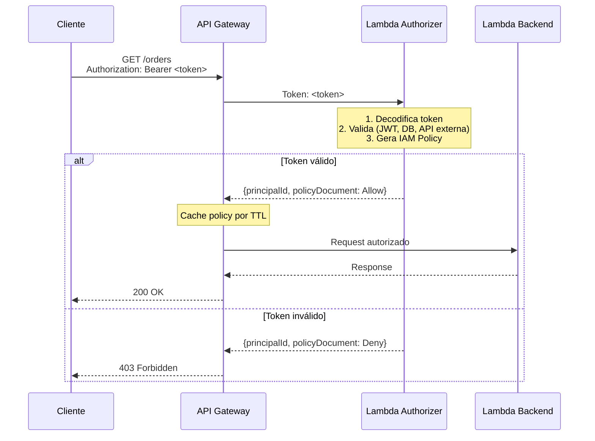
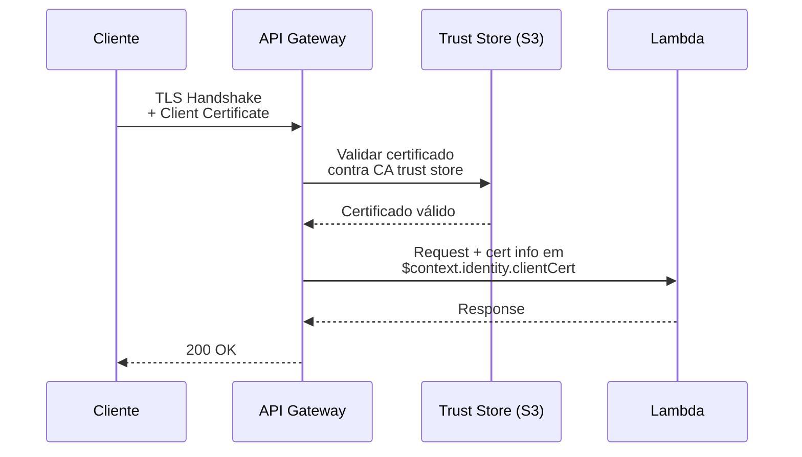
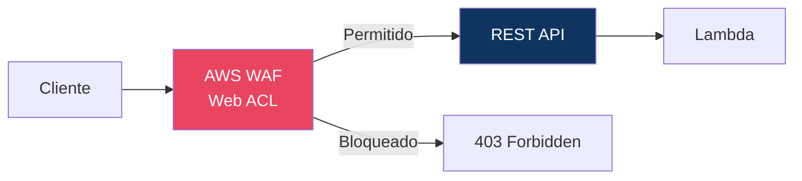

# Módulo 04 — Auth & Security

> **Nível:** 200-300 (Intermediate/Advanced)
> **Tempo Total Estimado:** 12-16 horas de labs
> **Custo Estimado:** ~$2-5 (Cognito, WAF)
> **Objetivo do Módulo:** Dominar todos os mecanismos de autenticação e segurança do API Gateway — Cognito User Pool Authorizer, Lambda Authorizer (token e request), IAM Authorization com SigV4, JWT Authorizer nativo, Resource Policies, mutual TLS e integração com WAF.

---

## Mapa do Módulo



---

## Visão Geral: 5 Métodos de Auth



| Método | API Type | Quando Usar |
|--------|----------|-------------|
| **Cognito Authorizer** | REST API | App com Cognito User Pool |
| **Lambda Authorizer (Token)** | REST API | Token customizado, API key validation |
| **Lambda Authorizer (Request)** | REST/HTTP API | Auth baseado em headers, query params, context |
| **IAM (SigV4)** | REST/HTTP API | Serviço-a-serviço AWS, cross-account |
| **JWT Authorizer** | HTTP API only | Qualquer OIDC: Cognito, Auth0, Okta, Azure AD |

---

## Desafio 21: Cognito User Pool Authorizer

> **Level:** 200 | **Tempo:** 90 min | **Custo:** ~$0

### Objetivo

Configurar **Cognito User Pool Authorizer** no REST API — valida tokens do Cognito automaticamente, sem código.

### Fluxo



### Passo a Passo

```bash
# 1. Criar Cognito Authorizer no REST API
AUTH_ID=$(aws apigateway create-authorizer \
  --rest-api-id "$API_ID" \
  --name "CognitoAuth" \
  --type COGNITO_USER_POOLS \
  --provider-arns "arn:aws:cognito-idp:$REGION:$ACCOUNT_ID:userpool/$USER_POOL_ID" \
  --identity-source "method.request.header.Authorization" \
  --query 'id' --output text)

# 2. Associar ao method
aws apigateway update-method \
  --rest-api-id "$API_ID" \
  --resource-id "$RESOURCE_ID" \
  --http-method GET \
  --patch-operations "op=replace,path=/authorizationType,value=COGNITO_USER_POOLS" \
                     "op=replace,path=/authorizerId,value=$AUTH_ID"

# 3. Re-deploy
aws apigateway create-deployment --rest-api-id "$API_ID" --stage-name dev
```

### Terraform

```hcl
resource "aws_api_gateway_authorizer" "cognito" {
  name          = "CognitoAuth"
  rest_api_id   = aws_api_gateway_rest_api.main.id
  type          = "COGNITO_USER_POOLS"
  provider_arns = [aws_cognito_user_pool.main.arn]

  identity_source = "method.request.header.Authorization"
}

resource "aws_api_gateway_method" "get_orders" {
  rest_api_id   = aws_api_gateway_rest_api.main.id
  resource_id   = aws_api_gateway_resource.orders.id
  http_method   = "GET"
  authorization = "COGNITO_USER_POOLS"
  authorizer_id = aws_api_gateway_authorizer.cognito.id
}
```

### Acessar Claims na Lambda

```python
def handler(event, context):
    # Cognito claims estão em requestContext.authorizer.claims
    claims = event['requestContext']['authorizer']['claims']

    user_id = claims['sub']
    email = claims.get('email', 'N/A')
    groups = claims.get('cognito:groups', '')

    # Autorização: verificar se user tem permissão
    if 'admin' not in groups:
        return {'statusCode': 403, 'body': '{"error": "Admin only"}'}

    return {
        'statusCode': 200,
        'body': json.dumps({'user': email, 'authorized': True})
    }
```

### O Que Aprendemos

| Conceito | Detalhe |
|----------|---------|
| Cognito Authorizer | Valida ID/Access token automaticamente |
| JWKS | API GW busca public keys do Cognito para validar signature |
| Claims | Dados do user: sub, email, groups — disponíveis na Lambda |
| ID Token vs Access Token | ID = user info, Access = permissions/scopes |
| Cache | Authorizer cacheia resultado por TTL configurável (default 300s) |

> **💡 Expert Tip:** Cognito Authorizer aceita ID Token e Access Token, mas o comportamento é diferente. Use **ID Token** quando precisa dos claims do user (email, name, groups) na Lambda. Use **Access Token** quando precisa validar scopes OAuth2. Na prática, ID Token é mais comum para APIs que precisam saber QUEM é o user.

---

## Desafio 22: Lambda Authorizer — Token-Based

> **Level:** 200 | **Tempo:** 90 min | **Custo:** ~$0

### Objetivo

Criar **Lambda Authorizer Token-Based** — uma Lambda que recebe o token e retorna uma IAM policy decidindo se o request é permitido.

### Fluxo



### Lambda Authorizer Code

```python
# authorizer/handler.py
import json
import jwt  # PyJWT
import os

SECRET = os.environ.get('JWT_SECRET', 'my-secret-key')

def handler(event, context):
    """
    Token-based Lambda Authorizer.
    Recebe: event['authorizationToken'] = "Bearer eyJ..."
    Retorna: IAM Policy (Allow ou Deny)
    """
    token = event.get('authorizationToken', '')

    if not token.startswith('Bearer '):
        raise Exception('Unauthorized')  # Retorna 401

    token = token.replace('Bearer ', '')

    try:
        # Decodificar e validar JWT
        payload = jwt.decode(token, SECRET, algorithms=['HS256'])

        user_id = payload['sub']
        role = payload.get('role', 'user')
        email = payload.get('email', '')

        # Gerar policy baseada no role
        effect = 'Allow'

        # Context: dados que serão passados para a Lambda backend
        context_data = {
            'userId': user_id,
            'email': email,
            'role': role
        }

        return generate_policy(user_id, effect, event['methodArn'], context_data)

    except jwt.ExpiredSignatureError:
        raise Exception('Unauthorized')  # Token expirado
    except jwt.InvalidTokenError:
        raise Exception('Unauthorized')  # Token inválido


def generate_policy(principal_id, effect, method_arn, context=None):
    """Gera IAM Policy para o API Gateway."""
    # Extrair ARN base (account/api/stage)
    arn_parts = method_arn.split(':')
    region = arn_parts[3]
    account_id = arn_parts[4]
    api_gw_arn = arn_parts[5].split('/')
    api_id = api_gw_arn[0]
    stage = api_gw_arn[1]

    # Wildcard: autorizar todos os methods/resources desta API
    resource_arn = f"arn:aws:execute-api:{region}:{account_id}:{api_id}/{stage}/*"

    policy = {
        'principalId': principal_id,
        'policyDocument': {
            'Version': '2012-10-17',
            'Statement': [{
                'Action': 'execute-api:Invoke',
                'Effect': effect,
                'Resource': resource_arn
            }]
        }
    }

    if context:
        policy['context'] = context

    return policy
```

### Terraform

```hcl
resource "aws_api_gateway_authorizer" "lambda_token" {
  name                   = "LambdaTokenAuth"
  rest_api_id            = aws_api_gateway_rest_api.main.id
  type                   = "TOKEN"
  authorizer_uri         = aws_lambda_function.authorizer.invoke_arn
  authorizer_credentials = aws_iam_role.apigw_invoke_authorizer.arn

  identity_source               = "method.request.header.Authorization"
  authorizer_result_ttl_in_seconds = 300  # Cache por 5 min
}

# Permissão para API GW invocar a Lambda Authorizer
resource "aws_lambda_permission" "authorizer" {
  statement_id  = "AllowAPIGatewayAuthorizer"
  action        = "lambda:InvokeFunction"
  function_name = aws_lambda_function.authorizer.function_name
  principal     = "apigateway.amazonaws.com"
  source_arn    = "${aws_api_gateway_rest_api.main.execution_arn}/authorizers/${aws_api_gateway_authorizer.lambda_token.id}"
}
```

### Acessar Context na Lambda Backend

```python
# Na Lambda backend, os dados do authorizer estão em:
def handler(event, context):
    auth_context = event['requestContext']['authorizer']

    user_id = auth_context['userId']
    email = auth_context['email']
    role = auth_context['role']

    return {
        'statusCode': 200,
        'body': json.dumps({'user': email, 'role': role})
    }
```

### O Que Aprendemos

| Conceito | Detalhe |
|----------|---------|
| Token Authorizer | Recebe `authorizationToken`, retorna IAM Policy |
| IAM Policy | `Allow` ou `Deny` no `execute-api:Invoke` |
| `principalId` | Identificador do user (sub, email, etc.) |
| Context | Dados extras passados para a Lambda backend |
| TTL Cache | Policy cacheada por TTL — reduz invocações do authorizer |
| Wildcard Resource | `*/stage/*` autoriza todos os endpoints do stage |

> **💡 Expert Tip:** O cache do Lambda Authorizer é por `identitySource` (o valor do token). Se dois requests usam o mesmo token, o segundo não invoca o authorizer — usa a policy cacheada. Isso economiza custo e latência. Mas cuidado: se o token for revogado, o cache continua servindo a policy antiga até o TTL expirar. Para tokens de curta duração (JWT com exp=1h), TTL de 300s é seguro.

---

## Desafio 23: Lambda Authorizer — Request-Based

> **Level:** 200 | **Tempo:** 90 min | **Custo:** ~$0

### Objetivo

Criar **Lambda Authorizer Request-Based** — recebe todo o request context (headers, query params, path params, stage) para tomar decisões de autorização mais complexas.

### Token vs Request Authorizer

| Aspecto | Token-Based | Request-Based |
|---------|------------|---------------|
| **Input** | Apenas o token (1 header) | Todo o request context |
| **Cache key** | Valor do token | Múltiplos valores (headers, params) |
| **Quando usar** | JWT, API key, Bearer token | Multi-factor auth, IP + token, custom logic |
| **HTTP API** | Não suportado | Suportado (v2 payload) |

```python
# Request-based: recebe todo o request
def handler(event, context):
    # event contém: headers, queryStringParameters, pathParameters,
    # stageVariables, requestContext, methodArn

    headers = event.get('headers', {})
    source_ip = event['requestContext']['identity']['sourceIp']

    api_key = headers.get('x-api-key', '')
    auth_token = headers.get('authorization', '').replace('Bearer ', '')
    client_id = headers.get('x-client-id', '')

    # Lógica customizada: validar MÚLTIPLOS fatores
    is_valid = (
        validate_api_key(api_key) and
        validate_token(auth_token) and
        is_ip_allowed(source_ip)
    )

    effect = 'Allow' if is_valid else 'Deny'

    return generate_policy(client_id, effect, event['methodArn'], {
        'clientId': client_id,
        'sourceIp': source_ip
    })
```

```hcl
resource "aws_api_gateway_authorizer" "lambda_request" {
  name                   = "LambdaRequestAuth"
  rest_api_id            = aws_api_gateway_rest_api.main.id
  type                   = "REQUEST"
  authorizer_uri         = aws_lambda_function.request_authorizer.invoke_arn
  authorizer_credentials = aws_iam_role.apigw_invoke_authorizer.arn

  # Cache baseado em múltiplos valores
  identity_source = "method.request.header.Authorization,method.request.header.x-api-key"
  authorizer_result_ttl_in_seconds = 300
}
```

### O Que Aprendemos

| Conceito | Detalhe |
|----------|---------|
| Request Authorizer | Recebe todo o request context (não apenas token) |
| Multi-factor | Pode validar IP + token + API key + custom header juntos |
| Cache key | Combinação de identity sources — mais granular |
| HTTP API | Única opção de Lambda Authorizer para HTTP API |

---

## Desafio 24: IAM Authorization (SigV4)

> **Level:** 200 | **Tempo:** 60 min | **Custo:** $0

### Objetivo

Configurar **IAM Authorization** com **Signature Version 4** — ideal para comunicação serviço-a-serviço na AWS.

### Quando Usar IAM Auth

```
┌──────────────────────────────────────────────────────────────────┐
│  IAM Auth é ideal para:                                          │
│  ├── Lambda A chamando API de Lambda B                          │
│  ├── EC2/ECS chamando API interna                               │
│  ├── Cross-account API access                                   │
│  ├── CI/CD pipeline chamando API de deploy                      │
│  └── Qualquer cenário onde o CALLER é um serviço AWS            │
│                                                                   │
│  NÃO é ideal para:                                              │
│  ├── Usuários humanos (complexo demais)                         │
│  ├── Apps mobile/web (exporia credentials)                      │
│  └── APIs públicas (SigV4 é complexo para clientes externos)    │
└──────────────────────────────────────────────────────────────────┘
```

```bash
# Configurar method com IAM auth
aws apigateway update-method \
  --rest-api-id "$API_ID" \
  --resource-id "$RESOURCE_ID" \
  --http-method GET \
  --patch-operations "op=replace,path=/authorizationType,value=AWS_IAM"

# Chamar com SigV4 via AWS CLI
aws apigateway test-invoke-method \
  --rest-api-id "$API_ID" \
  --resource-id "$RESOURCE_ID" \
  --http-method GET

# Ou via Python (boto3 + requests-aws4auth)
```

```python
# Chamar API com IAM auth via Python
import boto3
from botocore.auth import SigV4Auth
from botocore.awsrequest import AWSRequest
import requests

session = boto3.Session()
credentials = session.get_credentials().get_frozen_credentials()

api_url = "https://API_ID.execute-api.us-east-1.amazonaws.com/prod/orders"

request = AWSRequest(method='GET', url=api_url)
SigV4Auth(credentials, 'execute-api', 'us-east-1').add_auth(request)

response = requests.get(api_url, headers=dict(request.headers))
print(response.json())
```

### O Que Aprendemos

| Conceito | Detalhe |
|----------|---------|
| IAM Auth | Usa SigV4 — assinatura criptográfica do request |
| Serviço-a-serviço | Ideal para Lambda→API, EC2→API, cross-account |
| IAM Policy | Caller precisa de `execute-api:Invoke` permission |
| SigV4 | Assina headers com credentials temporárias (STS) |

---

## Desafio 25: Resource Policies — Restrict by IP/VPC/Account

> **Level:** 300 | **Tempo:** 60 min | **Custo:** $0

### Objetivo

Usar **Resource Policies** para restringir acesso à API por IP, VPC ou conta AWS — funciona como uma bucket policy mas para APIs.

```hcl
# Resource Policy: restringir por IP e VPC
resource "aws_api_gateway_rest_api_policy" "main" {
  rest_api_id = aws_api_gateway_rest_api.main.id
  policy = jsonencode({
    Version = "2012-10-17"
    Statement = [
      {
        Sid       = "AllowFromOfficeIPs"
        Effect    = "Allow"
        Principal = "*"
        Action    = "execute-api:Invoke"
        Resource  = "${aws_api_gateway_rest_api.main.execution_arn}/*"
        Condition = {
          IpAddress = {
            "aws:SourceIp" = ["203.0.113.0/24", "198.51.100.0/24"]
          }
        }
      },
      {
        Sid       = "AllowFromVPC"
        Effect    = "Allow"
        Principal = "*"
        Action    = "execute-api:Invoke"
        Resource  = "${aws_api_gateway_rest_api.main.execution_arn}/*"
        Condition = {
          StringEquals = {
            "aws:SourceVpc" = var.vpc_id
          }
        }
      },
      {
        Sid       = "DenyAllOthers"
        Effect    = "Deny"
        Principal = "*"
        Action    = "execute-api:Invoke"
        Resource  = "${aws_api_gateway_rest_api.main.execution_arn}/*"
        Condition = {
          NotIpAddress = {
            "aws:SourceIp" = ["203.0.113.0/24", "198.51.100.0/24"]
          }
          StringNotEquals = {
            "aws:SourceVpc" = var.vpc_id
          }
        }
      }
    ]
  })
}
```

### O Que Aprendemos

| Conceito | Detalhe |
|----------|---------|
| Resource Policy | IAM-like policy anexada à API (não ao caller) |
| IP restriction | `aws:SourceIp` — whitelist de IPs permitidos |
| VPC restriction | `aws:SourceVpc` — apenas de dentro da VPC |
| Cross-account | `aws:PrincipalAccount` — apenas de contas específicas |
| REST API only | HTTP API não suporta resource policies |

---

## Desafio 26: Mutual TLS (mTLS)

> **Level:** 300 | **Tempo:** 90 min | **Custo:** ~$1

### Objetivo

Configurar **mutual TLS** — o cliente apresenta um certificado e o API Gateway valida contra uma trust store.

### Fluxo mTLS



```bash
# 1. Criar CA e client certificate
openssl req -x509 -newkey rsa:2048 -keyout ca.key -out ca.pem \
  -days 365 -nodes -subj "/CN=MyCA"

openssl req -newkey rsa:2048 -keyout client.key -out client.csr \
  -nodes -subj "/CN=api-client"

openssl x509 -req -in client.csr -CA ca.pem -CAkey ca.key \
  -CAcreateserial -out client.pem -days 365

# 2. Upload trust store para S3
aws s3 cp ca.pem s3://my-truststore-bucket/truststore.pem

# 3. Configurar mTLS no API Gateway
aws apigateway update-rest-api \
  --rest-api-id "$API_ID" \
  --patch-operations "op=replace,path=/mutualTlsAuthentication/truststoreUri,value=s3://my-truststore-bucket/truststore.pem"

# 4. Testar com client certificate
curl --cert client.pem --key client.key \
  "https://api.meusite.com/orders"
```

```hcl
resource "aws_api_gateway_rest_api" "mtls" {
  name = "mtls-api"

  mutual_tls_authentication {
    truststore_uri = "s3://${aws_s3_bucket.truststore.id}/truststore.pem"
  }

  endpoint_configuration {
    types = ["REGIONAL"]
  }
}
```

### O Que Aprendemos

| Conceito | Detalhe |
|----------|---------|
| mTLS | Cliente E servidor apresentam certificados |
| Trust Store | CA certificate no S3 — valida client certs |
| Custom domain | mTLS requer custom domain name (não funciona com default) |
| B2B | Ideal para APIs entre empresas parceiras |

---

## Desafio 27: WAF Integration para APIs

> **Level:** 300 | **Tempo:** 90 min | **Custo:** ~$5/mês

### Objetivo

Proteger REST API com **AWS WAF** — regras contra SQLi, XSS, rate limiting e bots.

### Arquitetura



```hcl
# WAF Web ACL para API Gateway
resource "aws_wafv2_web_acl" "api" {
  name  = "api-protection"
  scope = "REGIONAL"  # REST API = REGIONAL (não CLOUDFRONT)

  default_action { allow {} }

  rule {
    name     = "SQLi-Protection"
    priority = 0
    override_action { none {} }
    statement {
      managed_rule_group_statement {
        vendor_name = "AWS"
        name        = "AWSManagedRulesSQLiRuleSet"
      }
    }
    visibility_config {
      sampled_requests_enabled   = true
      cloudwatch_metrics_enabled = true
      metric_name                = "SQLiProtection"
    }
  }

  rule {
    name     = "RateLimit"
    priority = 1
    action { block {} }
    statement {
      rate_based_statement {
        limit              = 1000
        aggregate_key_type = "IP"
      }
    }
    visibility_config {
      sampled_requests_enabled   = true
      cloudwatch_metrics_enabled = true
      metric_name                = "RateLimit"
    }
  }

  visibility_config {
    sampled_requests_enabled   = true
    cloudwatch_metrics_enabled = true
    metric_name                = "APIProtection"
  }
}

# Associar WAF ao API Gateway Stage
resource "aws_wafv2_web_acl_association" "api" {
  resource_arn = aws_api_gateway_stage.prod.arn
  web_acl_arn  = aws_wafv2_web_acl.api.arn
}
```

> **Importante:** WAF funciona apenas com **REST API** (scope REGIONAL). HTTP API não suporta WAF diretamente — coloque CloudFront na frente se precisar de WAF com HTTP API.

### O Que Aprendemos

| Conceito | Detalhe |
|----------|---------|
| WAF + REST API | Scope REGIONAL, associação no stage |
| WAF + HTTP API | Não suportado diretamente — use CloudFront na frente |
| Managed Rules | SQLi, XSS, KnownBadInputs — atualizadas pela AWS |
| Rate Limit | Por IP, por API key, por header customizado |
| Custo | ~$5/mês (Web ACL) + $1/M requests |

> **💡 Expert Tip:** Se você usa HTTP API e precisa de WAF, coloque CloudFront na frente com scope CLOUDFRONT. CloudFront + HTTP API + WAF funciona perfeitamente e ainda adiciona cache e compressão. O CloudFront guide (Módulo 06) cobre exatamente esse cenário.

---

## Resumo do Módulo 04

```
┌──────────────────────────────────────────────────────────────┐
│               MÓDULO 04 — CONQUISTAS                          │
│                                                               │
│  ✅ Desafio 21: Cognito User Pool Authorizer                 │
│     REST API, token validation, claims na Lambda             │
│                                                               │
│  ✅ Desafio 22: Lambda Authorizer (Token)                    │
│     JWT validation, IAM Policy generation, context           │
│                                                               │
│  ✅ Desafio 23: Lambda Authorizer (Request)                  │
│     Multi-factor auth, headers + IP + params                 │
│                                                               │
│  ✅ Desafio 24: IAM Authorization (SigV4)                    │
│     Serviço-a-serviço, cross-account, Python example         │
│                                                               │
│  ✅ Desafio 25: Resource Policies                            │
│     IP whitelist, VPC restriction, cross-account             │
│                                                               │
│  ✅ Desafio 26: Mutual TLS                                   │
│     CA trust store, client certificates, B2B                 │
│                                                               │
│  ✅ Desafio 27: WAF Integration                              │
│     SQLi, rate limit, REST API only, HTTP API workaround     │
│                                                               │
│  Próximo: Módulo 05 — Stages, Deploy & Versioning            │
└──────────────────────────────────────────────────────────────┘
```

**Próximo:** [Módulo 05 — Stages, Deploy & Versioning →](modulo-05-stages-deploy.md)
