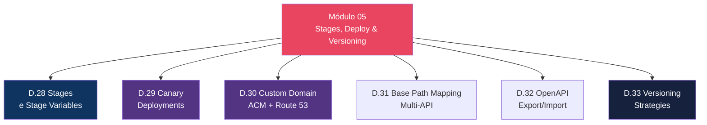
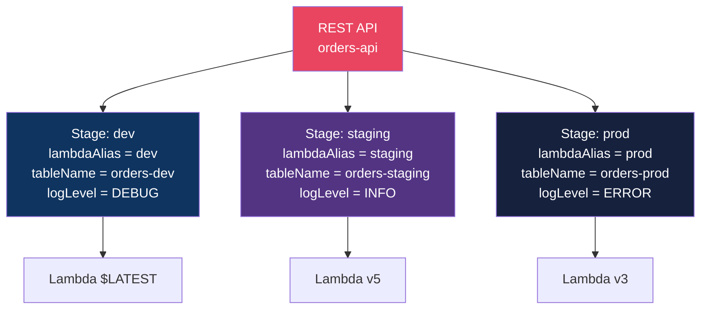
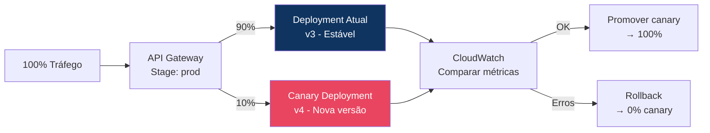
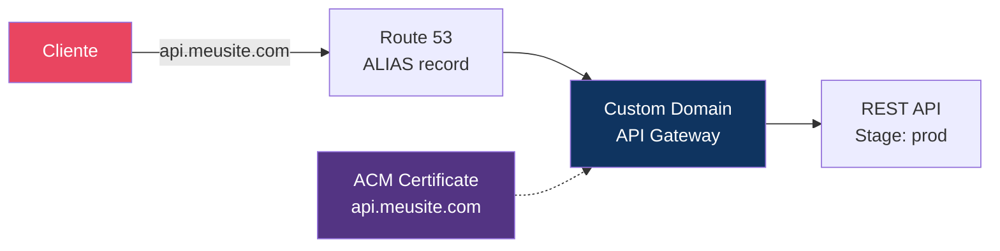
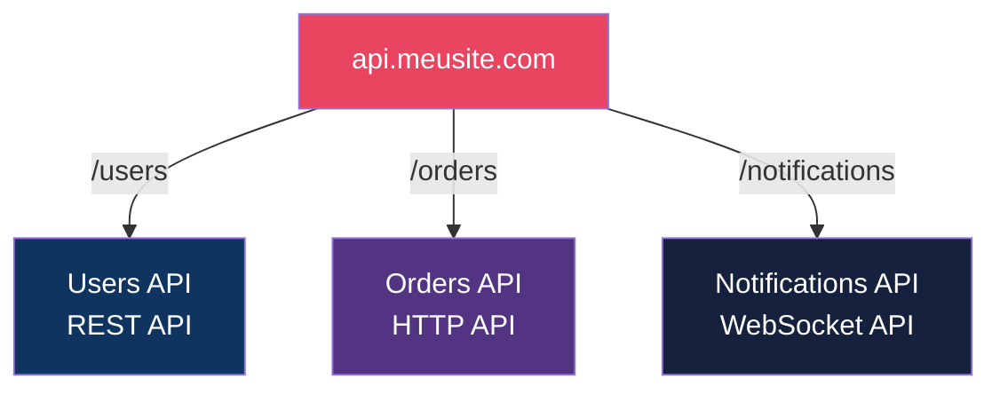

# Módulo 05 — Stages, Deploy & Versioning

> **Nível:** 300 (Advanced)
> **Tempo Total Estimado:** 10-14 horas de labs
> **Custo Estimado:** ~$2-5 (ACM, Route 53)
> **Objetivo do Módulo:** Dominar lifecycle de APIs — stages com variáveis, canary deployments, custom domains com ACM e Route 53, base path mapping para multi-API, export/import OpenAPI e estratégias de versionamento.

---

## Mapa do Módulo



---

## Desafio 28: Stages e Stage Variables

> **Level:** 300 | **Tempo:** 60 min | **Custo:** $0

### Objetivo

Usar **stages** e **stage variables** para gerenciar múltiplos ambientes (dev, staging, prod) com a mesma API mas backends diferentes.

### Arquitetura Multi-Stage



```bash
# Stage variables
aws apigateway update-stage \
  --rest-api-id "$API_ID" \
  --stage-name "prod" \
  --patch-operations \
    "op=replace,path=/variables/lambdaAlias,value=prod" \
    "op=replace,path=/variables/tableName,value=orders-prod" \
    "op=replace,path=/variables/logLevel,value=ERROR"

# Usar stage variables na integration URI
# URI: arn:aws:lambda:...:function:orders:${stageVariables.lambdaAlias}
```

```hcl
resource "aws_api_gateway_stage" "prod" {
  rest_api_id   = aws_api_gateway_rest_api.main.id
  deployment_id = aws_api_gateway_deployment.main.id
  stage_name    = "prod"

  variables = {
    lambdaAlias = "prod"
    tableName   = "orders-prod"
    logLevel    = "ERROR"
  }

  # Method-level settings
  dynamic "method_settings" {
    content {
      method_path = "*/*"
      settings {
        metrics_enabled    = true
        logging_level      = "ERROR"
        throttling_burst_limit = 500
        throttling_rate_limit  = 200
      }
    }
  }
}
```

### O Que Aprendemos

| Conceito | Detalhe |
|----------|---------|
| Stage | Ambiente deployado (dev, staging, prod) com URL própria |
| Stage Variables | Variáveis por stage — Lambda alias, table name, log level |
| `${stageVariables.x}` | Referência em integration URI, mapping templates |
| Method Settings | Throttling, logging, caching por method e por stage |

---

## Desafio 29: Canary Deployments

> **Level:** 300 | **Tempo:** 90 min | **Custo:** $0

### Objetivo

Implementar **canary deployments** — enviar uma porcentagem do tráfego para a nova versão e monitorar antes de promover.

### Fluxo Canary



```bash
# 1. Criar deployment canary (10% do tráfego)
aws apigateway create-deployment \
  --rest-api-id "$API_ID" \
  --stage-name "prod" \
  --canary-settings '{
    "percentTraffic": 10,
    "useStageCache": false
  }'

# 2. Monitorar métricas do canary
aws cloudwatch get-metric-statistics \
  --namespace "AWS/ApiGateway" \
  --metric-name "5XXError" \
  --dimensions Name=ApiName,Value=orders-api Name=Stage,Value=prod \
  --start-time "$(date -u -d '1 hour ago' +%Y-%m-%dT%H:%M:%S)" \
  --end-time "$(date -u +%Y-%m-%dT%H:%M:%S)" \
  --period 300 --statistics Sum

# 3a. Promover canary (se OK)
aws apigateway update-stage \
  --rest-api-id "$API_ID" \
  --stage-name "prod" \
  --patch-operations "op=remove,path=/canarySettings"

# 3b. Rollback (se erros)
aws apigateway update-stage \
  --rest-api-id "$API_ID" \
  --stage-name "prod" \
  --patch-operations \
    "op=replace,path=/canarySettings/percentTraffic,value=0" \
    "op=remove,path=/canarySettings"
```

### O Que Aprendemos

| Conceito | Detalhe |
|----------|---------|
| Canary | Porcentagem do tráfego para nova versão |
| Promoção | Remover canary settings = 100% na nova versão |
| Rollback | percentTraffic=0 + remove = volta para versão antiga |
| Monitoramento | Comparar 5xx, latência e erros entre canary e production |

---

## Desafio 30: Custom Domain Names (ACM + Route 53)

> **Level:** 300 | **Tempo:** 90 min | **Custo:** ~$1

### Objetivo

Configurar **custom domain** para a API — `api.meusite.com` em vez de `abc123.execute-api.us-east-1.amazonaws.com`.

### Arquitetura



```hcl
# ACM Certificate
resource "aws_acm_certificate" "api" {
  domain_name       = "api.meusite.com"
  validation_method = "DNS"

  # Para REST API Regional: mesma região
  # Para REST API Edge-Optimized: us-east-1
}

# Custom Domain
resource "aws_api_gateway_domain_name" "api" {
  domain_name              = "api.meusite.com"
  regional_certificate_arn = aws_acm_certificate.api.arn

  endpoint_configuration {
    types = ["REGIONAL"]
  }
}

# Base Path Mapping
resource "aws_api_gateway_base_path_mapping" "api" {
  api_id      = aws_api_gateway_rest_api.main.id
  stage_name  = aws_api_gateway_stage.prod.stage_name
  domain_name = aws_api_gateway_domain_name.api.domain_name
  base_path   = ""  # Raiz: api.meusite.com/orders
}

# Route 53 ALIAS
resource "aws_route53_record" "api" {
  zone_id = var.hosted_zone_id
  name    = "api.meusite.com"
  type    = "A"

  alias {
    name                   = aws_api_gateway_domain_name.api.regional_domain_name
    zone_id                = aws_api_gateway_domain_name.api.regional_zone_id
    evaluate_target_health = false
  }
}
```

### O Que Aprendemos

| Conceito | Detalhe |
|----------|---------|
| Custom Domain | URL amigável em vez do default API GW URL |
| ACM | Certificado TLS para o custom domain |
| Regional | Cert na mesma região. Edge-Optimized: cert em us-east-1 |
| Base Path Mapping | Mapeia path base do domínio para API + stage |

---

## Desafio 31: Base Path Mapping — Multi-API em Um Domínio

> **Level:** 300 | **Tempo:** 60 min | **Custo:** $0

### Objetivo

Mapear **múltiplas APIs** em um único domínio usando base path mapping.



```hcl
# Múltiplos base path mappings no mesmo domínio
resource "aws_api_gateway_base_path_mapping" "users" {
  api_id      = aws_api_gateway_rest_api.users.id
  stage_name  = "prod"
  domain_name = aws_api_gateway_domain_name.api.domain_name
  base_path   = "users"  # api.meusite.com/users/*
}

# HTTP API usa apigatewayv2_api_mapping
resource "aws_apigatewayv2_api_mapping" "orders" {
  api_id      = aws_apigatewayv2_api.orders.id
  stage       = aws_apigatewayv2_stage.prod.id
  domain_name = aws_apigatewayv2_domain_name.api.id
  api_mapping_key = "orders"  # api.meusite.com/orders/*
}
```

### O Que Aprendemos

| Conceito | Detalhe |
|----------|---------|
| Multi-API | Múltiplas APIs no mesmo domínio via base path |
| base_path | Prefixo da URL que roteia para a API específica |
| Single level | `/users` (single) não conta no quota de mappings |
| Mixed types | REST + HTTP + WebSocket podem coexistir no mesmo domínio |

---

## Desafio 32: Export/Import OpenAPI (Swagger)

> **Level:** 300 | **Tempo:** 60 min | **Custo:** $0

### Objetivo

Exportar API em formato **OpenAPI/Swagger** e importar de um arquivo OpenAPI — workflow OpenAPI-first.

```bash
# Exportar API como OpenAPI 3.0
aws apigateway get-export \
  --rest-api-id "$API_ID" \
  --stage-name "prod" \
  --export-type oas30 \
  --accepts "application/json" \
  api-spec.json

# Exportar com extensões do API Gateway
aws apigateway get-export \
  --rest-api-id "$API_ID" \
  --stage-name "prod" \
  --export-type oas30 \
  --parameters extensions=apigateway \
  --accepts "application/json" \
  api-spec-with-extensions.json

# Importar API de um arquivo OpenAPI
aws apigateway import-rest-api \
  --body fileb://api-spec.json \
  --fail-on-warnings
```

### O Que Aprendemos

| Conceito | Detalhe |
|----------|---------|
| OpenAPI export | Gera spec da API existente (documentação automática) |
| OpenAPI import | Cria API a partir de spec (API-first development) |
| Extensions | `x-amazon-apigateway-*` — extensões AWS na spec |
| Versionamento | Exportar spec + commitar no git = histórico da API |

---

## Desafio 33: Versioning Strategies

> **Level:** 300 | **Tempo:** 90 min | **Custo:** $0

### Objetivo

Implementar estratégias de **versionamento de API** — URL path, header, query parameter.

### 3 Estratégias

```
┌──────────────────────────────────────────────────────────────────┐
│              API Versioning Strategies                             │
│                                                                   │
│  1. URL Path (mais comum):                                       │
│     GET /v1/orders                                               │
│     GET /v2/orders                                               │
│     → Resources separados: /v1/orders e /v2/orders              │
│     → Mais visível, fácil de entender                           │
│     → Poluição de resources se muitas versões                   │
│                                                                   │
│  2. Header:                                                      │
│     GET /orders                                                  │
│     Accept: application/vnd.api.v2+json                         │
│     → Lambda Authorizer ou CF Function roteia                   │
│     → URL limpa, mais RESTful                                   │
│     → Mais complexo de implementar                              │
│                                                                   │
│  3. Query Parameter:                                             │
│     GET /orders?version=2                                        │
│     → Simples de implementar                                    │
│     → Menos limpo, mistura versão com dados                     │
│                                                                   │
│  4. Stage-based:                                                 │
│     GET /v1/orders → stage v1                                   │
│     GET /v2/orders → stage v2                                   │
│     → Cada versão é um deployment separado                      │
│     → Isolamento completo                                       │
└──────────────────────────────────────────────────────────────────┘
```

### O Que Aprendemos

| Conceito | Detalhe |
|----------|---------|
| URL path versioning | Mais comum, mais explícito (`/v1/`, `/v2/`) |
| Header versioning | Mais RESTful mas complexo (`Accept: vnd.api.v2`) |
| Backward compatibility | Nunca remover campos — apenas adicionar |
| Deprecation | Header `Sunset` + documentação com prazo |

> **💡 Expert Tip:** URL path versioning (`/v1/`, `/v2/`) é o mais pragmático. Sim, puristas REST preferem header versioning, mas na prática: é mais fácil de documentar, testar, cachear e debugar com path versioning. A regra de ouro: mantenha v1 funcionando por pelo menos 6 meses após lançar v2, com header `Sunset` indicando a data de deprecação.

---

## Resumo do Módulo 05

```
┌──────────────────────────────────────────────────────────────┐
│               MÓDULO 05 — CONQUISTAS                          │
│                                                               │
│  ✅ Desafio 28: Stages e Stage Variables                     │
│  ✅ Desafio 29: Canary Deployments                           │
│  ✅ Desafio 30: Custom Domain Names                          │
│  ✅ Desafio 31: Base Path Mapping (Multi-API)                │
│  ✅ Desafio 32: OpenAPI Export/Import                        │
│  ✅ Desafio 33: Versioning Strategies                        │
│                                                               │
│  Próximo: Módulo 06 — Monitoring & Troubleshooting           │
└──────────────────────────────────────────────────────────────┘
```

**Próximo:** [Módulo 06 — Monitoring & Troubleshooting →](modulo-06-monitoring.md)
