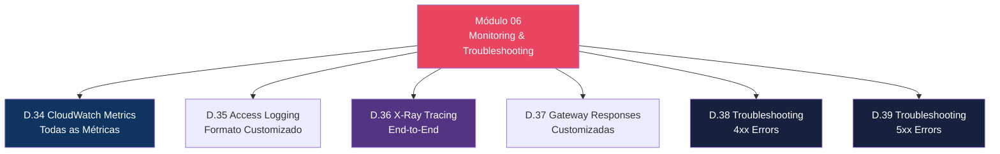
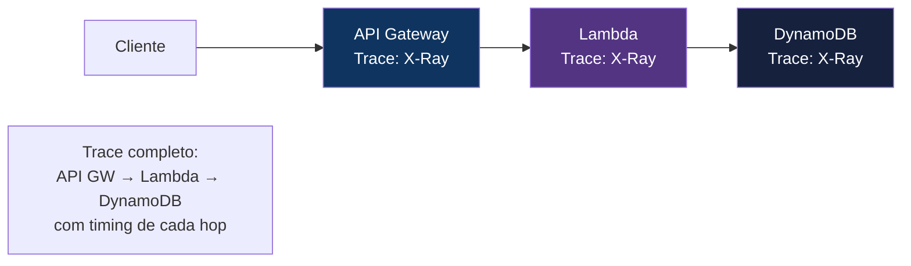

# Módulo 06 — Monitoring & Troubleshooting

> **Nível:** 300 (Advanced)
> **Tempo Total Estimado:** 10-14 horas de labs
> **Custo Estimado:** ~$2 (CloudWatch Logs, X-Ray)
> **Objetivo do Módulo:** Implementar observabilidade completa em API Gateway — todas as métricas CloudWatch, access logging customizado, execution logging, X-Ray tracing, gateway responses customizadas e troubleshooting sistemático de erros 4xx e 5xx.

---

## Mapa do Módulo



---

## Desafio 34: CloudWatch Metrics — Todas as Métricas

> **Level:** 300 | **Tempo:** 60 min | **Custo:** ~$0

### Métricas Disponíveis

| Métrica | O Que Mede | Quando Alertar |
|---------|-----------|----------------|
| `Count` | Total de API calls | Spike inesperado (possível ataque) |
| `4XXError` | Client errors (400, 401, 403, 404, 429) | > 5% do total |
| `5XXError` | Server errors (500, 502, 503, 504) | > 1% do total |
| `Latency` | Tempo total (API GW + backend) | P99 > 3s |
| `IntegrationLatency` | Tempo do backend apenas | P99 > 2s |
| `CacheHitCount` | Requests servidos do cache (REST only) | Baixo = cache ineficiente |
| `CacheMissCount` | Requests que foram ao backend | Alto = revisar cache policy |

### Terraform — Dashboard e Alarmes

```hcl
# Alarme: 5xx > 1%
resource "aws_cloudwatch_metric_alarm" "api_5xx" {
  alarm_name          = "api-gateway-5xx-rate"
  comparison_operator = "GreaterThanThreshold"
  evaluation_periods  = 2
  threshold           = 1

  metric_query {
    id          = "error_rate"
    expression  = "(errors / total) * 100"
    label       = "5xx Error Rate (%)"
    return_data = true
  }

  metric_query {
    id = "errors"
    metric {
      metric_name = "5XXError"
      namespace   = "AWS/ApiGateway"
      period      = 300
      stat        = "Sum"
      dimensions  = { ApiName = "orders-api" }
    }
  }

  metric_query {
    id = "total"
    metric {
      metric_name = "Count"
      namespace   = "AWS/ApiGateway"
      period      = 300
      stat        = "Sum"
      dimensions  = { ApiName = "orders-api" }
    }
  }

  alarm_actions = [aws_sns_topic.alerts.arn]
}

# Alarme: Latência P99 > 3s
resource "aws_cloudwatch_metric_alarm" "api_latency" {
  alarm_name          = "api-gateway-high-latency"
  comparison_operator = "GreaterThanThreshold"
  evaluation_periods  = 3
  metric_name         = "Latency"
  namespace           = "AWS/ApiGateway"
  period              = 300
  extended_statistic  = "p99"
  threshold           = 3000
  dimensions          = { ApiName = "orders-api" }
  alarm_actions       = [aws_sns_topic.alerts.arn]
}
```

---

## Desafio 35: Access Logging — Formato Customizado

> **Level:** 300 | **Tempo:** 90 min | **Custo:** ~$1

### Access Log Format

```hcl
resource "aws_api_gateway_stage" "prod" {
  # ...

  access_log_settings {
    destination_arn = aws_cloudwatch_log_group.api_access.arn
    format = jsonencode({
      requestId          = "$context.requestId"
      extendedRequestId  = "$context.extendedRequestId"
      ip                 = "$context.identity.sourceIp"
      caller             = "$context.identity.caller"
      user               = "$context.identity.user"
      userAgent          = "$context.identity.userAgent"
      requestTime        = "$context.requestTime"
      httpMethod         = "$context.httpMethod"
      resourcePath       = "$context.resourcePath"
      path               = "$context.path"
      status             = "$context.status"
      protocol           = "$context.protocol"
      responseLength     = "$context.responseLength"
      responseLatency    = "$context.responseLatency"
      integrationLatency = "$context.integrationLatency"
      integrationStatus  = "$context.integrationStatus"
      errorMessage       = "$context.error.message"
      errorResponseType  = "$context.error.responseType"
      authorizerError    = "$context.authorizer.error"
      apiKeyId           = "$context.identity.apiKeyId"
      wafError           = "$context.wafResponseCode"
    })
  }
}
```

### Queries CloudWatch Logs Insights

```sql
-- Top 10 paths com mais erros 5xx
fields @timestamp, status, resourcePath, errorMessage
| filter status >= 500
| stats count(*) as errors by resourcePath
| sort errors desc
| limit 10

-- Latência P99 por endpoint
fields @timestamp, resourcePath, responseLatency
| stats percentile(responseLatency, 99) as p99,
        percentile(responseLatency, 95) as p95,
        avg(responseLatency) as avg_latency
  by resourcePath
| sort p99 desc

-- Requests bloqueados por throttling (429)
fields @timestamp, ip, resourcePath, status
| filter status = 429
| stats count(*) as throttled by ip
| sort throttled desc
| limit 20
```

---

## Desafio 36: X-Ray Tracing

> **Level:** 300 | **Tempo:** 90 min | **Custo:** ~$0.50

### Fluxo X-Ray



```hcl
# Habilitar X-Ray no stage
resource "aws_api_gateway_stage" "prod" {
  # ...
  xray_tracing_enabled = true
}

# Habilitar X-Ray na Lambda
resource "aws_lambda_function" "handler" {
  # ...
  tracing_config {
    mode = "Active"
  }
}
```

---

## Desafio 37: Gateway Responses Customizadas

> **Level:** 300 | **Tempo:** 60 min | **Custo:** $0

### O Que São Gateway Responses

```
Gateway Responses = respostas que o API GW gera ANTES de chegar ao backend:

├── DEFAULT_4XX          → Erro genérico 4xx
├── DEFAULT_5XX          → Erro genérico 5xx
├── ACCESS_DENIED        → 403 de IAM/Resource Policy
├── API_CONFIGURATION_ERROR → 500 config errada
├── AUTHORIZER_FAILURE   → 500 authorizer crashou
├── BAD_REQUEST_BODY     → 400 body inválido (validator)
├── EXPIRED_TOKEN        → 403 token expirado
├── INVALID_API_KEY      → 403 API key inválida
├── MISSING_AUTHENTICATION_TOKEN → 403 sem auth token
├── QUOTA_EXCEEDED       → 429 quota do usage plan
├── REQUEST_TOO_LARGE    → 413 payload > 10MB
├── THROTTLED            → 429 rate limit
├── UNAUTHORIZED         → 401 authorizer retornou deny
└── WAF_FILTERED         → 403 bloqueado pelo WAF
```

```hcl
# Customizar resposta de throttling
resource "aws_api_gateway_gateway_response" "throttled" {
  rest_api_id   = aws_api_gateway_rest_api.main.id
  response_type = "THROTTLED"
  status_code   = "429"

  response_parameters = {
    "gatewayresponse.header.Retry-After"               = "'60'"
    "gatewayresponse.header.Access-Control-Allow-Origin" = "'*'"
  }

  response_templates = {
    "application/json" = jsonencode({
      error   = "Rate limit exceeded"
      message = "Too many requests. Please retry after 60 seconds."
      retryAfter = 60
    })
  }
}

# Customizar 403
resource "aws_api_gateway_gateway_response" "access_denied" {
  rest_api_id   = aws_api_gateway_rest_api.main.id
  response_type = "ACCESS_DENIED"
  status_code   = "403"

  response_templates = {
    "application/json" = jsonencode({
      error   = "Access denied"
      message = "You don't have permission to access this resource."
      requestId = "$context.requestId"
    })
  }
}
```

---

## Desafio 38: Troubleshooting 4xx Errors

> **Level:** 300 | **Tempo:** 90 min | **Custo:** $0

### Guia de Diagnóstico

```
┌──────────────────────────────────────────────────────────────────┐
│              4xx Errors — Diagnóstico                              │
│                                                                   │
│  400 Bad Request                                                 │
│  ├── Request body falhou na validação (Model/Validator)          │
│  ├── Query parameter obrigatório ausente                        │
│  └── Fix: verificar schema do Model e request body              │
│                                                                   │
│  401 Unauthorized                                                │
│  ├── Lambda Authorizer retornou "Deny"                          │
│  ├── Token expirado ou inválido                                 │
│  └── Fix: verificar token, Lambda Authorizer logs               │
│                                                                   │
│  403 Forbidden                                                   │
│  ├── "Missing Authentication Token" = resource não existe       │
│  ├── API Key inválida ou ausente                                │
│  ├── Resource Policy bloqueou (IP, VPC)                         │
│  ├── WAF bloqueou                                               │
│  ├── IAM policy nega acesso                                     │
│  └── Fix: verificar resource path, API key, WAF logs            │
│                                                                   │
│  404 Not Found                                                   │
│  ├── HTTP API: rota não encontrada                              │
│  └── Fix: verificar route key                                   │
│                                                                   │
│  429 Too Many Requests                                           │
│  ├── Account-level throttle (10.000 req/s default)              │
│  ├── Stage-level throttle                                        │
│  ├── Usage Plan quota excedida                                  │
│  └── Fix: aumentar limits, verificar usage plan                  │
└──────────────────────────────────────────────────────────────────┘
```

---

## Desafio 39: Troubleshooting 5xx Errors

> **Level:** 300 | **Tempo:** 90 min | **Custo:** $0

### Guia de Diagnóstico

```
┌──────────────────────────────────────────────────────────────────┐
│              5xx Errors — Diagnóstico                              │
│                                                                   │
│  500 Internal Server Error                                       │
│  ├── Lambda retornou formato inválido (sem statusCode)          │
│  ├── Integration mapping template com erro VTL                  │
│  ├── Authorizer Lambda crashou                                  │
│  └── Fix: verificar Lambda response format, CloudWatch Logs     │
│                                                                   │
│  502 Bad Gateway                                                 │
│  ├── Lambda retornou response malformado                        │
│  ├── Lambda retornou payload > 6MB                              │
│  ├── Backend HTTP retornou response inválido                    │
│  └── Fix: verificar response format {statusCode, headers, body} │
│                                                                   │
│  503 Service Unavailable                                         │
│  ├── AWS throttling interno                                     │
│  ├── Backend indisponível                                       │
│  └── Fix: retry com backoff, verificar backend health           │
│                                                                   │
│  504 Gateway Timeout                                             │
│  ├── Backend demorou > 29 segundos (REST API max)               │
│  ├── Backend demorou > 30 segundos (HTTP API max)               │
│  ├── VPC Link connectivity issue                                │
│  └── Fix: otimizar Lambda cold start, verificar VPC Link        │
│                                                                   │
│  Checklist de Debug:                                             │
│  1. Habilitar Execution Logging (temporário — caro!)            │
│  2. Verificar CloudWatch Logs da Lambda                         │
│  3. Verificar X-Ray trace (se habilitado)                       │
│  4. Testar integration diretamente (curl ao backend)            │
│  5. Verificar IAM role permissions                              │
└──────────────────────────────────────────────────────────────────┘
```

### Habilitar Execution Logging (temporário)

```bash
# CUIDADO: execution logging é CARO e verboso
# Use apenas para debug, desabilite depois
aws apigateway update-stage \
  --rest-api-id "$API_ID" \
  --stage-name "prod" \
  --patch-operations \
    "op=replace,path//*/*/logging/loglevel,value=INFO" \
    "op=replace,path//*/*/logging/dataTrace,value=true"

# Verificar logs
aws logs tail "/aws/apigateway/$API_ID/prod" --since 5m

# DESABILITAR após debug
aws apigateway update-stage \
  --rest-api-id "$API_ID" \
  --stage-name "prod" \
  --patch-operations \
    "op=replace,path//*/*/logging/loglevel,value=OFF" \
    "op=replace,path//*/*/logging/dataTrace,value=false"
```

> **💡 Expert Tip:** O erro 502 mais comum: a Lambda retorna `{"message": "success"}` em vez de `{"statusCode": 200, "body": "{\"message\": \"success\"}"}`. Com proxy integration, a Lambda DEVE retornar o formato exato com `statusCode` (number), `headers` (object) e `body` (string). `body` DEVE ser string (JSON stringified), não objeto.

---

## Resumo do Módulo 06

```
┌──────────────────────────────────────────────────────────────┐
│               MÓDULO 06 — CONQUISTAS                          │
│                                                               │
│  ✅ Desafio 34: CloudWatch Metrics + Alarmes                 │
│  ✅ Desafio 35: Access Logging Customizado                   │
│  ✅ Desafio 36: X-Ray End-to-End Tracing                     │
│  ✅ Desafio 37: Gateway Responses Customizadas               │
│  ✅ Desafio 38: Troubleshooting 4xx (400,401,403,429)        │
│  ✅ Desafio 39: Troubleshooting 5xx (500,502,503,504)        │
│                                                               │
│  Próximo: Módulo 07 — WebSocket API                          │
└──────────────────────────────────────────────────────────────┘
```

**Próximo:** [Módulo 07 — WebSocket API →](modulo-07-websocket.md)
