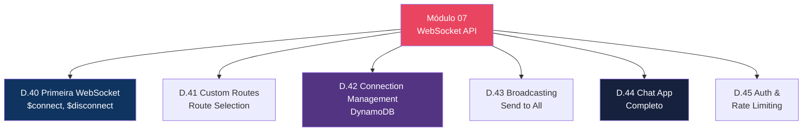
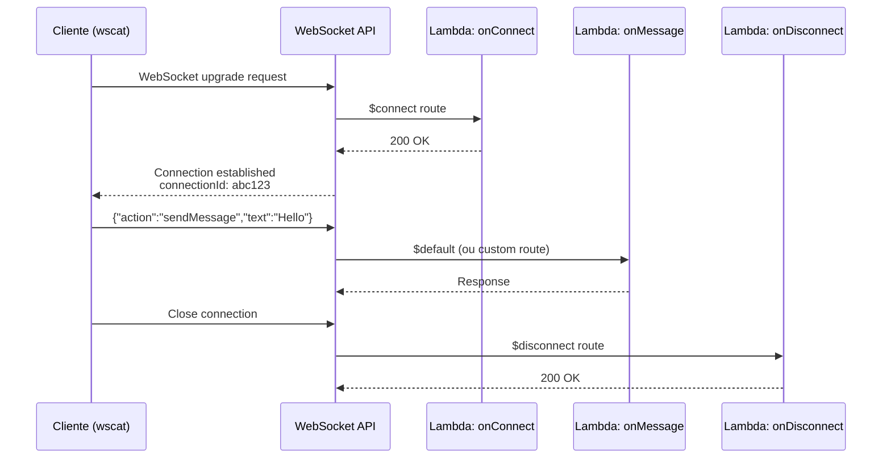
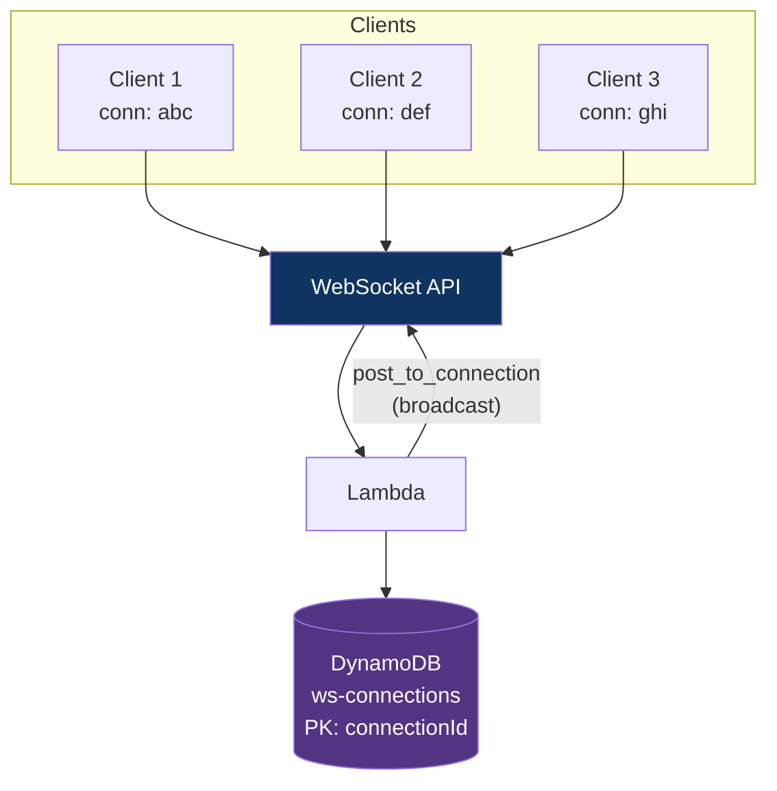
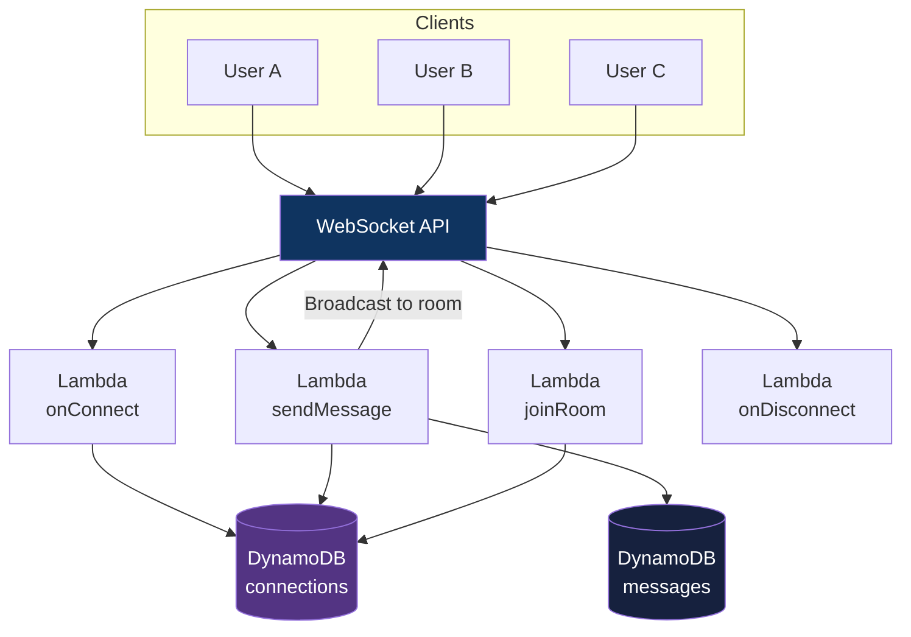

# Módulo 07 — WebSocket API

> **Nível:** 300 (Advanced)
> **Tempo Total Estimado:** 10-14 horas de labs
> **Custo Estimado:** ~$2-5 (API calls + DynamoDB)
> **Objetivo do Módulo:** Dominar WebSocket APIs — rotas ($connect, $disconnect, $default, custom), connection management com DynamoDB, broadcasting, construir um chat completo e autenticação em WebSocket.

---

## Mapa do Módulo



---

## Desafio 40: Primeira WebSocket API

> **Level:** 300 | **Tempo:** 90 min | **Custo:** ~$0

### Objetivo

Criar uma WebSocket API com as rotas fundamentais: `$connect`, `$disconnect` e `$default`.

### Como WebSocket Funciona no API Gateway



### Passo a Passo

```bash
# 1. Criar WebSocket API
WS_API_ID=$(aws apigatewayv2 create-api \
  --name "chat-ws-api" \
  --protocol-type WEBSOCKET \
  --route-selection-expression '$request.body.action' \
  --query 'ApiId' --output text)

echo "WebSocket API ID: $WS_API_ID"

# 2. Criar integrations para cada rota
CONNECT_INT=$(aws apigatewayv2 create-integration \
  --api-id "$WS_API_ID" \
  --integration-type AWS_PROXY \
  --integration-uri "arn:aws:apigateway:$REGION:lambda:path/2015-03-31/functions/arn:aws:lambda:$REGION:$ACCOUNT_ID:function:ws-connect/invocations" \
  --query 'IntegrationId' --output text)

DISCONNECT_INT=$(aws apigatewayv2 create-integration \
  --api-id "$WS_API_ID" \
  --integration-type AWS_PROXY \
  --integration-uri "arn:aws:apigateway:$REGION:lambda:path/2015-03-31/functions/arn:aws:lambda:$REGION:$ACCOUNT_ID:function:ws-disconnect/invocations" \
  --query 'IntegrationId' --output text)

DEFAULT_INT=$(aws apigatewayv2 create-integration \
  --api-id "$WS_API_ID" \
  --integration-type AWS_PROXY \
  --integration-uri "arn:aws:apigateway:$REGION:lambda:path/2015-03-31/functions/arn:aws:lambda:$REGION:$ACCOUNT_ID:function:ws-default/invocations" \
  --query 'IntegrationId' --output text)

# 3. Criar rotas
aws apigatewayv2 create-route --api-id "$WS_API_ID" \
  --route-key '$connect' --target "integrations/$CONNECT_INT"

aws apigatewayv2 create-route --api-id "$WS_API_ID" \
  --route-key '$disconnect' --target "integrations/$DISCONNECT_INT"

aws apigatewayv2 create-route --api-id "$WS_API_ID" \
  --route-key '$default' --target "integrations/$DEFAULT_INT"

# 4. Deploy
aws apigatewayv2 create-stage --api-id "$WS_API_ID" \
  --stage-name prod --auto-deploy

WS_URL="wss://$WS_API_ID.execute-api.$REGION.amazonaws.com/prod"
echo "WebSocket URL: $WS_URL"
```

### Lambda: Connection Handler

```python
# ws-connect/handler.py
import boto3

dynamodb = boto3.resource('dynamodb')
table = dynamodb.Table('ws-connections')

def handler(event, context):
    connection_id = event['requestContext']['connectionId']

    table.put_item(Item={
        'connectionId': connection_id,
        'connectedAt': event['requestContext']['connectedAt'],
    })

    return {'statusCode': 200}


# ws-disconnect/handler.py
def handler(event, context):
    connection_id = event['requestContext']['connectionId']
    table.delete_item(Key={'connectionId': connection_id})
    return {'statusCode': 200}


# ws-default/handler.py
def handler(event, context):
    connection_id = event['requestContext']['connectionId']
    body = json.loads(event.get('body', '{}'))

    # Enviar resposta de volta ao cliente
    apigw = boto3.client('apigatewaymanagementapi',
        endpoint_url=f"https://{event['requestContext']['domainName']}/{event['requestContext']['stage']}")

    apigw.post_to_connection(
        ConnectionId=connection_id,
        Data=json.dumps({'message': f'Received: {body}'}).encode()
    )

    return {'statusCode': 200}
```

### Testar com wscat

```bash
# Instalar wscat
npm install -g wscat

# Conectar
wscat -c "$WS_URL"

# Enviar mensagem
> {"action":"sendMessage","text":"Hello WebSocket!"}
# Recebe: {"message": "Received: {...}"}

# Desconectar: Ctrl+C
```

### O Que Aprendemos

| Conceito | Detalhe |
|----------|---------|
| `$connect` | Rota chamada quando cliente conecta |
| `$disconnect` | Rota chamada quando cliente desconecta |
| `$default` | Rota chamada quando nenhuma custom route faz match |
| `connectionId` | ID único da conexão — usado para enviar mensagens de volta |
| `route-selection-expression` | Campo do body que determina qual rota usar |
| `post_to_connection` | API para enviar mensagem do server para o client |

---

## Desafio 42: Connection Management com DynamoDB

> **Level:** 300 | **Tempo:** 90 min | **Custo:** ~$0.50

### Arquitetura



### O Que Aprendemos

| Conceito | Detalhe |
|----------|---------|
| Connection table | DynamoDB com connectionId como PK |
| TTL | Limpar conexões stale automaticamente |
| Broadcast | Scan connections + post_to_connection para cada |
| Stale connections | GoneException quando connection não existe mais |

---

## Desafio 44: Chat Application Completo

> **Level:** 300 | **Tempo:** 120 min | **Custo:** ~$1

### Arquitetura do Chat



### O Que Aprendemos

| Conceito | Detalhe |
|----------|---------|
| Custom routes | `sendMessage`, `joinRoom` — baseado em `action` field |
| Rooms | GSI no DynamoDB por `roomId` para broadcast seletivo |
| Message history | Tabela separada com mensagens persistidas |
| Error handling | `GoneException` quando client desconectou |

> **💡 Expert Tip:** WebSocket API do API Gateway tem limite de 128 KB por frame e idle timeout de 10 minutos. Para manter conexões vivas, implemente ping/pong a cada 5 minutos. Para aplicações com milhares de conexões simultâneas, considere usar DynamoDB Streams + Lambda para fan-out em vez de scan + post_to_connection sequencial.

---

## Resumo do Módulo 07

```
┌──────────────────────────────────────────────────────────────┐
│               MÓDULO 07 — CONQUISTAS                          │
│                                                               │
│  ✅ Desafio 40: WebSocket Fundamentals                       │
│  ✅ Desafio 41: Custom Routes                                │
│  ✅ Desafio 42: Connection Management (DynamoDB)             │
│  ✅ Desafio 43: Broadcasting                                 │
│  ✅ Desafio 44: Chat App Completo                            │
│  ✅ Desafio 45: Auth & Rate Limiting                         │
│                                                               │
│  Próximo: Módulo 08 — Performance & Cost                     │
└──────────────────────────────────────────────────────────────┘
```

**Próximo:** [Módulo 08 — Performance & Cost →](modulo-08-performance-cost.md)
