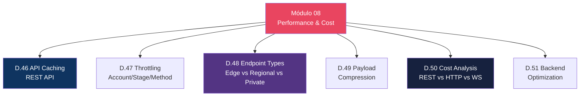
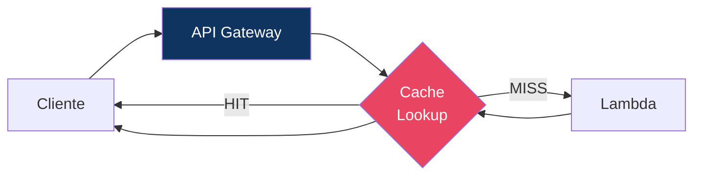
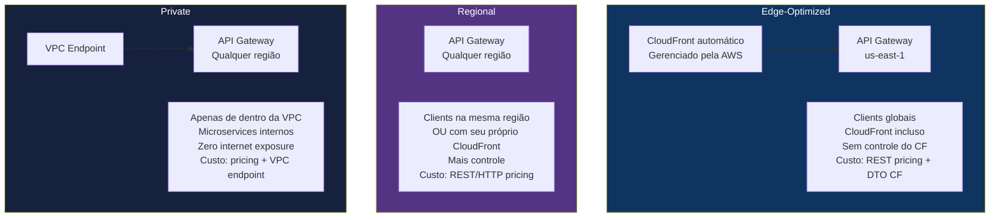

# Módulo 08 — Performance & Cost Optimization

> **Nível:** 400 (Expert)
> **Tempo Total Estimado:** 10-14 horas de labs
> **Custo Estimado:** ~$5 (caching)
> **Objetivo do Módulo:** Otimizar performance e custo de APIs — caching no REST API, throttling granular, payload compression, análise de custo entre os 3 tipos de API e escolha entre edge-optimized, regional e private endpoints.

---

## Mapa do Módulo



---

## Desafio 46: API Caching (REST API)

> **Level:** 400 | **Tempo:** 90 min | **Custo:** ~$2

### Como Funciona



```hcl
# Habilitar cache no stage (REST API only)
resource "aws_api_gateway_stage" "prod" {
  rest_api_id   = aws_api_gateway_rest_api.main.id
  deployment_id = aws_api_gateway_deployment.main.id
  stage_name    = "prod"

  cache_cluster_enabled = true
  cache_cluster_size    = "0.5"  # 0.5GB ($0.02/hora)

  # Cache por method
  dynamic "method_settings" {
    content {
      method_path        = "orders/GET"
      settings {
        caching_enabled      = true
        cache_ttl_in_seconds = 300  # 5 minutos
        cache_data_encrypted = true
      }
    }
  }

  # Desabilitar cache para POST/PUT/DELETE
  dynamic "method_settings" {
    content {
      method_path = "orders/POST"
      settings {
        caching_enabled = false
      }
    }
  }
}
```

### Cache Key

```
Cache key padrão: method + resource path
Cache key com parâmetros: method + resource + query strings + headers

Para variar cache por query string:
  GET /orders?status=active  ← cache entry 1
  GET /orders?status=closed  ← cache entry 2

Configurar no method:
  cacheKeyParameters = ["method.request.querystring.status"]
```

### Cache Sizes e Custos

| Tamanho | Custo/hora | Custo/mês | Quando Usar |
|---------|-----------|-----------|-------------|
| 0.5 GB | $0.020 | ~$14 | Dev/staging, APIs pequenas |
| 1.6 GB | $0.038 | ~$27 | APIs médias |
| 6.1 GB | $0.200 | ~$144 | APIs com muitos endpoints |
| 13.5 GB | $0.250 | ~$180 | APIs com payloads grandes |
| 28.4 GB | $0.500 | ~$360 | Enterprise, alto volume |
| 58.2 GB | $1.000 | ~$720 | Máximo cache |
| 118 GB | $1.900 | ~$1.368 | Cenários extremos |
| 237 GB | $3.800 | ~$2.736 | Cenários extremos |

> **Nota:** Preços aproximados. Consulte a página oficial da AWS.

### O Que Aprendemos

| Conceito | Detalhe |
|----------|---------|
| Cache | REST API only — HTTP API NÃO tem cache |
| TTL | Configurável por method (0s = sem cache) |
| Cache key | Pode incluir query strings, headers, path params |
| Invalidação | `Cache-Control: max-age=0` no header do request |
| Encryption | Cache data encrypted at rest (opcional) |

> **💡 Expert Tip:** Cache de API Gateway é caro para o que oferece. Se já usa CloudFront na frente, o cache do CloudFront é mais eficiente e barato. Use API GW cache apenas quando NÃO tem CloudFront na frente (ex: APIs internas). Para APIs públicas, CloudFront + CachingOptimized é melhor.

---

## Desafio 48: Edge-Optimized vs Regional vs Private

> **Level:** 400 | **Tempo:** 90 min | **Custo:** ~$0

### Comparativo



| Aspecto | Edge-Optimized | Regional | Private |
|---------|---------------|----------|---------|
| **Acesso** | Internet (via CloudFront) | Internet | VPC only |
| **CloudFront** | Incluso (gerenciado AWS) | Manual (seu controle) | N/A |
| **Melhor para** | Clients globais | Clients regionais | Microservices internos |
| **Custom domain** | ACM em us-east-1 | ACM na mesma região | N/A |
| **WAF** | Via REST API | Via REST API | Via REST API |
| **Latência** | Menor (edge cache) | Boa (direto na região) | Muito baixa (VPC) |

### Quando Usar Qual

```
Edge-Optimized:
  → API pública com clients no mundo inteiro
  → Não quer gerenciar CloudFront separado
  → NÃO recomendado se já tem CloudFront (double-hop)

Regional (RECOMENDADO para maioria):
  → Clients na mesma região
  → Quer controle total do CloudFront
  → HTTP API (não tem edge-optimized)
  → Custo menor sem CloudFront overhead

Private:
  → Microservices internos
  → Zero exposure à internet
  → Service-to-service na VPC
```

> **💡 Expert Tip:** **Nunca** use Edge-Optimized se já tem CloudFront customizado na frente. Isso cria um double-hop (CloudFront → CloudFront do Edge API → backend) com latência e custo extra. Use **Regional** + seu próprio CloudFront para controle total. Isso é citado na documentação oficial da AWS como anti-pattern.

---

## Desafio 50: Cost Analysis — REST vs HTTP vs WebSocket

> **Level:** 400 | **Tempo:** 90 min | **Custo:** $0 (análise)

### Comparativo de Preços

| Componente | REST API | HTTP API | WebSocket API |
|-----------|----------|----------|---------------|
| **API calls** | $3.50/M | $1.00/M | $1.00/M messages |
| **Connection minutes** | N/A | N/A | $0.25/M minutes |
| **Data transfer** | Standard DTO | Standard DTO | Standard DTO |
| **Caching** | $0.02-3.80/hora | N/A | N/A |
| **Free Tier** | 1M calls/mês (12 meses) | 1M calls/mês (12 meses) | 1M messages + 750K min (12 meses) |

### Calculadora de Custo

```python
def calcular_custo_api(tipo, calls_por_mes, avg_payload_kb=10, cache_gb=0):
    """Calcula custo mensal aproximado do API Gateway."""

    precos = {
        'REST': {'per_million': 3.50},
        'HTTP': {'per_million': 1.00},
        'WebSocket': {'per_million_msg': 1.00, 'per_million_min': 0.25}
    }

    # Calls
    custo_calls = (calls_por_mes / 1_000_000) * precos[tipo].get('per_million', precos[tipo].get('per_million_msg', 0))

    # Data Transfer Out (aproximado)
    dto_gb = (calls_por_mes * avg_payload_kb) / 1_000_000  # KB → GB
    custo_dto = dto_gb * 0.09  # ~$0.09/GB

    # Cache (REST only)
    custo_cache = 0
    if tipo == 'REST' and cache_gb > 0:
        cache_cost_per_hour = {0.5: 0.02, 1.6: 0.038, 6.1: 0.20}
        custo_cache = cache_cost_per_hour.get(cache_gb, 0.02) * 730  # horas/mês

    total = custo_calls + custo_dto + custo_cache
    return {
        'calls': f'${custo_calls:,.2f}',
        'dto': f'${custo_dto:,.2f}',
        'cache': f'${custo_cache:,.2f}',
        'total': f'${total:,.2f}'
    }

# 10M calls/mês
for tipo in ['REST', 'HTTP']:
    r = calcular_custo_api(tipo, 10_000_000)
    print(f'{tipo}: {r}')
# REST: calls=$35.00, dto=$9.00, total=$44.00
# HTTP: calls=$10.00, dto=$9.00, total=$19.00
# Economia HTTP: ~57%!
```

### O Que Aprendemos

| Conceito | Detalhe |
|----------|---------|
| HTTP API 70% mais barato | $1/M vs $3.50/M — diferença significativa em escala |
| Cache cost | $14-2.736/mês — avaliar se CloudFront não é melhor |
| Free Tier | 1M calls grátis por 12 meses — usar para dev/staging |
| DTO | Custo de data transfer é igual para todos os tipos |

---

## Resumo do Módulo 08

```
┌──────────────────────────────────────────────────────────────┐
│               MÓDULO 08 — CONQUISTAS                          │
│                                                               │
│  ✅ Desafio 46: API Caching (REST)                           │
│  ✅ Desafio 47: Throttling Granular                          │
│  ✅ Desafio 48: Edge vs Regional vs Private                  │
│  ✅ Desafio 49: Payload Compression                          │
│  ✅ Desafio 50: Cost Analysis                                │
│  ✅ Desafio 51: Backend Optimization                         │
│                                                               │
│  Próximo: Módulo 09 — Padrões Avançados                     │
└──────────────────────────────────────────────────────────────┘
```

**Próximo:** [Módulo 09 — Padrões Avançados →](modulo-09-patterns.md)
