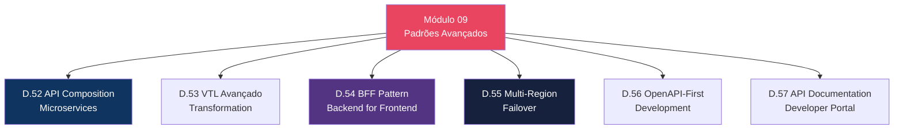
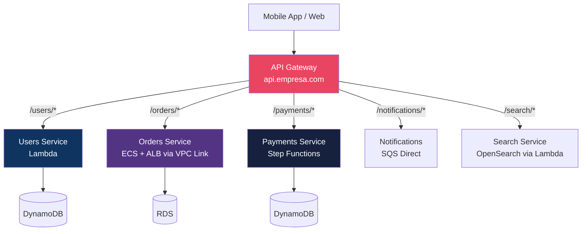
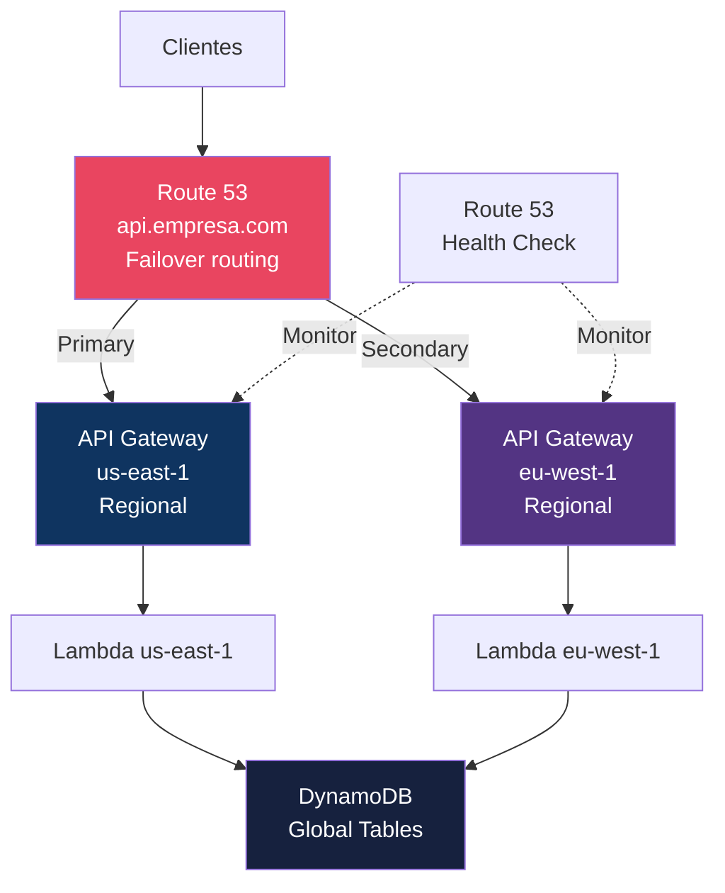

# Módulo 09 — Padrões Avançados

> **Nível:** 400 (Expert)
> **Tempo Total Estimado:** 10-14 horas de labs
> **Custo Estimado:** ~$5-10
> **Objetivo do Módulo:** Implementar padrões arquiteturais avançados — API composition para microservices, transformação VTL avançada, API Gateway como BFF, multi-region failover, OpenAPI-first development e API documentation.

---

## Mapa do Módulo



---

## Desafio 52: API Composition — Microservices Backend

> **Level:** 400 | **Tempo:** 90 min | **Custo:** ~$2

### Objetivo

Usar API Gateway como **API composition layer** — uma API unificada na frente de múltiplos microservices.

### Arquitetura



### Benefícios

```
API Gateway como API Composition:
├── 1 URL para o client (api.empresa.com)
├── Backend heterogêneo (Lambda, ECS, Step Functions, SQS)
├── Auth centralizada (1 Cognito Authorizer para todos)
├── Throttling por serviço (usage plans, method-level)
├── Monitoramento centralizado (CloudWatch, X-Ray)
├── CORS centralizado (1 configuração)
└── Versionamento centralizado (stages)

Sem API Gateway:
├── Client precisa conhecer N URLs
├── N configurações de auth
├── N configurações de CORS
├── N monitoring setups
└── Complexidade exponencial
```

### O Que Aprendemos

| Conceito | Detalhe |
|----------|---------|
| API Composition | 1 API Gateway na frente de N microservices |
| Single entry point | Client conhece apenas 1 URL |
| Mixed backends | Lambda + ECS + Step Functions + SQS no mesmo API |
| Centralized concerns | Auth, CORS, throttling, monitoring em um lugar |

---

## Desafio 55: Multi-Region API com Route 53 Failover

> **Level:** 400 | **Tempo:** 120 min | **Custo:** ~$5

### Objetivo

Implementar **multi-region failover** para APIs — alta disponibilidade com Route 53 health checks.

### Arquitetura



```hcl
# Health Check para API primária
resource "aws_route53_health_check" "api_us" {
  fqdn              = aws_api_gateway_domain_name.api_us.regional_domain_name
  port               = 443
  type               = "HTTPS"
  resource_path      = "/health"
  failure_threshold  = 3
  request_interval   = 30
}

# DNS Failover
resource "aws_route53_record" "api_primary" {
  zone_id = var.hosted_zone_id
  name    = "api.empresa.com"
  type    = "A"

  failover_routing_policy {
    type = "PRIMARY"
  }

  set_identifier = "primary"
  health_check_id = aws_route53_health_check.api_us.id

  alias {
    name                   = aws_api_gateway_domain_name.api_us.regional_domain_name
    zone_id                = aws_api_gateway_domain_name.api_us.regional_zone_id
    evaluate_target_health = true
  }
}

resource "aws_route53_record" "api_secondary" {
  zone_id = var.hosted_zone_id
  name    = "api.empresa.com"
  type    = "A"

  failover_routing_policy {
    type = "SECONDARY"
  }

  set_identifier = "secondary"

  alias {
    name                   = aws_api_gateway_domain_name.api_eu.regional_domain_name
    zone_id                = aws_api_gateway_domain_name.api_eu.regional_zone_id
    evaluate_target_health = true
  }
}
```

### O Que Aprendemos

| Conceito | Detalhe |
|----------|---------|
| Multi-region | Mesmo API deployado em 2+ regiões |
| Route 53 Failover | Health check → switch automático para region backup |
| DynamoDB Global Tables | Dados replicados entre regiões automaticamente |
| Custom domain | Mesmo domínio para ambas as regiões (Route 53 roteia) |
| RTO | Recovery Time Objective: ~60 segundos (health check interval) |

> **💡 Expert Tip:** Multi-region API é caro (2x infra) e complexo (data consistency). Use apenas quando o SLA exige 99.99%+ ou regulação exige multi-region. Para a maioria dos casos, uma API regional com Lambda (que já tem HA multi-AZ) é suficiente. DynamoDB Global Tables resolve a consistência de dados mas tem eventual consistency — cuidado com operações que exigem strong consistency.

---

## Resumo do Módulo 09

```
┌──────────────────────────────────────────────────────────────┐
│               MÓDULO 09 — CONQUISTAS                          │
│                                                               │
│  ✅ Desafio 52: API Composition (Microservices)              │
│  ✅ Desafio 53: VTL Avançado                                 │
│  ✅ Desafio 54: BFF Pattern                                  │
│  ✅ Desafio 55: Multi-Region Failover                        │
│  ✅ Desafio 56: OpenAPI-First Development                    │
│  ✅ Desafio 57: API Documentation                            │
│                                                               │
│  Próximo: Módulo 10 — Cenários Expert                        │
└──────────────────────────────────────────────────────────────┘
```

**Próximo:** [Módulo 10 — Cenários Expert →](modulo-10-cenarios-expert.md)
