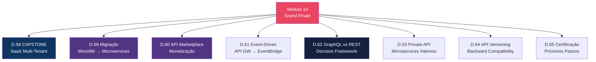
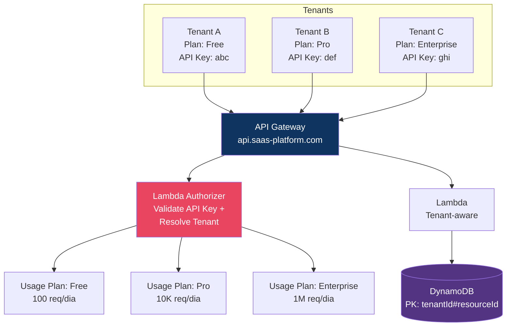
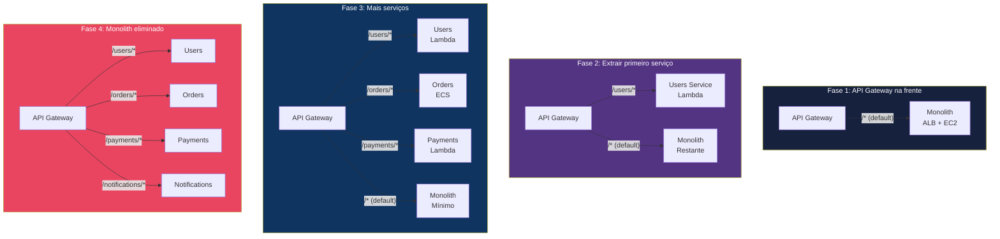
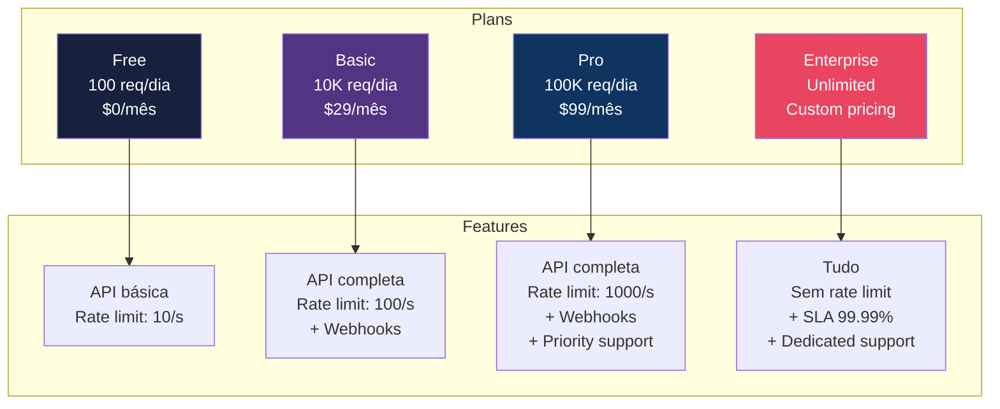
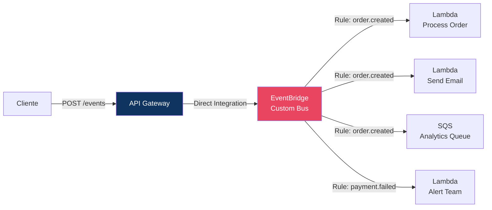

# Módulo 10 — Cenários Expert (Grand Finale)

> **Nível:** 400 (Expert)
> **Tempo Total Estimado:** 12-16 horas de labs
> **Custo Estimado:** ~$10-20
> **Objetivo do Módulo:** Aplicar tudo dos módulos 01-09 em cenários reais — plataforma SaaS multi-tenant, migração monolith para microservices, API marketplace com monetização, event-driven architecture e decisão GraphQL vs REST.

---

## Mapa do Módulo Final



---

## Desafio 58: CAPSTONE — Plataforma SaaS Multi-Tenant

> **Level:** 400 | **Tempo:** 180 min | **Custo:** ~$10

### Objetivo

Projetar a arquitetura completa de API para uma **plataforma SaaS multi-tenant** — isolamento por tenant, usage plans por plano de preço, auth centralizada e monitoring por tenant.

### Arquitetura



### Tenant Isolation Pattern

```python
# Lambda: tenant-aware CRUD
def handler(event, context):
    # Extrair tenant do authorizer context
    tenant_id = event['requestContext']['authorizer']['tenantId']
    plan = event['requestContext']['authorizer']['plan']

    method = event['httpMethod']
    path_params = event.get('pathParameters', {}) or {}

    if method == 'GET' and 'id' not in path_params:
        # Listar: query por tenant (NÃO scan!)
        result = table.query(
            KeyConditionExpression=Key('pk').eq(f'TENANT#{tenant_id}'),
            ScanIndexForward=False,
            Limit=100
        )
        return response(200, {'items': result['Items']})

    elif method == 'POST':
        body = json.loads(event['body'])
        item = {
            'pk': f'TENANT#{tenant_id}',
            'sk': f'RESOURCE#{uuid.uuid4()}',
            'tenantId': tenant_id,
            'data': body,
            'createdAt': datetime.utcnow().isoformat()
        }
        table.put_item(Item=item)
        return response(201, item)

    # Segurança: nunca acessar dados de outro tenant!
```

### O Que Aprendemos

| Conceito | Detalhe |
|----------|---------|
| Multi-tenant | 1 API serve múltiplos clientes isolados |
| Tenant isolation | DynamoDB PK com prefixo tenantId |
| Usage Plans | Planos diferentes por tier de cliente |
| Lambda Authorizer | Resolve tenant + valida permissões |
| Monitoring por tenant | Logs com tenantId para análise por cliente |

---

## Desafio 59: Migração Monolith → Microservices

> **Level:** 400 | **Tempo:** 120 min | **Custo:** ~$5

### Objetivo

Usar API Gateway como **strangler fig** para migrar gradualmente de monolith para microservices.

### Pattern Strangler Fig



### O Que Aprendemos

| Conceito | Detalhe |
|----------|---------|
| Strangler Fig | API GW na frente → extrair serviços um a um |
| Default route | `/*` aponta para monolith (catch-all) |
| Gradual migration | Cada sprint extrai 1 serviço, sem big bang |
| Zero downtime | Client não percebe a migração (mesmo URL) |
| VPC Link | Monolith continua no ALB via VPC Link |

---

## Desafio 60: API Marketplace com Monetização

> **Level:** 400 | **Tempo:** 120 min | **Custo:** ~$2

### Objetivo

Criar uma **API marketplace** com múltiplos planos de preço usando Usage Plans e API Keys.



### O Que Aprendemos

| Conceito | Detalhe |
|----------|---------|
| API marketplace | Monetização via Usage Plans + API Keys |
| Tiers | Free → Basic → Pro → Enterprise |
| Metering | `aws apigateway get-usage` para billing |
| Self-service | API Key provisioning via portal do developer |

---

## Desafio 61: Event-Driven Architecture

> **Level:** 400 | **Tempo:** 90 min | **Custo:** ~$1

### Objetivo

Integrar API Gateway com **Amazon EventBridge** para arquitetura event-driven.



### O Que Aprendemos

| Conceito | Detalhe |
|----------|---------|
| EventBridge integration | API GW publica eventos diretamente (sem Lambda) |
| Fan-out | 1 evento → múltiplos consumers |
| Decoupling | Producer não conhece consumers |
| Event schema | Estruturar eventos com source, detail-type, detail |

---

## Desafio 62: GraphQL vs REST

> **Level:** 400 | **Tempo:** 60 min | **Custo:** $0

### Decision Framework

| Aspecto | REST (API Gateway) | GraphQL (AppSync) |
|---------|-------------------|-------------------|
| **Quando usar** | CRUD simples, APIs públicas, microservices | Múltiplas fontes, mobile apps, aggregation |
| **Over-fetching** | Comum (retorna campos extras) | Não (client escolhe campos) |
| **Under-fetching** | Comum (múltiplas calls) | Não (1 query = tudo) |
| **Caching** | Simples (por URL) | Complexo (por query) |
| **Real-time** | WebSocket API (separado) | Subscriptions (nativo) |
| **Pricing** | $1-3.50/M calls | $4/M queries + $2/M updates |
| **Learning curve** | Baixa | Média-alta |
| **Tooling** | curl, Postman | Apollo, GraphQL Playground |

### O Que Aprendemos

| Conceito | Detalhe |
|----------|---------|
| REST wins | APIs simples, públicas, microservices, padrão da indústria |
| GraphQL wins | Mobile apps com múltiplas fontes, dashboards complexos |
| Não é ou | Pode usar ambos — REST para público, GraphQL para interno |

---

## Desafio 65: Certificação e Próximos Passos

> **Level:** 400 | **Tempo:** 60 min | **Custo:** $0

### O Que Este Workshop Cobriu

```
┌──────────────────────────────────────────────────────────────┐
│               API GATEWAY WORKSHOP — COMPLETO                 │
│                                                               │
│  65 desafios · 10 módulos · Level 100 → 400                 │
│                                                               │
│  REST API: resources, methods, integrations, caching         │
│  HTTP API: simples, rápido, JWT nativo, 70% mais barato     │
│  WebSocket API: real-time, chat, broadcasting                │
│  Auth: Cognito, Lambda Authorizer, IAM, JWT, mTLS, WAF      │
│  Deploy: stages, canary, custom domains, versioning          │
│  Monitoring: CloudWatch, X-Ray, access logs, troubleshooting │
│  Patterns: composition, BFF, multi-region, event-driven      │
│  Expert: SaaS multi-tenant, strangler fig, marketplace       │
│                                                               │
│  De zero a referência técnica em API Gateway.                │
└──────────────────────────────────────────────────────────────┘
```

### Próximos Workshops

```
Workshops complementares neste repo:
├── cloudfront/     → CDN + API Gateway (edge-optimized, caching)
├── aws-security/   → Segurança de APIs (WAF, IAM, Cognito)
└── (futuro) serverless/ → Lambda + API GW + DynamoDB deep dive
```

**Próximo:** Voltar ao [README principal](../README.md) e explorar os outros workshops.
