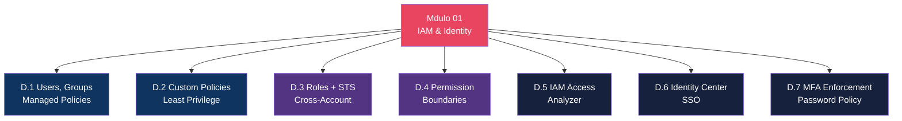

# Mdulo 01 — IAM & Identity

> **Nvel:** 100-200 (Foundational/Intermediate)
> **Tempo Total Estimado:** 12-16 horas de labs
> **Custo Estimado:** ~$0 (IAM  gratuito)
> **Objetivo do Mdulo:** Dominar completamente AWS IAM — de users e policies bsicas at permission boundaries, cross-account access, IAM Identity Center (SSO) e enforcement de MFA. IAM  o servio mais importante da AWS: se voc errar aqui, nada mais importa.

---

## Mapa do Mdulo



---

## Desafio 1: IAM Fundamentals — Users, Groups e Policies Managed

> **Level:** 100 | **Tempo:** 60 min | **Custo:** $0

### Objetivo

Criar uma estrutura IAM completa para uma empresa com 3 equipes (DevOps, Developers, Security), aplicando o princpio de **menor privilgio** usando Groups e Managed Policies.

### Cenrio

```
┌──────────────────────────────────────────────────────────────────┐
│                    Empresa: TechCorp                              │
│                                                                   │
│  Equipe DevOps (3 pessoas):                                      │
│  ├── Precisa: EC2, ECS, CloudFormation, S3, CloudWatch           │
│  ├── No precisa: IAM, Billing, Organizations                   │
│  └── MFA: Obrigatrio                                            │
│                                                                   │
│  Equipe Developers (5 pessoas):                                  │
│  ├── Precisa: Lambda, S3 (s prefixo dev/), DynamoDB, API GW   │
│  ├── No precisa: EC2, IAM, Networking                           │
│  └── MFA: Obrigatrio                                            │
│                                                                   │
│  Equipe Security (2 pessoas):                                    │
│  ├── Precisa: IAM (read), CloudTrail, GuardDuty, Config, SecHub │
│  ├── No precisa: criar/deletar recursos de produo             │
│  └── MFA: Obrigatrio + hardware key recomendado                │
└──────────────────────────────────────────────────────────────────┘
```

### Conceitos Fundamentais

```
┌──────────────────────────────────────────────────────────────────┐
│                    IAM — Hierarquia                                │
│                                                                   │
│  Root Account (NUNCA usar no dia a dia!)                         │
│  │                                                                │
│  ├── IAM Users (identidades permanentes)                         │
│  │   ├── Console access (password)                               │
│  │   ├── Programmatic access (access keys)                       │
│  │   └── Pertence a 0+ Groups                                   │
│  │                                                                │
│  ├── IAM Groups (agrupamento lgico)                             │
│  │   ├── NO  uma identidade (no pode autenticar)             │
│  │   ├── Anexa policies a TODOS os membros                      │
│  │   └── Um user pode pertencer a 10 groups (max)               │
│  │                                                                │
│  ├── IAM Roles (identidades temporrias)                         │
│  │   ├── Assumidas por: users, services, contas externas         │
│  │   ├── Credenciais temporrias via STS                         │
│  │   └── Preferidas sobre users para machines/services           │
│  │                                                                │
│  └── IAM Policies (permisses)                                   │
│      ├── AWS Managed (mantidas pela AWS, ~1000+)                 │
│      ├── Customer Managed (criadas por voc)                     │
│      ├── Inline (embutidas no user/group/role)                   │
│      └── Evaluation: Deny explcito > Allow > Deny implcito    │
└──────────────────────────────────────────────────────────────────┘
```

### Passo a Passo

#### Passo 1 — Criar Groups

```bash
# Criar grupos para cada equipe
aws iam create-group --group-name DevOps
aws iam create-group --group-name Developers
aws iam create-group --group-name Security

# Verificar
aws iam list-groups --query 'Groups[].GroupName' --output table
```

#### Passo 2 — Anexar Managed Policies aos Groups

```bash
# === DevOps Group ===
# EC2 Full
aws iam attach-group-policy --group-name DevOps \
  --policy-arn "arn:aws:iam::aws:policy/AmazonEC2FullAccess"

# ECS Full
aws iam attach-group-policy --group-name DevOps \
  --policy-arn "arn:aws:iam::aws:policy/AmazonECS_FullAccess"

# CloudFormation Full
aws iam attach-group-policy --group-name DevOps \
  --policy-arn "arn:aws:iam::aws:policy/AWSCloudFormationFullAccess"

# S3 Full
aws iam attach-group-policy --group-name DevOps \
  --policy-arn "arn:aws:iam::aws:policy/AmazonS3FullAccess"

# CloudWatch Full
aws iam attach-group-policy --group-name DevOps \
  --policy-arn "arn:aws:iam::aws:policy/CloudWatchFullAccess"

# === Developers Group ===
# Lambda Full
aws iam attach-group-policy --group-name Developers \
  --policy-arn "arn:aws:iam::aws:policy/AWSLambda_FullAccess"

# DynamoDB Full
aws iam attach-group-policy --group-name Developers \
  --policy-arn "arn:aws:iam::aws:policy/AmazonDynamoDBFullAccess"

# API Gateway Full
aws iam attach-group-policy --group-name Developers \
  --policy-arn "arn:aws:iam::aws:policy/AmazonAPIGatewayAdministrator"

# S3 — vamos criar custom policy no Desafio 2 (restringir a prefixo dev/)

# === Security Group ===
# Security Audit (read-only de segurana)
aws iam attach-group-policy --group-name Security \
  --policy-arn "arn:aws:iam::aws:policy/SecurityAudit"

# GuardDuty Read
aws iam attach-group-policy --group-name Security \
  --policy-arn "arn:aws:iam::aws:policy/AmazonGuardDutyReadOnlyAccess"

# Verificar policies de cada grupo
for GROUP in DevOps Developers Security; do
  echo "=== $GROUP ==="
  aws iam list-attached-group-policies --group-name "$GROUP" \
    --query 'AttachedPolicies[].PolicyName' --output table
done
```

#### Passo 3 — Criar Users e Adicionar aos Groups

```bash
# Criar users (sem console access por enquanto)
DEVOPS_USERS=("maria-devops" "pedro-devops" "ana-devops")
DEV_USERS=("joao-dev" "carla-dev" "lucas-dev" "julia-dev" "rafael-dev")
SEC_USERS=("fernanda-sec" "ricardo-sec")

for USER in "${DEVOPS_USERS[@]}"; do
  aws iam create-user --user-name "$USER"
  aws iam add-user-to-group --group-name DevOps --user-name "$USER"
  echo "Criado e adicionado ao DevOps: $USER"
done

for USER in "${DEV_USERS[@]}"; do
  aws iam create-user --user-name "$USER"
  aws iam add-user-to-group --group-name Developers --user-name "$USER"
  echo "Criado e adicionado ao Developers: $USER"
done

for USER in "${SEC_USERS[@]}"; do
  aws iam create-user --user-name "$USER"
  aws iam add-user-to-group --group-name Security --user-name "$USER"
  echo "Criado e adicionado ao Security: $USER"
done

# Habilitar console access com senha temporria
for USER in "${DEVOPS_USERS[@]}" "${DEV_USERS[@]}" "${SEC_USERS[@]}"; do
  TEMP_PASS=$(openssl rand -base64 16)
  aws iam create-login-profile \
    --user-name "$USER" \
    --password "$TEMP_PASS" \
    --password-reset-required
  echo "$USER: $TEMP_PASS (deve trocar no primeiro login)"
done
```

#### Passo 4 — Configurar Password Policy

```bash
# Password policy rigorosa para toda a conta
aws iam update-account-password-policy \
  --minimum-password-length 14 \
  --require-symbols \
  --require-numbers \
  --require-uppercase-characters \
  --require-lowercase-characters \
  --allow-users-to-change-password \
  --max-password-age 90 \
  --password-reuse-prevention 12 \
  --hard-expiry

# Verificar
aws iam get-account-password-policy --output table
```

### Terraform

```hcl
# ============================================
# IAM — Estrutura Completa com Terraform
# ============================================

# Password Policy
resource "aws_iam_account_password_policy" "strict" {
  minimum_password_length        = 14
  require_lowercase_characters   = true
  require_uppercase_characters   = true
  require_numbers                = true
  require_symbols                = true
  allow_users_to_change_password = true
  max_password_age               = 90
  password_reuse_prevention      = 12
  hard_expiry                    = true
}

# Groups
resource "aws_iam_group" "devops" {
  name = "DevOps"
}

resource "aws_iam_group" "developers" {
  name = "Developers"
}

resource "aws_iam_group" "security" {
  name = "Security"
}

# Managed Policy Attachments — DevOps
resource "aws_iam_group_policy_attachment" "devops_ec2" {
  group      = aws_iam_group.devops.name
  policy_arn = "arn:aws:iam::aws:policy/AmazonEC2FullAccess"
}

resource "aws_iam_group_policy_attachment" "devops_ecs" {
  group      = aws_iam_group.devops.name
  policy_arn = "arn:aws:iam::aws:policy/AmazonECS_FullAccess"
}

resource "aws_iam_group_policy_attachment" "devops_cfn" {
  group      = aws_iam_group.devops.name
  policy_arn = "arn:aws:iam::aws:policy/AWSCloudFormationFullAccess"
}

resource "aws_iam_group_policy_attachment" "devops_s3" {
  group      = aws_iam_group.devops.name
  policy_arn = "arn:aws:iam::aws:policy/AmazonS3FullAccess"
}

resource "aws_iam_group_policy_attachment" "devops_cw" {
  group      = aws_iam_group.devops.name
  policy_arn = "arn:aws:iam::aws:policy/CloudWatchFullAccess"
}

# Managed Policy Attachments — Developers
resource "aws_iam_group_policy_attachment" "dev_lambda" {
  group      = aws_iam_group.developers.name
  policy_arn = "arn:aws:iam::aws:policy/AWSLambda_FullAccess"
}

resource "aws_iam_group_policy_attachment" "dev_dynamo" {
  group      = aws_iam_group.developers.name
  policy_arn = "arn:aws:iam::aws:policy/AmazonDynamoDBFullAccess"
}

resource "aws_iam_group_policy_attachment" "dev_apigw" {
  group      = aws_iam_group.developers.name
  policy_arn = "arn:aws:iam::aws:policy/AmazonAPIGatewayAdministrator"
}

# Managed Policy Attachments — Security
resource "aws_iam_group_policy_attachment" "sec_audit" {
  group      = aws_iam_group.security.name
  policy_arn = "arn:aws:iam::aws:policy/SecurityAudit"
}

resource "aws_iam_group_policy_attachment" "sec_guardduty" {
  group      = aws_iam_group.security.name
  policy_arn = "arn:aws:iam::aws:policy/AmazonGuardDutyReadOnlyAccess"
}

# Users (exemplo com loop)
locals {
  devops_users = ["maria-devops", "pedro-devops", "ana-devops"]
  dev_users    = ["joao-dev", "carla-dev", "lucas-dev", "julia-dev", "rafael-dev"]
  sec_users    = ["fernanda-sec", "ricardo-sec"]
}

resource "aws_iam_user" "devops" {
  for_each = toset(local.devops_users)
  name     = each.value
  tags     = { Team = "DevOps" }
}

resource "aws_iam_user_group_membership" "devops" {
  for_each = toset(local.devops_users)
  user     = aws_iam_user.devops[each.value].name
  groups   = [aws_iam_group.devops.name]
}

resource "aws_iam_user" "developers" {
  for_each = toset(local.dev_users)
  name     = each.value
  tags     = { Team = "Developers" }
}

resource "aws_iam_user_group_membership" "developers" {
  for_each = toset(local.dev_users)
  user     = aws_iam_user.developers[each.value].name
  groups   = [aws_iam_group.developers.name]
}

resource "aws_iam_user" "security" {
  for_each = toset(local.sec_users)
  name     = each.value
  tags     = { Team = "Security" }
}

resource "aws_iam_user_group_membership" "security" {
  for_each = toset(local.sec_users)
  user     = aws_iam_user.security[each.value].name
  groups   = [aws_iam_group.security.name]
}
```

### Validao

```bash
# 1. Listar todos os users e seus groups
aws iam list-users --query 'Users[].UserName' --output table
aws iam get-group --group-name DevOps --query 'Users[].UserName' --output table
aws iam get-group --group-name Developers --query 'Users[].UserName' --output table
aws iam get-group --group-name Security --query 'Users[].UserName' --output table

# 2. Simular permisso: maria-devops pode criar EC2?
aws iam simulate-principal-policy \
  --policy-source-arn "arn:aws:iam::$(aws sts get-caller-identity --query Account --output text):user/maria-devops" \
  --action-names "ec2:RunInstances" \
  --output table
# Esperado: allowed

# 3. Simular: joao-dev pode criar EC2? (no deveria)
aws iam simulate-principal-policy \
  --policy-source-arn "arn:aws:iam::$(aws sts get-caller-identity --query Account --output text):user/joao-dev" \
  --action-names "ec2:RunInstances" \
  --output table
# Esperado: implicitDeny

# 4. Verificar password policy
aws iam get-account-password-policy --output table
```

### O Que Aprendemos

| Conceito | Detalhe |
|----------|---------|
| IAM Users | Identidades permanentes — para pessoas (no machines!) |
| IAM Groups | Agrupamento lgico para aplicar policies coletivamente |
| Managed Policies | AWS mantm ~1000+ policies prontas — usar como base |
| Password Policy | Mnimo 14 chars, complexidade, rotao 90 dias, histrico 12 |
| `simulate-principal-policy` | Testar permisses ANTES de dar acesso real |
| Root Account | NUNCA usar — habilitar MFA e guardar credenciais em cofre |
| Limites | Max 10 groups por user, 10 managed policies por group |

> **💡 Expert Tip:** NUNCA use Inline Policies em produo. Managed Policies (AWS ou Customer) so reutilizveis, versionadas e aparecem no IAM Access Analyzer. Inline policies ficam "escondidas" no user/group/role e so invisveis para auditorias. A nica exceo legtima: quando a policy  to especfica que s faz sentido para aquele recurso exato (ex: policy de uma Lambda que s acessa um bucket especfico).

---

## Desafio 2: Custom IAM Policies — Least Privilege na Prtica

> **Level:** 200 | **Tempo:** 90 min | **Custo:** $0

### Objetivo

Criar **custom IAM policies** seguindo o princpio de **menor privilgio** (least privilege) — dar exatamente as permisses necessrias, nada mais. Cobrir: condition keys, resource-level permissions, tags e variveis de policy.

### Cenrio

Os Developers precisam de acesso ao S3, mas APENAS:
- Bucket: `techcorp-app-data`
- Prefixo: `dev/*` (no podem acessar `prod/*`)
- Aes: Read + Write (no Delete, no gerenciar bucket)
- Condio: Somente de IPs do escritrio ou VPC

```
┌──────────────────────────────────────────────────────────────────┐
│              Least Privilege — Anatomia de uma Policy              │
│                                                                   │
│  {                                                               │
│    "Version": "2012-10-17",       ← Sempre usar esta verso     │
│    "Statement": [                                                │
│      {                                                           │
│        "Sid": "nome-legvel",      ← Identificador opcional      │
│        "Effect": "Allow|Deny",    ← Permitir ou Negar           │
│        "Action": [...],           ← O QUE pode fazer            │
│        "Resource": [...],         ← EM QUAIS recursos           │
│        "Condition": {...}         ← QUANDO/DE ONDE (opcional)    │
│      }                                                           │
│    ]                                                             │
│  }                                                               │
│                                                                   │
│  Regras de Avaliao:                                             │
│  1. Deny explcito SEMPRE ganha                                  │
│  2. Allow  necessrio (seno  negado implicitamente)           │
│  3. Se Deny E Allow existem → Deny ganha                        │
│  4. Root account ignora policies (quase tudo  permitido)       │
└──────────────────────────────────────────────────────────────────┘
```

### Passo a Passo

#### Passo 1 — Policy: S3 Restrito por Prefixo

```json
{
  "Version": "2012-10-17",
  "Statement": [
    {
      "Sid": "AllowListBucket",
      "Effect": "Allow",
      "Action": [
        "s3:ListBucket"
      ],
      "Resource": "arn:aws:s3:::techcorp-app-data",
      "Condition": {
        "StringLike": {
          "s3:prefix": ["dev/*", "dev/"]
        }
      }
    },
    {
      "Sid": "AllowReadWriteDevPrefix",
      "Effect": "Allow",
      "Action": [
        "s3:GetObject",
        "s3:PutObject",
        "s3:GetObjectVersion",
        "s3:GetObjectTagging",
        "s3:PutObjectTagging"
      ],
      "Resource": "arn:aws:s3:::techcorp-app-data/dev/*"
    },
    {
      "Sid": "DenyDeleteEverything",
      "Effect": "Deny",
      "Action": [
        "s3:DeleteObject",
        "s3:DeleteObjectVersion",
        "s3:DeleteBucket"
      ],
      "Resource": [
        "arn:aws:s3:::techcorp-app-data",
        "arn:aws:s3:::techcorp-app-data/*"
      ]
    },
    {
      "Sid": "DenyProdAccess",
      "Effect": "Deny",
      "Action": "s3:*",
      "Resource": "arn:aws:s3:::techcorp-app-data/prod/*"
    }
  ]
}
```

```bash
# Criar a policy
aws iam create-policy \
  --policy-name "S3-DevPrefix-ReadWrite" \
  --description "S3 access restricted to dev/ prefix, no delete" \
  --policy-document file:///tmp/s3-dev-policy.json

# Anexar ao grupo Developers
POLICY_ARN=$(aws iam list-policies --scope Local \
  --query 'Policies[?PolicyName==`S3-DevPrefix-ReadWrite`].Arn' --output text)

aws iam attach-group-policy \
  --group-name Developers \
  --policy-arn "$POLICY_ARN"
```

#### Passo 2 — Policy com Condition Keys (IP + MFA)

```json
{
  "Version": "2012-10-17",
  "Statement": [
    {
      "Sid": "AllowOnlyFromOfficeOrVPC",
      "Effect": "Deny",
      "Action": "*",
      "Resource": "*",
      "Condition": {
        "NotIpAddress": {
          "aws:SourceIp": [
            "203.0.113.0/24",
            "198.51.100.0/24"
          ]
        },
        "StringNotEquals": {
          "aws:SourceVpc": "vpc-0abc123def456"
        }
      }
    },
    {
      "Sid": "DenyWithoutMFA",
      "Effect": "Deny",
      "NotAction": [
        "iam:CreateVirtualMFADevice",
        "iam:EnableMFADevice",
        "iam:GetUser",
        "iam:ListMFADevices",
        "iam:ListVirtualMFADevices",
        "iam:ResyncMFADevice",
        "sts:GetSessionToken"
      ],
      "Resource": "*",
      "Condition": {
        "BoolIfExists": {
          "aws:MultiFactorAuthPresent": "false"
        }
      }
    }
  ]
}
```

#### Passo 3 — Policy com Variveis (Self-Management)

```json
{
  "Version": "2012-10-17",
  "Statement": [
    {
      "Sid": "AllowUserToManageOwnCredentials",
      "Effect": "Allow",
      "Action": [
        "iam:ChangePassword",
        "iam:GetUser",
        "iam:CreateAccessKey",
        "iam:DeleteAccessKey",
        "iam:ListAccessKeys",
        "iam:UpdateAccessKey",
        "iam:GetAccessKeyLastUsed",
        "iam:CreateVirtualMFADevice",
        "iam:EnableMFADevice",
        "iam:DeactivateMFADevice",
        "iam:DeleteVirtualMFADevice",
        "iam:ListMFADevices"
      ],
      "Resource": "arn:aws:iam::*:user/${aws:username}"
    },
    {
      "Sid": "AllowUserToListAll",
      "Effect": "Allow",
      "Action": [
        "iam:ListUsers",
        "iam:ListVirtualMFADevices"
      ],
      "Resource": "*"
    }
  ]
}
```

#### Passo 4 — Policy Baseada em Tags (ABAC)

```json
{
  "Version": "2012-10-17",
  "Statement": [
    {
      "Sid": "AllowEC2ActionsOnOwnTeamResources",
      "Effect": "Allow",
      "Action": [
        "ec2:StartInstances",
        "ec2:StopInstances",
        "ec2:RebootInstances"
      ],
      "Resource": "arn:aws:ec2:*:*:instance/*",
      "Condition": {
        "StringEquals": {
          "ec2:ResourceTag/Team": "${aws:PrincipalTag/Team}"
        }
      }
    },
    {
      "Sid": "AllowEC2CreateWithTeamTag",
      "Effect": "Allow",
      "Action": "ec2:RunInstances",
      "Resource": "*",
      "Condition": {
        "StringEquals": {
          "aws:RequestTag/Team": "${aws:PrincipalTag/Team}"
        },
        "ForAllValues:StringEquals": {
          "aws:TagKeys": ["Team", "Environment", "Name"]
        }
      }
    },
    {
      "Sid": "DenyUntaggedResources",
      "Effect": "Deny",
      "Action": "ec2:RunInstances",
      "Resource": "arn:aws:ec2:*:*:instance/*",
      "Condition": {
        "Null": {
          "aws:RequestTag/Team": "true"
        }
      }
    }
  ]
}
```

### Terraform

```hcl
# ============================================
# CUSTOM IAM POLICIES — Least Privilege
# ============================================

# Policy 1: S3 restrito por prefixo
resource "aws_iam_policy" "s3_dev_prefix" {
  name        = "S3-DevPrefix-ReadWrite"
  description = "S3 access restricted to dev/ prefix in techcorp-app-data"

  policy = jsonencode({
    Version = "2012-10-17"
    Statement = [
      {
        Sid      = "AllowListBucket"
        Effect   = "Allow"
        Action   = ["s3:ListBucket"]
        Resource = "arn:aws:s3:::techcorp-app-data"
        Condition = {
          StringLike = { "s3:prefix" = ["dev/*", "dev/"] }
        }
      },
      {
        Sid    = "AllowReadWriteDevPrefix"
        Effect = "Allow"
        Action = [
          "s3:GetObject", "s3:PutObject",
          "s3:GetObjectVersion", "s3:GetObjectTagging", "s3:PutObjectTagging"
        ]
        Resource = "arn:aws:s3:::techcorp-app-data/dev/*"
      },
      {
        Sid      = "DenyDelete"
        Effect   = "Deny"
        Action   = ["s3:DeleteObject", "s3:DeleteObjectVersion", "s3:DeleteBucket"]
        Resource = ["arn:aws:s3:::techcorp-app-data", "arn:aws:s3:::techcorp-app-data/*"]
      },
      {
        Sid      = "DenyProd"
        Effect   = "Deny"
        Action   = "s3:*"
        Resource = "arn:aws:s3:::techcorp-app-data/prod/*"
      }
    ]
  })
}

resource "aws_iam_group_policy_attachment" "dev_s3" {
  group      = aws_iam_group.developers.name
  policy_arn = aws_iam_policy.s3_dev_prefix.arn
}

# Policy 2: ABAC (Attribute-Based Access Control)
resource "aws_iam_policy" "abac_ec2" {
  name        = "ABAC-EC2-TeamBased"
  description = "EC2 access based on Team tag match"

  policy = jsonencode({
    Version = "2012-10-17"
    Statement = [
      {
        Sid    = "AllowEC2OnOwnTeam"
        Effect = "Allow"
        Action = ["ec2:StartInstances", "ec2:StopInstances", "ec2:RebootInstances"]
        Resource = "arn:aws:ec2:*:*:instance/*"
        Condition = {
          StringEquals = {
            "ec2:ResourceTag/Team" = "$${aws:PrincipalTag/Team}"
          }
        }
      }
    ]
  })
}

# Policy 3: Enforce MFA
resource "aws_iam_policy" "enforce_mfa" {
  name        = "EnforceMFA"
  description = "Deny all actions except self-management without MFA"

  policy = jsonencode({
    Version = "2012-10-17"
    Statement = [
      {
        Sid       = "AllowSelfManagement"
        Effect    = "Allow"
        Action    = [
          "iam:ChangePassword", "iam:GetUser",
          "iam:CreateVirtualMFADevice", "iam:EnableMFADevice",
          "iam:ListMFADevices", "iam:ListVirtualMFADevices",
          "iam:DeactivateMFADevice", "iam:DeleteVirtualMFADevice",
          "iam:ResyncMFADevice"
        ]
        Resource = "arn:aws:iam::*:user/$${aws:username}"
      },
      {
        Sid       = "DenyAllWithoutMFA"
        Effect    = "Deny"
        NotAction = [
          "iam:CreateVirtualMFADevice", "iam:EnableMFADevice",
          "iam:GetUser", "iam:ListMFADevices",
          "iam:ListVirtualMFADevices", "iam:ResyncMFADevice",
          "sts:GetSessionToken"
        ]
        Resource = "*"
        Condition = {
          BoolIfExists = { "aws:MultiFactorAuthPresent" = "false" }
        }
      }
    ]
  })
}

# Anexar MFA enforcement a todos os grupos
resource "aws_iam_group_policy_attachment" "devops_mfa" {
  group      = aws_iam_group.devops.name
  policy_arn = aws_iam_policy.enforce_mfa.arn
}

resource "aws_iam_group_policy_attachment" "dev_mfa" {
  group      = aws_iam_group.developers.name
  policy_arn = aws_iam_policy.enforce_mfa.arn
}

resource "aws_iam_group_policy_attachment" "sec_mfa" {
  group      = aws_iam_group.security.name
  policy_arn = aws_iam_policy.enforce_mfa.arn
}
```

### Validao

```bash
# 1. Simular: dev pode ler dev/ prefix?
aws iam simulate-principal-policy \
  --policy-source-arn "arn:aws:iam::$(aws sts get-caller-identity --query Account --output text):user/joao-dev" \
  --action-names "s3:GetObject" \
  --resource-arns "arn:aws:s3:::techcorp-app-data/dev/file.txt" \
  --output table
# Esperado: allowed

# 2. Simular: dev pode ler prod/ prefix?
aws iam simulate-principal-policy \
  --policy-source-arn "arn:aws:iam::$(aws sts get-caller-identity --query Account --output text):user/joao-dev" \
  --action-names "s3:GetObject" \
  --resource-arns "arn:aws:s3:::techcorp-app-data/prod/secrets.json" \
  --output table
# Esperado: explicitDeny

# 3. Simular: dev pode deletar?
aws iam simulate-principal-policy \
  --policy-source-arn "arn:aws:iam::$(aws sts get-caller-identity --query Account --output text):user/joao-dev" \
  --action-names "s3:DeleteObject" \
  --resource-arns "arn:aws:s3:::techcorp-app-data/dev/file.txt" \
  --output table
# Esperado: explicitDeny

# 4. Validar policy com IAM Policy Simulator (console)
echo "Acesse: https://policysim.aws.amazon.com/"
```

### Condition Keys — Referncia Rpida

| Condition Key | Uso | Exemplo |
|--------------|-----|---------|
| `aws:SourceIp` | Restringir por IP de origem | Permitir s do escritrio |
| `aws:SourceVpc` | Restringir por VPC | Permitir s de dentro da VPC |
| `aws:MultiFactorAuthPresent` | Exigir MFA | Negar sem MFA |
| `aws:PrincipalTag/TagKey` | Tag do IAM principal | ABAC por equipe |
| `aws:RequestTag/TagKey` | Tag do request (criao) | Forar tags ao criar |
| `aws:ResourceTag/TagKey` | Tag do recurso existente | Restringir por tag do recurso |
| `aws:CurrentTime` | Horrio da ao | Permitir s em horrio comercial |
| `aws:PrincipalOrgID` | ID da Organization | Restringir a contas da org |
| `s3:prefix` | Prefixo S3 no ListBucket | Restringir listagem por pasta |
| `ec2:InstanceType` | Tipo de instncia | Limitar a t3.micro |
| `ec2:Region` | Regio | Permitir s em sa-east-1 |

### O Que Aprendemos

| Conceito | Detalhe |
|----------|---------|
| Least Privilege | Dar EXATAMENTE o necessrio — nada mais |
| Resource-level | Especificar ARN do recurso, no usar `*` |
| Condition Keys | Restringir por IP, MFA, VPC, tags, horrio |
| ABAC | Attribute-Based Access Control — policies baseadas em tags |
| Policy Variables | `${aws:username}`, `${aws:PrincipalTag/Team}` — policies dinmicas |
| Deny sempre ganha | Deny explcito > Allow > Deny implcito |
| `simulate-principal-policy` | Testar policies ANTES de aplicar — essencial |

> **💡 Expert Tip:** Use `aws iam simulate-principal-policy` ANTES de dar acesso a qualquer pessoa. Em produo, use IAM Access Analyzer para gerar policies baseadas em atividade real (policy generation). Ao invs de adivinhar quais permisses algum precisa, habilite CloudTrail, espere 30 dias, e use Access Analyzer para gerar a policy mnima baseada no que a pessoa REALMENTE usou.

---

## Desafio 3: IAM Roles e STS — AssumeRole Cross-Account

> **Level:** 200 | **Tempo:** 90 min | **Custo:** $0

### Objetivo

Dominar **IAM Roles** e **AWS STS (Security Token Service)** para acesso cross-account, service roles e federao. Roles so a forma CORRETA de conceder acesso temporrio a servios, contas externas e workflows de CI/CD.

### Cenrio

```
┌──────────────────────────────────────────────────────────────────┐
│                  Cross-Account Access                             │
│                                                                   │
│  Conta DEV (111111111111)          Conta PROD (222222222222)     │
│  ┌──────────────────────┐          ┌──────────────────────┐      │
│  │                      │          │                      │      │
│  │  IAM User:           │  assume  │  IAM Role:           │      │
│  │  maria-devops    ────┼──────────┼→ DeployRole          │      │
│  │                      │   STS    │  ├── ECS deploy      │      │
│  │  Tem: policy que     │          │  ├── S3 access       │      │
│  │  permite assumir     │          │  └── CloudWatch logs │      │
│  │  role na conta PROD  │          │                      │      │
│  └──────────────────────┘          │  Trust Policy:       │      │
│                                    │  "Conta 111.. pode   │      │
│                                    │   assumir esta role"  │      │
│                                    └──────────────────────┘      │
│                                                                   │
│  Credenciais: temporrias (1h default, max 12h)                  │
│  Auditoria: CloudTrail registra quem assumiu, quando, de onde    │
└──────────────────────────────────────────────────────────────────┘
```

### Conceitos: Trust Policy vs Permission Policy

```
IAM Role = Trust Policy + Permission Policy

Trust Policy (quem PODE assumir):
  "Quem tem permisso de chamar sts:AssumeRole nesta role?"
  → Users da conta 111111111111
  → Servio EC2 (para instance profiles)
  → Servio Lambda (para execution roles)
  → Conta externa 333333333333

Permission Policy (o que PODE fazer aps assumir):
  "Aps assumir, quais aes so permitidas?"
  → Tudo que uma policy normal permite
  → Mesmas condition keys, resource ARNs, etc.
```

### Passo a Passo

#### Passo 1 — Criar Role na Conta Destino (PROD)

```bash
# Na CONTA PROD (222222222222)

# Trust Policy: permite users da conta DEV assumir esta role
cat > /tmp/trust-policy.json << 'EOF'
{
  "Version": "2012-10-17",
  "Statement": [
    {
      "Sid": "AllowDevAccountToAssume",
      "Effect": "Allow",
      "Principal": {
        "AWS": "arn:aws:iam::111111111111:root"
      },
      "Action": "sts:AssumeRole",
      "Condition": {
        "Bool": {
          "aws:MultiFactorAuthPresent": "true"
        },
        "StringEquals": {
          "sts:ExternalId": "techcorp-cross-account-2026"
        }
      }
    }
  ]
}
EOF

# Criar a role
aws iam create-role \
  --role-name DeployRole \
  --assume-role-policy-document file:///tmp/trust-policy.json \
  --description "Role for DevOps team to deploy from DEV account" \
  --max-session-duration 3600 \
  --tags Key=Team,Value=DevOps Key=Environment,Value=production

# Anexar permissions
aws iam attach-role-policy \
  --role-name DeployRole \
  --policy-arn "arn:aws:iam::aws:policy/AmazonECS_FullAccess"

aws iam attach-role-policy \
  --role-name DeployRole \
  --policy-arn "arn:aws:iam::aws:policy/AmazonS3ReadOnlyAccess"
```

#### Passo 2 — Permitir User na Conta Origem (DEV) Assumir

```bash
# Na CONTA DEV (111111111111)

cat > /tmp/assume-role-policy.json << 'EOF'
{
  "Version": "2012-10-17",
  "Statement": [
    {
      "Sid": "AllowAssumeDeployRoleInProd",
      "Effect": "Allow",
      "Action": "sts:AssumeRole",
      "Resource": "arn:aws:iam::222222222222:role/DeployRole"
    }
  ]
}
EOF

aws iam create-policy \
  --policy-name "AssumeDeployRoleInProd" \
  --policy-document file:///tmp/assume-role-policy.json

POLICY_ARN=$(aws iam list-policies --scope Local \
  --query 'Policies[?PolicyName==`AssumeDeployRoleInProd`].Arn' --output text)

aws iam attach-group-policy \
  --group-name DevOps \
  --policy-arn "$POLICY_ARN"
```

#### Passo 3 — Assumir a Role via CLI

```bash
# maria-devops assume a role na conta PROD
CREDENTIALS=$(aws sts assume-role \
  --role-arn "arn:aws:iam::222222222222:role/DeployRole" \
  --role-session-name "maria-deploy-$(date +%Y%m%d)" \
  --external-id "techcorp-cross-account-2026" \
  --duration-seconds 3600 \
  --query 'Credentials' --output json)

# Exportar credenciais temporrias
export AWS_ACCESS_KEY_ID=$(echo $CREDENTIALS | jq -r '.AccessKeyId')
export AWS_SECRET_ACCESS_KEY=$(echo $CREDENTIALS | jq -r '.SecretAccessKey')
export AWS_SESSION_TOKEN=$(echo $CREDENTIALS | jq -r '.SessionToken')

# Verificar identidade (deve mostrar a role, no o user)
aws sts get-caller-identity
# {
#   "UserId": "AROA...:maria-deploy-20260407",
#   "Account": "222222222222",
#   "Arn": "arn:aws:sts::222222222222:assumed-role/DeployRole/maria-deploy-20260407"
# }

# Agora pode operar na conta PROD
aws ecs list-clusters
aws s3 ls

# Limpar variveis (voltar para identidade original)
unset AWS_ACCESS_KEY_ID AWS_SECRET_ACCESS_KEY AWS_SESSION_TOKEN
```

#### Passo 4 — Service Roles (EC2, Lambda)

```bash
# EC2 Instance Profile — permite EC2 assumir role
cat > /tmp/ec2-trust.json << 'EOF'
{
  "Version": "2012-10-17",
  "Statement": [
    {
      "Effect": "Allow",
      "Principal": {
        "Service": "ec2.amazonaws.com"
      },
      "Action": "sts:AssumeRole"
    }
  ]
}
EOF

aws iam create-role \
  --role-name EC2-AppServer-Role \
  --assume-role-policy-document file:///tmp/ec2-trust.json

# Attach permissions para a aplicao
aws iam attach-role-policy --role-name EC2-AppServer-Role \
  --policy-arn "arn:aws:iam::aws:policy/AmazonS3ReadOnlyAccess"
aws iam attach-role-policy --role-name EC2-AppServer-Role \
  --policy-arn "arn:aws:iam::aws:policy/AmazonDynamoDBReadOnlyAccess"

# Criar instance profile e associar
aws iam create-instance-profile --instance-profile-name EC2-AppServer-Profile
aws iam add-role-to-instance-profile \
  --instance-profile-name EC2-AppServer-Profile \
  --role-name EC2-AppServer-Role

# Lambda Execution Role
cat > /tmp/lambda-trust.json << 'EOF'
{
  "Version": "2012-10-17",
  "Statement": [
    {
      "Effect": "Allow",
      "Principal": {
        "Service": "lambda.amazonaws.com"
      },
      "Action": "sts:AssumeRole"
    }
  ]
}
EOF

aws iam create-role \
  --role-name Lambda-ProcessOrders-Role \
  --assume-role-policy-document file:///tmp/lambda-trust.json

aws iam attach-role-policy --role-name Lambda-ProcessOrders-Role \
  --policy-arn "arn:aws:iam::aws:policy/service-role/AWSLambdaBasicExecutionRole"
```

### Terraform

```hcl
# ============================================
# CROSS-ACCOUNT ROLE (na conta PROD)
# ============================================

resource "aws_iam_role" "deploy" {
  name               = "DeployRole"
  max_session_duration = 3600
  description        = "Cross-account deploy role for DevOps"

  assume_role_policy = jsonencode({
    Version = "2012-10-17"
    Statement = [
      {
        Sid    = "AllowDevAccount"
        Effect = "Allow"
        Principal = {
          AWS = "arn:aws:iam::111111111111:root"
        }
        Action = "sts:AssumeRole"
        Condition = {
          Bool = { "aws:MultiFactorAuthPresent" = "true" }
          StringEquals = { "sts:ExternalId" = "techcorp-cross-account-2026" }
        }
      }
    ]
  })

  tags = { Team = "DevOps", Environment = "production" }
}

resource "aws_iam_role_policy_attachment" "deploy_ecs" {
  role       = aws_iam_role.deploy.name
  policy_arn = "arn:aws:iam::aws:policy/AmazonECS_FullAccess"
}

# ============================================
# ASSUME ROLE POLICY (na conta DEV)
# ============================================

resource "aws_iam_policy" "assume_prod_deploy" {
  name = "AssumeDeployRoleInProd"
  policy = jsonencode({
    Version = "2012-10-17"
    Statement = [
      {
        Effect   = "Allow"
        Action   = "sts:AssumeRole"
        Resource = "arn:aws:iam::222222222222:role/DeployRole"
      }
    ]
  })
}

resource "aws_iam_group_policy_attachment" "devops_assume" {
  group      = "DevOps"
  policy_arn = aws_iam_policy.assume_prod_deploy.arn
}

# ============================================
# SERVICE ROLES
# ============================================

# EC2 Instance Profile
resource "aws_iam_role" "ec2_app" {
  name = "EC2-AppServer-Role"
  assume_role_policy = jsonencode({
    Version = "2012-10-17"
    Statement = [{
      Effect    = "Allow"
      Principal = { Service = "ec2.amazonaws.com" }
      Action    = "sts:AssumeRole"
    }]
  })
}

resource "aws_iam_instance_profile" "ec2_app" {
  name = "EC2-AppServer-Profile"
  role = aws_iam_role.ec2_app.name
}

# Lambda Execution Role
resource "aws_iam_role" "lambda_orders" {
  name = "Lambda-ProcessOrders-Role"
  assume_role_policy = jsonencode({
    Version = "2012-10-17"
    Statement = [{
      Effect    = "Allow"
      Principal = { Service = "lambda.amazonaws.com" }
      Action    = "sts:AssumeRole"
    }]
  })
}

resource "aws_iam_role_policy_attachment" "lambda_basic" {
  role       = aws_iam_role.lambda_orders.name
  policy_arn = "arn:aws:iam::aws:policy/service-role/AWSLambdaBasicExecutionRole"
}
```

### Validao

```bash
# 1. Verificar trust policy da role
aws iam get-role --role-name DeployRole \
  --query 'Role.AssumeRolePolicyDocument' --output json | jq .

# 2. Testar assume-role
aws sts assume-role \
  --role-arn "arn:aws:iam::222222222222:role/DeployRole" \
  --role-session-name "test-assume" \
  --external-id "techcorp-cross-account-2026" \
  --query 'Credentials.Expiration' --output text

# 3. Verificar no CloudTrail quem assumiu
aws cloudtrail lookup-events \
  --lookup-attributes AttributeKey=EventName,AttributeValue=AssumeRole \
  --max-results 5 \
  --query 'Events[].{Time:EventTime,User:Username}' --output table
```

### O Que Aprendemos

| Conceito | Detalhe |
|----------|---------|
| IAM Role | Identidade temporria sem credenciais permanentes |
| Trust Policy | Quem PODE assumir a role (Principal) |
| Permission Policy | O que PODE fazer aps assumir |
| STS AssumeRole | API que retorna credenciais temporrias (1-12h) |
| External ID | Proteo contra "confused deputy" em cross-account |
| Instance Profile | Wrapper de role para EC2 — credenciais automticas via IMDS |
| Session Name | Identificador da sesso no CloudTrail — usar nome da pessoa |
| MFA Condition | Exigir MFA na trust policy para operaes sensveis |

> **💡 Expert Tip:** External ID  essencial em cenrios multi-tenant. Sem ele, uma conta maliciosa pode pedir para voc assumir uma role em OUTRA conta dela, usando sua trust policy como "ponte" (confused deputy attack). Com External ID, o atacante precisaria saber o ID secreto. Em CI/CD, use OIDC federation (GitHub Actions, GitLab CI) em vez de access keys — o IdP gera tokens temporrios automaticamente, eliminando credenciais permanentes.

---

## Desafio 4: Permission Boundaries — Delegao Segura

> **Level:** 200 | **Tempo:** 60 min | **Custo:** $0

### Objetivo

Usar **Permission Boundaries** para delegar criao de IAM users e roles SEM dar acesso irrestrito. O cenrio clssico: DevOps precisa criar roles para suas Lambdas, mas voc no quer que eles criem roles com AdministratorAccess.

### Cenrio

```
┌──────────────────────────────────────────────────────────────────┐
│         Permission Boundary — O Que ?                           │
│                                                                   │
│  Sem Boundary:                                                   │
│  ┌─────────────────────────────┐                                │
│  │    Permission Policy        │  ← User pode TUDO que a        │
│  │    (attached to user)       │     policy permite              │
│  │    ex: IAMFullAccess        │                                │
│  └─────────────────────────────┘                                │
│  Risco: user cria role com AdministratorAccess → escalao!      │
│                                                                   │
│  Com Boundary:                                                   │
│  ┌─────────────────────────────┐                                │
│  │    Permission Policy        │                                │
│  │    (attached to user)       │                                │
│  │    ex: IAMFullAccess        │                                │
│  └───────────┬─────────────────┘                                │
│              │ INTERSEO                                        │
│  ┌───────────┴─────────────────┐                                │
│  │    Permission Boundary      │  ← Teto mximo de permisses  │
│  │    (attached to user)       │     User NUNCA pode exceder   │
│  │    ex: S3+Lambda+DynamoDB   │     este limite               │
│  └─────────────────────────────┘                                │
│  Resultado: user pode criar roles, mas APENAS com permisses   │
│  que estejam DENTRO do boundary                                  │
└──────────────────────────────────────────────────────────────────┘
```

### Passo a Passo

#### Passo 1 — Criar o Boundary

```json
{
  "Version": "2012-10-17",
  "Statement": [
    {
      "Sid": "AllowedServices",
      "Effect": "Allow",
      "Action": [
        "s3:*",
        "lambda:*",
        "dynamodb:*",
        "logs:*",
        "cloudwatch:*",
        "sqs:*",
        "sns:*",
        "events:*",
        "apigateway:*",
        "xray:*"
      ],
      "Resource": "*"
    },
    {
      "Sid": "DenyEscalation",
      "Effect": "Deny",
      "Action": [
        "iam:CreateUser",
        "iam:CreateRole",
        "iam:PutRolePolicy",
        "iam:AttachRolePolicy",
        "iam:DetachRolePolicy",
        "iam:DeleteRolePolicy",
        "iam:PutUserPolicy",
        "iam:AttachUserPolicy"
      ],
      "Resource": "*",
      "Condition": {
        "StringNotEquals": {
          "iam:PermissionsBoundary": "arn:aws:iam::111111111111:policy/DevTeamBoundary"
        }
      }
    }
  ]
}
```

```bash
# Criar o boundary
aws iam create-policy \
  --policy-name "DevTeamBoundary" \
  --policy-document file:///tmp/boundary.json

BOUNDARY_ARN="arn:aws:iam::$(aws sts get-caller-identity --query Account --output text):policy/DevTeamBoundary"

# Aplicar boundary a um user
aws iam put-user-permissions-boundary \
  --user-name maria-devops \
  --permissions-boundary "$BOUNDARY_ARN"

# Verificar
aws iam get-user --user-name maria-devops \
  --query 'User.PermissionsBoundary' --output json
```

#### Passo 2 — Policy que Permite Criar Roles COM Boundary

```json
{
  "Version": "2012-10-17",
  "Statement": [
    {
      "Sid": "AllowCreateRolesWithBoundary",
      "Effect": "Allow",
      "Action": [
        "iam:CreateRole",
        "iam:AttachRolePolicy",
        "iam:DetachRolePolicy",
        "iam:PutRolePolicy",
        "iam:DeleteRolePolicy",
        "iam:TagRole"
      ],
      "Resource": "arn:aws:iam::*:role/DevTeam-*",
      "Condition": {
        "StringEquals": {
          "iam:PermissionsBoundary": "arn:aws:iam::111111111111:policy/DevTeamBoundary"
        }
      }
    },
    {
      "Sid": "AllowPassRoleToLambda",
      "Effect": "Allow",
      "Action": "iam:PassRole",
      "Resource": "arn:aws:iam::*:role/DevTeam-*",
      "Condition": {
        "StringEquals": {
          "iam:PassedToService": "lambda.amazonaws.com"
        }
      }
    },
    {
      "Sid": "AllowReadIAM",
      "Effect": "Allow",
      "Action": [
        "iam:Get*",
        "iam:List*"
      ],
      "Resource": "*"
    }
  ]
}
```

### Terraform

```hcl
# Permission Boundary
resource "aws_iam_policy" "dev_boundary" {
  name = "DevTeamBoundary"
  policy = jsonencode({
    Version = "2012-10-17"
    Statement = [
      {
        Sid    = "AllowedServices"
        Effect = "Allow"
        Action = [
          "s3:*", "lambda:*", "dynamodb:*", "logs:*",
          "cloudwatch:*", "sqs:*", "sns:*", "events:*",
          "apigateway:*", "xray:*"
        ]
        Resource = "*"
      }
    ]
  })
}

# Aplicar boundary aos users DevOps
resource "aws_iam_user" "devops_with_boundary" {
  for_each            = toset(["maria-devops", "pedro-devops"])
  name                = each.value
  permissions_boundary = aws_iam_policy.dev_boundary.arn
}
```

### Validao

```bash
# maria-devops tenta criar role SEM boundary → NEGADO
aws iam create-role --role-name "HackerRole" \
  --assume-role-policy-document file:///tmp/lambda-trust.json
# Error: AccessDenied

# maria-devops tenta criar role COM boundary → PERMITIDO
aws iam create-role --role-name "DevTeam-MyLambdaRole" \
  --assume-role-policy-document file:///tmp/lambda-trust.json \
  --permissions-boundary "$BOUNDARY_ARN"
# Success!

# maria-devops tenta dar AdminAccess  role → NEGADO
# (AdminAccess est fora do boundary)
aws iam attach-role-policy --role-name "DevTeam-MyLambdaRole" \
  --policy-arn "arn:aws:iam::aws:policy/AdministratorAccess"
# A role at aceita, MAS as permisses efetivas so limitadas pelo boundary
```

### O Que Aprendemos

| Conceito | Detalhe |
|----------|---------|
| Permission Boundary | Teto mximo de permisses — INTERSEO com policies |
| Delegao segura | DevOps cria roles sem risco de privilege escalation |
| Naming convention | `DevTeam-*` — forar prefixo nos nomes de roles criadas |
| PassRole condition | Restringir para QUAL servio a role pode ser passada |
| Anti-escalation | Sem boundary, qualquer IAMFullAccess user pode se tornar admin |

> **💡 Expert Tip:** Permission Boundaries so o controle mais importante e mais subutilizado do IAM. Em toda empresa com mais de 5 pessoas usando AWS, boundary deveria ser obrigatrio. A regra  simples: se algum pode criar roles, DEVE ter um boundary. Sem isso,  s questo de tempo at algum criar uma role com AdministratorAccess "s para testar" e esquecer de remover.

---

## Desafio 5: IAM Access Analyzer — Detectar Acesso Externo

> **Level:** 200 | **Tempo:** 60 min | **Custo:** $0

### Objetivo

Usar **IAM Access Analyzer** para detectar recursos compartilhados com entidades externas (outras contas, IPs pblicos, servios) e gerar policies least privilege baseadas em atividade real.

### Cenrio

IAM Access Analyzer tem 2 funcionalidades principais:
1. **External Access Analyzer**: encontra recursos acessveis de FORA da sua conta/org
2. **Unused Access Analyzer**: encontra permisses, roles e access keys no utilizadas
3. **Policy Generation**: gera policy mnima baseada em CloudTrail activity

```
┌──────────────────────────────────────────────────────────────────┐
│         IAM Access Analyzer — O Que Detecta                       │
│                                                                   │
│  Recursos analisados:                                            │
│  ├── S3 Buckets (bucket policies, ACLs)                          │
│  ├── IAM Roles (trust policies)                                  │
│  ├── KMS Keys (key policies)                                     │
│  ├── Lambda Functions (resource policies)                        │
│  ├── SQS Queues (queue policies)                                 │
│  ├── Secrets Manager Secrets (resource policies)                 │
│  ├── SNS Topics (topic policies)                                 │
│  └── EFS File Systems                                            │
│                                                                   │
│  Findings:                                                        │
│  ├── S3 bucket "backups" acessvel pela conta 999999999999       │
│  ├── IAM Role "LegacyRole" pode ser assumida por qualquer um    │
│  ├── Lambda "api-handler" pode ser invocada de qualquer conta    │
│  └── KMS key permite decrypt de conta externa                    │
└──────────────────────────────────────────────────────────────────┘
```

### Passo a Passo

```bash
# 1. Criar External Access Analyzer
aws accessanalyzer create-analyzer \
  --analyzer-name "security-external-access" \
  --type ACCOUNT \
  --tags Security=mandatory

# Para Organizations (analisa TODAS as contas):
# aws accessanalyzer create-analyzer \
#   --analyzer-name "org-external-access" \
#   --type ORGANIZATION

# 2. Criar Unused Access Analyzer
aws accessanalyzer create-analyzer \
  --analyzer-name "security-unused-access" \
  --type ACCOUNT_UNUSED_ACCESS \
  --configuration '{"unusedAccess":{"unusedAccessAge":90}}'

# 3. Listar findings (recursos expostos externamente)
aws accessanalyzer list-findings \
  --analyzer-arn "arn:aws:access-analyzer:us-east-1:$(aws sts get-caller-identity --query Account --output text):analyzer/security-external-access" \
  --query 'findings[].{
    Resource: resource,
    Type: resourceType,
    Principal: principal,
    Status: status
  }' \
  --output table

# 4. Listar unused access findings
aws accessanalyzer list-findings \
  --analyzer-arn "arn:aws:access-analyzer:us-east-1:$(aws sts get-caller-identity --query Account --output text):analyzer/security-unused-access" \
  --query 'findings[?findingType==`UnusedIAMRole`].{
    Resource: resource,
    Type: findingType,
    Status: status
  }' \
  --output table

# 5. Gerar policy baseada em atividade (CloudTrail)
aws accessanalyzer start-policy-generation \
  --policy-generation-details '{
    "principalArn": "arn:aws:iam::111111111111:role/EC2-AppServer-Role",
    "cloudTrailDetails": {
      "trailArn": "arn:aws:cloudtrail:us-east-1:111111111111:trail/security-audit",
      "startTime": "2026-01-01T00:00:00Z",
      "endTime": "2026-04-01T00:00:00Z",
      "accessRole": "arn:aws:iam::111111111111:role/AccessAnalyzerRole"
    }
  }'

# 6. Verificar resultado da gerao de policy
aws accessanalyzer get-generated-policy \
  --job-id "job-id-aqui" \
  --output json | jq '.generatedPolicyResult.generatedPolicies[0].policy'
```

### Terraform

```hcl
# External Access Analyzer
resource "aws_accessanalyzer_analyzer" "external" {
  analyzer_name = "security-external-access"
  type          = "ACCOUNT"
  tags          = { Security = "mandatory" }
}

# Unused Access Analyzer
resource "aws_accessanalyzer_analyzer" "unused" {
  analyzer_name = "security-unused-access"
  type          = "ACCOUNT_UNUSED_ACCESS"

  configuration {
    unused_access {
      unused_access_age = 90
    }
  }
}

# Archive rule: ignorar findings esperados
resource "aws_accessanalyzer_archive_rule" "trusted_accounts" {
  analyzer_name = aws_accessanalyzer_analyzer.external.analyzer_name
  rule_name     = "trusted-partner-accounts"

  filter {
    criteria = "principal.AWS"
    eq       = ["333333333333"]  # Conta do parceiro  esperada
  }
}

# EventBridge: alertar em novos findings
resource "aws_cloudwatch_event_rule" "access_analyzer_finding" {
  name = "access-analyzer-new-finding"
  event_pattern = jsonencode({
    source      = ["aws.access-analyzer"]
    detail-type = ["Access Analyzer Finding"]
    detail      = { status = ["ACTIVE"] }
  })
}

resource "aws_cloudwatch_event_target" "access_analyzer_alert" {
  rule = aws_cloudwatch_event_rule.access_analyzer_finding.name
  arn  = aws_sns_topic.security_alerts.arn
}
```

### Validao

```bash
# Criar um S3 bucket pblico para gerar finding
aws s3api create-bucket --bucket "test-public-finding-$(date +%s)" --region us-east-1
aws s3api put-bucket-policy --bucket "test-public-finding-..." --policy '{
  "Version":"2012-10-17",
  "Statement":[{
    "Effect":"Allow",
    "Principal":"*",
    "Action":"s3:GetObject",
    "Resource":"arn:aws:s3:::test-public-finding-.../*"
  }]
}'

# Aguardar ~30 min para o analyzer detectar
# OU forar scan
aws accessanalyzer start-resource-scan \
  --analyzer-arn "arn:aws:access-analyzer:us-east-1:111111111111:analyzer/security-external-access" \
  --resource-arn "arn:aws:s3:::test-public-finding-..."

# Verificar finding
aws accessanalyzer list-findings \
  --analyzer-arn "..." \
  --filter '{"resource":{"eq":["arn:aws:s3:::test-public-finding-..."]}}'
```

### O Que Aprendemos

| Conceito | Detalhe |
|----------|---------|
| External Access | Detecta recursos acessveis de fora da conta/org |
| Unused Access | Detecta roles, permissions e keys sem uso (90+ dias) |
| Policy Generation | Gera policy mnima baseada em CloudTrail real |
| Archive Rules | Ignorar findings esperados (parceiros, contas confiveis) |
| Scope | ACCOUNT (conta individual) ou ORGANIZATION (todas as contas) |

> **💡 Expert Tip:** Habilite Access Analyzer no primeiro dia de qualquer conta AWS. O tipo ACCOUNT  gratuito. Configure EventBridge para alertar em novos findings e revise semanalmente. A funcionalidade de Policy Generation vale ouro: em vez de adivinhar quais permisses um role precisa, deixe rodar 30 dias com permisses amplas, depois use Access Analyzer para gerar a policy mnima real. Substitua a policy ampla pela gerada.

---

## Desafio 6: IAM Identity Center (SSO) — Single Sign-On

> **Level:** 200 | **Tempo:** 90 min | **Custo:** $0

### Objetivo

Configurar **IAM Identity Center** (antigo AWS SSO) para gerenciamento centralizado de acesso a mltiplas contas AWS com single sign-on, eliminando IAM users locais.

### Cenrio

```
┌──────────────────────────────────────────────────────────────────┐
│         IAM Identity Center — Antes vs Depois                     │
│                                                                   │
│  ANTES (IAM Users):                                              │
│  ├── 10 contas AWS × 10 users = 100 IAM users para gerenciar    │
│  ├── Cada user tem access keys permanentes                       │
│  ├── Password reset  individual por conta                       │
│  ├── Offboarding: remover user de CADA conta manualmente         │
│  └── Auditoria: verificar CADA conta separadamente              │
│                                                                   │
│  DEPOIS (Identity Center):                                       │
│  ├── 1 diretrio central com 10 users                           │
│  ├── SSO portal: login nico para todas as contas               │
│  ├── Credenciais temporrias (sem access keys permanentes)       │
│  ├── Offboarding: desabilitar 1 user = removido de TUDO         │
│  └── Auditoria: CloudTrail centralizado                          │
└──────────────────────────────────────────────────────────────────┘
```

### Passo a Passo

```bash
# 1. Habilitar IAM Identity Center (requer Organizations)
aws sso-admin create-instance
# Retorna: InstanceArn

INSTANCE_ARN=$(aws sso-admin list-instances \
  --query 'Instances[0].InstanceArn' --output text)
IDENTITY_STORE_ID=$(aws sso-admin list-instances \
  --query 'Instances[0].IdentityStoreId' --output text)

# 2. Criar grupos no Identity Store
DEVOPS_GROUP_ID=$(aws identitystore create-group \
  --identity-store-id "$IDENTITY_STORE_ID" \
  --display-name "DevOps" \
  --description "DevOps team" \
  --query 'GroupId' --output text)

DEVS_GROUP_ID=$(aws identitystore create-group \
  --identity-store-id "$IDENTITY_STORE_ID" \
  --display-name "Developers" \
  --description "Developers team" \
  --query 'GroupId' --output text)

SEC_GROUP_ID=$(aws identitystore create-group \
  --identity-store-id "$IDENTITY_STORE_ID" \
  --display-name "Security" \
  --description "Security team" \
  --query 'GroupId' --output text)

# 3. Criar users no Identity Store
MARIA_ID=$(aws identitystore create-user \
  --identity-store-id "$IDENTITY_STORE_ID" \
  --user-name "maria" \
  --name '{"GivenName":"Maria","FamilyName":"Silva"}' \
  --emails '[{"Value":"maria@techcorp.com","Type":"work","Primary":true}]' \
  --display-name "Maria Silva" \
  --query 'UserId' --output text)

# Adicionar ao grupo DevOps
aws identitystore create-group-membership \
  --identity-store-id "$IDENTITY_STORE_ID" \
  --group-id "$DEVOPS_GROUP_ID" \
  --member-id "UserId=$MARIA_ID"

# 4. Criar Permission Sets (equivalente a IAM policies no SSO)
ADMIN_PS_ARN=$(aws sso-admin create-permission-set \
  --instance-arn "$INSTANCE_ARN" \
  --name "AdministratorAccess" \
  --description "Full admin access" \
  --session-duration "PT4H" \
  --query 'PermissionSet.PermissionSetArn' --output text)

READONLY_PS_ARN=$(aws sso-admin create-permission-set \
  --instance-arn "$INSTANCE_ARN" \
  --name "ReadOnlyAccess" \
  --description "Read-only access" \
  --session-duration "PT8H" \
  --query 'PermissionSet.PermissionSetArn' --output text)

# Anexar managed policies ao Permission Set
aws sso-admin attach-managed-policy-to-permission-set \
  --instance-arn "$INSTANCE_ARN" \
  --permission-set-arn "$ADMIN_PS_ARN" \
  --managed-policy-arn "arn:aws:iam::aws:policy/AdministratorAccess"

aws sso-admin attach-managed-policy-to-permission-set \
  --instance-arn "$INSTANCE_ARN" \
  --permission-set-arn "$READONLY_PS_ARN" \
  --managed-policy-arn "arn:aws:iam::aws:policy/ReadOnlyAccess"

# 5. Associar grupo + permission set + conta
aws sso-admin create-account-assignment \
  --instance-arn "$INSTANCE_ARN" \
  --target-id "222222222222" \
  --target-type AWS_ACCOUNT \
  --permission-set-arn "$ADMIN_PS_ARN" \
  --principal-type GROUP \
  --principal-id "$DEVOPS_GROUP_ID"

# DevOps tem AdminAccess na conta PROD
# Security tem ReadOnly em TODAS as contas
```

### Terraform

```hcl
# IAM Identity Center
data "aws_ssoadmin_instances" "main" {}

locals {
  instance_arn     = tolist(data.aws_ssoadmin_instances.main.arns)[0]
  identity_store_id = tolist(data.aws_ssoadmin_instances.main.identity_store_ids)[0]
}

# Permission Sets
resource "aws_ssoadmin_permission_set" "admin" {
  name             = "AdministratorAccess"
  instance_arn     = local.instance_arn
  session_duration = "PT4H"
}

resource "aws_ssoadmin_managed_policy_attachment" "admin" {
  instance_arn       = local.instance_arn
  permission_set_arn = aws_ssoadmin_permission_set.admin.arn
  managed_policy_arn = "arn:aws:iam::aws:policy/AdministratorAccess"
}

resource "aws_ssoadmin_permission_set" "readonly" {
  name             = "SecurityAudit"
  instance_arn     = local.instance_arn
  session_duration = "PT8H"
}

resource "aws_ssoadmin_managed_policy_attachment" "readonly" {
  instance_arn       = local.instance_arn
  permission_set_arn = aws_ssoadmin_permission_set.readonly.arn
  managed_policy_arn = "arn:aws:iam::aws:policy/SecurityAudit"
}

# Groups
resource "aws_identitystore_group" "devops" {
  display_name      = "DevOps"
  identity_store_id = local.identity_store_id
}

resource "aws_identitystore_group" "security" {
  display_name      = "Security"
  identity_store_id = local.identity_store_id
}

# Account Assignments
resource "aws_ssoadmin_account_assignment" "devops_admin_prod" {
  instance_arn       = local.instance_arn
  permission_set_arn = aws_ssoadmin_permission_set.admin.arn
  principal_id       = aws_identitystore_group.devops.group_id
  principal_type     = "GROUP"
  target_id          = "222222222222"  # Conta PROD
  target_type        = "AWS_ACCOUNT"
}

resource "aws_ssoadmin_account_assignment" "security_readonly_all" {
  for_each           = toset(["111111111111", "222222222222", "333333333333"])
  instance_arn       = local.instance_arn
  permission_set_arn = aws_ssoadmin_permission_set.readonly.arn
  principal_id       = aws_identitystore_group.security.group_id
  principal_type     = "GROUP"
  target_id          = each.value
  target_type        = "AWS_ACCOUNT"
}
```

### O Que Aprendemos

| Conceito | Detalhe |
|----------|---------|
| Identity Center | SSO centralizado para mltiplas contas AWS |
| Permission Sets | Conjunto de permisses aplicvel a contas — equivalente a IAM policies |
| Identity Store | Diretrio de users/groups — built-in ou externo (AD, Okta, Azure AD) |
| Account Assignment | Grupo + Permission Set + Conta = quem pode o qu aonde |
| Session Duration | 1-12h — credenciais temporrias (sem access keys permanentes) |
| Offboarding | Desabilitar user no Identity Store = removido de TODAS as contas |

> **💡 Expert Tip:** Em qualquer organizao com mais de 3 contas AWS, Identity Center  obrigatrio. A transio de IAM users para SSO parece assustadora, mas em 90% dos casos  feita em 1-2 dias. O benefcio de segurana  enorme: zero access keys permanentes, offboarding instantneo, e auditoria centralizada. Se voc usa Okta, Azure AD ou Google Workspace, integre como IdP externo — os users nem precisam de senha AWS separada.

---

## Desafio 7: MFA Enforcement e Password Policies

> **Level:** 100 | **Tempo:** 45 min | **Custo:** $0

### Objetivo

Garantir que **todos os users** tenham MFA habilitado e que as password policies sigam padres de segurana. Criar um sistema que FORA MFA antes de permitir qualquer ao.

### Script: Auditoria de MFA

```bash
#!/bin/bash
# audit-mfa.sh — Verifica MFA em todos os IAM users
set -euo pipefail

echo "=== MFA AUDIT REPORT ==="
echo "Data: $(date)"
echo ""

TOTAL=0
MFA_ENABLED=0
MFA_MISSING=0
HAS_CONSOLE=0
CONSOLE_NO_MFA=0

while IFS=$'\t' read -r USERNAME; do
  ((TOTAL++))

  # Verificar se tem MFA
  MFA_DEVICES=$(aws iam list-mfa-devices --user-name "$USERNAME" \
    --query 'MFADevices | length(@)' --output text)

  # Verificar se tem console access
  HAS_LOGIN=$(aws iam get-login-profile --user-name "$USERNAME" 2>/dev/null && echo "yes" || echo "no")

  if [ "$MFA_DEVICES" -gt 0 ]; then
    ((MFA_ENABLED++))
    STATUS="✅ MFA"
  else
    ((MFA_MISSING++))
    STATUS="❌ SEM MFA"
    if [ "$HAS_LOGIN" = "yes" ]; then
      ((HAS_CONSOLE++))
      ((CONSOLE_NO_MFA++))
      STATUS="🚨 CONSOLE SEM MFA"
    fi
  fi

  # Verificar access keys
  KEYS=$(aws iam list-access-keys --user-name "$USERNAME" \
    --query 'AccessKeyMetadata | length(@)' --output text)

  echo "  $STATUS | $USERNAME | Keys: $KEYS"

done < <(aws iam list-users --query 'Users[].UserName' --output text | tr '\t' '\n')

echo ""
echo "=== RESUMO ==="
echo "Total users: $TOTAL"
echo "MFA habilitado: $MFA_ENABLED"
echo "MFA ausente: $MFA_MISSING"
echo "Console SEM MFA: $CONSOLE_NO_MFA (CRTICO!)"
echo ""

if [ "$CONSOLE_NO_MFA" -gt 0 ]; then
  echo "🚨 AO NECESSRIA: $CONSOLE_NO_MFA users tm console access sem MFA!"
  echo "Execute: aws iam create-virtual-mfa-device para cada user"
fi
```

### Root Account Security Checklist

```
┌──────────────────────────────────────────────────────────────────┐
│               ROOT ACCOUNT — Security Checklist                   │
│                                                                   │
│  □ MFA habilitado (HARDWARE key recomendado — YubiKey, etc.)    │
│  □ Access keys DELETADAS (root NO deve ter access keys)        │
│  □ Email nico (no compartilhado, com 2FA prprio)             │
│  □ Senha forte (20+ chars, guardada em cofre)                   │
│  □ Conta de recuperao documentada e em cofre                   │
│  □ CloudTrail monitorando login root (alarme!)                  │
│  □ Budget alarm configurado (deteco de uso no autorizado)    │
│  □ Account alternate contacts preenchidos                        │
│                                                                   │
│  Root DEVE ser usado APENAS para:                                │
│  ├── Alterar plano de suporte                                    │
│  ├── Fechar a conta                                              │
│  ├── Restaurar IAM admin (se todos os admins foram lockados)    │
│  └── Criar primeiro IAM admin user                               │
└──────────────────────────────────────────────────────────────────┘
```

### Terraform — Alarme para Root Login

```hcl
# Metric Filter: detectar login da root account
resource "aws_cloudwatch_log_metric_filter" "root_login" {
  name           = "root-account-login"
  log_group_name = aws_cloudwatch_log_group.cloudtrail.name
  pattern        = <<-PATTERN
    { ($.userIdentity.type = "Root") &&
      ($.userIdentity.invokedBy NOT EXISTS) &&
      ($.eventType != "AwsServiceEvent") }
  PATTERN

  metric_transformation {
    name          = "RootAccountUsage"
    namespace     = "SecurityAlerts"
    value         = "1"
    default_value = "0"
  }
}

resource "aws_cloudwatch_metric_alarm" "root_login" {
  alarm_name          = "CRITICAL-root-account-used"
  comparison_operator = "GreaterThanThreshold"
  evaluation_periods  = 1
  metric_name         = "RootAccountUsage"
  namespace           = "SecurityAlerts"
  period              = 60
  statistic           = "Sum"
  threshold           = 0
  alarm_description   = "CRITICAL: Root account was used! Investigate immediately."

  alarm_actions = [aws_sns_topic.security_alerts.arn]
}
```

### Validao

```bash
# Rodar auditoria de MFA
chmod +x audit-mfa.sh
./audit-mfa.sh

# Verificar password policy
aws iam get-account-password-policy --output json | jq .

# Verificar se root tem MFA
aws iam get-account-summary --query 'SummaryMap.AccountMFAEnabled'
# Deve retornar: 1

# Verificar se root tem access keys
aws iam get-account-summary --query 'SummaryMap.AccountAccessKeysPresent'
# Deve retornar: 0
```

### O Que Aprendemos

| Conceito | Detalhe |
|----------|---------|
| MFA Enforcement | Policy que bloqueia TUDO at user ativar MFA |
| Root Security | MFA hardware, sem access keys, alarme de uso |
| Password Policy | 14+ chars, complexidade, rotao 90 dias |
| Auditoria | Script para detectar users sem MFA |
| Virtual MFA | App authenticator (Authy, Google Auth) — mnimo aceitvel |
| Hardware MFA | YubiKey, Titan — recomendado para root e admins |

> **💡 Expert Tip:** A regra mais importante de IAM: se o user tem console access, DEVE ter MFA. Sem exceo. A policy de MFA enforcement funciona assim: "voc pode fazer QUALQUER coisa... desde que tenha MFA ativo. Se no tem, s pode configurar seu prprio MFA e nada mais." Isso cria um fluxo natural: user faz login → no consegue fazer nada → configura MFA → tudo funciona. Para root account, use MFA hardware (YubiKey) — nunca virtual. Guarde o hardware key e a recovery key em locais FSICOS diferentes (cofre do escritrio + cofre do banco).

---

## Resumo do Mdulo 01

```
┌──────────────────────────────────────────────────────────────┐
│               MDULO 01 — CONQUISTAS                          │
│                                                               │
│  ✅ Desafio 1: IAM Users, Groups, Managed Policies           │
│     Estrutura completa para 3 equipes                        │
│                                                               │
│  ✅ Desafio 2: Custom Policies — Least Privilege              │
│     Policies por prefixo, ABAC, conditions, MFA enforcement  │
│                                                               │
│  ✅ Desafio 3: Roles e STS — Cross-Account                    │
│     AssumeRole, External ID, service roles                   │
│                                                               │
│  ✅ Desafio 4: Permission Boundaries                          │
│     Delegao segura sem privilege escalation                 │
│                                                               │
│  ✅ Desafio 5: IAM Access Analyzer                            │
│     Deteco de acesso externo + policy generation            │
│                                                               │
│  ✅ Desafio 6: IAM Identity Center (SSO)                      │
│     Single sign-on para mltiplas contas                     │
│                                                               │
│  ✅ Desafio 7: MFA Enforcement                                │
│     Auditoria, root security, alarmes                        │
│                                                               │
│  Prximo: Mdulo 02 — Detection & Monitoring                  │
│  (CloudTrail, GuardDuty, Security Hub, Detective)            │
└──────────────────────────────────────────────────────────────┘
```

**Prximo:** [Mdulo 02 — Detection & Monitoring →](modulo-02-detection-monitoring.md)
