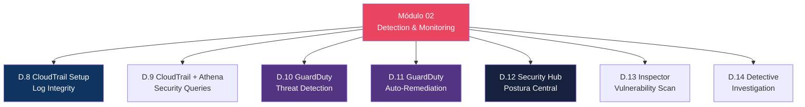

# Módulo 02 — Detection & Monitoring

> **Nível:** 100-200 (Foundational/Intermediate)
> **Tempo Total Estimado:** 12-16 horas de labs
> **Custo Estimado:** ~$2-5 (GuardDuty 30 dias free, Athena por query)
> **Objetivo do Módulo:** Dominar os serviços de detecção e monitoramento de segurança da AWS — CloudTrail para auditoria completa, GuardDuty para detecção de ameaças, Security Hub para postura centralizada, Inspector para vulnerabilidades e Detective para investigação forense.

---

## Mapa do Módulo



---

## Desafio 8: CloudTrail — Setup Completo e Log Integrity

> **Level:** 100 | **Tempo:** 90 min | **Custo:** ~$0 (S3 storage mínimo)

### Objetivo

Configurar **AWS CloudTrail** como fundação de auditoria — trail multi-region, validação de integridade de logs, integração com CloudWatch e alertas para eventos críticos.

### Cenário

CloudTrail é a **caixa-preta** da sua conta AWS. Registra TODA chamada de API — quem fez, quando, de onde, o quê. Sem CloudTrail, você está voando cego.

```
┌──────────────────────────────────────────────────────────────────┐
│                    CloudTrail — O Que Registra                    │
│                                                                   │
│  Management Events (padrão, gratuito 1 cópia):                   │
│  ├── CreateInstance, TerminateInstance                            │
│  ├── CreateUser, AttachPolicy, AssumeRole                        │
│  ├── CreateBucket, PutBucketPolicy                               │
│  ├── CreateDistribution, UpdateDistribution                      │
│  ├── AuthorizeSecurityGroupIngress                               │
│  └── TODA chamada de API de gerenciamento                        │
│                                                                   │
│  Data Events (custo adicional, opt-in):                          │
│  ├── S3: GetObject, PutObject, DeleteObject                     │
│  ├── Lambda: Invoke                                              │
│  ├── DynamoDB: GetItem, PutItem                                  │
│  └── Eventos de nível de dados (alto volume)                     │
│                                                                   │
│  Insights Events (ML-based, opt-in):                             │
│  ├── Detecta padrões anômalos de API calls                      │
│  ├── Ex: pico súbito de DeleteObject                             │
│  └── Ex: chamadas de API de região incomum                       │
│                                                                   │
│  Cada evento contém:                                             │
│  ├── eventTime: quando                                           │
│  ├── userIdentity: quem (user, role, service, root)              │
│  ├── sourceIPAddress: de onde                                    │
│  ├── eventName: o quê (RunInstances, CreateUser, etc.)           │
│  ├── requestParameters: com quais parâmetros                     │
│  ├── responseElements: resultado                                 │
│  ├── errorCode: se falhou (AccessDenied, etc.)                   │
│  └── eventSource: qual serviço (ec2.amazonaws.com, etc.)         │
└──────────────────────────────────────────────────────────────────┘
```

### Passo a Passo

#### Passo 1 — Criar S3 Bucket para Logs (com proteção)

```bash
# Bucket para CloudTrail logs (nome único)
TRAIL_BUCKET="empresa-cloudtrail-logs-$(aws sts get-caller-identity --query Account --output text)"

aws s3 mb "s3://$TRAIL_BUCKET" --region us-east-1

# Habilitar versionamento (protege contra deleção acidental)
aws s3api put-bucket-versioning \
  --bucket "$TRAIL_BUCKET" \
  --versioning-configuration Status=Enabled

# Habilitar encryption
aws s3api put-bucket-encryption \
  --bucket "$TRAIL_BUCKET" \
  --server-side-encryption-configuration '{
    "Rules": [{"ApplyServerSideEncryptionByDefault": {"SSEAlgorithm": "AES256"}}]
  }'

# Bloquear acesso público
aws s3api put-public-access-block \
  --bucket "$TRAIL_BUCKET" \
  --public-access-block-configuration '{
    "BlockPublicAcls": true,
    "IgnorePublicAcls": true,
    "BlockPublicPolicy": true,
    "RestrictPublicBuckets": true
  }'

# Lifecycle: mover para Glacier após 90 dias, deletar após 365
aws s3api put-bucket-lifecycle-configuration \
  --bucket "$TRAIL_BUCKET" \
  --lifecycle-configuration '{
    "Rules": [{
      "ID": "cloudtrail-lifecycle",
      "Status": "Enabled",
      "Transitions": [
        {"Days": 90, "StorageClass": "GLACIER"},
        {"Days": 180, "StorageClass": "DEEP_ARCHIVE"}
      ],
      "Expiration": {"Days": 730},
      "Filter": {"Prefix": ""}
    }]
  }'

# Bucket policy obrigatória para CloudTrail
ACCOUNT_ID=$(aws sts get-caller-identity --query Account --output text)

aws s3api put-bucket-policy --bucket "$TRAIL_BUCKET" --policy '{
  "Version": "2012-10-17",
  "Statement": [
    {
      "Sid": "AWSCloudTrailAclCheck",
      "Effect": "Allow",
      "Principal": {"Service": "cloudtrail.amazonaws.com"},
      "Action": "s3:GetBucketAcl",
      "Resource": "arn:aws:s3:::'$TRAIL_BUCKET'"
    },
    {
      "Sid": "AWSCloudTrailWrite",
      "Effect": "Allow",
      "Principal": {"Service": "cloudtrail.amazonaws.com"},
      "Action": "s3:PutObject",
      "Resource": "arn:aws:s3:::'$TRAIL_BUCKET'/AWSLogs/'$ACCOUNT_ID'/*",
      "Condition": {"StringEquals": {"s3:x-amz-acl": "bucket-owner-full-control"}}
    },
    {
      "Sid": "DenyDeleteLogs",
      "Effect": "Deny",
      "Principal": "*",
      "Action": ["s3:DeleteObject", "s3:DeleteObjectVersion"],
      "Resource": "arn:aws:s3:::'$TRAIL_BUCKET'/*",
      "Condition": {
        "StringNotEquals": {"aws:PrincipalArn": "arn:aws:iam::'$ACCOUNT_ID':role/SecurityAdmin"}
      }
    }
  ]
}'
```

#### Passo 2 — Criar Trail Multi-Region

```bash
# Criar CloudWatch Log Group para alertas em tempo real
aws logs create-log-group \
  --log-group-name "/aws/cloudtrail/security-audit" \
  --retention-in-days 365

LOG_GROUP_ARN=$(aws logs describe-log-groups \
  --log-group-name-prefix "/aws/cloudtrail/security-audit" \
  --query 'logGroups[0].arn' --output text)

# Criar IAM Role para CloudTrail → CloudWatch Logs
aws iam create-role \
  --role-name CloudTrail-CloudWatch-Role \
  --assume-role-policy-document '{
    "Version": "2012-10-17",
    "Statement": [{
      "Effect": "Allow",
      "Principal": {"Service": "cloudtrail.amazonaws.com"},
      "Action": "sts:AssumeRole"
    }]
  }'

aws iam put-role-policy \
  --role-name CloudTrail-CloudWatch-Role \
  --policy-name CloudTrailToCloudWatch \
  --policy-document '{
    "Version": "2012-10-17",
    "Statement": [{
      "Effect": "Allow",
      "Action": ["logs:CreateLogStream", "logs:PutLogEvents"],
      "Resource": "'$LOG_GROUP_ARN':*"
    }]
  }'

CW_ROLE_ARN="arn:aws:iam::$ACCOUNT_ID:role/CloudTrail-CloudWatch-Role"

# Criar o Trail
aws cloudtrail create-trail \
  --name "security-audit-trail" \
  --s3-bucket-name "$TRAIL_BUCKET" \
  --is-multi-region-trail \
  --include-global-service-events \
  --enable-log-file-validation \
  --cloud-watch-logs-log-group-arn "$LOG_GROUP_ARN" \
  --cloud-watch-logs-role-arn "$CW_ROLE_ARN" \
  --tags-list Key=Security,Value=mandatory

# Iniciar logging
aws cloudtrail start-logging --name "security-audit-trail"

# Habilitar Insights (detecção de anomalias)
aws cloudtrail put-insight-selectors \
  --trail-name "security-audit-trail" \
  --insight-selectors '[
    {"InsightType": "ApiCallRateInsight"},
    {"InsightType": "ApiErrorRateInsight"}
  ]'

# Verificar
aws cloudtrail describe-trails \
  --query 'trailList[].{Name:Name,Multi:IsMultiRegionTrail,LogValidation:LogFileValidationEnabled,Logging:HasCustomEventSelectors}' \
  --output table

aws cloudtrail get-trail-status --name "security-audit-trail" --output table
```

#### Passo 3 — Validação de Integridade dos Logs

```bash
# CloudTrail cria digest files a cada hora
# Esses arquivos permitem verificar se os logs foram adulterados

# Validar integridade dos logs das últimas 24h
aws cloudtrail validate-logs \
  --trail-arn "arn:aws:cloudtrail:us-east-1:$ACCOUNT_ID:trail/security-audit-trail" \
  --start-time "$(date -u -d '24 hours ago' +%Y-%m-%dT%H:%M:%SZ)" \
  --end-time "$(date -u +%Y-%m-%dT%H:%M:%SZ)"

# Output esperado:
# Results requested for 2026-04-06T00:00:00Z to 2026-04-07T00:00:00Z
# Results found for 2026-04-06T00:00:00Z to 2026-04-07T00:00:00Z:
# 24/24 digest files valid
# 1440/1440 log files valid

# Se algum log foi alterado ou deletado, o validate mostra INVALID
# Isso é evidência forense admissível em investigações
```

#### Passo 4 — Alarmes para Eventos Críticos

```bash
# Alarme 1: Root account usada
aws logs put-metric-filter \
  --log-group-name "/aws/cloudtrail/security-audit" \
  --filter-name "RootAccountUsage" \
  --filter-pattern '{ ($.userIdentity.type = "Root") && ($.userIdentity.invokedBy NOT EXISTS) && ($.eventType != "AwsServiceEvent") }' \
  --metric-transformations '[{
    "metricName": "RootAccountUsage",
    "metricNamespace": "SecurityAlerts",
    "metricValue": "1",
    "defaultValue": 0
  }]'

aws cloudwatch put-metric-alarm \
  --alarm-name "CRITICAL-root-account-used" \
  --metric-name "RootAccountUsage" \
  --namespace "SecurityAlerts" \
  --statistic Sum \
  --period 60 \
  --evaluation-periods 1 \
  --threshold 0 \
  --comparison-operator GreaterThanThreshold \
  --alarm-actions "arn:aws:sns:us-east-1:$ACCOUNT_ID:security-alerts"

# Alarme 2: Console login sem MFA
aws logs put-metric-filter \
  --log-group-name "/aws/cloudtrail/security-audit" \
  --filter-name "ConsoleLoginWithoutMFA" \
  --filter-pattern '{ ($.eventName = "ConsoleLogin") && ($.additionalEventData.MFAUsed != "Yes") && ($.responseElements.ConsoleLogin = "Success") }' \
  --metric-transformations '[{
    "metricName": "ConsoleLoginNoMFA",
    "metricNamespace": "SecurityAlerts",
    "metricValue": "1",
    "defaultValue": 0
  }]'

aws cloudwatch put-metric-alarm \
  --alarm-name "HIGH-console-login-without-mfa" \
  --metric-name "ConsoleLoginNoMFA" \
  --namespace "SecurityAlerts" \
  --statistic Sum --period 60 --evaluation-periods 1 \
  --threshold 0 --comparison-operator GreaterThanThreshold \
  --alarm-actions "arn:aws:sns:us-east-1:$ACCOUNT_ID:security-alerts"

# Alarme 3: IAM Policy alterada
aws logs put-metric-filter \
  --log-group-name "/aws/cloudtrail/security-audit" \
  --filter-name "IAMPolicyChanges" \
  --filter-pattern '{ ($.eventName = CreatePolicy) || ($.eventName = DeletePolicy) || ($.eventName = AttachRolePolicy) || ($.eventName = DetachRolePolicy) || ($.eventName = AttachUserPolicy) || ($.eventName = DetachUserPolicy) || ($.eventName = PutRolePolicy) || ($.eventName = DeleteRolePolicy) }' \
  --metric-transformations '[{
    "metricName": "IAMPolicyChanges",
    "metricNamespace": "SecurityAlerts",
    "metricValue": "1",
    "defaultValue": 0
  }]'

aws cloudwatch put-metric-alarm \
  --alarm-name "MEDIUM-iam-policy-changed" \
  --metric-name "IAMPolicyChanges" \
  --namespace "SecurityAlerts" \
  --statistic Sum --period 300 --evaluation-periods 1 \
  --threshold 0 --comparison-operator GreaterThanThreshold \
  --alarm-actions "arn:aws:sns:us-east-1:$ACCOUNT_ID:security-alerts"

# Alarme 4: Security Group alterada
aws logs put-metric-filter \
  --log-group-name "/aws/cloudtrail/security-audit" \
  --filter-name "SecurityGroupChanges" \
  --filter-pattern '{ ($.eventName = AuthorizeSecurityGroupIngress) || ($.eventName = AuthorizeSecurityGroupEgress) || ($.eventName = RevokeSecurityGroupIngress) || ($.eventName = RevokeSecurityGroupEgress) || ($.eventName = CreateSecurityGroup) || ($.eventName = DeleteSecurityGroup) }' \
  --metric-transformations '[{
    "metricName": "SecurityGroupChanges",
    "metricNamespace": "SecurityAlerts",
    "metricValue": "1",
    "defaultValue": 0
  }]'

aws cloudwatch put-metric-alarm \
  --alarm-name "MEDIUM-security-group-changed" \
  --metric-name "SecurityGroupChanges" \
  --namespace "SecurityAlerts" \
  --statistic Sum --period 300 --evaluation-periods 1 \
  --threshold 0 --comparison-operator GreaterThanThreshold \
  --alarm-actions "arn:aws:sns:us-east-1:$ACCOUNT_ID:security-alerts"

# Alarme 5: Tentativas de acesso negado (AccessDenied)
aws logs put-metric-filter \
  --log-group-name "/aws/cloudtrail/security-audit" \
  --filter-name "AccessDeniedAttempts" \
  --filter-pattern '{ ($.errorCode = "AccessDenied") || ($.errorCode = "UnauthorizedAccess") || ($.errorCode = "Client.UnauthorizedAccess") }' \
  --metric-transformations '[{
    "metricName": "AccessDeniedCount",
    "metricNamespace": "SecurityAlerts",
    "metricValue": "1",
    "defaultValue": 0
  }]'

aws cloudwatch put-metric-alarm \
  --alarm-name "HIGH-excessive-access-denied" \
  --metric-name "AccessDeniedCount" \
  --namespace "SecurityAlerts" \
  --statistic Sum --period 300 --evaluation-periods 1 \
  --threshold 10 --comparison-operator GreaterThanThreshold \
  --alarm-actions "arn:aws:sns:us-east-1:$ACCOUNT_ID:security-alerts"

# Alarme 6: CloudTrail desabilitado (CRÍTICO!)
aws logs put-metric-filter \
  --log-group-name "/aws/cloudtrail/security-audit" \
  --filter-name "CloudTrailStopped" \
  --filter-pattern '{ ($.eventName = StopLogging) || ($.eventName = DeleteTrail) || ($.eventName = UpdateTrail) }' \
  --metric-transformations '[{
    "metricName": "CloudTrailChanges",
    "metricNamespace": "SecurityAlerts",
    "metricValue": "1",
    "defaultValue": 0
  }]'

aws cloudwatch put-metric-alarm \
  --alarm-name "CRITICAL-cloudtrail-stopped" \
  --metric-name "CloudTrailChanges" \
  --namespace "SecurityAlerts" \
  --statistic Sum --period 60 --evaluation-periods 1 \
  --threshold 0 --comparison-operator GreaterThanThreshold \
  --alarm-actions "arn:aws:sns:us-east-1:$ACCOUNT_ID:security-alerts"
```

### Terraform

```hcl
# ============================================
# CLOUDTRAIL — SETUP COMPLETO
# ============================================

# S3 Bucket para logs
resource "aws_s3_bucket" "cloudtrail" {
  bucket = "empresa-cloudtrail-logs-${data.aws_caller_identity.current.account_id}"
}

resource "aws_s3_bucket_versioning" "cloudtrail" {
  bucket = aws_s3_bucket.cloudtrail.id
  versioning_configuration { status = "Enabled" }
}

resource "aws_s3_bucket_server_side_encryption_configuration" "cloudtrail" {
  bucket = aws_s3_bucket.cloudtrail.id
  rule {
    apply_server_side_encryption_by_default { sse_algorithm = "AES256" }
  }
}

resource "aws_s3_bucket_public_access_block" "cloudtrail" {
  bucket                  = aws_s3_bucket.cloudtrail.id
  block_public_acls       = true
  block_public_policy     = true
  ignore_public_acls      = true
  restrict_public_buckets = true
}

resource "aws_s3_bucket_lifecycle_configuration" "cloudtrail" {
  bucket = aws_s3_bucket.cloudtrail.id
  rule {
    id     = "cloudtrail-lifecycle"
    status = "Enabled"
    transition { days = 90; storage_class = "GLACIER" }
    transition { days = 180; storage_class = "DEEP_ARCHIVE" }
    expiration { days = 730 }
  }
}

resource "aws_s3_bucket_policy" "cloudtrail" {
  bucket = aws_s3_bucket.cloudtrail.id
  policy = jsonencode({
    Version = "2012-10-17"
    Statement = [
      {
        Sid       = "AWSCloudTrailAclCheck"
        Effect    = "Allow"
        Principal = { Service = "cloudtrail.amazonaws.com" }
        Action    = "s3:GetBucketAcl"
        Resource  = aws_s3_bucket.cloudtrail.arn
      },
      {
        Sid       = "AWSCloudTrailWrite"
        Effect    = "Allow"
        Principal = { Service = "cloudtrail.amazonaws.com" }
        Action    = "s3:PutObject"
        Resource  = "${aws_s3_bucket.cloudtrail.arn}/AWSLogs/${data.aws_caller_identity.current.account_id}/*"
        Condition = { StringEquals = { "s3:x-amz-acl" = "bucket-owner-full-control" } }
      }
    ]
  })
}

# CloudWatch Log Group
resource "aws_cloudwatch_log_group" "cloudtrail" {
  name              = "/aws/cloudtrail/security-audit"
  retention_in_days = 365
}

# IAM Role para CloudTrail → CloudWatch
resource "aws_iam_role" "cloudtrail_cw" {
  name = "CloudTrail-CloudWatch-Role"
  assume_role_policy = jsonencode({
    Version = "2012-10-17"
    Statement = [{
      Effect    = "Allow"
      Principal = { Service = "cloudtrail.amazonaws.com" }
      Action    = "sts:AssumeRole"
    }]
  })
}

resource "aws_iam_role_policy" "cloudtrail_cw" {
  name = "CloudTrailToCloudWatch"
  role = aws_iam_role.cloudtrail_cw.id
  policy = jsonencode({
    Version = "2012-10-17"
    Statement = [{
      Effect   = "Allow"
      Action   = ["logs:CreateLogStream", "logs:PutLogEvents"]
      Resource = "${aws_cloudwatch_log_group.cloudtrail.arn}:*"
    }]
  })
}

# Trail
resource "aws_cloudtrail" "security" {
  name                          = "security-audit-trail"
  s3_bucket_name                = aws_s3_bucket.cloudtrail.id
  is_multi_region_trail         = true
  include_global_service_events = true
  enable_log_file_validation    = true
  cloud_watch_logs_group_arn    = "${aws_cloudwatch_log_group.cloudtrail.arn}:*"
  cloud_watch_logs_role_arn     = aws_iam_role.cloudtrail_cw.arn

  insight_selector {
    insight_type = "ApiCallRateInsight"
  }
  insight_selector {
    insight_type = "ApiErrorRateInsight"
  }

  tags = { Security = "mandatory" }

  depends_on = [aws_s3_bucket_policy.cloudtrail]
}

# SNS Topic para alertas
resource "aws_sns_topic" "security_alerts" {
  name = "security-alerts"
}

resource "aws_sns_topic_subscription" "security_email" {
  topic_arn = aws_sns_topic.security_alerts.arn
  protocol  = "email"
  endpoint  = "security@empresa.com"
}

# Metric Filters + Alarms (CIS Benchmark recomendações)
locals {
  security_alarms = {
    root_usage = {
      name     = "CRITICAL-root-account-used"
      pattern  = "{ ($.userIdentity.type = \"Root\") && ($.userIdentity.invokedBy NOT EXISTS) && ($.eventType != \"AwsServiceEvent\") }"
      metric   = "RootAccountUsage"
      threshold = 0
    }
    console_no_mfa = {
      name     = "HIGH-console-login-without-mfa"
      pattern  = "{ ($.eventName = \"ConsoleLogin\") && ($.additionalEventData.MFAUsed != \"Yes\") && ($.responseElements.ConsoleLogin = \"Success\") }"
      metric   = "ConsoleLoginNoMFA"
      threshold = 0
    }
    iam_changes = {
      name     = "MEDIUM-iam-policy-changed"
      pattern  = "{ ($.eventName = CreatePolicy) || ($.eventName = DeletePolicy) || ($.eventName = AttachRolePolicy) || ($.eventName = DetachRolePolicy) || ($.eventName = PutRolePolicy) }"
      metric   = "IAMPolicyChanges"
      threshold = 0
    }
    sg_changes = {
      name     = "MEDIUM-security-group-changed"
      pattern  = "{ ($.eventName = AuthorizeSecurityGroupIngress) || ($.eventName = AuthorizeSecurityGroupEgress) || ($.eventName = RevokeSecurityGroupIngress) || ($.eventName = CreateSecurityGroup) || ($.eventName = DeleteSecurityGroup) }"
      metric   = "SecurityGroupChanges"
      threshold = 0
    }
    trail_stopped = {
      name     = "CRITICAL-cloudtrail-stopped"
      pattern  = "{ ($.eventName = StopLogging) || ($.eventName = DeleteTrail) || ($.eventName = UpdateTrail) }"
      metric   = "CloudTrailChanges"
      threshold = 0
    }
    access_denied = {
      name      = "HIGH-excessive-access-denied"
      pattern   = "{ ($.errorCode = \"AccessDenied\") || ($.errorCode = \"UnauthorizedAccess\") }"
      metric    = "AccessDeniedCount"
      threshold = 10
    }
  }
}

resource "aws_cloudwatch_log_metric_filter" "security" {
  for_each       = local.security_alarms
  name           = each.key
  log_group_name = aws_cloudwatch_log_group.cloudtrail.name
  pattern        = each.value.pattern

  metric_transformation {
    name          = each.value.metric
    namespace     = "SecurityAlerts"
    value         = "1"
    default_value = 0
  }
}

resource "aws_cloudwatch_metric_alarm" "security" {
  for_each            = local.security_alarms
  alarm_name          = each.value.name
  comparison_operator = "GreaterThanThreshold"
  evaluation_periods  = 1
  metric_name         = each.value.metric
  namespace           = "SecurityAlerts"
  period              = 300
  statistic           = "Sum"
  threshold           = each.value.threshold
  alarm_actions       = [aws_sns_topic.security_alerts.arn]
}
```

### Validação

```bash
# 1. Verificar trail ativo
aws cloudtrail get-trail-status --name "security-audit-trail" \
  --query '{Logging:IsLogging,LatestDelivery:LatestDeliveryTime}' --output table

# 2. Verificar eventos recentes
aws cloudtrail lookup-events \
  --max-results 5 \
  --query 'Events[].{Time:EventTime,Name:EventName,User:Username,Source:EventSource}' \
  --output table

# 3. Verificar integridade dos logs
aws cloudtrail validate-logs \
  --trail-arn "arn:aws:cloudtrail:us-east-1:$ACCOUNT_ID:trail/security-audit-trail" \
  --start-time "$(date -u -d '1 hour ago' +%Y-%m-%dT%H:%M:%SZ)"

# 4. Verificar alarmes configurados
aws cloudwatch describe-alarms \
  --alarm-name-prefix "CRITICAL-" \
  --query 'MetricAlarms[].{Name:AlarmName,State:StateValue}' --output table

# 5. Gerar evento de teste (listar users para criar log entry)
aws iam list-users > /dev/null
sleep 10
aws cloudtrail lookup-events \
  --lookup-attributes AttributeKey=EventName,AttributeValue=ListUsers \
  --max-results 1 --output json | jq '.Events[0] | {EventTime, Username, EventName}'
```

### O Que Aprendemos

| Conceito | Detalhe |
|----------|---------|
| CloudTrail | Registra TODA chamada de API na conta AWS |
| Multi-region trail | Uma trail que cobre TODAS as regiões |
| Log file validation | Digest files para provar integridade (forense) |
| Management events | Operações de gerenciamento (create, delete, update) — grátis |
| Data events | Operações de dados (GetObject, Invoke) — custo adicional |
| Insights | ML para detectar padrões anômalos de API calls |
| CloudWatch integration | Logs em tempo real + metric filters + alarmes |
| S3 lifecycle | Glacier após 90 dias, delete após 2 anos |

> **💡 Expert Tip:** Os 6 alarmes que configuramos são baseados no **CIS AWS Foundations Benchmark** — o padrão de compliance mais adotado. Auditores SOC 2 e PCI DSS vão perguntar: "vocês monitoram uso da root account? Alterações em IAM policies? Mudanças em security groups?" Se você tem esses alarmes, a resposta é sim com evidências. Configure no dia zero de qualquer conta AWS.

---

## Desafio 9: CloudTrail + Athena — Queries de Auditoria de Segurança

> **Level:** 200 | **Tempo:** 90 min | **Custo:** ~$0.50 (Athena por scan)

### Objetivo

Configurar **Amazon Athena** para analisar logs do CloudTrail com SQL, criando queries reutilizáveis para auditoria de segurança, investigação de incidentes e compliance.

### Passo a Passo

#### Passo 1 — Criar Tabela Athena com Partition Projection

```sql
-- DDL: Tabela CloudTrail com partition projection (auto-discovery de partições)
CREATE EXTERNAL TABLE IF NOT EXISTS cloudtrail_logs (
    eventVersion STRING,
    userIdentity STRUCT<
        type: STRING,
        principalId: STRING,
        arn: STRING,
        accountId: STRING,
        invokedBy: STRING,
        accessKeyId: STRING,
        userName: STRING,
        sessionContext: STRUCT<
            attributes: STRUCT<mfaAuthenticated: STRING, creationDate: STRING>,
            sessionIssuer: STRUCT<
                type: STRING, principalId: STRING, arn: STRING,
                accountId: STRING, userName: STRING
            >
        >
    >,
    eventTime STRING,
    eventSource STRING,
    eventName STRING,
    awsRegion STRING,
    sourceIPAddress STRING,
    userAgent STRING,
    errorCode STRING,
    errorMessage STRING,
    requestParameters STRING,
    responseElements STRING,
    additionalEventData STRING,
    requestId STRING,
    eventId STRING,
    readOnly STRING,
    resources ARRAY<STRUCT<arn: STRING, accountId: STRING, type: STRING>>,
    eventType STRING,
    apiVersion STRING,
    recipientAccountId STRING,
    serviceEventDetails STRING,
    sharedEventID STRING,
    vpcEndpointId STRING
)
COMMENT 'CloudTrail logs with partition projection'
PARTITIONED BY (
    `account` STRING,
    `region` STRING,
    `year` STRING,
    `month` STRING,
    `day` STRING
)
ROW FORMAT SERDE 'org.apache.hive.hcatalog.data.JsonSerDe'
STORED AS INPUTFORMAT 'com.amazon.emr.cloudtrail.CloudTrailInputFormat'
OUTPUTFORMAT 'org.apache.hadoop.hive.ql.io.HiveIgnoreKeyTextOutputFormat'
LOCATION 's3://empresa-cloudtrail-logs-ACCOUNT_ID/AWSLogs/'
TBLPROPERTIES (
    'projection.enabled' = 'true',
    'projection.account.type' = 'enum',
    'projection.account.values' = 'ACCOUNT_ID',
    'projection.region.type' = 'enum',
    'projection.region.values' = 'us-east-1,sa-east-1,eu-west-1',
    'projection.year.type' = 'integer',
    'projection.year.range' = '2024,2030',
    'projection.month.type' = 'integer',
    'projection.month.range' = '1,12',
    'projection.month.digits' = '2',
    'projection.day.type' = 'integer',
    'projection.day.range' = '1,31',
    'projection.day.digits' = '2',
    'storage.location.template' = 's3://empresa-cloudtrail-logs-ACCOUNT_ID/AWSLogs/${account}/CloudTrail/${region}/${year}/${month}/${day}'
);
```

#### Passo 2 — Queries de Auditoria de Segurança

```sql
-- ============================================
-- 1. QUEM FEZ O QUÊ NAS ÚLTIMAS 24 HORAS?
-- ============================================
SELECT
    eventTime,
    userIdentity.arn AS who,
    eventName AS action,
    eventSource AS service,
    awsRegion,
    sourceIPAddress AS from_ip,
    errorCode
FROM cloudtrail_logs
WHERE year = '2026' AND month = '04' AND day = '07'
  AND eventName NOT LIKE 'Get%'
  AND eventName NOT LIKE 'List%'
  AND eventName NOT LIKE 'Describe%'
ORDER BY eventTime DESC
LIMIT 100;

-- ============================================
-- 2. TENTATIVAS DE ACESSO NEGADO (possível ataque)
-- ============================================
SELECT
    eventTime,
    userIdentity.arn AS who,
    eventName AS attempted_action,
    eventSource AS service,
    errorCode,
    errorMessage,
    sourceIPAddress
FROM cloudtrail_logs
WHERE year = '2026' AND month = '04'
  AND (errorCode = 'AccessDenied'
    OR errorCode = 'UnauthorizedAccess'
    OR errorCode = 'Client.UnauthorizedAccess')
ORDER BY eventTime DESC
LIMIT 200;

-- ============================================
-- 3. TOP USERS POR ATIVIDADE (quem está mais ativo?)
-- ============================================
SELECT
    userIdentity.arn AS who,
    COUNT(*) AS total_actions,
    COUNT(DISTINCT eventName) AS unique_actions,
    COUNT(CASE WHEN errorCode IS NOT NULL THEN 1 END) AS errors,
    MIN(eventTime) AS first_action,
    MAX(eventTime) AS last_action
FROM cloudtrail_logs
WHERE year = '2026' AND month = '04'
GROUP BY userIdentity.arn
ORDER BY total_actions DESC
LIMIT 20;

-- ============================================
-- 4. ATIVIDADE FORA DO HORÁRIO COMERCIAL (suspeita)
-- ============================================
SELECT
    eventTime,
    userIdentity.arn AS who,
    eventName,
    sourceIPAddress,
    awsRegion
FROM cloudtrail_logs
WHERE year = '2026' AND month = '04'
  AND eventName NOT LIKE 'Get%'
  AND eventName NOT LIKE 'List%'
  AND eventName NOT LIKE 'Describe%'
  AND eventName NOT LIKE 'Assume%'
  AND (
    HOUR(from_iso8601_timestamp(eventTime)) < 7
    OR HOUR(from_iso8601_timestamp(eventTime)) > 22
  )
  AND userIdentity.type != 'AWSService'
ORDER BY eventTime DESC
LIMIT 50;

-- ============================================
-- 5. ALTERAÇÕES EM IAM (quem mudou permissões?)
-- ============================================
SELECT
    eventTime,
    userIdentity.arn AS who,
    eventName,
    json_extract_scalar(requestParameters, '$.policyArn') AS policy,
    json_extract_scalar(requestParameters, '$.roleName') AS role_name,
    json_extract_scalar(requestParameters, '$.userName') AS target_user,
    sourceIPAddress
FROM cloudtrail_logs
WHERE year = '2026' AND month = '04'
  AND eventSource = 'iam.amazonaws.com'
  AND eventName IN (
    'CreateUser', 'DeleteUser',
    'CreateRole', 'DeleteRole',
    'CreatePolicy', 'DeletePolicy',
    'AttachRolePolicy', 'DetachRolePolicy',
    'AttachUserPolicy', 'DetachUserPolicy',
    'PutRolePolicy', 'DeleteRolePolicy',
    'CreateAccessKey', 'DeleteAccessKey',
    'CreateLoginProfile', 'UpdateLoginProfile'
  )
ORDER BY eventTime DESC;

-- ============================================
-- 6. LOGINS NO CONSOLE (sucesso e falha)
-- ============================================
SELECT
    eventTime,
    userIdentity.arn AS who,
    sourceIPAddress AS from_ip,
    json_extract_scalar(additionalEventData, '$.MFAUsed') AS mfa_used,
    json_extract_scalar(responseElements, '$.ConsoleLogin') AS login_result,
    errorMessage
FROM cloudtrail_logs
WHERE year = '2026' AND month = '04'
  AND eventName = 'ConsoleLogin'
ORDER BY eventTime DESC;

-- ============================================
-- 7. SECURITY GROUPS ABERTAS (quem abriu portas?)
-- ============================================
SELECT
    eventTime,
    userIdentity.arn AS who,
    eventName,
    json_extract_scalar(requestParameters, '$.groupId') AS sg_id,
    requestParameters AS full_params,
    sourceIPAddress
FROM cloudtrail_logs
WHERE year = '2026' AND month = '04'
  AND eventName IN (
    'AuthorizeSecurityGroupIngress',
    'AuthorizeSecurityGroupEgress'
  )
ORDER BY eventTime DESC;

-- ============================================
-- 8. IPs MAIS ATIVOS (possível ataque de força bruta)
-- ============================================
SELECT
    sourceIPAddress,
    COUNT(*) AS total_calls,
    COUNT(DISTINCT userIdentity.arn) AS unique_users,
    COUNT(CASE WHEN errorCode IS NOT NULL THEN 1 END) AS errors,
    ARRAY_AGG(DISTINCT eventName) AS actions
FROM cloudtrail_logs
WHERE year = '2026' AND month = '04'
  AND sourceIPAddress != 'AWS Internal'
  AND sourceIPAddress != 'amazonaws.com'
GROUP BY sourceIPAddress
HAVING COUNT(*) > 100
ORDER BY total_calls DESC
LIMIT 20;

-- ============================================
-- 9. RECURSOS DELETADOS (quem destruiu o quê?)
-- ============================================
SELECT
    eventTime,
    userIdentity.arn AS who,
    eventName,
    eventSource AS service,
    requestParameters,
    sourceIPAddress
FROM cloudtrail_logs
WHERE year = '2026' AND month = '04'
  AND (eventName LIKE 'Delete%' OR eventName LIKE 'Terminate%' OR eventName LIKE 'Remove%')
  AND errorCode IS NULL  -- Apenas ações que SUCEDERAM
ORDER BY eventTime DESC
LIMIT 100;

-- ============================================
-- 10. ASSUME ROLE — Quem assumiu qual role?
-- ============================================
SELECT
    eventTime,
    userIdentity.arn AS who_assumed,
    json_extract_scalar(requestParameters, '$.roleArn') AS role_assumed,
    json_extract_scalar(requestParameters, '$.roleSessionName') AS session_name,
    sourceIPAddress,
    json_extract_scalar(requestParameters, '$.durationSeconds') AS duration_sec
FROM cloudtrail_logs
WHERE year = '2026' AND month = '04'
  AND eventName = 'AssumeRole'
  AND errorCode IS NULL
ORDER BY eventTime DESC
LIMIT 50;

-- ============================================
-- 11. S3 BUCKET POLICIES ALTERADAS
-- ============================================
SELECT
    eventTime,
    userIdentity.arn AS who,
    eventName,
    json_extract_scalar(requestParameters, '$.bucketName') AS bucket,
    sourceIPAddress
FROM cloudtrail_logs
WHERE year = '2026' AND month = '04'
  AND eventSource = 's3.amazonaws.com'
  AND eventName IN ('PutBucketPolicy', 'DeleteBucketPolicy', 'PutBucketAcl', 'PutBucketPublicAccessBlock')
ORDER BY eventTime DESC;

-- ============================================
-- 12. ATIVIDADE POR REGIÃO (detectar uso em regiões inesperadas)
-- ============================================
SELECT
    awsRegion,
    COUNT(*) AS total_events,
    COUNT(DISTINCT userIdentity.arn) AS unique_principals,
    COUNT(DISTINCT eventName) AS unique_actions
FROM cloudtrail_logs
WHERE year = '2026' AND month = '04'
  AND userIdentity.type != 'AWSService'
GROUP BY awsRegion
ORDER BY total_events DESC;
```

### Validação

```bash
# Executar query via CLI
aws athena start-query-execution \
  --query-string "SELECT eventTime, userIdentity.arn, eventName FROM cloudtrail_logs WHERE year='2026' AND month='04' AND day='07' LIMIT 10" \
  --query-execution-context Database=default \
  --result-configuration OutputLocation=s3://$TRAIL_BUCKET/athena-results/ \
  --output text

# Ver resultado
aws athena get-query-results \
  --query-execution-id "QUERY_ID_RETORNADO" \
  --output table
```

### O Que Aprendemos

| Conceito | Detalhe |
|----------|---------|
| Partition projection | Auto-discovery de partições — sem MSCK REPAIR TABLE |
| CloudTrailInputFormat | SerDe especial que entende o formato CloudTrail |
| 12 queries de segurança | Cobrem: acesso negado, IAM changes, SG changes, logins, deletes |
| Custo Athena | ~$5 por TB scanned — partition projection reduz drasticamente |
| Forense | Queries preservam evidências com timestamp, IP, identidade |

> **💡 Expert Tip:** Crie uma view com as queries mais usadas e automatize com Lambda + EventBridge (rodar query diária de "atividade fora do horário"). Salve os resultados em outro S3 bucket como relatórios de compliance. Em auditorias SOC 2, apresente esses relatórios como evidência de monitoramento contínuo.

---

## Desafio 10: GuardDuty — Detecção de Ameaças

> **Level:** 100 | **Tempo:** 90 min | **Custo:** ~$0 (30 dias free trial)

### Objetivo

Habilitar **Amazon GuardDuty** para detecção contínua de ameaças usando ML, anomaly detection e threat intelligence. Entender tipos de findings, severidade e como investigar.

### Cenário

```
┌──────────────────────────────────────────────────────────────────┐
│                 GuardDuty — Como Funciona                         │
│                                                                   │
│  Data Sources (o que analisa):                                   │
│  ├── CloudTrail Management Events (API calls)                   │
│  ├── CloudTrail S3 Data Events (acesso a objetos)               │
│  ├── VPC Flow Logs (tráfego de rede)                            │
│  ├── DNS Logs (queries de resolução)                             │
│  ├── EKS Audit Logs (Kubernetes)                                │
│  ├── Lambda Network Activity                                     │
│  ├── RDS Login Activity                                          │
│  └── Runtime Monitoring (EC2, ECS, EKS)                         │
│                                                                   │
│  Detection Types:                                                │
│  ├── Recon: PortScan, API enumeration                           │
│  ├── UnauthorizedAccess: Brute force, compromised credentials   │
│  ├── Backdoor: C&C communication, crypto mining                 │
│  ├── Trojan: Malware communication                              │
│  ├── Exfiltration: Data theft via DNS, S3                       │
│  ├── PrivilegeEscalation: IAM policy changes                    │
│  ├── Impact: Bitcoin mining, resource abuse                      │
│  └── Discovery: Unusual API activity                             │
│                                                                   │
│  Severity:                                                        │
│  ├── CRITICAL (9.0-10.0): Recurso ativamente comprometido       │
│  ├── HIGH (7.0-8.9): Ameaça provável, ação urgente              │
│  ├── MEDIUM (4.0-6.9): Atividade suspeita, investigar           │
│  └── LOW (1.0-3.9): Informacional, monitorar                    │
└──────────────────────────────────────────────────────────────────┘
```

### Passo a Passo

#### Passo 1 — Habilitar GuardDuty

```bash
# Habilitar GuardDuty
DETECTOR_ID=$(aws guardduty create-detector \
  --enable \
  --finding-publishing-frequency FIFTEEN_MINUTES \
  --data-sources '{
    "S3Logs": {"Enable": true},
    "Kubernetes": {"AuditLogs": {"Enable": true}},
    "MalwareProtection": {"ScanEc2InstanceWithFindings": {"EbsVolumes": true}},
    "RuntimeMonitoring": {"AutoEnable": "ALL"}
  }' \
  --tags Security=mandatory \
  --query 'DetectorId' --output text)

echo "Detector ID: $DETECTOR_ID"

# Verificar data sources habilitadas
aws guardduty get-detector --detector-id "$DETECTOR_ID" \
  --query '{Status:Status,DataSources:DataSources}' --output json | jq .
```

#### Passo 2 — Entender Tipos de Findings

```bash
# Listar findings (pode demorar horas para aparecerem os primeiros)
aws guardduty list-findings --detector-id "$DETECTOR_ID" \
  --query 'FindingIds' --output json

# Ver detalhes de findings
aws guardduty get-findings --detector-id "$DETECTOR_ID" \
  --finding-ids '["finding-id-1","finding-id-2"]' \
  --query 'Findings[].{
    Type: Type,
    Severity: Severity,
    Title: Title,
    Description: Description,
    Resource: Resource.ResourceType,
    UpdatedAt: UpdatedAt
  }' --output table

# Gerar findings de EXEMPLO (para testar sem esperar ameaça real)
aws guardduty create-sample-findings \
  --detector-id "$DETECTOR_ID" \
  --finding-types \
    "Recon:EC2/PortProbeUnprotectedPort" \
    "UnauthorizedAccess:IAMUser/ConsoleLoginSuccess.B" \
    "CryptoCurrency:EC2/BitcoinTool.B!DNS" \
    "Backdoor:EC2/C&CActivity.B!DNS" \
    "Exfiltration:S3/MaliciousIPCaller" \
    "UnauthorizedAccess:EC2/SSHBruteForce"

# Aguardar e listar
sleep 30
aws guardduty list-findings --detector-id "$DETECTOR_ID" \
  --sort-criteria '{"AttributeName":"severity","OrderBy":"DESC"}' \
  --finding-criteria '{
    "Criterion": {
      "severity": {"Gte": 7}
    }
  }' \
  --query 'FindingIds' --output json
```

#### Passo 3 — Configurar Notificações via EventBridge

```bash
# EventBridge rule: HIGH+ findings → SNS
aws events put-rule \
  --name "guardduty-high-findings" \
  --event-pattern '{
    "source": ["aws.guardduty"],
    "detail-type": ["GuardDuty Finding"],
    "detail": {
      "severity": [{"numeric": [">=", 7]}]
    }
  }'

aws events put-targets \
  --rule "guardduty-high-findings" \
  --targets '[{
    "Id": "sns-security-alerts",
    "Arn": "arn:aws:sns:us-east-1:'$ACCOUNT_ID':security-alerts",
    "InputTransformer": {
      "InputPathsMap": {
        "type": "$.detail.type",
        "severity": "$.detail.severity",
        "title": "$.detail.title",
        "description": "$.detail.description",
        "region": "$.detail.region",
        "account": "$.detail.accountId"
      },
      "InputTemplate": "\"GuardDuty Finding: <title>\\nSeverity: <severity>\\nType: <type>\\nRegion: <region>\\nAccount: <account>\\nDescription: <description>\""
    }
  }]'
```

### Terraform

```hcl
# GuardDuty Detector
resource "aws_guardduty_detector" "main" {
  enable                       = true
  finding_publishing_frequency = "FIFTEEN_MINUTES"

  datasources {
    s3_logs {
      enable = true
    }
    kubernetes {
      audit_logs {
        enable = true
      }
    }
    malware_protection {
      scan_ec2_instance_with_findings {
        ebs_volumes {
          enable = true
        }
      }
    }
  }

  tags = { Security = "mandatory" }
}

# EventBridge → SNS para findings HIGH+
resource "aws_cloudwatch_event_rule" "guardduty_high" {
  name = "guardduty-high-findings"
  event_pattern = jsonencode({
    source      = ["aws.guardduty"]
    detail-type = ["GuardDuty Finding"]
    detail      = { severity = [{ numeric = [">=", 7] }] }
  })
}

resource "aws_cloudwatch_event_target" "guardduty_sns" {
  rule = aws_cloudwatch_event_rule.guardduty_high.name
  arn  = aws_sns_topic.security_alerts.arn
}

# Trusted/Threat IP Lists
resource "aws_guardduty_ipset" "trusted" {
  activate    = true
  detector_id = aws_guardduty_detector.main.id
  format      = "TXT"
  location    = "s3://${aws_s3_object.trusted_ips.bucket}/${aws_s3_object.trusted_ips.key}"
  name        = "TrustedIPs"
}

resource "aws_s3_object" "trusted_ips" {
  bucket  = aws_s3_bucket.security.id
  key     = "guardduty/trusted-ips.txt"
  content = <<-EOF
    203.0.113.0/24
    198.51.100.0/24
  EOF
}
```

### Referência: Tipos de Finding Mais Comuns

| Finding Type | Severidade | O Que Significa | Ação |
|-------------|-----------|-----------------|------|
| `Recon:EC2/PortProbeUnprotectedPort` | LOW | Alguém escaneando portas abertas | Revisar Security Groups |
| `UnauthorizedAccess:EC2/SSHBruteForce` | MEDIUM | Brute force SSH | Bloquear IP, revisar SG |
| `UnauthorizedAccess:IAMUser/ConsoleLoginSuccess.B` | MEDIUM | Login de IP incomum | Verificar se é legítimo |
| `CryptoCurrency:EC2/BitcoinTool.B!DNS` | HIGH | EC2 minerando bitcoin | Isolar EC2, investigar |
| `Backdoor:EC2/C&CActivity.B!DNS` | HIGH | EC2 comunicando com C&C server | Isolar IMEDIATAMENTE |
| `Exfiltration:S3/MaliciousIPCaller` | HIGH | IP malicioso acessando S3 | Revogar acesso, investigar |
| `Impact:EC2/BitcoinTool.B` | HIGH | Crypto mining ativo | Isolar, forensics |
| `PrivilegeEscalation:IAMUser/AdministrativePermissions` | MEDIUM | User escalando privilégios | Revogar, investigar |

### Validação

```bash
# 1. Verificar detector ativo
aws guardduty list-detectors --output text

# 2. Ver findings de exemplo
aws guardduty get-findings --detector-id "$DETECTOR_ID" \
  --finding-ids $(aws guardduty list-findings --detector-id "$DETECTOR_ID" \
    --max-results 3 --query 'FindingIds' --output json | jq -r '.[]' | head -3 | tr '\n' ' ') \
  --query 'Findings[].{Type:Type,Severity:Severity,Title:Title}' --output table

# 3. Estatísticas de findings
aws guardduty get-findings-statistics \
  --detector-id "$DETECTOR_ID" \
  --finding-statistic-types COUNT_BY_SEVERITY --output json | jq .
```

### O Que Aprendemos

| Conceito | Detalhe |
|----------|---------|
| GuardDuty | Detecção contínua de ameaças via ML + threat intel |
| Data sources | CloudTrail, VPC Flow Logs, DNS, EKS, Lambda, RDS |
| Finding types | Recon, UnauthorizedAccess, Backdoor, Exfiltration, CryptoMining |
| Severity | LOW (1-3.9), MEDIUM (4-6.9), HIGH (7-8.9), CRITICAL (9-10) |
| Trusted IPs | Lista de IPs que GuardDuty não alertar |
| Sample findings | Gerar findings falsos para testar pipeline |
| EventBridge | Automatizar notificações e remediação baseada em findings |

> **💡 Expert Tip:** GuardDuty tem 30 dias grátis — habilite HOJE em todas as regiões. Após 30 dias, o custo é proporcional ao volume de dados analisados (tipicamente $1-5/mês para contas pequenas). O valor de detectar um crypto miner ou credencial comprometida em MINUTOS em vez de DIAS justifica o investimento. Multi-account: use GuardDuty com delegated administrator para agregar findings de todas as contas da Organization.

---

## Desafio 11: GuardDuty — Auto-Remediation com Lambda

> **Level:** 200 | **Tempo:** 90 min | **Custo:** ~$0

### Objetivo

Criar um **pipeline de auto-remediation** que detecta ameaças via GuardDuty e automaticamente executa ações de contenção — bloquear IPs no WAF, isolar EC2, revogar credenciais IAM.

### Arquitetura

```
┌──────────────────────────────────────────────────────────────────┐
│          Auto-Remediation Pipeline                                │
│                                                                   │
│  GuardDuty    EventBridge     Lambda           Ações             │
│  ┌──────┐    ┌──────────┐    ┌──────┐                           │
│  │Find  │───→│ Rule:    │───→│Auto  │──→ WAF: Block IP          │
│  │HIGH+ │    │severity≥7│    │Remed.│──→ EC2: Isolate (SG)      │
│  └──────┘    └──────────┘    │      │──→ IAM: Disable keys      │
│                              │      │──→ SNS: Alert team        │
│                              └──────┘──→ S3: Save evidence      │
└──────────────────────────────────────────────────────────────────┘
```

### Lambda de Auto-Remediation

```python
"""
auto_remediate.py — GuardDuty Auto-Remediation Lambda

Ações baseadas no tipo de finding:
- Network threats → Block IP no WAF IP Set
- EC2 compromise → Isolate via Security Group
- IAM credential → Disable access keys
"""
import boto3
import json
import os
from datetime import datetime

ec2 = boto3.client('ec2')
iam = boto3.client('iam')
wafv2 = boto3.client('wafv2', region_name='us-east-1')
sns = boto3.client('sns')
s3 = boto3.client('s3')

ISOLATION_SG = os.environ.get('ISOLATION_SG_ID', '')
WAF_IP_SET_NAME = os.environ.get('WAF_IP_SET_NAME', 'GuardDuty-Blocked-IPs')
WAF_IP_SET_ID = os.environ.get('WAF_IP_SET_ID', '')
SNS_TOPIC_ARN = os.environ.get('SNS_TOPIC_ARN', '')
EVIDENCE_BUCKET = os.environ.get('EVIDENCE_BUCKET', '')


def handler(event, context):
    """Handler principal — roteia por tipo de finding."""
    finding = event['detail']
    finding_type = finding['type']
    severity = finding['severity']
    title = finding.get('title', 'Unknown')

    print(f"Processing: {finding_type} (severity: {severity})")

    actions_taken = []

    # === Network-based threats → Block IP ===
    if any(prefix in finding_type for prefix in [
        'Recon:', 'UnauthorizedAccess:EC2/', 'Backdoor:', 'Trojan:', 'Impact:'
    ]):
        ip = extract_remote_ip(finding)
        if ip:
            block_ip_in_waf(ip)
            actions_taken.append(f"Blocked IP {ip} in WAF")

    # === EC2 compromise → Isolate instance ===
    if 'EC2/' in finding_type and severity >= 7:
        instance_id = extract_instance_id(finding)
        if instance_id:
            isolate_ec2(instance_id)
            actions_taken.append(f"Isolated EC2 {instance_id}")

    # === IAM credential compromise → Disable keys ===
    if 'IAMUser/' in finding_type and severity >= 7:
        user_info = extract_iam_user(finding)
        if user_info:
            disable_iam_keys(user_info['username'])
            actions_taken.append(f"Disabled access keys for {user_info['username']}")

    # === Always: Save evidence + Notify ===
    save_evidence(finding)
    actions_taken.append("Evidence saved to S3")

    notify_team(finding, actions_taken)
    actions_taken.append("Team notified via SNS")

    return {
        'finding_type': finding_type,
        'severity': severity,
        'actions': actions_taken
    }


def extract_remote_ip(finding):
    """Extrai IP remoto do finding."""
    service = finding.get('service', {})
    action = service.get('action', {})

    # Network connection action
    network = action.get('networkConnectionAction', {})
    ip = network.get('remoteIpDetails', {}).get('ipAddressV4')
    if ip:
        return ip

    # AWS API call action
    api_call = action.get('awsApiCallAction', {})
    ip = api_call.get('remoteIpDetails', {}).get('ipAddressV4')
    return ip


def extract_instance_id(finding):
    """Extrai EC2 instance ID do finding."""
    resource = finding.get('resource', {})
    instance = resource.get('instanceDetails', {})
    return instance.get('instanceId')


def extract_iam_user(finding):
    """Extrai informações do IAM user do finding."""
    resource = finding.get('resource', {})
    access_key = resource.get('accessKeyDetails', {})
    username = access_key.get('userName')
    if username:
        return {'username': username, 'access_key_id': access_key.get('accessKeyId')}
    return None


def block_ip_in_waf(ip):
    """Adiciona IP ao WAF IP Set."""
    try:
        ip_set = wafv2.get_ip_set(
            Name=WAF_IP_SET_NAME, Scope='CLOUDFRONT', Id=WAF_IP_SET_ID
        )
        addresses = ip_set['IPSet']['Addresses']
        cidr = f"{ip}/32"

        if cidr not in addresses:
            addresses.append(cidr)
            # Limitar a 10.000 (max WAF)
            addresses = addresses[-10000:]

            wafv2.update_ip_set(
                Name=WAF_IP_SET_NAME, Scope='CLOUDFRONT', Id=WAF_IP_SET_ID,
                Addresses=addresses, LockToken=ip_set['LockToken']
            )
            print(f"Blocked {cidr} in WAF. Total: {len(addresses)}")
    except Exception as e:
        print(f"Error blocking IP in WAF: {e}")


def isolate_ec2(instance_id):
    """Isola EC2 removendo SGs e aplicando isolation SG."""
    try:
        # Salvar SGs atuais (evidência)
        instance = ec2.describe_instances(InstanceIds=[instance_id])
        current_sgs = [sg['GroupId'] for sg in
                       instance['Reservations'][0]['Instances'][0]['SecurityGroups']]
        print(f"Current SGs for {instance_id}: {current_sgs}")

        # Aplicar isolation SG (bloqueia TODO tráfego exceto forense)
        if ISOLATION_SG:
            ec2.modify_instance_attribute(
                InstanceId=instance_id,
                Groups=[ISOLATION_SG]
            )
            print(f"Isolated {instance_id} with SG {ISOLATION_SG}")

            # Tag para rastreabilidade
            ec2.create_tags(
                Resources=[instance_id],
                Tags=[
                    {'Key': 'SecurityIncident', 'Value': 'isolated'},
                    {'Key': 'PreviousSecurityGroups', 'Value': ','.join(current_sgs)},
                    {'Key': 'IsolatedAt', 'Value': datetime.utcnow().isoformat()}
                ]
            )
    except Exception as e:
        print(f"Error isolating EC2: {e}")


def disable_iam_keys(username):
    """Desabilita TODAS as access keys de um IAM user."""
    try:
        keys = iam.list_access_keys(UserName=username)
        for key in keys['AccessKeyMetadata']:
            if key['Status'] == 'Active':
                iam.update_access_key(
                    UserName=username,
                    AccessKeyId=key['AccessKeyId'],
                    Status='Inactive'
                )
                print(f"Disabled key {key['AccessKeyId']} for {username}")
    except Exception as e:
        print(f"Error disabling IAM keys: {e}")


def save_evidence(finding):
    """Salva finding completo no S3 como evidência forense."""
    try:
        timestamp = datetime.utcnow().strftime('%Y/%m/%d/%H%M%S')
        finding_id = finding.get('id', 'unknown')
        key = f"guardduty-evidence/{timestamp}-{finding_id}.json"

        s3.put_object(
            Bucket=EVIDENCE_BUCKET,
            Key=key,
            Body=json.dumps(finding, indent=2, default=str),
            ServerSideEncryption='AES256'
        )
        print(f"Evidence saved: s3://{EVIDENCE_BUCKET}/{key}")
    except Exception as e:
        print(f"Error saving evidence: {e}")


def notify_team(finding, actions):
    """Envia notificação via SNS."""
    try:
        message = {
            'title': finding.get('title', 'Unknown'),
            'type': finding.get('type', 'Unknown'),
            'severity': finding.get('severity', 0),
            'description': finding.get('description', ''),
            'actions_taken': actions,
            'timestamp': datetime.utcnow().isoformat()
        }

        sns.publish(
            TopicArn=SNS_TOPIC_ARN,
            Subject=f"[GuardDuty] {finding.get('type', 'Unknown')} (Severity: {finding.get('severity', 0)})",
            Message=json.dumps(message, indent=2)
        )
    except Exception as e:
        print(f"Error notifying: {e}")
```

### Terraform — Pipeline Completo

```hcl
# Isolation Security Group (bloqueia TODO tráfego)
resource "aws_security_group" "isolation" {
  name        = "guardduty-isolation"
  description = "Isolation SG - NO inbound, NO outbound"
  vpc_id      = var.vpc_id

  # Sem regras = bloqueia tudo
  tags = { Name = "GuardDuty-Isolation" }
}

# S3 para evidências
resource "aws_s3_bucket" "evidence" {
  bucket = "security-evidence-${data.aws_caller_identity.current.account_id}"
}

resource "aws_s3_bucket_versioning" "evidence" {
  bucket = aws_s3_bucket.evidence.id
  versioning_configuration { status = "Enabled" }
}

# WAF IP Set para IPs bloqueados
resource "aws_wafv2_ip_set" "blocked" {
  name               = "GuardDuty-Blocked-IPs"
  scope              = "CLOUDFRONT"
  ip_address_version = "IPV4"
  addresses          = []

  tags = { ManagedBy = "guardduty-auto-remediation" }
}

# Lambda Function
resource "aws_lambda_function" "auto_remediate" {
  filename         = "lambda/auto-remediate.zip"
  function_name    = "guardduty-auto-remediate"
  role             = aws_iam_role.auto_remediate.arn
  handler          = "auto_remediate.handler"
  runtime          = "python3.12"
  timeout          = 60
  memory_size      = 256

  environment {
    variables = {
      ISOLATION_SG_ID = aws_security_group.isolation.id
      WAF_IP_SET_NAME = aws_wafv2_ip_set.blocked.name
      WAF_IP_SET_ID   = aws_wafv2_ip_set.blocked.id
      SNS_TOPIC_ARN   = aws_sns_topic.security_alerts.arn
      EVIDENCE_BUCKET = aws_s3_bucket.evidence.id
    }
  }
}

# IAM Role para Lambda
resource "aws_iam_role" "auto_remediate" {
  name = "guardduty-auto-remediate-role"
  assume_role_policy = jsonencode({
    Version = "2012-10-17"
    Statement = [{
      Effect = "Allow"
      Principal = { Service = "lambda.amazonaws.com" }
      Action = "sts:AssumeRole"
    }]
  })
}

resource "aws_iam_role_policy" "auto_remediate" {
  name = "auto-remediate-permissions"
  role = aws_iam_role.auto_remediate.id
  policy = jsonencode({
    Version = "2012-10-17"
    Statement = [
      {
        Effect = "Allow"
        Action = [
          "ec2:DescribeInstances", "ec2:ModifyInstanceAttribute",
          "ec2:CreateTags", "ec2:DescribeSecurityGroups"
        ]
        Resource = "*"
      },
      {
        Effect   = "Allow"
        Action   = ["iam:ListAccessKeys", "iam:UpdateAccessKey"]
        Resource = "arn:aws:iam::*:user/*"
      },
      {
        Effect   = "Allow"
        Action   = ["wafv2:GetIPSet", "wafv2:UpdateIPSet"]
        Resource = aws_wafv2_ip_set.blocked.arn
      },
      {
        Effect   = "Allow"
        Action   = ["sns:Publish"]
        Resource = aws_sns_topic.security_alerts.arn
      },
      {
        Effect   = "Allow"
        Action   = ["s3:PutObject"]
        Resource = "${aws_s3_bucket.evidence.arn}/*"
      },
      {
        Effect   = "Allow"
        Action   = ["logs:CreateLogGroup", "logs:CreateLogStream", "logs:PutLogEvents"]
        Resource = "arn:aws:logs:*:*:*"
      }
    ]
  })
}

# EventBridge → Lambda
resource "aws_cloudwatch_event_rule" "guardduty_remediate" {
  name = "guardduty-auto-remediate"
  event_pattern = jsonencode({
    source      = ["aws.guardduty"]
    detail-type = ["GuardDuty Finding"]
    detail      = { severity = [{ numeric = [">=", 7] }] }
  })
}

resource "aws_cloudwatch_event_target" "remediate_lambda" {
  rule = aws_cloudwatch_event_rule.guardduty_remediate.name
  arn  = aws_lambda_function.auto_remediate.arn
}

resource "aws_lambda_permission" "eventbridge" {
  statement_id  = "AllowEventBridge"
  action        = "lambda:InvokeFunction"
  function_name = aws_lambda_function.auto_remediate.function_name
  principal     = "events.amazonaws.com"
  source_arn    = aws_cloudwatch_event_rule.guardduty_remediate.arn
}
```

### Validação

```bash
# 1. Gerar sample findings para testar pipeline
aws guardduty create-sample-findings \
  --detector-id "$DETECTOR_ID" \
  --finding-types "CryptoCurrency:EC2/BitcoinTool.B!DNS"

# 2. Verificar Lambda executou
aws logs tail "/aws/lambda/guardduty-auto-remediate" --since 5m

# 3. Verificar IP foi bloqueado no WAF
aws wafv2 get-ip-set \
  --name "GuardDuty-Blocked-IPs" \
  --scope CLOUDFRONT \
  --id "$WAF_IP_SET_ID" \
  --query 'IPSet.Addresses' --output json

# 4. Verificar evidência salva no S3
aws s3 ls "s3://security-evidence-$ACCOUNT_ID/guardduty-evidence/" --recursive

# 5. Verificar notificação SNS (checar email)
```

### O Que Aprendemos

| Conceito | Detalhe |
|----------|---------|
| Auto-remediation | GuardDuty → EventBridge → Lambda → Ação automática |
| IP blocking | Lambda adiciona IP ao WAF IP Set automaticamente |
| EC2 isolation | Swap de Security Groups para isolation SG (zero traffic) |
| IAM key disable | Desabilita access keys comprometidas automaticamente |
| Evidence preservation | Saving completo do finding no S3 com versionamento |
| Notification | SNS com detalhes do finding e ações tomadas |

> **💡 Expert Tip:** Auto-remediation para severity HIGH+ é seguro e recomendado. Para MEDIUM, notifique mas NÃO remedie automaticamente — pode gerar false positives que isolam recursos legítimos. Crie um runbook: HIGH+ = auto-remediate + notify; MEDIUM = notify only + create ticket; LOW = log only. Revise findings LOW/MEDIUM semanalmente.

---

## Desafio 12: Security Hub — Postura de Segurança Centralizada

> **Level:** 200 | **Tempo:** 90 min | **Custo:** ~$0-2

### Objetivo

Habilitar **AWS Security Hub** para centralizar findings de múltiplos serviços (GuardDuty, Inspector, Config, Macie, Firewall Manager) e avaliar compliance contra padrões (CIS, AWS FSBP, PCI DSS).

### Passo a Passo

```bash
# 1. Habilitar Security Hub
aws securityhub enable-security-hub --enable-default-standards

# 2. Habilitar standards específicos
aws securityhub batch-enable-standards \
  --standards-subscription-requests \
    '[{"StandardsArn":"arn:aws:securityhub:us-east-1::standards/aws-foundational-security-best-practices/v/1.0.0"},
      {"StandardsArn":"arn:aws:securityhub:::ruleset/cis-aws-foundations-benchmark/v/1.4.0"}]'

# 3. Ver score de compliance
aws securityhub get-findings \
  --filters '{"ComplianceStatus":[{"Value":"FAILED","Comparison":"EQUALS"}]}' \
  --query 'Findings | length(@)'
# Número de findings FAILED = problemas a resolver

# 4. Top findings por severidade
aws securityhub get-findings \
  --filters '{"ComplianceStatus":[{"Value":"FAILED","Comparison":"EQUALS"}]}' \
  --sort-criteria '[{"Field":"SeverityLabel","SortOrder":"desc"}]' \
  --max-results 10 \
  --query 'Findings[].{Title:Title,Severity:Severity.Label,Resource:Resources[0].Id}' \
  --output table
```

### Terraform

```hcl
resource "aws_securityhub_account" "main" {}

resource "aws_securityhub_standards_subscription" "fsbp" {
  depends_on    = [aws_securityhub_account.main]
  standards_arn = "arn:aws:securityhub:${data.aws_region.current.name}::standards/aws-foundational-security-best-practices/v/1.0.0"
}

resource "aws_securityhub_standards_subscription" "cis" {
  depends_on    = [aws_securityhub_account.main]
  standards_arn = "arn:aws:securityhub:::ruleset/cis-aws-foundations-benchmark/v/1.4.0"
}

# Integrar GuardDuty → Security Hub (automático se ambos habilitados)
# Integrar Inspector → Security Hub (automático)
# Integrar Config → Security Hub (automático)

# EventBridge para findings CRITICAL
resource "aws_cloudwatch_event_rule" "sechub_critical" {
  name = "securityhub-critical-findings"
  event_pattern = jsonencode({
    source      = ["aws.securityhub"]
    detail-type = ["Security Hub Findings - Imported"]
    detail = {
      findings = {
        Severity    = { Label = ["CRITICAL"] }
        Compliance  = { Status = ["FAILED"] }
      }
    }
  })
}

resource "aws_cloudwatch_event_target" "sechub_alert" {
  rule = aws_cloudwatch_event_rule.sechub_critical.name
  arn  = aws_sns_topic.security_alerts.arn
}
```

### O Que Aprendemos

| Conceito | Detalhe |
|----------|---------|
| Security Hub | Dashboard centralizado de segurança |
| Standards | CIS Benchmark, AWS FSBP, PCI DSS — checklists automáticos |
| Findings | Agrega de: GuardDuty, Inspector, Config, Macie, Firewall Manager |
| Compliance score | % de controls passando vs falhando |
| Multi-account | Delegated admin agrega findings de todas as contas |

> **💡 Expert Tip:** Security Hub é o primeiro dashboard que um CISO olha. Foque em resolver todos os CRITICAL primeiro, depois HIGH. O score de compliance é visível em auditorias e pode ser exportado. Use o "Workflow status" para rastrear progresso: NEW → NOTIFIED → RESOLVED.

---

## Desafio 13: Inspector — Scan de Vulnerabilidades

> **Level:** 200 | **Tempo:** 60 min | **Custo:** ~$0 (15 dias free)

### Objetivo

Habilitar **Amazon Inspector** para scan contínuo de vulnerabilidades em EC2, Lambda e container images no ECR.

### Passo a Passo

```bash
# 1. Habilitar Inspector (scans contínuos)
aws inspector2 enable --resource-types EC2 ECR LAMBDA

# 2. Ver findings de vulnerabilidade
aws inspector2 list-findings \
  --filter-criteria '{
    "findingStatus": [{"comparison":"EQUALS","value":"ACTIVE"}],
    "severity": [{"comparison":"EQUALS","value":"CRITICAL"}]
  }' \
  --query 'findings[].{
    Title:title,
    Severity:severity,
    Type:type,
    Resource:resources[0].id
  }' \
  --output table

# 3. Ver cobertura (quais recursos estão sendo scaneados)
aws inspector2 list-coverage \
  --query 'coveredResources[].{
    Resource:resourceId,
    Type:resourceType,
    Status:scanStatus.statusCode
  }' --output table

# 4. Estatísticas
aws inspector2 list-findings \
  --filter-criteria '{}' \
  --query 'findings | length(@)'
```

### Terraform

```hcl
resource "aws_inspector2_enabler" "main" {
  account_ids    = [data.aws_caller_identity.current.account_id]
  resource_types = ["EC2", "ECR", "LAMBDA"]
}
```

### O Que Aprendemos

| Conceito | Detalhe |
|----------|---------|
| Inspector | Scan contínuo de vulnerabilidades (CVEs) |
| EC2 scanning | Usa SSM Agent para scan de SO e pacotes |
| ECR scanning | Scan de container images ao push |
| Lambda scanning | Scan de dependências de código |
| Findings | Integram automaticamente com Security Hub |

> **💡 Expert Tip:** Inspector v2 é MUITO diferente do v1. O v2 faz scan contínuo (não precisa agendar) e detecta vulnerabilidades em near real-time quando um novo CVE é publicado. Habilite em TODAS as contas.

---

## Desafio 14: Detective — Investigação de Incidentes

> **Level:** 200 | **Tempo:** 60 min | **Custo:** ~$0 (30 dias free)

### Objetivo

Habilitar **Amazon Detective** para investigação visual e interativa de incidentes de segurança, conectando dados de CloudTrail, VPC Flow Logs e GuardDuty.

### Passo a Passo

```bash
# 1. Habilitar Detective (requer GuardDuty ativo)
GRAPH_ARN=$(aws detective create-graph \
  --tags Security=mandatory \
  --query 'GraphArn' --output text)

echo "Graph ARN: $GRAPH_ARN"

# 2. Detective precisa de 2 semanas de dados para construir baseline
# Após esse período, você pode investigar entities:

# 3. Listar entities investigáveis
# Detective agrupa por: IAM User, IAM Role, EC2 Instance, IP Address, S3 Bucket, EKS Cluster

# 4. Investigar um finding do GuardDuty
# Console: Detective → Search → Cole o finding ID do GuardDuty
# Detective mostra: timeline de atividade, IPs conectados, API calls, volumes de tráfego

# 5. Investigar um IP suspeito
# Console: Detective → Search → IP Address → Cole o IP
# Detective mostra: todas as instâncias que se comunicaram, portas, volumes, timeline
```

### Quando Usar Detective vs CloudTrail vs GuardDuty

```
┌──────────────────────────────────────────────────────────────────┐
│  GuardDuty: "HEI, há um problema!" (detecção)                   │
│  ├── Alerta que algo suspeito está acontecendo                   │
│  └── Não diz muito sobre o contexto                              │
│                                                                   │
│  CloudTrail + Athena: "O que exatamente aconteceu?" (auditoria)  │
│  ├── Queries SQL nos logs de API                                 │
│  └── Requer conhecimento de SQL e estrutura dos logs             │
│                                                                   │
│  Detective: "Mostre-me o contexto visual" (investigação)         │
│  ├── Gráficos interativos de relacionamentos                    │
│  ├── Timeline visual de atividade                                │
│  ├── Correlação automática entre diferentes data sources         │
│  └── Ideal para quem investiga incidentes                        │
└──────────────────────────────────────────────────────────────────┘
```

### O Que Aprendemos

| Conceito | Detalhe |
|----------|---------|
| Detective | Investigação visual de incidentes de segurança |
| Graph database | Constrói grafo de relacionamentos entre entities |
| Baseline | 2 semanas para construir baseline de comportamento normal |
| Integration | Usa dados de CloudTrail, VPC Flow Logs, GuardDuty |
| Entities | IAM Users, Roles, EC2, IPs, S3 Buckets, EKS Clusters |

> **💡 Expert Tip:** Detective é a ferramenta que faltava entre "GuardDuty detectou algo" e "CloudTrail tem logs brutos". Para investigação de incidentes, Detective reduz de horas (scaneando logs) para minutos (visualizando graficamente). Habilite junto com GuardDuty — o custo é mínimo e o valor em um incidente real é imenso.

---

## Resumo do Módulo 02

```
┌──────────────────────────────────────────────────────────────┐
│               MÓDULO 02 — CONQUISTAS                          │
│                                                               │
│  ✅ Desafio 8: CloudTrail Setup Completo                     │
│     Trail multi-region, log integrity, 6 alarmes CIS         │
│                                                               │
│  ✅ Desafio 9: CloudTrail + Athena                            │
│     12 queries SQL de auditoria e investigação               │
│                                                               │
│  ✅ Desafio 10: GuardDuty Basics                              │
│     Detecção de ameaças, finding types, EventBridge          │
│                                                               │
│  ✅ Desafio 11: GuardDuty Auto-Remediation                    │
│     Lambda: block IP, isolate EC2, disable IAM keys          │
│                                                               │
│  ✅ Desafio 12: Security Hub                                  │
│     Postura centralizada, CIS + FSBP standards               │
│                                                               │
│  ✅ Desafio 13: Inspector                                     │
│     Scan contínuo de vulns (EC2, ECR, Lambda)                │
│                                                               │
│  ✅ Desafio 14: Detective                                     │
│     Investigação visual de incidentes                         │
│                                                               │
│  Próximo: Módulo 03 — Infrastructure Protection              │
│  (WAF, Shield, Firewall Manager, Network Firewall)           │
└──────────────────────────────────────────────────────────────┘
```

**Próximo:** [Módulo 03 — Infrastructure Protection →](modulo-03-infrastructure-protection.md)
