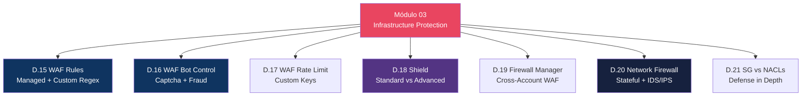

# Módulo 03 — Infrastructure Protection

> **Nível:** 200 (Intermediate)
> **Tempo Total Estimado:** 12-16 horas de labs
> **Custo Estimado:** ~$5-15 (WAF, Network Firewall)
> **Objetivo do Módulo:** Dominar proteção de infraestrutura AWS — WAF completo com managed rules, custom rules, bot control e captcha; Shield Standard e Advanced; Firewall Manager para gestão centralizada; Network Firewall para inspeção stateful; Security Groups vs NACLs com defense in depth; e VPC Endpoints para tráfego privado.

---

## Mapa do Módulo


```

---

## Desafio 15: WAF — Rules, Managed Groups e Custom Regex

> **Level:** 200 | **Tempo:** 120 min | **Custo:** ~$5/mês (Web ACL + rules)

### Objetivo

Criar um **AWS WAF Web ACL** completo com managed rule groups (AWS e marketplace), custom rules com regex, e associar a recursos (CloudFront, ALB, API Gateway).

### Cenário

```
┌──────────────────────────────────────────────────────────────────┐
│                    WAF — Arquitetura de Regras                    │
│                                                                   │
│  Request do usuário                                              │
│       │                                                           │
│       ▼                                                           │
│  ┌─────────────────────────────────────────────────────────┐     │
│  │                    Web ACL                               │     │
│  │                                                          │     │
│  │  Priority 0: AWS-AWSManagedRulesCommonRuleSet    (Block)│     │
│  │  Priority 1: AWS-AWSManagedRulesSQLiRuleSet      (Block)│     │
│  │  Priority 2: AWS-AWSManagedRulesKnownBadInputs   (Block)│     │
│  │  Priority 3: AWS-AWSManagedRulesBotControlRuleSet(Block)│     │
│  │  Priority 4: Custom-IPWhitelist                  (Allow)│     │
│  │  Priority 5: Custom-GeoBlock                     (Block)│     │
│  │  Priority 6: Custom-RateLimit                    (Block)│     │
│  │  Priority 7: Custom-BadUserAgents (regex)        (Block)│     │
│  │  Priority 8: Custom-AdminIPRestriction           (Block)│     │
│  │                                                          │     │
│  │  Default Action: Allow                                   │     │
│  └─────────────────────────────────────────────────────────┘     │
│       │                                                           │
│       ▼                                                           │
│  CloudFront / ALB / API Gateway                                  │
└──────────────────────────────────────────────────────────────────┘

Avaliação:
1. Rules são avaliadas EM ORDEM de priority (menor número = primeiro)
2. Primeira rule que faz MATCH termina a avaliação
3. Se NENHUMA rule faz match → Default Action (Allow/Block)
4. Managed Rules podem ser em modo COUNT (monitorar sem bloquear)
```

### Passo a Passo

#### Passo 1 — Criar IP Set e Regex Pattern Set

```bash
# IP Set: IPs do escritório (whitelist)
IPSET_ID=$(aws wafv2 create-ip-set \
  --name "Office-IPs" \
  --scope REGIONAL \
  --ip-address-version IPV4 \
  --addresses '["203.0.113.0/24", "198.51.100.0/24"]' \
  --query 'Summary.Id' --output text)

echo "IP Set ID: $IPSET_ID"

# Para CloudFront (scope CLOUDFRONT, região us-east-1)
CF_IPSET_ID=$(aws wafv2 create-ip-set \
  --name "Office-IPs" \
  --scope CLOUDFRONT \
  --region us-east-1 \
  --ip-address-version IPV4 \
  --addresses '["203.0.113.0/24", "198.51.100.0/24"]' \
  --query 'Summary.Id' --output text)

# Regex Pattern Set: User-Agents maliciosos
REGEX_ID=$(aws wafv2 create-regex-pattern-set \
  --name "Bad-UserAgents" \
  --scope REGIONAL \
  --regular-expression-list '[
    {"RegexString": "(?i)(sqlmap|nikto|nmap|masscan|zgrab|dirbuster|gobuster|hydra|medusa|wpscan|burpsuite|nuclei|whatweb)"},
    {"RegexString": "(?i)(python-requests/|curl/|wget/|Go-http-client|Java/).*bot"},
    {"RegexString": "(?i)(semrush|ahrefs|mj12bot|dotbot|petalbot)"}
  ]' \
  --query 'Summary.Id' --output text)

echo "Regex Set ID: $REGEX_ID"
```

#### Passo 2 — Criar Web ACL Completo

```bash
aws wafv2 create-web-acl \
  --name "Production-WebACL" \
  --scope REGIONAL \
  --default-action '{"Allow": {}}' \
  --visibility-config '{
    "SampledRequestsEnabled": true,
    "CloudWatchMetricsEnabled": true,
    "MetricName": "ProductionWebACL"
  }' \
  --rules '[
    {
      "Name": "AWS-CommonRuleSet",
      "Priority": 0,
      "Statement": {
        "ManagedRuleGroupStatement": {
          "VendorName": "AWS",
          "Name": "AWSManagedRulesCommonRuleSet",
          "ExcludedRules": [
            {"Name": "SizeRestrictions_BODY"},
            {"Name": "CrossSiteScripting_BODY"}
          ]
        }
      },
      "OverrideAction": {"None": {}},
      "VisibilityConfig": {
        "SampledRequestsEnabled": true,
        "CloudWatchMetricsEnabled": true,
        "MetricName": "CommonRuleSet"
      }
    },
    {
      "Name": "AWS-SQLiRuleSet",
      "Priority": 1,
      "Statement": {
        "ManagedRuleGroupStatement": {
          "VendorName": "AWS",
          "Name": "AWSManagedRulesSQLiRuleSet"
        }
      },
      "OverrideAction": {"None": {}},
      "VisibilityConfig": {
        "SampledRequestsEnabled": true,
        "CloudWatchMetricsEnabled": true,
        "MetricName": "SQLiRuleSet"
      }
    },
    {
      "Name": "AWS-KnownBadInputs",
      "Priority": 2,
      "Statement": {
        "ManagedRuleGroupStatement": {
          "VendorName": "AWS",
          "Name": "AWSManagedRulesKnownBadInputsRuleSet"
        }
      },
      "OverrideAction": {"None": {}},
      "VisibilityConfig": {
        "SampledRequestsEnabled": true,
        "CloudWatchMetricsEnabled": true,
        "MetricName": "KnownBadInputs"
      }
    },
    {
      "Name": "AllowOfficeIPs",
      "Priority": 3,
      "Statement": {
        "IPSetReferenceStatement": {
          "ARN": "arn:aws:wafv2:us-east-1:'$ACCOUNT_ID':regional/ipset/Office-IPs/'$IPSET_ID'"
        }
      },
      "Action": {"Allow": {}},
      "VisibilityConfig": {
        "SampledRequestsEnabled": true,
        "CloudWatchMetricsEnabled": true,
        "MetricName": "OfficeIPs"
      }
    },
    {
      "Name": "BlockBadUserAgents",
      "Priority": 4,
      "Statement": {
        "RegexPatternSetReferenceStatement": {
          "ARN": "arn:aws:wafv2:us-east-1:'$ACCOUNT_ID':regional/regexpatternset/Bad-UserAgents/'$REGEX_ID'",
          "FieldToMatch": {"SingleHeader": {"Name": "user-agent"}},
          "TextTransformations": [{"Priority": 0, "Type": "LOWERCASE"}]
        }
      },
      "Action": {"Block": {}},
      "VisibilityConfig": {
        "SampledRequestsEnabled": true,
        "CloudWatchMetricsEnabled": true,
        "MetricName": "BadUserAgents"
      }
    },
    {
      "Name": "GeoBlockHighRisk",
      "Priority": 5,
      "Statement": {
        "GeoMatchStatement": {
          "CountryCodes": ["RU", "CN", "KP", "IR"]
        }
      },
      "Action": {"Block": {}},
      "VisibilityConfig": {
        "SampledRequestsEnabled": true,
        "CloudWatchMetricsEnabled": true,
        "MetricName": "GeoBlock"
      }
    },
    {
      "Name": "RateLimit-General",
      "Priority": 6,
      "Statement": {
        "RateBasedStatement": {
          "Limit": 2000,
          "AggregateKeyType": "IP"
        }
      },
      "Action": {"Block": {}},
      "VisibilityConfig": {
        "SampledRequestsEnabled": true,
        "CloudWatchMetricsEnabled": true,
        "MetricName": "RateLimit"
      }
    },
    {
      "Name": "AdminIPRestriction",
      "Priority": 7,
      "Statement": {
        "AndStatement": {
          "Statements": [
            {
              "ByteMatchStatement": {
                "SearchString": "/admin",
                "FieldToMatch": {"UriPath": {}},
                "PositionalConstraint": "STARTS_WITH",
                "TextTransformations": [{"Priority": 0, "Type": "LOWERCASE"}]
              }
            },
            {
              "NotStatement": {
                "Statement": {
                  "IPSetReferenceStatement": {
                    "ARN": "arn:aws:wafv2:us-east-1:'$ACCOUNT_ID':regional/ipset/Office-IPs/'$IPSET_ID'"
                  }
                }
              }
            }
          ]
        }
      },
      "Action": {"Block": {}},
      "VisibilityConfig": {
        "SampledRequestsEnabled": true,
        "CloudWatchMetricsEnabled": true,
        "MetricName": "AdminIPRestriction"
      }
    }
  ]'
```

#### Passo 3 — Associar Web ACL a Recursos

```bash
# Associar a um ALB
aws wafv2 associate-web-acl \
  --web-acl-arn "arn:aws:wafv2:us-east-1:$ACCOUNT_ID:regional/webacl/Production-WebACL/WEBACL_ID" \
  --resource-arn "arn:aws:elasticloadbalancing:us-east-1:$ACCOUNT_ID:loadbalancer/app/my-alb/50dc6c495c0c9188"

# Associar a um API Gateway
aws wafv2 associate-web-acl \
  --web-acl-arn "arn:aws:wafv2:us-east-1:$ACCOUNT_ID:regional/webacl/Production-WebACL/WEBACL_ID" \
  --resource-arn "arn:aws:apigateway:us-east-1::/restapis/abc123/stages/prod"

# Para CloudFront — scope deve ser CLOUDFRONT (criado em us-east-1)
# Associação é feita na distribution config (WebACLId)
```

#### Passo 4 — Habilitar WAF Logging

```bash
# Criar Kinesis Firehose para logs (prefixo obrigatório: aws-waf-logs-)
# Ou usar S3 diretamente (simplificado):

aws wafv2 put-logging-configuration \
  --logging-configuration '{
    "ResourceArn": "arn:aws:wafv2:us-east-1:'$ACCOUNT_ID':regional/webacl/Production-WebACL/WEBACL_ID",
    "LogDestinationConfigs": [
      "arn:aws:s3:::'$ACCOUNT_ID'-waf-logs"
    ],
    "RedactedFields": [
      {"SingleHeader": {"Name": "authorization"}},
      {"SingleHeader": {"Name": "cookie"}}
    ],
    "LoggingFilter": {
      "DefaultBehavior": "KEEP",
      "Filters": [{
        "Behavior": "KEEP",
        "Conditions": [{
          "ActionCondition": {"Action": "BLOCK"}
        }],
        "Requirement": "MEETS_ANY"
      }]
    }
  }'
```

### Terraform

```hcl
# ============================================
# WAF — WEB ACL COMPLETO COM TERRAFORM
# ============================================

# IP Set
resource "aws_wafv2_ip_set" "office" {
  name               = "Office-IPs"
  scope              = "REGIONAL"
  ip_address_version = "IPV4"
  addresses          = ["203.0.113.0/24", "198.51.100.0/24"]
}

# Regex Pattern Set
resource "aws_wafv2_regex_pattern_set" "bad_ua" {
  name  = "Bad-UserAgents"
  scope = "REGIONAL"

  regular_expression {
    regex_string = "(?i)(sqlmap|nikto|nmap|masscan|zgrab|dirbuster|gobuster|hydra|wpscan|nuclei)"
  }
  regular_expression {
    regex_string = "(?i)(semrush|ahrefs|mj12bot|dotbot|petalbot)"
  }
}

# Web ACL
resource "aws_wafv2_web_acl" "main" {
  name  = "Production-WebACL"
  scope = "REGIONAL"

  default_action { allow {} }

  visibility_config {
    sampled_requests_enabled   = true
    cloudwatch_metrics_enabled = true
    metric_name                = "ProductionWebACL"
  }

  # Rule 0: AWS Common Rule Set
  rule {
    name     = "AWS-CommonRuleSet"
    priority = 0

    override_action { none {} }

    statement {
      managed_rule_group_statement {
        vendor_name = "AWS"
        name        = "AWSManagedRulesCommonRuleSet"

        rule_action_override {
          name = "SizeRestrictions_BODY"
          action_to_use { count {} }
        }
      }
    }

    visibility_config {
      sampled_requests_enabled   = true
      cloudwatch_metrics_enabled = true
      metric_name                = "CommonRuleSet"
    }
  }

  # Rule 1: SQL Injection
  rule {
    name     = "AWS-SQLiRuleSet"
    priority = 1
    override_action { none {} }

    statement {
      managed_rule_group_statement {
        vendor_name = "AWS"
        name        = "AWSManagedRulesSQLiRuleSet"
      }
    }

    visibility_config {
      sampled_requests_enabled   = true
      cloudwatch_metrics_enabled = true
      metric_name                = "SQLiRuleSet"
    }
  }

  # Rule 2: Known Bad Inputs
  rule {
    name     = "AWS-KnownBadInputs"
    priority = 2
    override_action { none {} }

    statement {
      managed_rule_group_statement {
        vendor_name = "AWS"
        name        = "AWSManagedRulesKnownBadInputsRuleSet"
      }
    }

    visibility_config {
      sampled_requests_enabled   = true
      cloudwatch_metrics_enabled = true
      metric_name                = "KnownBadInputs"
    }
  }

  # Rule 3: Geo Block
  rule {
    name     = "GeoBlock-HighRisk"
    priority = 3
    action { block {} }

    statement {
      geo_match_statement {
        country_codes = ["RU", "CN", "KP", "IR"]
      }
    }

    visibility_config {
      sampled_requests_enabled   = true
      cloudwatch_metrics_enabled = true
      metric_name                = "GeoBlock"
    }
  }

  # Rule 4: Bad User-Agents (regex)
  rule {
    name     = "Block-BadUserAgents"
    priority = 4
    action { block {} }

    statement {
      regex_pattern_set_reference_statement {
        arn = aws_wafv2_regex_pattern_set.bad_ua.arn
        field_to_match { single_header { name = "user-agent" } }
        text_transformation {
          priority = 0
          type     = "LOWERCASE"
        }
      }
    }

    visibility_config {
      sampled_requests_enabled   = true
      cloudwatch_metrics_enabled = true
      metric_name                = "BadUserAgents"
    }
  }

  # Rule 5: Rate Limit
  rule {
    name     = "RateLimit-2000"
    priority = 5
    action { block {} }

    statement {
      rate_based_statement {
        limit              = 2000
        aggregate_key_type = "IP"
      }
    }

    visibility_config {
      sampled_requests_enabled   = true
      cloudwatch_metrics_enabled = true
      metric_name                = "RateLimit"
    }
  }

  # Rule 6: Admin IP Restriction
  rule {
    name     = "AdminIPRestriction"
    priority = 6
    action { block {} }

    statement {
      and_statement {
        statement {
          byte_match_statement {
            search_string         = "/admin"
            positional_constraint = "STARTS_WITH"
            field_to_match { uri_path {} }
            text_transformation {
              priority = 0
              type     = "LOWERCASE"
            }
          }
        }
        statement {
          not_statement {
            statement {
              ip_set_reference_statement {
                arn = aws_wafv2_ip_set.office.arn
              }
            }
          }
        }
      }
    }

    visibility_config {
      sampled_requests_enabled   = true
      cloudwatch_metrics_enabled = true
      metric_name                = "AdminIPRestriction"
    }
  }

  tags = { Environment = "production" }
}

# Associar ao ALB
resource "aws_wafv2_web_acl_association" "alb" {
  resource_arn = aws_lb.main.arn
  web_acl_arn  = aws_wafv2_web_acl.main.arn
}

# WAF Logging
resource "aws_wafv2_web_acl_logging_configuration" "main" {
  log_destination_configs = [aws_s3_bucket.waf_logs.arn]
  resource_arn            = aws_wafv2_web_acl.main.arn

  redacted_fields {
    single_header { name = "authorization" }
  }
  redacted_fields {
    single_header { name = "cookie" }
  }

  logging_filter {
    default_behavior = "KEEP"
    filter {
      behavior    = "KEEP"
      requirement = "MEETS_ANY"
      condition {
        action_condition { action = "BLOCK" }
      }
    }
  }
}
```

### Validação — Testar com Payloads

```bash
DOMAIN="meu-app.com"

# 1. SQL Injection (deve retornar 403)
curl -s -o /dev/null -w "%{http_code}" \
  "https://$DOMAIN/?id=1'+OR+'1'='1"
# Esperado: 403

# 2. XSS (deve retornar 403)
curl -s -o /dev/null -w "%{http_code}" \
  "https://$DOMAIN/?q=<script>alert(1)</script>"
# Esperado: 403

# 3. Path Traversal (deve retornar 403)
curl -s -o /dev/null -w "%{http_code}" \
  "https://$DOMAIN/../../../../etc/passwd"
# Esperado: 403

# 4. Bad User-Agent (deve retornar 403)
curl -s -o /dev/null -w "%{http_code}" \
  -H "User-Agent: sqlmap/1.5" \
  "https://$DOMAIN/"
# Esperado: 403

# 5. Admin sem IP whitelisted (deve retornar 403)
curl -s -o /dev/null -w "%{http_code}" \
  "https://$DOMAIN/admin/dashboard"
# Esperado: 403 (a menos que seu IP esteja na whitelist)

# 6. Request normal (deve retornar 200)
curl -s -o /dev/null -w "%{http_code}" \
  "https://$DOMAIN/"
# Esperado: 200

# 7. Verificar sampled requests (console ou CLI)
aws wafv2 get-sampled-requests \
  --web-acl-arn "arn:aws:wafv2:..." \
  --rule-metric-name "SQLiRuleSet" \
  --scope REGIONAL \
  --time-window '{"StartTime":"2026-04-07T00:00:00Z","EndTime":"2026-04-07T23:59:59Z"}' \
  --max-items 10 \
  --output table
```

### AWS Managed Rule Groups — Referência

| Rule Group | WCU | O Que Protege | Quando Usar |
|-----------|-----|--------------|-------------|
| `AWSManagedRulesCommonRuleSet` | 700 | XSS, file inclusion, path traversal, PHP/WordPress exploits | **Sempre** |
| `AWSManagedRulesSQLiRuleSet` | 200 | SQL Injection | **Sempre** (se tem banco) |
| `AWSManagedRulesKnownBadInputsRuleSet` | 200 | Log4j, SSRF, request smuggling | **Sempre** |
| `AWSManagedRulesBotControlRuleSet` | 50 | Bots, scrapers, crawlers | Sites públicos |
| `AWSManagedRulesATPRuleSet` | 50 | Account Takeover Prevention (login) | Apps com login |
| `AWSManagedRulesACFPRuleSet` | 50 | Account Creation Fraud Prevention | Apps com signup |
| `AWSManagedRulesAmazonIpReputationList` | 25 | IPs com má reputação | **Sempre** |
| `AWSManagedRulesAnonymousIpList` | 50 | VPNs, proxies, Tor exit nodes | Se não aceita VPN |
| `AWSManagedRulesLinuxRuleSet` | 200 | Linux-specific exploits | Se backend é Linux |
| `AWSManagedRulesWindowsRuleSet` | 200 | Windows/IIS/PowerShell exploits | Se backend é Windows |
| `AWSManagedRulesPHPRuleSet` | 100 | PHP exploits | Se backend é PHP |
| `AWSManagedRulesWordPressRuleSet` | 100 | WordPress exploits | Se usa WordPress |

> **WCU** = Web ACL Capacity Units. Limite: 5.000 WCU por Web ACL.

### O Que Aprendemos

| Conceito | Detalhe |
|----------|---------|
| Web ACL | Container de regras WAF associável a CloudFront, ALB, API GW |
| Managed Rule Groups | Regras mantidas pela AWS — atualizadas automaticamente |
| Custom Rules | Regex, IP sets, geo match, byte match, rate limit |
| Priority | Menor número = avaliado primeiro. Primeira match encerra. |
| WCU | Capacity Units — cada rule consome WCU, max 5.000 |
| Scope | REGIONAL (ALB, API GW) ou CLOUDFRONT (global, us-east-1) |
| ExcludedRules | Desabilitar rules individuais dentro de managed groups |
| Count mode | Monitorar sem bloquear — usar nos primeiros dias |
| WAF Logging | Logar requests bloqueados para análise e tuning |

> **💡 Expert Tip:** Deploy WAF em 3 fases: **Fase 1** — todas as managed rules em COUNT mode por 7 dias. Analise sampled requests para identificar false positives. **Fase 2** — mude para BLOCK as rules sem false positives, mantenha COUNT nas problemáticas. **Fase 3** — ajuste ExcludedRules para resolver false positives e mude tudo para BLOCK. Nunca faça deploy direto em BLOCK — sempre teste primeiro.

---

## Desafio 16: WAF — Bot Control, Captcha e Fraud Control

> **Level:** 300 | **Tempo:** 90 min | **Custo:** ~$10/mês (Bot Control)

### Objetivo

Implementar **Bot Control**, **CAPTCHA/Challenge** e **Account Takeover Prevention (ATP)** do WAF para proteger contra bots, credential stuffing e fraude.

### Bot Control — Dois Níveis

```
┌──────────────────────────────────────────────────────────────────┐
│                 Bot Control — Common vs Targeted                  │
│                                                                   │
│  COMMON ($1/mês por milhão de requests):                         │
│  ├── Detecta: scrapers, crawlers, HTTP libraries                 │
│  ├── Categoriza: verified bots (Googlebot) vs unverified         │
│  ├── Labels: bot:category:scraper, bot:verified                  │
│  └── Ação: block, count, allow (por categoria)                   │
│                                                                   │
│  TARGETED ($10/mês por milhão de requests):                      │
│  ├── Tudo do COMMON +                                            │
│  ├── ML-based detection (behavioral analysis)                    │
│  ├── Browser fingerprinting                                      │
│  ├── Token-based challenge (invisible CAPTCHA)                   │
│  ├── Detecta: credential stuffing, content scraping              │
│  └── Rate limiting inteligente por padrão de comportamento       │
└──────────────────────────────────────────────────────────────────┘
```

### Passo a Passo

```hcl
# WAF Rule: Bot Control (Common)
rule {
  name     = "AWS-BotControl"
  priority = 10

  override_action { none {} }

  statement {
    managed_rule_group_statement {
      vendor_name = "AWS"
      name        = "AWSManagedRulesBotControlRuleSet"

      managed_rule_group_configs {
        aws_managed_rules_bot_control_rule_set {
          inspection_level = "COMMON"  # ou "TARGETED"
        }
      }

      # Permitir bots verificados (Google, Bing, etc.)
      rule_action_override {
        name = "CategoryVerifiedSearchEngine"
        action_to_use { allow {} }
      }

      # Bloquear scrapers
      rule_action_override {
        name = "CategoryScrapingFramework"
        action_to_use { block {} }
      }

      # CAPTCHA para bots não verificados
      rule_action_override {
        name = "CategoryHttpLibrary"
        action_to_use {
          captcha {}  # Mostra CAPTCHA
        }
      }
    }
  }

  visibility_config {
    sampled_requests_enabled   = true
    cloudwatch_metrics_enabled = true
    metric_name                = "BotControl"
  }
}

# WAF Rule: Account Takeover Prevention (ATP)
rule {
  name     = "AWS-ATP"
  priority = 11

  override_action { none {} }

  statement {
    managed_rule_group_statement {
      vendor_name = "AWS"
      name        = "AWSManagedRulesATPRuleSet"

      managed_rule_group_configs {
        aws_managed_rules_atp_rule_set {
          login_path = "/api/login"

          request_inspection {
            payload_type = "JSON"
            username_field {
              identifier = "/username"
            }
            password_field {
              identifier = "/password"
            }
          }

          response_inspection {
            status_code {
              success_codes = [200, 201]
              failure_codes = [401, 403]
            }
          }
        }
      }
    }
  }

  visibility_config {
    sampled_requests_enabled   = true
    cloudwatch_metrics_enabled = true
    metric_name                = "ATP"
  }
}

# WAF Rule: CAPTCHA customizado
rule {
  name     = "CaptchaForSuspicious"
  priority = 12
  action {
    captcha {
      custom_request_handling {
        insert_header {
          name  = "x-captcha-verified"
          value = "true"
        }
      }
    }
  }

  statement {
    and_statement {
      statement {
        # Requests para /signup
        byte_match_statement {
          search_string         = "/signup"
          positional_constraint = "STARTS_WITH"
          field_to_match { uri_path {} }
          text_transformation {
            priority = 0
            type     = "LOWERCASE"
          }
        }
      }
      statement {
        # De países com alto risco de fraude
        geo_match_statement {
          country_codes = ["NG", "GH", "PK", "BD"]
        }
      }
    }
  }

  visibility_config {
    sampled_requests_enabled   = true
    cloudwatch_metrics_enabled = true
    metric_name                = "CaptchaSignup"
  }
}

# CAPTCHA configuration global
captcha_config {
  immunity_time_property {
    immunity_time = 300  # 5 minutos de imunidade após resolver CAPTCHA
  }
}

challenge_config {
  immunity_time_property {
    immunity_time = 300
  }
}
```

### Validação

```bash
# Testar como bot (deve ser bloqueado)
curl -s -o /dev/null -w "%{http_code}" \
  -H "User-Agent: python-requests/2.28.0" \
  "https://$DOMAIN/"
# Esperado: 403 ou 405 (CAPTCHA redirect)

# Testar como Googlebot verificado (deve passar)
curl -s -o /dev/null -w "%{http_code}" \
  -H "User-Agent: Googlebot/2.1 (+http://www.google.com/bot.html)" \
  "https://$DOMAIN/"
# Esperado: 200 (mas IP precisa ser do Google para verificação real)

# Testar credential stuffing na página de login
for i in $(seq 1 20); do
  curl -s -o /dev/null -w "%{http_code} " \
    -X POST -H "Content-Type: application/json" \
    -d '{"username":"user'$i'@test.com","password":"wrong"}' \
    "https://$DOMAIN/api/login"
done
# ATP deve começar a bloquear após múltiplas tentativas falhadas
```

### O Que Aprendemos

| Conceito | Detalhe |
|----------|---------|
| Bot Control COMMON | Detecta bots por User-Agent, categoriza como verified/unverified |
| Bot Control TARGETED | ML-based, behavioral analysis, browser fingerprinting |
| CAPTCHA | Challenge visual para humanos. Immunity time configurável |
| Challenge | Challenge invisível (JavaScript token). Mais transparente |
| ATP | Account Takeover Prevention — detecta credential stuffing |
| ACFP | Account Creation Fraud Prevention — detecta signup abuse |
| Login path | ATP precisa saber o endpoint de login e campos username/password |

> **💡 Expert Tip:** CAPTCHA e Challenge são duas ações distintas. **Challenge** é invisível (JavaScript verifica o browser automaticamente) e é preferível para UX. **CAPTCHA** é visual (puzzle) e deve ser reservado para cenários de alta suspeita. Use Challenge como primeira barreira e CAPTCHA como fallback.

---

## Desafio 17: WAF — Rate Limiting Avançado com Custom Keys

> **Level:** 300 | **Tempo:** 60 min | **Custo:** ~$1

### Objetivo

Criar regras de **rate limiting** avançadas com custom aggregate keys — limitar por IP + URI path, por header customizado, por label de bot, ou por combinação de critérios.

### Rate Limiting — Além do Básico

```
┌──────────────────────────────────────────────────────────────────┐
│           Rate Limiting — Aggregate Key Types                     │
│                                                                   │
│  IP (básico):                                                    │
│  └── 2000 req/5min por IP → Simples, funciona para maioria      │
│                                                                   │
│  FORWARDED_IP (atrás de proxy):                                  │
│  └── Usa X-Forwarded-For → Para apps atrás de CloudFront/LB    │
│                                                                   │
│  Custom Keys (avançado, combinável):                             │
│  ├── IP + URI path: 100 req/5min para /api/login por IP         │
│  ├── Header value: limitar por API key, tenant ID               │
│  ├── Query string: limitar por search term                      │
│  ├── Cookie: limitar por session                                 │
│  ├── Label: limitar por label de outra rule (ex: bot category)  │
│  └── Combinação: IP + path + method                             │
└──────────────────────────────────────────────────────────────────┘
```

```hcl
# Rate limit 1: Login endpoint (100 req/5min por IP)
rule {
  name     = "RateLimit-Login"
  priority = 20
  action   { block {} }

  statement {
    rate_based_statement {
      limit              = 100
      aggregate_key_type = "CUSTOM_KEYS"

      custom_key {
        ip {}
      }

      scope_down_statement {
        byte_match_statement {
          search_string         = "/api/login"
          positional_constraint = "STARTS_WITH"
          field_to_match { uri_path {} }
          text_transformation {
            priority = 0
            type     = "LOWERCASE"
          }
        }
      }
    }
  }

  visibility_config {
    sampled_requests_enabled   = true
    cloudwatch_metrics_enabled = true
    metric_name                = "RateLimitLogin"
  }
}

# Rate limit 2: API por tenant (header X-Tenant-ID)
rule {
  name     = "RateLimit-PerTenant"
  priority = 21
  action   { block {} }

  statement {
    rate_based_statement {
      limit              = 5000
      aggregate_key_type = "CUSTOM_KEYS"

      custom_key {
        header {
          name = "x-tenant-id"
          text_transformation {
            priority = 0
            type     = "LOWERCASE"
          }
        }
      }
    }
  }

  visibility_config {
    sampled_requests_enabled   = true
    cloudwatch_metrics_enabled = true
    metric_name                = "RateLimitPerTenant"
  }
}

# Rate limit 3: Signup (prevenir account creation abuse)
rule {
  name     = "RateLimit-Signup"
  priority = 22
  action   { captcha {} }  # CAPTCHA em vez de block

  statement {
    rate_based_statement {
      limit              = 10
      aggregate_key_type = "CUSTOM_KEYS"

      custom_key {
        ip {}
      }

      scope_down_statement {
        and_statement {
          statement {
            byte_match_statement {
              search_string         = "/api/signup"
              positional_constraint = "STARTS_WITH"
              field_to_match { uri_path {} }
              text_transformation {
                priority = 0
                type     = "LOWERCASE"
              }
            }
          }
          statement {
            byte_match_statement {
              search_string         = "post"
              positional_constraint = "EXACTLY"
              field_to_match { method {} }
              text_transformation {
                priority = 0
                type     = "LOWERCASE"
              }
            }
          }
        }
      }
    }
  }

  visibility_config {
    sampled_requests_enabled   = true
    cloudwatch_metrics_enabled = true
    metric_name                = "RateLimitSignup"
  }
}
```

### O Que Aprendemos

| Conceito | Detalhe |
|----------|---------|
| Custom Keys | Agregar por IP, header, cookie, query string, label |
| Scope down | Aplicar rate limit apenas a requests que matcham condição |
| Combinação | IP + URI + method = rate limit por endpoint por IP |
| CAPTCHA action | Em vez de bloquear, mostrar CAPTCHA (melhor UX) |
| Evaluation window | 5 minutos (fixo, não configurável) |

> **💡 Expert Tip:** Rate limiting por IP é insuficiente para atacantes sofisticados que usam botnets (milhares de IPs). Para APIs, rate limit por API key (custom header) é mais efetivo. Para apps web, combine IP + session cookie. Para multi-tenant SaaS, rate limit por tenant-id garante fair usage.

---

## Desafio 18: Shield — Standard vs Advanced e DRT

> **Level:** 200 | **Tempo:** 60 min | **Custo:** ~$0 (Standard) / $3.000/mês (Advanced)

### Objetivo

Entender a diferença entre **Shield Standard** (gratuito, automático) e **Shield Advanced** ($3.000/mês), e quando o investimento vale a pena.

### Comparativo Detalhado

```
┌──────────────────────────────────────────────────────────────────┐
│            Shield Standard vs Advanced                            │
│                                                                   │
│                    Standard (Free)    Advanced ($3,000/mês)      │
│  ─────────────────────────────────────────────────────────────   │
│  Proteção L3/L4    ✅ Automática      ✅ Automática + avançada   │
│  Proteção L7       ❌                 ✅ Com WAF integration     │
│  DRT (Response     ❌                 ✅ 24/7 time especializado │
│   Team)                                                          │
│  Proactive         ❌                 ✅ AWS monitora por você   │
│   Engagement                                                     │
│  Cost Protection   ❌                 ✅ Reembolso de spike      │
│  Health-based      ❌                 ✅ Route 53 health checks  │
│   Detection                                                      │
│  Visibility        Básica             ✅ Métricas detalhadas     │
│  WAF incluído      ❌                 ✅ WAF sem custo adicional │
│  Protection        ❌                 ✅ Agrupar recursos        │
│   Groups                                                         │
│  SLA               ❌                 ✅ 99.99% para resources   │
│  Recursos          CloudFront, R53    CF, R53, ALB, NLB, EIP,   │
│   Protegidos       (automático)       Global Accelerator         │
│                                                                   │
│  Quando usar Advanced:                                           │
│  ├── Regulado (fintech, saúde, governo)                         │
│  ├── E-commerce com receita > $50K/mês                          │
│  ├── SLA de 99.99% necessário                                   │
│  ├── Time 24/7 de resposta a DDoS é requisito                  │
│  └── WAF é necessário (Advanced inclui WAF sem custo extra)     │
└──────────────────────────────────────────────────────────────────┘
```

### Terraform — Shield Advanced

```hcl
# Habilitar Shield Advanced (cuidado: $3,000/mês!)
resource "aws_shield_subscription" "main" {
  auto_renew = "ENABLED"  # 1 ano de compromisso
}

# Proteção para CloudFront
resource "aws_shield_protection" "cloudfront" {
  name         = "cloudfront-protection"
  resource_arn = aws_cloudfront_distribution.main.arn

  depends_on = [aws_shield_subscription.main]
}

# Proteção para ALB
resource "aws_shield_protection" "alb" {
  name         = "alb-protection"
  resource_arn = aws_lb.main.arn

  depends_on = [aws_shield_subscription.main]
}

# Protection Group
resource "aws_shield_protection_group" "production" {
  protection_group_id = "production-resources"
  aggregation         = "MAX"
  pattern             = "BY_RESOURCE_TYPE"
  resource_type       = "CLOUDFRONT_DISTRIBUTION"

  depends_on = [aws_shield_subscription.main]
}

# Proactive Engagement (DRT contata você proativamente)
resource "aws_shield_proactive_engagement" "main" {
  enabled = true

  emergency_contact {
    email_address = "security-oncall@empresa.com"
    phone_number  = "+5511999999999"
    contact_notes = "24/7 Security On-Call"
  }

  emergency_contact {
    email_address = "cto@empresa.com"
    phone_number  = "+5511888888888"
    contact_notes = "Escalation"
  }

  depends_on = [aws_shield_subscription.main]
}

# Health Check para detecção baseada em saúde
resource "aws_route53_health_check" "app" {
  fqdn              = "app.empresa.com"
  port               = 443
  type               = "HTTPS"
  resource_path      = "/health"
  failure_threshold  = 3
  request_interval   = 30

  tags = { Name = "App-HealthCheck" }
}

resource "aws_shield_application_layer_automatic_response" "main" {
  resource_arn = aws_cloudfront_distribution.main.arn
  action       = "COUNT"  # ou "BLOCK" quando confiante

  depends_on = [aws_shield_subscription.main]
}
```

### O Que Aprendemos

| Conceito | Detalhe |
|----------|---------|
| Shield Standard | Gratuito, automático para L3/L4 (SYN flood, UDP reflection) |
| Shield Advanced | $3K/mês, L7, DRT 24/7, cost protection, WAF incluído |
| DRT | DDoS Response Team — especialistas AWS que ajudam durante ataque |
| Proactive Engagement | DRT contata VOCÊ quando detecta ataque (não precisa ligar) |
| Cost Protection | Se DDoS causou spike de custo, AWS reembolsa a diferença |
| Protection Groups | Agrupar recursos para visibilidade agregada |

> **💡 Expert Tip:** Shield Advanced custa $3K/mês MAS inclui WAF sem custo adicional (normalmente ~$5-50/mês). Para empresas que já usam WAF extensivamente, o custo marginal é menor do que parece. O verdadeiro valor é o DRT — ter especialistas AWS respondendo ao ataque em minutos, 24/7, é algo que nenhum time interno consegue replicar.

---

## Desafio 19: Firewall Manager — WAF Centralizado Cross-Account

> **Level:** 300 | **Tempo:** 90 min | **Custo:** ~$5/mês

### Objetivo

Usar **AWS Firewall Manager** para aplicar WAF automaticamente em todas as distributions e ALBs de todas as contas da Organization.

### Arquitetura

```
┌──────────────────────────────────────────────────────────────────┐
│         Firewall Manager — Gestão Centralizada                    │
│                                                                   │
│  ┌──────────────────────────────────────────────────────┐        │
│  │  Conta Admin (Security)                               │        │
│  │  ┌──────────────────────┐                             │        │
│  │  │  Firewall Manager    │                             │        │
│  │  │  ├── Policy: WAF     │ ──→ Auto-apply em TODAS    │        │
│  │  │  ├── Policy: Shield  │     as contas/recursos     │        │
│  │  │  └── Policy: SG Audit│                             │        │
│  │  └──────────────────────┘                             │        │
│  └──────────────────────────────────────────────────────┘        │
│                          │                                        │
│           ┌──────────────┼──────────────┐                        │
│           ▼              ▼              ▼                        │
│     ┌──────────┐  ┌──────────┐  ┌──────────┐                   │
│     │Conta Prod│  │Conta Dev │  │Conta QA  │                   │
│     │ CF + WAF │  │ ALB + WAF│  │ ALB + WAF│                   │
│     │(auto)    │  │(auto)    │  │(auto)    │                   │
│     └──────────┘  └──────────┘  └──────────┘                   │
└──────────────────────────────────────────────────────────────────┘
```

```hcl
# Designar conta admin
resource "aws_fms_admin_account" "main" {
  account_id = "111111111111"  # Conta de Security
}

# Policy: WAF obrigatório em CloudFront
resource "aws_fms_policy" "waf_cloudfront" {
  name                        = "Mandatory-WAF-CloudFront"
  resource_type               = "AWS::CloudFront::Distribution"
  exclude_resource_tags       = false
  remediation_enabled         = true  # Auto-fix: aplica WAF automaticamente

  include_map {
    orgunit = [data.aws_organizations_organization.main.roots[0].id]
  }

  security_service_policy_data {
    type = "WAFV2"
    managed_service_data = jsonencode({
      type = "WAFV2"
      preProcessRuleGroups = [
        {
          managedRuleGroupIdentifier = {
            vendorName           = "AWS"
            managedRuleGroupName = "AWSManagedRulesCommonRuleSet"
          }
          overrideAction = { type = "NONE" }
          ruleGroupOrder = 1
          ruleGroupType  = "ManagedRuleGroup"
        },
        {
          managedRuleGroupIdentifier = {
            vendorName           = "AWS"
            managedRuleGroupName = "AWSManagedRulesSQLiRuleSet"
          }
          overrideAction = { type = "NONE" }
          ruleGroupOrder = 2
          ruleGroupType  = "ManagedRuleGroup"
        }
      ]
      postProcessRuleGroups = []
      defaultAction = { type = "ALLOW" }
      overrideCustomerWebACLAssociation = false
    })
  }
}

# Policy: WAF obrigatório em ALBs
resource "aws_fms_policy" "waf_alb" {
  name                        = "Mandatory-WAF-ALB"
  resource_type               = "AWS::ElasticLoadBalancingV2::LoadBalancer"
  resource_type_list          = ["AWS::ElasticLoadBalancingV2::LoadBalancer"]
  exclude_resource_tags       = false
  remediation_enabled         = true

  include_map {
    orgunit = [data.aws_organizations_organization.main.roots[0].id]
  }

  security_service_policy_data {
    type = "WAFV2"
    managed_service_data = jsonencode({
      type = "WAFV2"
      preProcessRuleGroups = [
        {
          managedRuleGroupIdentifier = {
            vendorName           = "AWS"
            managedRuleGroupName = "AWSManagedRulesCommonRuleSet"
          }
          overrideAction = { type = "NONE" }
          ruleGroupOrder = 1
          ruleGroupType  = "ManagedRuleGroup"
        }
      ]
      postProcessRuleGroups = []
      defaultAction = { type = "ALLOW" }
    })
  }
}

# Policy: Security Group Audit
resource "aws_fms_policy" "sg_audit" {
  name                        = "SG-Audit-Overly-Permissive"
  resource_type               = "AWS::EC2::SecurityGroup"
  exclude_resource_tags       = false
  remediation_enabled         = false  # Audit only, don't auto-fix SGs

  include_map {
    orgunit = [data.aws_organizations_organization.main.roots[0].id]
  }

  security_service_policy_data {
    type = "SECURITY_GROUPS_USAGE_AUDIT"
    managed_service_data = jsonencode({
      type                            = "SECURITY_GROUPS_USAGE_AUDIT"
      deleteUnusedSecurityGroups      = false
      coalesceRedundantSecurityGroups = false
    })
  }
}
```

### Validação

```bash
# Verificar compliance
aws fms get-compliance-detail \
  --policy-id "policy-id-aqui" \
  --member-account "222222222222" \
  --output json | jq '.PolicyComplianceDetail.MemberAccountRuleStatus'

# Listar policies
aws fms list-policies --output table

# Ver non-compliant resources
aws fms list-compliance-status \
  --policy-id "policy-id-aqui" \
  --query 'PolicyComplianceStatusList[?ComplianceStatus==`NON_COMPLIANT`]' \
  --output table
```

### O Que Aprendemos

| Conceito | Detalhe |
|----------|---------|
| Firewall Manager | Gestão centralizada de WAF, Shield, SG, Network Firewall |
| Admin account | Conta designada que gerencia security policies |
| Auto-remediation | `remediation_enabled = true` aplica WAF automaticamente |
| Scope | Por Organization, OUs, ou resource tags |
| SG Audit | Detecta SGs redundantes, unused, overly permissive |

> **💡 Expert Tip:** Firewall Manager é a ferramenta que garante que nenhuma conta "esquece" de colocar WAF. Em organizações com 10+ contas, é inevitável que alguém crie um ALB sem WAF. Com Firewall Manager em auto-remediation, o WAF é aplicado automaticamente em minutos — zero intervenção humana.

---

## Desafio 20: Network Firewall — Stateful Rules e Domain Filtering

> **Level:** 300 | **Tempo:** 120 min | **Custo:** ~$5-10 (por hora de endpoint)

### Objetivo

Implementar **AWS Network Firewall** para inspeção deep packet de tráfego de rede — filtragem de domínios, IDS/IPS com regras Suricata, e stateful inspection.

### Arquitetura

```
┌──────────────────────────────────────────────────────────────────┐
│         Network Firewall — Inspection VPC Pattern                 │
│                                                                   │
│                          Internet                                │
│                              │                                    │
│                       ┌──────┴──────┐                            │
│                       │  IGW        │                            │
│                       └──────┬──────┘                            │
│                              │                                    │
│                    ┌─────────┴─────────┐                         │
│                    │  Firewall Subnet   │                         │
│                    │  ┌───────────────┐ │                         │
│                    │  │ NW Firewall   │ │ ← Inspeção stateful    │
│                    │  │ Endpoint      │ │   IDS/IPS + Domain     │
│                    │  └───────┬───────┘ │   filtering             │
│                    └─────────┬─────────┘                         │
│                              │                                    │
│              ┌───────────────┼───────────────┐                   │
│              │               │               │                   │
│        ┌─────┴─────┐  ┌─────┴─────┐  ┌─────┴─────┐            │
│        │  Public   │  │  Private  │  │  Database │            │
│        │  Subnet   │  │  Subnet   │  │  Subnet   │            │
│        │  (ALB)    │  │  (EC2)    │  │  (RDS)    │            │
│        └───────────┘  └───────────┘  └───────────┘            │
└──────────────────────────────────────────────────────────────────┘
```

```hcl
# ============================================
# NETWORK FIREWALL
# ============================================

# Stateless rule group: drop obviamente malicioso
resource "aws_networkfirewall_rule_group" "stateless_drop" {
  capacity = 100
  name     = "stateless-drop-malicious"
  type     = "STATELESS"

  rule_group {
    rules_source {
      stateless_rules_and_custom_actions {
        # Drop fragmentos IP (comum em ataques)
        stateless_rule {
          priority = 1
          rule_definition {
            actions = ["aws:drop"]
            match_attributes {
              protocols = [6]  # TCP
              tcp_flag {
                flags = ["SYN"]
                masks = ["SYN", "ACK"]
              }
              destination_port {
                from_port = 0
                to_port   = 0
              }
            }
          }
        }
      }
    }
  }
}

# Stateful rule group: domain allowlist
resource "aws_networkfirewall_rule_group" "domain_allowlist" {
  capacity = 100
  name     = "domain-allowlist"
  type     = "STATEFUL"

  rule_group {
    rule_variables {
      ip_sets {
        key = "HOME_NET"
        ip_set { definition = ["10.0.0.0/16"] }
      }
    }

    rules_source {
      rules_source_list {
        generated_rules_type = "ALLOWLIST"
        target_types         = ["HTTP_HOST", "TLS_SNI"]
        targets = [
          ".amazonaws.com",          # AWS services
          ".amazon.com",             # AWS endpoints
          "github.com",              # Code repos
          ".docker.io",             # Container registry
          ".ubuntu.com",             # OS updates
          "pypi.org",                # Python packages
          "registry.npmjs.org",      # NPM packages
          "empresa.com",             # Domínio próprio
        ]
      }
    }
  }
}

# Stateful rule group: Suricata IDS/IPS rules
resource "aws_networkfirewall_rule_group" "suricata_ids" {
  capacity = 200
  name     = "suricata-ids-rules"
  type     = "STATEFUL"

  rule_group {
    rules_source {
      rules_string = <<-RULES
        # Bloquear tráfego de C&C conhecidos
        drop tcp $HOME_NET any -> $EXTERNAL_NET any (msg:"ET TROJAN Known C&C"; flow:established,to_server; content:"POST"; http_method; content:"/gate.php"; http_uri; sid:1000001; rev:1;)

        # Detectar exfiltração DNS (tunneling)
        alert dns $HOME_NET any -> any any (msg:"Possible DNS Tunneling - Long Query"; dns.query; content:"|00|"; offset:0; depth:1; isdataat:60,relative; sid:1000002; rev:1;)

        # Bloquear mineração de crypto
        drop tls $HOME_NET any -> $EXTERNAL_NET any (msg:"Crypto Mining Pool"; tls.sni; content:"pool."; nocase; sid:1000003; rev:1;)
        drop tls $HOME_NET any -> $EXTERNAL_NET any (msg:"Crypto Mining Stratum"; tls.sni; content:"stratum"; nocase; sid:1000004; rev:1;)

        # Detectar SSH brute force
        alert ssh $EXTERNAL_NET any -> $HOME_NET 22 (msg:"SSH Brute Force Attempt"; flow:to_server; threshold:type threshold, track by_src, count 5, seconds 60; sid:1000005; rev:1;)

        # Bloquear ICMP tunneling (payload grande)
        drop icmp $EXTERNAL_NET any -> $HOME_NET any (msg:"Large ICMP - Possible Tunnel"; dsize:>800; sid:1000006; rev:1;)
      RULES
    }

    stateful_rule_options {
      capacity = 200
    }
  }
}

# Firewall Policy
resource "aws_networkfirewall_firewall_policy" "main" {
  name = "production-firewall-policy"

  firewall_policy {
    stateless_default_actions          = ["aws:forward_to_sfe"]
    stateless_fragment_default_actions = ["aws:drop"]

    stateful_default_actions = ["aws:alert_strict"]

    stateful_rule_group_reference {
      resource_arn = aws_networkfirewall_rule_group.domain_allowlist.arn
      priority     = 1
    }

    stateful_rule_group_reference {
      resource_arn = aws_networkfirewall_rule_group.suricata_ids.arn
      priority     = 2
    }

    stateful_engine_options {
      rule_order = "STRICT_ORDER"
    }
  }
}

# Firewall
resource "aws_networkfirewall_firewall" "main" {
  name                = "production-firewall"
  firewall_policy_arn = aws_networkfirewall_firewall_policy.main.arn
  vpc_id              = aws_vpc.main.id

  subnet_mapping {
    subnet_id = aws_subnet.firewall_a.id
  }
  subnet_mapping {
    subnet_id = aws_subnet.firewall_b.id
  }

  tags = { Name = "Production-NetworkFirewall" }
}

# Logging
resource "aws_networkfirewall_logging_configuration" "main" {
  firewall_arn = aws_networkfirewall_firewall.main.arn

  logging_configuration {
    log_destination_config {
      log_destination = {
        bucketName = aws_s3_bucket.firewall_logs.id
        prefix     = "alerts"
      }
      log_destination_type = "S3"
      log_type             = "ALERT"
    }
    log_destination_config {
      log_destination = {
        logGroup = aws_cloudwatch_log_group.firewall_flow.name
      }
      log_destination_type = "CloudWatchLogs"
      log_type             = "FLOW"
    }
  }
}
```

### O Que Aprendemos

| Conceito | Detalhe |
|----------|---------|
| Network Firewall | Firewall managed da AWS para inspeção de tráfego VPC |
| Stateless rules | Inspeção rápida sem estado (headers apenas) |
| Stateful rules | Inspeção com estado, deep packet, TLS inspection |
| Domain filtering | Allowlist/Denylist de domínios (HTTP Host, TLS SNI) |
| Suricata rules | Formato IDS/IPS padrão da indústria |
| Inspection VPC | Arquitetura com firewall entre IGW e subnets |

> **💡 Expert Tip:** Network Firewall é caro (~$0.40/hora por endpoint + $0.07/GB inspecionado). Use domain filtering para bloquear comunicação com domínios maliciosos (C&C, crypto mining pools). A combinação WAF (L7 para apps) + Network Firewall (L3/L4 para rede) + Shield (DDoS) cria a proteção mais completa possível. Para custo menor, comece só com domain allowlisting — isso já bloqueia 90% dos malwares que tentam phone home.

---

## Desafio 21: Security Groups vs NACLs — Defense in Depth

> **Level:** 200 | **Tempo:** 60 min | **Custo:** $0

### Objetivo

Implementar **defense in depth** usando Security Groups (stateful) e Network ACLs (stateless) em camadas complementares.

### Comparativo

```
┌──────────────────────────────────────────────────────────────────┐
│           Security Groups vs NACLs                                │
│                                                                   │
│                  Security Group          Network ACL              │
│  ───────────────────────────────────────────────────────────     │
│  Nível          Instance (ENI)           Subnet                  │
│  Stateful       ✅ Sim                   ❌ Não (stateless)      │
│  Default        Deny all inbound         Allow all               │
│  Rules          Allow only               Allow + Deny            │
│  Evaluation     Todas as rules           Em ordem (número)       │
│  Return traffic Automático               Regra explícita         │
│  Limit          5 SGs/ENI, 60 rules/SG  20 rules/NACL           │
│  Aplicação      Imediata                 Imediata                │
│  Custo          Free                     Free                    │
│                                                                   │
│  Defense in Depth:                                               │
│                                                                   │
│  Internet → NACL (subnet) → SG (instance) → App                 │
│             ↑ 1ª barreira    ↑ 2ª barreira                       │
│             Stateless         Stateful                           │
│             Allow+Deny        Allow only                         │
└──────────────────────────────────────────────────────────────────┘
```

### Terraform — 3 Camadas

```hcl
# ============================================
# CAMADA 1: NACLs (subnet level)
# ============================================

# NACL para subnet pública (ALB)
resource "aws_network_acl" "public" {
  vpc_id     = aws_vpc.main.id
  subnet_ids = [aws_subnet.public_a.id, aws_subnet.public_b.id]

  # Inbound: HTTP/HTTPS de qualquer lugar
  ingress {
    rule_no    = 100
    protocol   = "tcp"
    action     = "allow"
    cidr_block = "0.0.0.0/0"
    from_port  = 80
    to_port    = 80
  }
  ingress {
    rule_no    = 110
    protocol   = "tcp"
    action     = "allow"
    cidr_block = "0.0.0.0/0"
    from_port  = 443
    to_port    = 443
  }
  # Ephemeral ports (return traffic — NACLs são stateless!)
  ingress {
    rule_no    = 200
    protocol   = "tcp"
    action     = "allow"
    cidr_block = "0.0.0.0/0"
    from_port  = 1024
    to_port    = 65535
  }
  # DENY tudo mais (implícito, mas explicitando)
  ingress {
    rule_no    = 999
    protocol   = "-1"
    action     = "deny"
    cidr_block = "0.0.0.0/0"
    from_port  = 0
    to_port    = 0
  }

  # Outbound: permitir respostas
  egress {
    rule_no    = 100
    protocol   = "-1"
    action     = "allow"
    cidr_block = "0.0.0.0/0"
    from_port  = 0
    to_port    = 0
  }

  tags = { Name = "public-nacl" }
}

# NACL para subnet privada (EC2/ECS)
resource "aws_network_acl" "private" {
  vpc_id     = aws_vpc.main.id
  subnet_ids = [aws_subnet.private_a.id, aws_subnet.private_b.id]

  # Inbound: apenas da subnet pública (ALB → App)
  ingress {
    rule_no    = 100
    protocol   = "tcp"
    action     = "allow"
    cidr_block = "10.0.0.0/24"  # Subnet pública
    from_port  = 8080
    to_port    = 8080
  }
  # Ephemeral para NAT Gateway responses
  ingress {
    rule_no    = 200
    protocol   = "tcp"
    action     = "allow"
    cidr_block = "0.0.0.0/0"
    from_port  = 1024
    to_port    = 65535
  }
  # DENY SSH de qualquer lugar (forçar SSM)
  ingress {
    rule_no    = 50
    protocol   = "tcp"
    action     = "deny"
    cidr_block = "0.0.0.0/0"
    from_port  = 22
    to_port    = 22
  }

  egress {
    rule_no    = 100
    protocol   = "-1"
    action     = "allow"
    cidr_block = "0.0.0.0/0"
    from_port  = 0
    to_port    = 0
  }

  tags = { Name = "private-nacl" }
}

# NACL para subnet de database (mais restritiva)
resource "aws_network_acl" "database" {
  vpc_id     = aws_vpc.main.id
  subnet_ids = [aws_subnet.database_a.id, aws_subnet.database_b.id]

  # Inbound: APENAS da subnet privada, APENAS porta do DB
  ingress {
    rule_no    = 100
    protocol   = "tcp"
    action     = "allow"
    cidr_block = "10.0.1.0/24"  # Subnet privada
    from_port  = 5432           # PostgreSQL
    to_port    = 5432
  }
  # DENY tudo mais
  ingress {
    rule_no    = 999
    protocol   = "-1"
    action     = "deny"
    cidr_block = "0.0.0.0/0"
    from_port  = 0
    to_port    = 0
  }

  egress {
    rule_no    = 100
    protocol   = "tcp"
    action     = "allow"
    cidr_block = "10.0.1.0/24"
    from_port  = 1024
    to_port    = 65535
  }

  tags = { Name = "database-nacl" }
}

# ============================================
# CAMADA 2: Security Groups (instance level)
# ============================================

# SG para ALB
resource "aws_security_group" "alb" {
  name_prefix = "alb-"
  vpc_id      = aws_vpc.main.id

  ingress {
    description = "HTTP from internet"
    from_port   = 80
    to_port     = 80
    protocol    = "tcp"
    cidr_blocks = ["0.0.0.0/0"]
  }
  ingress {
    description = "HTTPS from internet"
    from_port   = 443
    to_port     = 443
    protocol    = "tcp"
    cidr_blocks = ["0.0.0.0/0"]
  }

  egress {
    description     = "To app servers"
    from_port       = 8080
    to_port         = 8080
    protocol        = "tcp"
    security_groups = [aws_security_group.app.id]
  }

  tags = { Name = "alb-sg" }
}

# SG para App (EC2/ECS)
resource "aws_security_group" "app" {
  name_prefix = "app-"
  vpc_id      = aws_vpc.main.id

  ingress {
    description     = "From ALB only"
    from_port       = 8080
    to_port         = 8080
    protocol        = "tcp"
    security_groups = [aws_security_group.alb.id]
  }
  # ZERO ingress de SSH — usar SSM Session Manager

  egress {
    description     = "To database"
    from_port       = 5432
    to_port         = 5432
    protocol        = "tcp"
    security_groups = [aws_security_group.database.id]
  }
  egress {
    description = "HTTPS outbound (AWS APIs, updates)"
    from_port   = 443
    to_port     = 443
    protocol    = "tcp"
    cidr_blocks = ["0.0.0.0/0"]
  }

  tags = { Name = "app-sg" }
}

# SG para Database
resource "aws_security_group" "database" {
  name_prefix = "db-"
  vpc_id      = aws_vpc.main.id

  ingress {
    description     = "PostgreSQL from app only"
    from_port       = 5432
    to_port         = 5432
    protocol        = "tcp"
    security_groups = [aws_security_group.app.id]
  }
  # ZERO egress (database não precisa acessar internet)

  tags = { Name = "database-sg" }
}
```

### Validação

```bash
# Verificar Security Groups
aws ec2 describe-security-groups \
  --filters Name=vpc-id,Values=vpc-xxx \
  --query 'SecurityGroups[].{Name:GroupName,ID:GroupId,IngressCount:length(IpPermissions),EgressCount:length(IpPermissionsEgress)}' \
  --output table

# Verificar NACLs
aws ec2 describe-network-acls \
  --filters Name=vpc-id,Values=vpc-xxx \
  --query 'NetworkAcls[].{ID:NetworkAclId,Subnets:Associations[].SubnetId,IngressRules:length(Entries[?Egress==`false`]),EgressRules:length(Entries[?Egress==`true`])}' \
  --output table

# Testar: tentar SSH na instância (deve falhar — NACL bloqueia)
ssh ec2-user@10.0.1.50
# Connection timed out → NACL deny rule funciona
```

### O Que Aprendemos

| Conceito | Detalhe |
|----------|---------|
| Defense in Depth | Múltiplas camadas de proteção (NACL + SG + App) |
| Stateful vs Stateless | SGs rastreiam conexão; NACLs precisam de rules explícitas |
| Least privilege | SGs referenciam outros SGs (não CIDRs) quando possível |
| Zero SSH | Usar SSM Session Manager em vez de SSH direto |
| DB isolation | Database SG aceita apenas do App SG, sem egress |
| Ephemeral ports | NACLs stateless precisam permitir 1024-65535 para responses |

> **💡 Expert Tip:** Security Groups são sua principal ferramenta de micro-segmentação. A regra de ouro: **referência SGs, não CIDRs**. Em vez de "permitir 10.0.1.0/24", use "permitir SG do ALB". Isso é mais seguro porque mesmo se um novo IP aparecer na subnet, ele precisa ter o SG correto para acessar. Para database: ZERO egress — se o database não precisa acessar a internet, não dê egress. Se precisar de updates, use VPC Endpoints para AWS services.

---

## Resumo do Módulo 03

```
┌──────────────────────────────────────────────────────────────┐
│               MÓDULO 03 — CONQUISTAS                          │
│                                                               │
│  ✅ Desafio 15: WAF Completo                                 │
│     8 rules, managed groups, custom regex, logging           │
│                                                               │
│  ✅ Desafio 16: Bot Control, CAPTCHA, ATP                    │
│     Bot detection, credential stuffing, fraud prevention     │
│                                                               │
│  ✅ Desafio 17: Rate Limiting Avançado                       │
│     Custom keys, scope-down, per-tenant, per-endpoint        │
│                                                               │
│  ✅ Desafio 18: Shield Standard vs Advanced                  │
│     DRT, proactive engagement, cost protection               │
│                                                               │
│  ✅ Desafio 19: Firewall Manager                             │
│     WAF centralizado cross-account, auto-remediation         │
│                                                               │
│  ✅ Desafio 20: Network Firewall                             │
│     Stateful/stateless, domain filtering, Suricata IDS       │
│                                                               │
│  ✅ Desafio 21: Security Groups vs NACLs                     │
│     Defense in depth, 3 camadas, zero SSH, SG references     │
│                                                               │
│  Próximo: Módulo 04 — Data Protection                        │
│  (KMS, Secrets Manager, ACM, Macie, S3 Security)            │
└──────────────────────────────────────────────────────────────┘
```

**Próximo:** [Módulo 04 — Data Protection →](modulo-04-data-protection.md)
