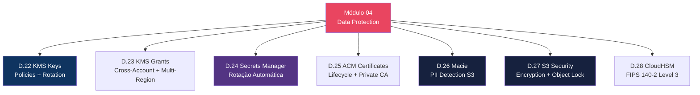

# Módulo 04 — Data Protection

> **Nível:** 200-300 (Intermediate/Advanced)
> **Tempo Total Estimado:** 12-16 horas de labs
> **Custo Estimado:** ~$5-15 (KMS, Macie, CloudHSM)
> **Objetivo do Módulo:** Dominar proteção de dados na AWS — criptografia com KMS (key types, policies, rotation, multi-region), gestão de secrets com rotação automática, certificados com ACM, detecção de PII com Macie, S3 hardening completo e CloudHSM para compliance FIPS 140-2.

---

## Mapa do Módulo


```

---

## Desafio 22: KMS — Key Types, Policies e Rotation

> **Level:** 200 | **Tempo:** 90 min | **Custo:** ~$1/mês por key

### Objetivo

Dominar **AWS KMS** — criar e gerenciar chaves de criptografia, entender os 3 tipos de key, escrever key policies least privilege e configurar rotação automática.

### Conceitos Fundamentais

```
┌──────────────────────────────────────────────────────────────────┐
│                    KMS — 3 Tipos de Key                           │
│                                                                   │
│  1. AWS Managed Keys (aws/service-name):                         │
│     ├── Criadas automaticamente pelo serviço AWS                 │
│     ├── Rotação automática a cada 1 ano                          │
│     ├── Você NÃO controla a key policy                           │
│     ├── Gratuito (custo incluído no serviço)                     │
│     └── Ex: aws/s3, aws/ebs, aws/rds, aws/dynamodb              │
│                                                                   │
│  2. Customer Managed Keys (CMKs):                                │
│     ├── Criadas por VOCÊ                                         │
│     ├── Você controla a key policy (quem pode usar)              │
│     ├── Rotação automática configurável (anual)                  │
│     ├── $1/mês + $0.03 por 10.000 API requests                  │
│     └── RECOMENDADO para produção (controle total)               │
│                                                                   │
│  3. Customer Managed Keys with Imported Material:                │
│     ├── Você importa o material criptográfico                    │
│     ├── Controle total do lifecycle do key material              │
│     ├── Pode definir expiration date                             │
│     ├── Pode deletar material sem deletar metadata               │
│     └── Cenário: compliance que exige bring-your-own-key         │
│                                                                   │
│  Key Spec (algoritmo):                                           │
│  ├── SYMMETRIC_DEFAULT (AES-256-GCM) — 95% dos casos           │
│  ├── RSA_2048/3072/4096 — assinatura digital, criptografia     │
│  ├── ECC_NIST_P256/P384/P521 — assinatura digital (ECDSA)      │
│  └── HMAC_224/256/384/512 — message authentication              │
└──────────────────────────────────────────────────────────────────┘
```

### Passo a Passo

#### Passo 1 — Criar Customer Managed Key

```bash
# Criar CMK simétrica (AES-256)
KEY_ID=$(aws kms create-key \
  --description "Production encryption key for app data" \
  --key-usage ENCRYPT_DECRYPT \
  --key-spec SYMMETRIC_DEFAULT \
  --tags '[
    {"TagKey":"Environment","TagValue":"production"},
    {"TagKey":"Team","TagValue":"platform"},
    {"TagKey":"Purpose","TagValue":"data-encryption"}
  ]' \
  --query 'KeyMetadata.KeyId' --output text)

echo "Key ID: $KEY_ID"

# Criar alias (nome amigável)
aws kms create-alias \
  --alias-name "alias/prod-data-key" \
  --target-key-id "$KEY_ID"

# Habilitar rotação automática (a cada 1 ano)
aws kms enable-key-rotation --key-id "$KEY_ID"

# Verificar
aws kms describe-key --key-id "$KEY_ID" \
  --query 'KeyMetadata.{ID:KeyId,State:KeyState,Rotation:RotationPeriodInDays,Created:CreationDate}' \
  --output table

aws kms get-key-rotation-status --key-id "$KEY_ID"
```

#### Passo 2 — Key Policy (Least Privilege)

```bash
# Key Policy define QUEM pode fazer O QUÊ com a key
aws kms put-key-policy \
  --key-id "$KEY_ID" \
  --policy-name "default" \
  --policy '{
    "Version": "2012-10-17",
    "Statement": [
      {
        "Sid": "EnableRootAccountFullAccess",
        "Effect": "Allow",
        "Principal": {"AWS": "arn:aws:iam::'$ACCOUNT_ID':root"},
        "Action": "kms:*",
        "Resource": "*"
      },
      {
        "Sid": "AllowKeyAdministration",
        "Effect": "Allow",
        "Principal": {"AWS": "arn:aws:iam::'$ACCOUNT_ID':role/SecurityAdmin"},
        "Action": [
          "kms:Create*",
          "kms:Describe*",
          "kms:Enable*",
          "kms:List*",
          "kms:Put*",
          "kms:Update*",
          "kms:Revoke*",
          "kms:Disable*",
          "kms:Get*",
          "kms:Delete*",
          "kms:TagResource",
          "kms:UntagResource",
          "kms:ScheduleKeyDeletion",
          "kms:CancelKeyDeletion"
        ],
        "Resource": "*"
      },
      {
        "Sid": "AllowAppToEncryptDecrypt",
        "Effect": "Allow",
        "Principal": {"AWS": [
          "arn:aws:iam::'$ACCOUNT_ID':role/EC2-AppServer-Role",
          "arn:aws:iam::'$ACCOUNT_ID':role/Lambda-ProcessOrders-Role"
        ]},
        "Action": [
          "kms:Decrypt",
          "kms:DescribeKey",
          "kms:GenerateDataKey",
          "kms:GenerateDataKeyWithoutPlaintext"
        ],
        "Resource": "*"
      },
      {
        "Sid": "AllowS3ToUseKey",
        "Effect": "Allow",
        "Principal": {"AWS": "*"},
        "Action": [
          "kms:Decrypt",
          "kms:GenerateDataKey"
        ],
        "Resource": "*",
        "Condition": {
          "StringEquals": {
            "kms:ViaService": "s3.us-east-1.amazonaws.com",
            "kms:CallerAccount": "'$ACCOUNT_ID'"
          }
        }
      },
      {
        "Sid": "DenyKeyDeletionWithoutApproval",
        "Effect": "Deny",
        "Principal": "*",
        "Action": "kms:ScheduleKeyDeletion",
        "Resource": "*",
        "Condition": {
          "NumericLessThan": {
            "kms:ScheduleKeyDeletionPendingWindowInDays": "30"
          }
        }
      }
    ]
  }'
```

#### Passo 3 — Usar a Key para Criptografia

```bash
# Encrypt dados diretamente (até 4KB)
aws kms encrypt \
  --key-id "alias/prod-data-key" \
  --plaintext "dados-secretos-aqui" \
  --query 'CiphertextBlob' --output text > encrypted.txt

# Decrypt
aws kms decrypt \
  --ciphertext-blob fileb://encrypted.txt \
  --query 'Plaintext' --output text | base64 --decode

# Generate Data Key (para criptografia envelope — arquivos grandes)
aws kms generate-data-key \
  --key-id "alias/prod-data-key" \
  --key-spec AES_256 \
  --query '{Plaintext:Plaintext,CiphertextBlob:CiphertextBlob}' \
  --output json
# Plaintext → usar para criptografar dados localmente
# CiphertextBlob → armazenar junto com os dados criptografados
# Depois: deletar Plaintext da memória imediatamente!

# Usar key com S3 (SSE-KMS)
aws s3 cp sensitive-data.json "s3://my-bucket/data/" \
  --sse aws:kms \
  --sse-kms-key-id "alias/prod-data-key"
```

### Terraform

```hcl
# ============================================
# KMS — Customer Managed Key
# ============================================

resource "aws_kms_key" "prod_data" {
  description             = "Production encryption key for app data"
  deletion_window_in_days = 30
  enable_key_rotation     = true
  rotation_period_in_days = 365
  multi_region            = false

  key_usage = "ENCRYPT_DECRYPT"
  customer_master_key_spec = "SYMMETRIC_DEFAULT"

  policy = jsonencode({
    Version = "2012-10-17"
    Statement = [
      {
        Sid       = "EnableRootAccount"
        Effect    = "Allow"
        Principal = { AWS = "arn:aws:iam::${data.aws_caller_identity.current.account_id}:root" }
        Action    = "kms:*"
        Resource  = "*"
      },
      {
        Sid       = "AllowKeyAdmin"
        Effect    = "Allow"
        Principal = { AWS = "arn:aws:iam::${data.aws_caller_identity.current.account_id}:role/SecurityAdmin" }
        Action = [
          "kms:Create*", "kms:Describe*", "kms:Enable*", "kms:List*",
          "kms:Put*", "kms:Update*", "kms:Revoke*", "kms:Disable*",
          "kms:Get*", "kms:Delete*", "kms:TagResource", "kms:UntagResource",
          "kms:ScheduleKeyDeletion", "kms:CancelKeyDeletion"
        ]
        Resource = "*"
      },
      {
        Sid       = "AllowAppEncryptDecrypt"
        Effect    = "Allow"
        Principal = { AWS = [
          "arn:aws:iam::${data.aws_caller_identity.current.account_id}:role/EC2-AppServer-Role",
          "arn:aws:iam::${data.aws_caller_identity.current.account_id}:role/Lambda-ProcessOrders-Role"
        ]}
        Action   = ["kms:Decrypt", "kms:DescribeKey", "kms:GenerateDataKey"]
        Resource = "*"
      }
    ]
  })

  tags = {
    Environment = "production"
    Team        = "platform"
  }
}

resource "aws_kms_alias" "prod_data" {
  name          = "alias/prod-data-key"
  target_key_id = aws_kms_key.prod_data.key_id
}

# S3 bucket com SSE-KMS
resource "aws_s3_bucket_server_side_encryption_configuration" "encrypted" {
  bucket = aws_s3_bucket.data.id

  rule {
    apply_server_side_encryption_by_default {
      sse_algorithm     = "aws:kms"
      kms_master_key_id = aws_kms_key.prod_data.arn
    }
    bucket_key_enabled = true  # Reduz custo de API calls KMS em ~99%
  }
}
```

### Envelope Encryption — Como Funciona

```
┌──────────────────────────────────────────────────────────────────┐
│           Envelope Encryption — Fluxo                             │
│                                                                   │
│  ENCRYPT:                                                        │
│  1. App chama KMS: GenerateDataKey(CMK)                         │
│  2. KMS retorna:                                                 │
│     ├── Plaintext Data Key (DEK) → usar para criptografar       │
│     └── Encrypted Data Key (EDEK) → armazenar junto com dados   │
│  3. App criptografa dados com DEK (AES-256 local)               │
│  4. App DELETA DEK da memória                                    │
│  5. App armazena: [EDEK] + [dados criptografados]               │
│                                                                   │
│  DECRYPT:                                                        │
│  1. App lê: [EDEK] + [dados criptografados]                    │
│  2. App chama KMS: Decrypt(EDEK)                                │
│  3. KMS retorna: Plaintext DEK                                   │
│  4. App descriptografa dados com DEK                             │
│  5. App DELETA DEK da memória                                    │
│                                                                   │
│  Benefício:                                                      │
│  ├── CMK nunca sai do KMS (seguro em HSM)                       │
│  ├── Dados grandes criptografados localmente (performance)       │
│  └── Apenas DEK criptografado viaja pela rede                   │
└──────────────────────────────────────────────────────────────────┘
```

### O Que Aprendemos

| Conceito | Detalhe |
|----------|---------|
| AWS Managed Key | Gerenciada pela AWS, rotação automática, sem controle de policy |
| Customer Managed Key | Criada por você, controle total de policy e rotação |
| Imported Key Material | Bring-your-own-key para compliance |
| Key Policy | Quem pode administrar, usar (encrypt/decrypt), grant |
| Key Rotation | Automática anual — material antigo mantido para decrypt |
| Envelope Encryption | CMK protege Data Key; Data Key protege dados |
| Bucket Key | S3 gera sub-key do CMK — reduz 99% das chamadas KMS |
| kms:ViaService | Condition key que restringe uso a um serviço específico |

> **💡 Expert Tip:** SEMPRE use `bucket_key_enabled = true` para S3 com SSE-KMS. Sem isso, cada PutObject/GetObject faz uma chamada KMS ($0.03/10K requests). Com bucket key, S3 gera uma data key temporária e a reutiliza, reduzindo custo em 99%. Para um bucket com 1M objects/mês, isso é a diferença entre $3 e $0.03.

---

## Desafio 23: KMS — Grants, Cross-Account e Multi-Region Keys

> **Level:** 300 | **Tempo:** 90 min | **Custo:** ~$2

### Objetivo

Dominar funcionalidades avançadas do KMS — grants para acesso temporário, compartilhamento cross-account de keys e multi-region keys para disaster recovery.

### KMS Grants

```bash
# Grant: dar acesso temporário sem alterar key policy
# Útil para: Lambda temporária, batch job, acesso auditado

GRANT_ID=$(aws kms create-grant \
  --key-id "$KEY_ID" \
  --grantee-principal "arn:aws:iam::$ACCOUNT_ID:role/BatchJob-Temp-Role" \
  --operations Decrypt GenerateDataKey \
  --constraints '{"EncryptionContextSubset":{"project":"migration-2026"}}' \
  --name "batch-migration-grant" \
  --retiring-principal "arn:aws:iam::$ACCOUNT_ID:role/SecurityAdmin" \
  --query 'GrantId' --output text)

echo "Grant ID: $GRANT_ID"

# Listar grants da key
aws kms list-grants --key-id "$KEY_ID" \
  --query 'Grants[].{Name:GrantId,Grantee:GranteePrincipal,Ops:Operations}' \
  --output table

# Revogar grant (quando batch terminar)
aws kms revoke-grant --key-id "$KEY_ID" --grant-id "$GRANT_ID"
```

### Cross-Account Key Sharing

```hcl
# Na conta OWNER: adicionar conta CONSUMER à key policy
resource "aws_kms_key" "shared" {
  description = "Shared encryption key (cross-account)"

  policy = jsonencode({
    Version = "2012-10-17"
    Statement = [
      {
        Sid       = "EnableRootAccount"
        Effect    = "Allow"
        Principal = { AWS = "arn:aws:iam::111111111111:root" }
        Action    = "kms:*"
        Resource  = "*"
      },
      {
        Sid       = "AllowCrossAccountDecrypt"
        Effect    = "Allow"
        Principal = { AWS = "arn:aws:iam::222222222222:root" }  # Conta consumidora
        Action    = ["kms:Decrypt", "kms:DescribeKey", "kms:GenerateDataKey"]
        Resource  = "*"
      }
    ]
  })
}

# Na conta CONSUMER: IAM policy permitindo usar a key da outra conta
resource "aws_iam_policy" "use_shared_key" {
  name = "UseSharedKMSKey"
  policy = jsonencode({
    Version = "2012-10-17"
    Statement = [{
      Effect   = "Allow"
      Action   = ["kms:Decrypt", "kms:DescribeKey", "kms:GenerateDataKey"]
      Resource = "arn:aws:kms:us-east-1:111111111111:key/KEY_ID_DA_OUTRA_CONTA"
    }]
  })
}
```

### Multi-Region Keys

```hcl
# Primary key (us-east-1)
resource "aws_kms_key" "primary" {
  description  = "Multi-region primary key for DR"
  multi_region = true

  policy = jsonencode({
    Version = "2012-10-17"
    Statement = [{
      Sid       = "EnableRoot"
      Effect    = "Allow"
      Principal = { AWS = "arn:aws:iam::${data.aws_caller_identity.current.account_id}:root" }
      Action    = "kms:*"
      Resource  = "*"
    }]
  })
}

# Replica key (eu-west-1) — mesma key ID, mesmo material criptográfico
resource "aws_kms_replica_key" "replica" {
  provider = aws.eu_west_1

  primary_key_arn         = aws_kms_key.primary.arn
  description             = "Multi-region replica for DR"
  deletion_window_in_days = 30
}

# Benefícios:
# - Mesmo Key ID em ambas as regiões
# - Dados criptografados em us-east-1 podem ser descriptografados em eu-west-1
# - DR: se us-east-1 cair, eu-west-1 pode operar independentemente
# - S3 Cross-Region Replication com SSE-KMS funciona sem re-encryption
```

### O Que Aprendemos

| Conceito | Detalhe |
|----------|---------|
| Grants | Acesso temporário sem alterar key policy — auditável e revogável |
| Encryption Context | Metadata adicional que deve ser fornecido para decrypt |
| Cross-account | Key policy permite conta X + IAM policy na conta X permite usar |
| Multi-region | Mesmo material criptográfico replicado entre regiões |
| Retiring principal | Quem pode revogar o grant (security admin) |

> **💡 Expert Tip:** Grants são superiores a IAM policies para acesso temporário a KMS keys. Diferente de policies, grants são auditados individualmente no CloudTrail, podem ter encryption context constraints (limitar a um projeto específico), e podem ser revogados instantaneamente sem afetar outras permissões. Use grants para batch jobs, migrações e acessos com prazo definido.

---

## Desafio 24: Secrets Manager — Rotação Automática e Lambda

> **Level:** 200 | **Tempo:** 90 min | **Custo:** ~$0.40/secret/mês

### Objetivo

Usar **AWS Secrets Manager** para armazenar credenciais de banco de dados, API keys e tokens com **rotação automática** via Lambda.

### Arquitetura

```
┌──────────────────────────────────────────────────────────────────┐
│         Secrets Manager — Rotação Automática                      │
│                                                                   │
│  ┌──────────────┐   rotação    ┌──────────┐   atualiza   ┌─────┐│
│  │   Secrets    │──(schedule)─→│  Lambda  │──────────────→│ RDS ││
│  │   Manager    │              │  Rotator │               │     ││
│  │              │←─────────────│          │               │     ││
│  │  secret v2   │  salva nova  │          │               │     ││
│  └──────┬───────┘  senha       └──────────┘               └─────┘│
│         │                                                         │
│    ┌────┴────┐                                                   │
│    │  App    │  Chama GetSecretValue → recebe senha atual       │
│    │ (EC2,   │  Nunca sabe que a senha mudou                    │
│    │ Lambda) │  Cache com TTL curto (5 min) para performance    │
│    └─────────┘                                                   │
└──────────────────────────────────────────────────────────────────┘
```

### Passo a Passo

```bash
# 1. Criar secret para RDS
aws secretsmanager create-secret \
  --name "prod/rds/app-database" \
  --description "Production RDS credentials" \
  --secret-string '{
    "username": "app_user",
    "password": "initial-strong-password-123!",
    "engine": "postgres",
    "host": "prod-db.cluster-xyz.us-east-1.rds.amazonaws.com",
    "port": 5432,
    "dbname": "appdb"
  }' \
  --tags '[{"Key":"Environment","Value":"production"},{"Key":"Team","Value":"platform"}]'

# 2. Habilitar rotação automática (usa Lambda managed pela AWS)
aws secretsmanager rotate-secret \
  --secret-id "prod/rds/app-database" \
  --rotation-lambda-arn "arn:aws:lambda:us-east-1:$ACCOUNT_ID:function:SecretsManagerRDSPostgreSQLRotation" \
  --rotation-rules '{"AutomaticallyAfterDays": 30, "ScheduleExpression": "rate(30 days)"}'

# 3. Criar secret para API key de terceiro
aws secretsmanager create-secret \
  --name "prod/external-api/weather" \
  --description "Weather API key" \
  --secret-string '{"api_key":"wk_live_abc123def456","endpoint":"https://api.weather.com/v1"}'

# 4. Buscar secret (como a app faria)
aws secretsmanager get-secret-value \
  --secret-id "prod/rds/app-database" \
  --query 'SecretString' --output text | jq .

# 5. Buscar versão anterior (útil para rollback)
aws secretsmanager get-secret-value \
  --secret-id "prod/rds/app-database" \
  --version-stage AWSPREVIOUS \
  --query 'SecretString' --output text | jq .
```

### App Code — Python com Cache

```python
"""
Exemplo: App Python que busca credenciais do Secrets Manager com cache.
"""
import boto3
import json
import time
from functools import lru_cache

secrets_client = boto3.client('secretsmanager')

# Cache com TTL de 5 minutos
_cache = {}
_cache_ttl = 300

def get_secret(secret_name):
    """Busca secret com cache para evitar chamadas excessivas."""
    now = time.time()
    if secret_name in _cache and now - _cache[secret_name]['ts'] < _cache_ttl:
        return _cache[secret_name]['value']

    response = secrets_client.get_secret_value(SecretId=secret_name)
    secret = json.loads(response['SecretString'])

    _cache[secret_name] = {'value': secret, 'ts': now}
    return secret


def get_db_connection():
    """Retorna conexão PostgreSQL usando credenciais do Secrets Manager."""
    import psycopg2

    creds = get_secret('prod/rds/app-database')

    return psycopg2.connect(
        host=creds['host'],
        port=creds['port'],
        dbname=creds['dbname'],
        user=creds['username'],
        password=creds['password'],
        connect_timeout=5
    )
```

### Terraform

```hcl
# Secret para RDS
resource "aws_secretsmanager_secret" "rds" {
  name        = "prod/rds/app-database"
  description = "Production RDS credentials"

  tags = {
    Environment = "production"
    AutoRotate  = "true"
  }
}

resource "aws_secretsmanager_secret_version" "rds" {
  secret_id = aws_secretsmanager_secret.rds.id
  secret_string = jsonencode({
    username = "app_user"
    password = random_password.rds.result
    engine   = "postgres"
    host     = aws_rds_cluster.main.endpoint
    port     = 5432
    dbname   = "appdb"
  })
}

resource "random_password" "rds" {
  length  = 32
  special = true
}

# Rotação automática
resource "aws_secretsmanager_secret_rotation" "rds" {
  secret_id           = aws_secretsmanager_secret.rds.id
  rotation_lambda_arn = aws_lambda_function.secret_rotator.arn

  rotation_rules {
    automatically_after_days = 30
  }
}

# Secret para API key (sem rotação automática — rotação manual)
resource "aws_secretsmanager_secret" "weather_api" {
  name        = "prod/external-api/weather"
  description = "Weather API key"
}

# Resource policy: quem pode acessar o secret
resource "aws_secretsmanager_secret_policy" "rds" {
  secret_arn = aws_secretsmanager_secret.rds.arn
  policy = jsonencode({
    Version = "2012-10-17"
    Statement = [
      {
        Sid       = "AllowAppRoles"
        Effect    = "Allow"
        Principal = { AWS = [
          aws_iam_role.ec2_app.arn,
          aws_iam_role.lambda_app.arn
        ]}
        Action    = ["secretsmanager:GetSecretValue"]
        Resource  = "*"
      },
      {
        Sid       = "DenyAllOthers"
        Effect    = "Deny"
        Principal = "*"
        Action    = ["secretsmanager:GetSecretValue"]
        Resource  = "*"
        Condition = {
          StringNotEquals = {
            "aws:PrincipalArn" = [
              aws_iam_role.ec2_app.arn,
              aws_iam_role.lambda_app.arn,
              "arn:aws:iam::${data.aws_caller_identity.current.account_id}:role/SecurityAdmin"
            ]
          }
        }
      }
    ]
  })
}
```

### O Que Aprendemos

| Conceito | Detalhe |
|----------|---------|
| Secrets Manager | Armazenamento seguro de credenciais com versionamento |
| Rotação automática | Lambda rotaciona senha no DB + atualiza secret automaticamente |
| Versões | AWSCURRENT (ativa), AWSPREVIOUS (anterior), AWSPENDING (em rotação) |
| Resource policy | Controla quem pode acessar o secret (além do IAM) |
| Cache | App deve cachear secret por 5 min para evitar throttling |
| vs Parameter Store | Secrets Manager: rotação, cross-account, $0.40/secret. SSM: grátis (standard), sem rotação nativa |

> **💡 Expert Tip:** NUNCA armazene credenciais em código, variáveis de ambiente ou arquivos de configuração. Secrets Manager resolve isso. Para Lambda, use a layer `aws-parameters-and-secrets-lambda-extension` — ela cacheia automaticamente e reduz latência de cold start. Para custo menor com secrets que não precisam de rotação, use SSM Parameter Store SecureString (grátis para standard tier).

---

## Desafio 25: ACM — Certificate Lifecycle e Private CA

> **Level:** 200 | **Tempo:** 60 min | **Custo:** ~$0 (public) / $400/mês (Private CA)

### Objetivo

Dominar o **lifecycle de certificados** com ACM — request, validation, renewal, monitoring — e entender quando usar **Private CA** para certificados internos.

### Certificate Lifecycle

```
┌──────────────────────────────────────────────────────────────────┐
│         ACM Certificate Lifecycle                                 │
│                                                                   │
│  Request → Validation → Issued → In Use → Renewal → Expired     │
│                                                                   │
│  Validation Methods:                                             │
│  ├── DNS (recomendado): CNAME no Route 53 → auto-renewal        │
│  └── Email: email para admin@dominio → renewal MANUAL            │
│                                                                   │
│  Auto-Renewal:                                                   │
│  ├── ACM renova automaticamente 60 dias antes de expirar        │
│  ├── Requisito: DNS validation + certificado EM USO              │
│  ├── "Em uso" = associado a CloudFront, ALB, API GW, etc.       │
│  └── Se não está em uso, NÃO renova (e você não é alertado!)    │
│                                                                   │
│  Monitoramento:                                                  │
│  ├── CloudWatch metric: DaysToExpiry                             │
│  ├── Config rule: acm-certificate-expiration-check               │
│  ├── EventBridge: ACM Certificate Approaching Expiration         │
│  └── Alarme: alertar quando DaysToExpiry < 30                    │
└──────────────────────────────────────────────────────────────────┘
```

```hcl
# Alarme para certificados próximos de expirar
resource "aws_cloudwatch_metric_alarm" "cert_expiry" {
  alarm_name          = "acm-certificate-expiring"
  comparison_operator = "LessThanThreshold"
  evaluation_periods  = 1
  metric_name         = "DaysToExpiry"
  namespace           = "AWS/CertificateManager"
  period              = 86400
  statistic           = "Minimum"
  threshold           = 30
  alarm_description   = "ACM certificate expiring in less than 30 days"

  dimensions = {
    CertificateArn = aws_acm_certificate.main.arn
  }

  alarm_actions = [aws_sns_topic.security_alerts.arn]
}

# Config Rule para todos os certificados
resource "aws_config_config_rule" "cert_expiry" {
  name = "acm-certificate-expiration-check"
  source {
    owner             = "AWS"
    source_identifier = "ACM_CERTIFICATE_EXPIRATION_CHECK"
  }
  input_parameters = jsonencode({
    daysToExpiration = "30"
  })
}
```

### O Que Aprendemos

| Conceito | Detalhe |
|----------|---------|
| ACM public | Certificados gratuitos, auto-renewal com DNS validation |
| ACM Private CA | $400/mês, certificados internos, mTLS, IoT |
| DNS validation | CNAME no Route 53 → renewal automático |
| DaysToExpiry | CloudWatch metric para monitorar expiração |
| us-east-1 | Obrigatório para CloudFront, qualquer região para ALB |

> **💡 Expert Tip:** O erro mais comum: criar certificado com EMAIL validation e esquecer de renovar. SEMPRE use DNS validation — o renewal é 100% automático. Configure o alarme de DaysToExpiry < 30 no dia zero. Para mTLS entre serviços internos, use ACM Private CA — custa $400/mês mas elimina a complexidade de gerenciar OpenSSL manualmente.

---

## Desafio 26: Macie — Detecção de PII e Dados Sensíveis

> **Level:** 200 | **Tempo:** 90 min | **Custo:** ~$1-5 (por GB scanned)

### Objetivo

Usar **Amazon Macie** para descobrir e classificar dados sensíveis (PII, PHI, financeiros) em buckets S3 automaticamente.

### Passo a Passo

```bash
# 1. Habilitar Macie
aws macie2 enable-macie

# 2. Criar job de descoberta
aws macie2 create-classification-job \
  --job-type ONE_TIME \
  --name "scan-all-s3-buckets" \
  --s3-job-definition '{
    "bucketDefinitions": [{
      "accountId": "'$ACCOUNT_ID'",
      "buckets": ["app-data-bucket", "user-uploads-bucket", "logs-bucket"]
    }]
  }' \
  --managed-data-identifier-selector ALL \
  --custom-data-identifier-ids []

# 3. Ver findings
aws macie2 get-findings \
  --finding-ids $(aws macie2 list-findings \
    --query 'findingIds[0:5]' --output json | jq -r '.[]') \
  --query 'findings[].{
    Type: type,
    Severity: severity.description,
    Bucket: resourcesAffected.s3Bucket.name,
    Object: resourcesAffected.s3Object.key,
    Category: category
  }' --output table

# 4. Ver estatísticas
aws macie2 get-finding-statistics \
  --finding-criteria '{}' \
  --group-by '{"key": "severity.description"}' \
  --sort-criteria '{"attributeName": "count", "orderBy": "DESC"}'
```

### Tipos de Dados que Macie Detecta

```
┌──────────────────────────────────────────────────────────────────┐
│         Macie — Tipos de Dados Sensíveis                          │
│                                                                   │
│  PII (Personally Identifiable Information):                      │
│  ├── CPF, RG, CNH (Brasil)                                      │
│  ├── SSN (EUA), NIN (UK), Aadhaar (India)                      │
│  ├── Nomes completos, endereços, telefones                       │
│  ├── Email addresses                                             │
│  ├── Datas de nascimento                                         │
│  └── IP addresses, MAC addresses                                 │
│                                                                   │
│  Financeiro:                                                     │
│  ├── Números de cartão de crédito (PCI)                         │
│  ├── Números de conta bancária                                   │
│  ├── SWIFT/BIC codes                                             │
│  └── Tax IDs                                                     │
│                                                                   │
│  Saúde (PHI):                                                    │
│  ├── Health insurance IDs                                        │
│  ├── Medical record numbers                                      │
│  └── Drug/medication names                                       │
│                                                                   │
│  Credenciais:                                                    │
│  ├── AWS access keys                                             │
│  ├── Private keys (RSA, SSH)                                     │
│  ├── Passwords em plaintext                                      │
│  └── Database connection strings                                 │
│                                                                   │
│  Custom (você define):                                           │
│  ├── Regex patterns (ex: número de matrícula da empresa)         │
│  └── Keywords (ex: "CONFIDENCIAL", "TOP SECRET")                │
└──────────────────────────────────────────────────────────────────┘
```

### Terraform

```hcl
resource "aws_macie2_account" "main" {}

resource "aws_macie2_classification_job" "weekly" {
  depends_on = [aws_macie2_account.main]

  job_type = "SCHEDULED"
  name     = "weekly-pii-scan"

  s3_job_definition {
    bucket_definitions {
      account_id = data.aws_caller_identity.current.account_id
      buckets    = [aws_s3_bucket.app_data.id, aws_s3_bucket.uploads.id]
    }
  }

  schedule_frequency_details {
    weekly_schedule = "MONDAY"
  }

  sampling_percentage = 100

  tags = { Security = "mandatory" }
}

# Custom Data Identifier (ex: matrícula de funcionário)
resource "aws_macie2_custom_data_identifier" "employee_id" {
  depends_on = [aws_macie2_account.main]

  name        = "EmployeeID"
  description = "Detects employee IDs (EMP-XXXXX format)"
  regex       = "EMP-[0-9]{5}"
  keywords    = ["funcionário", "matrícula", "employee"]

  maximum_match_distance = 50
}
```

### O Que Aprendemos

| Conceito | Detalhe |
|----------|---------|
| Macie | Descoberta automática de dados sensíveis em S3 |
| Managed identifiers | 200+ tipos de PII/PHI/financeiro pré-configurados |
| Custom identifiers | Regex + keywords para dados específicos da empresa |
| Findings → Security Hub | Integração automática com Security Hub |
| Custo | $1/GB para primeiros 50TB/mês no primeiro bucket |

> **💡 Expert Tip:** Macie é obrigatório para compliance PCI DSS e HIPAA. Habilite scan semanal em TODOS os buckets que recebem dados de usuários. O finding mais comum: "AWS access keys encontradas em arquivo de log" — credenciais que vazaram e foram logadas. Quando Macie encontrar isso, revogue as keys IMEDIATAMENTE e investigue como chegaram ali.

---

## Desafio 27: S3 Security — Encryption, Block Public, Object Lock

> **Level:** 200 | **Tempo:** 90 min | **Custo:** ~$0

### Objetivo

Implementar **hardening completo de S3** — encryption obrigatória, bloqueio de acesso público em nível de conta, Object Lock para proteção contra deleção e versionamento.

### S3 Security Checklist

```
┌──────────────────────────────────────────────────────────────────┐
│               S3 Security — Hardening Completo                    │
│                                                                   │
│  ☐ Block Public Access (conta inteira)                           │
│  ☐ Default encryption (SSE-S3 mínimo, SSE-KMS recomendado)      │
│  ☐ Versionamento habilitado                                     │
│  ☐ MFA Delete habilitado (para buckets críticos)                │
│  ☐ Object Lock (WORM — compliance)                              │
│  ☐ Access Logging habilitado                                     │
│  ☐ Lifecycle rules (expiração, glacier)                         │
│  ☐ Bucket policy least privilege                                │
│  ☐ CORS configurado corretamente (se necessário)               │
│  ☐ VPC Endpoint para acesso privado (sem internet)             │
│  ☐ CloudTrail data events habilitados                           │
│  ☐ Macie habilitado para scan de PII                            │
└──────────────────────────────────────────────────────────────────┘
```

```bash
# 1. Block Public Access — CONTA INTEIRA (nuclear option, recomendado)
aws s3control put-public-access-block \
  --account-id "$ACCOUNT_ID" \
  --public-access-block-configuration '{
    "BlockPublicAcls": true,
    "IgnorePublicAcls": true,
    "BlockPublicPolicy": true,
    "RestrictPublicBuckets": true
  }'

echo "✅ Nenhum bucket nesta conta pode ser público"
```

```hcl
# ============================================
# S3 HARDENING COMPLETO
# ============================================

# Block Public Access — conta inteira
resource "aws_s3_account_public_access_block" "account" {
  block_public_acls       = true
  block_public_policy     = true
  ignore_public_acls      = true
  restrict_public_buckets = true
}

# Bucket com hardening completo
resource "aws_s3_bucket" "secure" {
  bucket = "empresa-secure-data"

  # Object Lock precisa ser habilitado na criação
  object_lock_enabled = true

  tags = {
    DataClassification = "confidential"
    Compliance         = "pci-dss"
  }
}

resource "aws_s3_bucket_versioning" "secure" {
  bucket = aws_s3_bucket.secure.id
  versioning_configuration { status = "Enabled" }
}

resource "aws_s3_bucket_server_side_encryption_configuration" "secure" {
  bucket = aws_s3_bucket.secure.id
  rule {
    apply_server_side_encryption_by_default {
      sse_algorithm     = "aws:kms"
      kms_master_key_id = aws_kms_key.prod_data.arn
    }
    bucket_key_enabled = true
  }
}

# Object Lock — WORM (Write Once Read Many)
resource "aws_s3_bucket_object_lock_configuration" "secure" {
  bucket = aws_s3_bucket.secure.id

  rule {
    default_retention {
      mode = "COMPLIANCE"  # Ninguém pode deletar, nem root
      days = 365           # Retenção de 1 ano
    }
  }
}

resource "aws_s3_bucket_public_access_block" "secure" {
  bucket                  = aws_s3_bucket.secure.id
  block_public_acls       = true
  block_public_policy     = true
  ignore_public_acls      = true
  restrict_public_buckets = true
}

# Deny unencrypted uploads
resource "aws_s3_bucket_policy" "secure" {
  bucket = aws_s3_bucket.secure.id
  policy = jsonencode({
    Version = "2012-10-17"
    Statement = [
      {
        Sid       = "DenyUnencryptedUploads"
        Effect    = "Deny"
        Principal = "*"
        Action    = "s3:PutObject"
        Resource  = "${aws_s3_bucket.secure.arn}/*"
        Condition = {
          StringNotEquals = {
            "s3:x-amz-server-side-encryption" = "aws:kms"
          }
        }
      },
      {
        Sid       = "DenyInsecureTransport"
        Effect    = "Deny"
        Principal = "*"
        Action    = "s3:*"
        Resource  = [aws_s3_bucket.secure.arn, "${aws_s3_bucket.secure.arn}/*"]
        Condition = {
          Bool = { "aws:SecureTransport" = "false" }
        }
      }
    ]
  })
}

resource "aws_s3_bucket_logging" "secure" {
  bucket        = aws_s3_bucket.secure.id
  target_bucket = aws_s3_bucket.access_logs.id
  target_prefix = "s3-access-logs/${aws_s3_bucket.secure.id}/"
}

resource "aws_s3_bucket_lifecycle_configuration" "secure" {
  bucket = aws_s3_bucket.secure.id
  rule {
    id     = "archive"
    status = "Enabled"
    transition { days = 90; storage_class = "GLACIER" }
    transition { days = 365; storage_class = "DEEP_ARCHIVE" }
    noncurrent_version_transition { noncurrent_days = 30; storage_class = "GLACIER" }
    noncurrent_version_expiration { noncurrent_days = 365 }
  }
}
```

### O Que Aprendemos

| Conceito | Detalhe |
|----------|---------|
| Account-level Block Public | Bloqueia TODOS os buckets da conta de serem públicos |
| Object Lock COMPLIANCE | Ninguém pode deletar, nem root, durante o período de retenção |
| Object Lock GOVERNANCE | Admins com permissão especial podem bypassar |
| Deny unencrypted | Bucket policy rejeita PutObject sem encryption |
| Deny insecure transport | Rejeita requests HTTP (sem TLS) |
| Bucket Key | Reduz 99% das chamadas KMS com SSE-KMS |

> **💡 Expert Tip:** O primeiro ato de segurança em qualquer conta AWS nova deve ser `aws s3control put-public-access-block` na conta inteira. Isso previne que qualquer bucket seja acidentalmente público — a causa #1 de data breaches na AWS. Para dados de compliance (PCI, HIPAA), use Object Lock COMPLIANCE — nem o root account pode deletar os dados antes do período de retenção expirar. Isso é admissível como evidência em auditorias.

---

## Desafio 28: CloudHSM — Hardware Security Module

> **Level:** 400 | **Tempo:** 60 min | **Custo:** ~$1.50/hora (caro!)

### Objetivo

Entender **AWS CloudHSM** — quando usar, como difere do KMS, e cenários de compliance que exigem FIPS 140-2 Level 3.

### KMS vs CloudHSM

```
┌──────────────────────────────────────────────────────────────────┐
│           KMS vs CloudHSM — Quando Usar Qual                     │
│                                                                   │
│                         KMS              CloudHSM                │
│  ──────────────────────────────────────────────────────────     │
│  Compliance           FIPS 140-2 L2      FIPS 140-2 L3 ★       │
│  Key Control          AWS gerencia HSM    Você gerencia HSM     │
│  Multi-tenant         Sim (compartilhado) Não (dedicado)        │
│  Integração AWS       Nativa (S3,EBS,RDS) Via API customizada    │
│  Performance          ~10K req/s          ~500-1500 req/s        │
│  Custo               $1/key/mês          ~$1.50/hora (~$1K/mês) │
│  Cluster              N/A                 2+ HSMs recomendado    │
│  Key Export           Não                 Sim (você tem o key)   │
│  Custom Key Store     Sim (bridge)        N/A                    │
│                                                                   │
│  Use KMS quando:                                                 │
│  ├── FIPS 140-2 Level 2 é suficiente (99% dos casos)           │
│  ├── Precisa integração nativa com serviços AWS                  │
│  └── Custo é uma preocupação                                    │
│                                                                   │
│  Use CloudHSM quando:                                            │
│  ├── FIPS 140-2 Level 3 é obrigatório (governo, fintech)       │
│  ├── Precisa exportar keys (transferir para outro provider)      │
│  ├── Precisa de HSM dedicado (não compartilhado)                │
│  ├── Regulação exige controle total do HSM                      │
│  └── Precisa assinar código (code signing, PKI)                  │
│                                                                   │
│  Custom Key Store (melhor dos mundos):                           │
│  ├── KMS + CloudHSM = integração nativa + FIPS Level 3         │
│  ├── Keys do KMS armazenadas no SEU CloudHSM                   │
│  └── Usa API do KMS, mas material criptográfico no CloudHSM     │
└──────────────────────────────────────────────────────────────────┘
```

```hcl
# Custom Key Store (KMS + CloudHSM bridge)
resource "aws_kms_custom_key_store" "hsm_backed" {
  custom_key_store_name = "production-hsm-keystore"
  cloud_hsm_cluster_id  = aws_cloudhsm_v2_cluster.main.cluster_id

  key_store_password = var.hsm_key_store_password  # Do Secrets Manager!

  # Após criar, criar keys KMS neste key store:
  # aws kms create-key --origin AWS_CLOUDHSM --custom-key-store-id cks-xxx
}
```

### O Que Aprendemos

| Conceito | Detalhe |
|----------|---------|
| CloudHSM | HSM dedicado, FIPS 140-2 Level 3 |
| Custom Key Store | KMS API + CloudHSM storage = melhor dos mundos |
| FIPS 140-2 L2 | KMS padrão — suficiente para 99% |
| FIPS 140-2 L3 | Tamper-evident, tamper-resistant — governo, fintech |
| Custo | ~$1K/mês por HSM — precisa 2+ para HA |

> **💡 Expert Tip:** Se alguém perguntar "precisamos de CloudHSM?", a resposta é quase sempre "não, KMS é suficiente". CloudHSM é para cenários muito específicos: FIPS 140-2 Level 3 obrigatório por regulação, PKI interna, ou necessidade de exportar key material. Para todos os outros casos, KMS com Custom Key Store (se precisa FIPS L3) ou KMS padrão (se FIPS L2 é OK) são a escolha correta.

---

## Resumo do Módulo 04

```
┌──────────────────────────────────────────────────────────────┐
│               MÓDULO 04 — CONQUISTAS                          │
│                                                               │
│  ✅ Desafio 22: KMS Keys, Policies, Rotation                 │
│     CMK, key policy least privilege, envelope encryption     │
│                                                               │
│  ✅ Desafio 23: KMS Grants, Cross-Account, Multi-Region      │
│     Acesso temporário, compartilhamento, DR                  │
│                                                               │
│  ✅ Desafio 24: Secrets Manager + Rotação                    │
│     RDS rotation, API keys, resource policies, caching       │
│                                                               │
│  ✅ Desafio 25: ACM Lifecycle + Private CA                   │
│     DNS validation, auto-renewal, expiry monitoring          │
│                                                               │
│  ✅ Desafio 26: Macie PII Detection                          │
│     Scan S3, 200+ data identifiers, custom patterns          │
│                                                               │
│  ✅ Desafio 27: S3 Security Hardening                        │
│     Block public, encryption, Object Lock WORM               │
│                                                               │
│  ✅ Desafio 28: CloudHSM vs KMS                              │
│     FIPS 140-2, Custom Key Store, quando usar                │
│                                                               │
│  Próximo: Módulo 05 — Incident Response                      │
│  (NIST Framework, Playbooks, Forensics, Containment)         │
└──────────────────────────────────────────────────────────────┘
```

**Próximo:** [Módulo 05 — Incident Response →](modulo-05-incident-response.md)
