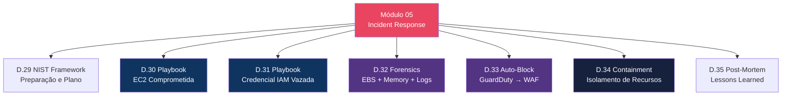
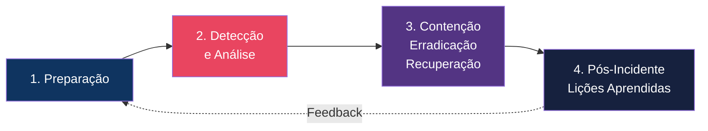
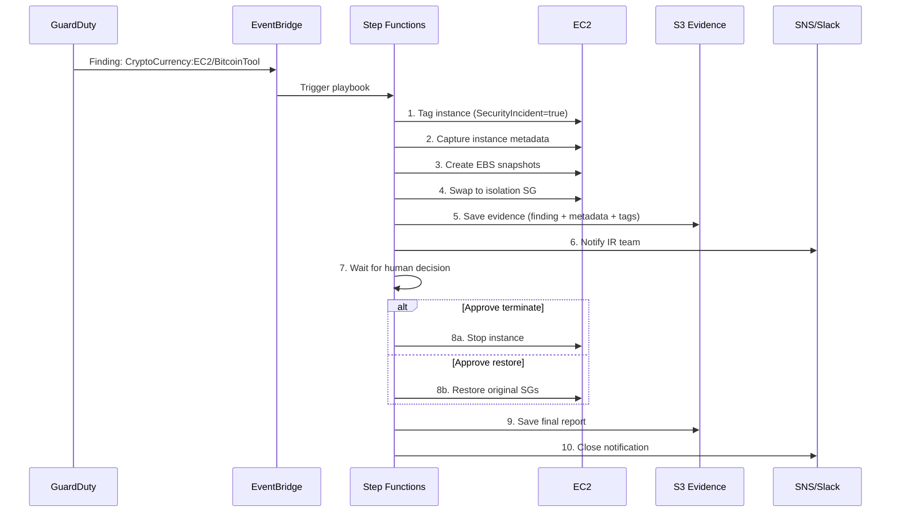
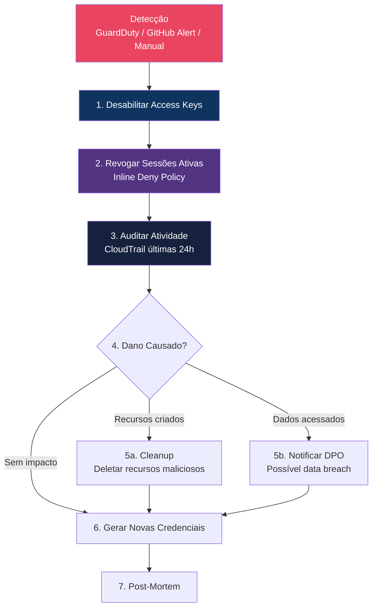
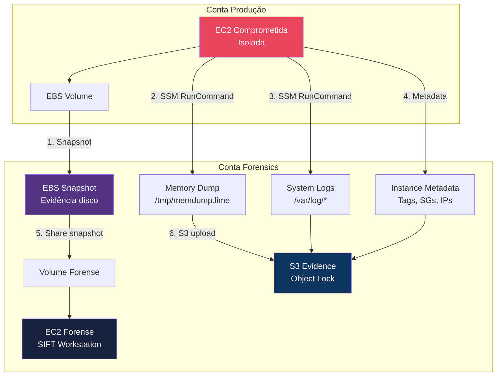
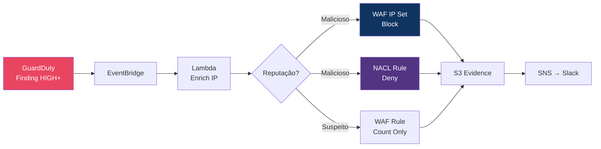
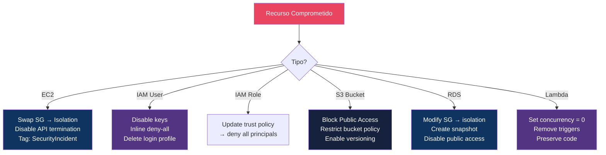

# Módulo 05 — Incident Response

> **Nível:** 300 (Advanced)
> **Tempo Total Estimado:** 14-18 horas de labs
> **Custo Estimado:** ~$5-15 (EC2 para forensics, Step Functions)
> **Objetivo do Módulo:** Dominar resposta a incidentes na AWS seguindo o framework NIST — preparação, detecção, contenção, erradicação, recuperação e lições aprendidas. Criar playbooks automatizados com Step Functions, realizar forensics em EC2 comprometida e implementar pipelines de auto-remediação.

---

## Mapa do Módulo



---

## Desafio 29: IR Framework — Preparação e Plano de Resposta (NIST)

> **Level:** 300 | **Tempo:** 60 min | **Custo:** $0

### Objetivo

Estruturar um **plano de resposta a incidentes** seguindo o framework NIST SP 800-61, adaptado para AWS. Definir papéis, processos, ferramentas e runbooks antes que um incidente aconteça.

### O Framework NIST na AWS



### As 4 Fases Detalhadas

```
┌──────────────────────────────────────────────────────────────────┐
│  FASE 1: PREPARAÇÃO (antes do incidente)                         │
│  ├── Plano de IR documentado e aprovado                         │
│  ├── Time de IR definido (roles + contatos)                     │
│  ├── Ferramentas prontas (CloudTrail, GuardDuty, Detective)     │
│  ├── Runbooks escritos e testados (game days)                   │
│  ├── Conta de forensics isolada (cross-account)                 │
│  ├── AMI forense com ferramentas (Volatility, SIFT)             │
│  └── Alarmes e notificações configurados                        │
│                                                                   │
│  FASE 2: DETECÇÃO E ANÁLISE                                     │
│  ├── GuardDuty finding → Severidade HIGH+                       │
│  ├── CloudTrail → Atividade anômala                             │
│  ├── VPC Flow Logs → Tráfego suspeito                          │
│  ├── Security Hub → Finding CRITICAL                            │
│  ├── Classificar: True Positive vs False Positive               │
│  └── Determinar escopo: quais recursos afetados?                │
│                                                                   │
│  FASE 3: CONTENÇÃO, ERRADICAÇÃO, RECUPERAÇÃO                    │
│  ├── Contenção imediata: isolar recurso comprometido            │
│  ├── Contenção de curto prazo: bloquear IP, revogar credencial  │
│  ├── Erradicação: remover malware, fechar vulnerabilidade       │
│  ├── Recuperação: restaurar de backup, re-deploy                │
│  └── Verificação: confirmar que ameaça foi eliminada            │
│                                                                   │
│  FASE 4: PÓS-INCIDENTE                                          │
│  ├── Timeline do incidente documentada                          │
│  ├── Root cause analysis                                        │
│  ├── Ações corretivas (preventivas)                             │
│  ├── Atualizar runbooks e alarmes                               │
│  └── Compartilhar lições com a organização                      │
└──────────────────────────────────────────────────────────────────┘
```

### IR Plan Template

```markdown
# Plano de Resposta a Incidentes — [Nome da Empresa]

## 1. Escopo
Este plano cobre incidentes de segurança na infraestrutura AWS da empresa.

## 2. Time de Resposta

| Papel | Responsável | Contato | Backup |
|-------|------------|---------|--------|
| IR Lead | Nome | +55... / Slack | Nome2 |
| Cloud Engineer | Nome | +55... / Slack | Nome2 |
| Security Analyst | Nome | +55... / Slack | Nome2 |
| Comunicação | Nome | +55... / Slack | Nome2 |
| Legal/Compliance | Nome | email | — |

## 3. Classificação de Severidade

| Severidade | Critério | SLA Resposta | Exemplo |
|-----------|----------|-------------|---------|
| P0 — Crítico | Dados vazados, sistema fora do ar | 15 min | Credenciais root comprometidas |
| P1 — Alto | Recurso comprometido, ataque ativo | 30 min | EC2 minerando crypto |
| P2 — Médio | Atividade suspeita, vuln explorada | 2 horas | Brute force SSH |
| P3 — Baixo | Informacional, falso positivo | Próximo dia útil | Port scan |

## 4. Ferramentas

| Ferramenta | Uso | Acesso |
|-----------|-----|--------|
| GuardDuty | Detecção de ameaças | Console / CLI |
| CloudTrail + Athena | Auditoria e investigação | Queries SQL |
| Detective | Investigação visual | Console |
| Security Hub | Dashboard centralizado | Console |
| VPC Flow Logs | Análise de tráfego | Athena |
| SSM Session Manager | Acesso seguro a EC2 | Console / CLI |
| Conta Forensics | Análise isolada | Cross-account role |

## 5. Runbooks (Referência Rápida)

| Cenário | Runbook | Desafio |
|---------|---------|---------|
| EC2 comprometida | Isolar → Snapshot → Forensics | D.30 |
| Credencial IAM vazada | Desabilitar → Revogar → Auditar | D.31 |
| S3 bucket exposto | Block public → Audit access → Notify | — |
| DDoS ativo | Shield → WAF rate limit → Escalar | — |
| Malware detectado | Isolar → Capturar evidência → Erradicar | D.32 |

## 6. Comunicação

| Quando | Quem Notificar | Canal |
|--------|---------------|-------|
| P0 detectado | IR Lead + CTO | Telefone + Slack #incident |
| P1 detectado | IR Lead | Slack #incident |
| Contenção iniciada | Time completo | Slack #incident |
| Incidente resolvido | Stakeholders | Email + Slack |
| Post-mortem pronto | Toda a empresa | Confluence / Wiki |

## 7. Cadência de Game Days

| Frequência | Exercício |
|-----------|----------|
| Mensal | Tabletop exercise (simular cenário) |
| Trimestral | Full simulation (executar runbook) |
| Semestral | Red team exercise |
```

### Terraform — Infraestrutura de IR

```hcl
# Conta de Forensics (isolada)
# Em produção, esta seria uma conta separada na Organization

# S3 para evidências (imutável)
resource "aws_s3_bucket" "ir_evidence" {
  bucket = "ir-evidence-${data.aws_caller_identity.current.account_id}"
}

resource "aws_s3_bucket_versioning" "ir_evidence" {
  bucket = aws_s3_bucket.ir_evidence.id
  versioning_configuration { status = "Enabled" }
}

resource "aws_s3_bucket_object_lock_configuration" "ir_evidence" {
  bucket = aws_s3_bucket.ir_evidence.id
  rule {
    default_retention {
      mode = "COMPLIANCE"
      days = 365
    }
  }
}

# SNS para alertas de IR
resource "aws_sns_topic" "ir_alerts" {
  name = "incident-response-alerts"
}

resource "aws_sns_topic_subscription" "ir_pagerduty" {
  topic_arn = aws_sns_topic.ir_alerts.arn
  protocol  = "https"
  endpoint  = "https://events.pagerduty.com/integration/xxx/enqueue"
}

resource "aws_sns_topic_subscription" "ir_slack" {
  topic_arn = aws_sns_topic.ir_alerts.arn
  protocol  = "lambda"
  endpoint  = aws_lambda_function.slack_notifier.arn
}

# IAM Role para IR (cross-account forensics)
resource "aws_iam_role" "ir_responder" {
  name = "IncidentResponder"

  assume_role_policy = jsonencode({
    Version = "2012-10-17"
    Statement = [{
      Effect    = "Allow"
      Principal = { AWS = "arn:aws:iam::${var.security_account_id}:root" }
      Action    = "sts:AssumeRole"
      Condition = {
        Bool = { "aws:MultiFactorAuthPresent" = "true" }
      }
    }]
  })
}

resource "aws_iam_role_policy" "ir_responder" {
  name = "IncidentResponderPermissions"
  role = aws_iam_role.ir_responder.id

  policy = jsonencode({
    Version = "2012-10-17"
    Statement = [
      {
        Sid    = "InvestigateAndContain"
        Effect = "Allow"
        Action = [
          "ec2:DescribeInstances", "ec2:DescribeSecurityGroups",
          "ec2:DescribeSnapshots", "ec2:DescribeVolumes",
          "ec2:CreateSnapshot", "ec2:CopySnapshot",
          "ec2:ModifyInstanceAttribute", "ec2:CreateTags",
          "ec2:StopInstances",
          "iam:ListAccessKeys", "iam:UpdateAccessKey",
          "iam:ListAttachedUserPolicies", "iam:ListUserPolicies",
          "iam:PutUserPolicy",
          "guardduty:GetFindings", "guardduty:ListFindings",
          "cloudtrail:LookupEvents",
          "logs:GetLogEvents", "logs:FilterLogEvents",
          "s3:PutObject"
        ]
        Resource = "*"
      },
      {
        Sid    = "DenyDestructive"
        Effect = "Deny"
        Action = [
          "ec2:TerminateInstances",
          "s3:DeleteObject", "s3:DeleteBucket",
          "iam:DeleteUser", "iam:DeleteRole",
          "rds:DeleteDBInstance"
        ]
        Resource = "*"
      }
    ]
  })
}
```

### Validação

```bash
# Verificar que infraestrutura de IR existe
aws s3api head-bucket --bucket "ir-evidence-$ACCOUNT_ID" 2>/dev/null && echo "S3 evidence bucket OK" || echo "FALTA: criar bucket de evidências"
aws sns list-topics --query 'Topics[?contains(TopicArn,`incident-response`)]' --output text && echo "SNS topic OK" || echo "FALTA: criar SNS topic"
aws iam get-role --role-name IncidentResponder 2>/dev/null && echo "IR Role OK" || echo "FALTA: criar IAM role"
```

### O Que Aprendemos

| Conceito | Detalhe |
|----------|---------|
| NIST SP 800-61 | Framework de IR: Preparação → Detecção → Contenção → Pós-incidente |
| IR Plan | Documento vivo com roles, severidades, runbooks, comunicação |
| Conta Forensics | Conta AWS isolada para análise segura de evidências |
| Game Days | Exercícios periódicos para testar o plano (mensal/trimestral) |
| Evidence bucket | S3 com Object Lock COMPLIANCE — imutável para forense |
| IR Role | Cross-account com MFA, permite investigar mas bloqueia destruição |

> **💡 Expert Tip:** O plano de IR mais bonito do mundo é inútil se nunca foi testado. Game days mensais são obrigatórios. Simule: "EC2 está minerando crypto — o que fazemos?". Cronometre quanto tempo leva para detectar, conter e resolver. Se leva mais de 30 minutos, o plano precisa de melhoria. Empresas maduras em IR resolvem P0 em 15 minutos porque praticaram dezenas de vezes.

---

## Desafio 30: Playbook Automatizado — EC2 Comprometida

> **Level:** 300 | **Tempo:** 120 min | **Custo:** ~$3-5

### Objetivo

Criar um **playbook automatizado** com AWS Step Functions que responde a um finding de EC2 comprometida: isola a instância, captura evidências, notifica o time e cria ticket.

### Fluxo do Playbook



### Step Functions — State Machine

```json
{
  "Comment": "IR Playbook: EC2 Comprometida",
  "StartAt": "ExtractFindingDetails",
  "States": {
    "ExtractFindingDetails": {
      "Type": "Pass",
      "Parameters": {
        "instanceId.$": "$.detail.resource.instanceDetails.instanceId",
        "findingType.$": "$.detail.type",
        "severity.$": "$.detail.severity",
        "findingId.$": "$.detail.id",
        "accountId.$": "$.detail.accountId",
        "region.$": "$.detail.region",
        "timestamp.$": "$$.Execution.StartTime"
      },
      "Next": "TagInstance"
    },

    "TagInstance": {
      "Type": "Task",
      "Resource": "arn:aws:states:::aws-sdk:ec2:createTags",
      "Parameters": {
        "Resources.$": "States.Array($.instanceId)",
        "Tags": [
          {"Key": "SecurityIncident", "Value": "true"},
          {"Key": "IncidentStatus", "Value": "investigating"},
          {"Key": "PlaybookExecution.$", "Value": "$$.Execution.Id"}
        ]
      },
      "Next": "GetInstanceDetails",
      "Catch": [{"ErrorEquals": ["States.ALL"], "Next": "NotifyError"}]
    },

    "GetInstanceDetails": {
      "Type": "Task",
      "Resource": "arn:aws:states:::aws-sdk:ec2:describeInstances",
      "Parameters": {
        "InstanceIds.$": "States.Array($.instanceId)"
      },
      "ResultPath": "$.instanceDetails",
      "Next": "CreateEBSSnapshots"
    },

    "CreateEBSSnapshots": {
      "Type": "Task",
      "Resource": "arn:aws:states:::lambda:invoke",
      "Parameters": {
        "FunctionName": "ir-create-snapshots",
        "Payload.$": "$"
      },
      "ResultPath": "$.snapshots",
      "Next": "IsolateInstance"
    },

    "IsolateInstance": {
      "Type": "Task",
      "Resource": "arn:aws:states:::lambda:invoke",
      "Parameters": {
        "FunctionName": "ir-isolate-ec2",
        "Payload.$": "$"
      },
      "ResultPath": "$.isolation",
      "Next": "SaveEvidence"
    },

    "SaveEvidence": {
      "Type": "Task",
      "Resource": "arn:aws:states:::s3:putObject",
      "Parameters": {
        "Bucket": "ir-evidence-ACCOUNT_ID",
        "Key.$": "States.Format('incidents/{}/{}/evidence.json', $.timestamp, $.instanceId)",
        "Body.$": "States.JsonToString($)"
      },
      "Next": "NotifyTeam"
    },

    "NotifyTeam": {
      "Type": "Task",
      "Resource": "arn:aws:states:::sns:publish",
      "Parameters": {
        "TopicArn": "arn:aws:sns:us-east-1:ACCOUNT_ID:incident-response-alerts",
        "Subject": "EC2 Incident - Instance Isolated",
        "Message.$": "States.Format('[IR PLAYBOOK] EC2 {} isolada.\\nFinding: {}\\nSeverity: {}\\nSnapshots criados. Evidências salvas.\\nAção necessária: aprovar terminação ou restauração.', $.instanceId, $.findingType, $.severity)"
      },
      "Next": "WaitForApproval"
    },

    "WaitForApproval": {
      "Type": "Task",
      "Resource": "arn:aws:states:::sqs:sendMessage.waitForTaskToken",
      "Parameters": {
        "QueueUrl": "https://sqs.us-east-1.amazonaws.com/ACCOUNT_ID/ir-approval-queue",
        "MessageBody": {
          "taskToken.$": "$$.Task.Token",
          "instanceId.$": "$.instanceId",
          "message": "Aprovar ação: TERMINATE ou RESTORE"
        }
      },
      "TimeoutSeconds": 86400,
      "Next": "EvaluateDecision",
      "Catch": [{"ErrorEquals": ["States.Timeout"], "Next": "AutoTerminate"}]
    },

    "EvaluateDecision": {
      "Type": "Choice",
      "Choices": [
        {
          "Variable": "$.decision",
          "StringEquals": "TERMINATE",
          "Next": "StopInstance"
        }
      ],
      "Default": "RestoreInstance"
    },

    "StopInstance": {
      "Type": "Task",
      "Resource": "arn:aws:states:::aws-sdk:ec2:stopInstances",
      "Parameters": {
        "InstanceIds.$": "States.Array($.instanceId)"
      },
      "Next": "CloseIncident"
    },

    "RestoreInstance": {
      "Type": "Task",
      "Resource": "arn:aws:states:::lambda:invoke",
      "Parameters": {
        "FunctionName": "ir-restore-ec2",
        "Payload.$": "$"
      },
      "Next": "CloseIncident"
    },

    "AutoTerminate": {
      "Type": "Task",
      "Resource": "arn:aws:states:::aws-sdk:ec2:stopInstances",
      "Parameters": {
        "InstanceIds.$": "States.Array($.instanceId)"
      },
      "Next": "CloseIncident"
    },

    "CloseIncident": {
      "Type": "Task",
      "Resource": "arn:aws:states:::sns:publish",
      "Parameters": {
        "TopicArn": "arn:aws:sns:us-east-1:ACCOUNT_ID:incident-response-alerts",
        "Subject": "EC2 Incident - CLOSED",
        "Message.$": "States.Format('[IR PLAYBOOK] Incidente EC2 {} encerrado.', $.instanceId)"
      },
      "End": true
    },

    "NotifyError": {
      "Type": "Task",
      "Resource": "arn:aws:states:::sns:publish",
      "Parameters": {
        "TopicArn": "arn:aws:sns:us-east-1:ACCOUNT_ID:incident-response-alerts",
        "Subject": "IR PLAYBOOK ERROR",
        "Message": "Erro na execução do playbook. Intervenção manual necessária."
      },
      "End": true
    }
  }
}
```

### Lambda: Isolar EC2

```python
"""ir-isolate-ec2 — Isola EC2 trocando Security Groups."""
import boto3
import json

ec2 = boto3.client('ec2')

def handler(event, context):
    instance_id = event['instanceId']

    # Obter SGs atuais
    response = ec2.describe_instances(InstanceIds=[instance_id])
    instance = response['Reservations'][0]['Instances'][0]
    vpc_id = instance['VpcId']
    current_sgs = [sg['GroupId'] for sg in instance['SecurityGroups']]

    # Buscar ou criar isolation SG
    isolation_sg = get_or_create_isolation_sg(vpc_id)

    # Salvar SGs originais como tag (para rollback)
    ec2.create_tags(
        Resources=[instance_id],
        Tags=[
            {'Key': 'OriginalSecurityGroups', 'Value': ','.join(current_sgs)},
            {'Key': 'IsolatedAt', 'Value': context.function_name}
        ]
    )

    # Trocar para isolation SG
    ec2.modify_instance_attribute(
        InstanceId=instance_id,
        Groups=[isolation_sg]
    )

    return {
        'instanceId': instance_id,
        'previousSGs': current_sgs,
        'isolationSG': isolation_sg,
        'vpcId': vpc_id
    }


def get_or_create_isolation_sg(vpc_id):
    """Busca SG de isolamento ou cria um novo."""
    response = ec2.describe_security_groups(
        Filters=[
            {'Name': 'group-name', 'Values': ['ir-isolation']},
            {'Name': 'vpc-id', 'Values': [vpc_id]}
        ]
    )

    if response['SecurityGroups']:
        return response['SecurityGroups'][0]['GroupId']

    # Criar SG sem regras (bloqueia todo tráfego)
    sg = ec2.create_security_group(
        GroupName='ir-isolation',
        Description='IR Isolation - NO inbound, NO outbound',
        VpcId=vpc_id
    )
    sg_id = sg['GroupId']

    # Remover regra default de egress
    ec2.revoke_security_group_egress(
        GroupId=sg_id,
        IpPermissions=[{
            'IpProtocol': '-1',
            'IpRanges': [{'CidrIp': '0.0.0.0/0'}]
        }]
    )

    return sg_id
```

### Lambda: Criar Snapshots

```python
"""ir-create-snapshots — Captura EBS snapshots como evidência."""
import boto3
from datetime import datetime

ec2 = boto3.client('ec2')

def handler(event, context):
    instance_id = event['instanceId']

    # Obter volumes
    response = ec2.describe_instances(InstanceIds=[instance_id])
    instance = response['Reservations'][0]['Instances'][0]
    volumes = []

    for mapping in instance.get('BlockDeviceMappings', []):
        vol_id = mapping['Ebs']['VolumeId']
        device = mapping['DeviceName']

        # Criar snapshot
        snap = ec2.create_snapshot(
            VolumeId=vol_id,
            Description=f"IR Evidence - {instance_id} - {device} - {datetime.utcnow().isoformat()}",
            TagSpecifications=[{
                'ResourceType': 'snapshot',
                'Tags': [
                    {'Key': 'SecurityIncident', 'Value': 'true'},
                    {'Key': 'SourceInstance', 'Value': instance_id},
                    {'Key': 'SourceDevice', 'Value': device},
                    {'Key': 'CapturedAt', 'Value': datetime.utcnow().isoformat()}
                ]
            }]
        )

        volumes.append({
            'volumeId': vol_id,
            'device': device,
            'snapshotId': snap['SnapshotId']
        })

    return {'snapshots': volumes}
```

### Terraform — Playbook Completo

```hcl
# Step Functions State Machine
resource "aws_sfn_state_machine" "ir_ec2" {
  name     = "ir-playbook-ec2-compromised"
  role_arn = aws_iam_role.sfn_ir.arn

  definition = file("${path.module}/playbooks/ec2-compromised.json")

  tags = { Purpose = "incident-response" }
}

# EventBridge: GuardDuty EC2 findings → Step Functions
resource "aws_cloudwatch_event_rule" "ir_ec2_trigger" {
  name = "ir-ec2-compromise-trigger"
  event_pattern = jsonencode({
    source      = ["aws.guardduty"]
    detail-type = ["GuardDuty Finding"]
    detail = {
      type     = [{ prefix = "CryptoCurrency:EC2/" }, { prefix = "Backdoor:EC2/" }, { prefix = "Trojan:EC2/" }]
      severity = [{ numeric = [">=", 7] }]
    }
  })
}

resource "aws_cloudwatch_event_target" "ir_ec2_sfn" {
  rule     = aws_cloudwatch_event_rule.ir_ec2_trigger.name
  arn      = aws_sfn_state_machine.ir_ec2.arn
  role_arn = aws_iam_role.eventbridge_sfn.arn
}

# Lambdas do playbook
resource "aws_lambda_function" "ir_isolate" {
  filename      = "lambda/ir-isolate-ec2.zip"
  function_name = "ir-isolate-ec2"
  role          = aws_iam_role.ir_lambda.arn
  handler       = "handler.handler"
  runtime       = "python3.12"
  timeout       = 60
}

resource "aws_lambda_function" "ir_snapshots" {
  filename      = "lambda/ir-create-snapshots.zip"
  function_name = "ir-create-snapshots"
  role          = aws_iam_role.ir_lambda.arn
  handler       = "handler.handler"
  runtime       = "python3.12"
  timeout       = 120
}

# SQS para aprovação humana
resource "aws_sqs_queue" "ir_approval" {
  name                      = "ir-approval-queue"
  message_retention_seconds = 86400
}
```

### Validação

```bash
# 1. Testar com sample finding do GuardDuty
aws guardduty create-sample-findings \
  --detector-id "$DETECTOR_ID" \
  --finding-types "CryptoCurrency:EC2/BitcoinTool.B!DNS"

# 2. Verificar que Step Functions executou
aws stepfunctions list-executions \
  --state-machine-arn "arn:aws:states:us-east-1:$ACCOUNT_ID:stateMachine:ir-playbook-ec2-compromised" \
  --query 'executions[0].{Status:status,Start:startDate}' --output table

# 3. Verificar evidências no S3
aws s3 ls "s3://ir-evidence-$ACCOUNT_ID/incidents/" --recursive

# 4. Verificar que EC2 foi isolada (SG de isolation)
aws ec2 describe-instances --instance-ids i-EXAMPLE \
  --query 'Reservations[0].Instances[0].SecurityGroups[].GroupName' --output text
```

### O Que Aprendemos

| Conceito | Detalhe |
|----------|---------|
| Step Functions | Orquestração de playbook com estados, retry, catch |
| Isolation SG | SG sem regras (zero tráfego) para conter instância |
| EBS Snapshots | Captura de disco como evidência forense imutável |
| waitForTaskToken | Pausa automação para decisão humana (approve/deny) |
| Auto-terminate | Se ninguém responder em 24h, termina automaticamente |
| Tags como metadata | OriginalSecurityGroups, IsolatedAt, PlaybookExecution |

> **💡 Expert Tip:** O playbook DEVE pausar para decisão humana antes de terminar uma instância. Em um caso real, a instância isolada pode conter evidências na memória que são perdidas ao desligar. O fluxo correto é: isolar → snapshot → notificar → ESPERAR → o analista decide se precisa de memory dump antes de terminar. Automatize a contenção, mas deixe a destruição para humanos.

---

## Desafio 31: Playbook Automatizado — Credencial IAM Vazada

> **Level:** 300 | **Tempo:** 120 min | **Custo:** ~$0

### Objetivo

Criar playbook para responder a **credenciais IAM vazadas** — access keys expostas no GitHub, comprometidas por phishing, ou usadas de IP suspeito.

### Fluxo do Playbook



### Script de Resposta

```bash
#!/bin/bash
# ir-credential-compromise.sh
# Uso: ./ir-credential-compromise.sh <username> <access-key-id>

set -euo pipefail

USERNAME="${1:?Uso: $0 <username> <access-key-id>}"
ACCESS_KEY="${2:?Uso: $0 <username> <access-key-id>}"
TIMESTAMP=$(date +%Y%m%d-%H%M%S)
EVIDENCE_DIR="/tmp/ir-credential-$USERNAME-$TIMESTAMP"
mkdir -p "$EVIDENCE_DIR"

echo "=== IR PLAYBOOK: Credencial IAM Comprometida ==="
echo "User: $USERNAME | Key: $ACCESS_KEY | Time: $TIMESTAMP"
echo ""

# PASSO 1: Desabilitar access key IMEDIATAMENTE
echo "[1/7] Desabilitando access key..."
aws iam update-access-key \
  --user-name "$USERNAME" \
  --access-key-id "$ACCESS_KEY" \
  --status Inactive
echo "  Key $ACCESS_KEY desabilitada"

# Desabilitar TODAS as outras keys também
OTHER_KEYS=$(aws iam list-access-keys --user-name "$USERNAME" \
  --query 'AccessKeyMetadata[?Status==`Active`].AccessKeyId' --output text)
for KEY in $OTHER_KEYS; do
  aws iam update-access-key --user-name "$USERNAME" \
    --access-key-id "$KEY" --status Inactive
  echo "  Key $KEY desabilitada"
done

# PASSO 2: Revogar sessões ativas (inline deny-all policy)
echo ""
echo "[2/7] Revogando todas as sessões ativas..."
aws iam put-user-policy \
  --user-name "$USERNAME" \
  --policy-name "IR-DenyAll-$TIMESTAMP" \
  --policy-document '{
    "Version": "2012-10-17",
    "Statement": [{
      "Effect": "Deny",
      "Action": "*",
      "Resource": "*",
      "Condition": {
        "DateLessThan": {"aws:TokenIssueTime": "'$(date -u +%Y-%m-%dT%H:%M:%SZ)'"}
      }
    }]
  }'
echo "  Todas as sessões emitidas antes de agora estão bloqueadas"

# PASSO 3: Desabilitar console login (se existir)
echo ""
echo "[3/7] Desabilitando console access..."
aws iam delete-login-profile --user-name "$USERNAME" 2>/dev/null \
  && echo "  Console login removido" \
  || echo "  User não tinha console access"

# PASSO 4: Auditar atividade recente
echo ""
echo "[4/7] Auditando atividade das últimas 24 horas..."
aws cloudtrail lookup-events \
  --lookup-attributes AttributeKey=Username,AttributeValue="$USERNAME" \
  --start-time "$(date -u -d '24 hours ago' +%Y-%m-%dT%H:%M:%SZ)" \
  --max-results 100 \
  --query 'Events[].{Time:EventTime,Action:EventName,Source:EventSource,IP:Resources[0].ResourceName}' \
  --output json > "$EVIDENCE_DIR/cloudtrail-activity.json"

ACTIVITY_COUNT=$(jq '. | length' "$EVIDENCE_DIR/cloudtrail-activity.json")
echo "  Encontrados $ACTIVITY_COUNT eventos nas últimas 24h"

# Buscar ações de alto risco
echo ""
echo "  Ações de ALTO RISCO detectadas:"
jq -r '.[] | select(.Action | test("Create|Delete|Put|Attach|Run|Launch")) | "    \(.Time) | \(.Action) | \(.Source)"' \
  "$EVIDENCE_DIR/cloudtrail-activity.json" || echo "    Nenhuma ação de alto risco"

# PASSO 5: Verificar recursos criados pelo atacante
echo ""
echo "[5/7] Verificando recursos criados pelo atacante..."

# EC2 instances
INSTANCES=$(aws ec2 describe-instances \
  --filters "Name=key-name,Values=*" \
  --query 'Reservations[].Instances[?LaunchTime>=`'"$(date -u -d '24 hours ago' +%Y-%m-%dT%H:%M:%S)"'`].{ID:InstanceId,Type:InstanceType,State:State.Name,Launch:LaunchTime}' \
  --output json)
echo "  EC2 instances recentes: $(echo $INSTANCES | jq '. | flatten | length')"

# IAM resources
echo "  Verificando IAM..."
aws iam list-access-keys --user-name "$USERNAME" --output json > "$EVIDENCE_DIR/access-keys.json"
aws iam list-attached-user-policies --user-name "$USERNAME" --output json > "$EVIDENCE_DIR/policies.json"

# PASSO 6: Salvar evidências
echo ""
echo "[6/7] Salvando evidências..."
aws iam get-user --user-name "$USERNAME" --output json > "$EVIDENCE_DIR/user-details.json"

# Upload para S3 de evidências
tar -czf "/tmp/ir-evidence-$USERNAME-$TIMESTAMP.tar.gz" -C "$EVIDENCE_DIR" .
aws s3 cp "/tmp/ir-evidence-$USERNAME-$TIMESTAMP.tar.gz" \
  "s3://ir-evidence-$ACCOUNT_ID/credentials/$USERNAME/$TIMESTAMP/" 2>/dev/null \
  && echo "  Evidências salvas no S3" \
  || echo "  Evidências salvas localmente: $EVIDENCE_DIR"

# PASSO 7: Relatório
echo ""
echo "[7/7] === RELATÓRIO DO INCIDENTE ==="
echo "  User: $USERNAME"
echo "  Key comprometida: $ACCESS_KEY"
echo "  Keys desabilitadas: ALL"
echo "  Sessões revogadas: ALL (antes de $(date -u +%H:%M:%S) UTC)"
echo "  Console access: REMOVIDO"
echo "  Atividades encontradas: $ACTIVITY_COUNT"
echo "  Evidências: $EVIDENCE_DIR"
echo ""
echo "  PRÓXIMOS PASSOS:"
echo "  1. Analisar cloudtrail-activity.json para determinar impacto"
echo "  2. Se recursos maliciosos foram criados → deletar"
echo "  3. Se dados foram acessados → notificar DPO"
echo "  4. Gerar novas credenciais para o user (após investigação)"
echo "  5. Remover inline policy IR-DenyAll quando resolvido:"
echo "     aws iam delete-user-policy --user-name $USERNAME --policy-name IR-DenyAll-$TIMESTAMP"
echo ""
```

### O Que Aprendemos

| Conceito | Detalhe |
|----------|---------|
| Disable keys first | Primeira ação: desabilitar TODAS as access keys |
| Revoke sessions | Inline deny-all com DateLessThan revoga tokens JWT existentes |
| CloudTrail audit | Últimas 24h de atividade do user comprometido |
| Evidence preservation | Salvar tudo em S3 com Object Lock antes de limpar |
| Console access | Remover login profile para bloquear acesso ao console |

> **💡 Expert Tip:** A ação mais crítica é a **revogação de sessões ativas** via inline policy com `DateLessThan`. Desabilitar a access key impede NOVOS requests, mas sessões STS já emitidas (AssumeRole, GetSessionToken) continuam válidas por até 12h. A inline deny-all com condition de data revoga TUDO instantaneamente.

---

## Desafio 32: Forensics — Captura de Evidências (EBS, Memory, Logs)

> **Level:** 300 | **Tempo:** 120 min | **Custo:** ~$3-5

### Objetivo

Realizar **forensics** em uma instância EC2 comprometida — capturar disco (EBS snapshot), memória (memory dump), logs do sistema e metadata, preservando a cadeia de custódia.

### Fluxo de Forensics



### Passo a Passo — Captura de Evidências

```bash
#!/bin/bash
# ir-forensics-capture.sh
# Uso: ./ir-forensics-capture.sh <instance-id>

set -euo pipefail

INSTANCE_ID="${1:?Uso: $0 <instance-id>}"
TIMESTAMP=$(date +%Y%m%d-%H%M%S)
EVIDENCE_BUCKET="ir-evidence-$(aws sts get-caller-identity --query Account --output text)"

echo "=== FORENSICS: Captura de Evidências ==="
echo "Instance: $INSTANCE_ID | Time: $TIMESTAMP"
echo ""

# 1. Capturar metadata da instância
echo "[1/5] Capturando metadata..."
aws ec2 describe-instances --instance-ids "$INSTANCE_ID" \
  --output json > "/tmp/forensics-metadata-$TIMESTAMP.json"

aws s3 cp "/tmp/forensics-metadata-$TIMESTAMP.json" \
  "s3://$EVIDENCE_BUCKET/forensics/$INSTANCE_ID/$TIMESTAMP/metadata.json"

# 2. Criar EBS snapshots de TODOS os volumes
echo "[2/5] Criando EBS snapshots..."
VOLUMES=$(aws ec2 describe-instances --instance-ids "$INSTANCE_ID" \
  --query 'Reservations[0].Instances[0].BlockDeviceMappings[].Ebs.VolumeId' --output text)

for VOL in $VOLUMES; do
  SNAP_ID=$(aws ec2 create-snapshot \
    --volume-id "$VOL" \
    --description "FORENSICS - $INSTANCE_ID - $VOL - $TIMESTAMP" \
    --tag-specifications "ResourceType=snapshot,Tags=[
      {Key=ForensicsEvidence,Value=true},
      {Key=SourceInstance,Value=$INSTANCE_ID},
      {Key=CapturedAt,Value=$TIMESTAMP}
    ]" \
    --query 'SnapshotId' --output text)
  echo "  Volume $VOL → Snapshot $SNAP_ID"
done

# 3. Capturar logs via SSM (sem SSH!)
echo "[3/5] Capturando system logs via SSM..."
COMMAND_ID=$(aws ssm send-command \
  --instance-ids "$INSTANCE_ID" \
  --document-name "AWS-RunShellScript" \
  --parameters 'commands=[
    "echo === SYSTEM INFO ===",
    "uname -a",
    "uptime",
    "who",
    "last -20",
    "echo === NETWORK ===",
    "ss -tulnp",
    "ip addr",
    "ip route",
    "echo === PROCESSES ===",
    "ps auxf",
    "echo === CRONTABS ===",
    "for u in $(cut -d: -f1 /etc/passwd); do crontab -l -u $u 2>/dev/null && echo \"--- $u ---\"; done",
    "echo === RECENT FILES ===",
    "find / -mtime -1 -type f 2>/dev/null | head -100",
    "echo === AUTH LOGS ===",
    "tail -200 /var/log/auth.log 2>/dev/null || tail -200 /var/log/secure 2>/dev/null",
    "echo === BASH HISTORY ===",
    "cat /root/.bash_history 2>/dev/null",
    "cat /home/*/.bash_history 2>/dev/null"
  ]' \
  --query 'Command.CommandId' --output text)

echo "  SSM Command: $COMMAND_ID"

# Aguardar comando completar
aws ssm wait command-executed \
  --command-id "$COMMAND_ID" \
  --instance-id "$INSTANCE_ID" 2>/dev/null || sleep 30

# Buscar output
aws ssm get-command-invocation \
  --command-id "$COMMAND_ID" \
  --instance-id "$INSTANCE_ID" \
  --query 'StandardOutputContent' --output text > "/tmp/forensics-logs-$TIMESTAMP.txt"

aws s3 cp "/tmp/forensics-logs-$TIMESTAMP.txt" \
  "s3://$EVIDENCE_BUCKET/forensics/$INSTANCE_ID/$TIMESTAMP/system-capture.txt"

# 4. Capturar VPC Flow Logs (se disponível)
echo "[4/5] Capturando VPC Flow Logs recentes..."
ENI=$(aws ec2 describe-instances --instance-ids "$INSTANCE_ID" \
  --query 'Reservations[0].Instances[0].NetworkInterfaces[0].NetworkInterfaceId' --output text)

echo "  ENI: $ENI"
echo "  Flow Logs: consultar no Athena com filtro interface-id = $ENI"

# 5. Hash de integridade
echo "[5/5] Gerando hashes de integridade..."
sha256sum /tmp/forensics-*.json /tmp/forensics-*.txt 2>/dev/null | tee "/tmp/forensics-hashes-$TIMESTAMP.txt"

aws s3 cp "/tmp/forensics-hashes-$TIMESTAMP.txt" \
  "s3://$EVIDENCE_BUCKET/forensics/$INSTANCE_ID/$TIMESTAMP/integrity-hashes.txt"

echo ""
echo "=== CAPTURA COMPLETA ==="
echo "Evidências: s3://$EVIDENCE_BUCKET/forensics/$INSTANCE_ID/$TIMESTAMP/"
aws s3 ls "s3://$EVIDENCE_BUCKET/forensics/$INSTANCE_ID/$TIMESTAMP/" 2>/dev/null
```

### O Que Aprendemos

| Conceito | Detalhe |
|----------|---------|
| EBS Snapshot | Captura de disco imutável — base da forense de disco |
| SSM RunCommand | Coleta de logs sem SSH (não abre portas de rede) |
| Cadeia de custódia | SHA256 hashes de todos os artefatos |
| Conta Forensics | Análise em conta isolada para não contaminar evidências |
| Memory dump | LiME ou AVML para capturar RAM (malware em memória) |
| Object Lock | Evidências imutáveis por período definido (admissível legalmente) |

> **💡 Expert Tip:** NUNCA faça login SSH na instância comprometida para coletar evidências — o ato de logar altera timestamps e pode destruir evidências em memória. Use SSM RunCommand para coleta remota sem alterar o estado do sistema. Para memory dump, use AVML (Amazon Volatility Memory Linux) via SSM — captura a RAM sem instalar software na instância.

---

## Desafio 33: GuardDuty → Lambda → WAF — Auto-Block Pipeline

> **Level:** 300 | **Tempo:** 90 min | **Custo:** ~$0

### Objetivo

Criar pipeline de **auto-remediação** que bloqueia IPs maliciosos no WAF automaticamente baseado em findings do GuardDuty.

> Este desafio foi coberto em detalhes no **Desafio 11 (Módulo 02)** com Lambda completa. Aqui expandimos para incluir integração com NACL e enriquecimento de IP.

### Arquitetura Expandida



### Lambda: Enriquecimento + Block Multi-Layer

```python
"""ir-auto-block-ip — Bloqueia IP em WAF + NACL com enriquecimento."""
import boto3
import json

ec2 = boto3.client('ec2')
wafv2 = boto3.client('wafv2', region_name='us-east-1')
sns = boto3.client('sns')

WAF_IP_SET_ID = 'xxx'
WAF_IP_SET_NAME = 'GuardDuty-Blocked-IPs'
NACL_ID = 'acl-xxx'
SNS_TOPIC = 'arn:aws:sns:us-east-1:ACCOUNT_ID:incident-response-alerts'

def handler(event, context):
    finding = event['detail']
    severity = finding['severity']

    # Extrair IP
    ip = extract_ip(finding)
    if not ip:
        return {'action': 'no-ip-found'}

    cidr = f"{ip}/32"
    actions = []

    # Severity >= 7: Block em WAF + NACL
    if severity >= 7:
        block_in_waf(cidr)
        actions.append(f"WAF: blocked {cidr}")

        block_in_nacl(cidr)
        actions.append(f"NACL: blocked {cidr}")

    # Severity 4-6.9: Count only em WAF
    else:
        actions.append(f"WAF: count-only for {cidr} (severity {severity})")

    # Notificar
    notify(finding, ip, actions)

    return {'ip': ip, 'actions': actions}


def extract_ip(finding):
    service = finding.get('service', {})
    action = service.get('action', {})

    for action_type in ['networkConnectionAction', 'awsApiCallAction', 'portProbeAction']:
        act = action.get(action_type, {})
        ip = act.get('remoteIpDetails', {}).get('ipAddressV4')
        if ip:
            return ip
    return None


def block_in_waf(cidr):
    ip_set = wafv2.get_ip_set(
        Name=WAF_IP_SET_NAME, Scope='CLOUDFRONT', Id=WAF_IP_SET_ID
    )
    addresses = ip_set['IPSet']['Addresses']
    if cidr not in addresses:
        addresses.append(cidr)
        wafv2.update_ip_set(
            Name=WAF_IP_SET_NAME, Scope='CLOUDFRONT', Id=WAF_IP_SET_ID,
            Addresses=addresses[-10000:],
            LockToken=ip_set['LockToken']
        )


def block_in_nacl(cidr):
    # Encontrar próximo rule number disponível
    nacl = ec2.describe_network_acls(NetworkAclIds=[NACL_ID])
    existing_rules = [e['RuleNumber'] for e in nacl['NetworkAcls'][0]['Entries']
                      if not e['Egress'] and e['RuleNumber'] < 100]
    next_rule = max(existing_rules, default=0) + 1

    if next_rule >= 100:
        return  # Sem espaço (rules 1-99 para auto-block)

    ec2.create_network_acl_entry(
        NetworkAclId=NACL_ID,
        RuleNumber=next_rule,
        Protocol='-1',
        RuleAction='deny',
        Egress=False,
        CidrBlock=cidr
    )


def notify(finding, ip, actions):
    sns.publish(
        TopicArn=SNS_TOPIC,
        Subject=f"[AUTO-BLOCK] {ip} blocked",
        Message=json.dumps({
            'ip': ip,
            'finding_type': finding.get('type'),
            'severity': finding.get('severity'),
            'actions': actions
        }, indent=2)
    )
```

### O Que Aprendemos

| Conceito | Detalhe |
|----------|---------|
| Multi-layer block | WAF (L7) + NACL (L3/4) — defesa em profundidade |
| Severity-based | HIGH+ → block imediato; MEDIUM → count only |
| NACL auto-rules | Rules 1-99 reservadas para auto-block (100+ para manual) |
| IP enrichment | Verificar reputação antes de bloquear (evitar false positives) |

> **💡 Expert Tip:** Bloqueio em NACL é mais rápido que WAF (network level vs application level). Mas NACLs têm limite de 20 regras por default (pode aumentar para 40). Use WAF para a maioria e NACL para os IPs mais perigosos (reincidentes, C&C confirmados). Crie um job semanal que limpa IPs antigos do NACL para não estourar o limite.

---

## Desafio 34: Containment — Isolamento de Recursos Comprometidos

> **Level:** 300 | **Tempo:** 90 min | **Custo:** ~$0

### Objetivo

Dominar técnicas de **contenção** (containment) para diferentes tipos de recursos AWS — EC2, IAM, S3, RDS, Lambda — cada um com estratégia específica.

### Containment por Tipo de Recurso



### Scripts de Containment

```bash
# === EC2 Containment ===
contain_ec2() {
  local INSTANCE_ID="$1"
  local VPC_ID=$(aws ec2 describe-instances --instance-ids "$INSTANCE_ID" \
    --query 'Reservations[0].Instances[0].VpcId' --output text)

  # Buscar ou criar isolation SG
  local ISO_SG=$(aws ec2 describe-security-groups \
    --filters Name=group-name,Values=ir-isolation Name=vpc-id,Values="$VPC_ID" \
    --query 'SecurityGroups[0].GroupId' --output text 2>/dev/null)

  if [ "$ISO_SG" = "None" ] || [ -z "$ISO_SG" ]; then
    ISO_SG=$(aws ec2 create-security-group \
      --group-name ir-isolation --description "IR Isolation" \
      --vpc-id "$VPC_ID" --query 'GroupId' --output text)
    aws ec2 revoke-security-group-egress --group-id "$ISO_SG" \
      --ip-permissions '[{"IpProtocol":"-1","IpRanges":[{"CidrIp":"0.0.0.0/0"}]}]'
  fi

  # Salvar SGs atuais e isolar
  local CURRENT_SGS=$(aws ec2 describe-instances --instance-ids "$INSTANCE_ID" \
    --query 'Reservations[0].Instances[0].SecurityGroups[].GroupId' --output text)
  aws ec2 create-tags --resources "$INSTANCE_ID" \
    --tags Key=OriginalSGs,Value="$CURRENT_SGS" Key=SecurityIncident,Value=contained
  aws ec2 modify-instance-attribute --instance-id "$INSTANCE_ID" --groups "$ISO_SG"
  aws ec2 modify-instance-attribute --instance-id "$INSTANCE_ID" --no-disable-api-termination
  echo "EC2 $INSTANCE_ID isolada"
}

# === IAM Role Containment ===
contain_iam_role() {
  local ROLE_NAME="$1"
  # Bloquear trust policy (ninguém pode assumir)
  aws iam update-assume-role-policy --role-name "$ROLE_NAME" \
    --policy-document '{
      "Version": "2012-10-17",
      "Statement": [{
        "Effect": "Deny",
        "Principal": "*",
        "Action": "sts:AssumeRole"
      }]
    }'
  echo "Role $ROLE_NAME bloqueada"
}

# === S3 Containment ===
contain_s3() {
  local BUCKET="$1"
  aws s3api put-public-access-block --bucket "$BUCKET" \
    --public-access-block-configuration '{
      "BlockPublicAcls":true,"IgnorePublicAcls":true,
      "BlockPublicPolicy":true,"RestrictPublicBuckets":true
    }'
  aws s3api put-bucket-versioning --bucket "$BUCKET" \
    --versioning-configuration Status=Enabled
  echo "S3 $BUCKET bloqueado e versionamento habilitado"
}

# === RDS Containment ===
contain_rds() {
  local DB_ID="$1"
  aws rds create-db-snapshot --db-instance-identifier "$DB_ID" \
    --db-snapshot-identifier "ir-evidence-$DB_ID-$(date +%s)"
  aws rds modify-db-instance --db-instance-identifier "$DB_ID" \
    --no-publicly-accessible --apply-immediately
  echo "RDS $DB_ID: snapshot criado, acesso público removido"
}

# === Lambda Containment ===
contain_lambda() {
  local FUNC_NAME="$1"
  aws lambda put-function-concurrency --function-name "$FUNC_NAME" \
    --reserved-concurrent-executions 0
  echo "Lambda $FUNC_NAME: concurrency = 0 (não executa mais)"
}
```

### O Que Aprendemos

| Recurso | Contenção | Reversão |
|---------|----------|---------|
| EC2 | Swap SG → isolation (zero traffic) | Restaurar SGs originais (salvos em tag) |
| IAM User | Disable keys + inline deny-all | Remover inline policy + reativar keys |
| IAM Role | Trust policy → deny all | Restaurar trust policy original |
| S3 | Block public + versioning | Remover block (se intencional) |
| RDS | Snapshot + remover público + SG isolation | Restaurar SG + público |
| Lambda | Concurrency = 0 | Remover reserved concurrency |

> **💡 Expert Tip:** Contenção NÃO é destruição. O objetivo é **parar o dano sem destruir evidências**. Isolar EC2 via SG é melhor que terminar — a instância continua rodando mas sem comunicação de rede. Isso preserva processos em memória e permite forensics posterior. Para Lambda, `concurrency = 0` é elegante — a função existe mas não executa, preservando o código malicioso como evidência.

---

## Desafio 35: Post-Mortem e Lessons Learned Template

> **Level:** 300 | **Tempo:** 60 min | **Custo:** $0

### Objetivo

Criar um **template de post-mortem** estruturado e conduzir uma sessão de lessons learned após um incidente.

### Template de Post-Mortem

```markdown
# Post-Mortem: [Título do Incidente]

**Data do incidente:** YYYY-MM-DD HH:MM UTC
**Duração:** X horas Y minutos
**Severidade:** P0 / P1 / P2 / P3
**Status:** Resolvido
**Autor:** [Nome]
**Revisores:** [Nomes]

---

## Resumo Executivo

[2-3 frases descrevendo o que aconteceu, o impacto e como foi resolvido]

## Timeline

| Horário (UTC) | Evento |
|--------------|--------|
| HH:MM | GuardDuty detectou finding: [tipo] |
| HH:MM | Alerta recebido via Slack/PagerDuty |
| HH:MM | IR Lead acionado |
| HH:MM | Contenção iniciada (EC2 isolada / keys desabilitadas) |
| HH:MM | Escopo do impacto determinado |
| HH:MM | Erradicação completa |
| HH:MM | Recuperação iniciada |
| HH:MM | Serviço restaurado |
| HH:MM | Monitoramento pós-incidente confirmou normalidade |

## Impacto

- **Usuários afetados:** [número]
- **Dados expostos:** [tipo e volume]
- **Downtime:** [duração]
- **Custo financeiro:** [estimativa]
- **Custo reputacional:** [avaliação]

## Root Cause

[Descrição técnica detalhada da causa raiz]

## Detecção

- **Como foi detectado:** [GuardDuty / CloudTrail / Manual / Terceiro]
- **Tempo até detecção (TTD):** [minutos/horas]
- **O que poderia ter detectado mais rápido:** [alarme faltando, threshold errado]

## Resposta

- **Tempo até contenção (TTC):** [minutos]
- **Playbook utilizado:** [referência]
- **O que funcionou bem:** [listar]
- **O que poderia melhorar:** [listar]

## Ações Corretivas

| # | Ação | Responsável | Prazo | Status |
|---|------|------------|-------|--------|
| 1 | [Ação preventiva] | [Nome] | [Data] | Pendente |
| 2 | [Atualizar alarme] | [Nome] | [Data] | Pendente |
| 3 | [Atualizar runbook] | [Nome] | [Data] | Pendente |
| 4 | [Patch/fix] | [Nome] | [Data] | Pendente |

## Lições Aprendidas

1. [Lição 1]
2. [Lição 2]
3. [Lição 3]

## Métricas de IR

| Métrica | Valor | Target |
|---------|-------|--------|
| Time to Detect (TTD) | X min | < 5 min |
| Time to Contain (TTC) | X min | < 15 min |
| Time to Resolve (TTR) | X horas | < 4 horas |
| False positive? | Sim / Não | — |
```

### Métricas de IR — Dashboard

```hcl
# CloudWatch Dashboard para métricas de IR
resource "aws_cloudwatch_dashboard" "ir_metrics" {
  dashboard_name = "Incident-Response-Metrics"

  dashboard_body = jsonencode({
    widgets = [
      {
        type = "metric"
        properties = {
          title   = "GuardDuty Findings por Severidade"
          metrics = [
            ["AWS/GuardDuty", "FindingsCount", "Severity", "High"],
            [".", ".", ".", "Medium"],
            [".", ".", ".", "Low"]
          ]
          period = 86400
          stat   = "Sum"
          region = "us-east-1"
        }
      },
      {
        type = "metric"
        properties = {
          title   = "Playbook Executions"
          metrics = [
            ["AWS/States", "ExecutionsSucceeded", "StateMachineArn", aws_sfn_state_machine.ir_ec2.arn],
            [".", "ExecutionsFailed", ".", "."]
          ]
          period = 86400
          stat   = "Sum"
        }
      }
    ]
  })
}
```

### O Que Aprendemos

| Conceito | Detalhe |
|----------|---------|
| Post-mortem | Documento estruturado: timeline, root cause, ações corretivas |
| Blameless | Foco no sistema, não nas pessoas — "o que falhou" não "quem falhou" |
| TTD / TTC / TTR | Métricas de IR: Time to Detect, Contain, Resolve |
| Ações corretivas | Cada lição vira uma ação com responsável e prazo |
| Feedback loop | Post-mortem → atualizar plano IR → testar em game day |

> **💡 Expert Tip:** A cultura de post-mortem **blameless** é o que separa organizações maduras das imaturas em segurança. Se as pessoas têm medo de ser culpadas, escondem incidentes. Se o foco é no sistema ("por que o alarme não disparou?" em vez de "quem esqueceu de configurar?"), todos colaboram para melhorar. Publique post-mortems internamente — transparência gera confiança e aprendizado coletivo.

---

## Resumo do Módulo 05

```
┌──────────────────────────────────────────────────────────────┐
│               MÓDULO 05 — CONQUISTAS                          │
│                                                               │
│  ✅ Desafio 29: NIST IR Framework                            │
│     Plano documentado, roles, severidades, game days         │
│                                                               │
│  ✅ Desafio 30: Playbook EC2 Comprometida                    │
│     Step Functions, isolamento, snapshots, aprovação humana  │
│                                                               │
│  ✅ Desafio 31: Playbook Credencial Vazada                   │
│     Disable keys, revoke sessions, audit, cleanup            │
│                                                               │
│  ✅ Desafio 32: Forensics                                    │
│     EBS snapshot, memory dump, SSM logs, cadeia de custódia  │
│                                                               │
│  ✅ Desafio 33: Auto-Block Pipeline                          │
│     GuardDuty → Lambda → WAF + NACL multi-layer             │
│                                                               │
│  ✅ Desafio 34: Containment por Tipo de Recurso              │
│     EC2, IAM, S3, RDS, Lambda — cada um com estratégia      │
│                                                               │
│  ✅ Desafio 35: Post-Mortem Template                         │
│     Timeline, root cause, ações corretivas, métricas         │
│                                                               │
│  Próximo: Módulo 06 — Compliance & Governance                │
│  (Config, Audit Manager, Control Tower, SCPs)                │
└──────────────────────────────────────────────────────────────┘
```

**Próximo:** [Módulo 06 — Compliance & Governance →](modulo-06-compliance-governance.md)
