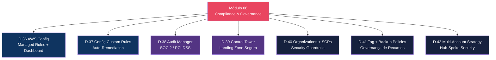
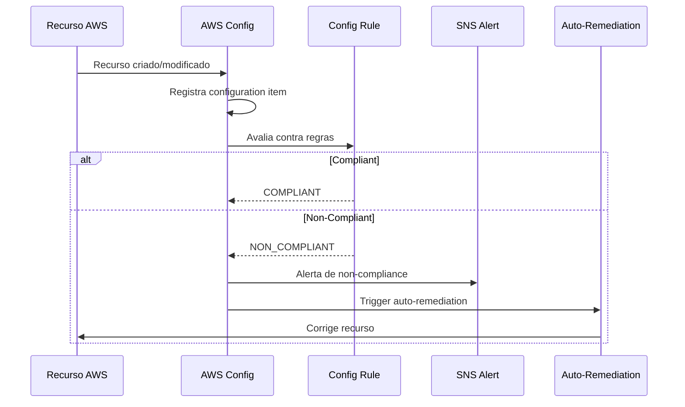
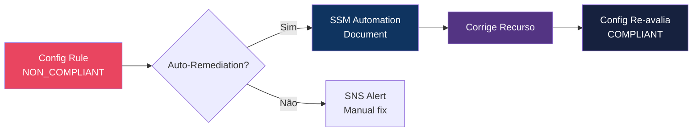
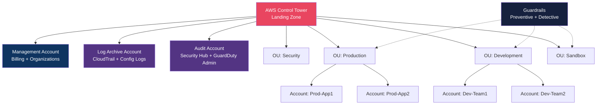
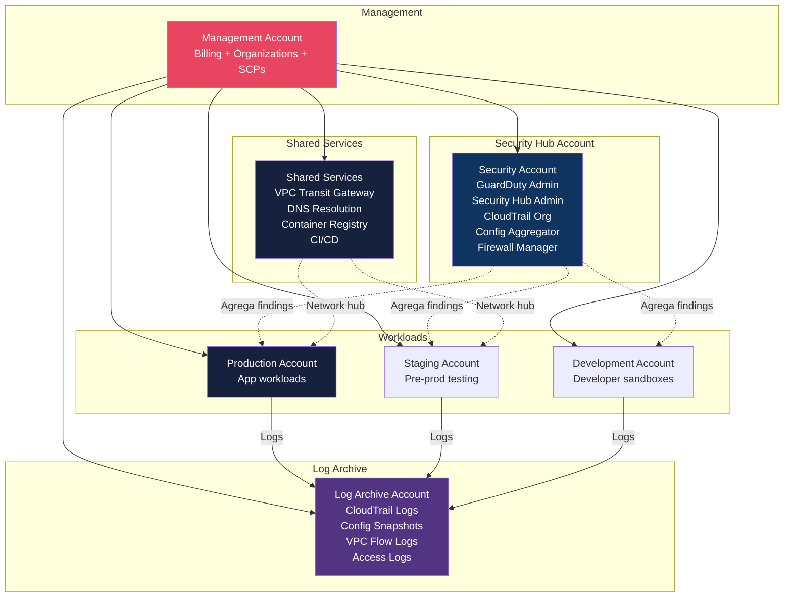

# Módulo 06 — Compliance & Governance

> **Nível:** 300 (Advanced)
> **Tempo Total Estimado:** 12-16 horas de labs
> **Custo Estimado:** ~$5-10 (Config rules, Control Tower)
> **Objetivo do Módulo:** Dominar compliance contínua e governança organizacional na AWS — Config rules para conformidade automática, Audit Manager para frameworks regulatórios, Control Tower para landing zones seguras, Organizations com SCPs para guardrails e estratégia multi-account.

---

## Mapa do Módulo



---

## Desafio 36: AWS Config — Managed Rules e Compliance Dashboard

> **Level:** 300 | **Tempo:** 90 min | **Custo:** ~$2/mês

### Objetivo

Configurar **AWS Config** com managed rules para monitoramento contínuo de compliance, verificando automaticamente se todos os recursos seguem as políticas de segurança.

### Como Config Funciona



### Passo a Passo

```bash
# 1. Habilitar Config Recorder
aws configservice put-configuration-recorder \
  --configuration-recorder '{
    "name": "default",
    "roleARN": "arn:aws:iam::'$ACCOUNT_ID':role/aws-service-role/config.amazonaws.com/AWSServiceRoleForConfig",
    "recordingGroup": {
      "allSupported": true,
      "includeGlobalResourceTypes": true
    }
  }'

# 2. Configurar delivery channel (S3 para histórico)
aws configservice put-delivery-channel \
  --delivery-channel '{
    "name": "default",
    "s3BucketName": "config-compliance-'$ACCOUNT_ID'",
    "configSnapshotDeliveryProperties": {
      "deliveryFrequency": "TwentyFour_Hours"
    }
  }'

# 3. Iniciar recorder
aws configservice start-configuration-recorder --configuration-recorder-name default
```

### Managed Rules Essenciais para Segurança

```hcl
# ============================================
# CONFIG RULES — Security Baseline
# ============================================

# 1. Root account MFA habilitado
resource "aws_config_config_rule" "root_mfa" {
  name = "root-account-mfa-enabled"
  source {
    owner             = "AWS"
    source_identifier = "ROOT_ACCOUNT_MFA_ENABLED"
  }
}

# 2. IAM users com MFA
resource "aws_config_config_rule" "iam_user_mfa" {
  name = "iam-user-mfa-enabled"
  source {
    owner             = "AWS"
    source_identifier = "IAM_USER_MFA_ENABLED"
  }
}

# 3. Sem access keys na root
resource "aws_config_config_rule" "root_no_keys" {
  name = "iam-root-access-key-check"
  source {
    owner             = "AWS"
    source_identifier = "IAM_ROOT_ACCESS_KEY_CHECK"
  }
}

# 4. Access keys rotacionadas (90 dias)
resource "aws_config_config_rule" "key_rotation" {
  name = "access-keys-rotated"
  source {
    owner             = "AWS"
    source_identifier = "ACCESS_KEYS_ROTATED"
  }
  input_parameters = jsonencode({ maxAccessKeyAge = "90" })
}

# 5. S3 buckets não públicos
resource "aws_config_config_rule" "s3_no_public" {
  name = "s3-bucket-public-read-prohibited"
  source {
    owner             = "AWS"
    source_identifier = "S3_BUCKET_PUBLIC_READ_PROHIBITED"
  }
}

# 6. S3 encryption habilitada
resource "aws_config_config_rule" "s3_encrypted" {
  name = "s3-bucket-server-side-encryption-enabled"
  source {
    owner             = "AWS"
    source_identifier = "S3_BUCKET_SERVER_SIDE_ENCRYPTION_ENABLED"
  }
}

# 7. EBS volumes criptografados
resource "aws_config_config_rule" "ebs_encrypted" {
  name = "encrypted-volumes"
  source {
    owner             = "AWS"
    source_identifier = "ENCRYPTED_VOLUMES"
  }
}

# 8. RDS encryption
resource "aws_config_config_rule" "rds_encrypted" {
  name = "rds-storage-encrypted"
  source {
    owner             = "AWS"
    source_identifier = "RDS_STORAGE_ENCRYPTED"
  }
}

# 9. Security Groups sem 0.0.0.0/0 em SSH
resource "aws_config_config_rule" "sg_no_ssh_open" {
  name = "restricted-ssh"
  source {
    owner             = "AWS"
    source_identifier = "INCOMING_SSH_DISABLED"
  }
}

# 10. CloudTrail habilitado
resource "aws_config_config_rule" "cloudtrail_enabled" {
  name = "cloudtrail-enabled"
  source {
    owner             = "AWS"
    source_identifier = "CLOUD_TRAIL_ENABLED"
  }
}

# 11. GuardDuty habilitado
resource "aws_config_config_rule" "guardduty_enabled" {
  name = "guardduty-enabled-centralized"
  source {
    owner             = "AWS"
    source_identifier = "GUARDDUTY_ENABLED_CENTRALIZED"
  }
}

# 12. VPC Flow Logs habilitados
resource "aws_config_config_rule" "vpc_flow_logs" {
  name = "vpc-flow-logs-enabled"
  source {
    owner             = "AWS"
    source_identifier = "VPC_FLOW_LOGS_ENABLED"
  }
}

# 13. RDS não público
resource "aws_config_config_rule" "rds_no_public" {
  name = "rds-instance-public-access-check"
  source {
    owner             = "AWS"
    source_identifier = "RDS_INSTANCE_PUBLIC_ACCESS_CHECK"
  }
}

# 14. Lambda dentro de VPC
resource "aws_config_config_rule" "lambda_vpc" {
  name = "lambda-inside-vpc"
  source {
    owner             = "AWS"
    source_identifier = "LAMBDA_INSIDE_VPC"
  }
}

# 15. Tags obrigatórias
resource "aws_config_config_rule" "required_tags" {
  name = "required-tags"
  source {
    owner             = "AWS"
    source_identifier = "REQUIRED_TAGS"
  }
  input_parameters = jsonencode({
    tag1Key   = "Environment"
    tag2Key   = "Team"
    tag3Key   = "CostCenter"
  })
  scope {
    compliance_resource_types = [
      "AWS::EC2::Instance",
      "AWS::S3::Bucket",
      "AWS::RDS::DBInstance",
      "AWS::Lambda::Function"
    ]
  }
}
```

### Verificar Compliance

```bash
# Dashboard de compliance (resumo)
aws configservice get-compliance-summary-by-config-rule --output table

# Regras non-compliant
aws configservice describe-compliance-by-config-rule \
  --compliance-types NON_COMPLIANT \
  --query 'ComplianceByConfigRules[].{Rule:ConfigRuleName,Status:Compliance.ComplianceType}' \
  --output table

# Recursos non-compliant de uma regra específica
aws configservice get-compliance-details-by-config-rule \
  --config-rule-name "s3-bucket-public-read-prohibited" \
  --compliance-types NON_COMPLIANT \
  --query 'EvaluationResults[].{Resource:EvaluationResultIdentifier.EvaluationResultQualifier.ResourceId,Status:ComplianceType}' \
  --output table
```

### O Que Aprendemos

| Conceito | Detalhe |
|----------|---------|
| Config Recorder | Registra estado de TODOS os recursos AWS |
| Managed Rules | 300+ regras prontas pela AWS |
| Compliance | COMPLIANT / NON_COMPLIANT / NOT_APPLICABLE |
| Configuration Item | Snapshot do estado de um recurso em ponto no tempo |
| Delivery Channel | S3 para histórico + SNS para notificações |

> **💡 Expert Tip:** As 15 regras acima cobrem 80% das necessidades do CIS AWS Foundations Benchmark. Para compliance full, habilite o conformance pack `CIS-AWS-Foundations-Benchmark` que inclui 40+ regras. Config custa ~$0.003 por configuration item registrado — para uma conta com 500 recursos, ~$1.50/mês.

---

## Desafio 37: AWS Config — Custom Rules e Auto-Remediation

> **Level:** 300 | **Tempo:** 120 min | **Custo:** ~$2

### Objetivo

Criar **custom Config rules** com Lambda para cenários específicos da empresa, e configurar **auto-remediation** com SSM Automation para corrigir non-compliance automaticamente.

### Auto-Remediation



### Terraform — Auto-Remediation para S3 Público

```hcl
# Auto-remediation: Se S3 bucket é público → bloquear acesso público
resource "aws_config_remediation_configuration" "s3_block_public" {
  config_rule_name = aws_config_config_rule.s3_no_public.name
  target_type      = "SSM_DOCUMENT"
  target_id        = "AWS-DisableS3BucketPublicReadWrite"

  parameter {
    name         = "S3BucketName"
    resource_value = "RESOURCE_ID"
  }
  parameter {
    name         = "AutomationAssumeRole"
    static_value = aws_iam_role.config_remediation.arn
  }

  automatic                  = true
  maximum_automatic_attempts = 3
  retry_attempt_seconds      = 60
}

# Auto-remediation: Se SG tem SSH aberto → remover regra
resource "aws_config_remediation_configuration" "sg_remove_ssh" {
  config_rule_name = aws_config_config_rule.sg_no_ssh_open.name
  target_type      = "SSM_DOCUMENT"
  target_id        = "AWS-DisablePublicAccessForSecurityGroup"

  parameter {
    name         = "GroupId"
    resource_value = "RESOURCE_ID"
  }
  parameter {
    name         = "AutomationAssumeRole"
    static_value = aws_iam_role.config_remediation.arn
  }

  automatic                  = true
  maximum_automatic_attempts = 3
  retry_attempt_seconds      = 60
}

# Auto-remediation: Se EBS não criptografado → notificar (não pode criptografar in-place)
resource "aws_config_remediation_configuration" "ebs_notify" {
  config_rule_name = aws_config_config_rule.ebs_encrypted.name
  target_type      = "SSM_DOCUMENT"
  target_id        = "AWS-PublishSNSNotification"

  parameter {
    name         = "TopicArn"
    static_value = aws_sns_topic.security_alerts.arn
  }
  parameter {
    name         = "Message"
    static_value = "NON-COMPLIANT: EBS volume não criptografado detectado"
  }

  automatic                  = true
  maximum_automatic_attempts = 1
  retry_attempt_seconds      = 60
}

# IAM Role para remediação
resource "aws_iam_role" "config_remediation" {
  name = "ConfigAutoRemediation"
  assume_role_policy = jsonencode({
    Version = "2012-10-17"
    Statement = [{
      Effect    = "Allow"
      Principal = { Service = "ssm.amazonaws.com" }
      Action    = "sts:AssumeRole"
    }]
  })
}

resource "aws_iam_role_policy_attachment" "config_remediation" {
  role       = aws_iam_role.config_remediation.name
  policy_arn = "arn:aws:iam::aws:policy/service-role/AmazonSSMAutomationRole"
}
```

### Custom Rule: Verificar se EC2 Tem IMDSv2

```python
"""config-rule-imdsv2 — Verifica se EC2 usa IMDSv2 (mais seguro que v1)."""
import boto3
import json

config = boto3.client('config')
ec2 = boto3.client('ec2')

def handler(event, context):
    invoking_event = json.loads(event['invokingEvent'])
    configuration_item = invoking_event['configurationItem']

    instance_id = configuration_item['resourceId']

    # Verificar IMDS version
    response = ec2.describe_instances(InstanceIds=[instance_id])
    instance = response['Reservations'][0]['Instances'][0]
    metadata_options = instance.get('MetadataOptions', {})
    http_tokens = metadata_options.get('HttpTokens', 'optional')

    if http_tokens == 'required':
        compliance = 'COMPLIANT'
        annotation = 'IMDSv2 enforced'
    else:
        compliance = 'NON_COMPLIANT'
        annotation = 'IMDSv1 still allowed - enforce HttpTokens=required'

    config.put_evaluations(
        Evaluations=[{
            'ComplianceResourceType': configuration_item['resourceType'],
            'ComplianceResourceId': instance_id,
            'ComplianceType': compliance,
            'Annotation': annotation,
            'OrderingTimestamp': configuration_item['configurationItemCaptureTime']
        }],
        ResultToken=event['resultToken']
    )
```

### O Que Aprendemos

| Conceito | Detalhe |
|----------|---------|
| Auto-remediation | Config detecta → SSM Automation corrige automaticamente |
| SSM Documents | AWS mantém 200+ documentos prontos para remediação |
| Custom rules | Lambda avalia compliance para cenários específicos |
| IMDSv2 | Versão segura do Instance Metadata Service (bloqueia SSRF) |
| Retry | Até 3 tentativas com intervalo configurável |

> **💡 Expert Tip:** Habilite auto-remediation APENAS para ações seguras e idempotentes — bloquear S3 público, remover SSH aberto. Para ações destrutivas ou irreversíveis, use notificação (SNS) e correção manual. A regra de ouro: se reverter a correção é trivial, automatize; se pode causar downtime, notifique.

---

## Desafio 38: Audit Manager — SOC 2 e PCI DSS Assessment

> **Level:** 300 | **Tempo:** 90 min | **Custo:** ~$1-3

### Objetivo

Usar **AWS Audit Manager** para avaliar compliance contra frameworks regulatórios (SOC 2, PCI DSS, HIPAA, ISO 27001) com coleta automática de evidências.

### Frameworks Suportados

```
┌──────────────────────────────────────────────────────────────────┐
│              Audit Manager — Frameworks Disponíveis               │
│                                                                   │
│  AWS Nativo:                                                     │
│  ├── AWS Audit Manager Sample Framework                          │
│  ├── AWS Control Tower Guardrails                                │
│  ├── AWS Foundational Security Best Practices                    │
│  └── AWS License Manager                                         │
│                                                                   │
│  Compliance:                                                     │
│  ├── SOC 2 (Service Organization Control)                        │
│  ├── PCI DSS v3.2.1 (Payment Card Industry)                     │
│  ├── HIPAA (Health Insurance Portability)                        │
│  ├── GDPR (General Data Protection Regulation)                   │
│  ├── ISO 27001:2013                                              │
│  ├── NIST 800-53 Rev 5                                           │
│  ├── NIST Cybersecurity Framework v1.1                           │
│  ├── CIS AWS Foundations Benchmark v1.4                          │
│  ├── FedRAMP Moderate                                            │
│  └── GxP (Good Practice for pharma/medical)                     │
│                                                                   │
│  Custom: crie seu próprio framework                              │
└──────────────────────────────────────────────────────────────────┘
```

```bash
# 1. Habilitar Audit Manager
aws auditmanager register-account

# 2. Criar assessment (SOC 2)
aws auditmanager create-assessment \
  --name "SOC2-Assessment-$(date +%Y)" \
  --framework-id "$(aws auditmanager list-assessment-frameworks \
    --framework-type Standard \
    --query 'frameworkMetadataList[?name==`SOC 2`].id' --output text)" \
  --assessment-reports-destination '{
    "destinationType": "S3",
    "destination": "s3://audit-reports-'$ACCOUNT_ID'"
  }' \
  --roles '[{"roleType":"PROCESS_OWNER","roleArn":"arn:aws:iam::'$ACCOUNT_ID':role/AuditManager"}]' \
  --scope '{
    "awsAccounts": [{"id":"'$ACCOUNT_ID'"}],
    "awsServices": [
      {"serviceName":"iam"},{"serviceName":"s3"},
      {"serviceName":"ec2"},{"serviceName":"rds"},
      {"serviceName":"cloudtrail"},{"serviceName":"config"},
      {"serviceName":"guardduty"},{"serviceName":"kms"}
    ]
  }'

# 3. Ver controles e evidências
aws auditmanager get-assessment \
  --assessment-id "ASSESSMENT_ID" \
  --query 'assessment.metadata.{Name:name,Status:status,Created:creationTime}'
```

### O Que Aprendemos

| Conceito | Detalhe |
|----------|---------|
| Audit Manager | Coleta automática de evidências para frameworks de compliance |
| Assessment | Avaliação contínua contra um framework específico |
| Controls | Controles individuais dentro do framework (ex: "Encryption at rest") |
| Evidence | Evidências coletadas automaticamente (Config snapshots, CloudTrail) |
| Reports | Relatórios PDF para auditores externos |

> **💡 Expert Tip:** Inicie o assessment 6 meses ANTES da auditoria. Audit Manager coleta evidências ao longo do tempo — quanto mais histórico, mais forte a evidência. Para SOC 2 Type II, o auditor quer ver 6-12 meses de compliance contínua, não um snapshot de um dia.

---

## Desafio 39: Control Tower — Landing Zone Segura

> **Level:** 300 | **Tempo:** 120 min | **Custo:** ~$0 (serviços subjacentes têm custo)

### Objetivo

Implementar **AWS Control Tower** para criar uma landing zone segura com guardrails, account factory e baseline de segurança.

### Arquitetura Control Tower



### Guardrails Essenciais

| Guardrail | Tipo | O Que Faz |
|-----------|------|-----------|
| Disallow public S3 buckets | Preventive (SCP) | Bloqueia criação de buckets públicos |
| Disallow root access keys | Preventive (SCP) | Bloqueia criação de keys na root |
| Detect MFA not enabled | Detective (Config) | Alerta users sem MFA |
| Detect public RDS | Detective (Config) | Alerta RDS com acesso público |
| Disallow changes to CloudTrail | Preventive (SCP) | Ninguém pode desabilitar CloudTrail |
| Disallow changes to Config | Preventive (SCP) | Ninguém pode desabilitar Config |
| Detect unencrypted EBS | Detective (Config) | Alerta volumes sem encryption |
| Disallow internet access | Preventive (SCP) | Bloqueia IGW em OUs específicas |

### O Que Aprendemos

| Conceito | Detalhe |
|----------|---------|
| Landing Zone | Ambiente multi-account com baseline de segurança |
| Account Factory | Criação padronizada de novas contas AWS |
| Guardrails Preventive | SCPs que bloqueiam ações antes de acontecer |
| Guardrails Detective | Config rules que detectam non-compliance |
| Log Archive | Conta centralizada para TODOS os logs (imutável) |
| Audit Account | Conta dedicada para ferramentas de segurança |

> **💡 Expert Tip:** Control Tower é o ponto de partida para QUALQUER organização com 3+ contas AWS. Sem ele, cada conta é uma ilha — sem padronização, sem guardrails, sem visibilidade. Com Control Tower, uma nova conta já nasce com CloudTrail, Config, guardrails e baseline de segurança. O investimento de 1 dia para configurar evita meses de remediação depois.

---

## Desafio 40: Organizations — SCPs para Security Guardrails

> **Level:** 300 | **Tempo:** 90 min | **Custo:** $0

### Objetivo

Criar **Service Control Policies (SCPs)** que funcionam como guardrails preventivos — bloqueando ações perigosas ANTES que aconteçam, em toda a organização.

### SCPs Essenciais

```hcl
# SCP 1: Deny root account usage (exceto billing)
resource "aws_organizations_policy" "deny_root" {
  name = "DenyRootAccountUsage"
  type = "SERVICE_CONTROL_POLICY"
  content = jsonencode({
    Version = "2012-10-17"
    Statement = [{
      Sid       = "DenyRootActions"
      Effect    = "Deny"
      Action    = "*"
      Resource  = "*"
      Condition = {
        StringLike = { "aws:PrincipalArn" = "arn:aws:iam::*:root" }
      }
    }]
  })
}

# SCP 2: Deny leaving organization
resource "aws_organizations_policy" "deny_leave_org" {
  name = "DenyLeaveOrganization"
  type = "SERVICE_CONTROL_POLICY"
  content = jsonencode({
    Version = "2012-10-17"
    Statement = [{
      Effect   = "Deny"
      Action   = "organizations:LeaveOrganization"
      Resource = "*"
    }]
  })
}

# SCP 3: Deny disabling security services
resource "aws_organizations_policy" "deny_disable_security" {
  name = "DenyDisableSecurityServices"
  type = "SERVICE_CONTROL_POLICY"
  content = jsonencode({
    Version = "2012-10-17"
    Statement = [
      {
        Sid    = "DenyDisableCloudTrail"
        Effect = "Deny"
        Action = ["cloudtrail:StopLogging", "cloudtrail:DeleteTrail"]
        Resource = "*"
      },
      {
        Sid    = "DenyDisableConfig"
        Effect = "Deny"
        Action = ["config:StopConfigurationRecorder", "config:DeleteConfigurationRecorder"]
        Resource = "*"
      },
      {
        Sid    = "DenyDisableGuardDuty"
        Effect = "Deny"
        Action = ["guardduty:DeleteDetector", "guardduty:DisassociateFromMasterAccount"]
        Resource = "*"
      },
      {
        Sid    = "DenyDisableSecurityHub"
        Effect = "Deny"
        Action = ["securityhub:DisableSecurityHub"]
        Resource = "*"
      }
    ]
  })
}

# SCP 4: Restrict regions (apenas regiões permitidas)
resource "aws_organizations_policy" "restrict_regions" {
  name = "RestrictToAllowedRegions"
  type = "SERVICE_CONTROL_POLICY"
  content = jsonencode({
    Version = "2012-10-17"
    Statement = [{
      Sid       = "DenyOtherRegions"
      Effect    = "Deny"
      NotAction = [
        "iam:*", "sts:*", "organizations:*",
        "support:*", "budgets:*",
        "cloudfront:*", "route53:*", "wafv2:*",
        "s3:GetBucketLocation", "s3:ListAllMyBuckets"
      ]
      Resource = "*"
      Condition = {
        StringNotEquals = {
          "aws:RequestedRegion" = ["us-east-1", "sa-east-1", "eu-west-1"]
        }
      }
    }]
  })
}

# SCP 5: Deny unencrypted S3 uploads
resource "aws_organizations_policy" "deny_unencrypted_s3" {
  name = "DenyUnencryptedS3Uploads"
  type = "SERVICE_CONTROL_POLICY"
  content = jsonencode({
    Version = "2012-10-17"
    Statement = [{
      Sid       = "DenyUnencryptedPutObject"
      Effect    = "Deny"
      Action    = "s3:PutObject"
      Resource  = "*"
      Condition = {
        StringNotEquals = {
          "s3:x-amz-server-side-encryption" = ["aws:kms", "AES256"]
        }
      }
    }]
  })
}

# Anexar SCPs às OUs
resource "aws_organizations_policy_attachment" "prod_security" {
  policy_id = aws_organizations_policy.deny_disable_security.id
  target_id = "ou-xxxx-prod"
}

resource "aws_organizations_policy_attachment" "all_regions" {
  policy_id = aws_organizations_policy.restrict_regions.id
  target_id = data.aws_organizations_organization.main.roots[0].id
}
```

### O Que Aprendemos

| Conceito | Detalhe |
|----------|---------|
| SCPs | Guardrails preventivos — bloqueiam ANTES de acontecer |
| Herança | SCPs são herdadas da OU pai para filhas |
| Management account | NUNCA é afetada por SCPs (design by AWS) |
| Region restriction | Bloqueiar uso em regiões não autorizadas |
| Service protection | Impedir desabilitação de CloudTrail, Config, GuardDuty |

> **💡 Expert Tip:** SCPs NÃO concedem permissões — apenas restringem. Um SCP é um teto: mesmo com IAM AdminAccess, se o SCP nega, está negado. A exceção é a management account — ela NUNCA é afetada por SCPs. Por isso, NUNCA rode workloads na management account.

---

## Desafio 41: Tag Policies e Backup Policies

> **Level:** 300 | **Tempo:** 60 min | **Custo:** $0

### Objetivo

Implementar **Tag Policies** para padronização de tags e **Backup Policies** para proteção automática de dados em toda a organização.

```hcl
# Tag Policy: padronizar valores de tags
resource "aws_organizations_policy" "tag_policy" {
  name = "StandardTags"
  type = "TAG_POLICY"
  content = jsonencode({
    tags = {
      Environment = {
        tag_key = { "@@assign" = "Environment" }
        tag_value = {
          "@@assign" = ["production", "staging", "development", "sandbox"]
        }
        enforced_for = {
          "@@assign" = [
            "ec2:instance", "s3:bucket", "rds:db",
            "lambda:function", "elasticloadbalancing:loadbalancer"
          ]
        }
      }
      Team = {
        tag_key = { "@@assign" = "Team" }
      }
      CostCenter = {
        tag_key = { "@@assign" = "CostCenter" }
        tag_value = {
          "@@assign" = ["CC-001", "CC-002", "CC-003", "CC-SHARED"]
        }
      }
    }
  })
}

# Backup Policy: backup diário automático
resource "aws_organizations_policy" "backup_policy" {
  name = "DailyBackupPolicy"
  type = "BACKUP_POLICY"
  content = jsonencode({
    plans = {
      DailyBackup = {
        rules = {
          DailyRule = {
            schedule_expression  = { "@@assign" = "cron(0 3 * * ? *)" }
            start_backup_window_minutes = { "@@assign" = "60" }
            complete_backup_window_minutes = { "@@assign" = "180" }
            lifecycle = {
              delete_after_days = { "@@assign" = "35" }
              move_to_cold_storage_after_days = { "@@assign" = "7" }
            }
            target_backup_vault_name = { "@@assign" = "Default" }
            copy_actions = {}
          }
        }
        selections = {
          tags = {
            BackupSelection = {
              iam_role_arn = { "@@assign" = "arn:aws:iam::$account:role/aws-service-role/backup.amazonaws.com/AWSServiceRoleForBackup" }
              tag_key      = { "@@assign" = "Backup" }
              tag_value    = { "@@assign" = ["daily", "true"] }
            }
          }
        }
      }
    }
  })
}
```

### O Que Aprendemos

| Conceito | Detalhe |
|----------|---------|
| Tag Policies | Padronizar nomes e valores de tags em toda a org |
| Backup Policies | Backup automático centralizado via AWS Backup |
| enforced_for | Quais recursos DEVEM seguir a tag policy |
| @@assign | Operador de atribuição em policies da Organization |

---

## Desafio 42: Multi-Account Strategy — Hub-Spoke Security

> **Level:** 300 | **Tempo:** 90 min | **Custo:** $0

### Objetivo

Desenhar e implementar uma **estratégia multi-account** com segurança centralizada no modelo Hub-Spoke.

### Arquitetura Multi-Account



### Princípios

| Princípio | Implementação |
|-----------|--------------|
| **Separação de responsabilidades** | Uma conta por ambiente (prod, staging, dev) |
| **Centralização de segurança** | Conta Security agrega GuardDuty, Security Hub, Config |
| **Centralização de logs** | Conta Log Archive com S3 Object Lock |
| **Blast radius limitado** | Comprometimento de dev não afeta prod |
| **Least privilege cross-account** | Roles com MFA e External ID para assumir |
| **Guardrails preventivos** | SCPs bloqueiam antes de acontecer |
| **Network segmentation** | Transit Gateway com inspection VPC |

### O Que Aprendemos

| Conceito | Detalhe |
|----------|---------|
| Hub-Spoke | Conta central de segurança agrega todas as outras |
| Delegated Admin | Security Hub, GuardDuty, Firewall Manager delegam admin |
| Log Archive | Conta dedicada, Object Lock, ninguém pode deletar logs |
| Account vending | Control Tower Account Factory para criar contas padronizadas |
| Cross-account roles | Roles com MFA + External ID para acesso cross-account |

> **💡 Expert Tip:** A pergunta mais comum é "quantas contas preciso?". Mínimo viável: 4 (Management, Security/Log, Production, Development). Ideal: 6+ (Management, Security, Log Archive, Shared Services, Production, Staging, Development). Cada conta adicional custa $0 — o custo é operacional. Com Control Tower + Account Factory, criar uma nova conta leva 15 minutos e já vem com toda a baseline de segurança.

---

## Resumo do Módulo 06

```
┌──────────────────────────────────────────────────────────────┐
│               MÓDULO 06 — CONQUISTAS                          │
│                                                               │
│  ✅ Desafio 36: AWS Config Managed Rules                     │
│     15 regras essenciais, compliance dashboard               │
│                                                               │
│  ✅ Desafio 37: Config Custom Rules + Auto-Remediation       │
│     Lambda rules, SSM Automation, IMDSv2 check              │
│                                                               │
│  ✅ Desafio 38: Audit Manager                                │
│     SOC 2, PCI DSS, frameworks regulatórios                 │
│                                                               │
│  ✅ Desafio 39: Control Tower                                │
│     Landing zone, guardrails, account factory               │
│                                                               │
│  ✅ Desafio 40: SCPs Security Guardrails                     │
│     5 SCPs essenciais, region restriction                   │
│                                                               │
│  ✅ Desafio 41: Tag + Backup Policies                        │
│     Padronização de tags, backup automático                  │
│                                                               │
│  ✅ Desafio 42: Multi-Account Strategy                       │
│     Hub-spoke security, 7 princípios                        │
│                                                               │
│  Próximo: Módulo 07 — Network Security                       │
│  (VPC, Flow Logs, Transit Gateway, DNS Firewall)             │
└──────────────────────────────────────────────────────────────┘
```

**Próximo:** [Módulo 07 — Network Security →](modulo-07-network-security.md)
