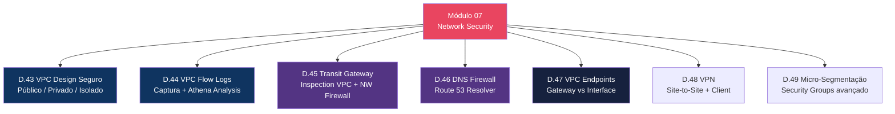
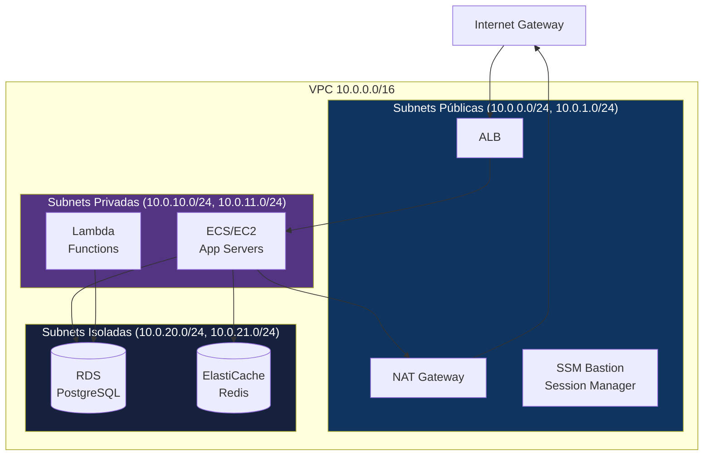
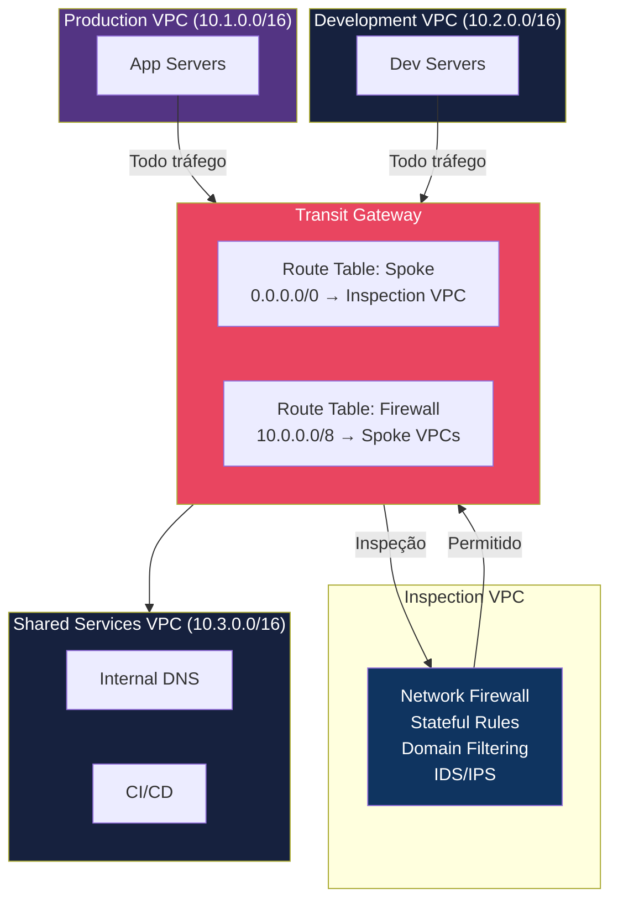
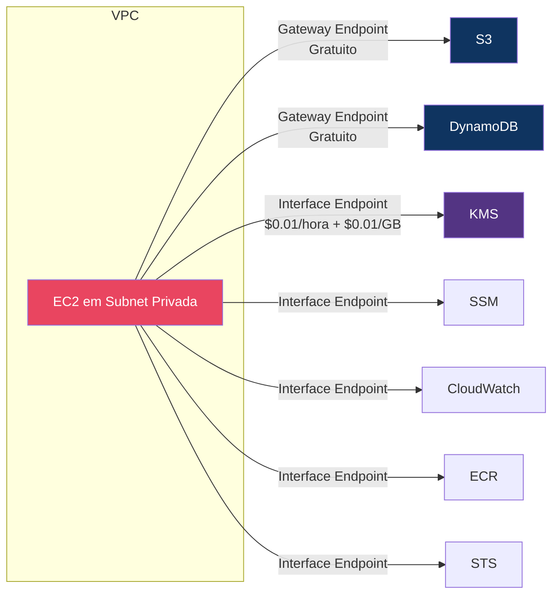
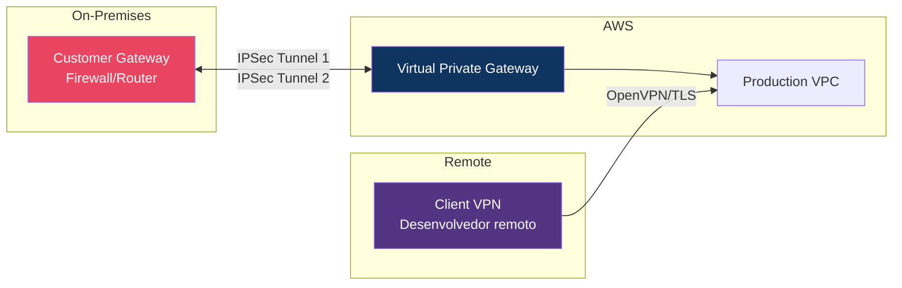
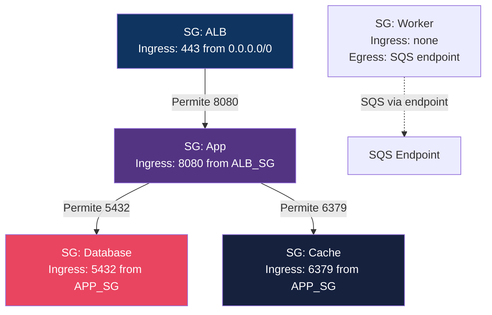

# Módulo 07 — Network Security

> **Nível:** 300 (Advanced)
> **Tempo Total Estimado:** 12-16 horas de labs
> **Custo Estimado:** ~$10-25 (Transit Gateway, Network Firewall, VPN)
> **Objetivo do Módulo:** Dominar segurança de rede na AWS — design de VPC seguro com subnets isoladas, análise de VPC Flow Logs com Athena, Transit Gateway com inspection VPC, DNS Firewall para bloquear domínios maliciosos, VPC Endpoints para tráfego privado e segmentação de rede.

---

## Mapa do Módulo



---

## Desafio 43: VPC Design Seguro — Público, Privado e Isolado

> **Level:** 300 | **Tempo:** 90 min | **Custo:** ~$1 (NAT Gateway)

### Objetivo

Desenhar e implementar uma **VPC de produção** com 3 camadas de subnets (pública, privada, isolada) seguindo AWS Well-Architected best practices.

### Arquitetura



### Princípios de Design

```
┌──────────────────────────────────────────────────────────────────┐
│              VPC Security Design Principles                       │
│                                                                   │
│  Subnet Pública (10.0.0.0/24, 10.0.1.0/24):                    │
│  ├── Route table: 0.0.0.0/0 → IGW                               │
│  ├── Recursos: ALB, NAT Gateway, Bastion (se necessário)        │
│  ├── NUNCA: EC2 app servers, databases, Lambda                   │
│  └── NACL: Deny SSH de 0.0.0.0/0 (forçar SSM)                  │
│                                                                   │
│  Subnet Privada (10.0.10.0/24, 10.0.11.0/24):                   │
│  ├── Route table: 0.0.0.0/0 → NAT Gateway                       │
│  ├── Recursos: EC2, ECS, Lambda, app servers                    │
│  ├── Acesso internet: SOMENTE outbound via NAT                  │
│  └── SG: aceita APENAS do ALB SG (não CIDR)                    │
│                                                                   │
│  Subnet Isolada (10.0.20.0/24, 10.0.21.0/24):                   │
│  ├── Route table: SEM rota para 0.0.0.0/0                       │
│  ├── Recursos: RDS, ElastiCache, DynamoDB (via VPC Endpoint)    │
│  ├── ZERO acesso à internet (nem outbound)                      │
│  └── SG: aceita APENAS do App SG                                │
└──────────────────────────────────────────────────────────────────┘
```

### Terraform

```hcl
# ============================================
# VPC SEGURA — 3 CAMADAS
# ============================================

resource "aws_vpc" "main" {
  cidr_block           = "10.0.0.0/16"
  enable_dns_support   = true
  enable_dns_hostnames = true

  tags = { Name = "production-vpc" }
}

# === SUBNETS PÚBLICAS ===
resource "aws_subnet" "public" {
  count                   = 2
  vpc_id                  = aws_vpc.main.id
  cidr_block              = "10.0.${count.index}.0/24"
  availability_zone       = data.aws_availability_zones.available.names[count.index]
  map_public_ip_on_launch = false  # NÃO atribuir IP público automaticamente

  tags = { Name = "public-${count.index}", Tier = "public" }
}

# === SUBNETS PRIVADAS ===
resource "aws_subnet" "private" {
  count             = 2
  vpc_id            = aws_vpc.main.id
  cidr_block        = "10.0.${count.index + 10}.0/24"
  availability_zone = data.aws_availability_zones.available.names[count.index]

  tags = { Name = "private-${count.index}", Tier = "private" }
}

# === SUBNETS ISOLADAS (sem internet) ===
resource "aws_subnet" "isolated" {
  count             = 2
  vpc_id            = aws_vpc.main.id
  cidr_block        = "10.0.${count.index + 20}.0/24"
  availability_zone = data.aws_availability_zones.available.names[count.index]

  tags = { Name = "isolated-${count.index}", Tier = "isolated" }
}

# === ROUTING ===

# Internet Gateway
resource "aws_internet_gateway" "main" {
  vpc_id = aws_vpc.main.id
}

# NAT Gateway (para subnets privadas)
resource "aws_eip" "nat" { domain = "vpc" }

resource "aws_nat_gateway" "main" {
  allocation_id = aws_eip.nat.id
  subnet_id     = aws_subnet.public[0].id
}

# Route table: pública
resource "aws_route_table" "public" {
  vpc_id = aws_vpc.main.id
  route {
    cidr_block = "0.0.0.0/0"
    gateway_id = aws_internet_gateway.main.id
  }
  tags = { Name = "public-rt" }
}

# Route table: privada (via NAT)
resource "aws_route_table" "private" {
  vpc_id = aws_vpc.main.id
  route {
    cidr_block     = "0.0.0.0/0"
    nat_gateway_id = aws_nat_gateway.main.id
  }
  tags = { Name = "private-rt" }
}

# Route table: isolada (SEM rota para internet)
resource "aws_route_table" "isolated" {
  vpc_id = aws_vpc.main.id
  # Nenhuma rota para 0.0.0.0/0
  tags = { Name = "isolated-rt" }
}

# Associações
resource "aws_route_table_association" "public" {
  count          = 2
  subnet_id      = aws_subnet.public[count.index].id
  route_table_id = aws_route_table.public.id
}

resource "aws_route_table_association" "private" {
  count          = 2
  subnet_id      = aws_subnet.private[count.index].id
  route_table_id = aws_route_table.private.id
}

resource "aws_route_table_association" "isolated" {
  count          = 2
  subnet_id      = aws_subnet.isolated[count.index].id
  route_table_id = aws_route_table.isolated.id
}

# VPC Flow Logs
resource "aws_flow_log" "main" {
  vpc_id          = aws_vpc.main.id
  traffic_type    = "ALL"
  iam_role_arn    = aws_iam_role.flow_logs.arn
  log_destination = aws_cloudwatch_log_group.flow_logs.arn

  tags = { Name = "vpc-flow-logs" }
}

resource "aws_cloudwatch_log_group" "flow_logs" {
  name              = "/aws/vpc/flow-logs"
  retention_in_days = 90
}
```

### O Que Aprendemos

| Conceito | Detalhe |
|----------|---------|
| 3 camadas | Pública (ALB/NAT), Privada (app), Isolada (DB) |
| map_public_ip = false | Mesmo em subnet pública, não atribuir IP auto |
| Isolated subnet | Sem rota 0.0.0.0/0 — zero internet, nem outbound |
| NAT Gateway | Permite saída (updates, APIs) mas bloqueia entrada |
| VPC Flow Logs | Registra TODO o tráfego da VPC |

> **💡 Expert Tip:** O erro mais comum: colocar RDS em subnet privada (com NAT) em vez de isolada (sem internet). Se o database não precisa de internet, não dê internet. Subnet isolada com VPC Endpoints para AWS services (S3, DynamoDB, KMS) é tudo que a maioria dos databases precisa.

---

## Desafio 44: VPC Flow Logs — Captura e Análise com Athena

> **Level:** 300 | **Tempo:** 90 min | **Custo:** ~$1

### Objetivo

Configurar **VPC Flow Logs** com destino S3 e analisar padrões de tráfego com Athena para detecção de anomalias.

### Queries de Segurança

```sql
-- 1. Top talkers (quem está gerando mais tráfego)
SELECT srcaddr, dstaddr, SUM(bytes) as total_bytes, COUNT(*) as flows
FROM vpc_flow_logs
WHERE start >= current_timestamp - interval '1' hour
GROUP BY srcaddr, dstaddr
ORDER BY total_bytes DESC
LIMIT 20;

-- 2. Conexões rejeitadas (possível scan/ataque)
SELECT srcaddr, dstaddr, dstport, protocol, COUNT(*) as rejected_count
FROM vpc_flow_logs
WHERE action = 'REJECT'
  AND start >= current_timestamp - interval '1' hour
GROUP BY srcaddr, dstaddr, dstport, protocol
ORDER BY rejected_count DESC
LIMIT 50;

-- 3. IPs externos acessando portas sensíveis
SELECT srcaddr, dstaddr, dstport, protocol, COUNT(*) as attempts
FROM vpc_flow_logs
WHERE dstport IN (22, 3389, 3306, 5432, 1433, 27017, 6379)
  AND action = 'ACCEPT'
  AND srcaddr NOT LIKE '10.%'
  AND srcaddr NOT LIKE '172.16.%'
  AND start >= current_timestamp - interval '24' hour
GROUP BY srcaddr, dstaddr, dstport, protocol
ORDER BY attempts DESC;

-- 4. Tráfego para IPs conhecidos de C&C / crypto mining
SELECT srcaddr, dstaddr, dstport, bytes, start
FROM vpc_flow_logs
WHERE (dstport IN (8333, 8332, 30303, 4444, 3333)  -- crypto mining ports
       OR dstaddr IN ('pool.minexmr.com'))  -- IPs de mining pools
  AND start >= current_timestamp - interval '24' hour;

-- 5. Exfiltração de dados (alto volume outbound)
SELECT srcaddr, SUM(bytes) as total_bytes_out
FROM vpc_flow_logs
WHERE srcaddr LIKE '10.0.%'
  AND dstaddr NOT LIKE '10.0.%'
  AND start >= current_timestamp - interval '1' hour
GROUP BY srcaddr
HAVING SUM(bytes) > 1073741824  -- > 1GB
ORDER BY total_bytes_out DESC;

-- 6. DNS tunneling (porta 53 com muito tráfego)
SELECT srcaddr, dstaddr, SUM(bytes) as dns_bytes, COUNT(*) as dns_queries
FROM vpc_flow_logs
WHERE dstport = 53
  AND start >= current_timestamp - interval '1' hour
GROUP BY srcaddr, dstaddr
HAVING SUM(bytes) > 10485760  -- > 10MB via DNS = suspeito
ORDER BY dns_bytes DESC;
```

### O Que Aprendemos

| Conceito | Detalhe |
|----------|---------|
| Flow Logs | Captura metadata de CADA fluxo de rede (não payload) |
| ACCEPT/REJECT | Se o tráfego foi permitido ou bloqueado |
| Athena analysis | SQL para detectar anomalias, scans, exfiltração |
| Destino S3 | Mais barato que CloudWatch Logs para alto volume |
| Partition projection | Athena com auto-partitioning por data |

> **💡 Expert Tip:** Flow Logs NÃO capturam conteúdo — apenas metadata (src, dst, port, bytes, action). Para inspeção de conteúdo, use Network Firewall ou VPC Traffic Mirroring. O custo de Flow Logs é ~$0.50/GB ingerido. Para VPCs com alto tráfego, envie para S3 (não CloudWatch Logs) e use sampling — `max-aggregation-interval = 600` reduz volume em ~80%.

---

## Desafio 45: Transit Gateway — Inspection VPC com Network Firewall

> **Level:** 300 | **Tempo:** 120 min | **Custo:** ~$5-10

### Objetivo

Implementar **Transit Gateway** com uma VPC de inspeção centralizada que analisa todo o tráfego entre VPCs usando Network Firewall.

### Arquitetura



### O Que Aprendemos

| Conceito | Detalhe |
|----------|---------|
| Transit Gateway | Hub central que conecta múltiplas VPCs |
| Inspection VPC | VPC dedicada com Network Firewall para inspeção |
| Route tables | Spoke VPCs roteiam 0.0.0.0/0 via Inspection VPC |
| Custo | TGW: $0.05/hora + $0.02/GB. NF: $0.40/hora + $0.07/GB |

---

## Desafio 46: DNS Firewall — Route 53 Resolver

> **Level:** 300 | **Tempo:** 60 min | **Custo:** ~$1

### Objetivo

Usar **Route 53 Resolver DNS Firewall** para bloquear resolução de domínios maliciosos (C&C, phishing, malware, crypto mining).

```hcl
# DNS Firewall Rule Group
resource "aws_route53_resolver_firewall_rule_group" "security" {
  name = "security-dns-rules"
}

# Bloquear domínios de crypto mining
resource "aws_route53_resolver_firewall_domain_list" "crypto_mining" {
  name    = "crypto-mining-domains"
  domains = [
    "*.pool.minergate.com", "*.minexmr.com", "*.nanopool.org",
    "*.2miners.com", "*.ethermine.org", "*.f2pool.com",
    "*.coinhive.com", "*.coin-hive.com", "*.crypto-loot.com"
  ]
}

resource "aws_route53_resolver_firewall_rule" "block_crypto" {
  name                    = "block-crypto-mining"
  action                  = "BLOCK"
  block_response          = "NXDOMAIN"
  firewall_domain_list_id = aws_route53_resolver_firewall_domain_list.crypto_mining.id
  firewall_rule_group_id  = aws_route53_resolver_firewall_rule_group.security.id
  priority                = 100
}

# Usar AWS Managed Domain List (threat intelligence)
resource "aws_route53_resolver_firewall_rule" "block_malware" {
  name                    = "block-aws-managed-malware"
  action                  = "BLOCK"
  block_response          = "NXDOMAIN"
  firewall_domain_list_id = "rslvr-fdl-managed-malware-domains"
  firewall_rule_group_id  = aws_route53_resolver_firewall_rule_group.security.id
  priority                = 200
}

resource "aws_route53_resolver_firewall_rule" "block_botnet" {
  name                    = "block-aws-managed-botnet"
  action                  = "BLOCK"
  block_response          = "NXDOMAIN"
  firewall_domain_list_id = "rslvr-fdl-managed-botnet-domains"
  firewall_rule_group_id  = aws_route53_resolver_firewall_rule_group.security.id
  priority                = 300
}

# Associar à VPC
resource "aws_route53_resolver_firewall_rule_group_association" "main" {
  name                   = "production-vpc-dns-firewall"
  firewall_rule_group_id = aws_route53_resolver_firewall_rule_group.security.id
  vpc_id                 = aws_vpc.main.id
  priority               = 100
}
```

### O Que Aprendemos

| Conceito | Detalhe |
|----------|---------|
| DNS Firewall | Bloqueia resolução DNS de domínios maliciosos |
| AWS Managed Lists | Listas atualizadas pela AWS (malware, botnet, C&C) |
| NXDOMAIN | Resposta "domínio não existe" — bloqueia sem alertar o malware |
| Custo | ~$0.0005 por query processada (barato) |

> **💡 Expert Tip:** DNS Firewall é a defesa mais custo-efetiva contra malware e crypto mining. 90% dos malwares fazem DNS lookup para encontrar o C&C server. Se o DNS retorna NXDOMAIN, o malware não consegue se conectar — mesmo que esteja rodando na instância. É como cortar o telefone do sequestrador.

---

## Desafio 47: VPC Endpoints — Gateway vs Interface, PrivateLink

> **Level:** 300 | **Tempo:** 90 min | **Custo:** ~$1

### Objetivo

Implementar **VPC Endpoints** para que recursos em subnets privadas/isoladas acessem serviços AWS sem passar pela internet.

### Gateway vs Interface



### Terraform — Endpoints Essenciais

```hcl
# Gateway Endpoints (GRÁTIS)
resource "aws_vpc_endpoint" "s3" {
  vpc_id       = aws_vpc.main.id
  service_name = "com.amazonaws.${var.region}.s3"
  vpc_endpoint_type = "Gateway"
  route_table_ids = [
    aws_route_table.private.id,
    aws_route_table.isolated.id
  ]
}

resource "aws_vpc_endpoint" "dynamodb" {
  vpc_id       = aws_vpc.main.id
  service_name = "com.amazonaws.${var.region}.dynamodb"
  vpc_endpoint_type = "Gateway"
  route_table_ids = [
    aws_route_table.private.id,
    aws_route_table.isolated.id
  ]
}

# Interface Endpoints (essenciais para subnets isoladas)
locals {
  interface_endpoints = [
    "ssm", "ssmmessages", "ec2messages",  # SSM Session Manager
    "logs",                                 # CloudWatch Logs
    "monitoring",                           # CloudWatch Metrics
    "kms",                                  # KMS
    "sts",                                  # STS AssumeRole
    "ecr.api", "ecr.dkr",                 # ECR (container images)
    "secretsmanager",                       # Secrets Manager
  ]
}

resource "aws_vpc_endpoint" "interface" {
  for_each = toset(local.interface_endpoints)

  vpc_id              = aws_vpc.main.id
  service_name        = "com.amazonaws.${var.region}.${each.value}"
  vpc_endpoint_type   = "Interface"
  subnet_ids          = aws_subnet.private[*].id
  security_group_ids  = [aws_security_group.endpoints.id]
  private_dns_enabled = true
}

# SG para endpoints
resource "aws_security_group" "endpoints" {
  name_prefix = "vpc-endpoints-"
  vpc_id      = aws_vpc.main.id

  ingress {
    from_port   = 443
    to_port     = 443
    protocol    = "tcp"
    cidr_blocks = ["10.0.0.0/16"]
  }
}

# Endpoint Policy: restringir S3 endpoint a buckets específicos
resource "aws_vpc_endpoint_policy" "s3_restricted" {
  vpc_endpoint_id = aws_vpc_endpoint.s3.id
  policy = jsonencode({
    Version = "2012-10-17"
    Statement = [
      {
        Sid       = "AllowSpecificBuckets"
        Effect    = "Allow"
        Principal = "*"
        Action    = "s3:*"
        Resource  = [
          "arn:aws:s3:::empresa-app-data/*",
          "arn:aws:s3:::empresa-app-data",
          "arn:aws:s3:::empresa-logs/*",
          "arn:aws:s3:::empresa-logs"
        ]
      }
    ]
  })
}
```

### O Que Aprendemos

| Conceito | Detalhe |
|----------|---------|
| Gateway Endpoint | S3 e DynamoDB — GRÁTIS, route table based |
| Interface Endpoint | Outros serviços — ENI na VPC, $0.01/hora |
| Endpoint Policy | Restringir QUAIS recursos podem ser acessados |
| Private DNS | Resolve endpoint.amazonaws.com para IP privado |
| Subnets isoladas | Precisam de endpoints para acessar AWS services |

---

## Desafio 48: VPN Site-to-Site e Client VPN

> **Level:** 300 | **Tempo:** 90 min | **Custo:** ~$5

### Objetivo

Configurar **VPN Site-to-Site** para conexão on-premises e **Client VPN** para acesso remoto seguro.

### Arquitetura



### O Que Aprendemos

| Conceito | Detalhe |
|----------|---------|
| Site-to-Site VPN | 2 túneis IPSec para HA, ~1.25 Gbps |
| Client VPN | OpenVPN-based, autenticação via ACM + AD/SAML |
| Virtual Private Gateway | Endpoint AWS para VPN |
| Customer Gateway | Endpoint on-premises (firewall/router) |

---

## Desafio 49: Network Segmentation — Micro-Segmentação com SG

> **Level:** 300 | **Tempo:** 60 min | **Custo:** $0

### Objetivo

Implementar **micro-segmentação** usando Security Groups como base para zero-trust networking dentro da VPC.

### Padrão: SG References (não CIDRs)



```hcl
# Micro-segmentação: cada componente tem SG próprio
# Regra de ouro: referencie SGs, não CIDRs

resource "aws_security_group" "alb" {
  name_prefix = "alb-"
  vpc_id      = aws_vpc.main.id
  ingress {
    from_port   = 443
    to_port     = 443
    protocol    = "tcp"
    cidr_blocks = ["0.0.0.0/0"]  # Único com CIDR (internet-facing)
  }
  egress {
    from_port       = 8080
    to_port         = 8080
    protocol        = "tcp"
    security_groups = [aws_security_group.app.id]  # SG reference
  }
}

resource "aws_security_group" "app" {
  name_prefix = "app-"
  vpc_id      = aws_vpc.main.id
  ingress {
    from_port       = 8080
    to_port         = 8080
    protocol        = "tcp"
    security_groups = [aws_security_group.alb.id]  # Apenas do ALB
  }
  egress {
    from_port       = 5432
    to_port         = 5432
    protocol        = "tcp"
    security_groups = [aws_security_group.database.id]
  }
  egress {
    from_port       = 6379
    to_port         = 6379
    protocol        = "tcp"
    security_groups = [aws_security_group.cache.id]
  }
  egress {
    from_port       = 443
    to_port         = 443
    protocol        = "tcp"
    security_groups = [aws_security_group.endpoints.id]  # AWS services
  }
}

resource "aws_security_group" "database" {
  name_prefix = "db-"
  vpc_id      = aws_vpc.main.id
  ingress {
    from_port       = 5432
    to_port         = 5432
    protocol        = "tcp"
    security_groups = [aws_security_group.app.id]  # Apenas do App
  }
  # ZERO egress
}

resource "aws_security_group" "cache" {
  name_prefix = "cache-"
  vpc_id      = aws_vpc.main.id
  ingress {
    from_port       = 6379
    to_port         = 6379
    protocol        = "tcp"
    security_groups = [aws_security_group.app.id]  # Apenas do App
  }
  # ZERO egress
}
```

### O Que Aprendemos

| Conceito | Detalhe |
|----------|---------|
| SG references | Referenciar SGs em vez de CIDRs — mais seguro e dinâmico |
| Zero egress | Database e cache sem egress — não precisam de internet |
| Micro-segmentação | Cada componente com SG próprio, comunicação explícita |
| Blast radius | Se app é comprometida, não alcança outros apps (SG diferente) |

> **💡 Expert Tip:** A regra de ouro da micro-segmentação: se dois componentes não precisam se comunicar, eles NÃO devem poder se comunicar. Cada novo fluxo de rede deve ser uma decisão consciente adicionada ao Terraform, não um CIDR genérico que permite tudo na subnet.

---

## Resumo do Módulo 07

```
┌──────────────────────────────────────────────────────────────┐
│               MÓDULO 07 — CONQUISTAS                          │
│                                                               │
│  ✅ Desafio 43: VPC Design Seguro                            │
│     3 camadas (pública, privada, isolada), Flow Logs         │
│                                                               │
│  ✅ Desafio 44: VPC Flow Logs + Athena                       │
│     6 queries de segurança (scans, exfiltração, mining)      │
│                                                               │
│  ✅ Desafio 45: Transit Gateway + Inspection                 │
│     Inspeção centralizada com Network Firewall               │
│                                                               │
│  ✅ Desafio 46: DNS Firewall                                 │
│     Block malware, botnet, crypto mining via DNS             │
│                                                               │
│  ✅ Desafio 47: VPC Endpoints                                │
│     Gateway (S3/DDB) + Interface + Endpoint Policies         │
│                                                               │
│  ✅ Desafio 48: VPN Site-to-Site + Client                    │
│     IPSec tunnels + OpenVPN para acesso remoto               │
│                                                               │
│  ✅ Desafio 49: Micro-Segmentação                            │
│     SG references, zero egress, blast radius control         │
│                                                               │
│  Próximo: Módulo 08 — Application Security                   │
│  (Cognito, Verified Access, Container Security)              │
└──────────────────────────────────────────────────────────────┘
```

**Próximo:** [Módulo 08 — Application Security →](modulo-08-application-security.md)
