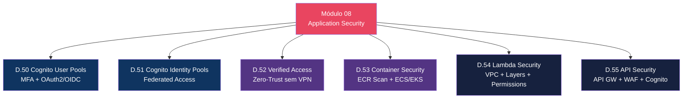
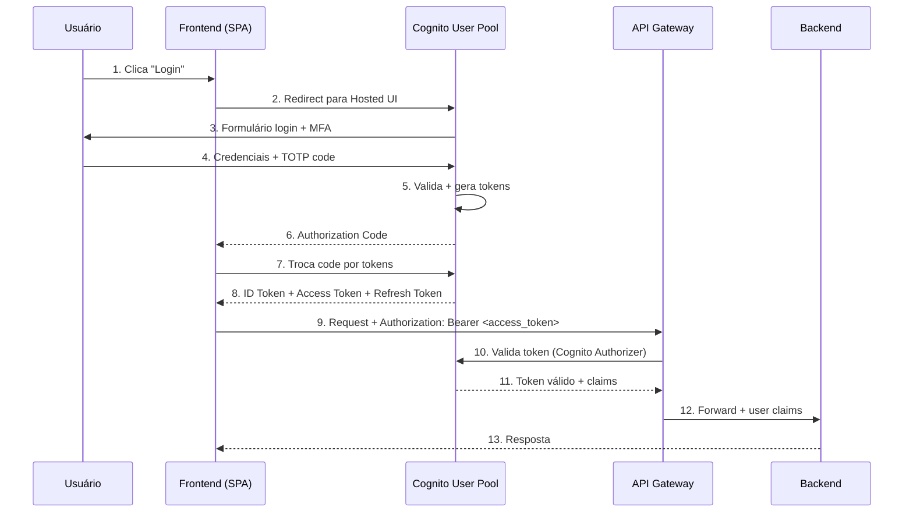
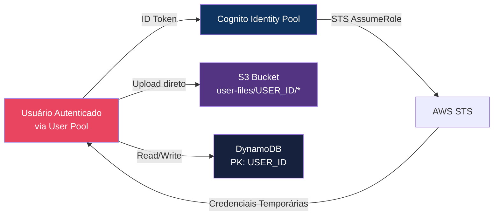
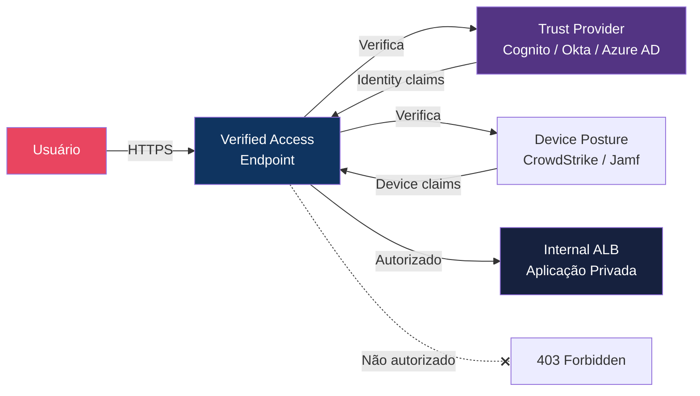
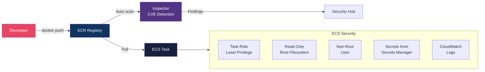
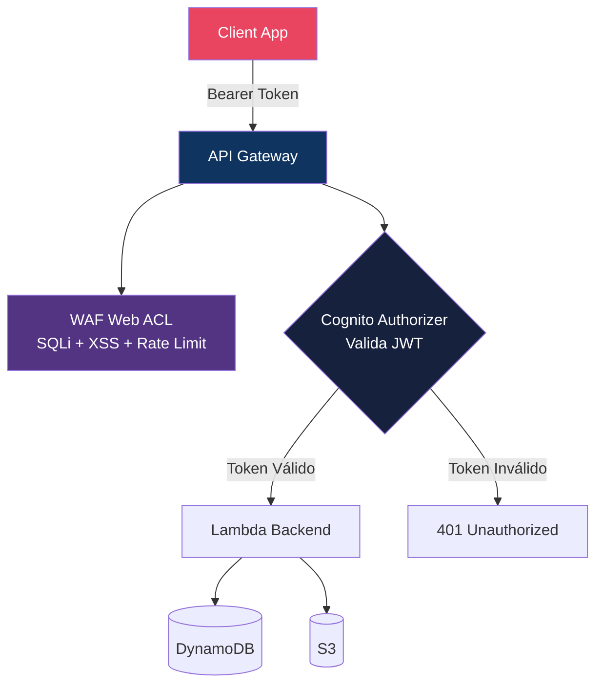

# Módulo 08 — Application Security

> **Nível:** 400 (Expert)
> **Tempo Total Estimado:** 10-14 horas de labs
> **Custo Estimado:** ~$5-15 (Cognito, Verified Access, ECR scanning)
> **Objetivo do Módulo:** Dominar segurança de aplicação na AWS — autenticação e autorização com Cognito (User Pools, Identity Pools, OAuth2/OIDC), zero-trust com Verified Access, segurança de containers (ECR scanning, ECS/EKS hardening), Lambda security e proteção de APIs com API Gateway + WAF + Cognito Authorizer.

---

## Mapa do Módulo



---

## Desafio 50: Cognito — User Pools, MFA e OAuth2/OIDC

> **Level:** 400 | **Tempo:** 120 min | **Custo:** ~$0 (50k MAU grátis)

### Objetivo

Implementar **Amazon Cognito User Pool** como provedor de identidade completo — signup, login, MFA, OAuth2/OIDC flows e integração com aplicações.

### Arquitetura



### Passo a Passo

```bash
# 1. Criar User Pool
POOL_ID=$(aws cognito-idp create-user-pool \
  --pool-name "app-users" \
  --auto-verified-attributes email \
  --mfa-configuration OPTIONAL \
  --software-token-mfa-configuration Enabled=true \
  --username-attributes email \
  --policies '{
    "PasswordPolicy": {
      "MinimumLength": 12,
      "RequireUppercase": true,
      "RequireLowercase": true,
      "RequireNumbers": true,
      "RequireSymbols": true,
      "TemporaryPasswordValidityDays": 1
    }
  }' \
  --account-recovery-setting '{
    "RecoveryMechanisms": [
      {"Priority": 1, "Name": "verified_email"}
    ]
  }' \
  --user-pool-add-ons '{"AdvancedSecurityMode": "ENFORCED"}' \
  --schema '[
    {"Name":"email","Required":true,"Mutable":true},
    {"Name":"name","Required":true,"Mutable":true},
    {"Name":"custom:company","AttributeDataType":"String","Mutable":true}
  ]' \
  --query 'UserPool.Id' --output text)

echo "User Pool ID: $POOL_ID"

# 2. Criar App Client (SPA — sem client secret)
CLIENT_ID=$(aws cognito-idp create-user-pool-client \
  --user-pool-id "$POOL_ID" \
  --client-name "spa-client" \
  --generate-secret false \
  --explicit-auth-flows ALLOW_USER_SRP_AUTH ALLOW_REFRESH_TOKEN_AUTH \
  --supported-identity-providers COGNITO \
  --callback-urls '["https://app.meusite.com/callback","http://localhost:3000/callback"]' \
  --logout-urls '["https://app.meusite.com/logout","http://localhost:3000/logout"]' \
  --allowed-o-auth-flows code \
  --allowed-o-auth-scopes openid email profile \
  --allowed-o-auth-flows-user-pool-client true \
  --prevent-user-existence-errors ENABLED \
  --token-validity-units '{
    "AccessToken": "hours",
    "IdToken": "hours",
    "RefreshToken": "days"
  }' \
  --access-token-validity 1 \
  --id-token-validity 1 \
  --refresh-token-validity 30 \
  --query 'UserPoolClient.ClientId' --output text)

echo "Client ID: $CLIENT_ID"

# 3. Configurar Hosted UI (domínio)
aws cognito-idp create-user-pool-domain \
  --user-pool-id "$POOL_ID" \
  --domain "app-meusite-auth"

echo "Login URL: https://app-meusite-auth.auth.us-east-1.amazoncognito.com/login"

# 4. Criar grupo admin
aws cognito-idp create-group \
  --user-pool-id "$POOL_ID" \
  --group-name "admins" \
  --description "Administradores" \
  --precedence 0

# 5. Criar usuário de teste
aws cognito-idp admin-create-user \
  --user-pool-id "$POOL_ID" \
  --username "teste@meusite.com" \
  --user-attributes Name=email,Value=teste@meusite.com Name=name,Value="User Teste" \
  --temporary-password "TempPass123!" \
  --message-action SUPPRESS
```

### Terraform

```hcl
resource "aws_cognito_user_pool" "main" {
  name = "app-users"

  username_attributes      = ["email"]
  auto_verified_attributes = ["email"]
  mfa_configuration        = "OPTIONAL"

  software_token_mfa_configuration {
    enabled = true
  }

  password_policy {
    minimum_length                   = 12
    require_lowercase                = true
    require_uppercase                = true
    require_numbers                  = true
    require_symbols                  = true
    temporary_password_validity_days = 1
  }

  account_recovery_setting {
    recovery_mechanism {
      name     = "verified_email"
      priority = 1
    }
  }

  user_pool_add_ons {
    advanced_security_mode = "ENFORCED"
  }

  # Schema
  schema {
    name                = "email"
    attribute_data_type = "String"
    required            = true
    mutable             = true
  }

  schema {
    name                = "company"
    attribute_data_type = "String"
    mutable             = true

    string_attribute_constraints {
      max_length = 100
    }
  }

  # Email config
  email_configuration {
    email_sending_account = "COGNITO_DEFAULT"
  }

  # Lambda triggers
  lambda_config {
    pre_sign_up        = aws_lambda_function.cognito_pre_signup.arn
    post_confirmation  = aws_lambda_function.cognito_post_confirm.arn
    pre_token_generation = aws_lambda_function.cognito_pre_token.arn
  }

  tags = { Service = "auth" }
}

resource "aws_cognito_user_pool_client" "spa" {
  name                                 = "spa-client"
  user_pool_id                         = aws_cognito_user_pool.main.id
  generate_secret                      = false
  explicit_auth_flows                  = ["ALLOW_USER_SRP_AUTH", "ALLOW_REFRESH_TOKEN_AUTH"]
  supported_identity_providers         = ["COGNITO"]
  callback_urls                        = ["https://app.meusite.com/callback"]
  logout_urls                          = ["https://app.meusite.com/logout"]
  allowed_oauth_flows                  = ["code"]
  allowed_oauth_scopes                 = ["openid", "email", "profile"]
  allowed_oauth_flows_user_pool_client = true
  prevent_user_existence_errors        = "ENABLED"

  access_token_validity  = 1   # 1 hora
  id_token_validity      = 1   # 1 hora
  refresh_token_validity = 30  # 30 dias

  token_validity_units {
    access_token  = "hours"
    id_token      = "hours"
    refresh_token = "days"
  }
}

resource "aws_cognito_user_pool_domain" "main" {
  domain       = "app-meusite-auth"
  user_pool_id = aws_cognito_user_pool.main.id
}

# Grupos
resource "aws_cognito_user_group" "admins" {
  name         = "admins"
  user_pool_id = aws_cognito_user_pool.main.id
  description  = "Administradores"
  precedence   = 0
  role_arn     = aws_iam_role.cognito_admin.arn
}

resource "aws_cognito_user_group" "users" {
  name         = "users"
  user_pool_id = aws_cognito_user_pool.main.id
  description  = "Usuários padrão"
  precedence   = 10
  role_arn     = aws_iam_role.cognito_user.arn
}
```

### Lambda Trigger: Pre Token Generation (adicionar claims customizados)

```python
"""cognito-pre-token — Adiciona claims customizados ao JWT."""
def handler(event, context):
    # Adicionar permissões baseadas no grupo do user
    groups = event['request']['groupConfiguration']['groupsToOverride']

    claims = {}
    if 'admins' in groups:
        claims['custom:role'] = 'admin'
        claims['custom:permissions'] = 'read,write,delete,admin'
    else:
        claims['custom:role'] = 'user'
        claims['custom:permissions'] = 'read,write'

    event['response']['claimsOverrideDetails'] = {
        'claimsToAddOrOverride': claims
    }

    return event
```

### O Que Aprendemos

| Conceito | Detalhe |
|----------|---------|
| User Pool | Diretório de usuários com signup, login, MFA |
| App Client | Configuração de autenticação por aplicação |
| Hosted UI | Login page gerenciada pela AWS (customizável) |
| OAuth2 Code Flow | Mais seguro que Implicit — troca code por tokens |
| Advanced Security | ML para detectar login suspeito (IP, device, behavior) |
| Lambda Triggers | Customizar fluxo em cada etapa (signup, confirm, token) |
| prevent_user_existence_errors | Não revela se email existe (anti-enumeration) |

> **💡 Expert Tip:** SEMPRE use `prevent_user_existence_errors = ENABLED`. Sem isso, um atacante pode enumerar emails válidos testando signup/login — a resposta diferente ("user not found" vs "wrong password") revela quais emails existem. Com a flag, a resposta é genérica para ambos os casos. Para MFA, comece com OPTIONAL e migre para REQUIRED após 90 dias — dá tempo para os usuários configurarem.

---

## Desafio 51: Cognito — Identity Pools e Federated Access

> **Level:** 400 | **Tempo:** 90 min | **Custo:** ~$0

### Objetivo

Usar **Cognito Identity Pools** para conceder credenciais AWS temporárias a usuários autenticados, permitindo acesso direto a serviços AWS (S3, DynamoDB) do frontend.

### Arquitetura



```hcl
# Identity Pool
resource "aws_cognito_identity_pool" "main" {
  identity_pool_name               = "app-identity-pool"
  allow_unauthenticated_identities = false

  cognito_identity_providers {
    client_id               = aws_cognito_user_pool_client.spa.id
    provider_name           = aws_cognito_user_pool.main.endpoint
    server_side_token_check = true
  }
}

# Role para usuários autenticados
resource "aws_cognito_identity_pool_roles_attachment" "main" {
  identity_pool_id = aws_cognito_identity_pool.main.id

  roles = {
    "authenticated" = aws_iam_role.cognito_authenticated.arn
  }

  role_mapping {
    identity_provider = "${aws_cognito_user_pool.main.endpoint}:${aws_cognito_user_pool_client.spa.id}"
    type              = "Rules"
    ambiguous_role_resolution = "AuthenticatedRole"

    mapping_rule {
      claim      = "cognito:groups"
      match_type = "Contains"
      value      = "admins"
      role_arn   = aws_iam_role.cognito_admin.arn
    }
  }
}

# IAM Role: usuário autenticado (acesso restrito ao próprio prefixo S3)
resource "aws_iam_role" "cognito_authenticated" {
  name = "CognitoAuthenticatedUser"

  assume_role_policy = jsonencode({
    Version = "2012-10-17"
    Statement = [{
      Effect = "Allow"
      Principal = { Federated = "cognito-identity.amazonaws.com" }
      Action = "sts:AssumeRoleWithWebIdentity"
      Condition = {
        StringEquals = {
          "cognito-identity.amazonaws.com:aud" = aws_cognito_identity_pool.main.id
        }
        "ForAnyValue:StringLike" = {
          "cognito-identity.amazonaws.com:amr" = "authenticated"
        }
      }
    }]
  })
}

resource "aws_iam_role_policy" "cognito_authenticated" {
  name = "UserScopedAccess"
  role = aws_iam_role.cognito_authenticated.id

  policy = jsonencode({
    Version = "2012-10-17"
    Statement = [
      {
        Sid    = "S3UserPrefix"
        Effect = "Allow"
        Action = ["s3:GetObject", "s3:PutObject", "s3:DeleteObject"]
        Resource = "arn:aws:s3:::app-user-files/$${cognito-identity.amazonaws.com:sub}/*"
      },
      {
        Sid    = "DynamoDBUserItems"
        Effect = "Allow"
        Action = ["dynamodb:GetItem", "dynamodb:PutItem", "dynamodb:UpdateItem", "dynamodb:DeleteItem", "dynamodb:Query"]
        Resource = "arn:aws:dynamodb:*:*:table/app-user-data"
        Condition = {
          "ForAllValues:StringEquals" = {
            "dynamodb:LeadingKeys" = "$${cognito-identity.amazonaws.com:sub}"
          }
        }
      }
    ]
  })
}
```

### O Que Aprendemos

| Conceito | Detalhe |
|----------|---------|
| Identity Pool | Troca token de autenticação por credenciais AWS temporárias |
| Fine-grained access | `${cognito-identity.amazonaws.com:sub}` = user ID no IAM policy |
| S3 user prefix | Cada user só acessa `user-files/SEU_ID/*` |
| DynamoDB leading keys | Cada user só acessa items com PK = seu ID |
| Role mapping | Grupos do Cognito → IAM Roles diferentes |

---

## Desafio 52: Verified Access — Zero-Trust sem VPN

> **Level:** 400 | **Tempo:** 90 min | **Custo:** ~$5

### Objetivo

Implementar **AWS Verified Access** para acesso zero-trust a aplicações internas sem VPN — autenticação baseada em identidade e postura do device.

### Arquitetura



```hcl
# Verified Access Trust Provider (Cognito)
resource "aws_verifiedaccess_trust_provider" "cognito" {
  trust_provider_type = "user"
  user_trust_provider_type = "iam-identity-center"
  policy_reference_name = "idp"

  oidc_options {
    authorization_endpoint = "https://cognito-idp.us-east-1.amazonaws.com/${aws_cognito_user_pool.main.id}/oauth2/authorize"
    client_id              = aws_cognito_user_pool_client.va.id
    client_secret          = aws_cognito_user_pool_client.va.client_secret
    issuer                 = "https://cognito-idp.us-east-1.amazonaws.com/${aws_cognito_user_pool.main.id}"
    token_endpoint         = "https://cognito-idp.us-east-1.amazonaws.com/${aws_cognito_user_pool.main.id}/oauth2/token"
    user_info_endpoint     = "https://cognito-idp.us-east-1.amazonaws.com/${aws_cognito_user_pool.main.id}/oauth2/userInfo"
    scope                  = "openid email profile"
  }
}

# Verified Access Instance
resource "aws_verifiedaccess_instance" "main" {
  description = "Zero-trust access for internal apps"
}

resource "aws_verifiedaccess_instance_trust_provider_attachment" "cognito" {
  verifiedaccess_instance_id       = aws_verifiedaccess_instance.main.id
  verifiedaccess_trust_provider_id = aws_verifiedaccess_trust_provider.cognito.id
}

# Verified Access Group (quem pode acessar)
resource "aws_verifiedaccess_group" "engineering" {
  verifiedaccess_instance_id = aws_verifiedaccess_instance.main.id
  description = "Engineering team access"

  # Cedar policy: permitir se user está no grupo "engineering"
  policy_document = <<-CEDAR
    permit(principal, action, resource)
    when {
      context.idp.groups.contains("engineering")
    };
  CEDAR
}

# Verified Access Endpoint (aponta para ALB interno)
resource "aws_verifiedaccess_endpoint" "internal_app" {
  verified_access_group_id    = aws_verifiedaccess_group.engineering.id
  endpoint_type               = "load-balancer"
  attachment_type              = "vpc"
  domain_certificate_arn      = aws_acm_certificate.internal.arn
  endpoint_domain_prefix      = "internal-app"

  load_balancer_options {
    load_balancer_arn = aws_lb.internal.arn
    port              = 443
    protocol          = "https"
    subnet_ids        = aws_subnet.private[*].id
  }
}
```

### O Que Aprendemos

| Conceito | Detalhe |
|----------|---------|
| Verified Access | Zero-trust proxy — acesso baseado em identidade, não rede |
| Trust Provider | IdP (Cognito, Okta, Azure AD) + Device posture |
| Cedar Policy | Linguagem de policy da AWS para decisões de acesso |
| Sem VPN | Acesso direto via browser — sem cliente VPN instalado |
| Endpoint | Proxy que fica na frente da aplicação interna |

> **💡 Expert Tip:** Verified Access é a resposta da AWS para o modelo BeyondCorp do Google. Em vez de confiar em "está dentro da VPN = confiável", verifica identidade + device posture em CADA request. Ideal para times remotos — elimina VPN, reduce superfície de ataque e melhora a experiência do usuário.

---

## Desafio 53: Container Security — ECR Scanning e ECS/EKS Hardening

> **Level:** 400 | **Tempo:** 120 min | **Custo:** ~$2

### Objetivo

Implementar segurança em containers — scan de imagens no ECR, hardening de ECS tasks e boas práticas de EKS security.

### Pipeline de Container Security



### ECR Scanning + Policy

```hcl
# ECR Repository com scanning
resource "aws_ecr_repository" "app" {
  name                 = "app"
  image_tag_mutability = "IMMUTABLE"  # Tags não podem ser sobrescritas

  image_scanning_configuration {
    scan_on_push = true  # Scan automático a cada push
  }

  encryption_configuration {
    encryption_type = "KMS"
    kms_key         = aws_kms_key.ecr.arn
  }
}

# Lifecycle policy: manter apenas N imagens
resource "aws_ecr_lifecycle_policy" "app" {
  repository = aws_ecr_repository.app.name
  policy = jsonencode({
    rules = [{
      rulePriority = 1
      description  = "Keep last 20 images"
      selection = {
        tagStatus   = "any"
        countType   = "imageCountMoreThan"
        countNumber = 20
      }
      action = { type = "expire" }
    }]
  })
}

# Repository policy: quem pode pull/push
resource "aws_ecr_repository_policy" "app" {
  repository = aws_ecr_repository.app.name
  policy = jsonencode({
    Version = "2012-10-17"
    Statement = [
      {
        Sid    = "AllowPull"
        Effect = "Allow"
        Principal = { AWS = aws_iam_role.ecs_task_execution.arn }
        Action = [
          "ecr:GetDownloadUrlForLayer",
          "ecr:BatchGetImage",
          "ecr:BatchCheckLayerAvailability"
        ]
      }
    ]
  })
}
```

### ECS Task Definition Segura

```hcl
resource "aws_ecs_task_definition" "app" {
  family                   = "app"
  network_mode             = "awsvpc"
  requires_compatibilities = ["FARGATE"]
  cpu                      = "512"
  memory                   = "1024"
  execution_role_arn       = aws_iam_role.ecs_task_execution.arn
  task_role_arn            = aws_iam_role.ecs_task.arn

  container_definitions = jsonencode([{
    name  = "app"
    image = "${aws_ecr_repository.app.repository_url}:latest"

    # Security hardening
    readonlyRootFilesystem = true  # Filesystem read-only
    privileged             = false  # Sem privileged mode
    user                   = "1000:1000"  # Non-root user

    linuxParameters = {
      capabilities = {
        drop = ["ALL"]  # Drop ALL capabilities
      }
      initProcessEnabled = true  # PID 1 handling
    }

    # Secrets do Secrets Manager (não env vars!)
    secrets = [
      {
        name      = "DB_PASSWORD"
        valueFrom = aws_secretsmanager_secret.db_password.arn
      },
      {
        name      = "API_KEY"
        valueFrom = "${aws_secretsmanager_secret.api_key.arn}:api_key::"
      }
    ]

    # Logging
    logConfiguration = {
      logDriver = "awslogs"
      options = {
        "awslogs-group"         = aws_cloudwatch_log_group.app.name
        "awslogs-region"        = var.region
        "awslogs-stream-prefix" = "ecs"
      }
    }

    # Health check
    healthCheck = {
      command     = ["CMD-SHELL", "curl -f http://localhost:8080/health || exit 1"]
      interval    = 30
      timeout     = 5
      retries     = 3
      startPeriod = 60
    }

    # Port
    portMappings = [{
      containerPort = 8080
      protocol      = "tcp"
    }]
  }])
}

# Task Role: least privilege
resource "aws_iam_role" "ecs_task" {
  name = "ecs-app-task-role"
  assume_role_policy = jsonencode({
    Version = "2012-10-17"
    Statement = [{
      Effect    = "Allow"
      Principal = { Service = "ecs-tasks.amazonaws.com" }
      Action    = "sts:AssumeRole"
    }]
  })
}

resource "aws_iam_role_policy" "ecs_task" {
  name = "app-permissions"
  role = aws_iam_role.ecs_task.id
  policy = jsonencode({
    Version = "2012-10-17"
    Statement = [
      {
        Effect   = "Allow"
        Action   = ["s3:GetObject", "s3:PutObject"]
        Resource = "${aws_s3_bucket.app_data.arn}/*"
      },
      {
        Effect   = "Allow"
        Action   = ["dynamodb:GetItem", "dynamodb:PutItem", "dynamodb:Query"]
        Resource = aws_dynamodb_table.app.arn
      }
    ]
  })
}
```

### Container Security Checklist

```
┌──────────────────────────────────────────────────────────────────┐
│              Container Security Checklist                          │
│                                                                   │
│  Build Time:                                                     │
│  □ Base image mínima (distroless, alpine, scratch)              │
│  □ Multi-stage build (não incluir ferramentas de build)         │
│  □ Sem secrets no Dockerfile (use build args ou Secrets Manager) │
│  □ Image scanning no CI/CD (ECR scan, Trivy, Snyk)             │
│  □ Immutable tags (não usar :latest em produção)                │
│  □ Signed images (Docker Content Trust / cosign)                │
│                                                                   │
│  Runtime:                                                        │
│  □ readonlyRootFilesystem = true                                │
│  □ privileged = false                                           │
│  □ Non-root user (USER 1000 no Dockerfile)                      │
│  □ Drop ALL capabilities                                        │
│  □ Secrets via Secrets Manager (não env vars)                   │
│  □ Network: awsvpc mode com SG dedicado                        │
│  □ Logging: CloudWatch Logs obrigatório                        │
│  □ Resource limits (CPU/memory)                                 │
│                                                                   │
│  Registry:                                                       │
│  □ ECR scan on push habilitado                                  │
│  □ Lifecycle policy (limpar imagens antigas)                    │
│  □ Repository policy (quem pode pull)                           │
│  □ Encryption com KMS                                           │
│  □ Immutable tags                                               │
└──────────────────────────────────────────────────────────────────┘
```

### O Que Aprendemos

| Conceito | Detalhe |
|----------|---------|
| ECR scan on push | Inspector detecta CVEs automaticamente a cada push |
| Immutable tags | `:v1.2.3` não pode ser sobrescrita — garante integridade |
| Read-only filesystem | Container não pode escrever em disco (anti-malware) |
| Drop ALL capabilities | Remove capabilities Linux desnecessárias |
| Secrets Manager integration | ECS busca secrets na hora, não ficam em env vars |
| Task Role vs Execution Role | Task = app permissions; Execution = infra (ECR pull, logs) |

> **💡 Expert Tip:** A vulnerabilidade mais comum em containers: usar `latest` tag em produção. Alguém faz push de uma imagem com vulnerabilidade, ECS faz re-deploy com `:latest` e pronto — você está rodando código inseguro sem saber. Use `IMMUTABLE` tags no ECR e referencie por digest (`image@sha256:abc...`) para máxima segurança.

---

## Desafio 54: Lambda Security — VPC, Layers, Concurrency e Permissions

> **Level:** 400 | **Tempo:** 60 min | **Custo:** ~$0

### Objetivo

Implementar boas práticas de segurança em **AWS Lambda** — IAM least privilege, VPC placement, resource policies, reserved concurrency e proteção contra event injection.

```hcl
# Lambda com security hardening
resource "aws_lambda_function" "processor" {
  function_name = "order-processor"
  role          = aws_iam_role.lambda_processor.arn
  runtime       = "python3.12"
  handler       = "handler.handler"
  filename      = "lambda/processor.zip"
  timeout       = 30
  memory_size   = 256

  # VPC: Lambda dentro da VPC (acesso a RDS, ElastiCache)
  vpc_config {
    subnet_ids         = aws_subnet.private[*].id
    security_group_ids = [aws_security_group.lambda.id]
  }

  # Reserved concurrency: limitar blast radius
  reserved_concurrent_executions = 100

  # Environment (apenas non-sensitive)
  environment {
    variables = {
      TABLE_NAME   = aws_dynamodb_table.orders.name
      BUCKET_NAME  = aws_s3_bucket.orders.id
      LOG_LEVEL    = "INFO"
      # NUNCA: DB_PASSWORD, API_KEY, etc.
    }
  }

  # Tracing
  tracing_config {
    mode = "Active"  # X-Ray tracing
  }

  # Dead letter queue (falhas vão para SQS)
  dead_letter_config {
    target_arn = aws_sqs_queue.dlq.arn
  }

  tags = { Service = "orders" }
}

# IAM Role: LEAST PRIVILEGE
resource "aws_iam_role" "lambda_processor" {
  name = "lambda-order-processor"
  assume_role_policy = jsonencode({
    Version = "2012-10-17"
    Statement = [{
      Effect    = "Allow"
      Principal = { Service = "lambda.amazonaws.com" }
      Action    = "sts:AssumeRole"
    }]
  })
}

resource "aws_iam_role_policy" "lambda_processor" {
  name = "order-processor-permissions"
  role = aws_iam_role.lambda_processor.id
  policy = jsonencode({
    Version = "2012-10-17"
    Statement = [
      {
        Sid      = "DynamoDBAccess"
        Effect   = "Allow"
        Action   = ["dynamodb:GetItem", "dynamodb:PutItem", "dynamodb:Query"]
        Resource = aws_dynamodb_table.orders.arn
      },
      {
        Sid      = "S3Access"
        Effect   = "Allow"
        Action   = ["s3:GetObject", "s3:PutObject"]
        Resource = "${aws_s3_bucket.orders.arn}/*"
      },
      {
        Sid      = "SecretsAccess"
        Effect   = "Allow"
        Action   = ["secretsmanager:GetSecretValue"]
        Resource = aws_secretsmanager_secret.db_password.arn
      },
      {
        Sid      = "VPCAccess"
        Effect   = "Allow"
        Action   = [
          "ec2:CreateNetworkInterface",
          "ec2:DescribeNetworkInterfaces",
          "ec2:DeleteNetworkInterface"
        ]
        Resource = "*"
      },
      {
        Sid      = "Logs"
        Effect   = "Allow"
        Action   = ["logs:CreateLogGroup", "logs:CreateLogStream", "logs:PutLogEvents"]
        Resource = "arn:aws:logs:*:*:*"
      },
      {
        Sid      = "DLQ"
        Effect   = "Allow"
        Action   = ["sqs:SendMessage"]
        Resource = aws_sqs_queue.dlq.arn
      }
    ]
  })
}

# Resource Policy: quem pode invocar esta Lambda
resource "aws_lambda_permission" "api_gw" {
  statement_id  = "AllowAPIGateway"
  action        = "lambda:InvokeFunction"
  function_name = aws_lambda_function.processor.function_name
  principal     = "apigateway.amazonaws.com"
  source_arn    = "${aws_apigatewayv2_api.main.execution_arn}/*"
}
```

### O Que Aprendemos

| Conceito | Detalhe |
|----------|---------|
| Least privilege role | Listar CADA ação e recurso — nunca `*` |
| Reserved concurrency | Limita execuções simultâneas (blast radius) |
| VPC Lambda | Necessário para acessar recursos privados (RDS, ElastiCache) |
| Resource policy | Controla QUEM pode invocar a Lambda |
| DLQ | Dead letter queue para falhas — não perder eventos |
| Secrets Manager | Buscar secrets em runtime, não em env vars |

---

## Desafio 55: API Security — API Gateway + WAF + Cognito Authorizer

> **Level:** 400 | **Tempo:** 90 min | **Custo:** ~$2

### Objetivo

Implementar segurança completa em APIs — API Gateway com Cognito Authorizer, WAF para proteção contra ataques, throttling, e validação de requests.

### Arquitetura



```hcl
# API Gateway HTTP API
resource "aws_apigatewayv2_api" "main" {
  name          = "app-api"
  protocol_type = "HTTP"

  cors_configuration {
    allow_headers = ["authorization", "content-type"]
    allow_methods = ["GET", "POST", "PUT", "DELETE", "OPTIONS"]
    allow_origins = ["https://app.meusite.com"]
    max_age       = 86400
  }
}

# Cognito Authorizer
resource "aws_apigatewayv2_authorizer" "cognito" {
  api_id           = aws_apigatewayv2_api.main.id
  authorizer_type  = "JWT"
  identity_sources = ["$request.header.Authorization"]
  name             = "cognito-jwt"

  jwt_configuration {
    audience = [aws_cognito_user_pool_client.spa.id]
    issuer   = "https://cognito-idp.${var.region}.amazonaws.com/${aws_cognito_user_pool.main.id}"
  }
}

# Routes com authorizer
resource "aws_apigatewayv2_route" "get_orders" {
  api_id             = aws_apigatewayv2_api.main.id
  route_key          = "GET /orders"
  target             = "integrations/${aws_apigatewayv2_integration.orders.id}"
  authorizer_id      = aws_apigatewayv2_authorizer.cognito.id
  authorization_type = "JWT"
  authorization_scopes = ["openid"]
}

resource "aws_apigatewayv2_route" "post_orders" {
  api_id             = aws_apigatewayv2_api.main.id
  route_key          = "POST /orders"
  target             = "integrations/${aws_apigatewayv2_integration.orders.id}"
  authorizer_id      = aws_apigatewayv2_authorizer.cognito.id
  authorization_type = "JWT"
  authorization_scopes = ["openid"]
}

# Route pública (sem auth) — health check
resource "aws_apigatewayv2_route" "health" {
  api_id    = aws_apigatewayv2_api.main.id
  route_key = "GET /health"
  target    = "integrations/${aws_apigatewayv2_integration.health.id}"
  # Sem authorizer — pública
}

# Stage com throttling
resource "aws_apigatewayv2_stage" "prod" {
  api_id      = aws_apigatewayv2_api.main.id
  name        = "prod"
  auto_deploy = true

  default_route_settings {
    throttling_burst_limit = 100
    throttling_rate_limit  = 50  # 50 req/s
  }

  access_log_settings {
    destination_arn = aws_cloudwatch_log_group.api.arn
    format = jsonencode({
      requestId      = "$context.requestId"
      ip             = "$context.identity.sourceIp"
      caller         = "$context.identity.caller"
      user           = "$context.authorizer.claims.sub"
      requestTime    = "$context.requestTime"
      httpMethod     = "$context.httpMethod"
      resourcePath   = "$context.resourcePath"
      status         = "$context.status"
      protocol       = "$context.protocol"
      responseLength = "$context.responseLength"
      errorMessage   = "$context.error.message"
    })
  }
}
```

### Validação

```bash
# 1. Testar sem token (deve retornar 401)
curl -s -o /dev/null -w "%{http_code}" \
  https://API_ID.execute-api.us-east-1.amazonaws.com/prod/orders
# 401

# 2. Obter token do Cognito
TOKEN=$(aws cognito-idp initiate-auth \
  --auth-flow USER_PASSWORD_AUTH \
  --client-id "$CLIENT_ID" \
  --auth-parameters USERNAME=teste@meusite.com,PASSWORD=MinhaSenh@123 \
  --query 'AuthenticationResult.AccessToken' --output text)

# 3. Testar com token (deve retornar 200)
curl -s -o /dev/null -w "%{http_code}" \
  -H "Authorization: Bearer $TOKEN" \
  https://API_ID.execute-api.us-east-1.amazonaws.com/prod/orders
# 200

# 4. Testar SQLi no body (WAF deve bloquear)
curl -s -o /dev/null -w "%{http_code}" \
  -H "Authorization: Bearer $TOKEN" \
  -X POST -d '{"name":"1 OR 1=1; DROP TABLE orders--"}' \
  https://API_ID.execute-api.us-east-1.amazonaws.com/prod/orders
# 403 (WAF blocked)

# 5. Health check público (sem auth)
curl -s https://API_ID.execute-api.us-east-1.amazonaws.com/prod/health
# {"status":"healthy"}
```

### O Que Aprendemos

| Conceito | Detalhe |
|----------|---------|
| Cognito Authorizer | Valida JWT automaticamente — zero código no backend |
| JWT configuration | Audience + Issuer — API GW valida ambos |
| Throttling | Burst limit + rate limit por stage |
| Access logs | Log estruturado com user, IP, status, error |
| CORS | Configuração explícita — apenas origins permitidas |
| Public routes | Health check sem auth para monitoring |

> **💡 Expert Tip:** O Cognito JWT Authorizer é validado no API Gateway — o backend NUNCA vê um request com token inválido. Isso reduz drasticamente a carga e a superfície de ataque. Para authorization (quem pode fazer o quê), use as claims do JWT (`cognito:groups`, `custom:role`) no código do backend. Authentication = API Gateway; Authorization = Backend.

---

## Resumo do Módulo 08

```
┌──────────────────────────────────────────────────────────────┐
│               MÓDULO 08 — CONQUISTAS                          │
│                                                               │
│  ✅ Desafio 50: Cognito User Pools                           │
│     Signup, login, MFA, OAuth2, Lambda triggers              │
│                                                               │
│  ✅ Desafio 51: Cognito Identity Pools                       │
│     Federated access, user-scoped S3/DynamoDB                │
│                                                               │
│  ✅ Desafio 52: Verified Access                              │
│     Zero-trust, Cedar policies, sem VPN                      │
│                                                               │
│  ✅ Desafio 53: Container Security                           │
│     ECR scan, immutable tags, ECS hardening checklist        │
│                                                               │
│  ✅ Desafio 54: Lambda Security                              │
│     Least privilege, reserved concurrency, resource policy   │
│                                                               │
│  ✅ Desafio 55: API Security                                 │
│     API GW + Cognito Authorizer + WAF + throttling           │
│                                                               │
│  Próximo: Módulo 09 — Security Operations                    │
│  (Security Lake, SIEM, Threat Hunting, Automation)           │
└──────────────────────────────────────────────────────────────┘
```

**Próximo:** [Módulo 09 — Security Operations →](modulo-09-secops.md)
