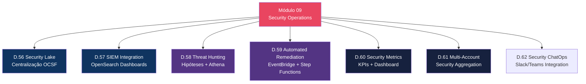
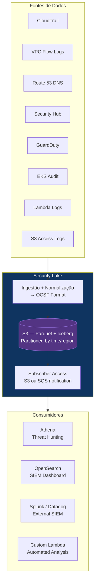
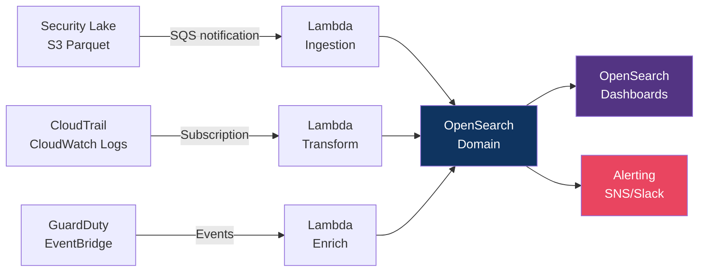
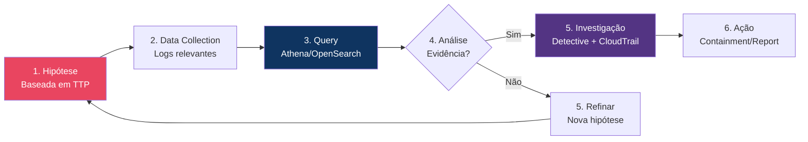
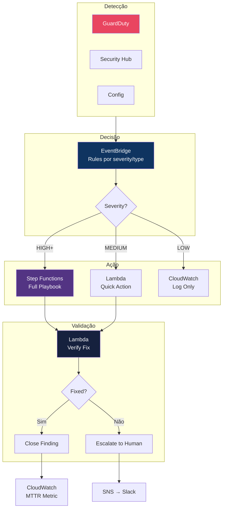
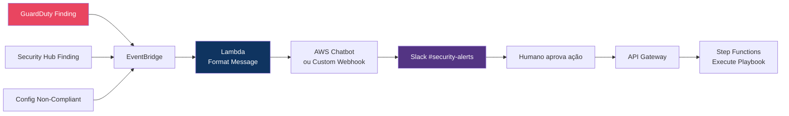

# Módulo 09 — Security Operations Center

> **Nível:** 400 (Expert)
> **Tempo Total Estimado:** 12-16 horas de labs
> **Custo Estimado:** ~$10-20 (Security Lake, OpenSearch)
> **Objetivo do Módulo:** Dominar operações de segurança em escala — centralização de logs com Security Lake, integração SIEM, threat hunting com Athena, pipelines de remediação automatizada, métricas de segurança e operação multi-account.

---

## Mapa do Módulo



---

## Desafio 56: Security Lake — Centralização de Logs (OCSF)

> **Level:** 400 | **Tempo:** 120 min | **Custo:** ~$5

### Objetivo

Implementar **Amazon Security Lake** para centralizar TODOS os logs de segurança em formato padronizado OCSF (Open Cybersecurity Schema Framework).

### Arquitetura



### Passo a Passo

```bash
# 1. Criar Security Lake (delegated admin)
aws securitylake create-data-lake \
  --configurations '[{
    "region": "us-east-1",
    "lifecycleConfiguration": {
      "transitions": [
        {"days": 30, "storageClass": "ONEZONE_IA"},
        {"days": 90, "storageClass": "GLACIER"}
      ],
      "expiration": {"days": 365}
    },
    "encryptionConfiguration": {
      "kmsKeyId": "alias/security-lake-key"
    }
  }]' \
  --meta-store-manager-role-arn "arn:aws:iam::$ACCOUNT_ID:role/AmazonSecurityLakeMetaStoreManager"

# 2. Habilitar fontes de dados
aws securitylake create-aws-log-source \
  --sources '[
    {"sourceName": "CLOUD_TRAIL_MGMT", "sourceVersion": "2.0"},
    {"sourceName": "VPC_FLOW", "sourceVersion": "1.0"},
    {"sourceName": "ROUTE53", "sourceVersion": "1.0"},
    {"sourceName": "SH_FINDINGS", "sourceVersion": "2.0"},
    {"sourceName": "LAMBDA_EXECUTION", "sourceVersion": "1.0"},
    {"sourceName": "S3_DATA", "sourceVersion": "2.0"},
    {"sourceName": "EKS_AUDIT", "sourceVersion": "2.0"}
  ]'

# 3. Criar subscriber (Athena)
aws securitylake create-subscriber \
  --subscriber-identity '{"principal": "'$ACCOUNT_ID'", "externalId": "security-team"}' \
  --subscriber-name "athena-threat-hunting" \
  --sources '[{"awsLogSource": {"sourceName": "CLOUD_TRAIL_MGMT"}}]' \
  --access-types S3
```

### OCSF — Formato Padronizado

```
┌──────────────────────────────────────────────────────────────────┐
│         OCSF — Open Cybersecurity Schema Framework                │
│                                                                   │
│  Antes (cada serviço com formato diferente):                     │
│  ├── CloudTrail: JSON com userIdentity, eventName, etc.         │
│  ├── VPC Flow Logs: space-delimited com srcaddr, dstaddr        │
│  ├── GuardDuty: JSON com type, severity, resource               │
│  └── Route 53: JSON com queryName, queryType                    │
│                                                                   │
│  Depois (Security Lake — OCSF unificado):                        │
│  ├── Todos os logs no MESMO schema                               │
│  ├── Campos padronizados: actor, src_endpoint, dst_endpoint     │
│  ├── Formato: Apache Parquet (comprimido, columnar)             │
│  ├── Tabelas: Apache Iceberg (ACID, time travel)                │
│  └── Uma query Athena funciona para TODAS as fontes             │
│                                                                   │
│  Benefício: query cross-source sem ETL customizado              │
│  Exemplo: "mostre toda atividade do IP 1.2.3.4 em TODOS os     │
│  logs (CloudTrail + VPC Flow + DNS + GuardDuty)"                │
└──────────────────────────────────────────────────────────────────┘
```

### O Que Aprendemos

| Conceito | Detalhe |
|----------|---------|
| Security Lake | Data lake centralizado para logs de segurança |
| OCSF | Schema padronizado — todas as fontes no mesmo formato |
| Apache Iceberg | Tabelas ACID com time travel e schema evolution |
| Subscribers | Quem pode consumir os dados (Athena, SIEM, Lambda) |
| Multi-account | Agrega logs de TODAS as contas da Organization |

> **💡 Expert Tip:** Security Lake resolve o problema #1 de SecOps: cada serviço AWS tem formato de log diferente. Sem Security Lake, você precisa de ETL customizado para cada fonte. Com Security Lake, uma query Athena analisa CloudTrail + VPC Flow Logs + GuardDuty + DNS juntos.

---

## Desafio 57: SIEM Integration — OpenSearch + Security Dashboards

> **Level:** 400 | **Tempo:** 120 min | **Custo:** ~$10

### Objetivo

Integrar logs de segurança com **Amazon OpenSearch** para criar um SIEM (Security Information and Event Management) com dashboards em tempo real.

### Arquitetura



### Dashboards Essenciais

```
┌──────────────────────────────────────────────────────────────────┐
│              SIEM Dashboards — O Que Monitorar                    │
│                                                                   │
│  Dashboard 1: Security Overview                                  │
│  ├── GuardDuty findings por severidade (últimas 24h)            │
│  ├── Top 10 IPs com mais atividade suspeita                     │
│  ├── Config non-compliant resources count                        │
│  ├── IAM login failures (tendência)                              │
│  └── Security Hub score (gauge)                                  │
│                                                                   │
│  Dashboard 2: Network Security                                   │
│  ├── VPC Flow Logs — rejected connections (mapa de calor)       │
│  ├── Top 10 ports targeted                                       │
│  ├── Outbound traffic anomalies                                  │
│  ├── DNS queries para domínios suspeitos                        │
│  └── Geo distribution de traffic sources                         │
│                                                                   │
│  Dashboard 3: IAM & Access                                       │
│  ├── AssumeRole events (quem assumiu qual role)                 │
│  ├── Console logins (geo map)                                   │
│  ├── Access denied events (tendência)                            │
│  ├── IAM policy changes timeline                                │
│  └── Root account usage (deve ser ZERO)                         │
│                                                                   │
│  Dashboard 4: Incident Response                                  │
│  ├── Active incidents (P0/P1/P2/P3)                             │
│  ├── MTTD / MTTC / MTTR trends                                 │
│  ├── Playbook executions (success/failure)                      │
│  ├── Auto-remediation actions taken                              │
│  └── Evidence collected (S3 uploads)                             │
└──────────────────────────────────────────────────────────────────┘
```

### O Que Aprendemos

| Conceito | Detalhe |
|----------|---------|
| SIEM | Security Information and Event Management — correlação de eventos |
| OpenSearch | Fork do Elasticsearch — full-text search + dashboards |
| Near real-time | Logs disponíveis em segundos para investigação |
| Alerting | Rules que disparam notificações baseadas em padrões |

---

## Desafio 58: Threat Hunting — Hipóteses e Queries Athena

> **Level:** 400 | **Tempo:** 90 min | **Custo:** ~$1

### Objetivo

Conduzir **threat hunting** proativo — formular hipóteses de comprometimento e buscar evidências nos logs antes que alertas automáticos disparem.

### Metodologia



### Hipóteses e Queries

```sql
-- HIPÓTESE 1: Credenciais comprometidas (atividade de IP incomum)
-- TTPs: T1078 Valid Accounts
SELECT
    useridentity.arn AS who,
    sourceipaddress AS ip,
    COUNT(DISTINCT sourceipaddress) AS unique_ips,
    COUNT(*) AS total_events,
    ARRAY_AGG(DISTINCT awsregion) AS regions
FROM cloudtrail_logs
WHERE year = '2026' AND month = '04'
  AND useridentity.type = 'IAMUser'
  AND eventtime > current_timestamp - interval '7' day
GROUP BY useridentity.arn, sourceipaddress
HAVING COUNT(DISTINCT sourceipaddress) > 5
ORDER BY unique_ips DESC;

-- HIPÓTESE 2: Lateral movement via AssumeRole
-- TTPs: T1550 Use Alternate Authentication Material
SELECT
    useridentity.arn AS source_identity,
    json_extract_scalar(requestparameters, '$.roleArn') AS target_role,
    sourceipaddress,
    COUNT(*) AS assume_count,
    MIN(eventtime) AS first_seen,
    MAX(eventtime) AS last_seen
FROM cloudtrail_logs
WHERE eventname = 'AssumeRole'
  AND year = '2026' AND month = '04'
  AND eventtime > current_timestamp - interval '7' day
GROUP BY useridentity.arn, json_extract_scalar(requestparameters, '$.roleArn'), sourceipaddress
HAVING COUNT(*) > 20
ORDER BY assume_count DESC;

-- HIPÓTESE 3: Data exfiltration via S3
-- TTPs: T1537 Transfer Data to Cloud Account
SELECT
    useridentity.arn AS who,
    json_extract_scalar(requestparameters, '$.bucketName') AS bucket,
    eventname,
    COUNT(*) AS operations,
    sourceipaddress
FROM cloudtrail_logs
WHERE eventname IN ('GetObject', 'CopyObject', 'SelectObjectContent')
  AND year = '2026' AND month = '04'
  AND eventtime > current_timestamp - interval '24' hour
GROUP BY useridentity.arn, json_extract_scalar(requestparameters, '$.bucketName'), eventname, sourceipaddress
HAVING COUNT(*) > 100
ORDER BY operations DESC;

-- HIPÓTESE 4: Persistence via IAM (backdoor user/role)
-- TTPs: T1136 Create Account
SELECT
    eventtime,
    useridentity.arn AS creator,
    eventname,
    json_extract_scalar(requestparameters, '$.userName') AS created_user,
    json_extract_scalar(requestparameters, '$.roleName') AS created_role,
    sourceipaddress
FROM cloudtrail_logs
WHERE eventname IN ('CreateUser', 'CreateRole', 'CreateAccessKey', 'CreateLoginProfile', 'AttachUserPolicy', 'PutUserPolicy')
  AND year = '2026' AND month = '04'
  AND eventtime > current_timestamp - interval '7' day
ORDER BY eventtime DESC;

-- HIPÓTESE 5: Crypto mining (EC2 launched em regiões incomuns)
-- TTPs: T1496 Resource Hijacking
SELECT
    awsregion,
    useridentity.arn AS who,
    json_extract_scalar(requestparameters, '$.instanceType') AS instance_type,
    COUNT(*) AS launches,
    sourceipaddress
FROM cloudtrail_logs
WHERE eventname = 'RunInstances'
  AND year = '2026' AND month = '04'
  AND awsregion NOT IN ('us-east-1', 'sa-east-1', 'eu-west-1')
  AND eventtime > current_timestamp - interval '7' day
GROUP BY awsregion, useridentity.arn, json_extract_scalar(requestparameters, '$.instanceType'), sourceipaddress
ORDER BY launches DESC;

-- HIPÓTESE 6: DNS exfiltration
-- TTPs: T1048 Exfiltration Over Alternative Protocol
SELECT
    srcaddr, dstaddr,
    SUM(bytes) AS total_bytes,
    COUNT(*) AS flow_count
FROM vpc_flow_logs
WHERE dstport = 53
  AND start_time > current_timestamp - interval '24' hour
GROUP BY srcaddr, dstaddr
HAVING SUM(bytes) > 10485760  -- > 10MB via DNS = altamente suspeito
ORDER BY total_bytes DESC;
```

### O Que Aprendemos

| Conceito | Detalhe |
|----------|---------|
| Threat Hunting | Busca PROATIVA por ameaças, não reativa a alertas |
| Hipóteses | Baseadas em MITRE ATT&CK TTPs |
| Indicadores | Muitos IPs por user, muitos AssumeRole, EC2 em região incomum |
| MITRE ATT&CK | Framework de táticas e técnicas de adversários |

> **💡 Expert Tip:** Threat hunting não é "rodar queries aleatórias". É ciência: formule hipótese baseada em TTPs conhecidos, colete dados, analise, e valide ou refute. Mantenha um log de hunts: hipótese, query, resultado, conclusão. Em 6 meses você terá um playbook de hunting personalizado para sua organização.

---

## Desafio 59: Automated Remediation Pipeline

> **Level:** 400 | **Tempo:** 120 min | **Custo:** ~$1

### Objetivo

Criar pipeline de **remediação automatizada** end-to-end que conecta detecção → decisão → ação → validação.

### Arquitetura



### O Que Aprendemos

| Conceito | Detalhe |
|----------|---------|
| Detection → Action | Pipeline automatizado end-to-end |
| Severity routing | HIGH+ → playbook completo; MEDIUM → ação rápida; LOW → log |
| Validation loop | Verificar que a remediação funcionou antes de fechar |
| Escalation | Se auto-fix falha, escalar para humano |

---

## Desafio 60: Security Metrics e KPIs

> **Level:** 400 | **Tempo:** 90 min | **Custo:** ~$0

### Objetivo

Definir e implementar **métricas de segurança** e KPIs para reportar ao CISO e stakeholders.

### Métricas Essenciais

| Métrica | Descrição | Target | Como Medir |
|---------|-----------|--------|------------|
| **MTTD** | Mean Time to Detect | < 5 min | Tempo entre incidente e primeiro alerta |
| **MTTC** | Mean Time to Contain | < 15 min | Tempo entre alerta e contenção |
| **MTTR** | Mean Time to Resolve | < 4 horas | Tempo entre alerta e resolução |
| **Finding Age** | Idade média de findings abertos | < 7 dias | Security Hub finding age |
| **Compliance Score** | % de resources compliant | > 95% | Config compliance % |
| **Patch Rate** | % de instâncias patched | > 98% | Inspector findings resolved |
| **MFA Coverage** | % de IAM users com MFA | 100% | IAM credential report |
| **Key Rotation** | % de keys rotacionadas em 90 dias | 100% | Config rule |
| **Public Resources** | Recursos acessíveis publicamente | 0 | Access Analyzer |
| **Auto-Remediation Rate** | % de findings auto-remediados | > 80% | Step Functions success |

### O Que Aprendemos

| Conceito | Detalhe |
|----------|---------|
| Leading indicators | MFA coverage, compliance score — previnem incidentes |
| Lagging indicators | MTTD, MTTR — medem resposta após incidente |
| Executive dashboard | Métricas de negócio, não técnicas |

---

## Desafio 61: Multi-Account Security Aggregation

> **Level:** 400 | **Tempo:** 90 min | **Custo:** ~$0

### Objetivo

Centralizar findings e métricas de segurança de **múltiplas contas** AWS na conta de Security usando delegated administrator.

```bash
# GuardDuty: delegated admin
aws guardduty enable-organization-admin-account \
  --admin-account-id "$SECURITY_ACCOUNT_ID"

# Security Hub: delegated admin
aws securityhub enable-organization-admin-account \
  --admin-account-id "$SECURITY_ACCOUNT_ID"

# Config: aggregator
aws configservice put-configuration-aggregator \
  --configuration-aggregator-name "org-aggregator" \
  --organization-aggregation-source '{
    "RoleArn": "arn:aws:iam::'$SECURITY_ACCOUNT_ID':role/ConfigAggregator",
    "AllAwsRegions": true
  }'

# Inspector: delegated admin
aws inspector2 enable-delegated-admin-account \
  --delegated-admin-account-id "$SECURITY_ACCOUNT_ID"
```

### O Que Aprendemos

| Conceito | Detalhe |
|----------|---------|
| Delegated Admin | Conta de security administra serviços em nome da org |
| Aggregation | Findings de TODAS as contas em um dashboard |
| Org-wide visibility | CISO vê postura de segurança de toda a organização |

---

## Desafio 62: Security ChatOps — Slack/Teams Integration

> **Level:** 400 | **Tempo:** 60 min | **Custo:** ~$0

### Objetivo

Integrar alertas de segurança com **Slack/Teams** para notificação e resposta rápida via chat.



### O Que Aprendemos

| Conceito | Detalhe |
|----------|---------|
| ChatOps | Operações de segurança via chat (Slack/Teams) |
| AWS Chatbot | Integração nativa AWS → Slack/Teams |
| Interactive response | Botões no Slack para aprovar/rejeitar ações |
| Audit trail | Todas as ações via chat logadas no CloudTrail |

> **💡 Expert Tip:** ChatOps transforma Slack de ferramenta de comunicação em ferramenta de operação. O analista de segurança recebe o alerta, vê o contexto, e clica "Isolar" — tudo sem sair do Slack. Isso reduz MTTC de minutos para segundos. A chave é o botão de ação interativo que trigga Step Functions via API Gateway.

---

## Resumo do Módulo 09

```
┌──────────────────────────────────────────────────────────────┐
│               MÓDULO 09 — CONQUISTAS                          │
│                                                               │
│  ✅ Desafio 56: Security Lake (OCSF)                         │
│     Centralização de logs, formato padronizado               │
│                                                               │
│  ✅ Desafio 57: SIEM (OpenSearch)                            │
│     4 dashboards, alerting, near real-time                   │
│                                                               │
│  ✅ Desafio 58: Threat Hunting                               │
│     6 hipóteses MITRE ATT&CK, queries Athena                │
│                                                               │
│  ✅ Desafio 59: Automated Remediation Pipeline               │
│     Detect → Decide → Act → Validate → Close                │
│                                                               │
│  ✅ Desafio 60: Security Metrics e KPIs                      │
│     10 métricas, executive dashboard                         │
│                                                               │
│  ✅ Desafio 61: Multi-Account Aggregation                    │
│     Delegated admin, org-wide visibility                     │
│                                                               │
│  ✅ Desafio 62: Security ChatOps                             │
│     Slack integration, interactive response                  │
│                                                               │
│  Próximo: Módulo 10 — Cenários Expert (Grand Finale)         │
└──────────────────────────────────────────────────────────────┘
```

**Próximo:** [Módulo 10 — Cenários Expert →](modulo-10-cenarios-expert.md)
