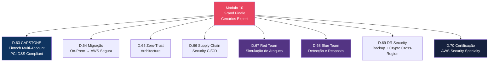
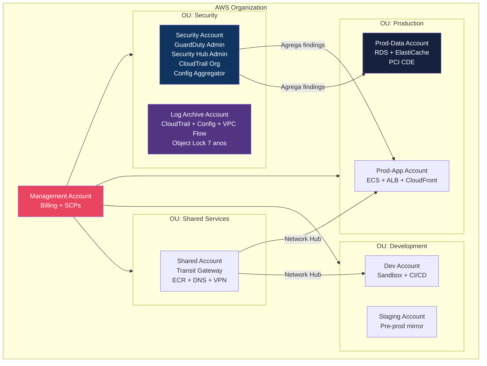
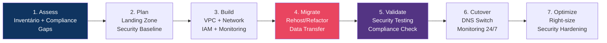
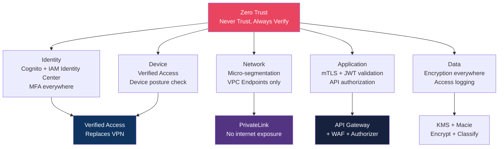
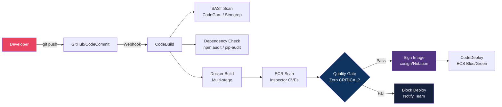

# Módulo 10 — Cenários Expert (Grand Finale)

> **Nível:** 400 (Expert)
> **Tempo Total Estimado:** 14-18 horas de labs
> **Custo Estimado:** ~$15-40
> **Objetivo do Módulo:** Aplicar TUDO que aprendemos nos módulos 01-09 em cenários reais de produção — fintech multi-account com PCI DSS, migração segura de on-premises, zero-trust architecture, supply chain security, exercícios Red Team/Blue Team e preparação para certificação AWS Security Specialty.

---

## Mapa do Módulo Final



---

## Desafio 63: CAPSTONE — Fintech Multi-Account (PCI DSS Compliant)

> **Level:** 400 | **Tempo:** 180 min | **Custo:** ~$10-20

### Objetivo

Projetar e implementar a **arquitetura de segurança completa** para uma fintech que processa pagamentos, atendendo PCI DSS, com multi-account governance e operações de segurança automatizadas.

### Requisitos de Negócio

```
Empresa: FinPay (fintech de pagamentos)
├── Processa 500k transações/dia
├── Dados de cartão de crédito (PCI DSS obrigatório)
├── 3 times de desenvolvimento (20 devs)
├── Regulação: BACEN, PCI DSS, LGPD
├── SLA: 99.99% disponibilidade
└── Budget de segurança: $15k/mês
```

### Arquitetura Multi-Account



### Security Stack Completo

```
┌──────────────────────────────────────────────────────────────────┐
│              FinPay Security Stack — PCI DSS                      │
│                                                                   │
│  Identity & Access:                                              │
│  ├── IAM Identity Center (SSO) — todos os devs                  │
│  ├── Permission Boundaries — devs não podem escalar              │
│  ├── MFA obrigatório (SCP enforced)                              │
│  ├── 4 níveis IAM (ReadOnly, Operator, Admin, SecurityAdmin)    │
│  └── Cross-account roles com External ID                         │
│                                                                   │
│  Detection & Monitoring:                                         │
│  ├── CloudTrail — org trail, log validation, 7 anos retenção    │
│  ├── GuardDuty — org-wide, auto-remediation HIGH+               │
│  ├── Security Hub — FSBP + PCI DSS standards enabled            │
│  ├── Inspector — ECR scan + EC2 scan + Lambda scan              │
│  ├── Config — 15+ managed rules + auto-remediation              │
│  └── Detective — investigação visual                             │
│                                                                   │
│  Infrastructure Protection:                                      │
│  ├── WAF — Common + SQLi + Bot Control + Rate Limit             │
│  ├── Shield Advanced — DDoS L3/L4/L7 + DRT                     │
│  ├── Network Firewall — domain filtering + IDS/IPS              │
│  ├── Firewall Manager — WAF centralizado cross-account          │
│  └── SGs micro-segmentados + NACLs defense in depth             │
│                                                                   │
│  Data Protection:                                                │
│  ├── KMS CMK — encryption at rest (EBS, S3, RDS, DynamoDB)     │
│  ├── ACM — TLS 1.2+ everywhere (in-transit)                     │
│  ├── Field-Level Encryption — dados de cartão no edge           │
│  ├── Secrets Manager — rotação automática 30 dias               │
│  ├── Macie — scan PII/PCI em S3 semanal                        │
│  ├── S3 Object Lock — logs e evidências imutáveis               │
│  └── CloudHSM Custom Key Store — PCI DSS FIPS 140-2 L3        │
│                                                                   │
│  Network Security:                                               │
│  ├── VPC 3 camadas (pública, privada, isolada/CDE)             │
│  ├── Transit Gateway com Inspection VPC                          │
│  ├── DNS Firewall — block malware + C&C                         │
│  ├── VPC Endpoints — S3, DDB, KMS, SSM, ECR                    │
│  ├── No SSH — SSM Session Manager only                          │
│  └── VPN Client para acesso administrativo                      │
│                                                                   │
│  Compliance & Governance:                                        │
│  ├── Control Tower — landing zone + guardrails                  │
│  ├── SCPs — deny root, deny disable security, region restrict   │
│  ├── Config Conformance Pack — PCI DSS                          │
│  ├── Audit Manager — PCI DSS assessment contínuo                │
│  └── Tag Policies + Backup Policies                              │
│                                                                   │
│  Incident Response:                                              │
│  ├── IR Plan documentado (NIST SP 800-61)                       │
│  ├── Step Functions playbooks (EC2, IAM, S3)                    │
│  ├── Conta Forensics isolada                                    │
│  ├── Game days mensais                                           │
│  └── Post-mortem template                                        │
│                                                                   │
│  Security Operations:                                            │
│  ├── Security Lake — centralização OCSF                         │
│  ├── OpenSearch SIEM — 4 dashboards                             │
│  ├── Threat hunting quinzenal (Athena)                          │
│  ├── ChatOps (Slack #security-alerts)                           │
│  └── Métricas: MTTD <5min, MTTC <15min, MTTR <4h              │
└──────────────────────────────────────────────────────────────────┘
```

### O Que Aprendemos

| Conceito | Detalhe |
|----------|---------|
| PCI DSS CDE | Cardholder Data Environment — conta separada (isolada) |
| Multi-account | 7 contas: mgmt, security, log, prod-app, prod-data, dev, staging |
| Defense in depth | Cada camada protege a seguinte |
| Automation | 80%+ de remediação automatizada |

---

## Desafio 64: Migração On-Prem → AWS Segura

> **Level:** 400 | **Tempo:** 120 min | **Custo:** ~$5

### Objetivo

Planejar uma **migração segura** de datacenter on-premises para AWS, mantendo compliance durante toda a transição.

### Fases da Migração Segura



### Security Checklist por Fase

| Fase | Security Actions |
|------|-----------------|
| **Assess** | Inventário de dados sensíveis, classificação, compliance requirements |
| **Plan** | Control Tower, SCPs, IAM, encryption strategy, network design |
| **Build** | VPC, CloudTrail, GuardDuty, Config, Security Hub, WAF |
| **Migrate** | Encrypted data transfer (TLS + KMS), DMS com encryption |
| **Validate** | Prowler scan, Config compliance, penetration test |
| **Cutover** | Monitoring 24/7, IR team on standby, rollback plan |
| **Optimize** | Access Analyzer unused access, right-size SGs, cost optimization |

---

## Desafio 65: Zero-Trust Architecture na AWS

> **Level:** 400 | **Tempo:** 120 min | **Custo:** ~$5

### Objetivo

Implementar **Zero-Trust Architecture** — nunca confiar, sempre verificar, em cada camada.

### Pilares Zero-Trust na AWS



### Zero-Trust vs Traditional

| Aspecto | Traditional | Zero-Trust |
|---------|------------|------------|
| Rede | VPN = confiável | Toda request verificada |
| Acesso | IP-based | Identity + device + context |
| Interno | Confiável (flat network) | Micro-segmentado |
| VPN | Obrigatório | Eliminado (Verified Access) |
| APIs | Rede interna = sem auth | Sempre autenticado + autorizado |
| Dados | Encrypt em trânsito | Encrypt em repouso + trânsito + uso |

---

## Desafio 66: Supply Chain Security — CI/CD Seguro

> **Level:** 400 | **Tempo:** 90 min | **Custo:** ~$2

### Objetivo

Implementar segurança na **pipeline de CI/CD** — scan de código, validação de dependências, imagens assinadas e deploy seguro.

### Pipeline Segura



### Security Gates

| Gate | Tool | Critério | Ação se falhar |
|------|------|---------|---------------|
| SAST | CodeGuru / Semgrep | Zero CRITICAL findings | Block merge |
| Dependencies | npm audit / pip-audit | Zero known vulnerabilities | Block merge |
| Container scan | Inspector / Trivy | Zero CRITICAL CVEs | Block deploy |
| Image signing | cosign / Notation | Image assinada | Block deploy |
| Secrets scan | git-secrets / TruffleHog | Zero secrets no código | Block merge |
| IaC scan | Checkov / tfsec | Zero HIGH findings | Block merge |

---

## Desafio 67: Red Team — Simulação de Ataques

> **Level:** 400 | **Tempo:** 120 min | **Custo:** ~$2

### Objetivo

Usar ferramentas de **Red Team** para simular ataques em sua infraestrutura AWS e testar as defesas.

### Ferramentas

```
┌──────────────────────────────────────────────────────────────────┐
│              Red Team — Ferramentas Open Source                    │
│                                                                   │
│  Prowler — Security assessment e CIS benchmark                   │
│  ├── Verifica 300+ checks de segurança                          │
│  ├── Suporta AWS, Azure, GCP                                    │
│  └── Output: JSON, HTML, CSV, S3                                 │
│                                                                   │
│  Pacu — AWS exploitation framework                               │
│  ├── Enumeração de IAM, EC2, S3, Lambda                         │
│  ├── Privilege escalation testing                                │
│  ├── Persistence techniques                                      │
│  └── ATENÇÃO: usar APENAS em contas autorizadas!                │
│                                                                   │
│  ScoutSuite — Multi-cloud security auditing                      │
│  ├── Visualização web dos resultados                             │
│  ├── Checks por serviço (IAM, S3, EC2, RDS, etc.)              │
│  └── Exporta relatórios                                          │
│                                                                   │
│  CloudMapper — Visualização de networking                        │
│  ├── Mapa visual da infraestrutura                               │
│  ├── Detecta recursos expostos publicamente                     │
│  └── Identifica SGs overly permissive                           │
└──────────────────────────────────────────────────────────────────┘
```

### Exercício Red Team

```bash
# 1. Prowler — assessment completo
pip install prowler
prowler aws --severity critical high --output-formats json html \
  --output-directory /tmp/prowler-results

# 2. Cenários de ataque para testar
# A) Credential exposure: colocar access key em repo público (conta de teste!)
# B) S3 data exfiltration: tentar acessar buckets com policy fraca
# C) Privilege escalation: user com IAM permissions tenta criar admin role
# D) Lateral movement: AssumeRole chain across accounts
# E) Persistence: criar backdoor user/role
```

---

## Desafio 68: Blue Team — Detecção e Resposta ao Red Team

> **Level:** 400 | **Tempo:** 120 min | **Custo:** ~$0

### Objetivo

Como **Blue Team**, detectar e responder a cada ataque do Red Team usando as ferramentas implementadas nos módulos anteriores.

### Matriz Red vs Blue

| Red Team Attack | Blue Team Detection | Blue Team Response |
|-----------------|--------------------|--------------------|
| Credential in GitHub | GuardDuty + GitHub alert | Disable key, revoke sessions, audit |
| S3 data exfiltration | CloudTrail + Macie | Block access, audit data accessed |
| Privilege escalation | CloudTrail IAM events | Revert changes, add permission boundary |
| Lateral movement | CloudTrail AssumeRole + Detective | Revoke sessions, update trust policies |
| Backdoor persistence | Config rule + Access Analyzer | Delete unauthorized resources |
| Crypto mining | GuardDuty CryptoCurrency finding | Isolate EC2, snapshot, terminate |

---

## Desafio 69: DR Security — Backup e Criptografia Cross-Region

> **Level:** 400 | **Tempo:** 90 min | **Custo:** ~$3

### Objetivo

Implementar **Disaster Recovery** com segurança — backups criptografados, KMS multi-region keys, e validação de integridade.

```hcl
# KMS Multi-Region Key para DR
resource "aws_kms_key" "dr_primary" {
  description  = "DR encryption key (primary)"
  multi_region = true
}

resource "aws_kms_replica_key" "dr_secondary" {
  provider        = aws.dr_region
  primary_key_arn = aws_kms_key.dr_primary.arn
  description     = "DR encryption key (replica)"
}

# AWS Backup com criptografia cross-region
resource "aws_backup_plan" "dr" {
  name = "dr-backup-plan"

  rule {
    rule_name         = "daily-with-dr-copy"
    target_vault_name = aws_backup_vault.primary.name
    schedule          = "cron(0 3 * * ? *)"

    lifecycle {
      delete_after = 35
    }

    copy_action {
      destination_vault_arn = aws_backup_vault.dr.arn
      lifecycle {
        delete_after = 35
      }
    }
  }
}

# Backup Vault com encryption e lock
resource "aws_backup_vault" "primary" {
  name        = "primary-vault"
  kms_key_arn = aws_kms_key.dr_primary.arn
}

resource "aws_backup_vault_lock_configuration" "primary" {
  backup_vault_name   = aws_backup_vault.primary.name
  min_retention_days  = 7
  max_retention_days  = 365
  changeable_for_days = 3  # Após 3 dias, lock é IMUTÁVEL
}
```

---

## Desafio 70: AWS Security Specialty (SCS-C02) — Prep e Próximos Passos

> **Level:** 400 | **Tempo:** 60 min | **Custo:** $0

### Objetivo

Revisar o que aprendemos, mapear para o exame **AWS Security Specialty (SCS-C02)** e definir próximos passos de carreira.

### Mapeamento Workshop → Exame

| Domínio SCS-C02 | % Exame | Módulos do Workshop |
|-----------------|---------|-------------------|
| Threat Detection and Incident Response | 14% | 02, 05 |
| Security Logging and Monitoring | 18% | 02, 09 |
| Infrastructure Security | 20% | 03, 07 |
| Identity and Access Management | 16% | 01 |
| Data Protection | 18% | 04 |
| Management and Security Governance | 14% | 06 |

### O Que Falta Estudar (além deste workshop)

```
□ AWS Well-Architected Security Pillar (leitura obrigatória)
□ AWS Security Whitepapers (KMS crypto, logging best practices)
□ AWS re:Invent sessions sobre Security (YouTube)
□ Prática com exam dumps (Tutorials Dojo, Jon Bonso)
□ Labs práticos repetidos (refazer os desafios sem consultar)
□ AWS Skill Builder (cursos oficiais gratuitos)
```

### Próximos Passos de Carreira

```
┌──────────────────────────────────────────────────────────────────┐
│              Trilha de Carreira em AWS Security                   │
│                                                                   │
│  Nível 1: Practitioner                                           │
│  ├── AWS Cloud Practitioner (CLF-C02)                           │
│  └── Este workshop: Módulos 01-04                                │
│                                                                   │
│  Nível 2: Associate                                              │
│  ├── AWS Solutions Architect Associate (SAA-C03)                │
│  └── Este workshop: Módulos 05-07                                │
│                                                                   │
│  Nível 3: Specialty                                              │
│  ├── AWS Security Specialty (SCS-C02) ← OBJETIVO                │
│  └── Este workshop: Módulos 08-10                                │
│                                                                   │
│  Nível 4: Professional                                           │
│  ├── AWS Solutions Architect Professional (SAP-C02)             │
│  ├── CISSP, OSCP (certificações de segurança)                   │
│  └── Contribuir com open source (Prowler, CloudCustodian)       │
└──────────────────────────────────────────────────────────────────┘
```

---

## Resumo do Módulo 10 e do Workshop

```
┌──────────────────────────────────────────────────────────────┐
│               WORKSHOP AWS SECURITY — COMPLETO                │
│                                                               │
│  70 desafios · 10 módulos · Level 100 → 400                 │
│                                                               │
│  Módulo 01: IAM & Identity (7 desafios)                      │
│  Módulo 02: Detection & Monitoring (7 desafios)              │
│  Módulo 03: Infrastructure Protection (7 desafios)           │
│  Módulo 04: Data Protection (7 desafios)                     │
│  Módulo 05: Incident Response (7 desafios)                   │
│  Módulo 06: Compliance & Governance (7 desafios)             │
│  Módulo 07: Network Security (7 desafios)                    │
│  Módulo 08: Application Security (6 desafios)                │
│  Módulo 09: Security Operations (7 desafios)                 │
│  Módulo 10: Cenários Expert (8 desafios)                     │
│                                                               │
│  De zero a referência técnica em segurança AWS.              │
└──────────────────────────────────────────────────────────────┘
```
