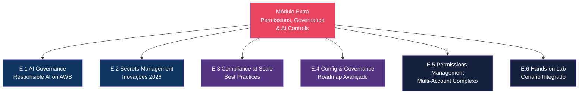
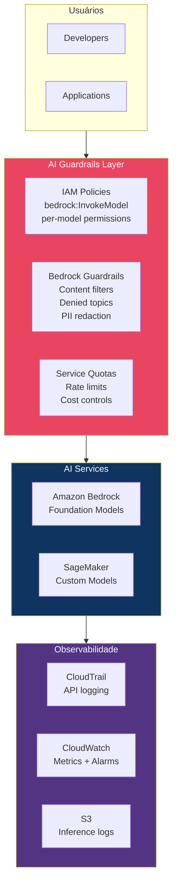
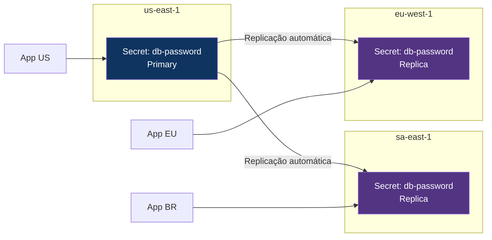
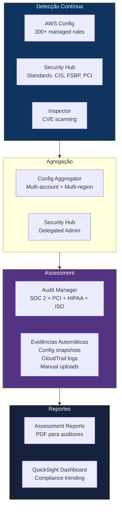
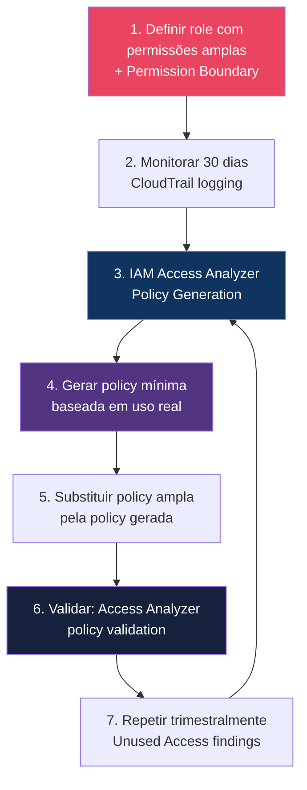

# Módulo Extra — Permissions, Governance & AI Controls

> **Nível:** 200-300 (Intermediate/Advanced)
> **Tempo Total Estimado:** 8-12 horas de labs
> **Custo Estimado:** ~$5-15
> **Contexto:** Conteúdo alinhado com o **AWS Security Excellence Day: Permissions, Governance & AI Controls** — evento da AWS focado em gestão de permissões em ambientes multi-account, guardrails organizacionais, governança de AI/ML e inovações em Secrets Manager.
> **Objetivo do Módulo:** Aprofundar em temas avançados de permissions management, governance at scale, AI governance e secrets management — indo além do básico coberto nos módulos anteriores.

---

## Mapa do Módulo



---

## E.1: AI Governance on AWS — Building Responsible and Scalable AI Systems

> **Level:** 300 | **Tempo:** 90 min | **Custo:** ~$2

### Objetivo

Implementar **governança de AI/ML** na AWS — controlar quem pode criar/usar modelos, quais dados podem ser usados para treinamento, logging de inferências, guardrails para prompts e respostas, e compliance de AI workloads.

### O Problema

```
┌──────────────────────────────────────────────────────────────────┐
│         AI sem Governança — O Que Pode Dar Errado                 │
│                                                                   │
│  1. Shadow AI: devs usando Bedrock/SageMaker sem aprovação       │
│  2. Data leakage: dados PII usados em treinamento sem controle   │
│  3. Model access: quem pode invocar qual modelo? sem IAM policy  │
│  4. Prompt injection: usuários extraindo dados do modelo         │
│  5. Output control: modelo gerando conteúdo impróprio            │
│  6. Cost explosion: inferência sem rate limit = conta surpresa   │
│  7. Audit: sem log de quem perguntou o quê ao modelo             │
│  8. Compliance: regulação exige explicabilidade e controle       │
└──────────────────────────────────────────────────────────────────┘
```

### Arquitetura de AI Governance



### IAM Policies para AI Services

```hcl
# Policy: Devs podem usar APENAS modelos aprovados
resource "aws_iam_policy" "ai_approved_models" {
  name = "AI-ApprovedModelsOnly"
  policy = jsonencode({
    Version = "2012-10-17"
    Statement = [
      {
        Sid    = "AllowApprovedModels"
        Effect = "Allow"
        Action = [
          "bedrock:InvokeModel",
          "bedrock:InvokeModelWithResponseStream"
        ]
        Resource = [
          "arn:aws:bedrock:*::foundation-model/anthropic.claude-3-5-sonnet-*",
          "arn:aws:bedrock:*::foundation-model/amazon.titan-text-*"
        ]
      },
      {
        Sid    = "DenyUnapprovedModels"
        Effect = "Deny"
        Action = [
          "bedrock:InvokeModel",
          "bedrock:InvokeModelWithResponseStream"
        ]
        NotResource = [
          "arn:aws:bedrock:*::foundation-model/anthropic.claude-3-5-sonnet-*",
          "arn:aws:bedrock:*::foundation-model/amazon.titan-text-*"
        ]
      },
      {
        Sid    = "DenyModelCustomization"
        Effect = "Deny"
        Action = [
          "bedrock:CreateModelCustomizationJob",
          "bedrock:CreateProvisionedModelThroughput"
        ]
        Resource = "*"
      },
      {
        Sid    = "AllowListModels"
        Effect = "Allow"
        Action = [
          "bedrock:ListFoundationModels",
          "bedrock:GetFoundationModel",
          "bedrock:ListGuardrails"
        ]
        Resource = "*"
      }
    ]
  })
}

# SCP: Bloquear AI services em contas não autorizadas
resource "aws_organizations_policy" "ai_restriction" {
  name = "RestrictAIServicesToApprovedAccounts"
  type = "SERVICE_CONTROL_POLICY"
  content = jsonencode({
    Version = "2012-10-17"
    Statement = [{
      Sid    = "DenyBedrockInNonAIAccounts"
      Effect = "Deny"
      Action = [
        "bedrock:*",
        "sagemaker:CreateEndpoint",
        "sagemaker:CreateModel",
        "sagemaker:CreateTrainingJob"
      ]
      Resource = "*"
      Condition = {
        StringNotEquals = {
          "aws:PrincipalOrgPaths" = [
            "o-org123/r-root/ou-ai-workloads/"
          ]
        }
      }
    }]
  })
}
```

### Bedrock Guardrails — Content Control

```bash
# Criar guardrail para controle de conteúdo
aws bedrock create-guardrail \
  --name "enterprise-ai-guardrail" \
  --description "Enterprise content and topic controls" \
  --content-policy-config '{
    "filtersConfig": [
      {"type": "SEXUAL", "inputStrength": "HIGH", "outputStrength": "HIGH"},
      {"type": "VIOLENCE", "inputStrength": "HIGH", "outputStrength": "HIGH"},
      {"type": "HATE", "inputStrength": "HIGH", "outputStrength": "HIGH"},
      {"type": "INSULTS", "inputStrength": "HIGH", "outputStrength": "HIGH"},
      {"type": "MISCONDUCT", "inputStrength": "HIGH", "outputStrength": "HIGH"},
      {"type": "PROMPT_ATTACK", "inputStrength": "HIGH", "outputStrength": "NONE"}
    ]
  }' \
  --topic-policy-config '{
    "topicsConfig": [
      {
        "name": "CompetitorInfo",
        "definition": "Questions about competitor products, pricing, or strategy",
        "examples": ["What does Azure offer?", "Compare AWS to GCP"],
        "type": "DENY"
      },
      {
        "name": "InternalFinancials",
        "definition": "Questions about company financial data, revenue, or costs",
        "examples": ["What is our revenue?", "How much does the company spend?"],
        "type": "DENY"
      }
    ]
  }' \
  --sensitive-information-policy-config '{
    "piiEntitiesConfig": [
      {"type": "EMAIL", "action": "ANONYMIZE"},
      {"type": "PHONE", "action": "ANONYMIZE"},
      {"type": "NAME", "action": "ANONYMIZE"},
      {"type": "US_SOCIAL_SECURITY_NUMBER", "action": "BLOCK"},
      {"type": "CREDIT_DEBIT_CARD_NUMBER", "action": "BLOCK"}
    ]
  }' \
  --blocked-input-messaging "Desculpe, não posso processar essa solicitação." \
  --blocked-output-messaging "Desculpe, não posso fornecer essa informação."
```

```hcl
# Terraform: Bedrock Guardrail
resource "aws_bedrock_guardrail" "enterprise" {
  name        = "enterprise-ai-guardrail"
  description = "Enterprise content, topic, and PII controls"

  blocked_input_messaging  = "Desculpe, não posso processar essa solicitação."
  blocked_output_messaging = "Desculpe, não posso fornecer essa informação."

  content_policy_config {
    filters_config {
      type            = "SEXUAL"
      input_strength  = "HIGH"
      output_strength = "HIGH"
    }
    filters_config {
      type            = "VIOLENCE"
      input_strength  = "HIGH"
      output_strength = "HIGH"
    }
    filters_config {
      type            = "HATE"
      input_strength  = "HIGH"
      output_strength = "HIGH"
    }
    filters_config {
      type            = "PROMPT_ATTACK"
      input_strength  = "HIGH"
      output_strength = "NONE"
    }
  }

  sensitive_information_policy_config {
    pii_entities_config {
      type   = "EMAIL"
      action = "ANONYMIZE"
    }
    pii_entities_config {
      type   = "CREDIT_DEBIT_CARD_NUMBER"
      action = "BLOCK"
    }
    pii_entities_config {
      type   = "US_SOCIAL_SECURITY_NUMBER"
      action = "BLOCK"
    }
  }

  topic_policy_config {
    topics_config {
      name       = "CompetitorInfo"
      definition = "Questions about competitor products or pricing"
      type       = "DENY"
      examples   = ["What does Azure offer?", "Compare AWS to GCP"]
    }
  }
}
```

### Logging de Inferências

```hcl
# Bedrock Model Invocation Logging
resource "aws_bedrock_model_invocation_logging_configuration" "main" {
  logging_config {
    embedding_data_delivery_enabled = true
    image_data_delivery_enabled     = true
    text_data_delivery_enabled      = true

    s3_config {
      bucket_name = aws_s3_bucket.ai_logs.id
      key_prefix  = "bedrock-invocations"
    }

    cloudwatch_config {
      log_group_name = aws_cloudwatch_log_group.bedrock.name
      role_arn       = aws_iam_role.bedrock_logging.arn

      large_data_delivery_s3_config {
        bucket_name = aws_s3_bucket.ai_logs.id
        key_prefix  = "bedrock-large-payloads"
      }
    }
  }
}

# Alarme: uso excessivo de AI (custo)
resource "aws_cloudwatch_metric_alarm" "bedrock_high_usage" {
  alarm_name          = "bedrock-high-invocation-rate"
  comparison_operator = "GreaterThanThreshold"
  evaluation_periods  = 1
  metric_name         = "Invocations"
  namespace           = "AWS/Bedrock"
  period              = 3600
  statistic           = "Sum"
  threshold           = 10000
  alarm_description   = "More than 10K Bedrock invocations in 1 hour"
  alarm_actions       = [aws_sns_topic.security_alerts.arn]
}
```

### CloudTrail: Auditar Uso de AI

```sql
-- Quem está usando Bedrock e quais modelos?
SELECT
    eventtime,
    useridentity.arn AS who,
    json_extract_scalar(requestparameters, '$.modelId') AS model,
    sourceipaddress,
    awsregion
FROM cloudtrail_logs
WHERE eventsource = 'bedrock.amazonaws.com'
  AND eventname = 'InvokeModel'
  AND year = '2026' AND month = '04'
ORDER BY eventtime DESC
LIMIT 50;

-- Guardrail blocks (tentativas bloqueadas)
SELECT
    eventtime,
    useridentity.arn AS who,
    json_extract_scalar(requestparameters, '$.guardrailIdentifier') AS guardrail,
    errorcode,
    errormessage
FROM cloudtrail_logs
WHERE eventsource = 'bedrock.amazonaws.com'
  AND errorcode IS NOT NULL
  AND year = '2026' AND month = '04'
ORDER BY eventtime DESC;

-- Shadow AI: uso não autorizado de AI services
SELECT
    useridentity.arn AS who,
    eventsource AS service,
    eventname,
    COUNT(*) AS calls
FROM cloudtrail_logs
WHERE eventsource IN ('bedrock.amazonaws.com', 'sagemaker.amazonaws.com')
  AND year = '2026' AND month = '04'
GROUP BY useridentity.arn, eventsource, eventname
ORDER BY calls DESC;
```

### O Que Aprendemos

| Conceito | Detalhe |
|----------|---------|
| AI IAM Policies | Controlar QUAIS modelos cada equipe pode usar (per-model ARN) |
| SCP para AI | Restringir AI services a contas/OUs específicas |
| Bedrock Guardrails | Content filters, denied topics, PII redaction, prompt attack detection |
| Invocation Logging | Log de TODAS as inferências (input + output) para auditoria |
| Cost controls | Service Quotas + CloudWatch alarms para prevenir surpresas |
| Shadow AI | Detectar uso não autorizado de AI services via CloudTrail |

> **💡 Expert Tip:** AI Governance é o tema mais quente de 2026. Reguladores (BACEN, LGPD, EU AI Act) estão exigindo controle sobre quais dados entram nos modelos e quais respostas saem. Bedrock Guardrails com PII anonymization é o mínimo — habilite invocation logging para ter audit trail completo de "quem perguntou o quê e o modelo respondeu o quê". Isso é ouro em auditorias de compliance.

---

## E.2: Innovating Secrets Management in 2026

> **Level:** 200 | **Tempo:** 90 min | **Custo:** ~$1

### Objetivo

Explorar funcionalidades avançadas e inovações do **AWS Secrets Manager** — multi-region secrets, rotação customizada, integração com containers e Lambda, batch retrieval e secrets replication.

### Multi-Region Secrets



```hcl
# Secret com replicação multi-region
resource "aws_secretsmanager_secret" "db_password" {
  name        = "prod/db/password"
  description = "Production database password with multi-region replication"

  replica {
    region = "sa-east-1"
  }
  replica {
    region = "eu-west-1"
  }
}

resource "aws_secretsmanager_secret_version" "db_password" {
  secret_id = aws_secretsmanager_secret.db_password.id
  secret_string = jsonencode({
    username = "app_user"
    password = random_password.db.result
    engine   = "postgres"
    host     = aws_rds_cluster.main.endpoint
    port     = 5432
  })
}

resource "random_password" "db" {
  length  = 32
  special = true
}

# Rotação automática com Lambda managed pela AWS
resource "aws_secretsmanager_secret_rotation" "db_password" {
  secret_id           = aws_secretsmanager_secret.db_password.id
  rotation_lambda_arn = "arn:aws:lambda:us-east-1:${data.aws_caller_identity.current.account_id}:function:SecretsManagerRDSPostgreSQLRotation"

  rotation_rules {
    automatically_after_days = 30
    schedule_expression      = "rate(30 days)"
  }
}
```

### Batch Retrieval (Performance)

```python
"""Buscar múltiplos secrets em uma única chamada."""
import boto3

client = boto3.client('secretsmanager')

def get_batch_secrets(secret_ids: list[str]) -> dict:
    """
    Busca múltiplos secrets em batch.
    Máximo 20 secrets por chamada.
    """
    response = client.batch_get_secret_value(
        SecretIdList=secret_ids
    )

    secrets = {}
    for secret in response.get('SecretValues', []):
        secrets[secret['Name']] = secret['SecretString']

    # Verificar erros
    for error in response.get('Errors', []):
        print(f"Error fetching {error['SecretId']}: {error['ErrorCode']}")

    return secrets


# Uso: buscar 5 secrets em 1 API call (vs 5 calls individuais)
all_secrets = get_batch_secrets([
    'prod/db/password',
    'prod/api/stripe-key',
    'prod/api/sendgrid-key',
    'prod/cache/redis-auth',
    'prod/mq/rabbitmq-creds'
])
```

### Container Integration (ECS + Secrets Manager)

```hcl
# ECS Task Definition com secrets do Secrets Manager
resource "aws_ecs_task_definition" "app" {
  family                   = "app"
  requires_compatibilities = ["FARGATE"]
  network_mode             = "awsvpc"
  cpu                      = "512"
  memory                   = "1024"
  execution_role_arn       = aws_iam_role.ecs_execution.arn
  task_role_arn            = aws_iam_role.ecs_task.arn

  container_definitions = jsonencode([{
    name  = "app"
    image = "${aws_ecr_repository.app.repository_url}:latest"

    secrets = [
      {
        name      = "DB_PASSWORD"
        valueFrom = aws_secretsmanager_secret.db_password.arn
      },
      {
        name      = "STRIPE_KEY"
        valueFrom = "${aws_secretsmanager_secret.stripe.arn}:api_key::"
      },
      {
        name      = "REDIS_AUTH"
        valueFrom = "${aws_secretsmanager_secret.redis.arn}:auth_token::"
      }
    ]

    # NÃO usar environment para secrets!
    environment = [
      { name = "APP_ENV", value = "production" },
      { name = "LOG_LEVEL", value = "info" }
    ]
  }])
}
```

### Lambda Extension (Cache Layer)

```bash
# Lambda com Secrets Manager extension (cache automático)
# A extension cacheia secrets localmente, reduzindo latência e API calls

aws lambda update-function-configuration \
  --function-name my-function \
  --layers "arn:aws:lambda:us-east-1:177933569100:layer:AWS-Parameters-and-Secrets-Lambda-Extension:11" \
  --environment '{
    "Variables": {
      "SECRETS_MANAGER_TTL": "300",
      "PARAMETERS_SECRETS_EXTENSION_LOG_LEVEL": "info"
    }
  }'
```

```python
# Na Lambda, buscar secret via localhost (extension)
import urllib.request
import json

def get_secret_from_extension(secret_name):
    """Busca secret via extension local (cacheia automaticamente)."""
    headers = {"X-Aws-Parameters-Secrets-Token": os.environ['AWS_SESSION_TOKEN']}
    url = f"http://localhost:2773/secretsmanager/get?secretId={secret_name}"
    req = urllib.request.Request(url, headers=headers)
    response = urllib.request.urlopen(req)
    return json.loads(response.read())['SecretString']
```

### O Que Aprendemos

| Conceito | Detalhe |
|----------|---------|
| Multi-region secrets | Replicação automática para DR e latência local |
| Batch retrieval | 20 secrets em 1 API call (vs 20 calls) |
| Container integration | ECS `secrets` block — injeção em runtime, não em env vars |
| Lambda extension | Cache layer local — reduz latência de ~50ms para ~1ms |
| Rotation schedule | `schedule_expression` para controle fino |

> **💡 Expert Tip:** A inovação mais impactante em Secrets Manager é o batch retrieval. Apps que buscam 5-10 secrets no startup agora fazem 1 API call em vez de 10. Isso reduz cold start de Lambda e startup de containers significativamente. Combine com a Lambda extension para cache local e você tem latência de <1ms para secrets.

---

## E.3: Best Practices for Compliance at Scale

> **Level:** 300 | **Tempo:** 90 min | **Custo:** ~$2

### Objetivo

Implementar **compliance at scale** — conformance packs, Config aggregation, Audit Manager assessment contínuo e evidências automáticas para múltiplos frameworks simultaneamente.

### Compliance Pipeline



### Conformance Packs

```hcl
# Config Conformance Pack: CIS AWS Foundations
resource "aws_config_conformance_pack" "cis" {
  name = "CIS-AWS-Foundations-Benchmark"

  template_s3_uri = "s3://aws-config-conformance-pack-templates/Operational-Best-Practices-for-CIS-AWS-v1.4-Level1.yaml"
}

# Config Conformance Pack: PCI DSS
resource "aws_config_conformance_pack" "pci" {
  name = "PCI-DSS-Operational-Best-Practices"

  template_s3_uri = "s3://aws-config-conformance-pack-templates/Operational-Best-Practices-for-PCI-DSS.yaml"
}

# Custom Conformance Pack: empresa-specific
resource "aws_config_conformance_pack" "company" {
  name = "Company-Security-Baseline"

  template_body = <<-YAML
    Parameters:
      MaxAccessKeyAge:
        Type: String
        Default: "90"
    Resources:
      AccessKeysRotated:
        Type: AWS::Config::ConfigRule
        Properties:
          ConfigRuleName: access-keys-rotated
          Source:
            Owner: AWS
            SourceIdentifier: ACCESS_KEYS_ROTATED
          InputParameters:
            maxAccessKeyAge: !Ref MaxAccessKeyAge
      RootMFA:
        Type: AWS::Config::ConfigRule
        Properties:
          ConfigRuleName: root-account-mfa-enabled
          Source:
            Owner: AWS
            SourceIdentifier: ROOT_ACCOUNT_MFA_ENABLED
      S3Encrypted:
        Type: AWS::Config::ConfigRule
        Properties:
          ConfigRuleName: s3-bucket-server-side-encryption-enabled
          Source:
            Owner: AWS
            SourceIdentifier: S3_BUCKET_SERVER_SIDE_ENCRYPTION_ENABLED
      GuardDutyEnabled:
        Type: AWS::Config::ConfigRule
        Properties:
          ConfigRuleName: guardduty-enabled-centralized
          Source:
            Owner: AWS
            SourceIdentifier: GUARDDUTY_ENABLED_CENTRALIZED
  YAML
}
```

### Compliance Score Query

```bash
# Score por conformance pack
aws configservice get-conformance-pack-compliance-summary \
  --conformance-pack-names "CIS-AWS-Foundations-Benchmark" "PCI-DSS-Operational-Best-Practices" \
  --output table

# Detalhes de non-compliance
aws configservice get-conformance-pack-compliance-details \
  --conformance-pack-name "CIS-AWS-Foundations-Benchmark" \
  --filters '{"ComplianceType":"NON_COMPLIANT"}' \
  --query 'ConformancePackRuleEvaluationResults[].{
    Rule:EvaluationResultIdentifier.EvaluationResultQualifier.ConfigRuleName,
    Resource:EvaluationResultIdentifier.EvaluationResultQualifier.ResourceId,
    Status:ComplianceType
  }' --output table
```

### O Que Aprendemos

| Conceito | Detalhe |
|----------|---------|
| Conformance Pack | Conjunto de Config rules pré-empacotadas para um framework |
| Multi-framework | CIS + PCI + HIPAA + custom rodando simultaneamente |
| Config Aggregator | Visão cross-account e cross-region de compliance |
| Audit Manager | Coleta evidências automaticamente para auditorias |
| Compliance trending | Dashboard mostrando evolução do compliance score |

---

## E.4: Config & Governance Roadmap — Avançado

> **Level:** 300 | **Tempo:** 90 min | **Custo:** ~$1

### Objetivo

Explorar funcionalidades avançadas de **AWS Config** e **Organizations governance** — proactive compliance, custom policy rules com Guard DSL, e Organization-level Config rules.

### Config Custom Policy Rules (Guard DSL)

```hcl
# Custom rule usando AWS CloudFormation Guard (sem Lambda!)
resource "aws_config_config_rule" "ec2_imdsv2_guard" {
  name = "ec2-imdsv2-required"

  source {
    owner = "CUSTOM_POLICY"

    source_detail {
      message_type = "ConfigurationItemChangeNotification"
    }

    # Guard DSL — declarativo, sem código
    custom_policy_details {
      policy_runtime = "guard-2.x.x"
      policy_text    = <<-GUARD
        rule ec2_imdsv2_check when
          resourceType == "AWS::EC2::Instance" {
            configuration.metadataOptions.httpTokens == "required"
            configuration.metadataOptions.httpEndpoint == "enabled"
          }
      GUARD
    }
  }

  scope {
    compliance_resource_types = ["AWS::EC2::Instance"]
  }
}

# Proactive compliance: avaliar ANTES de criar
resource "aws_config_config_rule" "s3_encryption_proactive" {
  name = "s3-encryption-proactive"

  source {
    owner = "CUSTOM_POLICY"

    source_detail {
      message_type = "ConfigurationItemChangeNotification"
    }

    custom_policy_details {
      policy_runtime     = "guard-2.x.x"
      enable_debug_log_delivery = true
      policy_text = <<-GUARD
        rule s3_encryption_required when
          resourceType == "AWS::S3::Bucket" {
            configuration.serverSideEncryptionConfiguration.rules[*].applyServerSideEncryptionByDefault.sseAlgorithm IN ["aws:kms", "AES256"]
          }
      GUARD
    }
  }
}

# Organization-level Config rule (aplica em TODAS as contas)
resource "aws_config_organization_managed_rule" "s3_public" {
  name            = "org-s3-bucket-public-read-prohibited"
  rule_identifier = "S3_BUCKET_PUBLIC_READ_PROHIBITED"
}

resource "aws_config_organization_managed_rule" "ebs_encrypted" {
  name            = "org-encrypted-volumes"
  rule_identifier = "ENCRYPTED_VOLUMES"
}
```

### O Que Aprendemos

| Conceito | Detalhe |
|----------|---------|
| Guard DSL | Config rules declarativas sem Lambda (mais simples e rápidas) |
| Proactive compliance | Avaliar compliance ANTES de criar o recurso |
| Organization rules | Config rules aplicadas em TODAS as contas automaticamente |
| Custom policy | Qualquer lógica de compliance sem escrever código |

---

## E.5: Permissions Management — Multi-Account Complexo

> **Level:** 300 | **Tempo:** 90 min | **Custo:** $0

### Objetivo

Gerenciar **permissões em escala** em ambientes multi-account complexos — IAM Access Analyzer para unused permissions, permission boundaries dinâmicas e least privilege iterativo.

### Fluxo de Least Privilege Iterativo



```bash
# 1. Gerar policy baseada em atividade real
aws accessanalyzer start-policy-generation \
  --policy-generation-details '{
    "principalArn": "arn:aws:iam::'$ACCOUNT_ID':role/ECS-AppTask-Role",
    "cloudTrailDetails": {
      "trailArn": "arn:aws:cloudtrail:us-east-1:'$ACCOUNT_ID':trail/security-audit",
      "startTime": "2026-01-01T00:00:00Z",
      "endTime": "2026-04-01T00:00:00Z",
      "accessRole": "arn:aws:iam::'$ACCOUNT_ID':role/AccessAnalyzerRole"
    }
  }'

# 2. Verificar unused access (roles, permissions, keys sem uso)
aws accessanalyzer list-findings-v2 \
  --analyzer-arn "arn:aws:access-analyzer:us-east-1:$ACCOUNT_ID:analyzer/unused-access" \
  --filter '{"findingType":{"eq":["UnusedPermission"]}}' \
  --query 'findings[].{
    Resource:resource,
    Type:findingType,
    Details:findingDetails
  }' --output table

# 3. Validar policy antes de aplicar
aws accessanalyzer validate-policy \
  --policy-type IDENTITY_POLICY \
  --policy-document file://generated-policy.json \
  --query 'findings[].{
    Type:findingType,
    Issue:issueCode,
    Message:findingDetails
  }' --output table
```

### O Que Aprendemos

| Conceito | Detalhe |
|----------|---------|
| Policy Generation | IAM Access Analyzer gera policy mínima baseada em CloudTrail |
| Unused Access | Detecta permissions, roles e keys sem uso por 90+ dias |
| Policy Validation | Verifica erros e best practices antes de aplicar |
| Iterativo | Não é um evento — é um processo contínuo (trimestral) |

> **💡 Expert Tip:** O fluxo mais efetivo para least privilege: comece com permissões amplas + permission boundary (teto), monitore 30 dias, use Access Analyzer para gerar a policy mínima, e substitua. Isso é 10x mais rápido que tentar adivinhar as permissões corretas. Repita trimestralmente para remover permissões que não são mais usadas.

---

## E.6: Hands-on Lab — Cenário Integrado

> **Level:** 300 | **Tempo:** 120 min | **Custo:** ~$5

### Objetivo

Lab prático que integra TODOS os temas do módulo — configurar AI governance, secrets management, compliance e permissions em um cenário realista de empresa.

### Cenário

```
Empresa: DataInsight (startup de AI/analytics)
├── 3 contas AWS (dev, staging, prod)
├── Usa Amazon Bedrock para analytics com AI
├── Processa dados de clientes (LGPD)
├── 5 desenvolvedores, 2 de segurança
└── Precisa de: SOC 2 compliance, AI governance, secrets rotation
```

### Tarefas do Lab

```
1. PERMISSIONS (30 min)
   □ Criar Permission Boundary para desenvolvedores
   □ Criar IAM policy para Bedrock (apenas modelos aprovados)
   □ Criar SCP bloqueando Bedrock em conta dev
   □ Configurar Access Analyzer (external + unused)

2. SECRETS MANAGEMENT (20 min)
   □ Criar secret multi-region para DB
   □ Habilitar rotação automática (30 dias)
   □ Integrar com ECS task definition (secrets block)
   □ Criar alarme para rotação falhada

3. AI GOVERNANCE (30 min)
   □ Criar Bedrock Guardrail (PII redaction + topic control)
   □ Habilitar invocation logging (S3 + CloudWatch)
   □ Criar alarme de uso excessivo
   □ Query CloudTrail: quem está usando quais modelos

4. COMPLIANCE (20 min)
   □ Deploy conformance pack CIS
   □ Criar Config organization rule (S3 encryption)
   □ Verificar compliance score
   □ Criar Audit Manager assessment (SOC 2)

5. VALIDAÇÃO (20 min)
   □ Testar: dev tenta usar modelo não aprovado → DENY
   □ Testar: Guardrail bloqueia PII no prompt
   □ Testar: secret é rotacionado automaticamente
   □ Testar: Config detecta S3 sem encryption
   □ Verificar: Security Hub aggregation funciona
```

### Validação Final

```bash
# 1. Permission Boundary funciona?
aws iam simulate-principal-policy \
  --policy-source-arn "arn:aws:iam::$ACCOUNT_ID:user/dev-user" \
  --action-names "bedrock:InvokeModel" \
  --resource-arns "arn:aws:bedrock:us-east-1::foundation-model/meta.llama*" \
  --output text
# Esperado: implicitDeny (modelo não aprovado)

# 2. Guardrail bloqueia PII?
aws bedrock-runtime invoke-model \
  --model-id "anthropic.claude-3-5-sonnet-20241022-v2:0" \
  --guardrail-identifier "GUARDRAIL_ID" \
  --guardrail-version "DRAFT" \
  --body '{"messages":[{"role":"user","content":"O CPF do cliente é 123.456.789-00, qual o status?"}]}' \
  --content-type "application/json" \
  /tmp/response.json
cat /tmp/response.json | jq .
# Esperado: CPF anonimizado ou bloqueado

# 3. Compliance score
aws configservice get-conformance-pack-compliance-summary \
  --conformance-pack-names "CIS-AWS-Foundations-Benchmark" \
  --output table

# 4. Secrets rotation status
aws secretsmanager describe-secret \
  --secret-id "prod/db/password" \
  --query '{RotationEnabled:RotationEnabled,NextRotation:NextRotationDate,LastRotated:LastRotatedDate}' \
  --output table
```

### O Que Aprendemos (Módulo Completo)

| Tema | Detalhe |
|------|---------|
| AI Governance | IAM per-model, SCP per-OU, Guardrails, invocation logging |
| Secrets Management | Multi-region, batch retrieval, container integration, Lambda extension |
| Compliance at Scale | Conformance packs, org-level rules, Audit Manager multi-framework |
| Config Advanced | Guard DSL (sem Lambda), proactive compliance, org rules |
| Permissions Management | Policy generation, unused access, iterative least privilege |

> **💡 Expert Tip:** Os temas deste módulo — AI governance, permissions at scale e compliance automation — são os que mais aparecem em conversas com CISOs em 2026. A combinação de Bedrock Guardrails + Config Conformance Packs + Access Analyzer Policy Generation resolve 80% dos desafios de segurança em empresas que estão adotando AI. Se você domina esses três, está à frente de 95% do mercado.

---

## Resumo

```
┌──────────────────────────────────────────────────────────────┐
│          MÓDULO EXTRA — CONQUISTAS                            │
│                                                               │
│  ✅ E.1: AI Governance                                       │
│     IAM per-model, Guardrails, PII redaction, logging        │
│                                                               │
│  ✅ E.2: Secrets Management 2026                             │
│     Multi-region, batch retrieval, container integration     │
│                                                               │
│  ✅ E.3: Compliance at Scale                                 │
│     Conformance packs, multi-framework, evidence automation  │
│                                                               │
│  ✅ E.4: Config & Governance Advanced                        │
│     Guard DSL, proactive compliance, org-level rules         │
│                                                               │
│  ✅ E.5: Permissions Management                              │
│     Policy generation, unused access, iterative least priv   │
│                                                               │
│  ✅ E.6: Hands-on Lab Integrado                              │
│     Cenário completo: AI + secrets + compliance + perms      │
└──────────────────────────────────────────────────────────────┘
```
