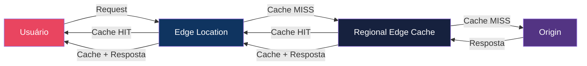
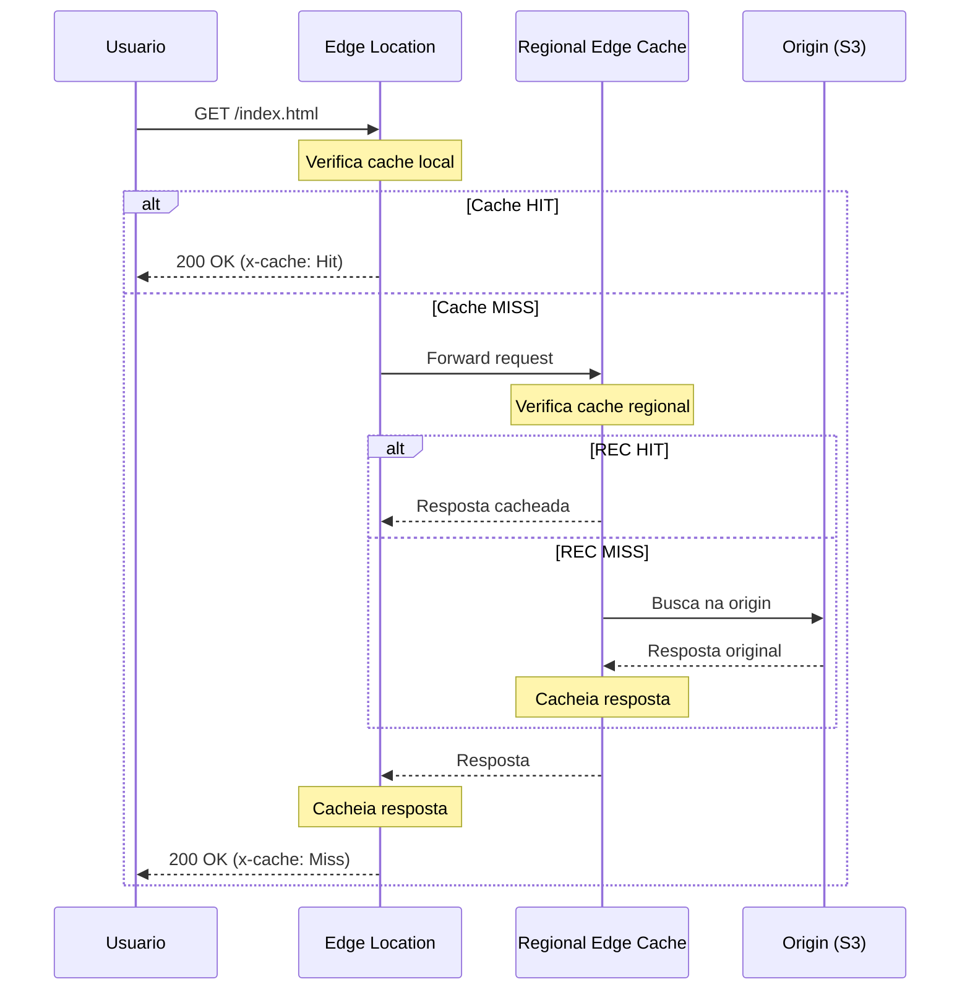
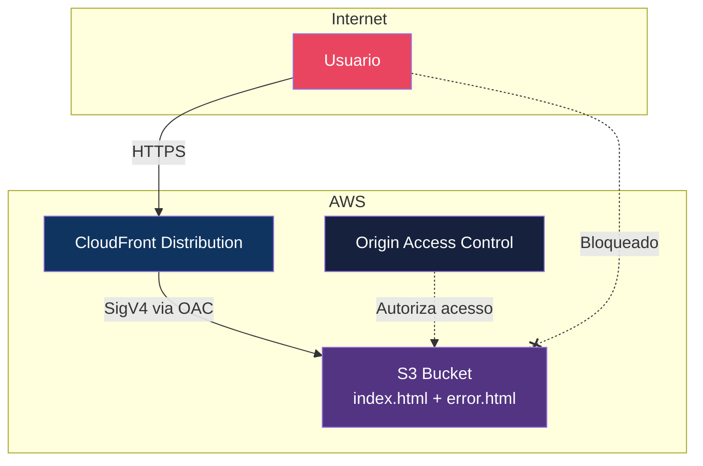
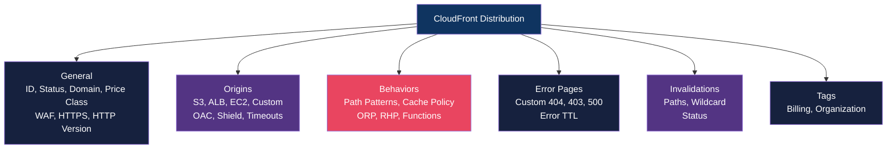
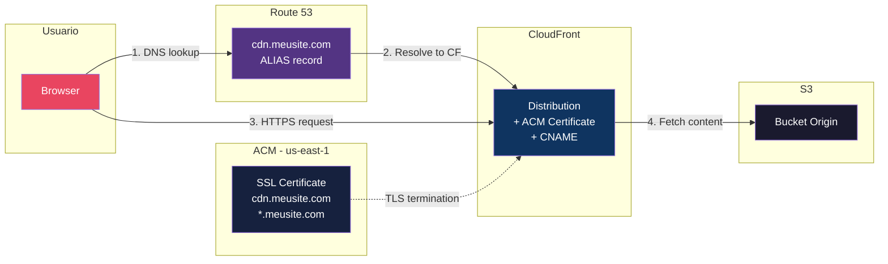
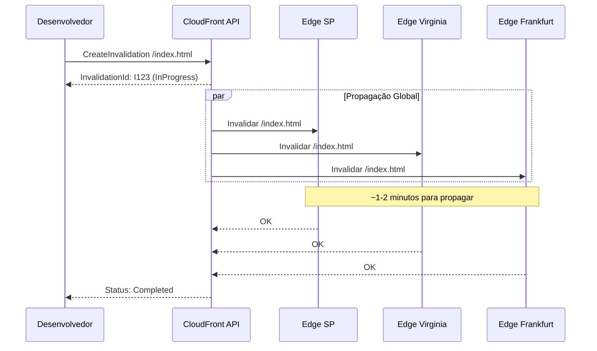
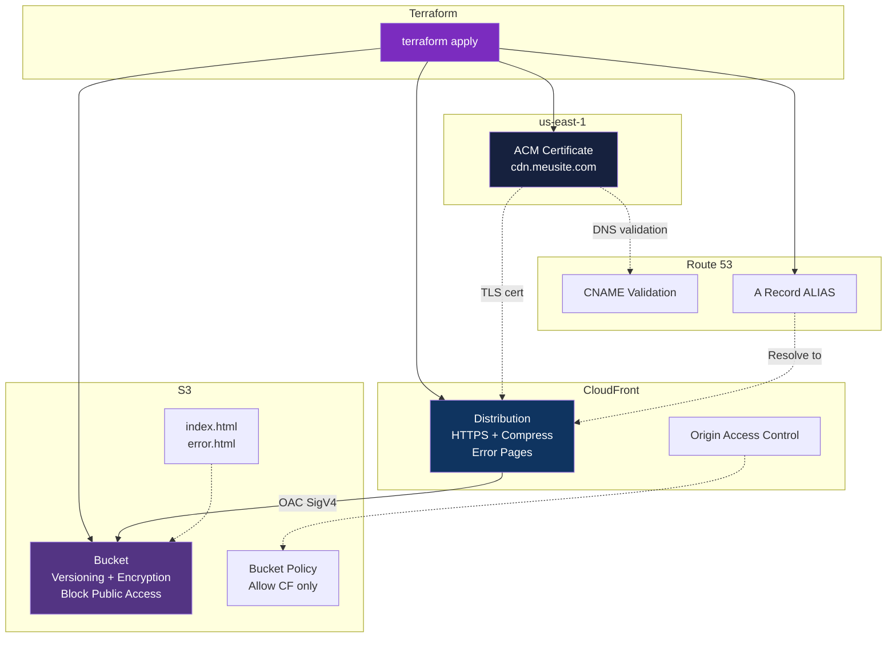

# Módulo 01 — Fundamentos do Amazon CloudFront

> **Nível:** Iniciante
> **Objetivo do Módulo:** Entender o que é CloudFront, como funciona a rede de edge locations, criar sua primeira distribuição e dominar os conceitos essenciais que sustentam todo o resto.

---

## Conceitos-Chave Antes de Começar

### O que é Amazon CloudFront?

Amazon CloudFront é uma **Content Delivery Network (CDN)** global da AWS. Ele distribui conteúdo (páginas web, vídeos, APIs, arquivos estáticos) através de uma rede de **750+ edge locations** em 90+ cidades ao redor do mundo.

### Por que usar CloudFront?

- **Latência baixa** — Conteúdo entregue do edge mais próximo do usuário
- **Alta disponibilidade** — Rede distribuída globalmente com failover automático
- **Segurança** — Integração nativa com AWS Shield, WAF, ACM
- **Custo** — Reduz carga na origin, diminuindo custos de transferência
- **Flexibilidade** — Suporta conteúdo estático, dinâmico, streaming, WebSocket

### Arquitetura CloudFront



- **Edge Location**: Ponto de presenca mais proximo do usuario (~750+)
- **Regional Edge Cache (REC)**: Cache intermediario entre edge e origin (~13 locais)
- **Origin**: Servidor de origem do conteudo (S3, ALB, EC2, Custom)

### Fluxo de uma Requisicao



---

## Desafio 1: Sua Primeira Distribuição CloudFront com S3

### Objetivo
Criar um bucket S3, hospedar um site estático e servir via CloudFront.

### Contexto
Este é o caso de uso mais clássico do CloudFront: servir conteúdo estático a partir do S3. Todo profissional AWS precisa saber fazer isso de olhos fechados.

### Requisitos
- AWS CLI configurada
- Conta AWS ativa

### O Que Vamos Construir



### Passo a Passo

#### 1. Criar o Bucket S3

```bash
# Criar bucket (substitua pelo seu nome unico)
aws s3 mb s3://meu-site-cloudfront-lab-001 --region us-east-1
```

Crie o arquivo `index.html` para a pagina principal:

```html
<!DOCTYPE html>
<html lang="pt-BR">
<head>
    <meta charset="UTF-8">
    <title>CloudFront Lab</title>
    <style>
        body { font-family: Arial, sans-serif; text-align: center; padding: 50px; background: #1a1a2e; color: #eee; }
        h1 { color: #e94560; }
        .info { background: #16213e; padding: 20px; border-radius: 10px; margin: 20px auto; max-width: 600px; }
    </style>
</head>
<body>
    <h1>CloudFront Lab - Desafio 1</h1>
    <div class="info">
        <p>Se voce esta vendo esta pagina, sua distribuicao CloudFront esta funcionando!</p>
        <p>Timestamp: <span id="ts"></span></p>
    </div>
    <script>document.getElementById('ts').textContent = new Date().toISOString();</script>
</body>
</html>
```

Crie o arquivo `error.html` para paginas de erro:

```html
<!DOCTYPE html>
<html>
<head><title>Erro</title></head>
<body><h1>Ops! Pagina nao encontrada.</h1></body>
</html>
```

Faca o upload dos arquivos para o S3:

```bash
aws s3 cp index.html s3://meu-site-cloudfront-lab-001/index.html --content-type "text/html"
aws s3 cp error.html s3://meu-site-cloudfront-lab-001/error.html --content-type "text/html"
```

#### 2. Criar a Distribuição CloudFront via CLI

```bash
# Criar a distribuição com OAC (Origin Access Control) — método moderno
# Primeiro, cria o OAC
aws cloudfront create-origin-access-control \
    --origin-access-control-config '{
        "Name": "S3-OAC-Lab",
        "Description": "OAC para bucket S3 do lab",
        "SigningProtocol": "sigv4",
        "SigningBehavior": "always",
        "OriginAccessControlOriginType": "s3"
    }'

# Anote o Id retornado, ex: E1XXXXXXXXXX
# Agora crie a distribuição (substitua OAC_ID pelo Id acima)

aws cloudfront create-distribution \
    --distribution-config '{
        "CallerReference": "lab-desafio-1-'$(date +%s)'",
        "Comment": "Desafio 1 - Site Estatico S3",
        "Enabled": true,
        "DefaultRootObject": "index.html",
        "Origins": {
            "Quantity": 1,
            "Items": [
                {
                    "Id": "S3-meu-site",
                    "DomainName": "meu-site-cloudfront-lab-001.s3.us-east-1.amazonaws.com",
                    "OriginAccessControlId": "OAC_ID_AQUI",
                    "S3OriginConfig": {
                        "OriginAccessIdentity": ""
                    }
                }
            ]
        },
        "DefaultCacheBehavior": {
            "TargetOriginId": "S3-meu-site",
            "ViewerProtocolPolicy": "redirect-to-https",
            "AllowedMethods": {
                "Quantity": 2,
                "Items": ["GET", "HEAD"]
            },
            "CachePolicyId": "658327ea-f89d-4fab-a63d-7e88639e58f6",
            "Compress": true
        },
        "PriceClass": "PriceClass_100",
        "ViewerCertificate": {
            "CloudFrontDefaultCertificate": true
        },
        "CustomErrorResponses": {
            "Quantity": 1,
            "Items": [
                {
                    "ErrorCode": 404,
                    "ResponsePagePath": "/error.html",
                    "ResponseCode": "404",
                    "ErrorCachingMinTTL": 300
                }
            ]
        }
    }'
```

> **Nota sobre PriceClass:**
> - `PriceClass_100` — Apenas edge locations mais baratas (EUA, Canadá, Europa) — mais econômico
> - `PriceClass_200` — Inclui Ásia, África, Oriente Médio
> - `PriceClass_All` — Todas as edge locations globalmente

> **Nota sobre CachePolicyId:**
> - `658327ea-f89d-4fab-a63d-7e88639e58f6` = **CachingOptimized** (policy managed da AWS)
> - Ideal para conteúdo estático: TTL padrão de 24h, compressão habilitada

#### 3. Configurar a Bucket Policy para o OAC

```bash
# Obter o ID da distribuição (será algo como E1ABCDEF123456)
DIST_ID=$(aws cloudfront list-distributions \
    --query "DistributionList.Items[?Comment=='Desafio 1 - Site Estatico S3'].Id" \
    --output text)

echo "Distribution ID: $DIST_ID"

# Obter o ARN da distribuição
DIST_ARN=$(aws cloudfront list-distributions \
    --query "DistributionList.Items[?Comment=='Desafio 1 - Site Estatico S3'].ARN" \
    --output text)

# Aplicar bucket policy
cat > bucket-policy.json << EOF
{
    "Version": "2012-10-17",
    "Statement": [
        {
            "Sid": "AllowCloudFrontServicePrincipalReadOnly",
            "Effect": "Allow",
            "Principal": {
                "Service": "cloudfront.amazonaws.com"
            },
            "Action": "s3:GetObject",
            "Resource": "arn:aws:s3:::meu-site-cloudfront-lab-001/*",
            "Condition": {
                "StringEquals": {
                    "AWS:SourceArn": "$DIST_ARN"
                }
            }
        }
    ]
}
EOF

aws s3api put-bucket-policy \
    --bucket meu-site-cloudfront-lab-001 \
    --policy file://bucket-policy.json
```

### Como Testar

```bash
# 1. Verificar status da distribuição (leva ~5-10 min para ficar "Deployed")
aws cloudfront get-distribution --id $DIST_ID \
    --query "Distribution.Status"

# 2. Obter o domain name da distribuição
DOMAIN=$(aws cloudfront get-distribution --id $DIST_ID \
    --query "Distribution.DomainName" --output text)
echo "URL: https://$DOMAIN"

# 3. Testar com curl
curl -I "https://$DOMAIN"

# Verificar nos headers:
# x-cache: Hit from cloudfront  (se já foi cacheado)
# x-cache: Miss from cloudfront (primeira request)
# x-amz-cf-pop: GRU50-C1        (edge location que serviu - ex: Guarulhos)
# age: 123                       (tempo em cache em segundos)

# 4. Testar cache — faça a mesma request 2x
curl -s -o /dev/null -w "HTTP Status: %{http_code}\nTempo: %{time_total}s\n" "https://$DOMAIN"
# Primeira: Miss (mais lento)
curl -s -o /dev/null -w "HTTP Status: %{http_code}\nTempo: %{time_total}s\n" "https://$DOMAIN"
# Segunda: Hit (mais rápido!)

# 5. Verificar headers detalhados
curl -v "https://$DOMAIN" 2>&1 | grep -E "(< x-cache|< x-amz-cf|< age|< server)"

# 6. Testar acesso direto ao S3 (deve FALHAR — bloqueado pelo OAC)
curl -I "https://meu-site-cloudfront-lab-001.s3.us-east-1.amazonaws.com/index.html"
# Deve retornar 403 Forbidden — conteúdo só acessível via CloudFront!
```

### O Que Aprendemos

| Conceito | Descrição |
|----------|-----------|
| **Distribution** | Recurso principal do CloudFront — define origins, behaviors, settings |
| **Origin** | De onde o CloudFront busca o conteúdo (S3 neste caso) |
| **OAC** | Origin Access Control — forma segura de dar acesso do CF ao S3 |
| **Edge Location** | Ponto de presença que serve o conteúdo ao usuário |
| **Cache HIT/MISS** | Se o conteúdo estava ou não em cache no edge |
| **PriceClass** | Controla quais edge locations são usadas (custo vs alcance) |
| **DefaultRootObject** | Arquivo servido quando acessam a raiz `/` |
| **CachePolicyId** | Policy que define como o cache se comporta (TTL, headers, etc) |
| **ViewerProtocolPolicy** | Controla se aceita HTTP, HTTPS ou redireciona |

### Troubleshooting

| Problema | Causa | Solução |
|----------|-------|---------|
| 403 Access Denied via CloudFront | Bucket policy não aplicada | Verificar se o ARN da distribution está correto na bucket policy |
| Status "InProgress" por muito tempo | Normal para primeira criação | Aguardar até 15 min; verificar se não há erros no config |
| Cache não funciona (sempre Miss) | TTL muito baixo ou headers da origin | Verificar Cache Policy e headers `Cache-Control` do S3 |
| Página em branco | Content-Type errado | Garantir `--content-type "text/html"` no upload |

### Dica Expert
> O OAC (Origin Access Control) **substituiu** o antigo OAI (Origin Access Identity). A AWS recomenda OAC para novas distribuições porque:
> - Suporta SSE-KMS (criptografia com chaves gerenciadas)
> - Funciona com S3 em qualquer região
> - Suporta `PUT` e `DELETE` (não apenas GET)
> - Mais seguro: usa SigV4 em vez de assinaturas legacy

---

## Desafio 2: Entendendo o Console — Anatomia Completa de uma Distribution

### Objetivo
Navegar por todas as abas e configurações de uma distribution no Console AWS, entendendo o que cada campo faz.

### Contexto
O console é onde você vai diagnosticar problemas no dia a dia. Conhecer cada aba e opção economiza horas de debug.

### Anatomia de uma Distribution



### Passo a Passo

Acesse o console AWS → CloudFront → Clique na distribuição criada no Desafio 1.

#### Aba: General

| Campo | O Que Faz | Valor Recomendado |
|-------|-----------|-------------------|
| **Distribution ID** | Identificador único (ex: E1ABCDEF) | Auto-gerado |
| **ARN** | Amazon Resource Name completo | Usado em IAM policies |
| **Status** | Deployed / InProgress | Deployed = pronto |
| **Last Modified** | Última alteração | — |
| **Domain Name** | URL do CloudFront (*.cloudfront.net) | Usar CNAME em produção |
| **Price Class** | Quais edge locations usar | PriceClass_All para produção global |
| **WAF Web ACL** | Firewall associado | Sempre associar em produção |
| **Alternate Domain Names (CNAMEs)** | Domínios customizados | Ex: cdn.meusite.com |
| **SSL Certificate** | Certificado HTTPS | ACM em us-east-1 |
| **Supported HTTP Versions** | HTTP/2, HTTP/3 | HTTP/2 + HTTP/3 habilitados |
| **Default Root Object** | Arquivo padrão para / | index.html |
| **Standard Logging** | Logs de acesso | Habilitar para produção |
| **IPv6** | Suporte a IPv6 | Habilitado |
| **Description/Comment** | Descrição livre | Use para identificar o propósito |
| **Continuous Deployment** | Blue/green com staging | Para deploys seguros |

#### Aba: Origins

| Campo | O Que Faz |
|-------|-----------|
| **Origin Domain** | Endereço da origin (S3, ALB, custom) |
| **Origin Path** | Subdiretório na origin (ex: /producao) |
| **Origin ID** | Nome lógico referenciado nos behaviors |
| **Origin Access** | OAC, OAI, ou público |
| **Custom Headers** | Headers extras enviados para a origin |
| **Origin Shield** | Cache centralizado adicional antes da origin |
| **Connection Timeout** | Tempo máximo para conectar à origin (1-10s) |
| **Connection Attempts** | Tentativas de conexão (1-3) |
| **Response Timeout** | Tempo máximo para resposta (1-60s) |
| **Keep-alive Timeout** | Tempo para manter conexão aberta (1-60s) |

#### Aba: Behaviors

| Campo | O Que Faz |
|-------|-----------|
| **Path Pattern** | Padrão de URL (ex: `/images/*`, `/api/*`, `*.js`) |
| **Origin or Origin Group** | Para qual origin direcionar |
| **Compress Objects** | Gzip/Brotli automático |
| **Viewer Protocol Policy** | HTTP/HTTPS/Redirect |
| **Allowed HTTP Methods** | GET/HEAD, +OPTIONS, +PUT/POST/PATCH/DELETE |
| **Restrict Viewer Access** | Signed URLs/Cookies |
| **Cache Policy** | Como cachear (TTL, headers, query strings) |
| **Origin Request Policy** | O que enviar para a origin |
| **Response Headers Policy** | Headers adicionados na resposta |
| **Function Associations** | CloudFront Functions / Lambda@Edge |

#### Aba: Error Pages

| Campo | O Que Faz |
|-------|-----------|
| **HTTP Error Code** | Código de erro da origin (400, 403, 404, 500, etc) |
| **Error Caching Min TTL** | Por quanto tempo cachear o erro (em segundos) |
| **Response Page Path** | Página customizada para exibir |
| **HTTP Response Code** | Código retornado ao viewer (pode sobrescrever) |

#### Aba: Invalidations

| Campo | O Que Faz |
|-------|-----------|
| **Object Paths** | Caminhos para invalidar no cache |
| **Wildcard** | `/*` invalida tudo; `/images/*` invalida uma pasta |
| **Status** | InProgress / Completed |
| **Limite gratuito** | 1.000 paths/mês grátis; depois $0.005/path |

#### Aba: Tags

Tags padrão AWS para organização, billing e automação.

### Como Testar

```bash
# Listar todas as configurações via CLI
aws cloudfront get-distribution-config --id $DIST_ID | jq '.'

# Ver origins
aws cloudfront get-distribution-config --id $DIST_ID \
    | jq '.DistributionConfig.Origins'

# Ver behaviors
aws cloudfront get-distribution-config --id $DIST_ID \
    | jq '.DistributionConfig.DefaultCacheBehavior'

# Ver error pages
aws cloudfront get-distribution-config --id $DIST_ID \
    | jq '.DistributionConfig.CustomErrorResponses'

# Listar todas as distribuições da conta
aws cloudfront list-distributions \
    --query "DistributionList.Items[*].{Id:Id,Domain:DomainName,Status:Status,Comment:Comment}" \
    --output table
```

### O Que Aprendemos

- Uma distribution tem **6 abas principais**: General, Origins, Behaviors, Error Pages, Invalidations, Tags
- **Behaviors** é onde a mágica acontece — é o roteamento de requests
- **Path Patterns** no behavior determinam qual origin serve qual conteúdo
- **Error Pages** permitem dar experiência customizada em erros
- **Invalidations** são a forma de limpar cache manualmente (usar com moderação)
- Cada campo no console corresponde a uma propriedade na API/CLI

### Dica Expert
> No mundo real, você quase nunca usa o console para criar distributions. Use **Terraform** ou **CloudFormation**. O console é para **diagnóstico e visualização rápida**. Mas conhecer cada campo é essencial para entender os parâmetros do IaC.

---

## Desafio 3: Domínio Customizado com HTTPS (ACM + Route 53)

### Objetivo
Configurar um domínio customizado (CNAME) com certificado SSL do ACM na sua distribuição CloudFront.

### Contexto
Em produção, ninguém usa `d1234abcdef.cloudfront.net`. Você precisa de um domínio bonito como `cdn.meusite.com` com HTTPS.

### O Que Vamos Construir



### Requisitos
- Um domínio registrado (Route 53 ou externo)
- Zona hospedada no Route 53 (recomendado)

### Passo a Passo

#### 1. Solicitar Certificado no ACM (DEVE ser us-east-1)

```bash
# IMPORTANTE: CloudFront só aceita certificados da região us-east-1
aws acm request-certificate \
    --domain-name "cdn.meusite.com" \
    --subject-alternative-names "*.meusite.com" \
    --validation-method DNS \
    --region us-east-1

# Anote o CertificateArn retornado
CERT_ARN="arn:aws:acm:us-east-1:123456789012:certificate/abc-123-def"
```

#### 2. Validar o Certificado via DNS

```bash
# Obter os registros DNS necessários para validação
aws acm describe-certificate \
    --certificate-arn $CERT_ARN \
    --region us-east-1 \
    --query "Certificate.DomainValidationOptions[0].ResourceRecord"

# Retorna algo como:
# {
#     "Name": "_abc123.cdn.meusite.com",
#     "Type": "CNAME",
#     "Value": "_def456.acm-validations.aws"
# }

# Se usando Route 53, criar o registro automaticamente:
aws acm describe-certificate \
    --certificate-arn $CERT_ARN \
    --region us-east-1 \
    --query "Certificate.DomainValidationOptions" \
    --output json > validation.json

# Criar registro no Route 53 (substitua ZONE_ID)
ZONE_ID="Z1234567890ABC"

aws route53 change-resource-record-sets \
    --hosted-zone-id $ZONE_ID \
    --change-batch '{
        "Changes": [{
            "Action": "UPSERT",
            "ResourceRecordSet": {
                "Name": "_abc123.cdn.meusite.com",
                "Type": "CNAME",
                "TTL": 300,
                "ResourceRecords": [{"Value": "_def456.acm-validations.aws"}]
            }
        }]
    }'

# Aguardar validação (pode levar alguns minutos)
aws acm wait certificate-validated \
    --certificate-arn $CERT_ARN \
    --region us-east-1

echo "Certificado validado!"
```

#### 3. Atualizar a Distribution com CNAME e Certificado

```bash
# Obter o ETag atual (necessário para updates)
ETAG=$(aws cloudfront get-distribution-config --id $DIST_ID \
    --query "ETag" --output text)

# Obter config atual e salvar
aws cloudfront get-distribution-config --id $DIST_ID \
    --query "DistributionConfig" > dist-config.json

# Editar o dist-config.json para adicionar:
# 1. Aliases (CNAMEs)
# 2. Certificado ACM

# Usando jq para modificar:
cat dist-config.json | jq '
    .Aliases = {"Quantity": 1, "Items": ["cdn.meusite.com"]} |
    .ViewerCertificate = {
        "ACMCertificateArn": "'$CERT_ARN'",
        "SSLSupportMethod": "sni-only",
        "MinimumProtocolVersion": "TLSv1.2_2021",
        "CloudFrontDefaultCertificate": false
    }
' > dist-config-updated.json

# Aplicar a atualização
aws cloudfront update-distribution \
    --id $DIST_ID \
    --if-match $ETAG \
    --distribution-config file://dist-config-updated.json
```

> **SSLSupportMethod:**
> - `sni-only` — Grátis, usa SNI (Server Name Indication). 99.9% dos clientes modernos suportam
> - `vip` — IP dedicado, $600/mês. Necessário apenas para clientes muito antigos (IE no Windows XP)

> **MinimumProtocolVersion:**
> - `TLSv1.2_2021` — Recomendado. Suporta ciphers modernos
> - `TLSv1.2_2019` — Ligeiramente mais compatível
> - `TLSv1.1_2016` — Apenas se tem clientes muito antigos
> - `TLSv1_2016` — Não recomendado (TLS 1.0 tem vulnerabilidades)

#### 4. Criar Registro DNS Apontando para CloudFront

```bash
# Obter o domain name da distribuição
CF_DOMAIN=$(aws cloudfront get-distribution --id $DIST_ID \
    --query "Distribution.DomainName" --output text)

# Criar registro ALIAS no Route 53 (preferível ao CNAME)
aws route53 change-resource-record-sets \
    --hosted-zone-id $ZONE_ID \
    --change-batch '{
        "Changes": [{
            "Action": "UPSERT",
            "ResourceRecordSet": {
                "Name": "cdn.meusite.com",
                "Type": "A",
                "AliasTarget": {
                    "HostedZoneId": "Z2FDTNDATAQYW2",
                    "DNSName": "'$CF_DOMAIN'",
                    "EvaluateTargetHealth": false
                }
            }
        }]
    }'

# Nota: Z2FDTNDATAQYW2 é o Hosted Zone ID FIXO do CloudFront
# Este valor é sempre o mesmo para todas as distribuições CloudFront
```

### Como Testar

```bash
# 1. Verificar resolução DNS
dig cdn.meusite.com +short
# Deve mostrar IPs do CloudFront

# 2. Testar HTTPS
curl -I https://cdn.meusite.com
# Verificar:
# - HTTP/2 200
# - server: CloudFront
# - x-cache: Hit/Miss from cloudfront

# 3. Verificar certificado SSL
openssl s_client -connect cdn.meusite.com:443 -servername cdn.meusite.com 2>/dev/null | openssl x509 -noout -subject -dates
# Deve mostrar:
# subject= /CN=cdn.meusite.com
# notBefore=...
# notAfter=...

# 4. Testar que HTTP redireciona para HTTPS
curl -I http://cdn.meusite.com
# Deve retornar 301 para https://cdn.meusite.com
```

### O Que Aprendemos

| Conceito | Descrição |
|----------|-----------|
| **ACM** | AWS Certificate Manager — certificados SSL gratuitos |
| **us-east-1 obrigatório** | CloudFront só aceita certificados do ACM em us-east-1 |
| **CNAME/Alias** | Alternate domain names na distribution |
| **SNI** | Server Name Indication — permite múltiplos certificados no mesmo IP |
| **TLS Version** | Versão mínima do protocolo de criptografia |
| **Route 53 Alias** | Tipo especial de registro DNS, sem custo de query, funciona no apex |
| **Z2FDTNDATAQYW2** | Hosted Zone ID fixo do CloudFront para registros Alias |

### Troubleshooting

| Problema | Causa | Solução |
|----------|-------|---------|
| "Certificate not in us-east-1" | Certificado criado na região errada | Recriar em us-east-1 |
| "CNAMEAlreadyExists" | Outro CloudFront já usa este CNAME | Remover o CNAME da outra distribution primeiro |
| Certificado pendente há horas | Registro DNS de validação não propagou | Verificar se o CNAME de validação está correto |
| ERR_SSL_VERSION | TLS version muito alta para o cliente | Reduzir MinimumProtocolVersion |

### Dica Expert
> O erro **CNAMEAlreadyExists** é um dos mais frustrantes. Se a distribuição antiga foi deletada mas o CNAME não foi removido, você precisará abrir um ticket na AWS Support. Para prevenir isso, sempre remova CNAMEs antes de deletar distributions. A AWS também oferece o `associate-alias` para mover CNAMEs sem downtime.

---

## Desafio 4: Invalidations — Limpando o Cache

### Objetivo
Dominar o processo de invalidação de cache no CloudFront, entendendo quando usar, como otimizar e alternativas.

### Contexto
Você fez deploy de uma correção urgente, mas os usuários ainda veem a versão antiga. O cache precisa ser limpo. Invalidation é a ferramenta, mas não é a única estratégia.

### Fluxo de Invalidação



### Passo a Passo

#### 1. Invalidação Básica — Um Arquivo

```bash
# Invalidar um arquivo específico
aws cloudfront create-invalidation \
    --distribution-id $DIST_ID \
    --paths "/index.html"

# Retorna um Invalidation ID e status "InProgress"
```

#### 2. Invalidação Múltipla — Vários Arquivos

```bash
# Invalidar múltiplos arquivos
aws cloudfront create-invalidation \
    --distribution-id $DIST_ID \
    --paths "/index.html" "/error.html" "/css/style.css" "/js/app.js"
```

#### 3. Invalidação com Wildcard

```bash
# Invalidar tudo dentro de /images/
aws cloudfront create-invalidation \
    --distribution-id $DIST_ID \
    --paths "/images/*"

# Invalidar TUDO no cache (nuclear option)
aws cloudfront create-invalidation \
    --distribution-id $DIST_ID \
    --paths "/*"

# ATENÇÃO: "/*" conta como 1 path para cobrança, mas limpa TUDO
# Isso causa pico de load na origin enquanto o cache é reconstruído
```

#### 4. Verificar Status das Invalidações

```bash
# Listar invalidações recentes
aws cloudfront list-invalidations --distribution-id $DIST_ID \
    --query "InvalidationList.Items[*].{Id:Id,Status:Status,CreateTime:CreateTime}" \
    --output table

# Detalhes de uma invalidação específica
aws cloudfront get-invalidation \
    --distribution-id $DIST_ID \
    --id I1234567890ABC
```

#### 5. Alternativa: Cache Busting com Versionamento

Em vez de invalidar, use versionamento nos nomes de arquivo:

**Abordagem tradicional** (precisa invalidar a cada mudança):

```html
<link rel="stylesheet" href="/css/style.css">
<script src="/js/app.js"></script>
```

**Com hash no nome** (nunca precisa invalidar):

```html
<link rel="stylesheet" href="/css/style.v2.1.0.css">
<script src="/js/app.abc123.js"></script>
```

**Com query string** (funciona se a cache policy incluir query strings):

```html
<link rel="stylesheet" href="/css/style.css?v=2.1.0">
<script src="/js/app.js?h=abc123"></script>
```

#### 6. Alternativa: Cache-Control Headers na Origin

Para conteudo que muda frequentemente, defina TTL baixo no upload:

```bash
aws s3 cp index.html s3://meu-site-cloudfront-lab-001/index.html \
    --content-type "text/html" \
    --cache-control "max-age=300, s-maxage=60"
```

| Header | Significado |
|--------|-------------|
| `max-age=300` | Browser cacheia por 5 min |
| `s-maxage=60` | CloudFront cacheia por 1 min (prioridade sobre max-age para CDN) |

Para assets estaticos (raramente mudam), TTL alto:

```bash
aws s3 cp style.css s3://meu-site-cloudfront-lab-001/css/style.v2.css \
    --content-type "text/css" \
    --cache-control "max-age=31536000, immutable"
```

| Header | Significado |
|--------|-------------|
| `max-age=31536000` | 1 ano |
| `immutable` | Diz ao browser que o recurso nunca mudara naquela URL |

### Como Testar

```bash
# 1. Acessar o arquivo e confirmar que está em cache
curl -I "https://$DOMAIN/index.html"
# x-cache: Hit from cloudfront

# 2. Atualizar o arquivo na origin
echo "<h1>Versão Atualizada!</h1>" > index-v2.html
aws s3 cp index-v2.html s3://meu-site-cloudfront-lab-001/index.html \
    --content-type "text/html"

# 3. Acessar novamente — ainda mostra versão ANTIGA (está em cache!)
curl -s "https://$DOMAIN/index.html" | head -5

# 4. Criar invalidação
aws cloudfront create-invalidation \
    --distribution-id $DIST_ID \
    --paths "/index.html"

# 5. Aguardar (~1-2 min) e testar novamente
sleep 90
curl -s "https://$DOMAIN/index.html" | head -5
# Agora mostra a versão nova!

# 6. Confirmar que é um Cache Miss (foi buscado fresh na origin)
curl -I "https://$DOMAIN/index.html"
# x-cache: Miss from cloudfront
```

### O Que Aprendemos

| Conceito | Descrição |
|----------|-----------|
| **Invalidation** | Remove objetos do cache em todas as edge locations |
| **Wildcard** | `/*` ou `/pasta/*` para invalidar em massa |
| **Custo** | 1.000 paths grátis/mês, depois $0.005/path. `/*` conta como 1 path |
| **Tempo** | Invalidações levam 1-2 minutos para propagar globalmente |
| **Cache Busting** | Estratégia de versionamento para evitar invalidações |
| **Cache-Control** | Headers HTTP que controlam o comportamento do cache |
| **s-maxage** | TTL específico para caches compartilhados (CDN) |
| **immutable** | Indica que o recurso nunca mudará naquela URL |

### Comparativo de Estratégias

| Estratégia | Prós | Contras | Quando Usar |
|------------|------|---------|-------------|
| **Invalidation** | Imediato, simples | Custo, demora 1-2 min | Correções urgentes, emergências |
| **Cache Busting (nome)** | Instantâneo, grátis, sem delay | Precisa mudar referências | Assets estáticos (JS, CSS, imagens) |
| **Cache Busting (query)** | Fácil, grátis | Depende da cache policy | Quando não pode mudar o nome do arquivo |
| **TTL baixo** | Automático | Mais requests à origin | Conteúdo que muda frequentemente |
| **TTL alto + invalidation** | Melhor dos mundos | Complexidade operacional | Produção enterprise |

### Dica Expert
> **Nunca dependa apenas de invalidações em produção.** A melhor estratégia é: assets estáticos com hash no nome (webpack/vite fazem isso automaticamente) + TTL de 1 ano + invalidação apenas para o `index.html`. Assim, o HTML (TTL curto) referencia os assets com hash (TTL longo), e tudo se resolve sem invalidações.

---

## Desafio 5: CloudFront com Terraform — Infrastructure as Code

### Objetivo
Recriar tudo que fizemos nos Desafios 1-4 usando Terraform, estabelecendo a base de IaC para todos os desafios futuros.

### Contexto
Em produção real, ninguém cria CloudFront pelo console ou CLI manualmente. Terraform é o padrão de mercado para gerenciar infraestrutura CloudFront de forma reprodutível e versionada.

### O Que Vamos Construir



### Passo a Passo

#### 1. Estrutura do Projeto

```
cloudfront-lab/
├── main.tf
├── variables.tf
├── outputs.tf
├── provider.tf
├── s3.tf
├── cloudfront.tf
├── acm.tf
├── dns.tf
└── files/
    ├── index.html
    └── error.html
```

#### 2. Provider e Backend

```hcl
# provider.tf
terraform {
  required_version = ">= 1.5"
  required_providers {
    aws = {
      source  = "hashicorp/aws"
      version = "~> 5.0"
    }
  }
}

provider "aws" {
  region = var.aws_region
}

# Provider adicional em us-east-1 para ACM (obrigatório para CloudFront)
provider "aws" {
  alias  = "us_east_1"
  region = "us-east-1"
}
```

#### 3. Variáveis

```hcl
# variables.tf
variable "aws_region" {
  description = "Região AWS principal"
  type        = string
  default     = "sa-east-1"
}

variable "project_name" {
  description = "Nome do projeto"
  type        = string
  default     = "cloudfront-lab"
}

variable "domain_name" {
  description = "Domínio principal"
  type        = string
  default     = "cdn.meusite.com"
}

variable "hosted_zone_id" {
  description = "ID da zona hospedada no Route 53"
  type        = string
}

variable "environment" {
  description = "Ambiente (dev, staging, prod)"
  type        = string
  default     = "dev"
}
```

#### 4. Bucket S3

```hcl
# s3.tf
resource "aws_s3_bucket" "website" {
  bucket = "${var.project_name}-${var.environment}-${random_id.suffix.hex}"

  tags = {
    Name        = var.project_name
    Environment = var.environment
  }
}

resource "random_id" "suffix" {
  byte_length = 4
}

resource "aws_s3_bucket_versioning" "website" {
  bucket = aws_s3_bucket.website.id
  versioning_configuration {
    status = "Enabled"
  }
}

resource "aws_s3_bucket_server_side_encryption_configuration" "website" {
  bucket = aws_s3_bucket.website.id
  rule {
    apply_server_side_encryption_by_default {
      sse_algorithm = "AES256"
    }
  }
}

# Bloquear acesso público (CloudFront acessa via OAC)
resource "aws_s3_bucket_public_access_block" "website" {
  bucket = aws_s3_bucket.website.id

  block_public_acls       = true
  block_public_policy     = true
  ignore_public_acls      = true
  restrict_public_buckets = true
}

# Bucket policy para permitir acesso do CloudFront via OAC
resource "aws_s3_bucket_policy" "website" {
  bucket = aws_s3_bucket.website.id
  policy = jsonencode({
    Version = "2012-10-17"
    Statement = [
      {
        Sid    = "AllowCloudFrontServicePrincipal"
        Effect = "Allow"
        Principal = {
          Service = "cloudfront.amazonaws.com"
        }
        Action   = "s3:GetObject"
        Resource = "${aws_s3_bucket.website.arn}/*"
        Condition = {
          StringEquals = {
            "AWS:SourceArn" = aws_cloudfront_distribution.main.arn
          }
        }
      }
    ]
  })
}

# Upload dos arquivos do site
resource "aws_s3_object" "index" {
  bucket       = aws_s3_bucket.website.id
  key          = "index.html"
  source       = "${path.module}/files/index.html"
  content_type = "text/html"
  etag         = filemd5("${path.module}/files/index.html")
}

resource "aws_s3_object" "error" {
  bucket       = aws_s3_bucket.website.id
  key          = "error.html"
  source       = "${path.module}/files/error.html"
  content_type = "text/html"
  etag         = filemd5("${path.module}/files/error.html")
}
```

#### 5. Certificado ACM

```hcl
# acm.tf
resource "aws_acm_certificate" "main" {
  provider          = aws.us_east_1  # Obrigatório para CloudFront
  domain_name       = var.domain_name
  validation_method = "DNS"

  subject_alternative_names = ["*.${replace(var.domain_name, "cdn.", "")}"]

  lifecycle {
    create_before_destroy = true
  }

  tags = {
    Name        = var.project_name
    Environment = var.environment
  }
}

# Registros DNS para validação automática
resource "aws_route53_record" "acm_validation" {
  for_each = {
    for dvo in aws_acm_certificate.main.domain_validation_options : dvo.domain_name => {
      name   = dvo.resource_record_name
      record = dvo.resource_record_value
      type   = dvo.resource_record_type
    }
  }

  allow_overwrite = true
  name            = each.value.name
  records         = [each.value.record]
  ttl             = 60
  type            = each.value.type
  zone_id         = var.hosted_zone_id
}

# Aguardar validação do certificado
resource "aws_acm_certificate_validation" "main" {
  provider                = aws.us_east_1
  certificate_arn         = aws_acm_certificate.main.arn
  validation_record_fqdns = [for record in aws_route53_record.acm_validation : record.fqdn]
}
```

#### 6. CloudFront Distribution

```hcl
# cloudfront.tf

# Origin Access Control
resource "aws_cloudfront_origin_access_control" "main" {
  name                              = "${var.project_name}-oac"
  description                       = "OAC para S3 - ${var.project_name}"
  origin_access_control_origin_type = "s3"
  signing_behavior                  = "always"
  signing_protocol                  = "sigv4"
}

# Distribution
resource "aws_cloudfront_distribution" "main" {
  enabled             = true
  is_ipv6_enabled     = true
  comment             = "${var.project_name} - ${var.environment}"
  default_root_object = "index.html"
  price_class         = "PriceClass_100"
  http_version        = "http2and3"
  wait_for_deployment = true

  # Alternate domain names
  aliases = [var.domain_name]

  # Origin: S3 Bucket
  origin {
    domain_name              = aws_s3_bucket.website.bucket_regional_domain_name
    origin_id                = "S3-${aws_s3_bucket.website.id}"
    origin_access_control_id = aws_cloudfront_origin_access_control.main.id
  }

  # Default Cache Behavior
  default_cache_behavior {
    allowed_methods  = ["GET", "HEAD", "OPTIONS"]
    cached_methods   = ["GET", "HEAD"]
    target_origin_id = "S3-${aws_s3_bucket.website.id}"

    # Usando Managed Cache Policy: CachingOptimized
    cache_policy_id = "658327ea-f89d-4fab-a63d-7e88639e58f6"

    viewer_protocol_policy = "redirect-to-https"
    compress               = true
  }

  # Custom Error Responses
  custom_error_response {
    error_code            = 404
    response_code         = 404
    response_page_path    = "/error.html"
    error_caching_min_ttl = 300
  }

  custom_error_response {
    error_code            = 403
    response_code         = 404
    response_page_path    = "/error.html"
    error_caching_min_ttl = 300
  }

  # SSL Certificate
  viewer_certificate {
    acm_certificate_arn      = aws_acm_certificate_validation.main.certificate_arn
    ssl_support_method       = "sni-only"
    minimum_protocol_version = "TLSv1.2_2021"
  }

  # Restrictions (nenhuma restrição geográfica neste lab)
  restrictions {
    geo_restriction {
      restriction_type = "none"
    }
  }

  tags = {
    Name        = var.project_name
    Environment = var.environment
  }

  depends_on = [aws_acm_certificate_validation.main]
}
```

#### 7. DNS

```hcl
# dns.tf
resource "aws_route53_record" "cdn" {
  zone_id = var.hosted_zone_id
  name    = var.domain_name
  type    = "A"

  alias {
    name                   = aws_cloudfront_distribution.main.domain_name
    zone_id                = aws_cloudfront_distribution.main.hosted_zone_id
    evaluate_target_health = false
  }
}

# IPv6
resource "aws_route53_record" "cdn_ipv6" {
  zone_id = var.hosted_zone_id
  name    = var.domain_name
  type    = "AAAA"

  alias {
    name                   = aws_cloudfront_distribution.main.domain_name
    zone_id                = aws_cloudfront_distribution.main.hosted_zone_id
    evaluate_target_health = false
  }
}
```

#### 8. Outputs

```hcl
# outputs.tf
output "cloudfront_distribution_id" {
  value       = aws_cloudfront_distribution.main.id
  description = "ID da distribuição CloudFront"
}

output "cloudfront_domain_name" {
  value       = aws_cloudfront_distribution.main.domain_name
  description = "Domain name do CloudFront"
}

output "custom_domain" {
  value       = "https://${var.domain_name}"
  description = "URL customizada"
}

output "s3_bucket_name" {
  value       = aws_s3_bucket.website.id
  description = "Nome do bucket S3"
}

output "certificate_arn" {
  value       = aws_acm_certificate.main.arn
  description = "ARN do certificado ACM"
}
```

#### 9. Deploy

```bash
# Inicializar
terraform init

# Planejar (sempre revisar!)
terraform plan -var="hosted_zone_id=Z1234567890ABC"

# Aplicar
terraform apply -var="hosted_zone_id=Z1234567890ABC"

# A criação da distribution leva ~5-10 minutos
```

### Como Testar

```bash
# 1. Verificar outputs
terraform output

# 2. Testar a URL
CUSTOM_URL=$(terraform output -raw custom_domain)
curl -I "$CUSTOM_URL"

# 3. Verificar estado do Terraform
terraform state list

# 4. Ver detalhes de um recurso específico
terraform state show aws_cloudfront_distribution.main

# 5. Para destruir tudo depois do lab
terraform destroy -var="hosted_zone_id=Z1234567890ABC"
```

### O Que Aprendemos

| Conceito | Descrição |
|----------|-----------|
| **Provider alias** | Precisamos de us-east-1 para ACM + região principal |
| **OAC no Terraform** | `aws_cloudfront_origin_access_control` é recurso separado |
| **Managed Policies** | Cache policies da AWS têm IDs fixos que podemos referencar |
| **Dependências** | `depends_on` garante ordem (certificado antes da distribution) |
| **lifecycle** | `create_before_destroy` evita downtime em rotação de certificado |
| **bucket_regional_domain_name** | Formato correto para S3 origins no CloudFront |
| **wait_for_deployment** | Terraform espera a distribution ficar "Deployed" |

### Dica Expert
> Em projetos grandes, separe o Terraform em módulos: um para S3, outro para CloudFront, outro para DNS. Use **data sources** para referenciar recursos entre módulos. E SEMPRE use remote state (S3 + DynamoDB) em vez de state local. Para múltiplos ambientes, use **Terragrunt** ou **Terraform Workspaces**.

---

## Resumo do Módulo 01

Ao completar este módulo, você sabe:

- [x] Criar uma distribuição CloudFront do zero
- [x] Entender todas as abas e configurações do console
- [x] Configurar domínio customizado com HTTPS
- [x] Gerenciar cache com invalidations e estratégias alternativas
- [x] Reproduzir tudo com Terraform (IaC)

### Conceitos Fundamentais Fixados

```
Edge Location → Regional Edge Cache → Origin
Cache HIT (rápido) vs Cache MISS (busca na origin)
OAC > OAI (método moderno de acesso S3)
ACM em us-east-1 (obrigatório para CloudFront)
Invalidation = emergência; Cache Busting = estratégia
IaC (Terraform) = forma correta de gerenciar em produção
```

**Próximo:** [Módulo 02 — Origins e Behaviors →](modulo-02-origins-behaviors.md)
