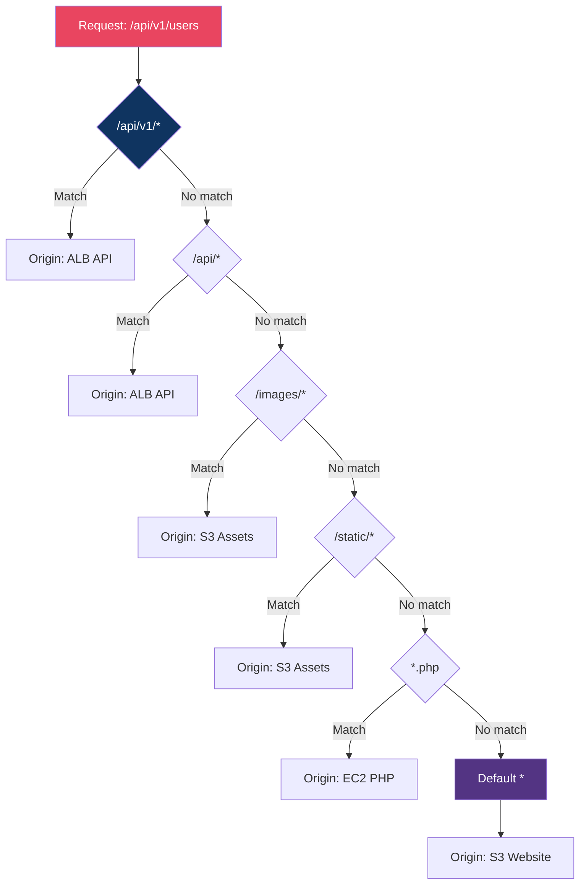
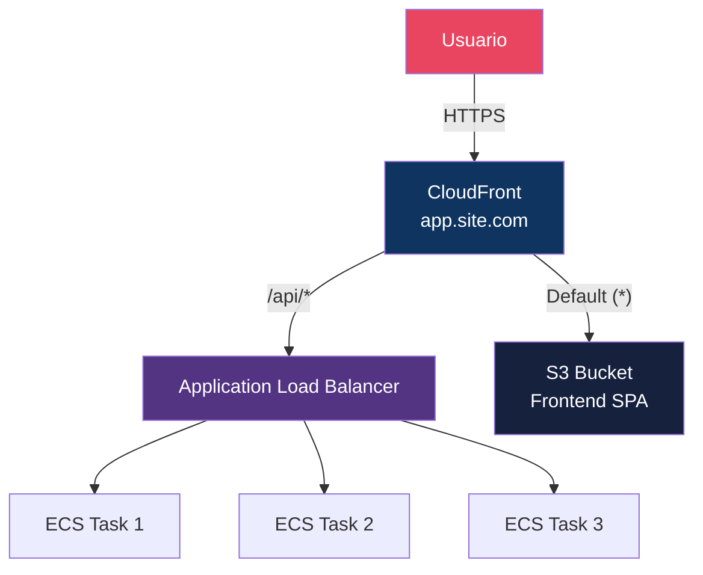

# Módulo 02 — Origins e Behaviors

> **Nível:** Iniciante-Intermediário
> **Objetivo do Módulo:** Dominar os dois conceitos mais importantes do CloudFront — de onde vem o conteúdo (Origins) e como ele é roteado e tratado (Behaviors). Este módulo é a base para tudo que vem depois.

---

## Conceitos-Chave Antes de Começar

### Origins — De Onde Vem o Conteúdo

Uma **Origin** é o servidor de onde o CloudFront busca o conteúdo quando não tem em cache. CloudFront suporta diversos tipos de origin:

| Tipo de Origin | Exemplo | Uso Típico |
|----------------|---------|------------|
| **S3 Bucket** | `meu-bucket.s3.us-east-1.amazonaws.com` | Sites estáticos, assets, mídia |
| **S3 Static Website** | `meu-bucket.s3-website-us-east-1.amazonaws.com` | Site estático com redirects S3 |
| **ALB/ELB** | `meu-alb-123456.us-east-1.elb.amazonaws.com` | APIs, aplicações web dinâmicas |
| **EC2** | `ec2-1-2-3-4.compute-1.amazonaws.com` | Aplicações diretas (sem LB) |
| **API Gateway** | `abc123.execute-api.us-east-1.amazonaws.com` | APIs serverless |
| **MediaStore** | `container.mediastore.us-east-1.amazonaws.com` | Streaming de vídeo |
| **Custom Origin** | `api.meuservico.com` | Qualquer servidor HTTP/HTTPS |
| **VPC Origin** | Recursos dentro da VPC via PrivateLink | Origins privadas sem acesso público |

### Behaviors — Como Rotear e Tratar Requests

**Behaviors** são regras que definem:
1. **Qual path pattern** → Qual origin serve
2. **Como cachear** → Qual cache policy usar
3. **O que enviar para a origin** → Qual origin request policy
4. **Que headers adicionar na resposta** → Response headers policy
5. **Que funções executar** → CloudFront Functions / Lambda@Edge
6. **Segurança** → Viewer protocol, signed URLs, etc

```
Behavior = Path Pattern + Origin + Cache Policy + Origin Request Policy + Response Headers Policy + Functions
```

### Ordem de Avaliação dos Behaviors

CloudFront avalia behaviors **de cima para baixo** (mais específico primeiro):



> **Importante:** O `Default (*)` é **obrigatório** e é o último a ser avaliado. Ele captura tudo que não deu match nos behaviors anteriores.

---

## Desafio 6: Múltiplas Origins — S3 + ALB na Mesma Distribution

### Objetivo
Criar uma distribuição que serve conteúdo estático do S3 e conteúdo dinâmico (API) de um Application Load Balancer, tudo no mesmo domínio.

### Contexto
Este é o cenário mais comum em produção: um frontend SPA (React/Vue/Angular) servido do S3, com chamadas de API para um backend atrás de um ALB. Tudo sob o mesmo domínio `app.meusite.com`, evitando problemas de CORS.

### Arquitetura



### Passo a Passo

#### 1. Preparar a Origin ALB (simulando com um server simples)

Se você não tem um ALB, pode usar um EC2 como custom origin para o lab:

```bash
# Criar security group para o EC2
SG_ID=$(aws ec2 create-security-group \
    --group-name cf-lab-sg \
    --description "SG para lab CloudFront" \
    --query "GroupId" --output text)

# Permitir HTTP do CloudFront (range de IPs do CloudFront)
# Em produção, use custom header secreto para validar que é o CloudFront
aws ec2 authorize-security-group-ingress \
    --group-id $SG_ID \
    --protocol tcp \
    --port 80 \
    --cidr 0.0.0.0/0

# Criar EC2 com um server HTTP simples
aws ec2 run-instances \
    --image-id ami-0c02fb55956c7d316 \
    --instance-type t3.micro \
    --security-group-ids $SG_ID \
    --user-data '#!/bin/bash
yum install -y httpd
cat > /var/www/html/api/health.json << APIEOF
{"status": "healthy", "origin": "ec2", "timestamp": "'$(date -u +%Y-%m-%dT%H:%M:%SZ)'"}
APIEOF
mkdir -p /var/www/html/api/v1
cat > /var/www/html/api/v1/users.json << APIEOF
{"users": [{"id": 1, "name": "Alice"}, {"id": 2, "name": "Bob"}]}
APIEOF
systemctl start httpd
systemctl enable httpd' \
    --tag-specifications 'ResourceType=instance,Tags=[{Key=Name,Value=cf-lab-api}]' \
    --query "Instances[0].InstanceId" --output text
```

#### 2. Criar a Distribution com Múltiplas Origins

```bash
# Obtenha o IP público do EC2
EC2_DNS=$(aws ec2 describe-instances \
    --filters "Name=tag:Name,Values=cf-lab-api" "Name=instance-state-name,Values=running" \
    --query "Reservations[0].Instances[0].PublicDnsName" --output text)

echo "EC2 DNS: $EC2_DNS"

# Criar distribution com 2 origins
aws cloudfront create-distribution \
    --distribution-config '{
        "CallerReference": "lab-desafio-6-'$(date +%s)'",
        "Comment": "Desafio 6 - Multi Origin S3 + API",
        "Enabled": true,
        "DefaultRootObject": "index.html",
        "Origins": {
            "Quantity": 2,
            "Items": [
                {
                    "Id": "S3-Frontend",
                    "DomainName": "meu-site-cloudfront-lab-001.s3.us-east-1.amazonaws.com",
                    "OriginAccessControlId": "OAC_ID_AQUI",
                    "S3OriginConfig": {
                        "OriginAccessIdentity": ""
                    }
                },
                {
                    "Id": "API-Backend",
                    "DomainName": "'$EC2_DNS'",
                    "CustomOriginConfig": {
                        "HTTPPort": 80,
                        "HTTPSPort": 443,
                        "OriginProtocolPolicy": "http-only",
                        "OriginSslProtocols": {
                            "Quantity": 1,
                            "Items": ["TLSv1.2"]
                        }
                    },
                    "CustomHeaders": {
                        "Quantity": 1,
                        "Items": [
                            {
                                "HeaderName": "X-Custom-Origin-Secret",
                                "HeaderValue": "minha-chave-secreta-123"
                            }
                        ]
                    }
                }
            ]
        },
        "DefaultCacheBehavior": {
            "TargetOriginId": "S3-Frontend",
            "ViewerProtocolPolicy": "redirect-to-https",
            "AllowedMethods": {
                "Quantity": 2,
                "Items": ["GET", "HEAD"]
            },
            "CachePolicyId": "658327ea-f89d-4fab-a63d-7e88639e58f6",
            "Compress": true
        },
        "CacheBehaviors": {
            "Quantity": 1,
            "Items": [
                {
                    "PathPattern": "/api/*",
                    "TargetOriginId": "API-Backend",
                    "ViewerProtocolPolicy": "redirect-to-https",
                    "AllowedMethods": {
                        "Quantity": 7,
                        "Items": ["GET", "HEAD", "OPTIONS", "PUT", "POST", "PATCH", "DELETE"]
                    },
                    "CachePolicyId": "4135ea2d-6df8-44a3-9df3-4b5a84be39ad",
                    "OriginRequestPolicyId": "216adef6-5c7f-47e4-b989-5492eafa07d3",
                    "Compress": true
                }
            ]
        },
        "PriceClass": "PriceClass_100",
        "ViewerCertificate": {
            "CloudFrontDefaultCertificate": true
        }
    }'
```

> **Cache Policies Managed usadas:**
> - `658327ea-f89d-4fab-a63d-7e88639e58f6` = **CachingOptimized** (para S3/estáticos)
> - `4135ea2d-6df8-44a3-9df3-4b5a84be39ad` = **CachingDisabled** (para API — sem cache)
>
> **Origin Request Policy:**
> - `216adef6-5c7f-47e4-b989-5492eafa07d3` = **AllViewer** (envia todos os headers do viewer para a origin)

#### 3. Terraform Equivalente

```hcl
resource "aws_cloudfront_distribution" "multi_origin" {
  enabled             = true
  default_root_object = "index.html"
  comment             = "Multi Origin - S3 + ALB"

  # Origin 1: S3 (Frontend)
  origin {
    domain_name              = aws_s3_bucket.frontend.bucket_regional_domain_name
    origin_id                = "S3-Frontend"
    origin_access_control_id = aws_cloudfront_origin_access_control.main.id
  }

  # Origin 2: ALB (API)
  origin {
    domain_name = aws_lb.api.dns_name
    origin_id   = "ALB-API"

    custom_origin_config {
      http_port              = 80
      https_port             = 443
      origin_protocol_policy = "https-only"
      origin_ssl_protocols   = ["TLSv1.2"]
    }

    # Header secreto para validar que a request vem do CloudFront
    custom_header {
      name  = "X-Custom-Origin-Secret"
      value = var.origin_secret
    }
  }

  # Behavior padrão: Frontend (S3)
  default_cache_behavior {
    allowed_methods        = ["GET", "HEAD", "OPTIONS"]
    cached_methods         = ["GET", "HEAD"]
    target_origin_id       = "S3-Frontend"
    cache_policy_id        = "658327ea-f89d-4fab-a63d-7e88639e58f6" # CachingOptimized
    viewer_protocol_policy = "redirect-to-https"
    compress               = true
  }

  # Behavior: API (ALB) — sem cache
  ordered_cache_behavior {
    path_pattern           = "/api/*"
    allowed_methods        = ["GET", "HEAD", "OPTIONS", "PUT", "POST", "PATCH", "DELETE"]
    cached_methods         = ["GET", "HEAD"]
    target_origin_id       = "ALB-API"
    cache_policy_id        = "4135ea2d-6df8-44a3-9df3-4b5a84be39ad" # CachingDisabled
    origin_request_policy_id = "216adef6-5c7f-47e4-b989-5492eafa07d3" # AllViewer
    viewer_protocol_policy = "redirect-to-https"
    compress               = true
  }

  # ... (viewer_certificate, restrictions, etc)
}
```

### Como Testar

```bash
DOMAIN=$(aws cloudfront list-distributions \
    --query "DistributionList.Items[?Comment=='Desafio 6 - Multi Origin S3 + API'].DomainName" \
    --output text)

# 1. Testar frontend (S3)
curl -I "https://$DOMAIN/"
# x-cache: Hit/Miss from cloudfront
# Deve retornar o index.html do S3

# 2. Testar API (EC2/ALB)
curl "https://$DOMAIN/api/health.json"
# Deve retornar: {"status": "healthy", ...}

curl "https://$DOMAIN/api/v1/users.json"
# Deve retornar: {"users": [...]}

# 3. Verificar que a API não está cacheada
curl -I "https://$DOMAIN/api/health.json"
# x-cache: Miss from cloudfront (sempre Miss pois CachingDisabled)

# 4. Verificar que o frontend ESTÁ cacheado
curl -I "https://$DOMAIN/"
# Primeira: x-cache: Miss from cloudfront
curl -I "https://$DOMAIN/"
# Segunda: x-cache: Hit from cloudfront

# 5. Testar POST na API (deve funcionar porque AllowedMethods inclui POST)
curl -X POST "https://$DOMAIN/api/v1/users.json" \
    -H "Content-Type: application/json" \
    -d '{"name": "Charlie"}'
```

### O Que Aprendemos

| Conceito | Descrição |
|----------|-----------|
| **Múltiplas Origins** | Uma distribution pode ter N origins diferentes |
| **CacheBehaviors** | Regras de roteamento baseadas em path pattern |
| **Path Pattern** | Padrão para match de URLs (`/api/*`, `*.jpg`, etc) |
| **CachingDisabled** | Policy managed que desabilita cache (ideal para APIs) |
| **AllViewer** | Origin request policy que envia todos os headers do viewer |
| **Custom Headers** | Headers secretos para validar que a request vem do CloudFront |
| **AllowedMethods** | Quais HTTP methods o behavior aceita (GET, POST, PUT, etc) |
| **OriginProtocolPolicy** | Como o CloudFront se comunica com a origin (HTTP/HTTPS) |

### Dica Expert
> O **Custom Header secreto** (`X-Custom-Origin-Secret`) é a forma mais simples de proteger sua origin. No ALB, crie uma regra que só aceita requests com esse header. Sem ele, qualquer pessoa que descubra o DNS do ALB pode acessar diretamente, bypassando WAF, rate limits e caching do CloudFront. Em cenários mais robustos, use **VPC Origins** (Desafio 10).

---

## Desafio 7: Origin Groups — Failover Automático

### Objetivo
Configurar um Origin Group com failover automático: se a origin primária falhar, CloudFront redireciona automaticamente para a origin de backup.

### Contexto
Alta disponibilidade é requisito em produção. E se seu S3 bucket ou ALB principal ficar indisponível? Com Origin Groups, o CloudFront faz failover transparente para o usuário.

### Arquitetura

```
                    ┌──────────────┐
                    │  CloudFront   │
                    └──────┬───────┘
                           │
                    ┌──────┴───────┐
                    │ Origin Group │
                    │  (Failover)  │
                    └──────┬───────┘
                           │
                ┌──────────┼──────────┐
                │                     │
         ┌──────┴──────┐       ┌──────┴──────┐
         │  Primário    │       │   Backup     │
         │ S3 us-east-1 │       │ S3 eu-west-1 │
         └─────────────┘       └──────────────┘
```

### Passo a Passo

#### 1. Criar Bucket de Backup (Região Diferente)

```bash
# Bucket primário (já existe do Desafio 1)
# Bucket de backup em outra região
aws s3 mb s3://meu-site-cloudfront-backup-001 --region eu-west-1

# Copiar conteúdo para o backup
aws s3 sync s3://meu-site-cloudfront-lab-001 s3://meu-site-cloudfront-backup-001

# Ou configurar S3 Cross-Region Replication (melhor para produção)
```

#### 2. Configurar S3 Cross-Region Replication (Opcional, Recomendado)

```bash
# Criar role IAM para replicação
cat > replication-role-policy.json << 'EOF'
{
    "Version": "2012-10-17",
    "Statement": [
        {
            "Effect": "Allow",
            "Action": [
                "s3:GetReplicationConfiguration",
                "s3:ListBucket"
            ],
            "Resource": "arn:aws:s3:::meu-site-cloudfront-lab-001"
        },
        {
            "Effect": "Allow",
            "Action": [
                "s3:GetObjectVersionForReplication",
                "s3:GetObjectVersionAcl",
                "s3:GetObjectVersionTagging"
            ],
            "Resource": "arn:aws:s3:::meu-site-cloudfront-lab-001/*"
        },
        {
            "Effect": "Allow",
            "Action": [
                "s3:ReplicateObject",
                "s3:ReplicateDelete",
                "s3:ReplicateTags"
            ],
            "Resource": "arn:aws:s3:::meu-site-cloudfront-backup-001/*"
        }
    ]
}
EOF

# Habilitar versionamento nos dois buckets (obrigatório para replicação)
aws s3api put-bucket-versioning \
    --bucket meu-site-cloudfront-lab-001 \
    --versioning-configuration Status=Enabled

aws s3api put-bucket-versioning \
    --bucket meu-site-cloudfront-backup-001 \
    --versioning-configuration Status=Enabled
```

#### 3. Criar Distribution com Origin Group

```bash
aws cloudfront create-distribution \
    --distribution-config '{
        "CallerReference": "lab-desafio-7-'$(date +%s)'",
        "Comment": "Desafio 7 - Origin Group Failover",
        "Enabled": true,
        "DefaultRootObject": "index.html",
        "Origins": {
            "Quantity": 2,
            "Items": [
                {
                    "Id": "S3-Primary",
                    "DomainName": "meu-site-cloudfront-lab-001.s3.us-east-1.amazonaws.com",
                    "OriginAccessControlId": "OAC_ID_AQUI",
                    "S3OriginConfig": {
                        "OriginAccessIdentity": ""
                    }
                },
                {
                    "Id": "S3-Backup",
                    "DomainName": "meu-site-cloudfront-backup-001.s3.eu-west-1.amazonaws.com",
                    "OriginAccessControlId": "OAC_ID_AQUI",
                    "S3OriginConfig": {
                        "OriginAccessIdentity": ""
                    }
                }
            ]
        },
        "OriginGroups": {
            "Quantity": 1,
            "Items": [
                {
                    "Id": "S3-Failover-Group",
                    "FailoverCriteria": {
                        "StatusCodes": {
                            "Quantity": 4,
                            "Items": [500, 502, 503, 504]
                        }
                    },
                    "Members": {
                        "Quantity": 2,
                        "Items": [
                            {"OriginId": "S3-Primary"},
                            {"OriginId": "S3-Backup"}
                        ]
                    }
                }
            ]
        },
        "DefaultCacheBehavior": {
            "TargetOriginId": "S3-Failover-Group",
            "ViewerProtocolPolicy": "redirect-to-https",
            "AllowedMethods": {
                "Quantity": 2,
                "Items": ["GET", "HEAD"]
            },
            "CachePolicyId": "658327ea-f89d-4fab-a63d-7e88639e58f6",
            "Compress": true
        },
        "PriceClass": "PriceClass_100",
        "ViewerCertificate": {
            "CloudFrontDefaultCertificate": true
        }
    }'
```

#### 4. Terraform Equivalente

```hcl
resource "aws_cloudfront_distribution" "failover" {
  enabled             = true
  default_root_object = "index.html"
  comment             = "Origin Group Failover"

  # Origin primária
  origin {
    domain_name              = aws_s3_bucket.primary.bucket_regional_domain_name
    origin_id                = "S3-Primary"
    origin_access_control_id = aws_cloudfront_origin_access_control.main.id
  }

  # Origin de backup
  origin {
    domain_name              = aws_s3_bucket.backup.bucket_regional_domain_name
    origin_id                = "S3-Backup"
    origin_access_control_id = aws_cloudfront_origin_access_control.main.id
  }

  # Origin Group com failover
  origin_group {
    origin_id = "S3-Failover-Group"

    failover_criteria {
      status_codes = [500, 502, 503, 504]
    }

    member {
      origin_id = "S3-Primary"
    }

    member {
      origin_id = "S3-Backup"
    }
  }

  default_cache_behavior {
    allowed_methods        = ["GET", "HEAD"]
    cached_methods         = ["GET", "HEAD"]
    target_origin_id       = "S3-Failover-Group"  # Aponta para o GROUP, não para a origin
    cache_policy_id        = "658327ea-f89d-4fab-a63d-7e88639e58f6"
    viewer_protocol_policy = "redirect-to-https"
    compress               = true
  }

  restrictions {
    geo_restriction {
      restriction_type = "none"
    }
  }

  viewer_certificate {
    cloudfront_default_certificate = true
  }
}
```

### Como Testar

```bash
DOMAIN=$(aws cloudfront list-distributions \
    --query "DistributionList.Items[?Comment=='Desafio 7 - Origin Group Failover'].DomainName" \
    --output text)

# 1. Testar acesso normal (vai para primary)
curl -I "https://$DOMAIN/"
# Deve funcionar normalmente

# 2. Simular falha na primary
# Opção A: Remover o objeto do bucket primário
aws s3 rm s3://meu-site-cloudfront-lab-001/index.html

# Opção B: Alterar a bucket policy do primário para negar acesso

# 3. Invalidar cache e testar novamente
aws cloudfront create-invalidation \
    --distribution-id $DIST_ID \
    --paths "/*"

# Aguardar e testar
sleep 120
curl -I "https://$DOMAIN/"
# Deve retornar conteúdo do bucket de BACKUP!

# 4. Restaurar primary
aws s3 cp index.html s3://meu-site-cloudfront-lab-001/index.html \
    --content-type "text/html"

# Próximo cache miss vai para o primary novamente
```

### O Que Aprendemos

| Conceito | Descrição |
|----------|-----------|
| **Origin Group** | Agrupamento de origins com failover automático |
| **Failover Criteria** | Quais status codes (5xx) trigam o failover |
| **Primary/Secondary** | Primeira origin recebe requests; segunda é backup |
| **Status Codes suportados** | 500, 502, 503, 504 (apenas server errors) |
| **Transparente** | Failover é invisível para o usuário final |
| **Cross-Region Replication** | S3 replica automaticamente entre regiões |

### Limitações dos Origin Groups

| Limitação | Detalhe |
|-----------|---------|
| Máximo 2 origins | Primary + Secondary apenas |
| Apenas 5xx errors | Não faz failover em 4xx (403, 404) |
| Sem health checks ativos | Failover é reativo, não proativo |
| Latência no failover | Primeira request após falha é mais lenta (precisa tentar primary primeiro) |

### Dica Expert
> Origin Groups são bons para DR (Disaster Recovery), mas NÃO são balanceadores de carga. Se você precisa de load balancing entre origins, use **Lambda@Edge** para roteamento customizado ou coloque um ALB na frente. Para failover mais sofisticado com health checks ativos, combine CloudFront + **Route 53 Health Checks** + **DNS Failover**.

---

## Desafio 8: Behaviors Avançados — Roteamento Complexo

### Objetivo
Criar uma distribution com múltiplos behaviors para rotear diferentes tipos de conteúdo para diferentes origins, com configurações de cache otimizadas para cada tipo.

### Contexto
Aplicações reais têm diferentes tipos de conteúdo: HTML, CSS, JS, imagens, vídeos, APIs, WebSockets. Cada um precisa de tratamento diferente de cache, compressão e segurança.

### Arquitetura

```
                         ┌──────────────┐
                         │  CloudFront   │
                         └──────┬───────┘
                                │
        ┌───────────┬───────────┼───────────┬───────────┐
        │           │           │           │           │
    /api/*     /media/*    /static/*    /ws/*     Default (*)
        │           │           │           │           │
    ┌───┴───┐  ┌────┴────┐ ┌───┴───┐  ┌───┴───┐  ┌───┴───┐
    │  ALB  │  │MediaStore│ │  S3   │  │  ALB  │  │  S3   │
    │ (API) │  │(Vídeos)  │ │(Assets)│  │ (WS) │  │(HTML) │
    └───────┘  └─────────┘ └───────┘  └───────┘  └───────┘
```

### Passo a Passo

#### 1. Definir a Estratégia de Behaviors

| Path Pattern | Origin | Cache | Methods | Compressão | Notas |
|-------------|--------|-------|---------|------------|-------|
| `/api/*` | ALB | Disabled | ALL (7) | Sim | API dinâmica, sem cache |
| `/api/v1/config` | ALB | 5 min | GET/HEAD | Sim | Config muda pouco, cachear |
| `/media/*` | S3 Media | 30 dias | GET/HEAD | Não | Vídeos/imagens grandes |
| `/static/js/*` | S3 Assets | 1 ano | GET/HEAD | Sim | JS com hash no nome |
| `/static/css/*` | S3 Assets | 1 ano | GET/HEAD | Sim | CSS com hash no nome |
| `/static/*` | S3 Assets | 1 dia | GET/HEAD | Sim | Outros assets |
| `/ws/*` | ALB | Disabled | ALL | Não | WebSocket |
| `Default (*)` | S3 Website | 1 hora | GET/HEAD | Sim | HTML pages |

#### 2. Terraform com Todos os Behaviors

```hcl
resource "aws_cloudfront_distribution" "complex" {
  enabled             = true
  default_root_object = "index.html"
  comment             = "Desafio 8 - Complex Behaviors"
  http_version        = "http2and3"

  # ============================================================
  # ORIGINS
  # ============================================================

  # Origin 1: S3 Website (HTML pages)
  origin {
    domain_name              = aws_s3_bucket.website.bucket_regional_domain_name
    origin_id                = "S3-Website"
    origin_access_control_id = aws_cloudfront_origin_access_control.main.id
  }

  # Origin 2: S3 Assets (JS, CSS, imagens)
  origin {
    domain_name              = aws_s3_bucket.assets.bucket_regional_domain_name
    origin_id                = "S3-Assets"
    origin_access_control_id = aws_cloudfront_origin_access_control.main.id
  }

  # Origin 3: S3 Media (vídeos, imagens grandes)
  origin {
    domain_name              = aws_s3_bucket.media.bucket_regional_domain_name
    origin_id                = "S3-Media"
    origin_access_control_id = aws_cloudfront_origin_access_control.main.id

    # Origin Shield para reduzir carga na origin de mídia
    origin_shield {
      enabled              = true
      origin_shield_region = "us-east-1"
    }
  }

  # Origin 4: ALB (API + WebSocket)
  origin {
    domain_name = aws_lb.api.dns_name
    origin_id   = "ALB-API"

    custom_origin_config {
      http_port              = 80
      https_port             = 443
      origin_protocol_policy = "https-only"
      origin_ssl_protocols   = ["TLSv1.2"]
    }

    custom_header {
      name  = "X-Origin-Verify"
      value = var.origin_secret
    }
  }

  # ============================================================
  # BEHAVIORS (ordem importa! mais específico primeiro)
  # ============================================================

  # Behavior 1: API Config (cacheável por 5 min)
  ordered_cache_behavior {
    path_pattern           = "/api/v1/config"
    allowed_methods        = ["GET", "HEAD"]
    cached_methods         = ["GET", "HEAD"]
    target_origin_id       = "ALB-API"
    cache_policy_id        = aws_cloudfront_cache_policy.api_short_cache.id
    origin_request_policy_id = "216adef6-5c7f-47e4-b989-5492eafa07d3"
    viewer_protocol_policy = "https-only"
    compress               = true
  }

  # Behavior 2: API (sem cache)
  ordered_cache_behavior {
    path_pattern           = "/api/*"
    allowed_methods        = ["GET", "HEAD", "OPTIONS", "PUT", "POST", "PATCH", "DELETE"]
    cached_methods         = ["GET", "HEAD"]
    target_origin_id       = "ALB-API"
    cache_policy_id        = "4135ea2d-6df8-44a3-9df3-4b5a84be39ad" # CachingDisabled
    origin_request_policy_id = "216adef6-5c7f-47e4-b989-5492eafa07d3" # AllViewer
    viewer_protocol_policy = "https-only"
    compress               = true
  }

  # Behavior 3: Media (cache longo, sem compressão para vídeos)
  ordered_cache_behavior {
    path_pattern           = "/media/*"
    allowed_methods        = ["GET", "HEAD"]
    cached_methods         = ["GET", "HEAD"]
    target_origin_id       = "S3-Media"
    cache_policy_id        = aws_cloudfront_cache_policy.media_long_cache.id
    viewer_protocol_policy = "redirect-to-https"
    compress               = false  # Vídeos já são comprimidos
  }

  # Behavior 4: JS estático (cache muito longo — arquivos com hash)
  ordered_cache_behavior {
    path_pattern           = "/static/js/*"
    allowed_methods        = ["GET", "HEAD"]
    cached_methods         = ["GET", "HEAD"]
    target_origin_id       = "S3-Assets"
    cache_policy_id        = aws_cloudfront_cache_policy.immutable_cache.id
    viewer_protocol_policy = "redirect-to-https"
    compress               = true

    # Response headers para segurança
    response_headers_policy_id = aws_cloudfront_response_headers_policy.security_headers.id
  }

  # Behavior 5: CSS estático (cache muito longo — arquivos com hash)
  ordered_cache_behavior {
    path_pattern           = "/static/css/*"
    allowed_methods        = ["GET", "HEAD"]
    cached_methods         = ["GET", "HEAD"]
    target_origin_id       = "S3-Assets"
    cache_policy_id        = aws_cloudfront_cache_policy.immutable_cache.id
    viewer_protocol_policy = "redirect-to-https"
    compress               = true
    response_headers_policy_id = aws_cloudfront_response_headers_policy.security_headers.id
  }

  # Behavior 6: Outros assets estáticos
  ordered_cache_behavior {
    path_pattern           = "/static/*"
    allowed_methods        = ["GET", "HEAD"]
    cached_methods         = ["GET", "HEAD"]
    target_origin_id       = "S3-Assets"
    cache_policy_id        = "658327ea-f89d-4fab-a63d-7e88639e58f6" # CachingOptimized
    viewer_protocol_policy = "redirect-to-https"
    compress               = true
  }

  # Behavior 7: WebSocket
  ordered_cache_behavior {
    path_pattern           = "/ws/*"
    allowed_methods        = ["GET", "HEAD"]
    cached_methods         = ["GET", "HEAD"]
    target_origin_id       = "ALB-API"
    cache_policy_id        = "4135ea2d-6df8-44a3-9df3-4b5a84be39ad" # CachingDisabled
    origin_request_policy_id = "216adef6-5c7f-47e4-b989-5492eafa07d3"
    viewer_protocol_policy = "https-only"
    compress               = false
  }

  # Default Behavior: HTML pages
  default_cache_behavior {
    allowed_methods        = ["GET", "HEAD", "OPTIONS"]
    cached_methods         = ["GET", "HEAD"]
    target_origin_id       = "S3-Website"
    cache_policy_id        = aws_cloudfront_cache_policy.html_cache.id
    viewer_protocol_policy = "redirect-to-https"
    compress               = true
    response_headers_policy_id = aws_cloudfront_response_headers_policy.security_headers.id
  }

  restrictions {
    geo_restriction {
      restriction_type = "none"
    }
  }

  viewer_certificate {
    cloudfront_default_certificate = true
  }
}

# ============================================================
# CUSTOM CACHE POLICIES
# ============================================================

# Cache policy para API com TTL curto
resource "aws_cloudfront_cache_policy" "api_short_cache" {
  name        = "API-ShortCache-5min"
  comment     = "Cache de 5 minutos para endpoints de config"
  default_ttl = 300    # 5 minutos
  max_ttl     = 600    # 10 minutos
  min_ttl     = 60     # 1 minuto

  parameters_in_cache_key_and_forwarded_to_origin {
    cookies_config {
      cookie_behavior = "none"
    }
    headers_config {
      header_behavior = "none"
    }
    query_strings_config {
      query_string_behavior = "none"
    }
    enable_accept_encoding_brotli = true
    enable_accept_encoding_gzip   = true
  }
}

# Cache policy para media (30 dias)
resource "aws_cloudfront_cache_policy" "media_long_cache" {
  name        = "Media-LongCache-30d"
  comment     = "Cache de 30 dias para vídeos e imagens"
  default_ttl = 2592000  # 30 dias
  max_ttl     = 31536000 # 365 dias
  min_ttl     = 86400    # 1 dia

  parameters_in_cache_key_and_forwarded_to_origin {
    cookies_config {
      cookie_behavior = "none"
    }
    headers_config {
      header_behavior = "none"
    }
    query_strings_config {
      query_string_behavior = "none"
    }
  }
}

# Cache policy para assets imutáveis (1 ano)
resource "aws_cloudfront_cache_policy" "immutable_cache" {
  name        = "Immutable-Cache-1y"
  comment     = "Cache de 1 ano para assets com hash no nome"
  default_ttl = 31536000 # 365 dias
  max_ttl     = 31536000
  min_ttl     = 31536000

  parameters_in_cache_key_and_forwarded_to_origin {
    cookies_config {
      cookie_behavior = "none"
    }
    headers_config {
      header_behavior = "none"
    }
    query_strings_config {
      query_string_behavior = "none"
    }
    enable_accept_encoding_brotli = true
    enable_accept_encoding_gzip   = true
  }
}

# Cache policy para HTML (1 hora)
resource "aws_cloudfront_cache_policy" "html_cache" {
  name        = "HTML-Cache-1h"
  comment     = "Cache de 1 hora para páginas HTML"
  default_ttl = 3600    # 1 hora
  max_ttl     = 86400   # 1 dia
  min_ttl     = 0       # Respeita Cache-Control da origin

  parameters_in_cache_key_and_forwarded_to_origin {
    cookies_config {
      cookie_behavior = "none"
    }
    headers_config {
      header_behavior = "none"
    }
    query_strings_config {
      query_string_behavior = "none"
    }
    enable_accept_encoding_brotli = true
    enable_accept_encoding_gzip   = true
  }
}
```

### Como Testar

```bash
# 1. Testar cada path pattern
curl -I "https://$DOMAIN/"                    # → S3-Website (HTML)
curl -I "https://$DOMAIN/static/js/app.hash.js"  # → S3-Assets (JS)
curl -I "https://$DOMAIN/static/css/main.hash.css" # → S3-Assets (CSS)
curl -I "https://$DOMAIN/media/video.mp4"     # → S3-Media
curl -I "https://$DOMAIN/api/v1/users"        # → ALB (sem cache)
curl -I "https://$DOMAIN/api/v1/config"       # → ALB (cache 5 min)

# 2. Verificar behavior de cada request
# Olhar headers:
# - x-cache: Hit/Miss
# - age: tempo em cache
# - cache-control: política aplicada

# 3. Testar que POST funciona em /api/* mas não em /static/*
curl -X POST "https://$DOMAIN/api/v1/users" -d '{"test": true}'
# Deve funcionar (AllowedMethods inclui POST)

curl -X POST "https://$DOMAIN/static/js/app.js"
# Deve retornar 403 (AllowedMethods é apenas GET/HEAD)

# 4. Verificar compressão
curl -H "Accept-Encoding: gzip, br" -I "https://$DOMAIN/static/js/app.hash.js"
# content-encoding: br (Brotli)

curl -H "Accept-Encoding: gzip, br" -I "https://$DOMAIN/media/video.mp4"
# Sem content-encoding (compressão desabilitada para vídeos)

# 5. Verificar Origin Shield (no CloudWatch)
# Metric: CloudFront > OriginShieldRequests
```

### O Que Aprendemos

| Conceito | Descrição |
|----------|-----------|
| **Path Pattern** | Regra de match de URL para rotear requests |
| **Ordem dos Behaviors** | Mais específico primeiro; default é o último |
| **Cache por tipo** | Diferentes TTLs para diferentes tipos de conteúdo |
| **AllowedMethods** | GET/HEAD para estáticos; ALL para APIs |
| **Origin Shield** | Cache centralizado extra para origins com muito tráfego |
| **Compressão seletiva** | Habilitar para texto; desabilitar para mídia binária |
| **Response Headers Policy** | Headers de segurança adicionados automaticamente |
| **Custom Cache Policy** | Controle fino sobre TTL e cache key |

### Path Patterns — Referência Completa

| Pattern | Match | Não Match |
|---------|-------|-----------|
| `/images/*` | `/images/foto.jpg`, `/images/sub/foto.png` | `/img/foto.jpg` |
| `*.jpg` | `/foto.jpg`, `/images/foto.jpg` | `/foto.jpeg`, `/foto.jpg.bak` |
| `/api/v1/*` | `/api/v1/users`, `/api/v1/orders/123` | `/api/v2/users` |
| `/api/v[12]/*` | NÃO funciona! CF não suporta regex | — |
| `Default (*)` | Tudo que não deu match antes | — |

> **Limitação:** CloudFront NÃO suporta regex em path patterns. Apenas wildcards simples (`*` e `?`).

### Dica Expert
> A **ordem dos behaviors** é critical. Se você tem `/api/*` antes de `/api/v1/config`, o config nunca será matched pelo behavior específico. Coloque sempre o mais específico primeiro. No Terraform, a ordem dos blocos `ordered_cache_behavior` define a prioridade — o primeiro bloco tem maior prioridade.

---

## Desafio 9: Origin Path e Custom Origin Headers

### Objetivo
Usar Origin Path para mapear URLs do CloudFront para subdiretórios na origin, e Custom Headers para segurança e roteamento.

### Contexto
Imagine que você tem um bucket S3 com a estrutura `/v1/`, `/v2/`, `/staging/`. Com Origin Path, você pode fazer `cdn.site.com/*` servir conteúdo de `/v2/*` no S3, sem que o usuário saiba. Útil para blue/green deployments e versionamento.

### Passo a Passo

#### 1. Preparar Estrutura no S3

```bash
# Criar estrutura de versões no S3
echo "<h1>Versão 1 - Antiga</h1>" > v1-index.html
echo "<h1>Versão 2 - Atual</h1>" > v2-index.html
echo "<h1>Versão 3 - Staging</h1>" > v3-index.html

aws s3 cp v1-index.html s3://meu-site-cloudfront-lab-001/v1/index.html --content-type "text/html"
aws s3 cp v2-index.html s3://meu-site-cloudfront-lab-001/v2/index.html --content-type "text/html"
aws s3 cp v3-index.html s3://meu-site-cloudfront-lab-001/v3/index.html --content-type "text/html"
```

#### 2. Origin Path Mapping

```
Sem Origin Path:
  User: https://cdn.site.com/index.html
  CF busca: s3://bucket/index.html

Com Origin Path "/v2":
  User: https://cdn.site.com/index.html
  CF busca: s3://bucket/v2/index.html    ← /v2 é prefixado automaticamente!
```

#### 3. Configurar Origin com Path

```hcl
# Terraform
resource "aws_cloudfront_distribution" "versioned" {
  enabled             = true
  default_root_object = "index.html"

  # Origin apontando para /v2 no S3
  origin {
    domain_name              = aws_s3_bucket.website.bucket_regional_domain_name
    origin_id                = "S3-Current"
    origin_path              = "/v2"  # ← Mapeia para o subdiretório
    origin_access_control_id = aws_cloudfront_origin_access_control.main.id
  }

  # Origin para staging (outro path)
  origin {
    domain_name              = aws_s3_bucket.website.bucket_regional_domain_name
    origin_id                = "S3-Staging"
    origin_path              = "/v3"
    origin_access_control_id = aws_cloudfront_origin_access_control.main.id
  }

  default_cache_behavior {
    allowed_methods        = ["GET", "HEAD"]
    cached_methods         = ["GET", "HEAD"]
    target_origin_id       = "S3-Current"
    cache_policy_id        = "658327ea-f89d-4fab-a63d-7e88639e58f6"
    viewer_protocol_policy = "redirect-to-https"
    compress               = true
  }

  # Behavior para preview/staging
  ordered_cache_behavior {
    path_pattern           = "/preview/*"
    allowed_methods        = ["GET", "HEAD"]
    cached_methods         = ["GET", "HEAD"]
    target_origin_id       = "S3-Staging"
    cache_policy_id        = "4135ea2d-6df8-44a3-9df3-4b5a84be39ad" # Sem cache para staging
    viewer_protocol_policy = "redirect-to-https"
  }

  restrictions {
    geo_restriction {
      restriction_type = "none"
    }
  }

  viewer_certificate {
    cloudfront_default_certificate = true
  }
}
```

#### 4. Custom Origin Headers — Uso Avançado

```hcl
# Headers customizados enviados para a origin
origin {
  domain_name = "api.meusite.com"
  origin_id   = "Custom-API"

  custom_origin_config {
    http_port              = 80
    https_port             = 443
    origin_protocol_policy = "https-only"
    origin_ssl_protocols   = ["TLSv1.2"]
  }

  # Header 1: Segurança — validar que a request vem do CloudFront
  custom_header {
    name  = "X-Origin-Verify"
    value = "super-secret-token-que-so-cf-sabe"
  }

  # Header 2: Roteamento — informar o ambiente
  custom_header {
    name  = "X-Forwarded-Environment"
    value = "production"
  }

  # Header 3: Identificação — qual distribution está chamando
  custom_header {
    name  = "X-CloudFront-Distribution"
    value = "E1ABC2DEF3GH"
  }
}
```

#### 5. Validação de Origin Headers no ALB/Nginx

```nginx
# Nginx — rejeitar requests que não vêm do CloudFront
server {
    listen 443 ssl;

    # Verificar header secreto
    if ($http_x_origin_verify != "super-secret-token-que-so-cf-sabe") {
        return 403;
    }

    # ... resto da configuração
}
```

```json
// ALB Listener Rule — verificar header
{
    "Conditions": [
        {
            "Field": "http-header",
            "HttpHeaderConfig": {
                "HttpHeaderName": "X-Origin-Verify",
                "Values": ["super-secret-token-que-so-cf-sabe"]
            }
        }
    ],
    "Actions": [
        {
            "Type": "forward",
            "TargetGroupArn": "arn:aws:elasticloadbalancing:..."
        }
    ]
}
```

### Como Testar

```bash
# 1. Testar Origin Path
curl "https://$DOMAIN/"
# Deve mostrar "Versão 2 - Atual" (buscou de /v2/index.html)

# 2. Testar preview/staging
curl "https://$DOMAIN/preview/index.html"
# Deve mostrar "Versão 3 - Staging" (buscou de /v3/index.html)

# 3. Para "trocar a versão", basta mudar origin_path de /v2 para /v3
# e invalidar o cache — zero downtime!

# 4. Verificar que custom headers são enviados (no server)
# No ALB, os access logs mostram os headers recebidos
# No EC2/Nginx, verificar nos logs de acesso
```

### O Que Aprendemos

| Conceito | Descrição |
|----------|-----------|
| **Origin Path** | Prefixo adicionado automaticamente a todas as requests para a origin |
| **Blue/Green** | Trocar entre versões mudando apenas o origin_path |
| **Custom Headers** | Headers extras enviados do CloudFront para a origin |
| **Origin Verification** | Header secreto para impedir acesso direto à origin |
| **Multiple origins, same bucket** | Mesmo S3 pode ser origin múltiplas vezes com paths diferentes |

### Dica Expert
> **Origin Path para Blue/Green deployments:** Em vez de ter dois buckets e trocar DNS, use o mesmo bucket com `/blue/` e `/green/`, e altere apenas o Origin Path. Combine com **Continuous Deployment** (staging distribution) do CloudFront para testar antes de virar o tráfego completamente. Invalidação de `/*` completa a troca.

---

## Desafio 10: VPC Origins — Origins Privadas

### Objetivo
Configurar VPC Origins para que o CloudFront acesse recursos dentro de uma VPC que NÃO têm IP público, usando AWS PrivateLink.

### Contexto
Na arquitetura de segurança moderna, seus servidores de aplicação NÃO devem ter IP público. VPC Origins permite que CloudFront acesse ALBs, NLBs e instâncias EC2 em subnets privadas, sem expor nada à internet.

### Arquitetura

```
Internet → CloudFront → [PrivateLink/VPC Origin] → ALB (private subnet) → ECS/EC2
                                                      │
                                                  Sem IP público!
                                                  Sem Internet Gateway!
```

### Pré-requisitos

- VPC com subnets privadas
- ALB interno (internal) ou NLB interno
- Security Groups configurados

### Passo a Passo

#### 1. Criar ALB Interno (sem acesso público)

```bash
# Criar ALB interno (scheme=internal)
aws elbv2 create-load-balancer \
    --name cf-lab-internal-alb \
    --subnets subnet-private-1a subnet-private-1b \
    --security-groups $SG_ID \
    --scheme internal \
    --type application

# Criar target group
aws elbv2 create-target-group \
    --name cf-lab-tg \
    --protocol HTTP \
    --port 80 \
    --vpc-id $VPC_ID \
    --target-type ip \
    --health-check-path "/health"

# Criar listener
aws elbv2 create-listener \
    --load-balancer-arn $ALB_ARN \
    --protocol HTTP \
    --port 80 \
    --default-actions Type=forward,TargetGroupArn=$TG_ARN
```

#### 2. Criar VPC Origin no CloudFront

```bash
# Criar VPC Origin
aws cloudfront create-vpc-origin \
    --vpc-origin-endpoint-config '{
        "Name": "internal-alb-origin",
        "Arn": "'$ALB_ARN'",
        "HTTPPort": 80,
        "HTTPSPort": 443,
        "OriginProtocolPolicy": "http-only",
        "OriginSslProtocols": {
            "Quantity": 1,
            "Items": ["TLSv1.2"]
        }
    }'

# Anote o VpcOriginId retornado
VPC_ORIGIN_ID="vo-XXXXXXXXXX"
```

#### 3. O CloudFront cria automaticamente um VPC Endpoint

Quando você cria um VPC Origin, o CloudFront automaticamente:
1. Cria um **VPC Endpoint** (PrivateLink) na VPC do ALB
2. Cria **ENIs** (Elastic Network Interfaces) nas subnets do ALB
3. Configura o roteamento privado

> Você precisa **autorizar** o CloudFront a acessar o recurso. Um security group será associado automaticamente — verifique que ele permite tráfego do CloudFront.

#### 4. Usar o VPC Origin na Distribution

```bash
aws cloudfront create-distribution \
    --distribution-config '{
        "CallerReference": "lab-desafio-10-'$(date +%s)'",
        "Comment": "Desafio 10 - VPC Origin",
        "Enabled": true,
        "Origins": {
            "Quantity": 1,
            "Items": [
                {
                    "Id": "VPC-ALB",
                    "DomainName": "'$ALB_DNS'",
                    "VpcOriginConfig": {
                        "VpcOriginId": "'$VPC_ORIGIN_ID'"
                    }
                }
            ]
        },
        "DefaultCacheBehavior": {
            "TargetOriginId": "VPC-ALB",
            "ViewerProtocolPolicy": "redirect-to-https",
            "AllowedMethods": {
                "Quantity": 7,
                "Items": ["GET", "HEAD", "OPTIONS", "PUT", "POST", "PATCH", "DELETE"]
            },
            "CachePolicyId": "4135ea2d-6df8-44a3-9df3-4b5a84be39ad",
            "OriginRequestPolicyId": "216adef6-5c7f-47e4-b989-5492eafa07d3",
            "Compress": true
        },
        "PriceClass": "PriceClass_100",
        "ViewerCertificate": {
            "CloudFrontDefaultCertificate": true
        }
    }'
```

#### 5. Terraform Equivalente

```hcl
# VPC Origin
resource "aws_cloudfront_vpc_origin" "internal_alb" {
  vpc_origin_endpoint_config {
    name                   = "internal-alb-origin"
    arn                    = aws_lb.internal.arn
    http_port              = 80
    https_port             = 443
    origin_protocol_policy = "https-only"

    origin_ssl_protocols {
      items    = ["TLSv1.2"]
      quantity = 1
    }
  }
}

# Distribution usando VPC Origin
resource "aws_cloudfront_distribution" "vpc_origin" {
  enabled = true
  comment = "VPC Origin - Internal ALB"

  origin {
    domain_name = aws_lb.internal.dns_name
    origin_id   = "VPC-Internal-ALB"

    vpc_origin_config {
      vpc_origin_id = aws_cloudfront_vpc_origin.internal_alb.id
    }
  }

  default_cache_behavior {
    allowed_methods        = ["GET", "HEAD", "OPTIONS", "PUT", "POST", "PATCH", "DELETE"]
    cached_methods         = ["GET", "HEAD"]
    target_origin_id       = "VPC-Internal-ALB"
    cache_policy_id        = "4135ea2d-6df8-44a3-9df3-4b5a84be39ad"
    origin_request_policy_id = "216adef6-5c7f-47e4-b989-5492eafa07d3"
    viewer_protocol_policy = "redirect-to-https"
    compress               = true
  }

  restrictions {
    geo_restriction {
      restriction_type = "none"
    }
  }

  viewer_certificate {
    cloudfront_default_certificate = true
  }
}
```

### Como Testar

```bash
DOMAIN=$(aws cloudfront list-distributions \
    --query "DistributionList.Items[?Comment=='Desafio 10 - VPC Origin'].DomainName" \
    --output text)

# 1. Testar acesso via CloudFront
curl "https://$DOMAIN/"
# Deve retornar conteúdo do ALB interno

# 2. Verificar que o ALB NÃO é acessível diretamente
curl "http://$ALB_DNS/"
# Deve FALHAR (ALB é internal, não tem IP público)

# 3. Verificar VPC Origins criados
aws cloudfront list-vpc-origins

# 4. Ver detalhes do VPC Origin
aws cloudfront get-vpc-origin --id $VPC_ORIGIN_ID

# 5. Verificar ENIs criadas pelo CloudFront na VPC
aws ec2 describe-network-interfaces \
    --filters "Name=description,Values=*CloudFront*" \
    --query "NetworkInterfaces[*].{Id:NetworkInterfaceId,Subnet:SubnetId,SG:Groups[0].GroupId}"
```

### VPC Origins vs Custom Headers — Comparativo

| Aspecto | Custom Headers | VPC Origins |
|---------|---------------|-------------|
| **Segurança** | Média (header pode vazar) | Alta (PrivateLink, sem IP público) |
| **Complexidade** | Simples | Moderada |
| **Custo** | Grátis | Custo do PrivateLink |
| **ALB público necessário?** | Sim | Não |
| **Latência** | Normal | Similar (PrivateLink é eficiente) |
| **Melhor para** | Labs, ambientes menores | Produção, compliance |

### O Que Aprendemos

| Conceito | Descrição |
|----------|-----------|
| **VPC Origin** | CloudFront acessa origins privadas via PrivateLink |
| **Internal ALB** | Load balancer sem IP público (scheme=internal) |
| **PrivateLink** | Conexão privada entre serviços AWS sem passar pela internet |
| **ENI** | Interface de rede criada automaticamente na VPC |
| **Zero trust** | Origins não precisam de acesso público |
| **Compliance** | Atende requisitos de segurança que exigem comunicação privada |

### Troubleshooting

| Problema | Causa | Solução |
|----------|-------|---------|
| 502 Bad Gateway | Security Group bloqueando CloudFront | Adicionar regra permitindo tráfego do SG do CloudFront ENI |
| VPC Origin stuck "Deploying" | Subnets sem espaço para ENIs | Verificar IPs disponíveis nas subnets |
| Timeout | Route tables sem rota para PrivateLink | Verificar route tables das subnets privadas |
| 403 | IAM permissions | Verificar que a conta tem permissão para criar VPC Endpoints |

### Dica Expert
> **VPC Origins é o futuro.** A AWS está empurrando forte essa feature porque resolve de vez o problema de "como proteger minha origin". Antes, era gambiarras com custom headers ou WAF na origin. Com VPC Origins, sua origin simplesmente não existe na internet pública. Para migrar uma origin existente: crie o VPC Origin, mude o scheme do ALB para internal, e atualize a distribution. O tráfego via PrivateLink tem latência similar ao público.

---

## Resumo do Módulo 02

Ao completar este módulo, você domina:

- [x] Múltiplas origins na mesma distribution (S3 + ALB + Custom)
- [x] Origin Groups com failover automático
- [x] Behaviors avançados com roteamento por path pattern
- [x] Cache policies customizadas por tipo de conteúdo
- [x] Origin Path para versionamento e blue/green
- [x] Custom Headers para segurança de origin
- [x] VPC Origins para origins totalmente privadas

### Mapa Mental

```
Distribution
├── Origins (de onde vem)
│   ├── S3 (com OAC)
│   ├── ALB/NLB (custom origin)
│   ├── EC2 (custom origin)
│   ├── API Gateway
│   ├── Custom (qualquer HTTP)
│   ├── VPC Origin (PrivateLink)
│   └── Origin Groups (failover)
│       ├── Primary
│       └── Secondary
│
└── Behaviors (como rotear)
    ├── Path Pattern → Origin
    ├── Cache Policy (TTL)
    ├── Origin Request Policy (headers)
    ├── Response Headers Policy
    ├── Allowed Methods
    ├── Viewer Protocol
    └── Function Associations
```

---

## Desafio Bônus: Ordem de Behaviors na Prática — O Bug Silencioso

> **Level:** 200 | **Tempo:** 60 min | **Custo:** ~$0

### Objetivo

Demonstrar na prática como a **ordem errada de behaviors** causa bugs silenciosos — requests que funcionam mas caem no behavior errado, com cache policy, TTL ou origin incorretos. Inclui cenário de **proxy para API de terceiro** e **teste com aplicação HTML/JS real no browser**.

### Contexto

Este é um dos erros mais comuns e mais difíceis de debugar em CloudFront. O request retorna 200 OK, mas:
- Está sendo cacheado quando não deveria (API dinâmica caiu no behavior de static)
- Não está sendo cacheado quando deveria (asset estático caiu no behavior de API)
- Vai para o origin errado (S3 em vez do ALB, ou vice-versa)

O problema: **CloudFront avalia behaviors de cima para baixo e usa o PRIMEIRO match.** Se um pattern genérico está antes de um específico, o específico nunca é alcançado.

### Arquitetura do Lab

```
                          Browser (app.html)
                               │
                               ▼
                     ┌─────────────────────┐
                     │  CloudFront          │
                     │  d111222333.cf.net   │
                     │                      │
                     │  Behaviors:          │
                     │   /api/health  → ALB │  ← Específico (deve vir ANTES)
                     │   /api/*       → ALB │  ← Genérico
                     │   /ext-api/*   → API │  ← Proxy para API terceiro
                     │   /static/*    → S3  │
                     │   Default (*)  → S3  │
                     └────┬─────┬─────┬────┘
                          │     │     │
                   ┌──────┘     │     └──────┐
                   ▼            ▼             ▼
             ┌──────────┐ ┌──────────┐ ┌──────────────┐
             │   S3     │ │   ALB    │ │  API Terceiro │
             │ Frontend │ │  Sua API │ │  (ex: jsonpl. │
             │ + Static │ │          │ │   typicode)   │
             └──────────┘ └──────────┘ └──────────────┘
```

### Passo 1 — Demonstrar o Bug de Ordenação

```bash
# Cenário: Você quer que /api/health tenha CachingDisabled (sem cache)
# e /api/* tenha cache de 5 segundos para aliviar o backend

# ❌ ERRADO: /api/* ANTES de /api/health
# Resultado: /api/health dá match em /api/* e é CACHEADO por 5s
# Health check retorna dado stale — seu monitoring pensa que o backend está UP
# quando na verdade pode estar DOWN

# Teste para provar o bug:
# Vamos criar 2 behaviors na ordem ERRADA e ver o resultado

# 1. Criar bucket S3 para frontend
BUCKET="cf-behavior-order-lab-$(date +%s)"
aws s3 mb "s3://$BUCKET" --region us-east-1

# 2. Subir um index.html de teste (será nossa app)
cat > /tmp/index.html << 'HTMLEOF'
<!DOCTYPE html>
<html lang="pt-BR">
<head>
  <meta charset="UTF-8">
  <title>CloudFront Behavior Order Lab</title>
  <style>
    body { font-family: monospace; background: #1a1a2e; color: #e0e0e0; padding: 20px; }
    h1 { color: #00d4ff; }
    .test { background: #16213e; padding: 15px; margin: 10px 0; border-radius: 8px; border-left: 4px solid #0f3460; }
    .test.pass { border-left-color: #00c853; }
    .test.fail { border-left-color: #ff1744; }
    .test.warn { border-left-color: #ffd600; }
    button { background: #0f3460; color: #fff; border: none; padding: 10px 20px; cursor: pointer; border-radius: 4px; margin: 5px; }
    button:hover { background: #00d4ff; color: #000; }
    pre { background: #0a0a1a; padding: 10px; border-radius: 4px; overflow-x: auto; }
    #results { margin-top: 20px; }
    .header-info { color: #aaa; font-size: 0.85em; }
  </style>
</head>
<body>
  <h1>CloudFront Behavior Order Lab</h1>
  <p>Testa se behaviors estão na ordem correta e se CORS funciona.</p>

  <button onclick="runAllTests()">Executar Todos os Testes</button>
  <button onclick="testBehaviorOrder()">Testar Ordem de Behaviors</button>
  <button onclick="testCORS()">Testar CORS</button>
  <button onclick="testExternalAPI()">Testar API Terceiro (Proxy)</button>
  <button onclick="clearResults()">Limpar</button>

  <div id="results"></div>

  <script>
    const CF_DOMAIN = window.location.origin;

    function log(msg, status = 'info') {
      const div = document.getElementById('results');
      const el = document.createElement('div');
      el.className = `test ${status}`;
      el.innerHTML = msg;
      div.appendChild(el);
    }

    function clearResults() {
      document.getElementById('results').innerHTML = '';
    }

    // ===== TESTE 1: Behavior Order =====
    async function testBehaviorOrder() {
      log('<h3>Teste: Ordem de Behaviors</h3>');

      // Testar /api/health — deve ter X-Cache: Miss (CachingDisabled)
      try {
        const r1 = await fetch(`${CF_DOMAIN}/api/health`, { cache: 'no-store' });
        const h1 = Object.fromEntries(r1.headers.entries());
        const cacheStatus = h1['x-cache'] || 'N/A';
        const age = h1['age'] || '0';
        const via = h1['via'] || 'N/A';

        log(`<b>/api/health</b> — Status: ${r1.status}<br>
          <span class="header-info">
          x-cache: ${cacheStatus}<br>
          age: ${age}<br>
          via: ${via}
          </span>`, 'info');

        // Segundo request — se estiver cacheado, age > 0
        await new Promise(r => setTimeout(r, 1500));
        const r2 = await fetch(`${CF_DOMAIN}/api/health`, { cache: 'no-store' });
        const h2 = Object.fromEntries(r2.headers.entries());
        const cacheStatus2 = h2['x-cache'] || 'N/A';
        const age2 = h2['age'] || '0';

        if (cacheStatus2.includes('Hit')) {
          log(`<b>BUG!</b> /api/health está sendo CACHEADO (x-cache: ${cacheStatus2}, age: ${age2}). 
               <br>O behavior /api/* está ANTES de /api/health na ordem.
               <br><b>Fix:</b> Mova /api/health para ANTES de /api/* nos behaviors.`, 'fail');
        } else {
          log(`<b>OK!</b> /api/health NÃO está cacheado (x-cache: ${cacheStatus2}).
               <br>Behaviors estão na ordem correta.`, 'pass');
        }
      } catch (e) {
        log(`/api/health — Erro: ${e.message} (origin pode não existir no lab)`, 'warn');
      }

      // Testar /api/products — deve cachear normalmente
      try {
        const r3 = await fetch(`${CF_DOMAIN}/api/products`);
        log(`<b>/api/products</b> — Status: ${r3.status}, x-cache: ${r3.headers.get('x-cache') || 'N/A'}`, 'info');
      } catch (e) {
        log(`/api/products — Erro: ${e.message}`, 'warn');
      }

      // Testar /static/app.js — deve cachear com TTL longo
      try {
        const r4 = await fetch(`${CF_DOMAIN}/static/app.js`);
        log(`<b>/static/app.js</b> — Status: ${r4.status}, x-cache: ${r4.headers.get('x-cache') || 'N/A'}`, 'info');
      } catch (e) {
        log(`/static/app.js — Erro: ${e.message}`, 'warn');
      }
    }

    // ===== TESTE 2: CORS =====
    async function testCORS() {
      log('<h3>Teste: CORS (Cross-Origin Resource Sharing)</h3>');

      // Testar preflight OPTIONS
      try {
        const r = await fetch(`${CF_DOMAIN}/api/products`, {
          method: 'OPTIONS',
          headers: {
            'Origin': 'https://outro-site.com',
            'Access-Control-Request-Method': 'POST',
            'Access-Control-Request-Headers': 'Authorization, Content-Type'
          }
        });

        const acao = r.headers.get('access-control-allow-origin');
        const acam = r.headers.get('access-control-allow-methods');
        const acah = r.headers.get('access-control-allow-headers');
        const acma = r.headers.get('access-control-max-age');

        log(`<b>Preflight OPTIONS /api/products</b><br>
          <span class="header-info">
          Status: ${r.status}<br>
          access-control-allow-origin: ${acao || 'AUSENTE'}<br>
          access-control-allow-methods: ${acam || 'AUSENTE'}<br>
          access-control-allow-headers: ${acah || 'AUSENTE'}<br>
          access-control-max-age: ${acma || 'AUSENTE'}
          </span>`,
          acao ? 'pass' : 'fail');

        if (!acao) {
          log(`<b>CORS não configurado!</b> O browser vai bloquear requests cross-origin.
               <br><b>Fix:</b> Adicione uma Response Headers Policy com CORS no behavior /api/*.`, 'fail');
        }
      } catch (e) {
        log(`Preflight — Erro: ${e.message}`, 'warn');
      }

      // Testar request real cross-origin (GET com Authorization)
      try {
        const r = await fetch(`${CF_DOMAIN}/api/products`, {
          headers: { 'Authorization': 'Bearer test-token-123' }
        });
        const acao = r.headers.get('access-control-allow-origin');
        log(`<b>GET /api/products com Authorization</b><br>
          <span class="header-info">
          Status: ${r.status}<br>
          access-control-allow-origin: ${acao || 'AUSENTE'}<br>
          content-type: ${r.headers.get('content-type') || 'N/A'}
          </span>`,
          acao ? 'pass' : 'warn');
      } catch (e) {
        log(`GET com Auth — Erro: ${e.message}`, 'fail');
      }
    }

    // ===== TESTE 3: Proxy API Terceiro =====
    async function testExternalAPI() {
      log('<h3>Teste: Proxy para API de Terceiro</h3>');
      log(`Seu app faz fetch para <code>${CF_DOMAIN}/ext-api/posts/1</code><br>
           CloudFront faz proxy para <code>jsonplaceholder.typicode.com/posts/1</code>`, 'info');

      try {
        const r = await fetch(`${CF_DOMAIN}/ext-api/posts/1`);
        const data = await r.json();
        const cacheStatus = r.headers.get('x-cache') || 'N/A';
        const age = r.headers.get('age') || '0';

        log(`<b>GET /ext-api/posts/1</b><br>
          <span class="header-info">
          Status: ${r.status}<br>
          x-cache: ${cacheStatus}<br>
          age: ${age}<br>
          </span>
          <pre>${JSON.stringify(data, null, 2).substring(0, 300)}</pre>`,
          r.ok ? 'pass' : 'fail');

        if (r.ok) {
          // Segundo request — deve vir do cache
          const r2 = await fetch(`${CF_DOMAIN}/ext-api/posts/1`);
          const cacheStatus2 = r2.headers.get('x-cache') || 'N/A';
          log(`<b>Segundo request (cache):</b> x-cache: ${cacheStatus2}`,
            cacheStatus2.includes('Hit') ? 'pass' : 'warn');
        }
      } catch (e) {
        log(`Proxy API — Erro: ${e.message}<br>
          <b>Possíveis causas:</b><br>
          - Behavior /ext-api/* não existe<br>
          - Origin para jsonplaceholder.typicode.com não configurado<br>
          - CORS bloqueando (verifique o console do browser F12)`, 'fail');
      }
    }

    // ===== RUN ALL =====
    async function runAllTests() {
      clearResults();
      log('<h2>Executando todos os testes...</h2>');
      await testBehaviorOrder();
      await testCORS();
      await testExternalAPI();
      log('<h3>Testes concluídos!</h3>', 'info');
    }
  </script>
</body>
</html>
HTMLEOF

aws s3 cp /tmp/index.html "s3://$BUCKET/index.html" \
  --content-type "text/html"

# 3. Subir um JS fake para testar behavior de static
echo "console.log('app loaded');" > /tmp/app.js
aws s3 cp /tmp/app.js "s3://$BUCKET/static/app.js" \
  --content-type "application/javascript"
```

### Passo 2 — Criar Distribution com Proxy para API de Terceiro

```bash
# Criar OAC para S3
OAC_ID=$(aws cloudfront create-origin-access-control \
  --origin-access-control-config '{
    "Name": "behavior-order-lab-oac",
    "OriginAccessControlOriginType": "s3",
    "SigningBehavior": "always",
    "SigningProtocol": "sigv4"
  }' \
  --query 'OriginAccessControl.Id' --output text)

# Criar distribution com 3 origins:
# 1. S3 (frontend + static)
# 2. ALB ou mock (sua API)
# 3. jsonplaceholder.typicode.com (API de terceiro)

DIST_ID=$(aws cloudfront create-distribution \
  --distribution-config '{
    "CallerReference": "behavior-order-lab-'$(date +%s)'",
    "Comment": "Lab: Behavior Order + CORS + Proxy API Terceiro",
    "Enabled": true,
    "Origins": {
      "Quantity": 2,
      "Items": [
        {
          "Id": "s3-frontend",
          "DomainName": "'$BUCKET'.s3.us-east-1.amazonaws.com",
          "OriginAccessControlId": "'$OAC_ID'",
          "S3OriginConfig": {
            "OriginAccessIdentity": ""
          }
        },
        {
          "Id": "external-api",
          "DomainName": "jsonplaceholder.typicode.com",
          "CustomOriginConfig": {
            "HTTPPort": 80,
            "HTTPSPort": 443,
            "OriginProtocolPolicy": "https-only",
            "OriginSslProtocols": { "Quantity": 1, "Items": ["TLSv1.2"] },
            "OriginReadTimeout": 30,
            "OriginKeepaliveTimeout": 5
          },
          "OriginPath": "",
          "CustomHeaders": {
            "Quantity": 0
          }
        }
      ]
    },
    "DefaultCacheBehavior": {
      "TargetOriginId": "s3-frontend",
      "ViewerProtocolPolicy": "redirect-to-https",
      "AllowedMethods": { "Quantity": 2, "Items": ["GET", "HEAD"] },
      "CachedMethods": { "Quantity": 2, "Items": ["GET", "HEAD"] },
      "CachePolicyId": "658327ea-f89d-4fab-a63d-7e88639e58f6",
      "Compress": true
    },
    "CacheBehaviors": {
      "Quantity": 1,
      "Items": [
        {
          "PathPattern": "/ext-api/*",
          "TargetOriginId": "external-api",
          "ViewerProtocolPolicy": "redirect-to-https",
          "AllowedMethods": { "Quantity": 3, "Items": ["GET", "HEAD", "OPTIONS"] },
          "CachedMethods": { "Quantity": 2, "Items": ["GET", "HEAD"] },
          "CachePolicyId": "658327ea-f89d-4fab-a63d-7e88639e58f6",
          "Compress": true
        }
      ]
    },
    "DefaultRootObject": "index.html",
    "PriceClass": "PriceClass_100",
    "ViewerCertificate": { "CloudFrontDefaultCertificate": true }
  }' \
  --query 'Distribution.Id' --output text)

echo "Distribution ID: $DIST_ID"

# Atualizar bucket policy para permitir CloudFront
ACCOUNT_ID=$(aws sts get-caller-identity --query Account --output text)
aws s3api put-bucket-policy --bucket "$BUCKET" --policy '{
  "Version": "2012-10-17",
  "Statement": [{
    "Sid": "AllowCloudFront",
    "Effect": "Allow",
    "Principal": { "Service": "cloudfront.amazonaws.com" },
    "Action": "s3:GetObject",
    "Resource": "arn:aws:s3:::'$BUCKET'/*",
    "Condition": {
      "StringEquals": {
        "AWS:SourceArn": "arn:aws:cloudfront::'$ACCOUNT_ID':distribution/'$DIST_ID'"
      }
    }
  }]
}'

# Aguardar deploy
echo "Aguardando deploy (~5 min)..."
aws cloudfront wait distribution-deployed --id "$DIST_ID"

DOMAIN=$(aws cloudfront get-distribution \
  --id "$DIST_ID" \
  --query 'Distribution.DomainName' --output text)
echo "Pronto! Acesse: https://$DOMAIN"
```

### Passo 3 — O Problema do Origin Path no Proxy

O behavior `/ext-api/*` aponta para `jsonplaceholder.typicode.com`, mas o request chega como `/ext-api/posts/1`. A API externa espera `/posts/1`, não `/ext-api/posts/1`.

**Solução: CloudFront Function para reescrever a URL:**

```javascript
// cf-function-rewrite-proxy.js
// Remove o prefixo /ext-api do path antes de enviar ao origin
function handler(event) {
    var request = event.request;

    // /ext-api/posts/1 → /posts/1
    request.uri = request.uri.replace(/^\/ext-api/, '');

    // Se URI ficou vazia, usar /
    if (request.uri === '') {
        request.uri = '/';
    }

    return request;
}
```

```bash
# Publicar a function
aws cloudfront create-function \
  --name "rewrite-ext-api-proxy" \
  --function-config '{"Comment":"Remove /ext-api prefix for proxy","Runtime":"cloudfront-js-2.0"}' \
  --function-code fileb:///tmp/cf-function-rewrite-proxy.js

aws cloudfront publish-function \
  --name "rewrite-ext-api-proxy" \
  --if-match $(aws cloudfront describe-function --name "rewrite-ext-api-proxy" --query 'ETag' --output text)

# Associar ao behavior /ext-api/*
# (atualizar distribution config para adicionar FunctionAssociations)
```

### Passo 4 — Demonstrar o Bug de Ordenação

```bash
# ==========================================
# CENÁRIO 1: ORDEM CORRETA ✅
# ==========================================
# Behaviors (de cima para baixo):
#   1. /api/v1/health  → ALB (CachingDisabled)
#   2. /api/*          → ALB (Cache 5s)
#   3. /ext-api/*      → API terceiro (Cache 60s)
#   4. /static/*       → S3 (Cache 1 ano)
#   5. Default (*)     → S3 (Cache 24h)

# Request: GET /api/v1/health
# Match: Behavior 1 (/api/v1/health) ← CORRETO
# Cache: Disabled ← CORRETO (health check sempre fresco)

# Request: GET /api/v1/products
# Match: Behavior 2 (/api/*) ← CORRETO
# Cache: 5 segundos ← CORRETO

# ==========================================
# CENÁRIO 2: ORDEM ERRADA ❌
# ==========================================
# Behaviors (de cima para baixo):
#   1. /api/*          → ALB (Cache 5s)        ← GENÉRICO PRIMEIRO!
#   2. /api/v1/health  → ALB (CachingDisabled)  ← NUNCA ALCANÇADO!
#   3. /ext-api/*      → API terceiro
#   4. /static/*       → S3
#   5. Default (*)     → S3

# Request: GET /api/v1/health
# Match: Behavior 1 (/api/*) ← BUG! Deveria ser Behavior 2
# Cache: 5 segundos ← BUG! Health check está sendo cacheado!

# CONSEQUÊNCIA REAL:
# Seu ALB health check endpoint retorna {"status": "healthy"}
# Backend cai → CloudFront serve resposta cacheada "healthy" por 5s
# Monitoring não detecta o problema por até 5 segundos
# Em alta escala, 5 segundos = milhares de requests perdidos

# ==========================================
# TESTE PRÁTICO
# ==========================================

# Teste 1: Verificar qual behavior está servindo
curl -s -o /dev/null -w "Status: %{http_code}\n" \
  -D - "https://$DOMAIN/api/v1/health" 2>&1 | grep -i "x-cache"

# Se retornar "Hit from cloudfront" → BUG (health check cacheado)
# Se retornar "Miss from cloudfront" → CORRETO (CachingDisabled)

# Teste 2: Fazer 2 requests rápidos e comparar
echo "=== Request 1 ==="
curl -s -I "https://$DOMAIN/api/v1/health" | grep -i "x-cache\|age"

sleep 2

echo "=== Request 2 (2s depois) ==="
curl -s -I "https://$DOMAIN/api/v1/health" | grep -i "x-cache\|age"

# Se Request 2 tem "age: 2" → está cacheado → BUG de ordenação
```

### Passo 5 — Terraform Correto com Proxy para API de Terceiro

```hcl
# ============================================
# TERRAFORM: Behavior Ordering + Proxy API Terceiro + CORS
# ============================================

# S3 bucket para frontend
resource "aws_s3_bucket" "frontend" {
  bucket = "cf-behavior-order-lab"
}

resource "aws_s3_bucket_public_access_block" "frontend" {
  bucket                  = aws_s3_bucket.frontend.id
  block_public_acls       = true
  block_public_policy     = true
  ignore_public_acls      = true
  restrict_public_buckets = true
}

# OAC
resource "aws_cloudfront_origin_access_control" "s3" {
  name                              = "frontend-oac"
  origin_access_control_origin_type = "s3"
  signing_behavior                  = "always"
  signing_protocol                  = "sigv4"
}

# ============================================
# CACHE POLICIES — diferentes por tipo
# ============================================

# Para health check: SEM CACHE
data "aws_cloudfront_cache_policy" "caching_disabled" {
  name = "Managed-CachingDisabled"
}

# Para API: cache curto
resource "aws_cloudfront_cache_policy" "api_short" {
  name        = "API-Short-5s"
  default_ttl = 5
  max_ttl     = 10
  min_ttl     = 0

  parameters_in_cache_key_and_forwarded_to_origin {
    enable_accept_encoding_brotli = true
    enable_accept_encoding_gzip   = true
    headers_config { header_behavior = "none" }
    cookies_config { cookie_behavior = "none" }
    query_strings_config { query_string_behavior = "all" }
  }
}

# Para API de terceiro: cache médio
resource "aws_cloudfront_cache_policy" "external_api" {
  name        = "External-API-60s"
  default_ttl = 60
  max_ttl     = 300
  min_ttl     = 10

  parameters_in_cache_key_and_forwarded_to_origin {
    enable_accept_encoding_brotli = true
    enable_accept_encoding_gzip   = true
    headers_config { header_behavior = "none" }
    cookies_config { cookie_behavior = "none" }
    query_strings_config { query_string_behavior = "all" }
  }
}

# Para static assets: cache agressivo
resource "aws_cloudfront_cache_policy" "immutable" {
  name        = "Static-Immutable-1y"
  default_ttl = 31536000
  max_ttl     = 31536000
  min_ttl     = 31536000

  parameters_in_cache_key_and_forwarded_to_origin {
    enable_accept_encoding_brotli = true
    enable_accept_encoding_gzip   = true
    headers_config { header_behavior = "none" }
    cookies_config { cookie_behavior = "none" }
    query_strings_config { query_string_behavior = "none" }
  }
}

# ============================================
# RESPONSE HEADERS — CORS para API behaviors
# ============================================

resource "aws_cloudfront_response_headers_policy" "cors_api" {
  name    = "CORS-API-AllowApp"
  comment = "CORS para permitir frontend chamar APIs"

  cors_config {
    access_control_allow_credentials = false

    access_control_allow_headers {
      items = ["Authorization", "Content-Type", "Accept", "X-Requested-With"]
    }

    access_control_allow_methods {
      items = ["GET", "HEAD", "OPTIONS", "POST", "PUT", "DELETE"]
    }

    access_control_allow_origins {
      items = [
        "https://meusite.com",
        "https://www.meusite.com",
        "https://*.meusite.com",
        # Para desenvolvimento local:
        "http://localhost:3000",
        "http://localhost:5173",
      ]
    }

    access_control_max_age_sec = 86400

    origin_override = true  # CloudFront sempre aplica, mesmo se origin enviar CORS
  }
}

# Para o proxy de API terceiro — permite qualquer origin (a API não é sua)
resource "aws_cloudfront_response_headers_policy" "cors_external" {
  name    = "CORS-ExternalAPI-Open"
  comment = "CORS aberto para proxy de APIs de terceiro"

  cors_config {
    access_control_allow_credentials = false

    access_control_allow_headers {
      items = ["*"]
    }

    access_control_allow_methods {
      items = ["GET", "HEAD", "OPTIONS"]
    }

    access_control_allow_origins {
      items = ["*"]  # Aberto — a API original já é pública
    }

    access_control_max_age_sec = 86400
    origin_override            = true
  }
}

# ============================================
# CLOUDFRONT FUNCTION — URL rewrite para proxy
# ============================================

resource "aws_cloudfront_function" "rewrite_ext_api" {
  name    = "rewrite-ext-api-proxy"
  runtime = "cloudfront-js-2.0"
  comment = "Remove /ext-api prefix before forwarding to external origin"
  publish = true
  code    = <<-JS
    function handler(event) {
      var request = event.request;
      // /ext-api/posts/1 → /posts/1
      request.uri = request.uri.replace(/^\\/ext-api/, '');
      if (request.uri === '') request.uri = '/';
      return request;
    }
  JS
}

# ============================================
# DISTRIBUTION — ORDEM DOS BEHAVIORS É CRÍTICA!
# ============================================

resource "aws_cloudfront_distribution" "app" {
  comment             = "Lab: Behavior Order + CORS + Proxy"
  enabled             = true
  default_root_object = "index.html"
  price_class         = "PriceClass_100"

  # Origin 1: S3 (frontend + static)
  origin {
    domain_name              = aws_s3_bucket.frontend.bucket_regional_domain_name
    origin_id                = "s3-frontend"
    origin_access_control_id = aws_cloudfront_origin_access_control.s3.id
  }

  # Origin 2: API externa (jsonplaceholder como exemplo)
  origin {
    domain_name = "jsonplaceholder.typicode.com"
    origin_id   = "external-api"

    custom_origin_config {
      http_port              = 80
      https_port             = 443
      origin_protocol_policy = "https-only"
      origin_ssl_protocols   = ["TLSv1.2"]
    }
  }

  # ╔══════════════════════════════════════════════════════════╗
  # ║  ATENÇÃO: A ORDEM DOS ordered_cache_behavior IMPORTA!   ║
  # ║  O PRIMEIRO bloco tem MAIOR prioridade.                  ║
  # ║  Sempre: mais específico → mais genérico → default       ║
  # ╚══════════════════════════════════════════════════════════╝

  # Behavior 1 (MAIS ESPECÍFICO): /api/v1/health → Sem cache
  ordered_cache_behavior {
    path_pattern     = "/api/v1/health"
    target_origin_id = "s3-frontend"  # Placeholder — substituir por ALB real
    allowed_methods  = ["GET", "HEAD"]
    cached_methods   = ["GET", "HEAD"]

    cache_policy_id = data.aws_cloudfront_cache_policy.caching_disabled.id

    viewer_protocol_policy = "redirect-to-https"
  }

  # Behavior 2: /api/* → Cache curto (5s)
  ordered_cache_behavior {
    path_pattern     = "/api/*"
    target_origin_id = "s3-frontend"  # Placeholder — substituir por ALB real
    allowed_methods  = ["DELETE", "GET", "HEAD", "OPTIONS", "PATCH", "POST", "PUT"]
    cached_methods   = ["GET", "HEAD"]

    cache_policy_id            = aws_cloudfront_cache_policy.api_short.id
    response_headers_policy_id = aws_cloudfront_response_headers_policy.cors_api.id

    viewer_protocol_policy = "redirect-to-https"
    compress               = true
  }

  # Behavior 3: /ext-api/* → Proxy para API terceiro com cache
  ordered_cache_behavior {
    path_pattern     = "/ext-api/*"
    target_origin_id = "external-api"
    allowed_methods  = ["GET", "HEAD", "OPTIONS"]
    cached_methods   = ["GET", "HEAD"]

    cache_policy_id            = aws_cloudfront_cache_policy.external_api.id
    response_headers_policy_id = aws_cloudfront_response_headers_policy.cors_external.id

    viewer_protocol_policy = "redirect-to-https"
    compress               = true

    function_association {
      event_type   = "viewer-request"
      function_arn = aws_cloudfront_function.rewrite_ext_api.arn
    }
  }

  # Behavior 4: /static/* → Cache agressivo (1 ano)
  ordered_cache_behavior {
    path_pattern     = "/static/*"
    target_origin_id = "s3-frontend"
    allowed_methods  = ["GET", "HEAD"]
    cached_methods   = ["GET", "HEAD"]

    cache_policy_id = aws_cloudfront_cache_policy.immutable.id

    viewer_protocol_policy = "redirect-to-https"
    compress               = true
  }

  # Default Behavior: /* → S3 frontend (SPA HTML)
  default_cache_behavior {
    target_origin_id = "s3-frontend"
    allowed_methods  = ["GET", "HEAD"]
    cached_methods   = ["GET", "HEAD"]

    cache_policy_id = "658327ea-f89d-4fab-a63d-7e88639e58f6" # CachingOptimized

    viewer_protocol_policy = "redirect-to-https"
    compress               = true
  }

  restrictions {
    geo_restriction { restriction_type = "none" }
  }

  viewer_certificate {
    cloudfront_default_certificate = true
  }
}

# Bucket policy
resource "aws_s3_bucket_policy" "frontend" {
  bucket = aws_s3_bucket.frontend.id
  policy = jsonencode({
    Version = "2012-10-17"
    Statement = [{
      Sid       = "AllowCloudFront"
      Effect    = "Allow"
      Principal = { Service = "cloudfront.amazonaws.com" }
      Action    = "s3:GetObject"
      Resource  = "${aws_s3_bucket.frontend.arn}/*"
      Condition = {
        StringEquals = {
          "AWS:SourceArn" = aws_cloudfront_distribution.app.arn
        }
      }
    }]
  })
}

output "url" {
  value = "https://${aws_cloudfront_distribution.app.domain_name}"
}
```

### Passo 6 — Validação Completa

```bash
DOMAIN="d111222333.cloudfront.net"  # Substituir pelo seu

# ==========================================
# 1. Testar proxy para API de terceiro
# ==========================================
echo "=== Proxy API Terceiro ==="

# Deve retornar dados do jsonplaceholder (post #1)
curl -s "https://$DOMAIN/ext-api/posts/1" | jq .
# {
#   "userId": 1,
#   "id": 1,
#   "title": "sunt aut facere repellat...",
#   "body": "quia et suscipit..."
# }

# Segundo request — deve vir do cache
curl -s -I "https://$DOMAIN/ext-api/posts/1" | grep -i "x-cache\|age"
# x-cache: Hit from cloudfront
# age: 5

# Listar posts (paginação)
curl -s "https://$DOMAIN/ext-api/posts?_page=1&_limit=3" | jq '.[].title'

# ==========================================
# 2. Testar CORS
# ==========================================
echo ""
echo "=== CORS ==="

# Preflight para API
curl -s -X OPTIONS "https://$DOMAIN/ext-api/posts" \
  -H "Origin: http://localhost:3000" \
  -H "Access-Control-Request-Method: GET" \
  -I | grep -i "access-control"
# access-control-allow-origin: *
# access-control-allow-methods: GET, HEAD, OPTIONS
# access-control-max-age: 86400

# ==========================================
# 3. Testar behavior ordering
# ==========================================
echo ""
echo "=== Behavior Ordering ==="

# Health check — NÃO deve cachear
curl -s -I "https://$DOMAIN/api/v1/health" | grep -i "x-cache"
# x-cache: Miss from cloudfront (SEMPRE miss = CachingDisabled)

# API genérica — deve cachear por 5s
curl -s -I "https://$DOMAIN/api/products" | grep -i "x-cache\|age"
sleep 2
curl -s -I "https://$DOMAIN/api/products" | grep -i "x-cache\|age"
# x-cache: Hit from cloudfront, age: 2

# Static — deve cachear longo
curl -s -I "https://$DOMAIN/static/app.js" | grep -i "x-cache\|age\|cache-control"

# ==========================================
# 4. Abrir app no browser
# ==========================================
echo ""
echo "=== App no Browser ==="
echo "Abra: https://$DOMAIN"
echo "Clique 'Executar Todos os Testes'"
echo "Verifique os resultados visuais no browser"
echo ""
echo "Abra DevTools (F12) → Network tab para ver:"
echo "  - Status codes"
echo "  - x-cache headers"
echo "  - CORS headers"
echo "  - Timing de cada request"
```

### Regra de Ouro: Ordenação de Behaviors

```
┌──────────────────────────────────────────────────────────────────┐
│             REGRA DE OURO — BEHAVIOR ORDERING                     │
│                                                                   │
│  1. MAIS ESPECÍFICO primeiro                                     │
│     /api/v1/health         ← exato path                         │
│     /api/v1/admin/*        ← subpath específico                 │
│     /api/v1/public/*       ← subpath específico                 │
│                                                                   │
│  2. GENÉRICO depois                                              │
│     /api/*                 ← catch-all para /api                 │
│     /ext-api/*             ← proxy terceiro                      │
│     /static/*              ← assets                              │
│                                                                   │
│  3. DEFAULT por último (sempre)                                  │
│     Default (*)            ← tudo que não matchou acima          │
│                                                                   │
│  ⚠ CUIDADO: No Terraform, a ORDEM dos blocos                    │
│    ordered_cache_behavior NO CÓDIGO é a prioridade!              │
│    Primeiro bloco = maior prioridade.                            │
│                                                                   │
│  ⚠ CUIDADO: No Console, você pode REORDENAR com drag-and-drop.  │
│    Sempre que adicionar novo behavior, confira a ordem!          │
│                                                                   │
│  ⚠ CUIDADO: CloudFront NÃO suporta regex!                       │
│    Apenas * (qualquer chars) e ? (um char).                      │
│    /api/v[12]/* NÃO funciona.                                    │
└──────────────────────────────────────────────────────────────────┘
```

### Cenário Real: Seu App React Consumindo API de Terceiro via CloudFront

```
Problema comum:
  Seu frontend React (https://meusite.com) precisa chamar uma API
  de terceiro (https://api.weather.com/v1/forecast).

  Se fizer direto do browser:
  ├── CORS bloqueado (api.weather.com não permite seu domínio)
  ├── API key exposta no JavaScript do cliente
  └── Sem cache (cada user faz request direto)

Solução: CloudFront como proxy
  https://meusite.com/weather/* → CloudFront → api.weather.com/*

  Benefícios:
  ├── CORS resolvido (same origin — mesmo domínio)
  ├── API key no origin header (não exposta no browser)
  ├── Cache no CloudFront (60s) — reduz calls à API paga
  ├── Proteção de rate limit (menos requests ao terceiro)
  └── Latência menor (edge location mais perto do user)
```

```hcl
# Exemplo: Proxy para API de clima com API key protegida
resource "aws_cloudfront_distribution" "app" {
  # ...

  origin {
    domain_name = "api.weather.com"
    origin_id   = "weather-api"

    custom_origin_config {
      http_port              = 80
      https_port             = 443
      origin_protocol_policy = "https-only"
      origin_ssl_protocols   = ["TLSv1.2"]
    }

    # API key enviada como custom header — NUNCA exposta no browser!
    custom_header {
      name  = "X-Api-Key"
      value = "sua-api-key-secreta-aqui"  # Use AWS Secrets Manager em produção
    }
  }

  ordered_cache_behavior {
    path_pattern     = "/weather/*"
    target_origin_id = "weather-api"
    allowed_methods  = ["GET", "HEAD", "OPTIONS"]
    cached_methods   = ["GET", "HEAD"]

    cache_policy_id            = aws_cloudfront_cache_policy.external_api.id  # 60s
    response_headers_policy_id = aws_cloudfront_response_headers_policy.cors_api.id

    viewer_protocol_policy = "redirect-to-https"
    compress               = true

    function_association {
      event_type   = "viewer-request"
      function_arn = aws_cloudfront_function.rewrite_weather.arn
    }
  }
}

# CF Function: /weather/forecast?city=SP → /v1/forecast?city=SP
resource "aws_cloudfront_function" "rewrite_weather" {
  name    = "rewrite-weather-proxy"
  runtime = "cloudfront-js-2.0"
  publish = true
  code    = <<-JS
    function handler(event) {
      var request = event.request;
      // /weather/forecast?city=SP → /v1/forecast?city=SP
      request.uri = request.uri.replace(/^\\/weather/, '/v1');
      return request;
    }
  JS
}
```

```javascript
// No seu React/Vue/Angular — fetch normal, sem CORS issues
async function getWeather(city) {
  // Same origin! Sem CORS, sem API key exposta
  const response = await fetch(`/weather/forecast?city=${city}`);
  const data = await response.json();
  return data;
}

// Comparação:
// ❌ ANTES: fetch('https://api.weather.com/v1/forecast?city=SP&key=SECRET')
//    → CORS error, API key exposta no JS, sem cache
//
// ✅ DEPOIS: fetch('/weather/forecast?city=SP')
//    → Funciona, API key no server, cacheado 60s no CloudFront
```

### O Que Aprendemos

| Conceito | Detalhe |
|----------|---------|
| **Behavior ordering** | Primeiro match ganha. SEMPRE mais específico antes de genérico |
| **Bug silencioso** | Request retorna 200 mas usa behavior errado (cache/TTL/origin incorretos) |
| **Proxy para API terceiro** | CloudFront como intermediário — resolve CORS, protege API keys, adiciona cache |
| **CF Function rewrite** | Remove prefixo de path antes de enviar ao origin externo |
| **Custom origin header** | API key no custom header — nunca exposta no browser do cliente |
| **CORS via Response Headers Policy** | CloudFront adiciona headers CORS automaticamente, sem mudar o backend |
| **Same-origin pattern** | Frontend e APIs no mesmo domínio = zero problemas de CORS |
| **Terraform ordering** | A ORDEM dos blocos `ordered_cache_behavior` define a prioridade real |

> **💡 Expert Tip:** O pattern de CloudFront como proxy para APIs de terceiro é poderoso mas tem limites. Se a API terceira tem rate limit de 100 req/s e seu site tem 10.000 users, o cache de 60s no CloudFront reduz de potenciais 10.000 req/s para ~1 req/60s (apenas cache misses). Isso transforma uma API com rate limit apertado em algo que escala para milhões de users. Porém, cuidado com query strings diferentes — cada combinação é uma entrada de cache separada. Use CF Function para normalizar e remover parâmetros desnecessários.

### Cleanup

```bash
# Desabilitar distribution
ETAG=$(aws cloudfront get-distribution-config --id $DIST_ID --query 'ETag' --output text)
aws cloudfront get-distribution-config --id $DIST_ID \
  --query 'DistributionConfig' --output json | \
  jq '.Enabled = false' > /tmp/disable.json
aws cloudfront update-distribution --id $DIST_ID --if-match $ETAG \
  --distribution-config file:///tmp/disable.json
aws cloudfront wait distribution-deployed --id $DIST_ID

# Deletar distribution
ETAG=$(aws cloudfront get-distribution-config --id $DIST_ID --query 'ETag' --output text)
aws cloudfront delete-distribution --id $DIST_ID --if-match $ETAG

# Deletar function
ETAG=$(aws cloudfront describe-function --name "rewrite-ext-api-proxy" --query 'ETag' --output text)
aws cloudfront delete-function --name "rewrite-ext-api-proxy" --if-match $ETAG

# Deletar OAC
aws cloudfront delete-origin-access-control --id $OAC_ID \
  --if-match $(aws cloudfront get-origin-access-control --id $OAC_ID --query 'ETag' --output text)

# Deletar bucket
aws s3 rm "s3://$BUCKET" --recursive
aws s3 rb "s3://$BUCKET"
```

---

**Próximo:** [Módulo 03 — Policies e Cache →](modulo-03-policies-cache.md)
