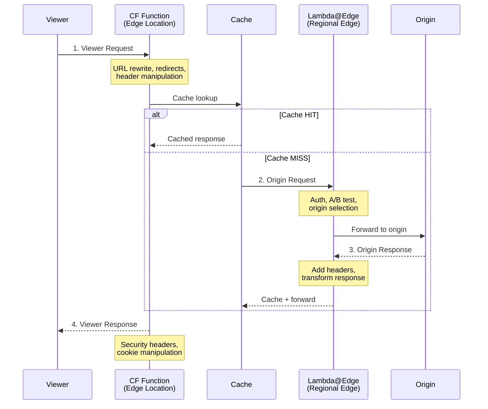
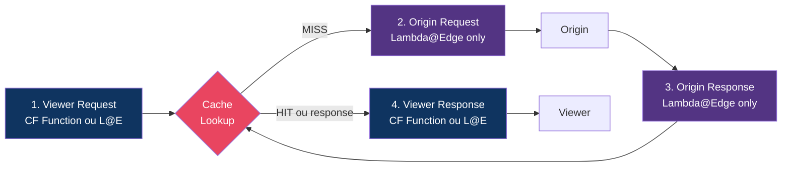

# Módulo 04 — CloudFront Functions e Lambda@Edge

> **Nível:** Intermediário-Avançado
> **Objetivo do Módulo:** Dominar as duas formas de executar código no edge do CloudFront — CloudFront Functions (leve e rápido) e Lambda@Edge (poderoso e flexível). Saber quando usar cada um e implementar cenários reais.

---

## Conceitos-Chave Antes de Começar

### CloudFront Functions vs Lambda@Edge



| Característica | CloudFront Functions | Lambda@Edge |
|---------------|---------------------|-------------|
| **Runtime** | JavaScript (cloudfront-js-2.0, ES6-ES12) | Node.js, Python |
| **Execução** | Edge Location (~750+) | Regional Edge Cache (~13) |
| **Duração máxima** | 1ms (viewer), 1ms | 5s (viewer), 30s (origin) |
| **Memória** | 2 MB | 128-3008 MB (viewer), 128-10240 MB (origin) |
| **Tamanho do código** | 10 KB | 1 MB (viewer), 50 MB (origin) |
| **Acesso à rede** | Não | Sim |
| **Acesso ao body** | Não | Sim |
| **Custo** | ~$0.10 / 1M invocações | ~$0.60 / 1M + duração |
| **Event types** | Viewer Request/Response | Viewer + Origin Request/Response |
| **Deploy** | Segundos | Minutos (replicação global) |
| **Acesso a AWS SDKs** | Não | Sim |

### Os 4 Event Types



### Quando Usar Cada Um

```
CloudFront Functions (rápido, barato, simples):
  ✅ Manipulação de URL (redirects, rewrites)
  ✅ Manipulação de headers (viewer request/response)
  ✅ Normalização (query strings, Accept-Language)
  ✅ Validação simples (token, geolocalização)
  ✅ A/B testing simples
  ❌ Chamadas de rede (APIs externas)
  ❌ Manipulação de body
  ❌ Lógica complexa (>1ms)

Lambda@Edge (poderoso, flexível, mais caro):
  ✅ Autenticação (JWT validation, OAuth)
  ✅ Resize de imagens
  ✅ Geração dinâmica de conteúdo
  ✅ Personalização por usuário
  ✅ Chamadas a APIs/DBs
  ✅ Manipulação do body
  ✅ Server-Side Rendering (SSR)
  ❌ Quando CloudFront Function resolve
```

---

## Desafio 16: CloudFront Functions — URL Rewrites e Redirects

### Objetivo
Criar CloudFront Functions para os cenários mais comuns: redirect HTTP→HTTPS, www→non-www, trailing slash, e URL rewrites para SPAs.

### Contexto
Redirects e rewrites são necessários em praticamente todo site. Fazer isso no CloudFront (edge) é muito mais rápido que na origin, pois a request nem chega ao servidor.

### Passo a Passo

#### Function 1: Redirect www para non-www

```javascript
// www-redirect.js
function handler(event) {
    var request = event.request;
    var host = request.headers.host.value;

    // Se acessou com www, redireciona para sem www
    if (host.startsWith('www.')) {
        var newHost = host.replace('www.', '');
        var newUrl = 'https://' + newHost + request.uri;

        // Preservar query string
        var qs = Object.keys(request.querystring)
            .map(function(key) {
                return key + '=' + request.querystring[key].value;
            })
            .join('&');

        if (qs) {
            newUrl += '?' + qs;
        }

        return {
            statusCode: 301,
            statusDescription: 'Moved Permanently',
            headers: {
                'location': { value: newUrl },
                'cache-control': { value: 'max-age=31536000' }
            }
        };
    }

    return request;
}
```

#### Function 2: SPA URL Rewrite (React/Vue/Angular)

```javascript
// spa-rewrite.js
// Problema: SPA com client-side routing
// /about, /products/123 → precisa servir index.html
// /static/js/app.js → precisa servir o arquivo real
function handler(event) {
    var request = event.request;
    var uri = request.uri;

    // Se o URI tem extensão de arquivo, servir normalmente
    if (uri.match(/\.[a-zA-Z0-9]+$/)) {
        return request;
    }

    // Se é uma rota de SPA (sem extensão), rewrite para index.html
    // Exemplos: /about, /products/123, /user/profile
    request.uri = '/index.html';

    return request;
}
```

#### Function 3: Trailing Slash + Index.html (sites estáticos)

```javascript
// trailing-slash.js
// S3 não serve index.html automaticamente em subdiretórios via CloudFront
// /about → precisa buscar /about/index.html
function handler(event) {
    var request = event.request;
    var uri = request.uri;

    // Se termina com / → adicionar index.html
    if (uri.endsWith('/')) {
        request.uri += 'index.html';
    }
    // Se não tem extensão e não termina com / → adicionar /index.html
    else if (!uri.match(/\.[a-zA-Z0-9]+$/)) {
        request.uri += '/index.html';
    }

    return request;
}
```

#### Function 4: Redirect por geolocalização

```javascript
// geo-redirect.js
function handler(event) {
    var request = event.request;
    var country = request.headers['cloudfront-viewer-country']
        ? request.headers['cloudfront-viewer-country'].value
        : '';

    var countryPaths = {
        'BR': '/pt-br',
        'PT': '/pt-pt',
        'ES': '/es',
        'MX': '/es',
        'FR': '/fr',
        'DE': '/de'
    };

    // Só redirecionar na raiz
    if (request.uri === '/' || request.uri === '') {
        var redirectPath = countryPaths[country] || '/en';
        return {
            statusCode: 302,
            statusDescription: 'Found',
            headers: {
                'location': { value: redirectPath },
                'cache-control': { value: 'max-age=0' }
            }
        };
    }

    return request;
}
```

#### Deploy via CLI

```bash
# 1. Criar a function
aws cloudfront create-function \
    --name spa-rewrite \
    --function-config '{
        "Comment": "SPA URL Rewrite para index.html",
        "Runtime": "cloudfront-js-2.0",
        "KeyValueStoreAssociations": {
            "Quantity": 0
        }
    }' \
    --function-code fileb://spa-rewrite.js

# 2. Testar a function (dry run)
aws cloudfront test-function \
    --name spa-rewrite \
    --if-match $(aws cloudfront describe-function --name spa-rewrite --query "ETag" --output text) \
    --event-object '{
        "version": "1.0",
        "context": {
            "eventType": "viewer-request"
        },
        "viewer": {
            "ip": "1.2.3.4"
        },
        "request": {
            "method": "GET",
            "uri": "/about",
            "headers": {
                "host": {"value": "example.com"}
            },
            "querystring": {}
        }
    }' | jq '.TestResult'

# 3. Publicar a function (necessário antes de associar)
ETAG=$(aws cloudfront describe-function --name spa-rewrite --query "ETag" --output text)
aws cloudfront publish-function \
    --name spa-rewrite \
    --if-match $ETAG

# 4. Associar ao behavior da distribution
# Obter config atual, adicionar FunctionAssociations, e atualizar
```

#### Deploy via Terraform

```hcl
resource "aws_cloudfront_function" "spa_rewrite" {
  name    = "spa-rewrite"
  runtime = "cloudfront-js-2.0"
  comment = "SPA URL Rewrite para index.html"
  publish = true
  code    = file("${path.module}/functions/spa-rewrite.js")
}

resource "aws_cloudfront_function" "www_redirect" {
  name    = "www-redirect"
  runtime = "cloudfront-js-2.0"
  comment = "Redirect www para non-www"
  publish = true
  code    = file("${path.module}/functions/www-redirect.js")
}

# Associar no behavior
resource "aws_cloudfront_distribution" "main" {
  # ...

  default_cache_behavior {
    # ...

    function_association {
      event_type   = "viewer-request"
      function_arn = aws_cloudfront_function.spa_rewrite.arn
    }

    function_association {
      event_type   = "viewer-response"
      function_arn = aws_cloudfront_function.add_security_headers.arn
    }
  }
}
```

### Como Testar

```bash
# 1. Testar SPA rewrite
curl -I "https://$DOMAIN/about"
# Deve retornar conteúdo do index.html (200 OK)

curl -I "https://$DOMAIN/products/123"
# Deve retornar conteúdo do index.html (200 OK)

curl -I "https://$DOMAIN/static/js/app.abc123.js"
# Deve retornar o arquivo JS real (não rewrite)

# 2. Testar www redirect
curl -I "https://www.$DOMAIN/"
# Deve retornar 301 com Location: https://$DOMAIN/

# 3. Testar geo redirect
curl -H "CloudFront-Viewer-Country: BR" -I "https://$DOMAIN/"
# Deve retornar 302 com Location: /pt-br

# 4. Testar trailing slash
curl -I "https://$DOMAIN/blog"
# Deve servir /blog/index.html

# 5. Verificar métricas da function
aws cloudfront get-function --name spa-rewrite \
    --query "FunctionSummary.FunctionMetadata"
```

### O Que Aprendemos

| Conceito | Descrição |
|----------|-----------|
| **cloudfront-js-2.0** | Runtime mais recente para CloudFront Functions |
| **viewer-request** | Executa antes do cache lookup |
| **viewer-response** | Executa antes de enviar resposta ao viewer |
| **test-function** | Testar sem deploy (dry run) |
| **publish** | Function precisa ser publicada antes de associar |
| **Redirect vs Rewrite** | Redirect muda a URL do browser; rewrite é transparente |
| **301 vs 302** | 301 = permanente (browser cacheia); 302 = temporário |

### Dica Expert
> Use `cloudfront-js-2.0` sempre — é mais rápido e suporta mais features que o 1.0. A limitação de 1ms parece pouca, mas CloudFront Functions são otimizadas e a maioria das operações de manipulação de string/header completa em ~0.1ms. Se estourar 1ms, você receberá um erro 503 — monitore a métrica `FunctionThrottles` no CloudWatch.

---

## Desafio 17: CloudFront Functions — A/B Testing e Feature Flags

### Objetivo
Implementar A/B testing no edge usando CloudFront Functions, distribuindo tráfego entre diferentes versões de uma aplicação sem necessidade de infraestrutura adicional.

### Contexto
A/B testing no edge é poderoso porque acontece antes do cache, é instantâneo, e não requer mudanças no backend. Empresas como Netflix e Amazon fazem isso em escala.

### Passo a Passo

#### Function: A/B Testing com Cookie Sticky

```javascript
// ab-testing.js
function handler(event) {
    var request = event.request;
    var cookies = request.cookies;

    // Configuração do teste
    var testName = 'homepage-v2';
    var cookieName = 'ab-' + testName;
    var variantAWeight = 70;  // 70% para variante A

    // Verificar se o usuário já tem uma variante atribuída
    var variant;
    if (cookies[cookieName]) {
        variant = cookies[cookieName].value;
    } else {
        // Atribuir variante baseada em peso
        // Usar último octeto do IP como pseudo-random
        var ip = event.viewer.ip;
        var lastOctet = parseInt(ip.split('.').pop()) || 0;
        var hash = (lastOctet * 31 + 17) % 100;  // 0-99

        variant = hash < variantAWeight ? 'A' : 'B';

        // Setar cookie para manter consistência
        request.headers['x-ab-variant'] = { value: variant };
    }

    // Rewrite para a versão correta
    if (variant === 'B' && request.uri === '/') {
        request.uri = '/index-v2.html';
    }

    // Adicionar header para tracking (analytics)
    request.headers['x-ab-test'] = { value: testName };
    request.headers['x-ab-variant'] = { value: variant };

    return request;
}
```

#### Function: Setar Cookie na Response

```javascript
// ab-testing-response.js
function handler(event) {
    var response = event.response;
    var request = event.request;

    var testName = 'homepage-v2';
    var cookieName = 'ab-' + testName;
    var variant = request.headers['x-ab-variant']
        ? request.headers['x-ab-variant'].value
        : 'A';

    // Setar cookie se não existe
    if (!request.cookies[cookieName]) {
        response.cookies[cookieName] = {
            value: variant,
            attributes: 'Path=/; Max-Age=2592000; Secure; SameSite=Lax'
            // 30 dias de duração
        };
    }

    // Adicionar header para debugging
    response.headers['x-ab-variant'] = { value: variant };

    return response;
}
```

#### Function: Feature Flags com KeyValueStore

```javascript
// feature-flags.js
// CloudFront KeyValueStore permite armazenar configurações
// que podem ser atualizadas sem redeploy da function
import cf from 'cloudfront';

// Referência ao KeyValueStore
var kvsId = 'arn:aws:cloudfront::123456789012:key-value-store/my-flags';
var kvsHandle = cf.kvs(kvsId);

async function handler(event) {
    var request = event.request;
    var uri = request.uri;

    // Buscar feature flag do KeyValueStore
    var maintenanceMode;
    try {
        maintenanceMode = await kvsHandle.get('maintenance_mode');
    } catch (err) {
        maintenanceMode = 'false';
    }

    // Se maintenance mode está ativo, servir página de manutenção
    if (maintenanceMode === 'true' && uri !== '/maintenance.html') {
        return {
            statusCode: 503,
            statusDescription: 'Service Unavailable',
            headers: {
                'content-type': { value: 'text/html' },
                'retry-after': { value: '3600' },
                'cache-control': { value: 'no-cache' }
            },
            body: {
                encoding: 'text',
                data: '<html><body><h1>Estamos em manutenção</h1><p>Voltamos em breve!</p></body></html>'
            }
        };
    }

    // Buscar canary release percentage
    var canaryPercent;
    try {
        canaryPercent = parseInt(await kvsHandle.get('canary_percent'));
    } catch (err) {
        canaryPercent = 0;
    }

    // Direcionar % do tráfego para a nova versão
    if (canaryPercent > 0) {
        var ip = event.viewer.ip;
        var hash = parseInt(ip.split('.').pop()) % 100;
        if (hash < canaryPercent) {
            request.headers['x-version'] = { value: 'canary' };
            request.uri = '/v2' + request.uri;
        }
    }

    return request;
}
```

#### Terraform: KeyValueStore

```hcl
resource "aws_cloudfront_key_value_store" "feature_flags" {
  name    = "feature-flags"
  comment = "Feature flags para A/B testing e canary releases"
}

# Associar KVS à function
resource "aws_cloudfront_function" "feature_flags" {
  name    = "feature-flags"
  runtime = "cloudfront-js-2.0"
  comment = "Feature flags com KeyValueStore"
  publish = true
  code    = file("${path.module}/functions/feature-flags.js")

  key_value_store_associations = [
    aws_cloudfront_key_value_store.feature_flags.arn
  ]
}
```

```bash
# Atualizar feature flags sem redeploy
aws cloudfront-keyvaluestore put-key \
    --kvs-arn "arn:aws:cloudfront::123456789012:key-value-store/feature-flags" \
    --key "maintenance_mode" \
    --value "true" \
    --if-match $(aws cloudfront-keyvaluestore describe-key-value-store \
        --kvs-arn "..." --query "ETag" --output text)

# Ativar canary para 10% do tráfego
aws cloudfront-keyvaluestore put-key \
    --kvs-arn "..." \
    --key "canary_percent" \
    --value "10" \
    --if-match "..."
```

### Como Testar

```bash
# 1. Testar A/B testing
for i in $(seq 1 10); do
    curl -s -I "https://$DOMAIN/" 2>&1 | grep "x-ab-variant"
done
# Deve mostrar mix de A e B (~70/30)

# 2. Testar com cookie fixo
curl -b "ab-homepage-v2=B" "https://$DOMAIN/"
# Sempre retorna variante B

# 3. Testar feature flags (maintenance mode)
# Ativar maintenance mode no KVS
curl "https://$DOMAIN/"
# Deve retornar 503 com página de manutenção

# 4. Testar canary release
# Setar canary_percent para 50 no KVS
for i in $(seq 1 20); do
    curl -s -I "https://$DOMAIN/" 2>&1 | grep "x-version"
done
# ~50% deve mostrar "canary"
```

### O Que Aprendemos

| Conceito | Descrição |
|----------|-----------|
| **A/B Testing no edge** | Distribuição de tráfego sem backend |
| **Cookie sticky** | Manter usuário na mesma variante |
| **KeyValueStore** | Armazenamento chave-valor acessível de Functions |
| **Feature flags** | Ativar/desativar features sem deploy |
| **Canary release** | Direcionar % do tráfego para nova versão |
| **Maintenance mode** | Página de manutenção sem tocar na origin |

### Dica Expert
> **KeyValueStore é game-changer.** Antes, para mudar o comportamento de uma CloudFront Function, você precisava fazer redeploy. Agora, com KVS, você pode mudar configurações em tempo real (propagação em ~5-10 segundos). Use para: feature flags, maintenance mode, canary percentages, blocklists, A/B test configurations. O KVS suporta até 5MB de dados e tem performance de sub-milissegundo.

---

## Desafio 18: Lambda@Edge — Autenticação JWT no Edge

### Objetivo
Implementar validação de JWT (JSON Web Token) no edge usando Lambda@Edge, bloqueando requests não autenticados antes de chegar à origin.

### Contexto
Autenticação no edge reduz carga na origin, melhora segurança (requests inválidos nem chegam ao backend), e diminui latência. É o caso de uso #1 de Lambda@Edge.

### Passo a Passo

#### 1. Criar a Lambda Function

```javascript
// lambda-edge-jwt-auth/index.js
'use strict';

const crypto = require('crypto');

// Chave secreta para validação do JWT (em produção, use AWS Secrets Manager)
// Para RS256, use a chave pública
const JWT_SECRET = 'your-secret-key-here';

// Paths que NÃO precisam de autenticação
const PUBLIC_PATHS = [
    '/',
    '/index.html',
    '/login',
    '/health',
    '/static/',
    '/public/',
    '/favicon.ico'
];

exports.handler = async (event) => {
    const request = event.Records[0].cf.request;
    const uri = request.uri;

    // Verificar se é path público
    for (const publicPath of PUBLIC_PATHS) {
        if (uri === publicPath || uri.startsWith(publicPath)) {
            return request; // Permitir sem autenticação
        }
    }

    // Obter o token do header Authorization
    const authHeader = request.headers.authorization;
    if (!authHeader || !authHeader[0]) {
        return unauthorizedResponse('Missing Authorization header');
    }

    const token = authHeader[0].value.replace('Bearer ', '');

    try {
        // Validar JWT (implementação simplificada para HS256)
        const payload = verifyJWT(token, JWT_SECRET);

        // Adicionar informações do usuário como headers para a origin
        request.headers['x-user-id'] = [{ value: payload.sub }];
        request.headers['x-user-email'] = [{ value: payload.email || '' }];
        request.headers['x-user-role'] = [{ value: payload.role || 'user' }];

        // Verificar expiração
        if (payload.exp && payload.exp < Math.floor(Date.now() / 1000)) {
            return unauthorizedResponse('Token expired');
        }

        return request;

    } catch (error) {
        return unauthorizedResponse('Invalid token: ' + error.message);
    }
};

function verifyJWT(token, secret) {
    const parts = token.split('.');
    if (parts.length !== 3) {
        throw new Error('Invalid token format');
    }

    const [headerB64, payloadB64, signatureB64] = parts;

    // Verificar assinatura
    const expectedSignature = crypto
        .createHmac('sha256', secret)
        .update(headerB64 + '.' + payloadB64)
        .digest('base64url');

    if (signatureB64 !== expectedSignature) {
        throw new Error('Invalid signature');
    }

    // Decodificar payload
    const payload = JSON.parse(
        Buffer.from(payloadB64, 'base64url').toString()
    );

    return payload;
}

function unauthorizedResponse(message) {
    return {
        status: '401',
        statusDescription: 'Unauthorized',
        headers: {
            'content-type': [{ value: 'application/json' }],
            'cache-control': [{ value: 'no-store' }],
            'www-authenticate': [{ value: 'Bearer' }]
        },
        body: JSON.stringify({
            error: 'Unauthorized',
            message: message
        })
    };
}
```

#### 2. Deploy da Lambda@Edge

```bash
# 1. Criar o ZIP
cd lambda-edge-jwt-auth
zip -r function.zip index.js

# 2. Criar a function (DEVE ser em us-east-1)
aws lambda create-function \
    --function-name cloudfront-jwt-auth \
    --runtime nodejs20.x \
    --role arn:aws:iam::123456789012:role/lambda-edge-role \
    --handler index.handler \
    --zip-file fileb://function.zip \
    --region us-east-1 \
    --timeout 5 \
    --memory-size 128

# 3. Publicar uma versão (Lambda@Edge requer versão publicada)
VERSION=$(aws lambda publish-version \
    --function-name cloudfront-jwt-auth \
    --region us-east-1 \
    --query "Version" --output text)

echo "Version: $VERSION"

# 4. A ARN para Lambda@Edge deve incluir a versão
LAMBDA_ARN="arn:aws:lambda:us-east-1:123456789012:function:cloudfront-jwt-auth:$VERSION"
```

#### 3. IAM Role para Lambda@Edge

```json
{
    "Version": "2012-10-17",
    "Statement": [
        {
            "Effect": "Allow",
            "Principal": {
                "Service": [
                    "lambda.amazonaws.com",
                    "edgelambda.amazonaws.com"
                ]
            },
            "Action": "sts:AssumeRole"
        }
    ]
}
```

```hcl
# Terraform
resource "aws_iam_role" "lambda_edge" {
  name = "lambda-edge-role"

  assume_role_policy = jsonencode({
    Version = "2012-10-17"
    Statement = [
      {
        Action = "sts:AssumeRole"
        Effect = "Allow"
        Principal = {
          Service = [
            "lambda.amazonaws.com",
            "edgelambda.amazonaws.com"  # OBRIGATÓRIO para Lambda@Edge
          ]
        }
      }
    ]
  })
}

resource "aws_iam_role_policy_attachment" "lambda_edge_basic" {
  role       = aws_iam_role.lambda_edge.name
  policy_arn = "arn:aws:iam::aws:policy/service-role/AWSLambdaBasicExecutionRole"
}
```

#### 4. Associar ao CloudFront

```hcl
resource "aws_cloudfront_distribution" "authenticated" {
  # ... origins, etc

  ordered_cache_behavior {
    path_pattern = "/api/*"
    # ...

    lambda_function_association {
      event_type   = "viewer-request"  # Antes do cache
      lambda_arn   = aws_lambda_function.jwt_auth.qualified_arn
      include_body = false
    }
  }

  # Para behaviors que precisam de auth na origin request
  ordered_cache_behavior {
    path_pattern = "/protected/*"
    # ...

    lambda_function_association {
      event_type   = "origin-request"  # Depois de cache miss
      lambda_arn   = aws_lambda_function.jwt_auth.qualified_arn
      include_body = false
    }
  }
}

resource "aws_lambda_function" "jwt_auth" {
  provider      = aws.us_east_1  # DEVE ser us-east-1
  function_name = "cloudfront-jwt-auth"
  role          = aws_iam_role.lambda_edge.arn
  handler       = "index.handler"
  runtime       = "nodejs20.x"
  timeout       = 5
  memory_size   = 128
  publish       = true  # Lambda@Edge requer versão publicada

  filename         = "${path.module}/lambda/jwt-auth.zip"
  source_code_hash = filebase64sha256("${path.module}/lambda/jwt-auth.zip")
}
```

### Como Testar

```bash
# 1. Request sem token (deve falhar)
curl -I "https://$DOMAIN/api/users"
# HTTP/2 401
# {"error": "Unauthorized", "message": "Missing Authorization header"}

# 2. Request com token inválido
curl -I "https://$DOMAIN/api/users" \
    -H "Authorization: Bearer invalid-token"
# HTTP/2 401
# {"error": "Unauthorized", "message": "Invalid token: Invalid token format"}

# 3. Gerar um JWT válido para teste
# Usando Node.js:
node -e "
const crypto = require('crypto');
const header = Buffer.from(JSON.stringify({alg:'HS256',typ:'JWT'})).toString('base64url');
const payload = Buffer.from(JSON.stringify({sub:'user123',email:'user@test.com',role:'admin',exp:Math.floor(Date.now()/1000)+3600})).toString('base64url');
const signature = crypto.createHmac('sha256','your-secret-key-here').update(header+'.'+payload).digest('base64url');
console.log(header+'.'+payload+'.'+signature);
"

# 4. Request com token válido
curl "https://$DOMAIN/api/users" \
    -H "Authorization: Bearer <token-gerado-acima>"
# HTTP/2 200 (request passa para a origin)

# 5. Request para path público (sem auth necessário)
curl "https://$DOMAIN/"
# HTTP/2 200 (não precisa de token)

# 6. Verificar que headers do usuário chegam na origin
# No backend, loggar os headers x-user-id, x-user-email, x-user-role
```

### O Que Aprendemos

| Conceito | Descrição |
|----------|-----------|
| **Lambda@Edge** | Lambda executada em edge locations do CloudFront |
| **us-east-1** | Lambda@Edge DEVE ser criada em us-east-1 |
| **Versão publicada** | Lambda@Edge requer `publish = true` |
| **edgelambda.amazonaws.com** | Principal adicional na trust policy |
| **viewer-request** | Executa antes do cache (bloqueia antes de tudo) |
| **origin-request** | Executa após cache miss (permite cache de requests autenticados) |
| **include_body** | Se Lambda precisa acessar o body da request |

### viewer-request vs origin-request para Auth

| Aspecto | viewer-request | origin-request |
|---------|---------------|----------------|
| **Quando executa** | Toda request | Apenas cache miss |
| **Latência** | Adiciona latência a TODA request | Latência apenas em cache miss |
| **Custo** | Mais caro (executa sempre) | Mais barato (executa menos) |
| **Cache** | Auth é verificada antes do cache | Cache pode servir sem re-auth |
| **Segurança** | Mais seguro (sempre verifica) | Request cacheada pode ser servida a outro user |
| **Melhor para** | APIs dinâmicas (sem cache) | Conteúdo estático protegido |

### Dica Expert
> **Nunca armazene segredos no código da Lambda@Edge.** Use AWS Systems Manager Parameter Store ou Secrets Manager. Porém, Lambda@Edge tem restrição de acesso: ela executa em múltiplas regiões, então use `us-east-1` para Secrets Manager e faça cache do segredo na memória da Lambda (cold start pegará da API, warm invocações usam cache). Para JWT com RS256, armazene a chave pública como variável de ambiente.

---

## Desafio 19: Lambda@Edge — Resize de Imagens On-the-Fly

### Objetivo
Implementar redimensionamento de imagens dinâmico usando Lambda@Edge + S3, onde o tamanho é especificado na URL.

### Contexto
Servir imagens em diferentes tamanhos é essencial para performance web. Em vez de pré-gerar todas as variações, Lambda@Edge redimensiona sob demanda e cacheia o resultado.

### Arquitetura

```
User: /images/photo.jpg?w=300&h=200&q=80

CloudFront → Cache HIT? → Retorna imagem cacheada (300x200)
                │
               MISS
                │
       Lambda@Edge (Origin Response)
                │
       1. Busca imagem original do S3
       2. Redimensiona para 300x200 com qualidade 80
       3. Retorna imagem redimensionada
       4. CloudFront cacheia o resultado
```

### Passo a Passo

#### 1. Lambda@Edge com Sharp

```javascript
// image-resize/index.js
'use strict';

const AWS = require('aws-sdk');
const sharp = require('sharp');

const S3 = new AWS.S3({ region: 'us-east-1' });
const BUCKET = 'meu-bucket-imagens';

// Tamanhos permitidos (prevenir abuse)
const ALLOWED_WIDTHS = [100, 200, 300, 400, 600, 800, 1200, 1920];
const ALLOWED_QUALITIES = [60, 70, 80, 90, 100];
const MAX_WIDTH = 1920;
const MAX_HEIGHT = 1080;

exports.handler = async (event) => {
    const response = event.Records[0].cf.response;
    const request = event.Records[0].cf.request;

    // Se a origin retornou 200, não precisa processar
    // (já existe no tamanho solicitado)
    if (response.status === '200') {
        return response;
    }

    // Parse query strings
    const params = new URLSearchParams(request.querystring);
    let width = parseInt(params.get('w')) || 0;
    let height = parseInt(params.get('h')) || 0;
    let quality = parseInt(params.get('q')) || 80;
    const format = params.get('f') || 'auto';

    // Validar parâmetros
    if (width && !ALLOWED_WIDTHS.includes(width)) {
        width = ALLOWED_WIDTHS.reduce((prev, curr) =>
            Math.abs(curr - width) < Math.abs(prev - width) ? curr : prev
        );
    }
    width = Math.min(width, MAX_WIDTH);
    height = Math.min(height, MAX_HEIGHT);
    quality = ALLOWED_QUALITIES.reduce((prev, curr) =>
        Math.abs(curr - quality) < Math.abs(prev - quality) ? curr : prev
    );

    // Extrair path da imagem original
    const key = request.uri.replace(/^\//, '');

    try {
        // Buscar imagem original do S3
        const s3Object = await S3.getObject({
            Bucket: BUCKET,
            Key: key
        }).promise();

        // Determinar formato de saída
        let outputFormat;
        const accept = request.headers.accept
            ? request.headers.accept[0].value
            : '';

        if (format === 'webp' || (format === 'auto' && accept.includes('image/webp'))) {
            outputFormat = 'webp';
        } else if (format === 'avif' || (format === 'auto' && accept.includes('image/avif'))) {
            outputFormat = 'avif';
        } else {
            outputFormat = 'jpeg';
        }

        // Redimensionar
        let sharpInstance = sharp(s3Object.Body);

        if (width || height) {
            sharpInstance = sharpInstance.resize({
                width: width || undefined,
                height: height || undefined,
                fit: 'inside',
                withoutEnlargement: true
            });
        }

        // Converter e comprimir
        let outputBuffer;
        let contentType;

        switch (outputFormat) {
            case 'webp':
                outputBuffer = await sharpInstance.webp({ quality }).toBuffer();
                contentType = 'image/webp';
                break;
            case 'avif':
                outputBuffer = await sharpInstance.avif({ quality }).toBuffer();
                contentType = 'image/avif';
                break;
            default:
                outputBuffer = await sharpInstance.jpeg({ quality, progressive: true }).toBuffer();
                contentType = 'image/jpeg';
        }

        // Opcional: salvar no S3 para cache futuro (evita reprocessar)
        const resizedKey = `resized/${width}x${height}/${quality}/${outputFormat}/${key}`;
        await S3.putObject({
            Bucket: BUCKET,
            Key: resizedKey,
            Body: outputBuffer,
            ContentType: contentType,
            CacheControl: 'max-age=31536000'
        }).promise();

        // Retornar imagem redimensionada
        return {
            status: '200',
            statusDescription: 'OK',
            headers: {
                'content-type': [{ value: contentType }],
                'cache-control': [{ value: 'max-age=31536000' }],
                'x-image-resized': [{ value: `${width}x${height} q${quality} ${outputFormat}` }]
            },
            body: outputBuffer.toString('base64'),
            bodyEncoding: 'base64'
        };

    } catch (error) {
        console.error('Error resizing image:', error);
        return response; // Retorna a resposta original da origin
    }
};
```

#### 2. Cache Policy para Imagens com Parâmetros

```hcl
resource "aws_cloudfront_cache_policy" "image_resize" {
  name        = "Image-Resize-Cache"
  comment     = "Cache por dimensões e qualidade"
  default_ttl = 31536000  # 1 ano
  max_ttl     = 31536000
  min_ttl     = 86400     # 1 dia

  parameters_in_cache_key_and_forwarded_to_origin {
    enable_accept_encoding_gzip   = false  # Imagens não comprimem bem com gzip
    enable_accept_encoding_brotli = false

    headers_config {
      header_behavior = "whitelist"
      headers {
        items = ["Accept"]  # Para content negotiation (webp/avif)
      }
    }

    cookies_config {
      cookie_behavior = "none"
    }

    query_strings_config {
      query_string_behavior = "whitelist"
      query_strings {
        items = ["w", "h", "q", "f"]  # width, height, quality, format
      }
    }
  }
}
```

### Como Testar

```bash
# 1. Upload de imagem original
aws s3 cp photo.jpg s3://meu-bucket-imagens/images/photo.jpg

# 2. Solicitar diferentes tamanhos
curl -o photo-300.jpg "https://$DOMAIN/images/photo.jpg?w=300"
curl -o photo-800.jpg "https://$DOMAIN/images/photo.jpg?w=800&h=600"
curl -o photo-thumb.jpg "https://$DOMAIN/images/photo.jpg?w=100&q=60"

# 3. Solicitar WebP (browser suporta)
curl -H "Accept: image/webp" -o photo.webp "https://$DOMAIN/images/photo.jpg?w=600&f=webp"

# 4. Verificar tamanhos
file photo-300.jpg photo-800.jpg photo-thumb.jpg
ls -la photo-*.jpg photo.webp

# 5. Verificar cache hit na segunda request
curl -I "https://$DOMAIN/images/photo.jpg?w=300"
# x-cache: Hit from cloudfront (cacheado!)
```

### O Que Aprendemos

| Conceito | Descrição |
|----------|-----------|
| **Origin Response** | Lambda executa após receber resposta da origin |
| **Content Negotiation** | Servir formato ideal baseado no header Accept |
| **Body encoding** | `base64` para conteúdo binário na response |
| **Whitelist params** | Incluir apenas w, h, q, f na cache key |
| **withoutEnlargement** | Não ampliar imagens menores que o tamanho solicitado |
| **Progressive JPEG** | Melhor experiência de carregamento |

### Dica Expert
> **Na prática, use Lambda@Edge para resize apenas em escala moderada.** Para alto tráfego (>1M images/dia), considere **pre-generate** com S3 + Lambda (event-driven) ou use **Thumbor** atrás do CloudFront. O body size limit do Lambda@Edge é 1MB para viewer events e 1MB para origin response — imagens maiores precisam de workaround (redirect para S3 presigned URL do resized).

---

## Desafio 20: Lambda@Edge — Server-Side Rendering (SSR) no Edge

### Objetivo
Implementar SSR leve no edge usando Lambda@Edge para gerar páginas HTML dinamicamente, com cache inteligente.

### Contexto
SSR no edge combina o melhor dos dois mundos: conteúdo dinâmico (SEO, performance percebida) com entrega próxima do usuário. Ideal para landing pages, páginas de produto, e meta tags para redes sociais.

### Passo a Passo

#### Lambda@Edge para SSR com Cache

```javascript
// ssr-edge/index.js
'use strict';

const https = require('https');

// Template HTML base
function renderPage(data, meta) {
    return `<!DOCTYPE html>
<html lang="${meta.lang || 'pt-BR'}">
<head>
    <meta charset="UTF-8">
    <meta name="viewport" content="width=device-width, initial-scale=1.0">
    <title>${meta.title}</title>
    <meta name="description" content="${meta.description}">

    <!-- Open Graph para redes sociais -->
    <meta property="og:title" content="${meta.title}">
    <meta property="og:description" content="${meta.description}">
    <meta property="og:image" content="${meta.image}">
    <meta property="og:url" content="${meta.url}">
    <meta property="og:type" content="website">

    <!-- Twitter Card -->
    <meta name="twitter:card" content="summary_large_image">
    <meta name="twitter:title" content="${meta.title}">
    <meta name="twitter:description" content="${meta.description}">
    <meta name="twitter:image" content="${meta.image}">

    <link rel="stylesheet" href="/static/css/style.css">
</head>
<body>
    <div id="root">${data.html}</div>
    <script>window.__INITIAL_STATE__ = ${JSON.stringify(data.state)};</script>
    <script src="/static/js/app.js"></script>
</body>
</html>`;
}

exports.handler = async (event) => {
    const request = event.Records[0].cf.request;
    const uri = request.uri;

    // Detectar se é um bot/crawler (para SEO)
    const userAgent = request.headers['user-agent']
        ? request.headers['user-agent'][0].value.toLowerCase()
        : '';

    const isCrawler = /bot|crawl|spider|slurp|facebot|twitterbot|linkedinbot/i.test(userAgent);

    // Se não é crawler e não é página de SEO, servir SPA normalmente
    if (!isCrawler && !uri.startsWith('/product/')) {
        return request;
    }

    // Extrair ID do produto da URL
    const productMatch = uri.match(/^\/product\/(\d+)/);
    if (!productMatch) {
        return request;
    }
    const productId = productMatch[1];

    try {
        // Buscar dados do produto da API interna
        const productData = await fetchProduct(productId);

        if (!productData) {
            return {
                status: '404',
                statusDescription: 'Not Found',
                headers: {
                    'content-type': [{ value: 'text/html' }],
                    'cache-control': [{ value: 'max-age=300' }]
                },
                body: '<html><body><h1>Produto não encontrado</h1></body></html>'
            };
        }

        const html = renderPage(
            {
                html: `<h1>${productData.name}</h1><p>${productData.description}</p><span>R$ ${productData.price}</span>`,
                state: { product: productData }
            },
            {
                title: `${productData.name} | Minha Loja`,
                description: productData.description.substring(0, 160),
                image: productData.imageUrl,
                url: `https://minhaloja.com/product/${productId}`,
                lang: 'pt-BR'
            }
        );

        return {
            status: '200',
            statusDescription: 'OK',
            headers: {
                'content-type': [{ value: 'text/html; charset=utf-8' }],
                'cache-control': [{ value: 'max-age=300, s-maxage=3600' }],
                'x-rendered-by': [{ value: 'lambda-edge-ssr' }]
            },
            body: html
        };

    } catch (error) {
        console.error('SSR Error:', error);
        return request; // Fallback: servir SPA normalmente
    }
};

function fetchProduct(productId) {
    return new Promise((resolve, reject) => {
        const options = {
            hostname: 'api-internal.minhaloja.com',
            path: `/v1/products/${productId}`,
            method: 'GET',
            timeout: 3000
        };

        const req = https.request(options, (res) => {
            let data = '';
            res.on('data', chunk => data += chunk);
            res.on('end', () => {
                if (res.statusCode === 200) {
                    resolve(JSON.parse(data));
                } else {
                    resolve(null);
                }
            });
        });

        req.on('error', reject);
        req.on('timeout', () => req.destroy(new Error('Timeout')));
        req.end();
    });
}
```

### O Que Aprendemos

| Conceito | Descrição |
|----------|-----------|
| **SSR no Edge** | Renderizar HTML dinamicamente em edge locations |
| **Crawler detection** | Servir HTML renderizado para bots, SPA para humanos |
| **Open Graph** | Meta tags para preview em redes sociais |
| **s-maxage** | Cache na CDN diferente do browser cache |
| **Fallback** | Se SSR falha, servir SPA normalmente |
| **Hydration** | `window.__INITIAL_STATE__` para o frontend reusar dados |

---

## Desafio 21: CloudFront Functions — Security Headers e Rate Limiting Básico

### Objetivo
Implementar headers de segurança e rate limiting básico usando CloudFront Functions com KeyValueStore.

### Passo a Passo

#### Security Headers Function

```javascript
// security-headers-response.js
function handler(event) {
    var response = event.response;
    var headers = response.headers;

    // Security headers
    headers['strict-transport-security'] = { value: 'max-age=63072000; includeSubDomains; preload' };
    headers['x-content-type-options'] = { value: 'nosniff' };
    headers['x-frame-options'] = { value: 'DENY' };
    headers['x-xss-protection'] = { value: '1; mode=block' };
    headers['referrer-policy'] = { value: 'strict-origin-when-cross-origin' };
    headers['permissions-policy'] = { value: 'camera=(), microphone=(), geolocation=(self)' };

    // Remover headers que expõem informações
    delete headers['server'];
    delete headers['x-powered-by'];
    delete headers['x-aspnet-version'];

    // Adicionar header de timing (debug)
    headers['x-edge-location'] = { value: event.context.distributionDomainName || 'unknown' };

    return response;
}
```

#### Basic Token Validation Function

```javascript
// token-validation.js
// Validação simples de API key no edge (rápido, sem rede)
import cf from 'cloudfront';

var kvsHandle = cf.kvs('arn:aws:cloudfront::123456789012:key-value-store/api-keys');

async function handler(event) {
    var request = event.request;

    // Paths públicos
    if (request.uri === '/health' || request.uri.startsWith('/public/')) {
        return request;
    }

    // Verificar API key
    var apiKey = request.headers['x-api-key']
        ? request.headers['x-api-key'].value
        : request.querystring['api_key']
            ? request.querystring['api_key'].value
            : '';

    if (!apiKey) {
        return {
            statusCode: 401,
            statusDescription: 'Unauthorized',
            headers: {
                'content-type': { value: 'application/json' }
            },
            body: '{"error":"Missing API key"}'
        };
    }

    // Validar contra KeyValueStore
    try {
        var keyData = await kvsHandle.get(apiKey);
        var parsed = JSON.parse(keyData);

        // Adicionar metadata do cliente como headers
        request.headers['x-client-name'] = { value: parsed.name || 'unknown' };
        request.headers['x-client-tier'] = { value: parsed.tier || 'free' };

        // Remover API key do query string (não enviar à origin)
        delete request.querystring['api_key'];

        return request;
    } catch (e) {
        return {
            statusCode: 403,
            statusDescription: 'Forbidden',
            headers: {
                'content-type': { value: 'application/json' }
            },
            body: '{"error":"Invalid API key"}'
        };
    }
}
```

### Como Testar

```bash
# 1. Verificar security headers
curl -I "https://$DOMAIN/"
# strict-transport-security: max-age=63072000...
# x-content-type-options: nosniff
# x-frame-options: DENY
# (server header removido)

# 2. Testar API key validation
curl "https://$DOMAIN/api/data"
# 401: Missing API key

curl "https://$DOMAIN/api/data" -H "x-api-key: valid-key-123"
# 200 (se a key existe no KVS)

curl "https://$DOMAIN/api/data?api_key=valid-key-123"
# 200 (API key via query string)
```

---

## Desafio 22: Combinando Functions e Lambda@Edge — Arquitetura Completa

### Objetivo
Criar uma arquitetura que combina CloudFront Functions e Lambda@Edge para máxima performance e funcionalidade.

### Regra de Associação

| Event Type | CloudFront Function | Lambda@Edge | Ambos? |
|-----------|-------------------|-------------|--------|
| viewer-request | Sim | Sim | NÃO (apenas um) |
| viewer-response | Sim | Sim | NÃO (apenas um) |
| origin-request | Não | Sim | — |
| origin-response | Não | Sim | — |

> **Você NÃO pode ter CloudFront Function E Lambda@Edge no mesmo event type do mesmo behavior.** Mas pode ter CF Function no viewer-request e Lambda@Edge no origin-request.

### Arquitetura Recomendada

```
Viewer Request:  CloudFront Function
                 ├── URL rewrite (SPA)
                 ├── Normalizar query strings
                 ├── A/B testing (cookie)
                 └── Redirect (www, geo)

Origin Request:  Lambda@Edge
                 ├── Autenticação (JWT)
                 ├── Autorização
                 └── Roteamento avançado

Origin Response: Lambda@Edge
                 ├── Resize de imagens
                 ├── SSR
                 └── Transformação de response

Viewer Response: CloudFront Function
                 ├── Security headers
                 ├── CORS headers
                 └── Cookie setting (A/B)
```

### Terraform Completo

```hcl
# ============================================================
# CLOUDFRONT FUNCTIONS
# ============================================================

resource "aws_cloudfront_function" "viewer_request" {
  name    = "viewer-request-handler"
  runtime = "cloudfront-js-2.0"
  publish = true
  code    = file("${path.module}/functions/viewer-request.js")

  key_value_store_associations = [
    aws_cloudfront_key_value_store.config.arn
  ]
}

resource "aws_cloudfront_function" "viewer_response" {
  name    = "viewer-response-handler"
  runtime = "cloudfront-js-2.0"
  publish = true
  code    = file("${path.module}/functions/viewer-response.js")
}

# ============================================================
# LAMBDA@EDGE
# ============================================================

resource "aws_lambda_function" "origin_request_auth" {
  provider      = aws.us_east_1
  function_name = "cf-origin-request-auth"
  role          = aws_iam_role.lambda_edge.arn
  handler       = "index.handler"
  runtime       = "nodejs20.x"
  timeout       = 5
  memory_size   = 256
  publish       = true

  filename         = "${path.module}/lambda/origin-request-auth.zip"
  source_code_hash = filebase64sha256("${path.module}/lambda/origin-request-auth.zip")
}

resource "aws_lambda_function" "origin_response_transform" {
  provider      = aws.us_east_1
  function_name = "cf-origin-response-transform"
  role          = aws_iam_role.lambda_edge.arn
  handler       = "index.handler"
  runtime       = "nodejs20.x"
  timeout       = 30
  memory_size   = 512
  publish       = true

  filename         = "${path.module}/lambda/origin-response-transform.zip"
  source_code_hash = filebase64sha256("${path.module}/lambda/origin-response-transform.zip")
}

# ============================================================
# DISTRIBUTION COM TUDO
# ============================================================

resource "aws_cloudfront_distribution" "full_stack" {
  enabled         = true
  comment         = "Full Stack - Functions + Lambda@Edge"

  # ... origins ...

  # Behavior: API (todas as layers)
  ordered_cache_behavior {
    path_pattern = "/api/*"
    target_origin_id = "ALB-API"
    # ...

    # CloudFront Function no viewer-request
    function_association {
      event_type   = "viewer-request"
      function_arn = aws_cloudfront_function.viewer_request.arn
    }

    # Lambda@Edge no origin-request
    lambda_function_association {
      event_type   = "origin-request"
      lambda_arn   = aws_lambda_function.origin_request_auth.qualified_arn
      include_body = true
    }

    # Lambda@Edge no origin-response
    lambda_function_association {
      event_type   = "origin-response"
      lambda_arn   = aws_lambda_function.origin_response_transform.qualified_arn
      include_body = false
    }

    # CloudFront Function no viewer-response
    function_association {
      event_type   = "viewer-response"
      function_arn = aws_cloudfront_function.viewer_response.arn
    }
  }

  # ... viewer_certificate, restrictions, etc ...
}
```

### O Que Aprendemos no Módulo

| Conceito | Descrição |
|----------|-----------|
| **CloudFront Functions** | Rápidas (sub-ms), baratas, para manipulações simples |
| **Lambda@Edge** | Poderosas, para lógica complexa com rede/body |
| **KeyValueStore** | Config dinâmica sem redeploy de functions |
| **4 Event Types** | viewer-request, origin-request, origin-response, viewer-response |
| **Combinação** | CF Function + Lambda@Edge em events diferentes |
| **us-east-1** | Lambda@Edge DEVE ser criada nesta região |
| **Versão publicada** | Lambda@Edge requer publish = true |

---

## Resumo do Módulo 04

```
CloudFront Functions (rápido, barato)        Lambda@Edge (poderoso)
├── URL Rewrites/Redirects                   ├── JWT Authentication
├── Header Manipulation                      ├── Image Resize
├── A/B Testing                              ├── SSR
├── Normalização                             ├── API Calls
├── Feature Flags (KVS)                      ├── Body Manipulation
├── API Key Validation                       ├── Dynamic Origin Selection
└── Security Headers                         └── Complex Authorization
```

**Próximo:** [Módulo 05 — Segurança Avançada →](modulo-05-seguranca-avancada.md)
