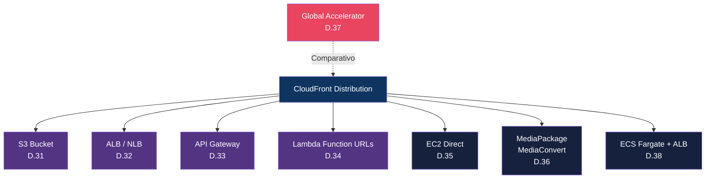

# Módulo 06 — Integrações com Serviços AWS

> **Nível:** 300-400 (Advanced/Expert)
> **Tempo Total Estimado:** 10-14 horas de labs
> **Objetivo do Módulo:** Dominar todas as integrações possíveis do CloudFront com outros serviços AWS — de S3 e ALB até Lambda Function URLs, API Gateway, streaming, e containers.

---

## Mapa de Integrações



---

## Desafio 31: CloudFront + S3 — Todas as Combinações

> **Level:** 300 | **Tempo:** 60 min | **Custo:** Free tier

### Objetivo
Dominar todas as formas de integrar CloudFront com S3, incluindo cenários avançados como upload via CloudFront e SSE-KMS.

### Os 5 Modos de Integração S3

| Modo | Origin Type | Acesso | Quando Usar |
|------|-----------|--------|-------------|
| **S3 REST + OAC** | S3 origin | Privado (OAC) | 90% dos casos — seguro e moderno |
| **S3 Website Hosting** | Custom origin | Público (sem OAC) | Quando precisa de redirects/index do S3 |
| **S3 + Presigned URLs** | S3 origin + OAC | Temporário | Uploads/downloads temporários |
| **S3 + SSE-KMS** | S3 origin + OAC | Privado (KMS) | Compliance, criptografia gerenciada |
| **S3 Upload via CF** | S3 origin + OAC | PUT via CloudFront | Upload de arquivos via CDN |

### Modo 1: S3 REST + OAC (Padrão — já visto no Módulo 01)

Revisão rápida:
```hcl
origin {
  domain_name              = aws_s3_bucket.site.bucket_regional_domain_name
  origin_id                = "S3-Site"
  origin_access_control_id = aws_cloudfront_origin_access_control.main.id
}
```

### Modo 2: S3 Static Website Hosting (Custom Origin)

```
Diferença:
  S3 REST endpoint:     meu-bucket.s3.us-east-1.amazonaws.com
  S3 Website endpoint:  meu-bucket.s3-website-us-east-1.amazonaws.com
```

**Quando usar S3 Website Hosting:**
- Precisa de `index.html` automático em subdiretórios (`/about/` → `/about/index.html`)
- Precisa de redirect rules do S3 (HTTP redirects configuráveis)
- Precisa de custom error documents do S3

**Limitação:** Não suporta OAC. O bucket precisa ser público ou usar Referer header check.

```hcl
# Habilitar website hosting no S3
resource "aws_s3_bucket_website_configuration" "site" {
  bucket = aws_s3_bucket.site.id

  index_document { suffix = "index.html" }
  error_document { key    = "error.html" }

  routing_rule {
    condition { key_prefix_equals = "docs/" }
    redirect {
      replace_key_prefix_with = "documentation/"
      http_redirect_code      = "301"
    }
  }
}

# CloudFront com S3 Website como CUSTOM origin (não S3 origin)
resource "aws_cloudfront_distribution" "s3_website" {
  origin {
    domain_name = aws_s3_bucket_website_configuration.site.website_endpoint
    origin_id   = "S3-Website"

    custom_origin_config {
      http_port              = 80
      https_port             = 443
      origin_protocol_policy = "http-only"  # S3 website só suporta HTTP
      origin_ssl_protocols   = ["TLSv1.2"]
    }

    # Sem OAC! Usar Referer header como alternativa
    custom_header {
      name  = "Referer"
      value = "https://secret-referer-string-12345.site.com"
    }
  }

  default_cache_behavior {
    allowed_methods        = ["GET", "HEAD"]
    cached_methods         = ["GET", "HEAD"]
    target_origin_id       = "S3-Website"
    cache_policy_id        = "658327ea-f89d-4fab-a63d-7e88639e58f6"
    viewer_protocol_policy = "redirect-to-https"
    compress               = true
  }

  # ...
}

# Bucket policy: permitir acesso apenas com Referer correto
resource "aws_s3_bucket_policy" "website" {
  bucket = aws_s3_bucket.site.id
  policy = jsonencode({
    Version = "2012-10-17"
    Statement = [
      {
        Sid       = "AllowCloudFrontReferer"
        Effect    = "Allow"
        Principal = "*"
        Action    = "s3:GetObject"
        Resource  = "${aws_s3_bucket.site.arn}/*"
        Condition = {
          StringLike = {
            "aws:Referer" = "https://secret-referer-string-12345.site.com"
          }
        }
      }
    ]
  })
}
```

> **Nota:** O truque do Referer é uma gambiarra. Para segurança real, use S3 REST + OAC + CloudFront Function para SPA rewrite (Desafio 16).

### Modo 3: Upload via CloudFront (PUT)

```hcl
# Behavior que permite PUT para upload
ordered_cache_behavior {
  path_pattern     = "/uploads/*"
  allowed_methods  = ["GET", "HEAD", "OPTIONS", "PUT", "POST", "PATCH", "DELETE"]
  cached_methods   = ["GET", "HEAD"]
  target_origin_id = "S3-Uploads"

  cache_policy_id          = "4135ea2d-6df8-44a3-9df3-4b5a84be39ad" # CachingDisabled
  origin_request_policy_id = "216adef6-5c7f-47e4-b989-5492eafa07d3" # AllViewer

  viewer_protocol_policy = "https-only"
}
```

```bash
# Upload via CloudFront (S3 presigned URL + CloudFront)
# Gerar presigned URL para upload
UPLOAD_URL=$(aws s3 presign s3://meu-bucket/uploads/foto.jpg --expires-in 3600)

# Upload via curl
curl -X PUT "$UPLOAD_URL" \
    --upload-file foto.jpg \
    -H "Content-Type: image/jpeg"
```

### Modo 4: S3 + SSE-KMS (Criptografia Gerenciada)

```hcl
# OAC funciona com SSE-KMS (OAI não!)
# Configuração do bucket com KMS
resource "aws_s3_bucket_server_side_encryption_configuration" "kms" {
  bucket = aws_s3_bucket.secure.id
  rule {
    apply_server_side_encryption_by_default {
      sse_algorithm     = "aws:kms"
      kms_master_key_id = aws_kms_key.s3.arn
    }
    bucket_key_enabled = true  # Reduz custo de KMS API calls
  }
}

# KMS Key com policy para CloudFront
resource "aws_kms_key" "s3" {
  description = "KMS para S3 + CloudFront"
  policy = jsonencode({
    Version = "2012-10-17"
    Statement = [
      {
        Sid       = "RootAccess"
        Effect    = "Allow"
        Principal = { AWS = "arn:aws:iam::${data.aws_caller_identity.current.account_id}:root" }
        Action    = "kms:*"
        Resource  = "*"
      },
      {
        Sid       = "CloudFrontAccess"
        Effect    = "Allow"
        Principal = { Service = "cloudfront.amazonaws.com" }
        Action    = ["kms:Decrypt", "kms:Encrypt", "kms:GenerateDataKey*"]
        Resource  = "*"
        Condition = {
          StringEquals = {
            "AWS:SourceArn" = aws_cloudfront_distribution.main.arn
          }
        }
      }
    ]
  })
}
```

### S3 Transfer Acceleration vs CloudFront

| Aspecto | S3 Transfer Acceleration | CloudFront |
|---------|------------------------|------------|
| **Direção** | Upload optimized | Download optimized (ambos com PUT) |
| **Caching** | Não cacheia | Cacheia |
| **URL** | `bucket.s3-accelerate.amazonaws.com` | `d1234.cloudfront.net` |
| **Custo** | $0.04/GB (+ S3 transfer) | $0.085/GB (inclui tudo) |
| **Melhor para** | Uploads grandes de qualquer lugar | Downloads + cache + edge processing |
| **Edge locations** | Usa edge do CloudFront para routing | Usa edge para cache + routing |

### Validação

```bash
# Testar S3 REST + OAC
curl -I "https://$DOMAIN/index.html"
# 200 OK via CloudFront

# Testar acesso direto ao S3 (deve falhar com OAC)
curl -I "https://meu-bucket.s3.us-east-1.amazonaws.com/index.html"
# 403 Forbidden

# Testar upload via CloudFront
curl -X PUT "https://$DOMAIN/uploads/test.txt" \
    -d "Hello World" \
    -H "Content-Type: text/plain"
```

### Dica Expert
> **Use S3 REST + OAC para 99% dos casos.** A única razão real para usar S3 Website Hosting é se você precisa dos redirect rules nativos do S3. Mas CloudFront Functions fazem redirects melhor e mais rápido. Para SPAs (React/Vue), use S3 REST + OAC + CloudFront Function que faz rewrite de rotas para index.html.

---

## Desafio 32: CloudFront + ALB/NLB — Produção Real

> **Level:** 300 | **Tempo:** 60 min | **Custo:** ~$2-5 (ALB tem custo por hora)

### Objetivo
Configurar ALB e NLB como origins do CloudFront com todas as otimizações de produção.

### Arquitetura Típica de Produção

```
Internet → CloudFront → ALB (público ou via VPC Origin)
                          │
                    ┌─────┼─────┐
                    │     │     │
                  ┌─┴─┐ ┌─┴─┐ ┌─┴─┐
                  │TG1│ │TG2│ │TG3│  Target Groups
                  └─┬─┘ └─┬─┘ └─┬─┘
                    │     │     │
                  ECS   ECS   EC2    Targets
```

### ALB como Origin

```hcl
# Origin ALB
origin {
  domain_name = aws_lb.api.dns_name
  origin_id   = "ALB-API"

  custom_origin_config {
    http_port              = 80
    https_port             = 443
    origin_protocol_policy = "https-only"    # SEMPRE HTTPS em produção
    origin_ssl_protocols   = ["TLSv1.2"]
    origin_read_timeout    = 60              # Max 60s (default 30s)
    origin_keepalive_timeout = 60            # Max 60s (default 5s)
  }

  # Header secreto para proteger o ALB
  custom_header {
    name  = "X-Origin-Verify"
    value = var.origin_secret  # Armazenar no Secrets Manager
  }

  # Origin Shield para reduzir carga no ALB
  origin_shield {
    enabled              = true
    origin_shield_region = "us-east-1"
  }
}
```

### Connection Settings — Quando Ajustar

| Setting | Default | Max | Quando Aumentar |
|---------|---------|-----|----------------|
| **Origin Connection Timeout** | 10s | 10s | Não ajustável |
| **Origin Connection Attempts** | 3 | 3 | Não ajustável |
| **Origin Read Timeout** | 30s | 60s | APIs lentas, relatórios, exports |
| **Origin Keep-Alive Timeout** | 5s | 60s | Alto tráfego (reduz handshakes TCP) |

### Proteger ALB — 3 Camadas

```hcl
# Camada 1: Security Group — restringir ao IP range do CloudFront
resource "aws_security_group" "alb" {
  name   = "alb-cloudfront-only"
  vpc_id = var.vpc_id

  # CloudFront IP ranges (atualizar periodicamente)
  # Melhor: usar Lambda para atualizar automaticamente
  ingress {
    from_port   = 443
    to_port     = 443
    protocol    = "tcp"
    prefix_list_ids = [data.aws_ec2_managed_prefix_list.cloudfront.id]
  }
}

# Usar AWS Managed Prefix List para CloudFront
data "aws_ec2_managed_prefix_list" "cloudfront" {
  name = "com.amazonaws.global.cloudfront.origin-facing"
}

# Camada 2: ALB Listener Rule — verificar header secreto
resource "aws_lb_listener_rule" "verify_cloudfront" {
  listener_arn = aws_lb_listener.https.arn
  priority     = 1

  action {
    type             = "forward"
    target_group_arn = aws_lb_target_group.api.arn
  }

  condition {
    http_header {
      http_header_name = "X-Origin-Verify"
      values           = [var.origin_secret]
    }
  }
}

# Regra default: rejeitar tudo que não tem o header
resource "aws_lb_listener_rule" "deny_direct" {
  listener_arn = aws_lb_listener.https.arn
  priority     = 99999

  action {
    type = "fixed-response"
    fixed_response {
      content_type = "text/plain"
      message_body = "Direct access not allowed"
      status_code  = "403"
    }
  }

  condition {
    path_pattern { values = ["/*"] }
  }
}

# Camada 3: WAF no ALB (opcional, defesa em profundidade)
resource "aws_wafv2_web_acl_association" "alb" {
  resource_arn = aws_lb.api.arn
  web_acl_arn  = aws_wafv2_web_acl.alb_protection.arn
}
```

### NLB como Origin

```hcl
# NLB é diferente do ALB:
# - Layer 4 (TCP/UDP), não Layer 7 (HTTP)
# - Não suporta path-based routing
# - Não suporta custom headers na listener rule
# - Tem IPs estáticos (útil para firewall whitelisting)

origin {
  domain_name = aws_lb.nlb.dns_name
  origin_id   = "NLB-Backend"

  custom_origin_config {
    http_port              = 80
    https_port             = 443
    origin_protocol_policy = "https-only"
    origin_ssl_protocols   = ["TLSv1.2"]
  }
}
```

### CloudFront WAF vs ALB WAF

| Aspecto | WAF no CloudFront | WAF no ALB |
|---------|-------------------|------------|
| **Onde executa** | Edge (global) | Região do ALB |
| **Protege** | CloudFront distribution | ALB apenas |
| **Bloqueia antes de** | Chegar ao edge/cache | Chegar aos targets |
| **Rate limiting** | Por IP global | Por IP regional |
| **Custo** | $5/ACL + regras | $5/ACL + regras |
| **Recomendação** | **Usar sempre** | Usar para defesa em profundidade |

> **Best practice:** WAF no CloudFront bloqueia no edge (menos tráfego = menos custo). WAF no ALB é segunda camada de proteção para tráfego que chega direto.

### Validação

```bash
# 1. Testar via CloudFront
curl "https://$DOMAIN/api/health"
# 200 OK

# 2. Testar ALB direto (deve falhar se protegido)
curl "https://alb-dns.us-east-1.elb.amazonaws.com/api/health"
# 403 "Direct access not allowed"

# 3. Testar keep-alive (verificar reuso de conexão)
curl -v "https://$DOMAIN/api/health" 2>&1 | grep "Re-using"

# 4. Testar timeout (endpoint lento)
time curl "https://$DOMAIN/api/slow-report"
# Se origin_read_timeout = 60s, aceita até 60s
```

### Dica Expert
> **Managed Prefix List** (`com.amazonaws.global.cloudfront.origin-facing`) é a forma mais limpa de restringir o security group do ALB ao CloudFront. A AWS mantém a lista atualizada automaticamente. Antes disso, era preciso uma Lambda que baixava o ip-ranges.json e atualizava o SG — muito mais complexo.

---

## Desafio 33: CloudFront + API Gateway

> **Level:** 300 | **Tempo:** 45 min | **Custo:** Free tier (API GW free tier inclui 1M requests/mês)

### Objetivo
Integrar CloudFront com API Gateway REST e HTTP APIs, entendendo quando usar CloudFront na frente do API Gateway.

### Quando Usar CloudFront + API Gateway?

| Cenário | Usar CloudFront? | Motivo |
|---------|-----------------|--------|
| API com cache de respostas | **Sim** | CloudFront cache é mais flexível que API GW cache |
| Mesmo domínio para frontend + API | **Sim** | Evita CORS, um domínio |
| WAF protection | **Sim** | WAF no CloudFront é mais barato que API GW WAF |
| Custom domain com CF features | **Sim** | Functions, Lambda@Edge, signed URLs |
| API simples sem cache | **Talvez não** | API GW custom domain pode ser suficiente |
| Edge-optimized API | **Não** | Já vem com CloudFront embutido |

### IMPORTANTE: Edge-Optimized vs Regional

```
Edge-Optimized API (NÃO usar com CloudFront):
  Client → CloudFront (AWS) → API Gateway → Lambda
  ⚠️ Já TEM CloudFront integrado! Colocar outro CloudFront na frente = double hop

Regional API (USAR com CloudFront):
  Client → CloudFront (seu) → API Gateway Regional → Lambda
  ✅ Você controla o CloudFront
```

### Terraform — API Gateway Regional + CloudFront

```hcl
# API Gateway REST API (Regional)
resource "aws_api_gateway_rest_api" "main" {
  name        = "my-api"
  description = "API para integração com CloudFront"

  endpoint_configuration {
    types = ["REGIONAL"]  # REGIONAL, não EDGE
  }
}

resource "aws_api_gateway_resource" "users" {
  rest_api_id = aws_api_gateway_rest_api.main.id
  parent_id   = aws_api_gateway_rest_api.main.root_resource_id
  path_part   = "users"
}

resource "aws_api_gateway_method" "get_users" {
  rest_api_id   = aws_api_gateway_rest_api.main.id
  resource_id   = aws_api_gateway_resource.users.id
  http_method   = "GET"
  authorization = "NONE"
}

resource "aws_api_gateway_integration" "lambda" {
  rest_api_id             = aws_api_gateway_rest_api.main.id
  resource_id             = aws_api_gateway_resource.users.id
  http_method             = aws_api_gateway_method.get_users.http_method
  integration_http_method = "POST"
  type                    = "AWS_PROXY"
  uri                     = aws_lambda_function.api.invoke_arn
}

resource "aws_api_gateway_deployment" "main" {
  rest_api_id = aws_api_gateway_rest_api.main.id
  depends_on  = [aws_api_gateway_integration.lambda]
}

resource "aws_api_gateway_stage" "prod" {
  rest_api_id   = aws_api_gateway_rest_api.main.id
  deployment_id = aws_api_gateway_deployment.main.id
  stage_name    = "prod"
}

# CloudFront com API Gateway como origin
resource "aws_cloudfront_distribution" "api" {
  enabled = true
  comment = "CloudFront + API Gateway"

  origin {
    domain_name = "${aws_api_gateway_rest_api.main.id}.execute-api.${var.region}.amazonaws.com"
    origin_id   = "APIGW"
    origin_path = "/prod"  # Stage name como origin path

    custom_origin_config {
      http_port              = 80
      https_port             = 443
      origin_protocol_policy = "https-only"
      origin_ssl_protocols   = ["TLSv1.2"]
    }
  }

  # API com cache de 5 min para GET
  default_cache_behavior {
    allowed_methods        = ["GET", "HEAD", "OPTIONS", "PUT", "POST", "PATCH", "DELETE"]
    cached_methods         = ["GET", "HEAD"]
    target_origin_id       = "APIGW"
    viewer_protocol_policy = "https-only"

    cache_policy_id          = aws_cloudfront_cache_policy.api_cache.id
    origin_request_policy_id = "216adef6-5c7f-47e4-b989-5492eafa07d3"

    compress = true
  }

  restrictions {
    geo_restriction { restriction_type = "none" }
  }

  viewer_certificate {
    cloudfront_default_certificate = true
  }
}

# Cache policy para API (cache GET por 5 min)
resource "aws_cloudfront_cache_policy" "api_cache" {
  name        = "API-Cache-5min"
  default_ttl = 300
  max_ttl     = 600
  min_ttl     = 0

  parameters_in_cache_key_and_forwarded_to_origin {
    enable_accept_encoding_gzip   = true
    enable_accept_encoding_brotli = true
    headers_config {
      header_behavior = "whitelist"
      headers { items = ["Authorization"] }
    }
    cookies_config { cookie_behavior = "none" }
    query_strings_config {
      query_string_behavior = "whitelist"
      query_strings { items = ["page", "limit", "sort"] }
    }
  }
}
```

### API Gateway HTTP API (v2) + CloudFront

```hcl
# HTTP API é mais simples e barato que REST API
resource "aws_apigatewayv2_api" "http" {
  name          = "my-http-api"
  protocol_type = "HTTP"
}

resource "aws_apigatewayv2_stage" "default" {
  api_id      = aws_apigatewayv2_api.http.id
  name        = "$default"
  auto_deploy = true
}

# CloudFront origin
origin {
  domain_name = "${aws_apigatewayv2_api.http.id}.execute-api.${var.region}.amazonaws.com"
  origin_id   = "HTTPAPI"
  # HTTP API com $default stage NÃO precisa de origin_path

  custom_origin_config {
    http_port              = 80
    https_port             = 443
    origin_protocol_policy = "https-only"
    origin_ssl_protocols   = ["TLSv1.2"]
  }
}
```

### Validação

```bash
# 1. Testar via CloudFront
curl "https://$DOMAIN/users?page=1&limit=10"
# 200 OK (resposta da API)

# 2. Verificar cache
curl -I "https://$DOMAIN/users?page=1&limit=10"
# Primeira: x-cache: Miss
# Segunda: x-cache: Hit (cacheado por 5 min)

# 3. POST não é cacheado
curl -X POST "https://$DOMAIN/users" \
    -H "Content-Type: application/json" \
    -d '{"name": "Test"}'
# x-cache: Miss (sempre, POST não é cacheado)
```

### Dica Expert
> **Cuidado com o `origin_path`!** Para REST API, o stage name (ex: `/prod`) precisa ser o origin_path, senão CloudFront vai buscar URLs erradas. Para HTTP API com `$default` stage, NÃO use origin_path. Esse é um dos erros mais comuns.

---

## Desafio 34: CloudFront + Lambda Function URLs

> **Level:** 300 | **Tempo:** 30 min | **Custo:** Free tier

### Objetivo
Usar Lambda Function URLs como origin do CloudFront, com e sem OAC.

### Por que Lambda Function URL + CloudFront?

- **Sem API Gateway:** Mais simples, sem cold start do API GW, sem custo adicional
- **Streaming response:** Function URLs suportam response streaming
- **Com OAC:** A function URL não precisa ser pública

### Terraform

```hcl
# Lambda Function
resource "aws_lambda_function" "api" {
  function_name = "cloudfront-api"
  role          = aws_iam_role.lambda.arn
  handler       = "index.handler"
  runtime       = "nodejs20.x"
  filename      = "lambda.zip"
}

# Function URL
resource "aws_lambda_function_url" "api" {
  function_name      = aws_lambda_function.api.function_name
  authorization_type = "AWS_IAM"  # Usar IAM com OAC
}

# Permissão para CloudFront invocar via OAC
resource "aws_lambda_permission" "cloudfront" {
  statement_id           = "AllowCloudFrontOAC"
  action                 = "lambda:InvokeFunctionUrl"
  function_name          = aws_lambda_function.api.function_name
  principal              = "cloudfront.amazonaws.com"
  source_arn             = aws_cloudfront_distribution.main.arn
  function_url_auth_type = "AWS_IAM"
}

# OAC para Lambda Function URL
resource "aws_cloudfront_origin_access_control" "lambda" {
  name                              = "lambda-oac"
  origin_access_control_origin_type = "lambda"
  signing_behavior                  = "always"
  signing_protocol                  = "sigv4"
}

# CloudFront Distribution
resource "aws_cloudfront_distribution" "main" {
  enabled = true

  origin {
    domain_name              = replace(aws_lambda_function_url.api.function_url, "https://", "")
    origin_id                = "Lambda-API"
    origin_access_control_id = aws_cloudfront_origin_access_control.lambda.id

    custom_origin_config {
      http_port              = 80
      https_port             = 443
      origin_protocol_policy = "https-only"
      origin_ssl_protocols   = ["TLSv1.2"]
    }
  }

  default_cache_behavior {
    allowed_methods        = ["GET", "HEAD", "OPTIONS", "PUT", "POST", "PATCH", "DELETE"]
    cached_methods         = ["GET", "HEAD"]
    target_origin_id       = "Lambda-API"
    cache_policy_id        = "4135ea2d-6df8-44a3-9df3-4b5a84be39ad"
    origin_request_policy_id = "b689b0a8-53d0-40ab-baf2-68738e2966ac" # AllViewerExceptHostHeader
    viewer_protocol_policy = "redirect-to-https"
  }

  restrictions {
    geo_restriction { restriction_type = "none" }
  }

  viewer_certificate {
    cloudfront_default_certificate = true
  }
}
```

### Validação

```bash
# 1. Via CloudFront
curl "https://$DOMAIN/"
# 200 OK (resposta da Lambda)

# 2. Direto na Function URL (deve falhar com AWS_IAM auth)
curl "https://abc123.lambda-url.us-east-1.on.aws/"
# 403 Forbidden (precisa de SigV4)
```

### Dica Expert
> **Use `AllViewerExceptHostHeader`** como Origin Request Policy com Lambda Function URLs. Se enviar o Host header do CloudFront, a Function URL vai rejeitar (ela espera seu próprio Host). Este é o erro #1 mais comum.

---

## Desafio 35: CloudFront + EC2 Direto

> **Level:** 300 | **Tempo:** 30 min | **Custo:** ~$1-3 (EC2 t3.micro)

### Objetivo
Configurar EC2 como custom origin e proteger o acesso direto.

### Cenário: Quando Usar EC2 Direto (Sem ALB)?

- Aplicação simples que não precisa de load balancing
- Ambientes de dev/staging
- Servidor dedicado (GPU, alta memória)

### Terraform

```hcl
origin {
  domain_name = aws_instance.web.public_dns  # ou Elastic IP
  origin_id   = "EC2-Web"

  custom_origin_config {
    http_port              = 80
    https_port             = 443
    origin_protocol_policy = "http-only"  # Ou https se EC2 tem cert
    origin_ssl_protocols   = ["TLSv1.2"]
  }

  custom_header {
    name  = "X-Origin-Verify"
    value = var.origin_secret
  }
}

# Security Group: apenas CloudFront
resource "aws_security_group" "ec2_cf_only" {
  name   = "ec2-cloudfront-only"
  vpc_id = var.vpc_id

  ingress {
    from_port       = 80
    to_port         = 80
    protocol        = "tcp"
    prefix_list_ids = [data.aws_ec2_managed_prefix_list.cloudfront.id]
  }

  ingress {
    from_port   = 22
    to_port     = 22
    protocol    = "tcp"
    cidr_blocks = [var.admin_ip]  # SSH apenas do seu IP
  }

  egress {
    from_port   = 0
    to_port     = 0
    protocol    = "-1"
    cidr_blocks = ["0.0.0.0/0"]
  }
}
```

### Dica Expert
> **EC2 como origin é frágil.** Se a instância morre, o CloudFront retorna 502. Use Origin Groups com failover ou pelo menos um NLB na frente. Para produção real, sempre coloque um ALB/NLB entre CloudFront e suas instâncias.

---

## Desafio 36: CloudFront + Streaming (MediaPackage/MediaStore)

> **Level:** 400 | **Tempo:** 90 min | **Custo:** ~$5-20

### Objetivo
Configurar delivery de vídeo streaming (live e VOD) via CloudFront.

### Arquiteturas de Streaming

```
LIVE STREAMING:
  Camera/Encoder → MediaLive → MediaPackage → CloudFront → Viewers
                                    │
                              ┌─────┼─────┐
                              │     │     │
                            HLS   DASH   CMAF
                              │
                         Manifest (.m3u8)
                         + Segments (.ts)

VOD (Video on Demand):
  Upload → S3 → MediaConvert → S3 (outputs) → CloudFront → Viewers
                    │
              ┌─────┼─────┐
              │     │     │
           1080p  720p  480p  (Adaptive Bitrate)
```

### Cache Settings para Streaming

| Tipo de Arquivo | TTL | Motivo |
|----------------|-----|--------|
| **Master manifest** (`.m3u8` master) | 1-6 sec (live), 1 hour (VOD) | Muda frequentemente em live |
| **Variant manifest** (`.m3u8` variant) | 1-2 sec (live), 1 hour (VOD) | Aponta para segmentos atuais |
| **Segments** (`.ts`, `.m4s`) | 1 year | Imutáveis (cada segmento é único) |
| **Init segments** (`.mp4` init) | 1 year | Imutáveis |
| **DRM license** | No cache | Cada viewer precisa de sua própria licença |

### Terraform para VOD

```hcl
# S3 bucket para vídeos
resource "aws_s3_bucket" "videos" {
  bucket = "my-vod-platform-videos"
}

# CloudFront para VOD
resource "aws_cloudfront_distribution" "vod" {
  enabled = true
  comment = "VOD Streaming Platform"

  origin {
    domain_name              = aws_s3_bucket.videos.bucket_regional_domain_name
    origin_id                = "S3-Videos"
    origin_access_control_id = aws_cloudfront_origin_access_control.main.id

    origin_shield {
      enabled              = true
      origin_shield_region = "us-east-1"
    }
  }

  # Manifest files — cache curto
  ordered_cache_behavior {
    path_pattern     = "*.m3u8"
    allowed_methods  = ["GET", "HEAD"]
    cached_methods   = ["GET", "HEAD"]
    target_origin_id = "S3-Videos"

    cache_policy_id        = aws_cloudfront_cache_policy.manifest.id
    viewer_protocol_policy = "https-only"
    compress               = true

    # Signed cookies para DRM
    trusted_key_groups = [aws_cloudfront_key_group.vod.id]
  }

  # Segments — cache longo
  ordered_cache_behavior {
    path_pattern     = "*.ts"
    allowed_methods  = ["GET", "HEAD"]
    cached_methods   = ["GET", "HEAD"]
    target_origin_id = "S3-Videos"

    cache_policy_id        = aws_cloudfront_cache_policy.segments.id
    viewer_protocol_policy = "https-only"
    compress               = false  # Vídeo já comprimido

    trusted_key_groups = [aws_cloudfront_key_group.vod.id]
  }

  default_cache_behavior {
    allowed_methods        = ["GET", "HEAD"]
    cached_methods         = ["GET", "HEAD"]
    target_origin_id       = "S3-Videos"
    cache_policy_id        = "658327ea-f89d-4fab-a63d-7e88639e58f6"
    viewer_protocol_policy = "https-only"

    trusted_key_groups = [aws_cloudfront_key_group.vod.id]
  }

  restrictions {
    geo_restriction { restriction_type = "none" }
  }

  viewer_certificate {
    cloudfront_default_certificate = true
  }
}

resource "aws_cloudfront_cache_policy" "manifest" {
  name        = "VOD-Manifest"
  default_ttl = 3600    # 1 hora para VOD
  max_ttl     = 86400
  min_ttl     = 0

  parameters_in_cache_key_and_forwarded_to_origin {
    enable_accept_encoding_gzip   = true
    enable_accept_encoding_brotli = true
    headers_config { header_behavior = "none" }
    cookies_config { cookie_behavior = "none" }
    query_strings_config { query_string_behavior = "none" }
  }
}

resource "aws_cloudfront_cache_policy" "segments" {
  name        = "VOD-Segments"
  default_ttl = 31536000  # 1 ano (segmentos são imutáveis)
  max_ttl     = 31536000
  min_ttl     = 86400

  parameters_in_cache_key_and_forwarded_to_origin {
    headers_config { header_behavior = "none" }
    cookies_config { cookie_behavior = "none" }
    query_strings_config { query_string_behavior = "none" }
  }
}
```

### Dica Expert
> **Para live streaming, o TTL dos manifests é crítico.** Se muito alto, viewers veem conteúdo atrasado. Se muito baixo, muitas requests à origin. O sweet spot para live é 1-2 segundos para manifests e "forever" para segments. Use Origin Shield para reduzir load no MediaPackage — sem ele, cada edge location busca o manifest individualmente.

---

## Desafio 37: CloudFront vs Global Accelerator

> **Level:** 300 | **Tempo:** 20 min (teoria) | **Custo:** Comparação

### Comparativo Detalhado

| Critério | CloudFront | Global Accelerator |
|----------|-----------|-------------------|
| **Tipo** | CDN (Content Delivery) | Network accelerator |
| **Camada** | Layer 7 (HTTP/HTTPS) | Layer 4 (TCP/UDP) |
| **Caching** | **Sim** | Não |
| **Protocolos** | HTTP, HTTPS, WebSocket | TCP, UDP |
| **Edge processing** | Functions, Lambda@Edge | Não |
| **SSL termination** | No edge | No edge |
| **Static IPs** | Opcional (feature) | **Sim** (2 anycast IPs) |
| **WAF** | **Sim** | Não |
| **Custo base** | Apenas data transfer | $0.025/hora (~$18/mês) + DT |
| **Failover** | Origin Groups (reativo) | Health checks (proativo) |
| **Edge locations** | ~600+ | ~100+ |
| **Gaming/IoT** | Não ideal | **Ideal** |
| **gRPC** | **Sim** (via HTTP/2) | Sim (TCP) |
| **Use case principal** | Web content, APIs, streaming | Gaming, IoT, VoIP, non-HTTP |

### Quando Usar Juntos

```
CloudFront + Global Accelerator:
  - CloudFront para HTTP/HTTPS (web + API + streaming)
  - Global Accelerator para TCP/UDP (gaming, IoT)
  - Global Accelerator como "fixed entry point" para CloudFront
    (IPs estáticos que não mudam)
```

### Dica Expert
> **Se tudo que você serve é HTTP/HTTPS, use apenas CloudFront.** Global Accelerator faz sentido para: (1) protocolos não-HTTP (gaming, IoT), (2) necessidade de IPs estáticos fixos para firewall whitelisting (embora CloudFront agora também ofereça Static IPs), (3) failover proativo com health checks. Para APIs REST/GraphQL, CloudFront é sempre a melhor escolha.

---

## Desafio 38: CloudFront + ECS/EKS/Beanstalk/Amplify/Lightsail

> **Level:** 300 | **Tempo:** 60 min | **Custo:** Varia

### ECS Fargate + ALB + CloudFront (Mais Comum para Containers)

```
Internet → CloudFront → ALB → ECS Fargate (containers)
                                    │
                              ┌─────┼─────┐
                              │     │     │
                           Task1  Task2  Task3
                            API    API    API
```

```hcl
# ECS Cluster
resource "aws_ecs_cluster" "main" {
  name = "api-cluster"
}

# Task Definition
resource "aws_ecs_task_definition" "api" {
  family                   = "api"
  requires_compatibilities = ["FARGATE"]
  network_mode             = "awsvpc"
  cpu                      = 512
  memory                   = 1024
  execution_role_arn       = aws_iam_role.ecs_execution.arn

  container_definitions = jsonencode([{
    name      = "api"
    image     = "${aws_ecr_repository.api.repository_url}:latest"
    essential = true
    portMappings = [{
      containerPort = 3000
      protocol      = "tcp"
    }]
    logConfiguration = {
      logDriver = "awslogs"
      options = {
        "awslogs-group"         = aws_cloudwatch_log_group.ecs.name
        "awslogs-region"        = var.region
        "awslogs-stream-prefix" = "api"
      }
    }
  }])
}

# ECS Service
resource "aws_ecs_service" "api" {
  name            = "api-service"
  cluster         = aws_ecs_cluster.main.id
  task_definition = aws_ecs_task_definition.api.arn
  desired_count   = 3
  launch_type     = "FARGATE"

  network_configuration {
    subnets          = var.private_subnets
    security_groups  = [aws_security_group.ecs.id]
    assign_public_ip = false
  }

  load_balancer {
    target_group_arn = aws_lb_target_group.api.arn
    container_name   = "api"
    container_port   = 3000
  }
}

# Auto Scaling
resource "aws_appautoscaling_target" "ecs" {
  max_capacity       = 20
  min_capacity       = 3
  resource_id        = "service/${aws_ecs_cluster.main.name}/${aws_ecs_service.api.name}"
  scalable_dimension = "ecs:service:DesiredCount"
  service_namespace  = "ecs"
}

resource "aws_appautoscaling_policy" "cpu" {
  name               = "cpu-scaling"
  policy_type        = "TargetTrackingScaling"
  resource_id        = aws_appautoscaling_target.ecs.resource_id
  scalable_dimension = aws_appautoscaling_target.ecs.scalable_dimension
  service_namespace  = aws_appautoscaling_target.ecs.service_namespace

  target_tracking_scaling_policy_configuration {
    predefined_metric_specification {
      predefined_metric_type = "ECSServiceAverageCPUUtilization"
    }
    target_value = 70
  }
}

# ALB (interno, acessado via VPC Origins ou público com custom header)
resource "aws_lb" "api" {
  name               = "api-alb"
  internal           = false
  load_balancer_type = "application"
  security_groups    = [aws_security_group.alb.id]
  subnets            = var.public_subnets
}

# CloudFront
resource "aws_cloudfront_distribution" "ecs" {
  enabled = true

  origin {
    domain_name = aws_lb.api.dns_name
    origin_id   = "ALB-ECS"

    custom_origin_config {
      http_port              = 80
      https_port             = 443
      origin_protocol_policy = "https-only"
      origin_ssl_protocols   = ["TLSv1.2"]
    }

    custom_header {
      name  = "X-Origin-Verify"
      value = var.origin_secret
    }
  }

  default_cache_behavior {
    allowed_methods        = ["GET", "HEAD", "OPTIONS", "PUT", "POST", "PATCH", "DELETE"]
    cached_methods         = ["GET", "HEAD"]
    target_origin_id       = "ALB-ECS"
    cache_policy_id        = "4135ea2d-6df8-44a3-9df3-4b5a84be39ad"
    origin_request_policy_id = "216adef6-5c7f-47e4-b989-5492eafa07d3"
    viewer_protocol_policy = "redirect-to-https"
    compress               = true
  }

  restrictions {
    geo_restriction { restriction_type = "none" }
  }

  viewer_certificate {
    cloudfront_default_certificate = true
  }
}
```

### Outros Serviços — Resumo

| Serviço | Como Integrar | Notas |
|---------|--------------|-------|
| **EKS** | ALB Ingress Controller + CloudFront | Mesmo padrão do ECS |
| **Elastic Beanstalk** | EB environment URL como custom origin | O próprio EB pode configurar CF |
| **Amplify** | Já vem com CloudFront integrado | Customizar via aws_amplify_app |
| **Lightsail** | Lightsail CDN (simplificado) ou CF manual | CF manual dá mais controle |
| **App Runner** | App Runner URL como custom origin | Similar a Lambda Function URL |

### Dica Expert
> **ECS Fargate + ALB + CloudFront é a arquitetura mais comum para aplicações containerizadas na AWS.** É o padrão que você vai encontrar em 80% das empresas. Domine essa stack completamente: VPC, subnets, security groups, ECS task definitions, ALB health checks, auto scaling policies, CloudFront behaviors. É o "bread and butter" do engenheiro AWS.

---

## Resumo do Módulo 06

```
CloudFront Integrations Map
━━━━━━━━━━━━━━━━━━━━━━━━━━

Static Content:
  S3 REST + OAC ──────── 90% dos casos
  S3 Website ─────────── Redirect rules

APIs & Backends:
  ALB + ECS/EC2 ─────── Containers, apps tradicionais
  API Gateway ──────── Serverless APIs
  Lambda Function URL ── Serverless simples
  EC2 direto ────────── Dev/staging, servidores dedicados

Streaming:
  MediaPackage ────────── Live streaming
  MediaStore ──────────── Low-latency live
  S3 + MediaConvert ───── VOD

Networking:
  Global Accelerator ──── Non-HTTP, IPs estáticos
  VPC Origins ─────────── Origins privadas
```

**Próximo:** [Módulo 07 — Telemetria, Monitoring e Logs →](modulo-07-telemetria-monitoring.md)
