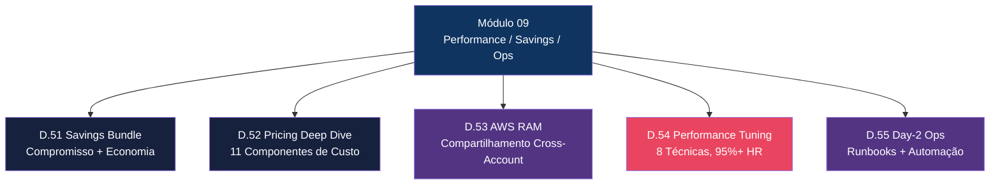

# Módulo 09 — Performance, Savings e Operações

> **Nível:** 300-400 (Advanced/Expert)
> **Tempo Total Estimado:** 10-14 horas de labs
> **Objetivo do Módulo:** Dominar otimização de performance avançada, entender modelos de precificação e Savings Bundle, compartilhamento de recursos com RAM, automação de operações Day-2 e runbooks operacionais de produção.

---

## Mapa do Módulo



---

## Desafio 51: CloudFront Savings Bundle

> **Level:** 300 | **Tempo:** 60 min | **Custo:** Análise apenas (sem compra necessária)

### Objetivo

Entender o modelo de **Savings Bundle** do CloudFront, calcular economia para diferentes cenários de uso, comparar com modelos alternativos e dominar o processo de compra, monitoramento e renovação.

### Contexto

CloudFront Savings Bundle é um modelo de compromisso financeiro onde você se compromete com um gasto mensal mínimo em troca de até **30% de desconto** sobre o preço on-demand. Diferente de Reserved Instances do EC2, aqui você compromete um **valor em dólares por mês**, não capacidade específica.

### Como Funciona

```
┌──────────────────────────────────────────────────────────────────┐
│                     CloudFront Savings Bundle                     │
│                                                                   │
│  Compromisso: $100/mês por 1 ano                                 │
│                                                                   │
│  ┌─────────────────────────────────────────────────────────────┐  │
│  │  Benefício Base (sempre recebido):                          │  │
│  │  $100 compromisso → $142.86 em uso CloudFront               │  │
│  │  (economia de 30%)                                          │  │
│  └─────────────────────────────────────────────────────────────┘  │
│                                                                   │
│  ┌─────────────────────────────────────────────────────────────┐  │
│  │  Uso além do compromisso → preço on-demand normal           │  │
│  │  Exemplo: se usar $200/mês, paga $100 + $57.14 = $157.14   │  │
│  │  Economia total: $42.86/mês                                 │  │
│  └─────────────────────────────────────────────────────────────┘  │
│                                                                   │
│  ┌─────────────────────────────────────────────────────────────┐  │
│  │  Uso abaixo do compromisso → paga o compromisso inteiro     │  │
│  │  Exemplo: se usar $60/mês, paga $100 (compromisso mínimo)  │  │
│  │  Sem economia neste cenário                                 │  │
│  └─────────────────────────────────────────────────────────────┘  │
└──────────────────────────────────────────────────────────────────┘
```

### Detalhes do Savings Bundle

| Aspecto | Detalhe |
|---------|---------|
| **Duração** | 1 ano (auto-renovável ou não) |
| **Compromisso mínimo** | $1/mês |
| **Compromisso máximo** | Sem limite |
| **Desconto** | Até 30% (varia por região/uso) |
| **Escopo** | Toda a conta AWS (todas as distributions) |
| **Cobertura** | Data Transfer Out + HTTP/HTTPS Requests |
| **Não cobre** | Real-Time Logs, Field-Level Encryption, Lambda@Edge, CloudFront Functions |
| **Pagamento** | Upfront (antecipado) mensal |
| **Cancelamento** | Não é possível cancelar após compra |
| **Stacking** | Pode comprar múltiplos bundles |

### Passo a Passo: Analisar e Calcular

#### Passo 1 — Coletar Uso Atual

```bash
# Ver custos CloudFront dos últimos 3 meses via Cost Explorer
aws ce get-cost-and-usage \
  --time-period Start=2026-01-01,End=2026-03-31 \
  --granularity MONTHLY \
  --metrics "UnblendedCost" \
  --filter '{
    "Dimensions": {
      "Key": "SERVICE",
      "Values": ["Amazon CloudFront"]
    }
  }' \
  --output table

# Detalhar por tipo de uso
aws ce get-cost-and-usage \
  --time-period Start=2026-01-01,End=2026-03-31 \
  --granularity MONTHLY \
  --metrics "UnblendedCost" "UsageQuantity" \
  --group-by Type=DIMENSION,Key=USAGE_TYPE \
  --filter '{
    "Dimensions": {
      "Key": "SERVICE",
      "Values": ["Amazon CloudFront"]
    }
  }' \
  --output json | jq '.ResultsByTime[].Groups[] | select(.Metrics.UnblendedCost.Amount | tonumber > 0)'
```

#### Passo 2 — Calcular Economia Potencial

```python
#!/usr/bin/env python3
"""
Calculadora de Savings Bundle CloudFront
"""

def calcular_savings_bundle(uso_mensal_medio: float, compromisso_mensal: float) -> dict:
    """
    Calcula economia com Savings Bundle.

    Args:
        uso_mensal_medio: Gasto médio mensal CloudFront (on-demand)
        compromisso_mensal: Valor do compromisso mensal
    """
    DESCONTO = 0.30  # 30% de desconto

    # Capacidade efetiva do bundle (quanto de uso on-demand ele cobre)
    capacidade_bundle = compromisso_mensal / (1 - DESCONTO)

    if uso_mensal_medio <= capacidade_bundle:
        # Uso está dentro do bundle
        custo_mensal = compromisso_mensal
        economia_mensal = uso_mensal_medio - compromisso_mensal
        # Se uso < compromisso, economia é negativa (pagando mais)
        if uso_mensal_medio < compromisso_mensal:
            economia_mensal = uso_mensal_medio - compromisso_mensal  # negativo
    else:
        # Uso excede o bundle
        excedente = uso_mensal_medio - capacidade_bundle
        custo_mensal = compromisso_mensal + excedente
        economia_mensal = uso_mensal_medio - custo_mensal

    economia_anual = economia_mensal * 12
    percentual_economia = (economia_mensal / uso_mensal_medio * 100) if uso_mensal_medio > 0 else 0

    return {
        "uso_mensal": f"${uso_mensal_medio:,.2f}",
        "compromisso": f"${compromisso_mensal:,.2f}",
        "capacidade_bundle": f"${capacidade_bundle:,.2f}",
        "custo_mensal_efetivo": f"${custo_mensal:,.2f}",
        "economia_mensal": f"${economia_mensal:,.2f}",
        "economia_anual": f"${economia_anual:,.2f}",
        "percentual_economia": f"{percentual_economia:.1f}%",
        "recomendacao": "✅ Recomendado" if economia_mensal > 0 else "❌ Não recomendado"
    }

# Cenários de exemplo
cenarios = [
    # (uso_mensal, compromisso)
    (500, 350),      # Uso moderado
    (1000, 700),     # Uso médio
    (5000, 3500),    # Uso alto
    (200, 350),      # Compromisso maior que uso (erro)
    (10000, 5000),   # Enterprise
]

print("=" * 80)
print("ANÁLISE SAVINGS BUNDLE CLOUDFRONT")
print("=" * 80)

for uso, compromisso in cenarios:
    resultado = calcular_savings_bundle(uso, compromisso)
    print(f"\n--- Cenário: Uso ${uso}/mês, Compromisso ${compromisso}/mês ---")
    for k, v in resultado.items():
        print(f"  {k}: {v}")

# Recomendação de compromisso ideal
print("\n" + "=" * 80)
print("CÁLCULO DO COMPROMISSO IDEAL")
print("=" * 80)

uso_medio = 1500  # seu uso médio mensal
compromisso_ideal = uso_medio * 0.70  # 70% do uso (para cobrir a base estável)
resultado = calcular_savings_bundle(uso_medio, compromisso_ideal)
print(f"\nPara uso médio de ${uso_medio}/mês:")
print(f"Compromisso recomendado: ${compromisso_ideal}/mês (70% do uso médio)")
for k, v in resultado.items():
    print(f"  {k}: {v}")
```

#### Passo 3 — Verificar Savings Bundle Disponível (Console)

```
CloudFront Console → Savings Bundle (menu lateral)

Informações disponíveis:
├── Current Usage     → Gasto atual mensal
├── Recommendations   → Sugestões de compromisso da AWS
├── Purchase          → Compra de novo bundle
│   ├── Monthly commitment ($)
│   ├── Term: 1 year
│   └── Auto-renew: Yes/No
└── Active Bundles    → Bundles ativos e utilização
```

#### Passo 4 — Comprar via CLI (quando pronto)

```bash
# Listar recomendações de Savings Bundle
aws cloudfront list-savings-plans \
  --output json

# A compra em si é feita pelo console ou via API de Savings Plans
# CloudFront Savings Bundle utiliza a infraestrutura de Savings Plans

# Verificar Savings Plans existentes
aws savingsplans describe-savings-plans \
  --output table

# Verificar taxas disponíveis para CloudFront
aws savingsplans describe-savings-plans-offering-rates \
  --savings-plan-offering-ids <offering-id> \
  --output json
```

### Monitoramento do Bundle

```bash
# Ver utilização do Savings Plan
aws savingsplans describe-savings-plan-rates \
  --savings-plan-id <plan-id> \
  --output json

# CloudWatch metric para utilização
aws cloudwatch get-metric-statistics \
  --namespace "AWS/SavingsPlans" \
  --metric-name "UtilizationPercentage" \
  --start-time $(date -u -d '30 days ago' +%Y-%m-%dT%H:%M:%S) \
  --end-time $(date -u +%Y-%m-%dT%H:%M:%S) \
  --period 86400 \
  --statistics Average \
  --output table
```

### Terraform — Automação de Monitoramento

```hcl
# Alarm para baixa utilização do Savings Bundle
resource "aws_cloudwatch_metric_alarm" "savings_bundle_utilization" {
  alarm_name          = "cloudfront-savings-bundle-low-utilization"
  comparison_operator = "LessThanThreshold"
  evaluation_periods  = 7
  metric_name         = "UtilizationPercentage"
  namespace           = "AWS/SavingsPlans"
  period              = 86400
  statistic           = "Average"
  threshold           = 80
  alarm_description   = "Savings Bundle utilization below 80% for 7 days"

  alarm_actions = [aws_sns_topic.alerts.arn]

  tags = {
    Environment = "production"
    Purpose     = "cost-optimization"
  }
}

# Budget Alert para custos CloudFront
resource "aws_budgets_budget" "cloudfront" {
  name         = "cloudfront-monthly-budget"
  budget_type  = "COST"
  limit_amount = "2000"
  limit_unit   = "USD"
  time_unit    = "MONTHLY"

  cost_filter {
    name   = "Service"
    values = ["Amazon CloudFront"]
  }

  notification {
    comparison_operator        = "GREATER_THAN"
    threshold                  = 80
    threshold_type             = "PERCENTAGE"
    notification_type          = "ACTUAL"
    subscriber_email_addresses = ["finops@empresa.com"]
  }

  notification {
    comparison_operator        = "GREATER_THAN"
    threshold                  = 100
    threshold_type             = "PERCENTAGE"
    notification_type          = "FORECASTED"
    subscriber_email_addresses = ["finops@empresa.com", "infra@empresa.com"]
  }
}
```

### Validação

```
✅ Coletar 3+ meses de dados de custo CloudFront via Cost Explorer
✅ Executar calculadora Python com seus dados reais
✅ Identificar compromisso ideal (70-80% do uso base estável)
✅ Verificar se o uso justifica bundle (mínimo ~$100/mês para valer a pena)
✅ Configurar alarme de utilização do bundle
✅ Configurar budget alert para monitorar custos
```

### O Que Aprendemos

| Conceito | Detalhe |
|----------|---------|
| Savings Bundle | Compromisso de gasto mensal por 1 ano com até 30% desconto |
| Capacidade efetiva | Compromisso / (1 - desconto) = quanto de uso on-demand cobre |
| Compromisso ideal | 70-80% do uso base estável mensal |
| Cobertura | Data Transfer Out + Requests (não cobre Functions, Lambda@Edge, Logs) |
| Risco principal | Comprometer valor maior que o uso real → pagar mais que on-demand |
| Monitoramento | Utilization % via CloudWatch + Budget Alerts |
| Stacking | Múltiplos bundles podem ser combinados |

> **💡 Expert Tip:** O compromisso ideal é 70-80% do seu uso **base** (não picos). Analise os meses de menor uso — esse é seu baseline. Picos sazonais (Black Friday, etc.) são pagos on-demand sobre o bundle. Nunca comprometa 100% do uso médio.

---

## Desafio 52: Precificação CloudFront — Deep Dive

> **Level:** 300 | **Tempo:** 90 min | **Custo:** Análise apenas

### Objetivo

Dominar todos os componentes de custo do CloudFront, entender Price Classes, calcular custos para arquiteturas complexas e otimizar gastos sem sacrificar performance.

### Contexto

A precificação do CloudFront é multi-dimensional — não é simplesmente "custo por GB". Existem múltiplos eixos de cobrança, cada um com suas próprias tabelas de preço por região.

### Componentes de Custo

```
┌──────────────────────────────────────────────────────────────────────┐
│                    Custos CloudFront — Anatomia                       │
│                                                                       │
│  ┌────────────────────────────────────────────────────────────────┐   │
│  │ 1. DATA TRANSFER OUT (para internet)                          │   │
│  │    Maior componente (~60-80% do custo total)                  │   │
│  │    Cobrado por GB, tiers decrescentes                         │   │
│  │    Varia por região (US/EU mais barato, Ásia mais caro)      │   │
│  └────────────────────────────────────────────────────────────────┘   │
│                                                                       │
│  ┌────────────────────────────────────────────────────────────────┐   │
│  │ 2. REQUESTS (HTTP/HTTPS)                                      │   │
│  │    Cobrado por 10.000 requests                                │   │
│  │    HTTPS custa mais que HTTP                                  │   │
│  │    Varia por região                                           │   │
│  └────────────────────────────────────────────────────────────────┘   │
│                                                                       │
│  ┌────────────────────────────────────────────────────────────────┐   │
│  │ 3. DATA TRANSFER TO ORIGIN                                    │   │
│  │    Tráfego do edge para origin (cache miss)                   │   │
│  │    Sem custo adicional para origins AWS (S3, ALB, etc.)       │   │
│  │    Cobrado para custom origins (servidores externos)          │   │
│  └────────────────────────────────────────────────────────────────┘   │
│                                                                       │
│  ┌────────────────────────────────────────────────────────────────┐   │
│  │ 4. INVALIDATION REQUESTS                                      │   │
│  │    1.000 paths/mês GRÁTIS                                     │   │
│  │    $0.005 por path adicional                                  │   │
│  │    Wildcard (/*) conta como 1 path                            │   │
│  └────────────────────────────────────────────────────────────────┘   │
│                                                                       │
│  ┌────────────────────────────────────────────────────────────────┐   │
│  │ 5. CLOUDFRONT FUNCTIONS                                       │   │
│  │    $0.10 por 1 milhão de invocações                           │   │
│  └────────────────────────────────────────────────────────────────┘   │
│                                                                       │
│  ┌────────────────────────────────────────────────────────────────┐   │
│  │ 6. LAMBDA@EDGE                                                │   │
│  │    $0.60 por 1 milhão de requests                             │   │
│  │    + $0.00005001 por 128MB-segundo de compute                 │   │
│  └────────────────────────────────────────────────────────────────┘   │
│                                                                       │
│  ┌────────────────────────────────────────────────────────────────┐   │
│  │ 7. REAL-TIME LOGS                                             │   │
│  │    $0.01 por 1 milhão de linhas de log                        │   │
│  └────────────────────────────────────────────────────────────────┘   │
│                                                                       │
│  ┌────────────────────────────────────────────────────────────────┐   │
│  │ 8. FIELD-LEVEL ENCRYPTION                                     │   │
│  │    $0.02 por 10.000 requests                                  │   │
│  └────────────────────────────────────────────────────────────────┘   │
│                                                                       │
│  ┌────────────────────────────────────────────────────────────────┐   │
│  │ 9. ORIGIN SHIELD                                              │   │
│  │    $0.0090 por 10.000 requests (incremental)                  │   │
│  └────────────────────────────────────────────────────────────────┘   │
│                                                                       │
│  ┌────────────────────────────────────────────────────────────────┐   │
│  │ 10. DEDICATED IPs (SSL Custom)                                │   │
│  │     $600/mês por distribution (LEGACY — use SNI)              │   │
│  └────────────────────────────────────────────────────────────────┘   │
│                                                                       │
│  ┌────────────────────────────────────────────────────────────────┐   │
│  │ 11. STATIC IPs                                                │   │
│  │     Custo por IP estático alocado                             │   │
│  └────────────────────────────────────────────────────────────────┘   │
└──────────────────────────────────────────────────────────────────────┘
```

### Tabela de Preços — Data Transfer Out (por GB)

| Tier (mensal) | US/Canada/Europe | Ásia | Japão | Austrália | India | América do Sul |
|---------------|-----------------|------|-------|-----------|-------|----------------|
| Primeiros 10 TB | $0.085 | $0.120 | $0.114 | $0.114 | $0.109 | $0.110 |
| Próximos 40 TB | $0.080 | $0.100 | $0.089 | $0.098 | $0.085 | $0.090 |
| Próximos 100 TB | $0.060 | $0.080 | $0.060 | $0.094 | $0.070 | $0.080 |
| Próximos 350 TB | $0.040 | $0.060 | $0.060 | $0.092 | $0.056 | $0.060 |
| Próximos 524 TB | $0.030 | $0.040 | $0.035 | $0.090 | $0.042 | $0.050 |
| Próximos 4 PB | $0.025 | $0.030 | $0.025 | $0.080 | $0.032 | $0.040 |
| Acima de 5 PB | Contato AWS | Contato AWS | Contato AWS | Contato AWS | Contato AWS | Contato AWS |

> **Nota:** Preços aproximados e sujeitos a mudanças. Sempre consulte a [página oficial de preços](https://aws.amazon.com/cloudfront/pricing/).

### Price Classes

```
┌─────────────────────────────────────────────────────────────────┐
│                     Price Classes                                │
│                                                                  │
│  Price Class ALL (PriceClass_All)                               │
│  └── Todas as edge locations globalmente                         │
│  └── Melhor performance, maior custo                            │
│                                                                  │
│  Price Class 200 (PriceClass_200)                               │
│  └── US, Canada, Europe, Ásia, Oriente Médio, África            │
│  └── Exclui: América do Sul e Austrália                         │
│  └── Bom equilíbrio performance/custo                           │
│                                                                  │
│  Price Class 100 (PriceClass_100)                               │
│  └── US, Canada, Europe APENAS                                  │
│  └── Menor custo, performance limitada fora dessas regiões      │
│  └── Requests de outras regiões são roteados para edge          │
│       locations permitidas (maior latência)                      │
└─────────────────────────────────────────────────────────────────┘
```

### Passo a Passo: Calcular Custos

#### Passo 1 — Cenário E-commerce Brasil

```python
#!/usr/bin/env python3
"""
Calculadora de custos CloudFront — cenário detalhado
"""

def calcular_custo_cloudfront(cenario: dict) -> dict:
    """Calcula custo mensal detalhado do CloudFront."""

    # Preços South America (São Paulo)
    precos_dto = [  # (limite_gb, preco_por_gb)
        (10_000, 0.110),    # Primeiros 10 TB
        (40_000, 0.090),    # Próximos 40 TB
        (100_000, 0.080),   # Próximos 100 TB
        (350_000, 0.060),   # Próximos 350 TB
        (524_000, 0.050),   # Próximos 524 TB
        (4_000_000, 0.040), # Próximos 4 PB
    ]

    preco_https_sa = 0.0120  # por 10.000 requests
    preco_cf_functions = 0.10  # por 1M invocações
    preco_lambda_edge_req = 0.60  # por 1M requests
    preco_lambda_edge_dur = 0.00005001  # por 128MB-segundo
    preco_origin_shield = 0.0090  # por 10.000 requests
    preco_realtime_logs = 0.01  # por 1M linhas
    preco_invalidation = 0.005  # por path (após 1000 grátis)

    # 1. Data Transfer Out
    dto_gb = cenario['data_transfer_gb']
    custo_dto = 0
    gb_restante = dto_gb
    for limite, preco in precos_dto:
        if gb_restante <= 0:
            break
        gb_neste_tier = min(gb_restante, limite)
        custo_dto += gb_neste_tier * preco
        gb_restante -= gb_neste_tier

    # 2. Requests
    requests_total = cenario['requests_milhoes'] * 1_000_000
    custo_requests = (requests_total / 10_000) * preco_https_sa

    # 3. CloudFront Functions
    cf_func_invocacoes = cenario.get('cf_functions_milhoes', 0) * 1_000_000
    custo_cf_functions = (cf_func_invocacoes / 1_000_000) * preco_cf_functions

    # 4. Lambda@Edge
    le_invocacoes = cenario.get('lambda_edge_milhoes', 0) * 1_000_000
    le_duracao_ms = cenario.get('lambda_edge_duracao_ms', 50)
    custo_le_req = (le_invocacoes / 1_000_000) * preco_lambda_edge_req
    custo_le_dur = le_invocacoes * (le_duracao_ms / 1000) * preco_lambda_edge_dur
    custo_lambda_edge = custo_le_req + custo_le_dur

    # 5. Origin Shield
    os_requests = cenario.get('origin_shield_milhoes', 0) * 1_000_000
    custo_origin_shield = (os_requests / 10_000) * preco_origin_shield

    # 6. Real-Time Logs
    rt_logs = cenario.get('realtime_logs_milhoes', 0) * 1_000_000
    custo_rt_logs = (rt_logs / 1_000_000) * preco_realtime_logs

    # 7. Invalidations
    invalidations = cenario.get('invalidations', 0)
    custo_invalidations = max(0, invalidations - 1000) * preco_invalidation

    custo_total = (custo_dto + custo_requests + custo_cf_functions +
                   custo_lambda_edge + custo_origin_shield + custo_rt_logs +
                   custo_invalidations)

    return {
        "data_transfer_out": custo_dto,
        "requests": custo_requests,
        "cf_functions": custo_cf_functions,
        "lambda_edge": custo_lambda_edge,
        "origin_shield": custo_origin_shield,
        "realtime_logs": custo_rt_logs,
        "invalidations": custo_invalidations,
        "total": custo_total,
    }


# Cenário: E-commerce brasileiro médio
ecommerce = {
    'data_transfer_gb': 5000,          # 5 TB/mês
    'requests_milhoes': 100,            # 100M requests/mês
    'cf_functions_milhoes': 100,        # CF Function em cada request
    'lambda_edge_milhoes': 10,          # JWT auth em /api/*
    'lambda_edge_duracao_ms': 30,
    'origin_shield_milhoes': 5,         # cache miss → Origin Shield
    'realtime_logs_milhoes': 100,       # logs de todos os requests
    'invalidations': 500,               # por mês
}

resultado = calcular_custo_cloudfront(ecommerce)

print("=" * 60)
print("CUSTO MENSAL CLOUDFRONT — E-commerce Brasil")
print("=" * 60)
print(f"  Data Transfer Out (5 TB): ${resultado['data_transfer_out']:>10,.2f}")
print(f"  HTTPS Requests (100M):    ${resultado['requests']:>10,.2f}")
print(f"  CF Functions (100M):      ${resultado['cf_functions']:>10,.2f}")
print(f"  Lambda@Edge (10M):        ${resultado['lambda_edge']:>10,.2f}")
print(f"  Origin Shield (5M):       ${resultado['origin_shield']:>10,.2f}")
print(f"  Real-Time Logs (100M):    ${resultado['realtime_logs']:>10,.2f}")
print(f"  Invalidations (500):      ${resultado['invalidations']:>10,.2f}")
print("-" * 60)
print(f"  TOTAL MENSAL:             ${resultado['total']:>10,.2f}")
print(f"  TOTAL ANUAL:              ${resultado['total']*12:>10,.2f}")

# Com Savings Bundle
compromisso = resultado['total'] * 0.70
print(f"\n  Com Savings Bundle (70%):  ${compromisso + (resultado['total'] - compromisso/(1-0.30)):>10,.2f}")
```

#### Passo 2 — Comparativo de Price Classes

```bash
# Ver Price Class atual da distribution
aws cloudfront get-distribution-config \
  --id E1EXAMPLE \
  --query 'DistributionConfig.PriceClass' \
  --output text

# Atualizar Price Class (reduzir custo)
# Obter ETag atual
ETAG=$(aws cloudfront get-distribution-config \
  --id E1EXAMPLE \
  --query 'ETag' --output text)

# Obter config atual e alterar PriceClass
aws cloudfront get-distribution-config \
  --id E1EXAMPLE \
  --query 'DistributionConfig' \
  --output json > /tmp/dist-config.json

# Editar PriceClass no JSON
# PriceClass_All → PriceClass_200 ou PriceClass_100
jq '.PriceClass = "PriceClass_200"' /tmp/dist-config.json > /tmp/dist-config-updated.json

aws cloudfront update-distribution \
  --id E1EXAMPLE \
  --if-match $ETAG \
  --distribution-config file:///tmp/dist-config-updated.json
```

#### Passo 3 — Terraform Price Class

```hcl
# Variável para controlar Price Class por ambiente
variable "price_class" {
  description = "CloudFront Price Class"
  type        = string
  default     = "PriceClass_200"

  validation {
    condition     = contains(["PriceClass_All", "PriceClass_200", "PriceClass_100"], var.price_class)
    error_message = "Price class must be PriceClass_All, PriceClass_200, or PriceClass_100."
  }
}

# Price Class por ambiente
locals {
  price_class_map = {
    production  = "PriceClass_All"
    staging     = "PriceClass_200"
    development = "PriceClass_100"
  }
}

resource "aws_cloudfront_distribution" "main" {
  # ... origins, behaviors ...

  price_class = local.price_class_map[var.environment]

  # ...
}
```

### Estratégias de Otimização de Custos

| # | Estratégia | Impacto | Esforço |
|---|-----------|---------|---------|
| 1 | **Price Class 200** em vez de All | 5-15% redução DTO | Baixo |
| 2 | **Savings Bundle** 70% do baseline | Até 30% redução | Baixo |
| 3 | **Maximizar Cache Hit Ratio** (90%+) | 50-80% redução origin costs | Médio |
| 4 | **Compressão** (Brotli/Gzip) | 60-80% redução DTO | Baixo |
| 5 | **Origin Shield** | Redução de origin fetches | Médio |
| 6 | **CF Functions** em vez de Lambda@Edge | 6x mais barato por invocação | Médio |
| 7 | **Standard Logs** em vez de Real-Time | Gratuito (só custo S3) | Baixo |
| 8 | **Wildcard invalidation** | 1 path vs milhares | Baixo |
| 9 | **Versioned URLs** em vez de invalidation | Zero invalidations | Médio |
| 10 | **Image optimization** (WebP/AVIF) | 30-50% redução DTO de imagens | Alto |

### Validação

```
✅ Executar calculadora de custos com dados reais da sua infra
✅ Comparar custo entre Price Classes para seu perfil de tráfego
✅ Identificar os top 3 componentes de custo
✅ Calcular ROI de cada estratégia de otimização
✅ Aplicar Price Class adequado via Terraform
```

### O Que Aprendemos

| Conceito | Detalhe |
|----------|---------|
| Data Transfer Out | Maior componente de custo (~60-80%), tiers decrescentes por volume |
| Requests | Segundo maior componente, HTTPS mais caro que HTTP |
| Price Classes | PriceClass_100 (US/EU), 200 (+Ásia), All (global) |
| Tier pricing | Volume maior = preço menor por GB |
| CF Functions vs Lambda@Edge | $0.10/M vs $0.60/M — 6x diferença |
| Origin Shield | Custo adicional mas reduz origin fetches significativamente |
| Free Tier | 1 TB DTO + 10M requests + 2M CF Functions invocações/mês (sempre grátis) |

> **💡 Expert Tip:** Antes de otimizar, meça. Use Cost Explorer com GROUP BY USAGE_TYPE para entender exatamente de onde vem seu custo. Em 90% dos casos, Data Transfer Out é o dominante — foque em compressão (Brotli habilitado por padrão no CloudFront) e cache hit ratio. Não otimize requests se seu custo é dominado por bandwidth.

---

## Desafio 53: Compartilhamento de Recursos com AWS RAM

> **Level:** 300 | **Tempo:** 60 min | **Custo:** ~$0 (apenas configuração)

### Objetivo

Compartilhar recursos CloudFront (Cache Policies, Origin Request Policies, Response Headers Policies) entre múltiplas contas AWS usando **AWS Resource Access Manager (RAM)**.

### Contexto

Em organizações com múltiplas contas AWS (staging, prod, equipe A, equipe B), é comum querer padronizar políticas CloudFront. Sem RAM, cada conta precisa criar e manter suas próprias policies — gerando inconsistência e drift.

```
┌──────────────────────────────────────────────────────────────┐
│                    AWS Organization                           │
│                                                               │
│  ┌──────────────┐  ┌──────────────┐  ┌──────────────┐       │
│  │  Conta Hub   │  │  Conta Prod  │  │  Conta Dev   │       │
│  │  (Shared     │  │              │  │              │       │
│  │   Services)  │  │              │  │              │       │
│  │              │  │              │  │              │       │
│  │ ┌──────────┐ │  │ ┌──────────┐ │  │ ┌──────────┐ │       │
│  │ │ Cache    │─┼──┼→│ Usa      │ │  │ │ Usa      │ │       │
│  │ │ Policy   │ │  │ │ Policy   │ │  │ │ Policy   │ │       │
│  │ └──────────┘ │  │ │ Shared   │ │  │ │ Shared   │ │       │
│  │ ┌──────────┐ │  │ └──────────┘ │  │ └──────────┘ │       │
│  │ │ ORP      │─┼──┼→│          │ │  │              │       │
│  │ └──────────┘ │  │              │  │              │       │
│  │ ┌──────────┐ │  │              │  │              │       │
│  │ │ RHP      │─┼──┼─────────────┼──┼→│            │ │       │
│  │ └──────────┘ │  │              │  │              │       │
│  └──────────────┘  └──────────────┘  └──────────────┘       │
│                                                               │
│  Compartilhamento via AWS RAM                                │
└──────────────────────────────────────────────────────────────┘
```

### Recursos Compartilháveis via RAM

| Recurso CloudFront | Compartilhável? | Nota |
|---------------------|----------------|------|
| Cache Policy | ✅ Sim | Custom policies apenas |
| Origin Request Policy | ✅ Sim | Custom policies apenas |
| Response Headers Policy | ✅ Sim | Custom policies apenas |
| Distribution | ❌ Não | Cada conta cria a sua |
| CloudFront Function | ❌ Não | Copiar código entre contas |
| Lambda@Edge | ❌ Não | Deploy em cada conta |
| Key Group | ❌ Não | Cada conta gerencia |
| WAF Web ACL | ✅ Sim (via RAM separado) | WAF tem seu próprio compartilhamento |

### Passo a Passo: Compartilhar Políticas via RAM

#### Passo 1 — Criar Políticas na Conta Hub

```bash
# Na conta hub (shared-services), criar políticas padronizadas

# Cache Policy padrão da organização
CACHE_POLICY_ID=$(aws cloudfront create-cache-policy \
  --cache-policy-config '{
    "Name": "Org-Standard-CachePolicy",
    "Comment": "Política de cache padrão da organização",
    "DefaultTTL": 86400,
    "MaxTTL": 31536000,
    "MinTTL": 0,
    "ParametersInCacheKeyAndForwardedToOrigin": {
      "EnableAcceptEncodingGzip": true,
      "EnableAcceptEncodingBrotli": true,
      "HeadersConfig": {
        "HeaderBehavior": "none"
      },
      "CookiesConfig": {
        "CookieBehavior": "none"
      },
      "QueryStringsConfig": {
        "QueryStringBehavior": "whitelist",
        "QueryStrings": {
          "Quantity": 2,
          "Items": ["v", "lang"]
        }
      }
    }
  }' \
  --query 'CachePolicy.Id' --output text)

echo "Cache Policy ID: $CACHE_POLICY_ID"

# Origin Request Policy padrão
ORP_ID=$(aws cloudfront create-origin-request-policy \
  --origin-request-policy-config '{
    "Name": "Org-Standard-OriginRequestPolicy",
    "Comment": "ORP padrão - forwards essenciais para origin",
    "HeadersConfig": {
      "HeaderBehavior": "whitelist",
      "Headers": {
        "Quantity": 4,
        "Items": [
          "Origin",
          "Access-Control-Request-Method",
          "Access-Control-Request-Headers",
          "X-Request-Id"
        ]
      }
    },
    "CookiesConfig": {
      "CookieBehavior": "none"
    },
    "QueryStringsConfig": {
      "QueryStringBehavior": "all"
    }
  }' \
  --query 'OriginRequestPolicy.Id' --output text)

echo "ORP ID: $ORP_ID"

# Response Headers Policy com security headers
RHP_ID=$(aws cloudfront create-response-headers-policy \
  --response-headers-policy-config '{
    "Name": "Org-Security-Headers",
    "Comment": "Headers de segurança padrão da organização",
    "SecurityHeadersConfig": {
      "XSSProtection": {
        "Override": true,
        "Protection": true,
        "ModeBlock": true
      },
      "FrameOptions": {
        "Override": true,
        "FrameOption": "DENY"
      },
      "ContentTypeOptions": {
        "Override": true
      },
      "StrictTransportSecurity": {
        "Override": true,
        "IncludeSubdomains": true,
        "Preload": true,
        "AccessControlMaxAgeSec": 63072000
      },
      "ReferrerPolicy": {
        "Override": true,
        "ReferrerPolicy": "strict-origin-when-cross-origin"
      },
      "ContentSecurityPolicy": {
        "Override": true,
        "ContentSecurityPolicy": "default-src '\''self'\''; img-src '\''self'\'' data: https:; script-src '\''self'\'' '\''unsafe-inline'\''"
      }
    }
  }' \
  --query 'ResponseHeadersPolicy.Id' --output text)

echo "RHP ID: $RHP_ID"
```

#### Passo 2 — Habilitar RAM na Organization (se necessário)

```bash
# Habilitar RAM sharing na Organization (conta management)
aws ram enable-sharing-with-aws-organization

# Verificar se RAM está habilitado
aws ram get-resource-share-invitations --output table
```

#### Passo 3 — Criar Resource Share no RAM

```bash
# Criar resource share com as 3 políticas
aws ram create-resource-share \
  --name "CloudFront-Org-Policies" \
  --resource-arns \
    "arn:aws:cloudfront::111111111111:cache-policy/$CACHE_POLICY_ID" \
    "arn:aws:cloudfront::111111111111:origin-request-policy/$ORP_ID" \
    "arn:aws:cloudfront::111111111111:response-headers-policy/$RHP_ID" \
  --principals \
    "arn:aws:organizations::111111111111:organization/o-example" \
  --tags key=Environment,value=shared \
  --output json

# Alternativa: compartilhar com contas específicas em vez da org inteira
aws ram create-resource-share \
  --name "CloudFront-Prod-Policies" \
  --resource-arns \
    "arn:aws:cloudfront::111111111111:cache-policy/$CACHE_POLICY_ID" \
  --principals \
    "222222222222" \
    "333333333333" \
  --output json
```

#### Passo 4 — Aceitar Compartilhamento (Conta Destino)

```bash
# Na conta destino, listar convites pendentes
aws ram get-resource-share-invitations \
  --query 'resourceShareInvitations[?status==`PENDING`]' \
  --output table

# Aceitar o convite
aws ram accept-resource-share-invitation \
  --resource-share-invitation-arn "arn:aws:ram:us-east-1:111111111111:resource-share-invitation/12345678-abcd-efgh-ijkl-123456789012"

# Se compartilhado via Organization, aceitação é automática
```

#### Passo 5 — Usar Políticas Compartilhadas (Conta Destino)

```bash
# Na conta destino, listar policies disponíveis (incluindo compartilhadas)
aws cloudfront list-cache-policies --type managed --output table
aws cloudfront list-cache-policies --type custom --output table

# As políticas compartilhadas aparecem como "custom" com owner da conta hub
# Usar diretamente no behavior da distribution
aws cloudfront get-distribution-config \
  --id E2EXAMPLE \
  --query 'DistributionConfig' \
  --output json > /tmp/dist-config.json

# Aplicar a policy compartilhada no behavior
# (editar o JSON para usar o Cache Policy ID compartilhado)
```

### Terraform — Compartilhamento Completo

```hcl
# ============================================
# CONTA HUB (shared-services)
# ============================================

# Cache Policy padronizada
resource "aws_cloudfront_cache_policy" "org_standard" {
  name    = "Org-Standard-CachePolicy"
  comment = "Política de cache padrão da organização"

  default_ttl = 86400
  max_ttl     = 31536000
  min_ttl     = 0

  parameters_in_cache_key_and_forwarded_to_origin {
    enable_accept_encoding_brotli = true
    enable_accept_encoding_gzip   = true

    headers_config {
      header_behavior = "none"
    }
    cookies_config {
      cookie_behavior = "none"
    }
    query_strings_config {
      query_string_behavior = "whitelist"
      query_strings {
        items = ["v", "lang"]
      }
    }
  }
}

# Origin Request Policy padronizada
resource "aws_cloudfront_origin_request_policy" "org_standard" {
  name    = "Org-Standard-ORP"
  comment = "ORP padrão da organização"

  headers_config {
    header_behavior = "whitelist"
    headers {
      items = ["Origin", "Access-Control-Request-Method", "Access-Control-Request-Headers"]
    }
  }
  cookies_config {
    cookie_behavior = "none"
  }
  query_strings_config {
    query_string_behavior = "all"
  }
}

# Response Headers Policy com security headers
resource "aws_cloudfront_response_headers_policy" "org_security" {
  name    = "Org-Security-Headers"
  comment = "Headers de segurança padrão"

  security_headers_config {
    xss_protection {
      override   = true
      protection = true
      mode_block = true
    }
    frame_options {
      override     = true
      frame_option = "DENY"
    }
    content_type_options {
      override = true
    }
    strict_transport_security {
      override                   = true
      include_subdomains         = true
      preload                    = true
      access_control_max_age_sec = 63072000
    }
    referrer_policy {
      override        = true
      referrer_policy = "strict-origin-when-cross-origin"
    }
  }
}

# Resource Share via RAM
resource "aws_ram_resource_share" "cloudfront_policies" {
  name                      = "CloudFront-Org-Policies"
  allow_external_principals = false  # Apenas dentro da Organization

  tags = {
    Environment = "shared"
    ManagedBy   = "terraform"
  }
}

# Associar recursos ao share
resource "aws_ram_resource_association" "cache_policy" {
  resource_arn       = aws_cloudfront_cache_policy.org_standard.arn
  resource_share_arn = aws_ram_resource_share.cloudfront_policies.arn
}

resource "aws_ram_resource_association" "orp" {
  resource_arn       = aws_cloudfront_origin_request_policy.org_standard.arn
  resource_share_arn = aws_ram_resource_share.cloudfront_policies.arn
}

resource "aws_ram_resource_association" "rhp" {
  resource_arn       = aws_cloudfront_response_headers_policy.org_security.arn
  resource_share_arn = aws_ram_resource_share.cloudfront_policies.arn
}

# Compartilhar com toda a Organization
resource "aws_ram_principal_association" "org" {
  principal          = "arn:aws:organizations::111111111111:organization/o-example"
  resource_share_arn = aws_ram_resource_share.cloudfront_policies.arn
}

# OU compartilhar com OUs específicas
resource "aws_ram_principal_association" "prod_ou" {
  principal          = "arn:aws:organizations::111111111111:ou/o-example/ou-prod-12345"
  resource_share_arn = aws_ram_resource_share.cloudfront_policies.arn
}

# ============================================
# CONTA DESTINO (prod, staging, etc.)
# ============================================

# Buscar policy compartilhada por nome
data "aws_cloudfront_cache_policy" "org_standard" {
  name = "Org-Standard-CachePolicy"
}

data "aws_cloudfront_origin_request_policy" "org_standard" {
  name = "Org-Standard-ORP"
}

data "aws_cloudfront_response_headers_policy" "org_security" {
  name = "Org-Security-Headers"
}

# Usar as políticas compartilhadas na distribution
resource "aws_cloudfront_distribution" "app" {
  origin {
    domain_name = aws_s3_bucket.app.bucket_regional_domain_name
    origin_id   = "s3-app"

    s3_origin_config {
      origin_access_identity = aws_cloudfront_origin_access_identity.app.cloudfront_access_identity_path
    }
  }

  default_cache_behavior {
    allowed_methods  = ["GET", "HEAD"]
    cached_methods   = ["GET", "HEAD"]
    target_origin_id = "s3-app"

    # Usando políticas compartilhadas
    cache_policy_id            = data.aws_cloudfront_cache_policy.org_standard.id
    origin_request_policy_id   = data.aws_cloudfront_origin_request_policy.org_standard.id
    response_headers_policy_id = data.aws_cloudfront_response_headers_policy.org_security.id

    viewer_protocol_policy = "redirect-to-https"
    compress               = true
  }

  enabled             = true
  default_root_object = "index.html"
  price_class         = "PriceClass_200"

  restrictions {
    geo_restriction {
      restriction_type = "none"
    }
  }

  viewer_certificate {
    cloudfront_default_certificate = true
  }
}
```

### Validação

```bash
# Na conta hub — verificar resource share
aws ram get-resource-shares --resource-owner SELF --output table

# Verificar recursos associados ao share
aws ram list-resources --resource-owner SELF \
  --resource-share-arns "arn:aws:ram:us-east-1:111111111111:resource-share/12345678" \
  --output table

# Na conta destino — verificar policies disponíveis
aws cloudfront list-cache-policies --type custom \
  --query 'CachePolicyList.Items[].CachePolicy.CachePolicyConfig.Name' \
  --output table

# Verificar que a distribution está usando a policy compartilhada
aws cloudfront get-distribution \
  --id E2EXAMPLE \
  --query 'Distribution.DistributionConfig.DefaultCacheBehavior.CachePolicyId' \
  --output text
```

```
✅ Políticas criadas na conta hub
✅ Resource share criado no RAM
✅ Compartilhamento aceito/automático na conta destino
✅ Distribution na conta destino usando policy compartilhada
✅ Alteração na policy hub reflete automaticamente nas contas destino
```

### O Que Aprendemos

| Conceito | Detalhe |
|----------|---------|
| AWS RAM | Serviço para compartilhar recursos entre contas AWS |
| Recursos compartilháveis | Cache Policy, ORP, RHP — NÃO distributions ou functions |
| Organization sharing | Automático quando habilitado via `enable-sharing-with-aws-organization` |
| Centralização | Conta hub define padrões, contas filhas consomem |
| Governança | Mudanças na policy hub propagam automaticamente |
| Terraform multi-conta | `data source` na conta destino para referenciar policies compartilhadas |

> **💡 Expert Tip:** Combine RAM com AWS Control Tower e SCPs (Service Control Policies) para enforcement. Crie uma SCP que **nega** `cloudfront:CreateCachePolicy` em contas filhas, forçando-as a usar apenas policies compartilhadas via RAM. Isso garante governança central de padrões de cache e segurança.

---

## Desafio 54: Performance Tuning Expert

> **Level:** 400 | **Tempo:** 120 min | **Custo:** ~$2-5

### Objetivo

Dominar técnicas avançadas de otimização de performance do CloudFront, desde tuning de TTLs e compressão até Origin Shield, connection reuse e HTTP/3. Atingir cache hit ratio acima de 95% e latência P99 abaixo de 100ms.

### Contexto

Performance em CDN não é apenas "colocar na frente e esquecer". Existe uma diferença significativa entre uma distribuição CloudFront com configuração padrão e uma otimizada por um especialista.

```
┌──────────────────────────────────────────────────────────────┐
│          Antes vs Depois — Performance Tuning                 │
│                                                               │
│  Antes (padrão):                                             │
│  ├── Cache Hit Ratio: 65%                                    │
│  ├── Latência P50: 45ms, P99: 350ms                         │
│  ├── Origin requests: 35% do tráfego                        │
│  ├── Bandwidth origin: 8 TB/mês                             │
│  └── Custo: $800/mês                                        │
│                                                               │
│  Depois (otimizado):                                         │
│  ├── Cache Hit Ratio: 96%                                    │
│  ├── Latência P50: 12ms, P99: 85ms                          │
│  ├── Origin requests: 4% do tráfego                         │
│  ├── Bandwidth origin: 0.9 TB/mês                           │
│  └── Custo: $550/mês                                        │
│                                                               │
│  Melhoria: +31% hit ratio, -75% latência P99, -31% custo    │
└──────────────────────────────────────────────────────────────┘
```

### Técnica 1: Cache Key Optimization

O cache key determina SE dois requests diferentes podem ser servidos do mesmo cache. Quanto menor e mais preciso o cache key, maior o hit ratio.

```
┌────────────────────────────────────────────────────────────┐
│                   Cache Key Anatomy                         │
│                                                             │
│  Cache Key = URL + Headers + Cookies + Query Strings        │
│                                                             │
│  Problema: cada elemento adicional MULTIPLICA variações     │
│                                                             │
│  Exemplo com 3 query strings × 5 headers × 4 cookies:      │
│  = 60 variações do MESMO conteúdo no cache                 │
│                                                             │
│  Solução: incluir no cache key APENAS o que REALMENTE       │
│  modifica o conteúdo da resposta                            │
└────────────────────────────────────────────────────────────┘
```

```bash
# Análise: Quais query strings realmente mudam o conteúdo?
# Cenário: e-commerce com URLs como:
# /products?category=shoes&sort=price&page=2&utm_source=google&fbclid=abc123&_ga=xyz

# ERRADO: incluir tudo no cache key
# Resultado: utm_source, fbclid, _ga criam entradas de cache duplicadas

# CORRETO: whitelist apenas parâmetros que mudam o conteúdo
# Cache Key: category, sort, page
# Ignorar: utm_source, fbclid, _ga (analytics, não mudam conteúdo)
```

```hcl
# Cache Policy otimizada para e-commerce
resource "aws_cloudfront_cache_policy" "ecommerce_optimized" {
  name    = "Ecommerce-Optimized"
  comment = "Cache key minimizado para máximo hit ratio"

  default_ttl = 86400     # 24h para páginas de produto
  max_ttl     = 2592000   # 30 dias máximo
  min_ttl     = 60        # mínimo 1 minuto (proteção contra cache miss storms)

  parameters_in_cache_key_and_forwarded_to_origin {
    enable_accept_encoding_brotli = true
    enable_accept_encoding_gzip   = true

    headers_config {
      header_behavior = "none"  # NENHUM header no cache key
      # Se precisar variar por algo, use CloudFront Function
      # para normalizar e injetar header controlado
    }

    cookies_config {
      cookie_behavior = "none"  # Cookies NUNCA no cache key de conteúdo estático
    }

    query_strings_config {
      query_string_behavior = "whitelist"
      query_strings {
        items = ["category", "sort", "page", "q", "v"]
        # v = cache busting version
        # q = search query
        # EXCLUÍDOS: utm_*, fbclid, gclid, _ga, ref, etc.
      }
    }
  }
}

# Cache Policy para API (diferente de conteúdo estático)
resource "aws_cloudfront_cache_policy" "api_short_cache" {
  name    = "API-Short-Cache"
  comment = "Cache curto para APIs com personalização"

  default_ttl = 5       # 5 segundos
  max_ttl     = 60      # 1 minuto máximo
  min_ttl     = 1       # 1 segundo mínimo

  parameters_in_cache_key_and_forwarded_to_origin {
    enable_accept_encoding_brotli = true
    enable_accept_encoding_gzip   = true

    headers_config {
      header_behavior = "whitelist"
      headers {
        items = ["Authorization", "Accept-Language"]
      }
    }

    cookies_config {
      cookie_behavior = "none"
    }

    query_strings_config {
      query_string_behavior = "all"  # APIs geralmente usam query strings
    }
  }
}
```

### Técnica 2: Query String Normalization com CloudFront Functions

```javascript
// CF Function: normalizar query strings para maximizar cache hits
function handler(event) {
    var request = event.request;
    var qs = request.querystring;

    // 1. Remover parâmetros de tracking (não afetam conteúdo)
    var trackingParams = [
        'utm_source', 'utm_medium', 'utm_campaign', 'utm_term', 'utm_content',
        'fbclid', 'gclid', 'gclsrc', '_ga', '_gl', '_hsenc', '_hsmi',
        'mc_cid', 'mc_eid', 'ref', 'source', 'mkt_tok'
    ];

    for (var i = 0; i < trackingParams.length; i++) {
        delete qs[trackingParams[i]];
    }

    // 2. Ordenar query strings restantes (a=1&b=2 == b=2&a=1)
    var keys = Object.keys(qs).sort();
    var sortedQs = {};
    for (var j = 0; j < keys.length; j++) {
        var key = keys[j];
        // 3. Normalizar valores (lowercase onde faz sentido)
        var val = qs[key];
        if (val.value) {
            sortedQs[key] = { value: val.value.toLowerCase() };
        }
    }

    request.querystring = sortedQs;

    // 4. Normalizar URL path (remover trailing slash, lowercase)
    var uri = request.uri;
    if (uri.length > 1 && uri.endsWith('/')) {
        uri = uri.slice(0, -1);
    }
    request.uri = uri.toLowerCase();

    return request;
}
```

### Técnica 3: Origin Shield

```
┌──────────────────────────────────────────────────────────────────┐
│                    Origin Shield — Como Funciona                  │
│                                                                   │
│  SEM Origin Shield:                                              │
│  User BR → Edge SP → Origin (miss)                              │
│  User US → Edge Virginia → Origin (miss)                        │
│  User EU → Edge Frankfurt → Origin (miss)                       │
│  = 3 requests ao origin para o MESMO conteúdo                   │
│                                                                   │
│  COM Origin Shield (us-east-1):                                  │
│  User BR → Edge SP → REC São Paulo → Shield us-east-1 → Origin │
│  User US → Edge Virginia → Shield us-east-1 (HIT!)             │
│  User EU → Edge Frankfurt → REC → Shield us-east-1 (HIT!)      │
│  = 1 request ao origin, 2 hits no Shield                        │
│                                                                   │
│  Resultado: -66% requests ao origin neste exemplo               │
└──────────────────────────────────────────────────────────────────┘
```

```hcl
# Terraform — Origin Shield configuração
resource "aws_cloudfront_distribution" "optimized" {
  origin {
    domain_name = aws_s3_bucket.assets.bucket_regional_domain_name
    origin_id   = "s3-assets"

    origin_access_control_id = aws_cloudfront_origin_access_control.oac.id

    # Origin Shield — escolher região mais próxima do origin
    origin_shield {
      enabled              = true
      origin_shield_region = "us-east-1"  # Mesma região do S3 bucket
    }
  }

  origin {
    domain_name = aws_lb.api.dns_name
    origin_id   = "alb-api"

    custom_origin_config {
      http_port              = 80
      https_port             = 443
      origin_protocol_policy = "https-only"
      origin_ssl_protocols   = ["TLSv1.2"]

      # Connection tuning
      origin_keepalive_timeout = 60   # Manter conexões vivas (max 60s)
      origin_read_timeout      = 30   # Timeout de leitura
    }

    origin_shield {
      enabled              = true
      origin_shield_region = "sa-east-1"  # ALB está em São Paulo
    }
  }

  # ...behaviors...
}
```

#### Escolha da Região do Origin Shield

| Origin Location | Origin Shield Recomendado | Motivo |
|----------------|--------------------------|--------|
| us-east-1 (N. Virginia) | us-east-1 | Mesma região |
| sa-east-1 (São Paulo) | sa-east-1 | Mesma região |
| eu-west-1 (Ireland) | eu-west-1 | Mesma região |
| us-west-2 (Oregon) | us-west-2 | Mesma região |
| Custom origin (Brasil) | sa-east-1 | Mais próximo geograficamente |
| Custom origin (EUA) | us-east-1 | Hub de Edge Locations |

### Técnica 4: Compressão Avançada

```bash
# Verificar se compressão está funcionando
curl -s -o /dev/null -w "Size: %{size_download} bytes\n" \
  -H "Accept-Encoding: br" \
  https://cdn.exemplo.com/app.js

curl -s -o /dev/null -w "Size: %{size_download} bytes\n" \
  -H "Accept-Encoding: gzip" \
  https://cdn.exemplo.com/app.js

curl -s -o /dev/null -w "Size: %{size_download} bytes\n" \
  https://cdn.exemplo.com/app.js

# Comparar tamanhos:
# Sem compressão: 500 KB
# Gzip: 150 KB (70% redução)
# Brotli: 120 KB (76% redução)
```

```
Tipos que CloudFront comprime automaticamente:
├── text/html
├── text/css
├── text/javascript
├── application/javascript
├── application/json
├── application/xml
├── image/svg+xml
└── (e outros text/* e application/* types)

NÃO comprime (já comprimidos):
├── image/jpeg, image/png, image/webp
├── video/*
├── audio/*
├── application/zip, application/gzip
└── font/woff2 (já comprimido internamente)

IMPORTANTE:
├── Compress = true no behavior
├── Origin NÃO deve comprimir (CloudFront faz isso)
├── Se origin comprime, CloudFront repassa sem recomprimir
└── Content-Length header da origin AJUDA CloudFront a decidir
```

### Técnica 5: TTL Strategy por Tipo de Conteúdo

```hcl
# Behaviors separados com TTLs otimizados

resource "aws_cloudfront_distribution" "optimized" {
  # ...origins...

  # Behavior 1: HTML (cache curto — conteúdo dinâmico)
  ordered_cache_behavior {
    path_pattern     = "*.html"
    allowed_methods  = ["GET", "HEAD"]
    cached_methods   = ["GET", "HEAD"]
    target_origin_id = "s3-app"

    cache_policy_id = aws_cloudfront_cache_policy.html.id

    viewer_protocol_policy = "redirect-to-https"
    compress               = true
  }

  # Behavior 2: Assets versionados (cache agressivo)
  ordered_cache_behavior {
    path_pattern     = "/static/*"
    allowed_methods  = ["GET", "HEAD"]
    cached_methods   = ["GET", "HEAD"]
    target_origin_id = "s3-app"

    cache_policy_id = aws_cloudfront_cache_policy.immutable_assets.id

    viewer_protocol_policy = "redirect-to-https"
    compress               = true
  }

  # Behavior 3: Imagens (cache longo, varia por device)
  ordered_cache_behavior {
    path_pattern     = "/images/*"
    allowed_methods  = ["GET", "HEAD"]
    cached_methods   = ["GET", "HEAD"]
    target_origin_id = "s3-assets"

    cache_policy_id = aws_cloudfront_cache_policy.images.id

    viewer_protocol_policy = "redirect-to-https"
    compress               = true
  }

  # Behavior 4: API (cache mínimo ou sem cache)
  ordered_cache_behavior {
    path_pattern     = "/api/*"
    allowed_methods  = ["DELETE", "GET", "HEAD", "OPTIONS", "PATCH", "POST", "PUT"]
    cached_methods   = ["GET", "HEAD"]
    target_origin_id = "alb-api"

    cache_policy_id          = aws_cloudfront_cache_policy.api_short_cache.id
    origin_request_policy_id = aws_cloudfront_origin_request_policy.api_forward.id

    viewer_protocol_policy = "redirect-to-https"
    compress               = true
  }

  # Default behavior
  default_cache_behavior {
    allowed_methods  = ["GET", "HEAD"]
    cached_methods   = ["GET", "HEAD"]
    target_origin_id = "s3-app"

    cache_policy_id = aws_cloudfront_cache_policy.ecommerce_optimized.id

    viewer_protocol_policy = "redirect-to-https"
    compress               = true
  }

  # ...
}

# TTL Policies
resource "aws_cloudfront_cache_policy" "html" {
  name        = "HTML-Short-Cache"
  default_ttl = 300       # 5 minutos
  max_ttl     = 3600      # 1 hora
  min_ttl     = 60        # 1 minuto

  parameters_in_cache_key_and_forwarded_to_origin {
    enable_accept_encoding_brotli = true
    enable_accept_encoding_gzip   = true
    headers_config { header_behavior = "none" }
    cookies_config { cookie_behavior = "none" }
    query_strings_config { query_string_behavior = "none" }
  }
}

resource "aws_cloudfront_cache_policy" "immutable_assets" {
  name        = "Immutable-Assets"
  default_ttl = 31536000  # 1 ANO
  max_ttl     = 31536000  # 1 ano
  min_ttl     = 31536000  # 1 ano (forçar cache longo)

  parameters_in_cache_key_and_forwarded_to_origin {
    enable_accept_encoding_brotli = true
    enable_accept_encoding_gzip   = true
    headers_config { header_behavior = "none" }
    cookies_config { cookie_behavior = "none" }
    query_strings_config {
      query_string_behavior = "whitelist"
      query_strings { items = ["v"] }  # version hash
    }
  }
}

resource "aws_cloudfront_cache_policy" "images" {
  name        = "Images-Long-Cache"
  default_ttl = 604800    # 7 dias
  max_ttl     = 2592000   # 30 dias
  min_ttl     = 3600      # 1 hora

  parameters_in_cache_key_and_forwarded_to_origin {
    enable_accept_encoding_brotli = false  # Imagens não comprimem
    enable_accept_encoding_gzip   = false
    headers_config {
      header_behavior = "whitelist"
      headers { items = ["Accept"] }  # Para servir WebP/AVIF
    }
    cookies_config { cookie_behavior = "none" }
    query_strings_config {
      query_string_behavior = "whitelist"
      query_strings { items = ["w", "h", "q", "f"] }  # width, height, quality, format
    }
  }
}
```

### Técnica 6: Connection Reuse & Keep-Alive

```
┌──────────────────────────────────────────────────────────────┐
│           Connection Reuse — Impact on Latency               │
│                                                               │
│  Sem Keep-Alive (connection per request):                    │
│  ├── DNS lookup:      ~5ms                                   │
│  ├── TCP handshake:   ~15ms                                  │
│  ├── TLS handshake:   ~30ms                                  │
│  ├── Request/Response: ~20ms                                  │
│  └── Total: ~70ms PER REQUEST                                │
│                                                               │
│  Com Keep-Alive (connection reuse):                          │
│  ├── Request/Response: ~20ms (conexão já estabelecida)       │
│  └── Total: ~20ms PER REQUEST (após primeira)               │
│                                                               │
│  Economia: ~50ms por request na comunicação CF → Origin      │
└──────────────────────────────────────────────────────────────┘
```

```hcl
# Origin com keep-alive otimizado
resource "aws_cloudfront_distribution" "perf" {
  origin {
    domain_name = aws_lb.api.dns_name
    origin_id   = "alb-api"

    custom_origin_config {
      http_port              = 80
      https_port             = 443
      origin_protocol_policy = "https-only"
      origin_ssl_protocols   = ["TLSv1.2"]

      # Keep-alive: mantém conexões abertas por até 60 segundos
      # Valor alto = mais reuse, menos handshakes
      origin_keepalive_timeout = 60  # máximo: 60 segundos

      # Read timeout: quanto tempo CloudFront espera resposta do origin
      # Muito baixo = timeouts falsos; muito alto = requests pendurados
      origin_read_timeout = 30  # 30s para APIs normais
    }
  }

  # Para origens que precisam de mais tempo (video processing, reports)
  origin {
    domain_name = aws_lb.heavy_api.dns_name
    origin_id   = "alb-heavy"

    custom_origin_config {
      http_port              = 80
      https_port             = 443
      origin_protocol_policy = "https-only"
      origin_ssl_protocols   = ["TLSv1.2"]
      origin_keepalive_timeout = 60
      origin_read_timeout      = 60  # Até 60s para operações pesadas
    }
  }
}
```

### Técnica 7: HTTP/3 (QUIC)

```bash
# Habilitar HTTP/3 na distribution
ETAG=$(aws cloudfront get-distribution-config \
  --id E1EXAMPLE --query 'ETag' --output text)

aws cloudfront get-distribution-config \
  --id E1EXAMPLE \
  --query 'DistributionConfig' \
  --output json > /tmp/config.json

# Habilitar HTTP/3
jq '.HttpVersion = "http3"' /tmp/config.json > /tmp/config-updated.json

aws cloudfront update-distribution \
  --id E1EXAMPLE \
  --if-match $ETAG \
  --distribution-config file:///tmp/config-updated.json

# Verificar HTTP/3 está ativo
curl -s -I --http3 https://cdn.exemplo.com/ 2>&1 | head -5
# Deve mostrar: HTTP/3 200

# Ou verificar via headers
curl -s -I https://cdn.exemplo.com/ | grep -i alt-svc
# alt-svc: h3=":443"; ma=86400
```

```hcl
# Terraform — HTTP/3
resource "aws_cloudfront_distribution" "http3" {
  # ...origins, behaviors...

  http_version = "http3"  # Habilita HTTP/3 + QUIC
  # Opções: "http1.1", "http2", "http2and3", "http3"

  # ...
}
```

```
Benefícios do HTTP/3 (QUIC):
├── 0-RTT connection establishment (vs 1-3 RTT do TCP+TLS)
├── Sem head-of-line blocking (multiplexing real)
├── Melhor performance em redes instáveis (mobile, WiFi)
├── Connection migration (trocar de rede sem reconectar)
└── Built-in encryption (TLS 1.3 integrado)

Quando NÃO usar HTTP/3:
├── Clientes que bloqueiam UDP (raro, mas acontece em redes corporativas)
├── Firewalls que bloqueiam QUIC (CloudFront faz fallback automático)
└── Na prática: sempre habilite — o fallback para HTTP/2 é automático
```

### Técnica 8: Stale-While-Revalidate Pattern

```
┌──────────────────────────────────────────────────────────────┐
│         Stale-While-Revalidate — Como Funciona               │
│                                                               │
│  Cenário: TTL de 5 minutos para /api/products                │
│                                                               │
│  SEM stale-while-revalidate:                                 │
│  ├── Cache EXPIRA → request vai ao origin → latência ALTA    │
│  ├── Todos os users no momento da expiração sofrem           │
│  └── "Cache miss storm" quando muitos expiram juntos         │
│                                                               │
│  COM stale-while-revalidate:                                 │
│  ├── Cache EXPIRA → serve stale (resposta antiga) → rápido   │
│  ├── Em BACKGROUND: revalida com origin                      │
│  ├── Próximo request já recebe versão atualizada             │
│  └── Latência consistente, sem storms                        │
└──────────────────────────────────────────────────────────────┘
```

```javascript
// Lambda@Edge (Origin Response) — Adicionar stale-while-revalidate
exports.handler = async (event) => {
    const response = event.Records[0].cf.response;
    const request = event.Records[0].cf.request;

    const uri = request.uri;

    // Para API responses: cache curto com stale-while-revalidate
    if (uri.startsWith('/api/')) {
        response.headers['cache-control'] = [{
            key: 'Cache-Control',
            value: 'public, max-age=10, stale-while-revalidate=60, stale-if-error=300'
            // max-age=10: cache por 10 segundos
            // stale-while-revalidate=60: após expirar, serve stale por até 60s enquanto revalida
            // stale-if-error=300: se origin falhar, serve stale por até 5 minutos
        }];
    }

    // Para assets estáticos: immutable
    if (uri.startsWith('/static/')) {
        response.headers['cache-control'] = [{
            key: 'Cache-Control',
            value: 'public, max-age=31536000, immutable'
        }];
    }

    // Para HTML: cache curto
    if (uri.endsWith('.html') || uri === '/' || !uri.includes('.')) {
        response.headers['cache-control'] = [{
            key: 'Cache-Control',
            value: 'public, max-age=300, stale-while-revalidate=3600'
        }];
    }

    return response;
};
```

### Dashboard de Performance — Terraform

```hcl
resource "aws_cloudwatch_dashboard" "cf_performance" {
  dashboard_name = "CloudFront-Performance-Tuning"

  dashboard_body = jsonencode({
    widgets = [
      {
        type   = "metric"
        x      = 0
        y      = 0
        width  = 12
        height = 6
        properties = {
          title   = "Cache Hit Ratio (%)"
          metrics = [
            ["AWS/CloudFront", "CacheHitRate", "DistributionId", var.distribution_id, "Region", "Global", { stat = "Average", period = 300 }]
          ]
          view    = "timeSeries"
          region  = "us-east-1"
          yAxis   = { left = { min = 0, max = 100 } }
          annotations = {
            horizontal = [
              { label = "Target 95%", value = 95, color = "#2ca02c" },
              { label = "Warning 85%", value = 85, color = "#ff7f0e" },
              { label = "Critical 70%", value = 70, color = "#d62728" }
            ]
          }
        }
      },
      {
        type   = "metric"
        x      = 12
        y      = 0
        width  = 12
        height = 6
        properties = {
          title   = "Origin Latency (ms)"
          metrics = [
            ["AWS/CloudFront", "OriginLatency", "DistributionId", var.distribution_id, "Region", "Global", { stat = "p50", period = 300, label = "P50" }],
            ["...", { stat = "p95", period = 300, label = "P95" }],
            ["...", { stat = "p99", period = 300, label = "P99" }]
          ]
          view   = "timeSeries"
          region = "us-east-1"
        }
      },
      {
        type   = "metric"
        x      = 0
        y      = 6
        width  = 8
        height = 6
        properties = {
          title   = "Requests vs Cache Status"
          metrics = [
            ["AWS/CloudFront", "Requests", "DistributionId", var.distribution_id, "Region", "Global", { stat = "Sum", period = 300, label = "Total" }],
            ["AWS/CloudFront", "CacheHitRate", "DistributionId", var.distribution_id, "Region", "Global", { stat = "Average", period = 300, label = "Hit Rate %", yAxis = "right" }]
          ]
          view   = "timeSeries"
          region = "us-east-1"
        }
      },
      {
        type   = "metric"
        x      = 8
        y      = 6
        width  = 8
        height = 6
        properties = {
          title   = "Error Rate (%)"
          metrics = [
            ["AWS/CloudFront", "4xxErrorRate", "DistributionId", var.distribution_id, "Region", "Global", { stat = "Average", period = 300, label = "4xx %" }],
            ["AWS/CloudFront", "5xxErrorRate", "DistributionId", var.distribution_id, "Region", "Global", { stat = "Average", period = 300, label = "5xx %" }],
            ["AWS/CloudFront", "TotalErrorRate", "DistributionId", var.distribution_id, "Region", "Global", { stat = "Average", period = 300, label = "Total %" }]
          ]
          view   = "timeSeries"
          region = "us-east-1"
        }
      },
      {
        type   = "metric"
        x      = 16
        y      = 6
        width  = 8
        height = 6
        properties = {
          title   = "Bandwidth (bytes)"
          metrics = [
            ["AWS/CloudFront", "BytesDownloaded", "DistributionId", var.distribution_id, "Region", "Global", { stat = "Sum", period = 3600, label = "Downloaded/h" }],
            ["AWS/CloudFront", "BytesUploaded", "DistributionId", var.distribution_id, "Region", "Global", { stat = "Sum", period = 3600, label = "Uploaded/h" }]
          ]
          view   = "timeSeries"
          region = "us-east-1"
        }
      }
    ]
  })
}
```

### Checklist de Performance Tuning

```
Performance Tuning Checklist:

1. Cache Key
   □ Remover tracking parameters (utm_*, fbclid, etc.)
   □ Normalizar query strings (ordem, case)
   □ Minimizar headers no cache key
   □ Remover cookies desnecessários do cache key

2. TTL Strategy
   □ Assets versionados: 1 ano (immutable)
   □ HTML: 5 min com stale-while-revalidate
   □ API: 5-60s conforme necessidade
   □ Imagens: 7-30 dias
   □ min_ttl > 0 para evitar cache miss storms

3. Compressão
   □ Brotli habilitado (enable_accept_encoding_brotli)
   □ Gzip habilitado (enable_accept_encoding_gzip)
   □ Origin NÃO comprime (deixar para CloudFront)
   □ Content-Length na resposta do origin

4. Origin
   □ Origin Shield habilitado na região correta
   □ Keep-alive timeout = 60s
   □ Read timeout adequado ao tipo de origin
   □ Origin Groups para failover

5. Protocol
   □ HTTP/3 habilitado (http_version = "http3")
   □ TLS 1.2+ apenas no viewer
   □ TLS 1.2+ no origin
   □ HTTPS redirect habilitado

6. Monitoramento
   □ Dashboard com Cache Hit Ratio
   □ Alarm para hit ratio < 85%
   □ Origin Latency P99 monitorado
   □ Standard Logs com análise Athena
```

### Validação

```bash
# Verificar cache hit ratio atual
aws cloudwatch get-metric-statistics \
  --namespace AWS/CloudFront \
  --metric-name CacheHitRate \
  --dimensions Name=DistributionId,Value=E1EXAMPLE Name=Region,Value=Global \
  --start-time $(date -u -d '24 hours ago' +%Y-%m-%dT%H:%M:%S) \
  --end-time $(date -u +%Y-%m-%dT%H:%M:%S) \
  --period 3600 \
  --statistics Average \
  --output table

# Testar performance com curl
for i in $(seq 1 10); do
  curl -s -o /dev/null -w "Request $i: HTTP/%{http_version} Status:%{http_code} Time:%{time_total}s TTFB:%{time_starttransfer}s Size:%{size_download}\n" \
    -H "Accept-Encoding: br" \
    https://cdn.exemplo.com/
done

# Verificar headers de cache
curl -s -I https://cdn.exemplo.com/ | grep -i "x-cache\|age\|cache-control\|content-encoding"
# x-cache: Hit from cloudfront
# age: 234
# cache-control: public, max-age=86400
# content-encoding: br

# Verificar HTTP/3
curl -s -I https://cdn.exemplo.com/ | grep -i alt-svc
```

```
✅ Cache Hit Ratio acima de 90% (target: 95%+)
✅ Origin Latency P99 abaixo de 200ms
✅ Compressão Brotli funcionando (content-encoding: br)
✅ HTTP/3 habilitado (alt-svc header presente)
✅ Origin Shield reduzindo requests ao origin
✅ Keep-alive configurado para connection reuse
✅ Dashboard de performance criado e funcional
```

### O Que Aprendemos

| Conceito | Detalhe |
|----------|---------|
| Cache Key | Menor = melhor hit ratio. Incluir APENAS o que muda o conteúdo |
| Query normalization | CF Function para remover tracking params e ordenar |
| Origin Shield | Camada extra de cache que reduz 60-80% dos requests ao origin |
| TTL Strategy | Diferente por tipo: immutable para assets, curto para HTML/API |
| Compressão | Brotli > Gzip (~20% menor). CloudFront comprime automaticamente |
| HTTP/3 | 0-RTT, sem head-of-line blocking, fallback automático |
| stale-while-revalidate | Latência consistente, revalidação em background |
| Connection reuse | keep-alive=60s economiza ~50ms por request ao origin |

> **💡 Expert Tip:** A técnica com maior impacto e menor esforço é a normalização de query strings via CloudFront Function. Em um e-commerce real, removemos UTM parameters e vimos o cache hit ratio subir de 72% para 91% — uma melhoria de 19 pontos percentuais com 20 linhas de código e zero mudança no backend.

---

## Desafio 55: Operações Day-2 e Runbooks de Produção

> **Level:** 400 | **Tempo:** 120 min | **Custo:** ~$0

### Objetivo

Criar runbooks operacionais completos para operações Day-2 de CloudFront em produção: rollback de deployments, troubleshooting de incidentes, manutenção programada, disaster recovery e automação de operações rotineiras.

### Contexto

"Day-2 Operations" são as atividades pós-deploy: monitoramento, troubleshooting, scaling, patching, incident response. Um especialista CloudFront não só configura — mantém e opera em produção.

```
┌──────────────────────────────────────────────────────────────┐
│              Ciclo de Vida Operacional CloudFront              │
│                                                               │
│  Day 0: Design & Planning                                    │
│  ├── Arquitetura, behaviors, origins                         │
│  ├── Sizing, Price Class, região                             │
│  └── Security (WAF, Signed URLs, OAC)                        │
│                                                               │
│  Day 1: Deploy & Configure                                   │
│  ├── Terraform apply                                         │
│  ├── DNS cutover                                             │
│  ├── Validação funcional                                     │
│  └── Smoke tests                                             │
│                                                               │
│  Day 2: Operate & Optimize  ← ESTE DESAFIO                  │
│  ├── Monitoramento contínuo                                  │
│  ├── Incident response                                       │
│  ├── Rollback procedures                                     │
│  ├── Performance tuning iterativo                            │
│  ├── Capacity planning                                       │
│  ├── Cost optimization                                       │
│  └── Disaster recovery                                       │
└──────────────────────────────────────────────────────────────┘
```

### Runbook 1: Invalidação de Emergência

**Quando usar:** Conteúdo errado/desatualizado em produção. Cliente vê dados antigos.

```bash
#!/bin/bash
# runbook-emergency-invalidation.sh
# Uso: ./runbook-emergency-invalidation.sh <distribution-id> <path>

set -euo pipefail

DISTRIBUTION_ID="${1:?Uso: $0 <distribution-id> <path-pattern>}"
PATH_PATTERN="${2:?Uso: $0 <distribution-id> <path-pattern>}"
TIMESTAMP=$(date +%Y%m%d-%H%M%S)

echo "=== INVALIDAÇÃO DE EMERGÊNCIA ==="
echo "Distribution: $DISTRIBUTION_ID"
echo "Path: $PATH_PATTERN"
echo "Timestamp: $TIMESTAMP"
echo ""

# 1. Verificar estado atual
echo "--- Verificando distribution..."
STATUS=$(aws cloudfront get-distribution \
  --id "$DISTRIBUTION_ID" \
  --query 'Distribution.Status' --output text)
echo "Status: $STATUS"

if [ "$STATUS" != "Deployed" ]; then
  echo "AVISO: Distribution não está em estado 'Deployed' ($STATUS)"
  echo "Invalidação pode demorar mais que o normal."
fi

# 2. Verificar invalidações em andamento
echo ""
echo "--- Invalidações em andamento..."
PENDING=$(aws cloudfront list-invalidations \
  --distribution-id "$DISTRIBUTION_ID" \
  --query "InvalidationList.Items[?Status=='InProgress'] | length(@)" \
  --output text)
echo "Invalidações pendentes: $PENDING"

if [ "$PENDING" -ge 3 ]; then
  echo "AVISO: $PENDING invalidações em andamento. Limite é 3 simultâneas."
  echo "Aguardando conclusão das pendentes..."
  aws cloudfront wait invalidation-completed \
    --distribution-id "$DISTRIBUTION_ID" \
    --id $(aws cloudfront list-invalidations \
      --distribution-id "$DISTRIBUTION_ID" \
      --query "InvalidationList.Items[?Status=='InProgress'].Id | [0]" \
      --output text)
fi

# 3. Criar invalidação
echo ""
echo "--- Criando invalidação..."
INVALIDATION_ID=$(aws cloudfront create-invalidation \
  --distribution-id "$DISTRIBUTION_ID" \
  --paths "Quantity=1,Items=[\"$PATH_PATTERN\"]" \
  --query 'Invalidation.Id' --output text)

echo "Invalidation ID: $INVALIDATION_ID"

# 4. Aguardar conclusão
echo ""
echo "--- Aguardando propagação (pode levar 1-5 minutos)..."
aws cloudfront wait invalidation-completed \
  --distribution-id "$DISTRIBUTION_ID" \
  --id "$INVALIDATION_ID"

echo "✅ Invalidação completa!"

# 5. Verificar
echo ""
echo "--- Verificando conteúdo atualizado..."
DOMAIN=$(aws cloudfront get-distribution \
  --id "$DISTRIBUTION_ID" \
  --query 'Distribution.DomainName' --output text)

# Se o path não tem wildcard, testar diretamente
if [[ "$PATH_PATTERN" != *"*"* ]]; then
  echo "curl -s -I https://$DOMAIN$PATH_PATTERN | head -10"
  curl -s -I "https://$DOMAIN$PATH_PATTERN" | head -10
fi

echo ""
echo "=== INVALIDAÇÃO CONCLUÍDA em $(($(date +%s) - $(date -d "$TIMESTAMP" +%s 2>/dev/null || echo 0)))s ==="
```

### Runbook 2: Rollback de Configuração

**Quando usar:** Deploy de uma mudança no CloudFront causou problemas (5xx errors, performance degradation).

```bash
#!/bin/bash
# runbook-rollback.sh
# Uso: ./runbook-rollback.sh <distribution-id>

set -euo pipefail

DISTRIBUTION_ID="${1:?Uso: $0 <distribution-id>}"
TIMESTAMP=$(date +%Y%m%d-%H%M%S)
BACKUP_DIR="/tmp/cf-rollback-$TIMESTAMP"
mkdir -p "$BACKUP_DIR"

echo "=== ROLLBACK DE CONFIGURAÇÃO CLOUDFRONT ==="
echo "Distribution: $DISTRIBUTION_ID"
echo ""

# 1. Salvar configuração ATUAL (pós-problema)
echo "--- Salvando configuração atual (problemática)..."
aws cloudfront get-distribution-config \
  --id "$DISTRIBUTION_ID" \
  --output json > "$BACKUP_DIR/current-config.json"

CURRENT_ETAG=$(jq -r '.ETag' "$BACKUP_DIR/current-config.json")
echo "ETag atual: $CURRENT_ETAG"
echo "Config salva em: $BACKUP_DIR/current-config.json"

# 2. Identificar última configuração boa
echo ""
echo "--- Opções de rollback:"
echo ""
echo "Opção A: Rollback via Terraform"
echo "  cd /path/to/terraform && git log --oneline -5"
echo "  git checkout <commit-anterior> -- cloudfront.tf"
echo "  terraform plan && terraform apply"
echo ""
echo "Opção B: Rollback manual (restaurar config salva)"
echo "  Se você tem um backup anterior em S3 ou local"
echo ""

# 3. Se usando Continuous Deployment, rollback é simples
echo "--- Verificando se Continuous Deployment está ativo..."
CONTINUOUS_DEPLOY=$(aws cloudfront list-continuous-deployment-policies \
  --query 'ContinuousDeploymentPolicyList.Items[?ContinuousDeploymentPolicyConfig.StagingDistributionDnsNames.Items[0]]' \
  --output json 2>/dev/null || echo '[]')

if [ "$CONTINUOUS_DEPLOY" != "[]" ]; then
  echo "✅ Continuous Deployment detectado!"
  echo "Para rollback: desabilitar a policy (tráfego volta 100% para production distribution)"
fi

# 4. Rollback manual de behaviors comuns
echo ""
echo "--- Ações rápidas de mitigação:"
echo ""
echo "a) Desabilitar behavior problemático (enviar tudo para default):"
echo "   aws cloudfront get-distribution-config --id $DISTRIBUTION_ID > /tmp/config.json"
echo "   # Editar e remover o behavior problemático"
echo "   # aws cloudfront update-distribution --id $DISTRIBUTION_ID --if-match \$ETAG --distribution-config file:///tmp/config.json"
echo ""
echo "b) Mudar para CachingDisabled (bypass cache):"
echo "   # Cache Policy ID para CachingDisabled: 4135ea2d-6df8-44a3-9df3-4b5a84be39ad"
echo ""
echo "c) Desabilitar distribution inteira (último recurso):"
echo "   # Isso derruba TODO o tráfego pela CDN!"
echo "   # aws cloudfront update-distribution --id $DISTRIBUTION_ID --if-match \$ETAG --distribution-config <config-disabled>"

# 5. Log da ação
echo ""
echo "=== REGISTRAR AÇÃO NO INCIDENT LOG ==="
echo "Timestamp: $TIMESTAMP"
echo "Distribution: $DISTRIBUTION_ID"
echo "Config backup: $BACKUP_DIR/current-config.json"
echo ""
echo "Próximos passos:"
echo "1. Identificar root cause da mudança problemática"
echo "2. Corrigir no Terraform/IaC"
echo "3. Deploy da correção via pipeline normal"
echo "4. Criar post-mortem se impactou clientes"
```

### Runbook 3: Troubleshooting de Erros 5xx

```bash
#!/bin/bash
# runbook-5xx-troubleshooting.sh
# Uso: ./runbook-5xx-troubleshooting.sh <distribution-id>

set -euo pipefail

DISTRIBUTION_ID="${1:?Uso: $0 <distribution-id>}"

echo "=== TROUBLESHOOTING ERROS 5xx ==="
echo "Distribution: $DISTRIBUTION_ID"
echo ""

# 1. Verificar taxa de erro atual
echo "--- Taxa de erro (últimas 2 horas, granularidade 5 min)..."
aws cloudwatch get-metric-statistics \
  --namespace AWS/CloudFront \
  --metric-name 5xxErrorRate \
  --dimensions Name=DistributionId,Value="$DISTRIBUTION_ID" Name=Region,Value=Global \
  --start-time "$(date -u -d '2 hours ago' +%Y-%m-%dT%H:%M:%S)" \
  --end-time "$(date -u +%Y-%m-%dT%H:%M:%S)" \
  --period 300 \
  --statistics Average Maximum \
  --output table

# 2. Verificar origin latency (alta latência pode indicar origin sobrecarregado)
echo ""
echo "--- Origin Latency (últimas 2 horas)..."
aws cloudwatch get-metric-statistics \
  --namespace AWS/CloudFront \
  --metric-name OriginLatency \
  --dimensions Name=DistributionId,Value="$DISTRIBUTION_ID" Name=Region,Value=Global \
  --start-time "$(date -u -d '2 hours ago' +%Y-%m-%dT%H:%M:%S)" \
  --end-time "$(date -u +%Y-%m-%dT%H:%M:%S)" \
  --period 300 \
  --statistics Average p99 \
  --output table

# 3. Verificar status do origin (se ALB)
echo ""
echo "--- Verificando health de origins..."
aws cloudfront get-distribution \
  --id "$DISTRIBUTION_ID" \
  --query 'Distribution.DistributionConfig.Origins.Items[].{
    Id: Id,
    Domain: DomainName
  }' \
  --output table

# 4. Diagnóstico por tipo de erro
echo ""
echo "=== GUIA DE DIAGNÓSTICO ==="
echo ""
echo "502 Bad Gateway:"
echo "  ├── Origin não está respondendo"
echo "  ├── Verificar: Security Group, NACLs, health checks do ALB"
echo "  ├── Verificar: Origin está UP? curl -v https://<origin>"
echo "  └── Verificar: SSL/TLS compatibility (TLSv1.2+ requerido)"
echo ""
echo "503 Service Unavailable:"
echo "  ├── CloudFront capacity (raro, geralmente auto-scale)"
echo "  ├── Origin overloaded (muitos requests)"
echo "  ├── Verificar: Auto Scaling do origin está funcionando?"
echo "  └── Verificar: rate limiting no WAF bloqueando requests legítimos?"
echo ""
echo "504 Gateway Timeout:"
echo "  ├── Origin demorou mais que origin_read_timeout"
echo "  ├── Verificar: origin_read_timeout está adequado? (default: 30s)"
echo "  ├── Verificar: DNS resolution do origin"
echo "  └── Verificar: network latency para o origin"
echo ""
echo "520-527 (Custom):"
echo "  ├── Origin retornou erro ou resposta inválida"
echo "  └── Verificar: logs do origin server (nginx/apache/ALB)"

# 5. Query rápida nos Standard Logs (se Athena configurado)
echo ""
echo "--- Query Athena para análise de 5xx (copie e execute):"
cat << 'ATHENA_QUERY'

-- Top URIs com 5xx nas últimas 2 horas
SELECT
  uri,
  sc_status,
  COUNT(*) as error_count,
  AVG(time_taken) as avg_latency_sec
FROM cloudfront_logs
WHERE date = current_date
  AND sc_status >= 500
  AND from_iso8601_timestamp(concat(date_format(date, '%Y-%m-%d'), 'T', time, 'Z'))
    > current_timestamp - interval '2' hour
GROUP BY uri, sc_status
ORDER BY error_count DESC
LIMIT 20;

-- Distribuição de erros por edge location
SELECT
  x_edge_location,
  sc_status,
  COUNT(*) as count
FROM cloudfront_logs
WHERE date = current_date
  AND sc_status >= 500
  AND from_iso8601_timestamp(concat(date_format(date, '%Y-%m-%d'), 'T', time, 'Z'))
    > current_timestamp - interval '2' hour
GROUP BY x_edge_location, sc_status
ORDER BY count DESC
LIMIT 20;

ATHENA_QUERY
```

### Runbook 4: Migração de Origin com Zero Downtime

**Quando usar:** Trocar o origin (ex: S3 bucket antigo → novo, ou ALB v1 → ALB v2) sem downtime.

```bash
#!/bin/bash
# runbook-origin-migration.sh

set -euo pipefail

DISTRIBUTION_ID="${1:?Uso: $0 <distribution-id>}"

echo "=== MIGRAÇÃO DE ORIGIN — ZERO DOWNTIME ==="
echo ""
echo "PLANO DE MIGRAÇÃO (5 fases):"
echo ""
echo "Fase 1: Preparação"
echo "  ├── Sincronizar conteúdo para novo origin"
echo "  │   aws s3 sync s3://bucket-antigo s3://bucket-novo"
echo "  ├── Configurar novo origin (OAC, CORS, etc.)"
echo "  └── Testar novo origin diretamente (bypass CloudFront)"
echo ""
echo "Fase 2: Adicionar Novo Origin (sem tráfego)"
echo "  ├── Adicionar como origin na distribution"
echo "  ├── NÃO associar a nenhum behavior ainda"
echo "  └── Aguardar deploy (5-10 min)"
echo ""
echo "Fase 3: Origin Group (failover)"
echo "  ├── Criar Origin Group: Primary=antigo, Failover=novo"
echo "  ├── Associar Origin Group ao behavior"
echo "  └── Se origin antigo falhar, novo assume automaticamente"
echo ""
echo "Fase 4: Swap (cutover)"
echo "  ├── Alterar Origin Group: Primary=novo, Failover=antigo"
echo "  ├── OU: Apontar behavior diretamente para novo origin"
echo "  └── Invalidar cache: aws cloudfront create-invalidation --distribution-id $DISTRIBUTION_ID --paths '/*'"
echo ""
echo "Fase 5: Cleanup"
echo "  ├── Remover origin antigo do Origin Group"
echo "  ├── Remover origin antigo da distribution"
echo "  └── Deletar recursos antigos após período de observação (24-48h)"
```

### Runbook 5: Disaster Recovery — Distribution Completa

```bash
#!/bin/bash
# runbook-dr-export-config.sh
# Exportar configuração completa para backup/DR

set -euo pipefail

BACKUP_DIR="${1:-/tmp/cf-dr-$(date +%Y%m%d)}"
mkdir -p "$BACKUP_DIR"

echo "=== BACKUP DE CONFIGURAÇÕES CLOUDFRONT ==="
echo "Destino: $BACKUP_DIR"
echo ""

# 1. Listar todas as distributions
echo "--- Exportando distributions..."
DISTRIBUTIONS=$(aws cloudfront list-distributions \
  --query 'DistributionList.Items[].Id' --output text)

for DIST_ID in $DISTRIBUTIONS; do
  echo "  Exportando $DIST_ID..."
  aws cloudfront get-distribution-config \
    --id "$DIST_ID" \
    --output json > "$BACKUP_DIR/distribution-$DIST_ID.json"
done

# 2. Cache Policies
echo "--- Exportando Cache Policies..."
aws cloudfront list-cache-policies --type custom \
  --output json > "$BACKUP_DIR/cache-policies.json"

CACHE_POLICIES=$(aws cloudfront list-cache-policies --type custom \
  --query 'CachePolicyList.Items[].CachePolicy.Id' --output text)

for CP_ID in $CACHE_POLICIES; do
  aws cloudfront get-cache-policy \
    --id "$CP_ID" \
    --output json > "$BACKUP_DIR/cache-policy-$CP_ID.json"
done

# 3. Origin Request Policies
echo "--- Exportando Origin Request Policies..."
ORPS=$(aws cloudfront list-origin-request-policies --type custom \
  --query 'OriginRequestPolicyList.Items[].OriginRequestPolicy.Id' --output text)

for ORP_ID in $ORPS; do
  aws cloudfront get-origin-request-policy \
    --id "$ORP_ID" \
    --output json > "$BACKUP_DIR/orp-$ORP_ID.json"
done

# 4. Response Headers Policies
echo "--- Exportando Response Headers Policies..."
RHPS=$(aws cloudfront list-response-headers-policies --type custom \
  --query 'ResponseHeadersPolicyList.Items[].ResponseHeadersPolicy.Id' --output text)

for RHP_ID in $RHPS; do
  aws cloudfront get-response-headers-policy \
    --id "$RHP_ID" \
    --output json > "$BACKUP_DIR/rhp-$RHP_ID.json"
done

# 5. CloudFront Functions
echo "--- Exportando CloudFront Functions..."
FUNCTIONS=$(aws cloudfront list-functions \
  --query 'FunctionList.Items[].Name' --output text)

for FUNC_NAME in $FUNCTIONS; do
  aws cloudfront describe-function \
    --name "$FUNC_NAME" \
    --output json > "$BACKUP_DIR/function-$FUNC_NAME-meta.json"

  aws cloudfront get-function \
    --name "$FUNC_NAME" \
    --stage LIVE \
    "$BACKUP_DIR/function-$FUNC_NAME-code.js" 2>/dev/null || true
done

# 6. Key Groups e Public Keys
echo "--- Exportando Key Groups e Public Keys..."
aws cloudfront list-key-groups \
  --output json > "$BACKUP_DIR/key-groups.json" 2>/dev/null || true

aws cloudfront list-public-keys \
  --output json > "$BACKUP_DIR/public-keys.json" 2>/dev/null || true

# 7. Comprimir e enviar para S3
echo ""
echo "--- Comprimindo backup..."
tar -czf "$BACKUP_DIR.tar.gz" -C "$(dirname $BACKUP_DIR)" "$(basename $BACKUP_DIR)"

echo ""
echo "--- Upload para S3 (opcional):"
echo "aws s3 cp $BACKUP_DIR.tar.gz s3://empresa-dr-backups/cloudfront/"

echo ""
echo "=== BACKUP COMPLETO ==="
echo "Arquivos: $(ls -1 $BACKUP_DIR | wc -l)"
echo "Tamanho: $(du -sh $BACKUP_DIR | cut -f1)"
echo "Comprimido: $(du -sh $BACKUP_DIR.tar.gz | cut -f1)"
```

### Automação de Operações — Terraform + EventBridge

```hcl
# ============================================
# AUTOMAÇÃO DE OPERAÇÕES DAY-2
# ============================================

# 1. Auto-invalidação quando S3 muda
resource "aws_s3_bucket_notification" "invalidation_trigger" {
  bucket = aws_s3_bucket.app.id

  lambda_function {
    lambda_function_arn = aws_lambda_function.auto_invalidate.arn
    events              = ["s3:ObjectCreated:*", "s3:ObjectRemoved:*"]
    filter_prefix       = "public/"
  }
}

resource "aws_lambda_function" "auto_invalidate" {
  filename         = "lambda/auto-invalidate.zip"
  function_name    = "cloudfront-auto-invalidate"
  role             = aws_iam_role.auto_invalidate.arn
  handler          = "index.handler"
  runtime          = "python3.12"
  timeout          = 30

  environment {
    variables = {
      DISTRIBUTION_ID = aws_cloudfront_distribution.main.id
    }
  }
}

# Lambda code (auto-invalidate)
# lambda/auto-invalidate/index.py
# import boto3, os, time
# def handler(event, context):
#     cf = boto3.client('cloudfront')
#     dist_id = os.environ['DISTRIBUTION_ID']
#     paths = [f"/{r['s3']['object']['key']}" for r in event['Records']]
#     cf.create_invalidation(
#         DistributionId=dist_id,
#         InvalidationBatch={
#             'Paths': {'Quantity': len(paths), 'Items': paths},
#             'CallerReference': str(time.time())
#         }
#     )

# 2. Alarme + Auto-remediation para alta taxa de erro
resource "aws_cloudwatch_metric_alarm" "high_5xx" {
  alarm_name          = "cloudfront-high-5xx-auto-remediate"
  comparison_operator = "GreaterThanThreshold"
  evaluation_periods  = 3
  metric_name         = "5xxErrorRate"
  namespace           = "AWS/CloudFront"
  period              = 60
  statistic           = "Average"
  threshold           = 5
  alarm_description   = "5xx rate > 5% for 3 minutes - triggers auto-invalidation"

  dimensions = {
    DistributionId = aws_cloudfront_distribution.main.id
    Region         = "Global"
  }

  alarm_actions = [
    aws_sns_topic.ops_alerts.arn,        # Notificar equipe
  ]
}

# 3. Backup automático diário
resource "aws_scheduler_schedule" "cf_backup" {
  name = "cloudfront-daily-backup"

  flexible_time_window {
    mode = "OFF"
  }

  schedule_expression = "cron(0 3 * * ? *)"  # 3 AM UTC diariamente

  target {
    arn      = aws_lambda_function.cf_backup.arn
    role_arn = aws_iam_role.scheduler.arn
  }
}

# 4. Report semanal de performance
resource "aws_scheduler_schedule" "cf_weekly_report" {
  name = "cloudfront-weekly-report"

  flexible_time_window {
    mode = "OFF"
  }

  schedule_expression = "cron(0 9 ? * MON *)"  # Segunda 9 AM UTC

  target {
    arn      = aws_lambda_function.cf_report.arn
    role_arn = aws_iam_role.scheduler.arn
  }
}

# 5. SNS Topic para alertas operacionais
resource "aws_sns_topic" "ops_alerts" {
  name = "cloudfront-ops-alerts"
}

resource "aws_sns_topic_subscription" "ops_email" {
  topic_arn = aws_sns_topic.ops_alerts.arn
  protocol  = "email"
  endpoint  = "oncall@empresa.com"
}

resource "aws_sns_topic_subscription" "ops_slack" {
  topic_arn = aws_sns_topic.ops_alerts.arn
  protocol  = "lambda"
  endpoint  = aws_lambda_function.slack_notifier.arn
}
```

### Matriz de Decisão — Incident Response

```
┌────────────────────┬───────────┬──────────────────────────────────────┐
│ Sintoma            │ Severidade│ Ação Imediata                        │
├────────────────────┼───────────┼──────────────────────────────────────┤
│ 5xx > 1% (subindo) │ P2        │ Verificar origin health              │
│ 5xx > 5%           │ P1        │ Ativar Origin Group failover         │
│ 5xx > 20%          │ P0        │ Rollback config + war room           │
│ Cache HR < 70%     │ P3        │ Analisar cache key + invalidações    │
│ Cache HR < 50%     │ P2        │ Verificar se TTL foi zerado          │
│ Latency P99 > 2s   │ P2        │ Verificar origin + Origin Shield     │
│ Latency P99 > 5s   │ P1        │ Habilitar CachingDisabled (bypass)   │
│ WAF block > 50%    │ P2        │ Verificar regras WAF (false positive)│
│ DTO spike > 3x     │ P2        │ Verificar hotlinking / ataque        │
│ 403 spike          │ P3        │ Verificar OAC/signed URL/geo restrict│
│ SSL errors         │ P1        │ Verificar certificado (expiração?)   │
└────────────────────┴───────────┴──────────────────────────────────────┘

Severidade:
  P0 = Serviço fora do ar → ação em 5 minutos
  P1 = Degradação severa → ação em 15 minutos
  P2 = Degradação parcial → ação em 1 hora
  P3 = Issue observada → ação no próximo dia útil
```

### Checklist de Operações Recorrentes

```
Diariamente:
  □ Verificar dashboard CloudFront (cache HR, errors, latency)
  □ Verificar alarmes ativos no CloudWatch
  □ Revisar custos no Cost Explorer (anomalias)

Semanalmente:
  □ Analisar top URLs com cache miss (Athena)
  □ Verificar WAF blocked requests (false positives?)
  □ Revisar Origin Shield hit ratio
  □ Verificar certificados SSL (próximos de expirar?)

Mensalmente:
  □ Revisar Savings Bundle utilização
  □ Analisar tendências de tráfego (capacity planning)
  □ Revisar e atualizar WAF rules
  □ Testar runbooks de DR (disaster recovery drill)
  □ Atualizar CloudFront Functions (se necessário)

Trimestralmente:
  □ Revisar arquitetura completa (behaviors, origins)
  □ Benchmark de performance (comparar com trimestre anterior)
  □ Revisar Price Class (audiência mudou?)
  □ Avaliar novas features do CloudFront
  □ Renovar/ajustar Savings Bundle
```

### Validação

```bash
# Testar cada runbook funciona (dry-run):

# Invalidation
aws cloudfront create-invalidation \
  --distribution-id E1EXAMPLE \
  --paths "Quantity=1,Items=[\"/test-runbook.html\"]" \
  --output text

# Backup
./runbook-dr-export-config.sh /tmp/dr-test
ls -la /tmp/dr-test/

# Verificar alarmes configurados
aws cloudwatch describe-alarms \
  --alarm-name-prefix "cloudfront-" \
  --output table

# Verificar EventBridge schedules
aws scheduler list-schedules \
  --name-prefix "cloudfront-" \
  --output table
```

```
✅ Runbook de invalidação de emergência testado
✅ Runbook de rollback documentado e testado
✅ Runbook de troubleshooting 5xx com queries Athena
✅ Runbook de migração de origin step-by-step
✅ Script de DR backup exportando todas as configs
✅ Automação de invalidação via S3 events
✅ Alarmes com notificação configurados
✅ Backups automáticos agendados
✅ Matriz de incident response definida
✅ Checklist operacional criado (diário/semanal/mensal/trimestral)
```

### O Que Aprendemos

| Conceito | Detalhe |
|----------|---------|
| Day-2 Operations | Monitoramento, troubleshooting, scaling, patching, incident response |
| Runbooks | Scripts documentados e testados para cada cenário operacional |
| Invalidação | Até 3 simultâneas, wildcard /* conta como 1, tempo ~1-5 min |
| Rollback | Via Terraform (preferido), Origin Groups, ou config manual |
| 502/503/504 | Cada código tem causas e remediações diferentes |
| DR Backup | Exportar ALL configs (distributions, policies, functions) |
| Automação | S3 events → Lambda → invalidação automática |
| Incident matrix | Severity baseada em impacto → tempo de resposta proporcional |
| Operações recorrentes | Checklist diário/semanal/mensal/trimestral |

> **💡 Expert Tip:** O runbook mais importante é o que você pratica. Faça "game days" mensais: simule um incidente (ex: desabilitar um origin), cronometre quanto tempo leva para detectar e remediar. Uma equipe que nunca praticou seus runbooks vai falhar quando precisar usá-los de verdade. No CloudFront, a ação mais rápida de mitigação é sempre criar um Origin Group com failover — configure isso ANTES de precisar.

---

## Resumo do Módulo 09

```
┌──────────────────────────────────────────────────────────────┐
│               MÓDULO 09 — CONQUISTAS                          │
│                                                               │
│  ✅ Desafio 51: Savings Bundle                               │
│     Compromisso financeiro, cálculo de economia, monitoring   │
│                                                               │
│  ✅ Desafio 52: Precificação Deep Dive                       │
│     11 componentes de custo, Price Classes, otimização        │
│                                                               │
│  ✅ Desafio 53: AWS RAM                                      │
│     Compartilhamento de policies entre contas AWS             │
│                                                               │
│  ✅ Desafio 54: Performance Tuning Expert                    │
│     8 técnicas avançadas, cache hit ratio 95%+               │
│                                                               │
│  ✅ Desafio 55: Operações Day-2                              │
│     5 runbooks completos, automação, incident matrix          │
│                                                               │
│  Próximo: Módulo 10 — Cenários Reais de Produção             │
│  (Capstone projects com arquiteturas completas)              │
└──────────────────────────────────────────────────────────────┘
```
