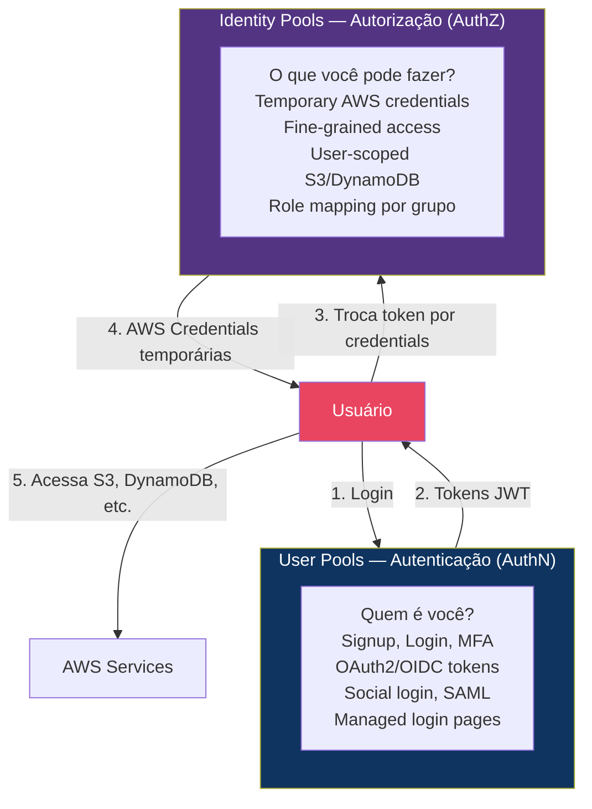

# Amazon Cognito — Workshop: De Zero a Especialista

> **Level:** 100 → 200 → 300 → 400
> **Tipo:** Hands-on Workshop
> **Duração Total:** ~80-100 horas de labs práticos
> **Custo Estimado:** ~$5-30 (50K MAU grátis no User Pool)
> **Última Atualização:** Abril 2026

---

## Sobre Este Workshop

Este workshop contém **60 desafios práticos progressivos** organizados em **10 módulos** que cobrem **100% do Amazon Cognito** — User Pools (signup, login, MFA, OAuth2/OIDC, social login, SAML), Identity Pools (federated access, temporary AWS credentials), managed login, Lambda triggers, integração com API Gateway, ALB, AppSync e padrões avançados de autenticação.

```
         ┌─────────────────────────────────────────────────────────────────┐
         │                                                                 │
         │        AMAZON COGNITO — WORKSHOP ESPECIALISTA                   │
         │                                                                 │
         │   "De zero a referência técnica em autenticação AWS"           │
         │                                                                 │
         │   60 Desafios  ·  10 Módulos  ·  4 Níveis  ·  ~90h Labs       │
         │                                                                 │
         └─────────────────────────────────────────────────────────────────┘
```

---

## Os 2 Componentes do Cognito



---

## Mapa de Progressão

```
  LEVEL 100                LEVEL 200                 LEVEL 300                  LEVEL 400
  (Foundational)           (Intermediate)            (Advanced)                 (Expert)
  ──────────────           ──────────────            ──────────────             ──────────────

  ┌──────────┐             ┌──────────┐              ┌──────────┐              ┌──────────┐
  │Módulo 01 │             │Módulo 03 │              │Módulo 05 │              │Módulo 08 │
  │User Pool │────────────→│OAuth2 &  │─────────────→│Security &│─────────────→│Frontend  │
  │Fundament.│             │Hosted UI │              │Threat    │              │Integrat. │
  │D.1 — D.6 │             │D.13—D.18 │              │Protect.  │              │D.37—D.42 │
  │ 10-14h   │             │ 10-14h   │              │D.25—D.30 │              │ 10-14h   │
  └──────────┘             └──────────┘              │ 10-14h   │              └──────────┘
  ┌──────────┐             ┌──────────┐              └──────────┘              ┌──────────┐
  │Módulo 02 │             │Módulo 04 │              ┌──────────┐              │Módulo 09 │
  │Identity  │────────────→│Lambda    │─────────────→│Módulo 06 │─────────────→│Multi-ten.│
  │Pools     │             │Triggers  │              │API GW &  │              │Patterns  │
  │D.7—D.12  │             │D.19—D.24 │              │ALB       │              │D.43—D.48 │
  │ 10-14h   │             │ 10-14h   │              │D.31—D.36 │              │ 10-14h   │
  └──────────┘             └──────────┘              │ 10-14h   │              └──────────┘
                                                     └──────────┘              ┌──────────┐
                                                     ┌──────────┐              │Módulo 10 │
                                                     │Módulo 07 │              │Cenários  │
                                                     │Social &  │─────────────→│Expert    │
                                                     │SAML/OIDC │              │D.49—D.60 │
                                                     │Federat.  │              │ 12-16h   │
                                                     │D.37—D.42 │              └──────────┘
                                                     │ 10-14h   │
                                                     └──────────┘
```

---

## Estrutura dos Módulos

### Level 100 — Foundational (Módulos 01-02)

| # | Módulo | Desafios | Tempo | O Que Você Vai Aprender |
|---|--------|----------|-------|------------------------|
| 01 | [**User Pool Fundamentals**](modulo-01-user-pool-fundamentos.md) | 1-6 | 10-14h | Criar User Pool, signup/login, password policies, email/SMS verification, user attributes (standard + custom), groups, admin actions, Terraform completo |
| 02 | [**Identity Pools**](modulo-02-identity-pools.md) | 7-12 | 10-14h | Temporary AWS credentials, authenticated vs unauthenticated, role mapping por grupo, user-scoped S3 access, user-scoped DynamoDB, developer-authenticated identities |

### Level 200 — Intermediate (Módulos 03-04)

| # | Módulo | Desafios | Tempo | O Que Você Vai Aprender |
|---|--------|----------|-------|------------------------|
| 03 | [**OAuth2, OIDC & Managed Login**](modulo-03-oauth2-managed-login.md) | 13-18 | 10-14h | OAuth2 flows (Authorization Code, Implicit, Client Credentials), OIDC tokens (ID/Access/Refresh), Managed Login pages (Hosted UI), custom domain, branding, Resource Servers e custom scopes |
| 04 | [**Lambda Triggers**](modulo-04-lambda-triggers.md) | 19-24 | 10-14h | Pre-signup (auto-confirm, block), Pre-authentication, Post-confirmation, Pre-token generation (custom claims), Custom message, Migrate user trigger, Custom auth flow (passwordless) |

### Level 300 — Advanced (Módulos 05-07)

| # | Módulo | Desafios | Tempo | O Que Você Vai Aprender |
|---|--------|----------|-------|------------------------|
| 05 | [**Security & Threat Protection**](modulo-05-security.md) | 25-30 | 10-14h | MFA (SMS, TOTP, Email), adaptive authentication (risk-based MFA), device tracking, compromised credentials detection, WAF integration, account recovery, feature plans (Lite/Essentials/Plus) |
| 06 | [**API Gateway & ALB Integration**](modulo-06-api-alb-integration.md) | 31-36 | 10-14h | Cognito Authorizer (REST API), JWT Authorizer (HTTP API), ALB authentication action, Machine-to-machine (client credentials), token validation, refresh token rotation |
| 07 | [**Federation: Social & Enterprise**](modulo-07-federation.md) | 37-42 | 10-14h | Google login, Facebook login, Apple login, SAML 2.0 (Okta, Azure AD), OIDC federation, attribute mapping, linking federated users to local profiles |

### Level 400 — Expert (Módulos 08-10)

| # | Módulo | Desafios | Tempo | O Que Você Vai Aprender |
|---|--------|----------|-------|------------------------|
| 08 | [**Frontend Integration**](modulo-08-frontend-integration.md) | 43-48 | 10-14h | Amplify Auth (React), AWS SDK (JavaScript), mobile (React Native/Flutter), Amplify Hosting + Cognito, token storage (secure), silent refresh |
| 09 | [**Advanced Patterns**](modulo-09-advanced-patterns.md) | 49-54 | 10-14h | Multi-tenant auth, custom auth flow (passwordless/magic link), passkeys (WebAuthn), step-up authentication, token customization, user migration |
| 10 | [**Cenários Expert**](modulo-10-cenarios-expert.md) | 55-60 | 12-16h | **CAPSTONE:** SaaS platform auth completa, B2B multi-org SAML, compliance (HIPAA/PCI), monitoring e audit, Cognito vs Auth0/Firebase, certificação prep |

---

## Cobertura Completa do Console Cognito

```
Cognito Console
├── User Pools
│   ├── Overview ──────────────── Módulo 01
│   ├── Users ─────────────────── Módulo 01 (D.1-2)
│   ├── Groups ────────────────── Módulo 01 (D.4)
│   ├── Sign-in Experience
│   │   ├── Sign-in options ──── Módulo 01 (D.1)
│   │   ├── Password policy ──── Módulo 01 (D.3)
│   │   ├── MFA ──────────────── Módulo 05 (D.25-26)
│   │   └── User account recovery Módulo 05 (D.30)
│   ├── Sign-up Experience
│   │   ├── Self-registration ── Módulo 01 (D.1)
│   │   ├── Required attributes  Módulo 01 (D.3)
│   │   └── Custom attributes ── Módulo 01 (D.3)
│   ├── Messaging
│   │   ├── Email ─────────────── Módulo 01 (D.2)
│   │   └── SMS ──────────────── Módulo 05 (D.25)
│   ├── Authentication
│   │   ├── Federated IdPs ───── Módulo 07 (D.37-42)
│   │   └── Threat protection ── Módulo 05 (D.27-28)
│   ├── App Integration
│   │   ├── Domain ────────────── Módulo 03 (D.15)
│   │   ├── Resource servers ──── Módulo 03 (D.18)
│   │   ├── App clients ──────── Módulo 03 (D.13-14)
│   │   └── Managed login ────── Módulo 03 (D.16)
│   ├── Lambda Triggers ──────── Módulo 04 (D.19-24)
│   └── Analytics
│       └── Pinpoint ─────────── Módulo 10 (D.59)
│
└── Identity Pools
    ├── Overview ──────────────── Módulo 02
    ├── User Access ───────────── Módulo 02 (D.7-8)
    ├── Authentication providers  Módulo 02 (D.9)
    ├── Role mappings ─────────── Módulo 02 (D.10)
    └── Data access ───────────── Módulo 02 (D.11-12)
```

---

## Pré-requisitos

### Obrigatórios

- **Conta AWS** — Free Tier: 50K MAU grátis no User Pool
- **AWS CLI v2** — Instalada e configurada
- **Terraform >= 1.5** — Para todos os desafios de IaC
- **Node.js 18+** — Para Lambda triggers e frontend examples

### Recomendados

- **React** — Para desafios de frontend integration (Módulo 08)
- **Postman** — Para testar OAuth2 flows
- **Workshop API Gateway** — Integração Cognito + API GW (Módulo 06)
- **jq** + **jwt-cli** — Para decodificar tokens JWT

### Custos Estimados

| Level | Custo Estimado | Nota |
|-------|---------------|------|
| 100 (Módulos 01-02) | ~$0 | 50K MAU grátis |
| 200 (Módulos 03-04) | ~$0-2 | Lambda triggers gratuitos |
| 300 (Módulos 05-07) | ~$2-10 | Advanced security, SMS MFA |
| 400 (Módulos 08-10) | ~$5-20 | Plus plan, social login |

---

## Navegação Rápida

### Level 100 — Foundational
- [Módulo 01 — User Pool Fundamentals](modulo-01-user-pool-fundamentos.md) (Desafios 1-6)
- [Módulo 02 — Identity Pools](modulo-02-identity-pools.md) (Desafios 7-12)

### Level 200 — Intermediate
- [Módulo 03 — OAuth2, OIDC & Managed Login](modulo-03-oauth2-managed-login.md) (Desafios 13-18)
- [Módulo 04 — Lambda Triggers](modulo-04-lambda-triggers.md) (Desafios 19-24)

### Level 300 — Advanced
- [Módulo 05 — Security & Threat Protection](modulo-05-security.md) (Desafios 25-30)
- [Módulo 06 — API Gateway & ALB Integration](modulo-06-api-alb-integration.md) (Desafios 31-36)
- [Módulo 07 — Federation: Social & Enterprise](modulo-07-federation.md) (Desafios 37-42)

### Level 400 — Expert
- [Módulo 08 — Frontend Integration](modulo-08-frontend-integration.md) (Desafios 43-48)
- [Módulo 09 — Advanced Patterns](modulo-09-advanced-patterns.md) (Desafios 49-54)
- [Módulo 10 — Cenários Expert](modulo-10-cenarios-expert.md) (Desafios 55-60)

---

## Referências

- [Amazon Cognito Developer Guide](https://docs.aws.amazon.com/cognito/latest/developerguide/)
- [Amazon Cognito User Pools API Reference](https://docs.aws.amazon.com/cognito-user-identity-pools/latest/APIReference/)
- [Amazon Cognito Identity Pools API Reference](https://docs.aws.amazon.com/cognitoidentity/latest/APIReference/)
- [Terraform AWS Cognito Resources](https://registry.terraform.io/providers/hashicorp/aws/latest/docs/resources/cognito_user_pool)
- [Amplify Auth Documentation](https://docs.amplify.aws/react/build-a-backend/auth/)
- [OAuth 2.0 RFC 6749](https://www.rfc-editor.org/rfc/rfc6749)
- [OpenID Connect Specification](https://openid.net/connect/)

---

> **Workshop criado para transformar você em referência técnica em Amazon Cognito.
> 60 desafios. 10 módulos. Do zero ao expert.**
