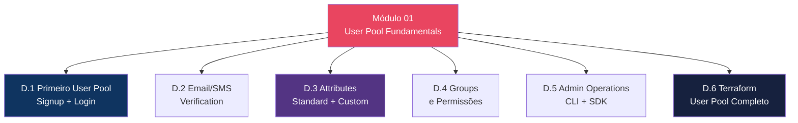
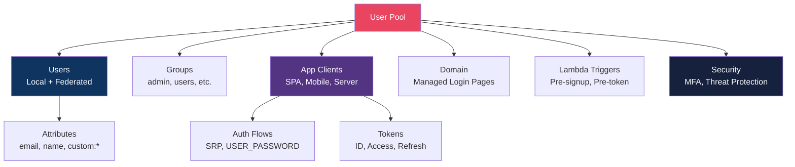
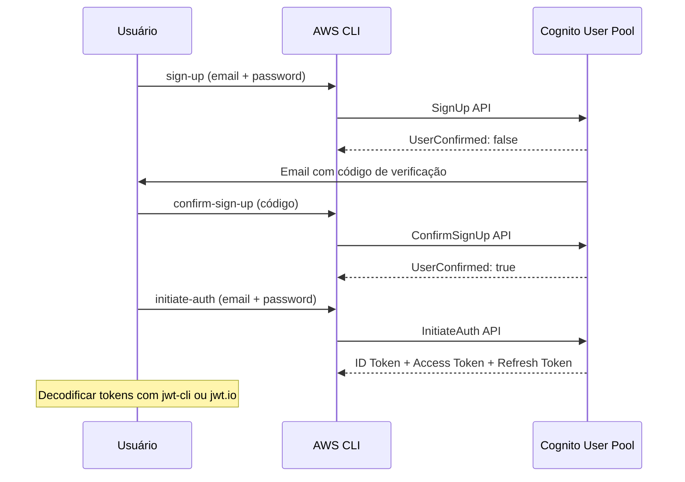

# Módulo 01 — User Pool Fundamentals

> **Nível:** 100 (Foundational)
> **Tempo Total Estimado:** 10-14 horas de labs
> **Custo Estimado:** ~$0 (50K MAU grátis)
> **Objetivo do Módulo:** Dominar os fundamentos do Cognito User Pool — criar user pool do zero, configurar signup/login, password policies, verificação de email, user attributes (standard e custom), groups, admin operations e Terraform completo.

---

## Mapa do Módulo



---

## Conceitos-Chave

### O Que é um User Pool?

Um **User Pool** é um diretório de usuários no Amazon Cognito. Ele gerencia:
- **Signup** — cadastro de novos usuários
- **Login** — autenticação (email/password, social, SAML)
- **MFA** — autenticação multi-fator
- **Tokens** — JWT (ID Token, Access Token, Refresh Token)
- **Recuperação** — reset de senha via email/SMS
- **Customização** — Lambda triggers em cada etapa

### Anatomia do User Pool



### Os 3 Tokens JWT

```
┌──────────────────────────────────────────────────────────────────┐
│  ID Token (quem é o user)                                        │
│  ├── Claims: sub, email, name, phone, cognito:groups             │
│  ├── Audience: app client ID                                     │
│  ├── Uso: enviar para backend para saber QUEM é o user           │
│  └── Expiração: 1h (configurável 5min-24h)                      │
│                                                                   │
│  Access Token (o que o user pode fazer)                          │
│  ├── Claims: sub, scope, cognito:groups, token_use=access        │
│  ├── Uso: enviar para API Gateway/ALB como Bearer token          │
│  ├── Scopes: openid, email, profile, custom scopes              │
│  └── Expiração: 1h (configurável 5min-24h)                      │
│                                                                   │
│  Refresh Token (renovar sem re-login)                            │
│  ├── Uso: trocar por novos ID/Access tokens                     │
│  ├── NÃO é JWT — é opaco (não decodificável)                    │
│  └── Expiração: 30 dias (configurável 1h-3650 dias)             │
└──────────────────────────────────────────────────────────────────┘
```

---

## Desafio 1: Primeiro User Pool — Signup e Login

> **Level:** 100 | **Tempo:** 90 min | **Custo:** $0

### Objetivo

Criar um **User Pool** completo, registrar um usuário, fazer login e decodificar os tokens JWT retornados.

### O Que Vamos Construir



### Passo a Passo

#### 1. Criar o User Pool

```bash
POOL_ID=$(aws cognito-idp create-user-pool \
  --pool-name "app-users-lab" \
  --username-attributes email \
  --auto-verified-attributes email \
  --policies '{
    "PasswordPolicy": {
      "MinimumLength": 8,
      "RequireUppercase": true,
      "RequireLowercase": true,
      "RequireNumbers": true,
      "RequireSymbols": false,
      "TemporaryPasswordValidityDays": 7
    }
  }' \
  --account-recovery-setting '{
    "RecoveryMechanisms": [
      {"Priority": 1, "Name": "verified_email"}
    ]
  }' \
  --query 'UserPool.Id' --output text)

echo "User Pool ID: $POOL_ID"
```

#### 2. Criar App Client

```bash
# App Client para SPA (sem client secret)
CLIENT_ID=$(aws cognito-idp create-user-pool-client \
  --user-pool-id "$POOL_ID" \
  --client-name "spa-client" \
  --no-generate-secret \
  --explicit-auth-flows \
    ALLOW_USER_SRP_AUTH \
    ALLOW_REFRESH_TOKEN_AUTH \
    ALLOW_USER_PASSWORD_AUTH \
  --supported-identity-providers COGNITO \
  --prevent-user-existence-errors ENABLED \
  --access-token-validity 1 \
  --id-token-validity 1 \
  --refresh-token-validity 30 \
  --token-validity-units '{
    "AccessToken": "hours",
    "IdToken": "hours",
    "RefreshToken": "days"
  }' \
  --query 'UserPoolClient.ClientId' --output text)

echo "Client ID: $CLIENT_ID"
```

#### 3. Registrar Usuário (Signup)

```bash
# Signup
aws cognito-idp sign-up \
  --client-id "$CLIENT_ID" \
  --username "user@example.com" \
  --password "MinhaSenh@123" \
  --user-attributes \
    Name=email,Value=user@example.com \
    Name=name,Value="Maria Silva"

# Output: UserConfirmed: false, UserSub: uuid
```

#### 4. Confirmar Email

```bash
# Verificar código recebido por email
aws cognito-idp confirm-sign-up \
  --client-id "$CLIENT_ID" \
  --username "user@example.com" \
  --confirmation-code "123456"

# OU confirmar via admin (sem código)
aws cognito-idp admin-confirm-sign-up \
  --user-pool-id "$POOL_ID" \
  --username "user@example.com"
```

#### 5. Login (InitiateAuth)

```bash
# Login com USER_PASSWORD_AUTH (mais simples para labs)
AUTH_RESULT=$(aws cognito-idp initiate-auth \
  --client-id "$CLIENT_ID" \
  --auth-flow USER_PASSWORD_AUTH \
  --auth-parameters \
    USERNAME=user@example.com,PASSWORD=MinhaSenh@123 \
  --query 'AuthenticationResult' --output json)

echo "$AUTH_RESULT" | jq .

# Extrair tokens
ID_TOKEN=$(echo "$AUTH_RESULT" | jq -r '.IdToken')
ACCESS_TOKEN=$(echo "$AUTH_RESULT" | jq -r '.AccessToken')
REFRESH_TOKEN=$(echo "$AUTH_RESULT" | jq -r '.RefreshToken')

echo "ID Token: ${ID_TOKEN:0:50}..."
echo "Access Token: ${ACCESS_TOKEN:0:50}..."
```

#### 6. Decodificar Tokens

```bash
# Decodificar JWT (payload é base64)
echo "$ID_TOKEN" | cut -d. -f2 | base64 -d 2>/dev/null | jq .

# Output:
# {
#   "sub": "uuid-do-user",
#   "email_verified": true,
#   "iss": "https://cognito-idp.us-east-1.amazonaws.com/us-east-1_XXXXX",
#   "cognito:username": "user@example.com",
#   "aud": "CLIENT_ID",
#   "event_id": "event-uuid",
#   "token_use": "id",
#   "auth_time": 1712845200,
#   "name": "Maria Silva",
#   "exp": 1712848800,
#   "iat": 1712845200,
#   "email": "user@example.com"
# }
```

#### 7. Refresh Token (renovar sem re-login)

```bash
NEW_TOKENS=$(aws cognito-idp initiate-auth \
  --client-id "$CLIENT_ID" \
  --auth-flow REFRESH_TOKEN_AUTH \
  --auth-parameters \
    REFRESH_TOKEN="$REFRESH_TOKEN" \
  --query 'AuthenticationResult' --output json)

echo "$NEW_TOKENS" | jq '{newIdToken: .IdToken[:50], newAccessToken: .AccessToken[:50]}'
# Novos ID e Access tokens (Refresh token permanece o mesmo)
```

### Como Testar

```bash
# 1. Verificar user criado
aws cognito-idp admin-get-user \
  --user-pool-id "$POOL_ID" \
  --username "user@example.com" \
  --query '{Status:UserStatus,Email:UserAttributes[?Name==`email`].Value|[0],Created:UserCreateDate}' \
  --output table

# 2. Listar users
aws cognito-idp list-users \
  --user-pool-id "$POOL_ID" \
  --query 'Users[].{Username:Username,Status:UserStatus,Email:Attributes[?Name==`email`].Value|[0]}' \
  --output table

# 3. Verificar token é válido (get user info)
aws cognito-idp get-user \
  --access-token "$ACCESS_TOKEN" \
  --query '{Username:Username,Attributes:UserAttributes[*].{Name:Name,Value:Value}}' \
  --output json
```

### Terraform

```hcl
# User Pool
resource "aws_cognito_user_pool" "main" {
  name = "app-users"

  username_attributes      = ["email"]
  auto_verified_attributes = ["email"]

  password_policy {
    minimum_length                   = 8
    require_lowercase                = true
    require_uppercase                = true
    require_numbers                  = true
    require_symbols                  = false
    temporary_password_validity_days = 7
  }

  account_recovery_setting {
    recovery_mechanism {
      name     = "verified_email"
      priority = 1
    }
  }

  # Impedir enumeração de users
  user_attribute_update_settings {
    attributes_require_verification_before_update = ["email"]
  }

  deletion_protection = "ACTIVE"

  tags = {
    Environment = var.environment
    ManagedBy   = "terraform"
  }
}

# App Client (SPA — sem secret)
resource "aws_cognito_user_pool_client" "spa" {
  name                                 = "spa-client"
  user_pool_id                         = aws_cognito_user_pool.main.id
  generate_secret                      = false
  explicit_auth_flows                  = ["ALLOW_USER_SRP_AUTH", "ALLOW_REFRESH_TOKEN_AUTH", "ALLOW_USER_PASSWORD_AUTH"]
  supported_identity_providers         = ["COGNITO"]
  prevent_user_existence_errors        = "ENABLED"

  access_token_validity  = 1
  id_token_validity      = 1
  refresh_token_validity = 30

  token_validity_units {
    access_token  = "hours"
    id_token      = "hours"
    refresh_token = "days"
  }
}

# App Client (Server — com secret)
resource "aws_cognito_user_pool_client" "server" {
  name                         = "server-client"
  user_pool_id                 = aws_cognito_user_pool.main.id
  generate_secret              = true
  explicit_auth_flows          = ["ALLOW_ADMIN_USER_PASSWORD_AUTH", "ALLOW_REFRESH_TOKEN_AUTH"]
  supported_identity_providers = ["COGNITO"]
  prevent_user_existence_errors = "ENABLED"
}

output "user_pool_id" {
  value = aws_cognito_user_pool.main.id
}

output "client_id" {
  value = aws_cognito_user_pool_client.spa.id
}
```

### O Que Aprendemos

| Conceito | Detalhe |
|----------|---------|
| User Pool | Diretório de usuários gerenciado pela AWS |
| App Client | Configuração por aplicação (SPA sem secret, server com secret) |
| SignUp | Cria user com status UNCONFIRMED |
| ConfirmSignUp | Valida código de email/SMS → status CONFIRMED |
| InitiateAuth | Login que retorna 3 tokens JWT |
| ID Token | Contém claims do user (email, name, groups) |
| Access Token | Contém scopes e groups — para autorização |
| Refresh Token | Renova ID/Access sem re-login (opaco, não é JWT) |
| `prevent_user_existence_errors` | Resposta genérica para não revelar se email existe |

### Troubleshooting

| Problema | Causa | Solução |
|----------|-------|---------|
| `NotAuthorizedException` | Password errado ou user não confirmado | Verificar status do user e password |
| `UserNotConfirmedException` | Email não verificado | Chamar confirm-sign-up ou admin-confirm |
| `InvalidParameterException` | Atributo obrigatório faltando | Verificar schema do user pool |
| `UsernameExistsException` | Email já cadastrado | Esperado se `prevent_user_existence_errors` está OFF |

> **💡 Expert Tip:** SEMPRE use `ALLOW_USER_SRP_AUTH` em produção em vez de `USER_PASSWORD_AUTH`. SRP (Secure Remote Password) nunca envia a senha pela rede — usa um protocolo de zero-knowledge proof. `USER_PASSWORD_AUTH` envia a senha em plaintext (dentro de TLS, mas ainda). Para labs está OK, para produção use SRP.

---

## Desafio 2: Email e SMS Verification

> **Level:** 100 | **Tempo:** 60 min | **Custo:** ~$0

### Objetivo

Configurar verificação de email e SMS — entender as opções de envio (Cognito default vs Amazon SES).

### Email: Default vs SES

```
┌──────────────────────────────────────────────────────────────────┐
│  Cognito Default Email:                                          │
│  ├── Grátis (50 emails/dia)                                     │
│  ├── From: no-reply@verificationemail.com                        │
│  ├── Sem customização de domínio                                │
│  ├── Limitado a 50/dia (suficiente para dev)                    │
│  └── Ideal para: labs, protótipos, dev                          │
│                                                                   │
│  Amazon SES Email:                                               │
│  ├── Custo: ~$0.10 por 1000 emails                              │
│  ├── From: noreply@meudominio.com (customizável)                │
│  ├── Sem limite diário (SES limits apply)                        │
│  ├── Templates HTML customizados                                │
│  └── Ideal para: produção, branding, alto volume                │
└──────────────────────────────────────────────────────────────────┘
```

```hcl
# Cognito default (dev)
resource "aws_cognito_user_pool" "dev" {
  # ...
  email_configuration {
    email_sending_account = "COGNITO_DEFAULT"
  }
}

# SES (produção)
resource "aws_cognito_user_pool" "prod" {
  # ...
  email_configuration {
    email_sending_account  = "DEVELOPER"
    source_arn             = aws_ses_email_identity.noreply.arn
    from_email_address     = "App <noreply@meudominio.com>"
    reply_to_email_address = "support@meudominio.com"
  }
}
```

### O Que Aprendemos

| Conceito | Detalhe |
|----------|---------|
| Default email | 50/dia, grátis, sem branding — dev only |
| SES email | Sem limite, branding, templates — produção |
| SMS | Via SNS — custo por mensagem, requer sandbox exit para produção |
| Auto-verify | `auto_verified_attributes = ["email"]` envia código automaticamente |

---

## Desafio 3: Attributes — Standard e Custom

> **Level:** 100 | **Tempo:** 60 min | **Custo:** $0

### Standard Attributes vs Custom

| Standard (built-in) | Custom (você cria) |
|---------------------|-------------------|
| email, phone_number | custom:company |
| name, family_name | custom:role |
| address, birthdate | custom:tenant_id |
| gender, locale | custom:plan |
| picture, profile | custom:preferences |
| Definidos pelo OIDC spec | Prefixo `custom:` obrigatório |
| Imutáveis após criação do pool | Podem ser adicionados depois |

```hcl
resource "aws_cognito_user_pool" "main" {
  # ...

  # Standard attributes
  schema {
    name                = "email"
    attribute_data_type = "String"
    required            = true
    mutable             = true
  }

  schema {
    name                = "name"
    attribute_data_type = "String"
    required            = true
    mutable             = true
  }

  # Custom attributes
  schema {
    name                = "company"
    attribute_data_type = "String"
    mutable             = true
    string_attribute_constraints {
      max_length = 100
    }
  }

  schema {
    name                = "tenant_id"
    attribute_data_type = "String"
    mutable             = false  # Imutável após criação
    string_attribute_constraints {
      max_length = 36  # UUID
    }
  }

  schema {
    name                = "credits"
    attribute_data_type = "Number"
    mutable             = true
    number_attribute_constraints {
      min_value = "0"
      max_value = "999999"
    }
  }
}
```

### O Que Aprendemos

| Conceito | Detalhe |
|----------|---------|
| Standard attrs | Definidos pelo OIDC spec (email, name, phone) |
| Custom attrs | Prefixo `custom:`, até 50 por user pool |
| Mutable | `false` = não pode ser alterado após criação do user |
| Schema immutable | Não pode remover attributes depois de criados no pool |

> **💡 Expert Tip:** Planeje os custom attributes ANTES de criar o User Pool. Attributes não podem ser removidos depois — apenas adicionados. Se errar o schema, precisa recriar o user pool inteiro (e migrar os users). Use `custom:tenant_id` com `mutable = false` para multi-tenant — garante que o tenant nunca muda após o signup.

---

## Desafio 4: Groups e Permissões

> **Level:** 100 | **Tempo:** 60 min | **Custo:** $0

### Objetivo

Criar **groups** para organizar users e usar para autorização — groups aparecem nos tokens JWT.

```bash
# Criar groups
aws cognito-idp create-group \
  --user-pool-id "$POOL_ID" \
  --group-name "admins" \
  --description "Administradores" \
  --precedence 0

aws cognito-idp create-group \
  --user-pool-id "$POOL_ID" \
  --group-name "editors" \
  --description "Editores de conteúdo" \
  --precedence 10

aws cognito-idp create-group \
  --user-pool-id "$POOL_ID" \
  --group-name "users" \
  --description "Usuários padrão" \
  --precedence 20

# Adicionar user ao group
aws cognito-idp admin-add-user-to-group \
  --user-pool-id "$POOL_ID" \
  --username "user@example.com" \
  --group-name "admins"

# Verificar groups do user
aws cognito-idp admin-list-groups-for-user \
  --user-pool-id "$POOL_ID" \
  --username "user@example.com" \
  --query 'Groups[].GroupName' --output json
```

### Groups nos Tokens

```json
// ID Token com groups
{
  "sub": "uuid",
  "cognito:groups": ["admins", "editors"],
  "email": "user@example.com",
  "token_use": "id"
}

// Access Token com groups
{
  "sub": "uuid",
  "cognito:groups": ["admins", "editors"],
  "scope": "openid email",
  "token_use": "access"
}
```

```python
# Backend: autorização baseada em groups
def handler(event, context):
    claims = event['requestContext']['authorizer']['claims']
    groups = claims.get('cognito:groups', '').split(',')

    if 'admins' not in groups:
        return {'statusCode': 403, 'body': '{"error":"Admin only"}'}

    # Lógica de admin...
```

### O Que Aprendemos

| Conceito | Detalhe |
|----------|---------|
| Groups | Agrupamento lógico de users (admin, editor, user) |
| Precedence | Menor número = maior prioridade (0 = highest) |
| Token claim | `cognito:groups` aparece em ID e Access tokens |
| IAM Role | Group pode ter IAM role associada (Identity Pool) |
| Autorização | Backend verifica `cognito:groups` para decidir acesso |

---

## Desafio 5: Admin Operations

> **Level:** 100 | **Tempo:** 60 min | **Custo:** $0

### Objetivo

Dominar operações administrativas — criar users, resetar senhas, desabilitar/habilitar, forçar logout.

```bash
# Criar user como admin (sem signup público)
aws cognito-idp admin-create-user \
  --user-pool-id "$POOL_ID" \
  --username "admin@example.com" \
  --user-attributes \
    Name=email,Value=admin@example.com \
    Name=name,Value="Admin User" \
    Name=email_verified,Value=true \
  --temporary-password "TempPass123!" \
  --message-action SUPPRESS  # Não enviar email de boas-vindas

# Resetar senha
aws cognito-idp admin-set-user-password \
  --user-pool-id "$POOL_ID" \
  --username "admin@example.com" \
  --password "NovaSenha123!" \
  --permanent

# Desabilitar user
aws cognito-idp admin-disable-user \
  --user-pool-id "$POOL_ID" \
  --username "user@example.com"

# Habilitar user
aws cognito-idp admin-enable-user \
  --user-pool-id "$POOL_ID" \
  --username "user@example.com"

# Forçar logout (revogar tokens)
aws cognito-idp admin-user-global-sign-out \
  --user-pool-id "$POOL_ID" \
  --username "user@example.com"
# TODOS os refresh tokens são revogados — user precisa re-logar

# Deletar user
aws cognito-idp admin-delete-user \
  --user-pool-id "$POOL_ID" \
  --username "user@example.com"
```

### O Que Aprendemos

| Conceito | Detalhe |
|----------|---------|
| admin-create-user | Cria user sem signup público (convite) |
| SUPPRESS message | Não envia email/SMS de boas-vindas |
| admin-set-user-password | Reset de senha sem código de verificação |
| global-sign-out | Revoga TODOS os refresh tokens — force re-login |
| admin-disable-user | Desabilita sem deletar (preserva dados) |

---

## Desafio 6: Terraform — User Pool Completo

> **Level:** 100 | **Tempo:** 90 min | **Custo:** $0

### Objetivo

Recriar tudo em Terraform — User Pool production-ready com todas as configurações.

```hcl
# ============================================
# COGNITO USER POOL — PRODUÇÃO
# ============================================

resource "aws_cognito_user_pool" "main" {
  name = "app-users-${var.environment}"

  # Login
  username_attributes      = ["email"]
  auto_verified_attributes = ["email"]

  # Password
  password_policy {
    minimum_length                   = 12
    require_lowercase                = true
    require_uppercase                = true
    require_numbers                  = true
    require_symbols                  = true
    temporary_password_validity_days = 1
  }

  # Recovery
  account_recovery_setting {
    recovery_mechanism {
      name     = "verified_email"
      priority = 1
    }
  }

  # Security
  user_pool_add_ons {
    advanced_security_mode = "ENFORCED"
  }

  # MFA
  mfa_configuration = "OPTIONAL"
  software_token_mfa_configuration {
    enabled = true
  }

  # Email
  email_configuration {
    email_sending_account = var.environment == "production" ? "DEVELOPER" : "COGNITO_DEFAULT"
    source_arn            = var.environment == "production" ? aws_ses_email_identity.noreply[0].arn : null
    from_email_address    = var.environment == "production" ? "App <noreply@${var.domain}>" : null
  }

  # Schema
  schema {
    name                = "email"
    attribute_data_type = "String"
    required            = true
    mutable             = true
  }

  schema {
    name                = "name"
    attribute_data_type = "String"
    required            = true
    mutable             = true
  }

  schema {
    name                = "tenant_id"
    attribute_data_type = "String"
    mutable             = false
    string_attribute_constraints { max_length = 36 }
  }

  # Protection
  deletion_protection = "ACTIVE"

  # Verification
  user_attribute_update_settings {
    attributes_require_verification_before_update = ["email"]
  }

  tags = {
    Environment = var.environment
    ManagedBy   = "terraform"
  }
}

# App Client: SPA
resource "aws_cognito_user_pool_client" "spa" {
  name                                 = "spa-client"
  user_pool_id                         = aws_cognito_user_pool.main.id
  generate_secret                      = false
  explicit_auth_flows                  = ["ALLOW_USER_SRP_AUTH", "ALLOW_REFRESH_TOKEN_AUTH"]
  supported_identity_providers         = ["COGNITO"]
  prevent_user_existence_errors        = "ENABLED"

  callback_urls = var.environment == "production" ? [
    "https://app.${var.domain}/callback"
  ] : [
    "http://localhost:3000/callback",
    "https://app-dev.${var.domain}/callback"
  ]

  logout_urls = var.environment == "production" ? [
    "https://app.${var.domain}/logout"
  ] : [
    "http://localhost:3000/logout"
  ]

  allowed_oauth_flows                  = ["code"]
  allowed_oauth_scopes                 = ["openid", "email", "profile"]
  allowed_oauth_flows_user_pool_client = true

  access_token_validity  = 1
  id_token_validity      = 1
  refresh_token_validity = 30

  token_validity_units {
    access_token  = "hours"
    id_token      = "hours"
    refresh_token = "days"
  }
}

# Groups
resource "aws_cognito_user_group" "admins" {
  name         = "admins"
  user_pool_id = aws_cognito_user_pool.main.id
  description  = "Administradores"
  precedence   = 0
}

resource "aws_cognito_user_group" "users" {
  name         = "users"
  user_pool_id = aws_cognito_user_pool.main.id
  description  = "Usuários padrão"
  precedence   = 10
}

# Outputs
output "user_pool_id" {
  value       = aws_cognito_user_pool.main.id
  description = "Cognito User Pool ID"
}

output "user_pool_endpoint" {
  value       = aws_cognito_user_pool.main.endpoint
  description = "Cognito User Pool endpoint (issuer URL)"
}

output "spa_client_id" {
  value       = aws_cognito_user_pool_client.spa.id
  description = "App Client ID for SPA"
}
```

### O Que Aprendemos

| Conceito | Detalhe |
|----------|---------|
| Environment-based config | SES em prod, Cognito default em dev |
| deletion_protection | Previne deleção acidental do user pool |
| SRP auth | Mais seguro que USER_PASSWORD_AUTH em produção |
| OAuth2 flows | `code` flow para SPAs (mais seguro que implicit) |
| Callback/logout URLs | Diferentes por ambiente (localhost dev, domínio prod) |

> **💡 Expert Tip:** O schema de attributes é IMUTÁVEL após criação. Antes de rodar `terraform apply` pela primeira vez, revise TODOS os custom attributes que vai precisar nos próximos 6 meses. Adicionar é OK, remover/modificar é impossível sem recriar o pool. Em dúvida, crie o attribute — é melhor ter um attribute não usado do que precisar recriar o pool com 10K users.

---

## Resumo do Módulo 01

```
┌──────────────────────────────────────────────────────────────┐
│               MÓDULO 01 — CONQUISTAS                          │
│                                                               │
│  ✅ Desafio 1: User Pool + Signup + Login + Tokens           │
│  ✅ Desafio 2: Email/SMS Verification (Default vs SES)       │
│  ✅ Desafio 3: Attributes (Standard + Custom)                │
│  ✅ Desafio 4: Groups e Autorização por Token                │
│  ✅ Desafio 5: Admin Operations (create, disable, signout)   │
│  ✅ Desafio 6: Terraform Production-Ready                    │
│                                                               │
│  Próximo: Módulo 02 — Identity Pools                         │
│  (Temporary AWS credentials, role mapping, user-scoped)      │
└──────────────────────────────────────────────────────────────┘
```

**Próximo:** [Módulo 02 — Identity Pools →](modulo-02-identity-pools.md)
