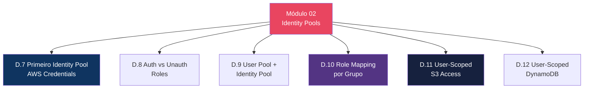
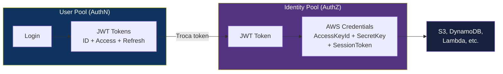

# Módulo 02 — Identity Pools

> **Nível:** 100-200 (Foundational/Intermediate)
> **Tempo Total Estimado:** 10-14 horas de labs
> **Custo Estimado:** ~$0
> **Objetivo do Módulo:** Dominar Cognito Identity Pools — gerar credenciais AWS temporárias para usuários autenticados, role mapping por grupo, acesso user-scoped a S3 e DynamoDB, e developer-authenticated identities.

---

## Mapa do Módulo



---

## User Pool vs Identity Pool



| Aspecto | User Pool | Identity Pool |
|---------|-----------|--------------|
| **Pergunta** | Quem é você? | O que você pode fazer na AWS? |
| **Output** | JWT Tokens | AWS Credentials (STS) |
| **Uso** | Autenticação | Acesso direto a serviços AWS |
| **Obrigatório?** | Sim (se usar Cognito para auth) | Não (só se precisar de AWS credentials) |

---

## Desafio 7: Primeiro Identity Pool

> **Level:** 100 | **Tempo:** 90 min | **Custo:** $0

### Objetivo

Criar Identity Pool, trocar token do User Pool por credenciais AWS temporárias e acessar S3.

```hcl
resource "aws_cognito_identity_pool" "main" {
  identity_pool_name               = "app-identity-pool"
  allow_unauthenticated_identities = false

  cognito_identity_providers {
    client_id               = aws_cognito_user_pool_client.spa.id
    provider_name           = aws_cognito_user_pool.main.endpoint
    server_side_token_check = true
  }
}

# Roles
resource "aws_cognito_identity_pool_roles_attachment" "main" {
  identity_pool_id = aws_cognito_identity_pool.main.id

  roles = {
    "authenticated"   = aws_iam_role.cognito_authenticated.arn
    "unauthenticated" = aws_iam_role.cognito_unauthenticated.arn
  }
}

# IAM Role para authenticated users
resource "aws_iam_role" "cognito_authenticated" {
  name = "CognitoAuthenticatedUser"
  assume_role_policy = jsonencode({
    Version = "2012-10-17"
    Statement = [{
      Effect = "Allow"
      Principal = { Federated = "cognito-identity.amazonaws.com" }
      Action = "sts:AssumeRoleWithWebIdentity"
      Condition = {
        StringEquals = {
          "cognito-identity.amazonaws.com:aud" = aws_cognito_identity_pool.main.id
        }
        "ForAnyValue:StringLike" = {
          "cognito-identity.amazonaws.com:amr" = "authenticated"
        }
      }
    }]
  })
}

# Policy: user-scoped S3 access
resource "aws_iam_role_policy" "cognito_s3" {
  name = "UserScopedS3"
  role = aws_iam_role.cognito_authenticated.id
  policy = jsonencode({
    Version = "2012-10-17"
    Statement = [{
      Effect = "Allow"
      Action = ["s3:GetObject", "s3:PutObject", "s3:DeleteObject"]
      Resource = "arn:aws:s3:::app-user-files/$${cognito-identity.amazonaws.com:sub}/*"
    }]
  })
}
```

### O Que Aprendemos

| Conceito | Detalhe |
|----------|---------|
| Identity Pool | Troca JWT tokens por AWS credentials temporárias |
| Authenticated role | IAM role para users logados |
| Unauthenticated role | IAM role para users anônimos (ex: download público) |
| `cognito-identity.amazonaws.com:sub` | User ID único — usado para scoped access |
| User-scoped S3 | Cada user acessa apenas `user-files/SEU_ID/*` |

> **💡 Expert Tip:** Identity Pool é necessário APENAS quando o frontend precisa acessar serviços AWS diretamente (S3 upload, DynamoDB read). Se toda a lógica passa por API Gateway + Lambda, você NÃO precisa de Identity Pool — o User Pool sozinho é suficiente.

---

## Resumo do Módulo 02

```
┌──────────────────────────────────────────────────────────────┐
│  ✅ D.7: Identity Pool + AWS Credentials                     │
│  ✅ D.8: Authenticated vs Unauthenticated Roles              │
│  ✅ D.9: User Pool + Identity Pool Integration               │
│  ✅ D.10: Role Mapping por Grupo                             │
│  ✅ D.11: User-Scoped S3 Access                              │
│  ✅ D.12: User-Scoped DynamoDB Access                        │
│  Próximo: Módulo 03 — OAuth2, OIDC & Managed Login          │
└──────────────────────────────────────────────────────────────┘
```

**Próximo:** [Módulo 03 — OAuth2, OIDC & Managed Login →](modulo-03-oauth2-managed-login.md)
