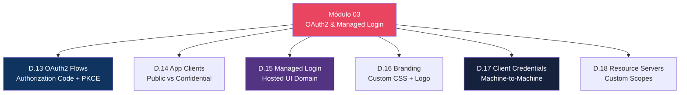
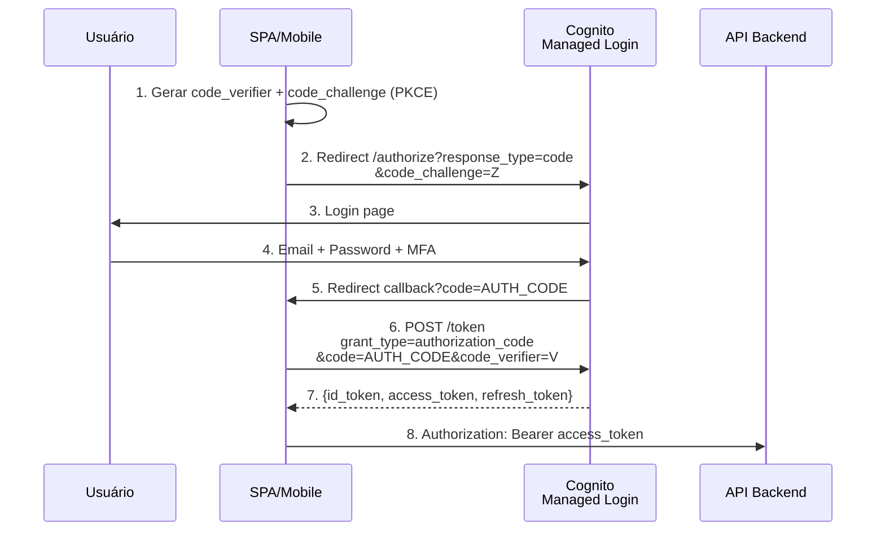
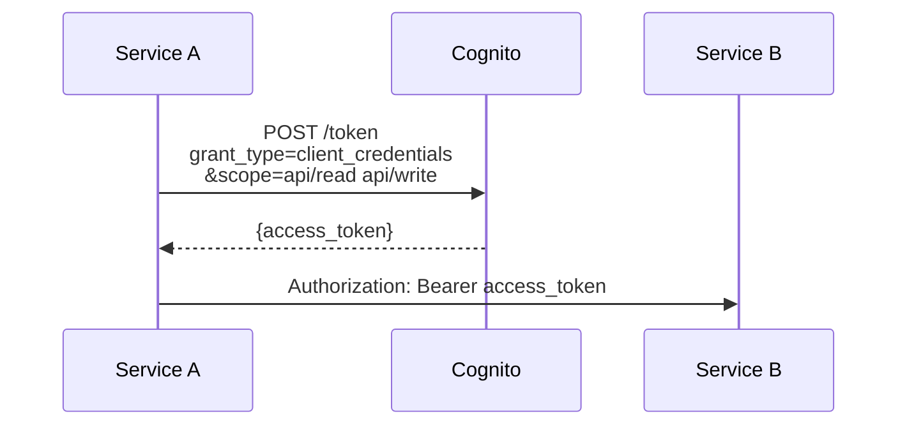

# Módulo 03 — OAuth2, OIDC & Managed Login

> **Nível:** 200 (Intermediate)
> **Tempo Total Estimado:** 10-14 horas de labs
> **Custo Estimado:** ~$0
> **Objetivo do Módulo:** Dominar OAuth2 flows, OIDC tokens, Managed Login pages, custom domain, branding, Resource Servers e custom scopes.

---

## Mapa do Módulo



---

## Desafio 13: OAuth2 Flows — Authorization Code + PKCE

> **Level:** 200 | **Tempo:** 90 min | **Custo:** $0

### Authorization Code Flow



### OAuth2 Flows Comparativo

| Flow | Quando Usar | Seguro? |
|------|------------|---------|
| **Authorization Code + PKCE** | SPAs, Mobile Apps | Mais seguro |
| **Authorization Code** (sem PKCE) | Server-side apps (com client_secret) | Seguro |
| **Client Credentials** | Machine-to-machine (sem user) | Seguro |
| **Implicit** (deprecated) | Nunca mais usar | Inseguro |

```bash
# Configurar domínio
aws cognito-idp create-user-pool-domain \
  --user-pool-id "$POOL_ID" \
  --domain "app-auth-lab"

# URL de login
echo "https://app-auth-lab.auth.$REGION.amazoncognito.com/login?client_id=$CLIENT_ID&response_type=code&scope=openid+email+profile&redirect_uri=http://localhost:3000/callback"

# Trocar code por tokens
curl -s -X POST \
  "https://app-auth-lab.auth.$REGION.amazoncognito.com/oauth2/token" \
  -H "Content-Type: application/x-www-form-urlencoded" \
  -d "grant_type=authorization_code&client_id=$CLIENT_ID&code=AUTH_CODE&redirect_uri=http://localhost:3000/callback"
```

### Terraform

```hcl
resource "aws_cognito_user_pool_domain" "main" {
  domain       = "app-auth-${var.environment}"
  user_pool_id = aws_cognito_user_pool.main.id
}

resource "aws_cognito_user_pool_client" "spa" {
  name         = "spa-client"
  user_pool_id = aws_cognito_user_pool.main.id

  generate_secret                      = false
  allowed_oauth_flows                  = ["code"]
  allowed_oauth_scopes                 = ["openid", "email", "profile"]
  allowed_oauth_flows_user_pool_client = true
  supported_identity_providers         = ["COGNITO"]

  callback_urls = ["http://localhost:3000/callback", "https://app.meusite.com/callback"]
  logout_urls   = ["http://localhost:3000/logout", "https://app.meusite.com/logout"]
}
```

> **💡 Expert Tip:** SEMPRE use Authorization Code + PKCE para SPAs. O flow Implicit é deprecated pela OAuth 2.1 spec. Com PKCE, mesmo que alguém intercepte o authorization code, não consegue trocar por tokens sem o code_verifier.

---

## Desafio 17: Client Credentials — Machine-to-Machine

> **Level:** 200 | **Tempo:** 60 min | **Custo:** $0

### Fluxo M2M



```hcl
resource "aws_cognito_resource_server" "api" {
  user_pool_id = aws_cognito_user_pool.main.id
  identifier   = "api"
  name         = "App API"

  scope {
    scope_name        = "read"
    scope_description = "Read access"
  }
  scope {
    scope_name        = "write"
    scope_description = "Write access"
  }
}

resource "aws_cognito_user_pool_client" "m2m" {
  name                                 = "service-a-m2m"
  user_pool_id                         = aws_cognito_user_pool.main.id
  generate_secret                      = true
  allowed_oauth_flows                  = ["client_credentials"]
  allowed_oauth_scopes                 = ["api/read", "api/write"]
  allowed_oauth_flows_user_pool_client = true
  supported_identity_providers         = []
}
```

### O Que Aprendemos

| Conceito | Detalhe |
|----------|---------|
| Authorization Code + PKCE | Flow mais seguro para SPAs/mobile |
| Client Credentials | M2M — sem user, apenas service identity |
| Resource Server | Define custom OAuth2 scopes |
| Managed Login | Hosted UI pages gerenciadas pela AWS |
| Custom domain | Branding do domínio de login |

---

## Resumo do Módulo 03

```
┌──────────────────────────────────────────────────────────────┐
│  ✅ D.13: Authorization Code + PKCE                          │
│  ✅ D.14: Public vs Confidential Clients                     │
│  ✅ D.15: Managed Login Domain                               │
│  ✅ D.16: Branding (CSS + Logo)                              │
│  ✅ D.17: Client Credentials (M2M)                           │
│  ✅ D.18: Resource Servers + Custom Scopes                   │
│  Próximo: Módulo 04 — Lambda Triggers                        │
└──────────────────────────────────────────────────────────────┘
```

**Próximo:** [Módulo 04 — Lambda Triggers →](modulo-04-lambda-triggers.md)
