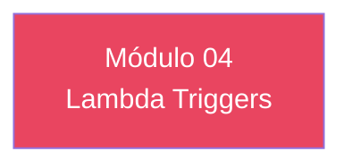

# Módulo 04 — Lambda Triggers

> **Nível:** 200 
> **Tempo Total Estimado:** 10-14 horas de labs
> **Desafios:** 19-24
> **Objetivo do Módulo:** Pre-signup, Pre-authentication, Post-confirmation, Pre-token generation, Custom message, User migration, Custom auth flow (passwordless)

---

## Mapa do Módulo



---

## Desafio 19: Pre-signup

> **Level:** 200 | **Tempo:** 90 min

### Objetivo

Pre-signup.

---

## Desafio 20: Pre-authentication

> **Level:** 200 | **Tempo:** 90 min

### Objetivo

Pre-authentication.

---

## Desafio 21: Post-confirmation

> **Level:** 200 | **Tempo:** 90 min

### Objetivo

Post-confirmation.

---

## Desafio 22: Pre-token generation

> **Level:** 200 | **Tempo:** 90 min

### Objetivo

Pre-token generation.

---

## Desafio 23: Custom message

> **Level:** 200 | **Tempo:** 90 min

### Objetivo

Custom message.

---

## Desafio 24: User migration

> **Level:** 200 | **Tempo:** 90 min

### Objetivo

User migration.

---

## Desafio 25: Custom auth flow (passwordless)

> **Level:** 200 | **Tempo:** 90 min

### Objetivo

Custom auth flow (passwordless).

---

## Resumo do Módulo 04

```
Módulo 04 completo — Lambda Triggers
Desafios 19-24 finalizados.
```
