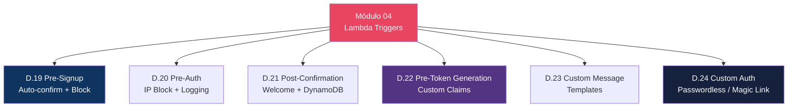
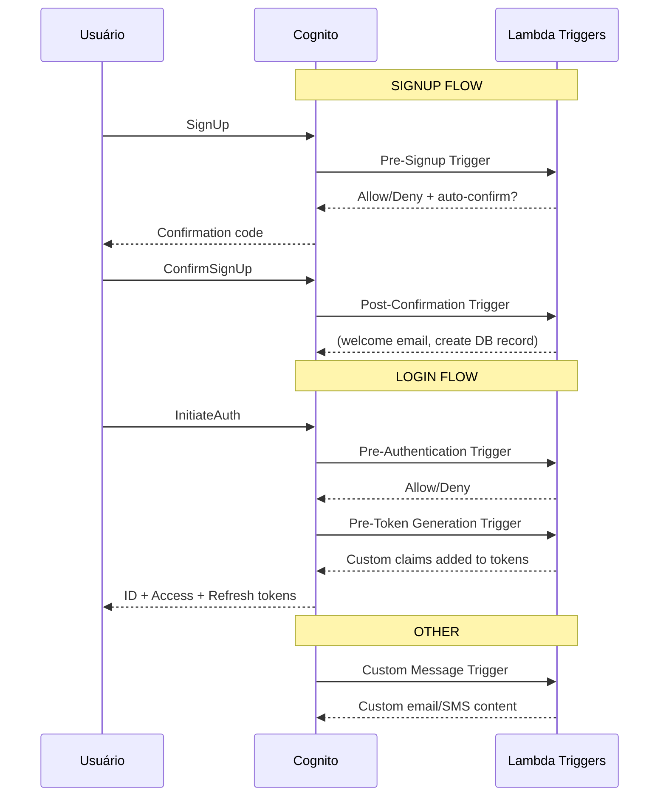
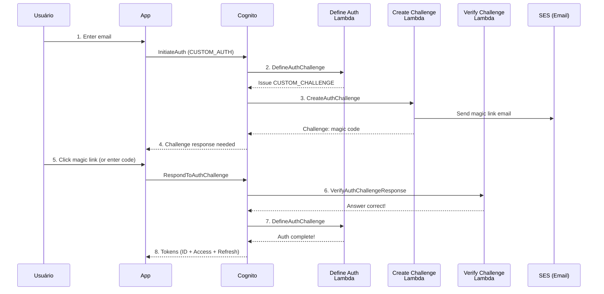

# Módulo 04 — Lambda Triggers

> **Nível:** 200-300 (Intermediate/Advanced)
> **Tempo Total Estimado:** 10-14 horas de labs
> **Custo Estimado:** ~$0 (Lambda Free Tier)
> **Objetivo do Módulo:** Dominar Lambda Triggers do Cognito — customizar cada etapa do fluxo de autenticação com código. Pre-signup (validação, auto-confirm), Pre-authentication (IP block), Post-confirmation (welcome email), Pre-token generation (custom claims), Custom message (templates), User migration (legado) e Custom auth flow (passwordless).

---

## Mapa do Módulo



---

## Visão Geral: Triggers no Fluxo de Auth



---

## Desafio 19: Pre-Signup — Auto-Confirm e Block

> **Level:** 200 | **Tempo:** 90 min | **Custo:** $0

### Objetivo

Usar **Pre-Signup trigger** para auto-confirmar users de domínios corporativos e bloquear domínios descartáveis.

### Lambda

```python
# pre-signup/handler.py
import json

# Domínios corporativos (auto-confirm sem código)
ALLOWED_DOMAINS = ['empresa.com', 'empresa.com.br']

# Domínios descartáveis (bloquear signup)
BLOCKED_DOMAINS = [
    'tempmail.com', 'throwaway.email', 'guerrillamail.com',
    'mailinator.com', 'yopmail.com', '10minutemail.com'
]

def handler(event, context):
    email = event['request']['userAttributes'].get('email', '')
    domain = email.split('@')[-1].lower()

    # Bloquear domínios descartáveis
    if domain in BLOCKED_DOMAINS:
        raise Exception('Signup not allowed with disposable email addresses')

    # Auto-confirmar domínios corporativos
    if domain in ALLOWED_DOMAINS:
        event['response']['autoConfirmUser'] = True
        event['response']['autoVerifyEmail'] = True

    return event
```

### Terraform

```hcl
resource "aws_lambda_function" "pre_signup" {
  function_name = "cognito-pre-signup"
  role          = aws_iam_role.cognito_trigger.arn
  runtime       = "python3.12"
  handler       = "handler.handler"
  filename      = "lambda/pre-signup.zip"
  timeout       = 5

  tags = { Trigger = "cognito-pre-signup" }
}

resource "aws_lambda_permission" "cognito_pre_signup" {
  statement_id  = "AllowCognitoInvoke"
  action        = "lambda:InvokeFunction"
  function_name = aws_lambda_function.pre_signup.function_name
  principal     = "cognito-idp.amazonaws.com"
  source_arn    = aws_cognito_user_pool.main.arn
}

# Associar trigger ao User Pool
resource "aws_cognito_user_pool" "main" {
  # ... (config existente)

  lambda_config {
    pre_sign_up = aws_lambda_function.pre_signup.arn
  }
}
```

### O Que Aprendemos

| Conceito | Detalhe |
|----------|---------|
| Pre-Signup | Executa ANTES do user ser criado |
| autoConfirmUser | Pula verificação de email (domínios confiáveis) |
| autoVerifyEmail | Marca email como verificado automaticamente |
| Bloquear signup | `raise Exception()` = signup negado |
| Use cases | Block disposable emails, auto-confirm corporativo, custom validation |

---

## Desafio 20: Pre-Authentication — IP Block e Logging

> **Level:** 200 | **Tempo:** 60 min | **Custo:** $0

### Lambda

```python
# pre-auth/handler.py
import json
import boto3
from datetime import datetime

dynamodb = boto3.resource('dynamodb')
table = dynamodb.Table('auth-logs')

BLOCKED_IPS = ['198.51.100.0/24']  # IPs bloqueados

def handler(event, context):
    email = event['request']['userAttributes'].get('email', '')
    source_ip = event['request'].get('clientMetadata', {}).get('sourceIp', 'unknown')

    # Bloquear IPs suspeitos
    for blocked in BLOCKED_IPS:
        if ip_in_range(source_ip, blocked):
            raise Exception('Access denied from your location')

    # Logar tentativa de auth
    table.put_item(Item={
        'userId': event['userName'],
        'timestamp': datetime.utcnow().isoformat(),
        'email': email,
        'sourceIp': source_ip,
        'event': 'pre-auth',
        'userPoolId': event['userPoolId']
    })

    return event

def ip_in_range(ip, cidr):
    # Simplificado — em produção use ipaddress module
    return ip.startswith(cidr.split('/')[0].rsplit('.', 1)[0])
```

### O Que Aprendemos

| Conceito | Detalhe |
|----------|---------|
| Pre-Authentication | Executa ANTES de validar a senha |
| IP blocking | Bloquear logins de IPs/regiões suspeitas |
| Audit logging | Registrar toda tentativa de login no DynamoDB |
| clientMetadata | Dados extras enviados pelo app (IP, device, etc.) |

---

## Desafio 21: Post-Confirmation — Welcome e DynamoDB

> **Level:** 200 | **Tempo:** 60 min | **Custo:** $0

### Lambda

```python
# post-confirmation/handler.py
import boto3
import json
from datetime import datetime

dynamodb = boto3.resource('dynamodb')
ses = boto3.client('ses')

def handler(event, context):
    user_attrs = event['request']['userAttributes']
    email = user_attrs.get('email', '')
    name = user_attrs.get('name', 'Usuário')
    user_id = event['request']['userAttributes']['sub']

    # 1. Criar perfil no DynamoDB
    table = dynamodb.Table('user-profiles')
    table.put_item(Item={
        'userId': user_id,
        'email': email,
        'name': name,
        'plan': 'free',
        'createdAt': datetime.utcnow().isoformat(),
        'settings': {
            'notifications': True,
            'theme': 'light',
            'language': 'pt-BR'
        }
    })

    # 2. Enviar welcome email (opcional, via SES)
    # ses.send_email(...)

    return event
```

### O Que Aprendemos

| Conceito | Detalhe |
|----------|---------|
| Post-Confirmation | Executa DEPOIS do user confirmar email |
| Onboarding | Criar perfil no DB, enviar welcome email |
| User ID | `event['request']['userAttributes']['sub']` = UUID estável |
| Idempotência | Trigger pode executar mais de uma vez — usar PutItem (não Insert) |

---

## Desafio 22: Pre-Token Generation — Custom Claims

> **Level:** 300 | **Tempo:** 90 min | **Custo:** $0

### Objetivo

Usar **Pre-Token Generation** trigger para adicionar **custom claims** ao JWT — permissões, tenant ID, feature flags.

### Lambda

```python
# pre-token/handler.py
import json
import boto3

dynamodb = boto3.resource('dynamodb')
table = dynamodb.Table('user-profiles')

def handler(event, context):
    user_id = event['request']['userAttributes']['sub']
    groups = event['request']['groupConfiguration'].get('groupsToOverride', [])

    # Buscar dados extras do user no DynamoDB
    result = table.get_item(Key={'userId': user_id})
    profile = result.get('Item', {})

    # Adicionar custom claims ao token
    claims = {
        'custom:tenant_id': profile.get('tenantId', 'default'),
        'custom:plan': profile.get('plan', 'free'),
        'custom:permissions': ','.join(get_permissions(groups, profile))
    }

    event['response']['claimsOverrideDetails'] = {
        'claimsToAddOrOverride': claims
    }

    # Adicionar scopes ao access token
    if 'admins' in groups:
        event['response']['claimsOverrideDetails']['claimsToAddOrOverride']['custom:role'] = 'admin'

    return event

def get_permissions(groups, profile):
    perms = ['read']
    if profile.get('plan') in ['pro', 'enterprise']:
        perms.append('write')
    if 'admins' in groups:
        perms.extend(['delete', 'admin'])
    return perms
```

### Token ANTES e DEPOIS

```json
// ANTES (sem trigger)
{
  "sub": "uuid",
  "email": "user@empresa.com",
  "cognito:groups": ["users"]
}

// DEPOIS (com Pre-Token trigger)
{
  "sub": "uuid",
  "email": "user@empresa.com",
  "cognito:groups": ["users"],
  "custom:tenant_id": "tenant-abc-123",
  "custom:plan": "pro",
  "custom:permissions": "read,write",
  "custom:role": "user"
}
```

### Terraform

```hcl
resource "aws_lambda_function" "pre_token" {
  function_name = "cognito-pre-token"
  role          = aws_iam_role.cognito_trigger.arn
  runtime       = "python3.12"
  handler       = "handler.handler"
  filename      = "lambda/pre-token.zip"
  timeout       = 5
}

resource "aws_cognito_user_pool" "main" {
  # ...
  lambda_config {
    pre_sign_up          = aws_lambda_function.pre_signup.arn
    post_confirmation    = aws_lambda_function.post_confirm.arn
    pre_token_generation = aws_lambda_function.pre_token.arn
  }
}
```

### O Que Aprendemos

| Conceito | Detalhe |
|----------|---------|
| Pre-Token Generation | Última chance de modificar claims antes de emitir token |
| Custom claims | Adicionar tenant_id, plan, permissions ao JWT |
| claimsToAddOrOverride | Adiciona ou sobrescreve claims no token |
| Use cases | Multi-tenant, feature flags, RBAC, plan-based access |

> **💡 Expert Tip:** Pre-Token Generation é o trigger mais poderoso do Cognito. Use para injetar dados de autorização (tenant, permissions, plan) diretamente no JWT. O backend lê esses claims sem precisar fazer lookup no banco — zero latência adicional. Mas cuidado: cada claim aumenta o tamanho do token. Mantenha abaixo de ~20 claims customizados.

---

## Desafio 23: Custom Message — Templates Dinâmicos

> **Level:** 200 | **Tempo:** 60 min | **Custo:** $0

### Lambda

```python
# custom-message/handler.py
def handler(event, context):
    trigger = event['triggerSource']
    name = event['request']['userAttributes'].get('name', 'Usuário')
    code = event['request'].get('codeParameter', '{####}')

    if trigger == 'CustomMessage_SignUp':
        event['response']['emailSubject'] = f'Bem-vindo ao App, {name}!'
        event['response']['emailMessage'] = f'''
            <h1>Olá {name}!</h1>
            <p>Seu código de verificação é: <strong>{code}</strong></p>
            <p>Este código expira em 24 horas.</p>
        '''

    elif trigger == 'CustomMessage_ForgotPassword':
        event['response']['emailSubject'] = 'Redefinição de senha'
        event['response']['emailMessage'] = f'''
            <h1>Redefinir senha</h1>
            <p>Olá {name}, use o código: <strong>{code}</strong></p>
        '''

    elif trigger == 'CustomMessage_AdminCreateUser':
        event['response']['emailSubject'] = 'Convite para o App'
        event['response']['emailMessage'] = f'''
            <h1>Você foi convidado!</h1>
            <p>Seu login: {event['request']['usernameParameter']}</p>
            <p>Senha temporária: {code}</p>
        '''

    return event
```

### O Que Aprendemos

| Conceito | Detalhe |
|----------|---------|
| Custom Message | Personalizar emails/SMS por tipo de evento |
| triggerSource | Identifica qual evento (SignUp, ForgotPassword, AdminCreate) |
| codeParameter | Placeholder `{####}` substituído pelo código real |
| HTML | Suporta HTML completo no email |

---

## Desafio 24: Custom Auth Flow — Passwordless / Magic Link

> **Level:** 300 | **Tempo:** 120 min | **Custo:** ~$0.50 (SES)

### Objetivo

Implementar **autenticação passwordless** — login via magic link por email (sem senha).

### Fluxo



### Lambdas para Custom Auth

```python
# define-auth-challenge/handler.py
def handler(event, context):
    """Orquestra o fluxo de custom auth."""
    session = event['request']['session']

    if len(session) == 0:
        # Primeira chamada — emitir challenge
        event['response']['issueTokens'] = False
        event['response']['failAuthentication'] = False
        event['response']['challengeName'] = 'CUSTOM_CHALLENGE'
    elif session[-1]['challengeResult']:
        # Challenge respondido corretamente — emitir tokens
        event['response']['issueTokens'] = True
        event['response']['failAuthentication'] = False
    else:
        # Challenge respondido incorretamente — falhar
        event['response']['issueTokens'] = False
        event['response']['failAuthentication'] = True

    return event


# create-auth-challenge/handler.py
import secrets
import boto3

ses = boto3.client('ses')

def handler(event, context):
    """Cria o challenge — gera código e envia por email."""
    email = event['request']['userAttributes']['email']
    code = secrets.token_urlsafe(32)[:6].upper()  # 6 chars

    # Enviar código por email
    ses.send_email(
        Source='noreply@meudominio.com',
        Destination={'ToAddresses': [email]},
        Message={
            'Subject': {'Data': 'Seu código de login'},
            'Body': {
                'Html': {'Data': f'<h1>Código: {code}</h1><p>Expira em 5 minutos.</p>'}
            }
        }
    )

    event['response']['publicChallengeParameters'] = {'email': email}
    event['response']['privateChallengeParameters'] = {'code': code}
    event['response']['challengeMetadata'] = f'CODE-{code}'

    return event


# verify-auth-challenge/handler.py
def handler(event, context):
    """Verifica a resposta do challenge."""
    expected = event['request']['privateChallengeParameters']['code']
    answer = event['request']['challengeAnswer']

    event['response']['answerCorrect'] = (answer == expected)
    return event
```

### Terraform

```hcl
resource "aws_cognito_user_pool" "main" {
  # ...
  lambda_config {
    define_auth_challenge          = aws_lambda_function.define_auth.arn
    create_auth_challenge          = aws_lambda_function.create_auth.arn
    verify_auth_challenge_response = aws_lambda_function.verify_auth.arn
  }
}

# App Client com CUSTOM_AUTH
resource "aws_cognito_user_pool_client" "passwordless" {
  name         = "passwordless-client"
  user_pool_id = aws_cognito_user_pool.main.id

  explicit_auth_flows = [
    "ALLOW_CUSTOM_AUTH",
    "ALLOW_REFRESH_TOKEN_AUTH"
  ]
}
```

### O Que Aprendemos

| Conceito | Detalhe |
|----------|---------|
| Custom Auth Flow | 3 Lambdas: Define, Create, Verify |
| DefineAuthChallenge | Orquestra: emitir challenge? tokens? falhar? |
| CreateAuthChallenge | Gera código e envia (email, SMS, push) |
| VerifyAuthChallengeResponse | Compara resposta com código esperado |
| Passwordless | Login sem senha — apenas código por email |
| Magic Link | Variação: link clicável em vez de código digitado |

> **💡 Expert Tip:** Passwordless é a tendência #1 em autenticação. Elimina 80% dos problemas de suporte (forgot password, locked account). Implementar com Cognito Custom Auth + SES é simples e barato. Para produção, adicione rate limiting (max 3 códigos por email por hora) e TTL curto (5 minutos) no código. Combine com passkeys (WebAuthn) para a experiência mais segura e fluida.

---

## Resumo do Módulo 04

```
┌──────────────────────────────────────────────────────────────┐
│               MÓDULO 04 — CONQUISTAS                          │
│                                                               │
│  ✅ Desafio 19: Pre-Signup (auto-confirm, block disposable)  │
│  ✅ Desafio 20: Pre-Auth (IP block, audit logging)           │
│  ✅ Desafio 21: Post-Confirmation (DynamoDB profile, email)  │
│  ✅ Desafio 22: Pre-Token Generation (custom claims)         │
│  ✅ Desafio 23: Custom Message (email templates)             │
│  ✅ Desafio 24: Custom Auth (passwordless / magic link)      │
│                                                               │
│  Próximo: Módulo 05 — Security & Threat Protection           │
└──────────────────────────────────────────────────────────────┘
```

**Próximo:** [Módulo 05 — Security & Threat Protection →](modulo-05-security.md)
