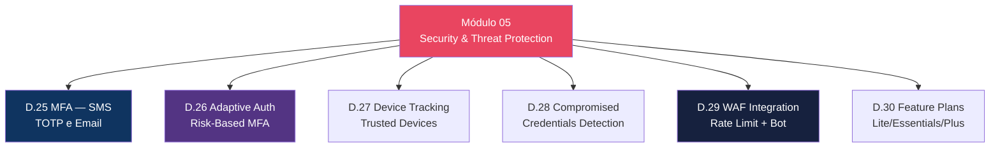
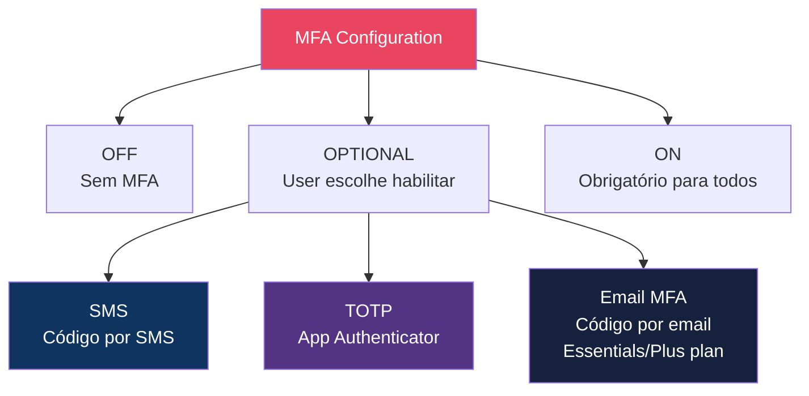
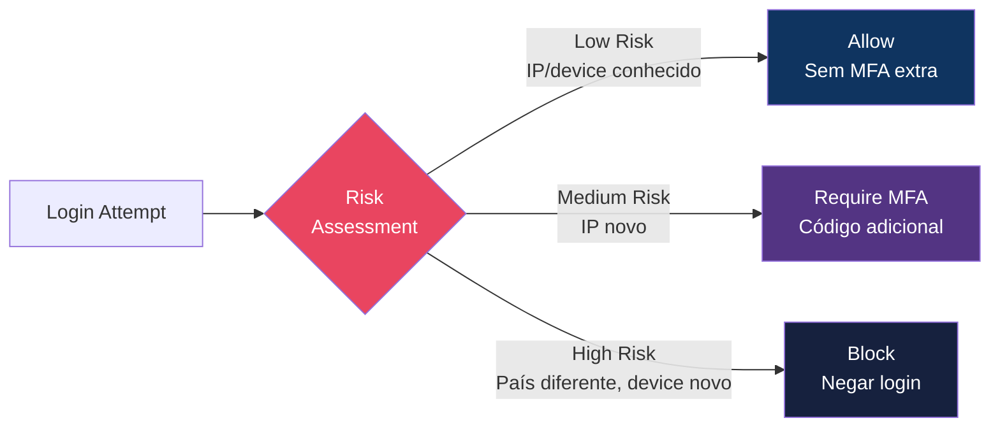

# Módulo 05 — Security & Threat Protection

> **Nível:** 300 (Advanced)
> **Tempo Total Estimado:** 10-14 horas de labs
> **Custo Estimado:** ~$2-10 (Plus plan para advanced security)
> **Objetivo do Módulo:** Dominar segurança do Cognito — MFA (SMS, TOTP, Email), autenticação adaptativa (risk-based), device tracking, detecção de credenciais comprometidas, integração WAF, account recovery e feature plans (Lite/Essentials/Plus).

---

## Mapa do Módulo



---

## Desafio 25: MFA — SMS, TOTP e Email

> **Level:** 300 | **Tempo:** 90 min | **Custo:** ~$0.50 (SMS)

### MFA Options



```hcl
resource "aws_cognito_user_pool" "main" {
  # ...
  mfa_configuration = "OPTIONAL"  # OFF, OPTIONAL, ON

  # TOTP (app authenticator)
  software_token_mfa_configuration {
    enabled = true
  }

  # SMS (requer SNS)
  sms_configuration {
    external_id    = "cognito-sms"
    sns_caller_arn = aws_iam_role.cognito_sms.arn
  }

  # Email MFA (requer Essentials ou Plus plan)
  # email_mfa_configuration {
  #   message = "Seu código MFA é {####}"
  #   subject = "Código de verificação"
  # }
}
```

| Tipo MFA | Custo | Segurança | UX |
|----------|-------|-----------|-----|
| SMS | ~$0.01/msg | Média (SIM swap) | Boa |
| TOTP | $0 | Alta | Média (setup) |
| Email | $0 (Cognito) | Média-Alta | Boa |
| Passkeys | $0 | Muito Alta | Excelente |

> **💡 Expert Tip:** TOTP (Google Authenticator, Authy) é o melhor custo-benefício: gratuito, seguro e independente de rede celular. SMS MFA é vulnerável a SIM swap attacks — use apenas como fallback. Para a melhor UX + segurança, combine TOTP + passkeys (WebAuthn) no Plus plan.

---

## Desafio 26: Adaptive Authentication — Risk-Based MFA

> **Level:** 300 | **Tempo:** 90 min | **Custo:** ~$2 (Plus plan)

### Como Funciona



```
Fatores analisados pelo Adaptive Auth:
├── IP address (novo? país diferente?)
├── Device (reconhecido? fingerprint?)
├── Location (geolocalização do IP)
├── Horário (fora do padrão do user?)
├── Velocidade (login de 2 países em 1h = impossible travel)
└── Histórico (padrão de login do user)

Ações configuráveis:
├── Low risk → Allow (sem MFA adicional)
├── Medium risk → MFA (forçar segundo fator)
├── High risk → Block (negar + notificar)
└── Cada nível é configurável independentemente
```

```hcl
resource "aws_cognito_user_pool" "main" {
  # ...

  # Requer Plus plan
  user_pool_add_ons {
    advanced_security_mode = "ENFORCED"  # OFF, AUDIT, ENFORCED
  }
}
```

### O Que Aprendemos

| Conceito | Detalhe |
|----------|---------|
| Adaptive Auth | MFA dinâmico baseado em risco |
| Risk levels | Low (allow), Medium (MFA), High (block) |
| advanced_security_mode | AUDIT (log only) vs ENFORCED (ação automática) |
| Feature plan | Requer Essentials ou Plus |

---

## Desafio 29: WAF Integration

> **Level:** 300 | **Tempo:** 60 min | **Custo:** ~$5/mês

### Objetivo

Associar **AWS WAF** ao User Pool para proteger endpoints de autenticação contra brute force, bots e ataques de layer 7.

```hcl
resource "aws_wafv2_web_acl_association" "cognito" {
  resource_arn = aws_cognito_user_pool.main.arn
  web_acl_arn  = aws_wafv2_web_acl.cognito.arn
}

resource "aws_wafv2_web_acl" "cognito" {
  name  = "cognito-protection"
  scope = "REGIONAL"

  default_action { allow {} }

  # Rate limit para signup/login
  rule {
    name     = "RateLimit"
    priority = 0
    action   { block {} }
    statement {
      rate_based_statement {
        limit              = 100
        aggregate_key_type = "IP"
      }
    }
    visibility_config {
      sampled_requests_enabled   = true
      cloudwatch_metrics_enabled = true
      metric_name                = "CognitoRateLimit"
    }
  }

  visibility_config {
    sampled_requests_enabled   = true
    cloudwatch_metrics_enabled = true
    metric_name                = "CognitoWAF"
  }
}
```

### O Que Aprendemos

| Conceito | Detalhe |
|----------|---------|
| WAF + Cognito | Protege endpoints /login, /signup, /oauth2/token |
| Rate limiting | Previne brute force (ex: 100 req/5min por IP) |
| Bot Control | Managed rules para detectar bots automatizados |
| Scope | REGIONAL (mesmo que API Gateway) |

---

## Desafio 30: Feature Plans — Lite, Essentials, Plus

> **Level:** 300 | **Tempo:** 30 min | **Custo:** Análise

### Comparativo

| Feature | Lite | Essentials | Plus |
|---------|------|------------|------|
| **Preço** | Grátis (50K MAU) | ~$0.015/MAU | ~$0.050/MAU |
| **Signup/Login** | Sim | Sim | Sim |
| **MFA (SMS/TOTP)** | Sim | Sim | Sim |
| **MFA (Email)** | Não | Sim | Sim |
| **OAuth2/OIDC** | Sim | Sim | Sim |
| **Managed Login** | Básico | Customizável | Full branding |
| **Passkeys (WebAuthn)** | Não | Sim | Sim |
| **Adaptive Auth** | Não | Não | Sim |
| **Compromised creds** | Não | Não | Sim |
| **Security logging** | Básico | CloudWatch | S3 + CloudWatch + Firehose |
| **Custom token claims** | Básico | Sim | Sim (v2) |

> **💡 Expert Tip:** Para a maioria dos projetos, **Essentials** é o sweet spot: passkeys, email MFA, e managed login customizável por $0.015/MAU. O Plus ($0.050/MAU) vale apenas se precisa de adaptive auth ou compromised credentials detection — features enterprise. Lite é suficiente para MVPs e projetos internos.

---

## Resumo do Módulo 05

```
┌──────────────────────────────────────────────────────────────┐
│  ✅ D.25: MFA (SMS, TOTP, Email)                             │
│  ✅ D.26: Adaptive Auth (risk-based MFA)                     │
│  ✅ D.27: Device Tracking (trusted devices)                  │
│  ✅ D.28: Compromised Credentials Detection                  │
│  ✅ D.29: WAF Integration                                    │
│  ✅ D.30: Feature Plans (Lite/Essentials/Plus)               │
│  Próximo: Módulo 06 — API Gateway & ALB Integration          │
└──────────────────────────────────────────────────────────────┘
```

**Próximo:** [Módulo 06 — API Gateway & ALB Integration →](modulo-06-api-alb-integration.md)
