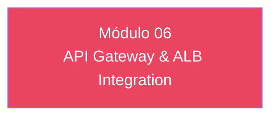

# Módulo 06 — API Gateway & ALB Integration

> **Nível:** 300 
> **Tempo Total Estimado:** 10-14 horas de labs
> **Desafios:** 31-36
> **Objetivo do Módulo:** Cognito Authorizer (REST API), JWT Authorizer (HTTP API), ALB auth action, M2M (client credentials), token validation, refresh rotation

---

## Mapa do Módulo



---

## Desafio 31: Cognito Authorizer (REST API)

> **Level:** 300 | **Tempo:** 90 min

### Objetivo

Cognito Authorizer (REST API).

---

## Desafio 32: JWT Authorizer (HTTP API)

> **Level:** 300 | **Tempo:** 90 min

### Objetivo

JWT Authorizer (HTTP API).

---

## Desafio 33: ALB auth action

> **Level:** 300 | **Tempo:** 90 min

### Objetivo

ALB auth action.

---

## Desafio 34: M2M (client credentials)

> **Level:** 300 | **Tempo:** 90 min

### Objetivo

M2M (client credentials).

---

## Desafio 35: token validation

> **Level:** 300 | **Tempo:** 90 min

### Objetivo

token validation.

---

## Desafio 36: refresh rotation

> **Level:** 300 | **Tempo:** 90 min

### Objetivo

refresh rotation.

---

## Resumo do Módulo 06

```
Módulo 06 completo — API Gateway & ALB Integration
Desafios 31-36 finalizados.
```
