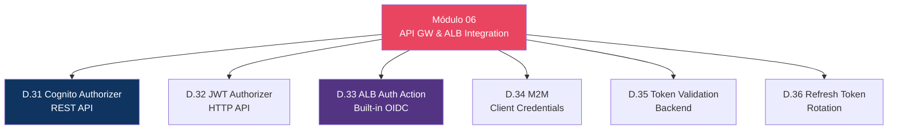
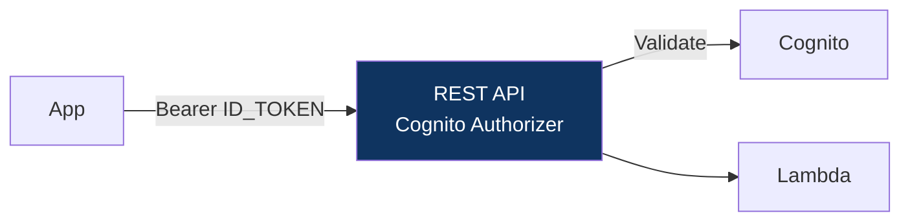
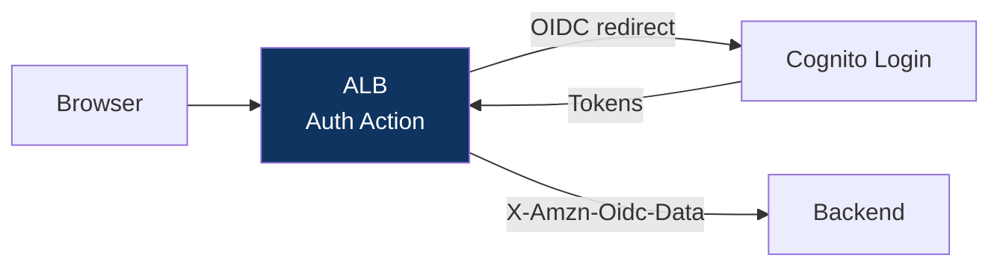

# Módulo 06 — API Gateway & ALB Integration

> **Nível:** 300 (Advanced)
> **Tempo Total Estimado:** 10-14 horas de labs
> **Custo Estimado:** ~$2
> **Objetivo do Módulo:** Integrar Cognito com API Gateway (REST + HTTP API) e ALB — Cognito Authorizer, JWT Authorizer, ALB authentication action, Machine-to-Machine, token validation e refresh rotation.

---

## Mapa do Módulo



## Desafio 31: Cognito Authorizer — REST API

> **Level:** 300 | **Tempo:** 90 min | **Custo:** ~$0



```hcl
resource "aws_api_gateway_authorizer" "cognito" {
  name          = "CognitoAuth"
  rest_api_id   = aws_api_gateway_rest_api.main.id
  type          = "COGNITO_USER_POOLS"
  provider_arns = [aws_cognito_user_pool.main.arn]
}
```

## Desafio 33: ALB Authentication Action

> **Level:** 300 | **Tempo:** 90 min | **Custo:** ~$1



```hcl
resource "aws_lb_listener_rule" "auth" {
  listener_arn = aws_lb_listener.https.arn
  priority     = 100

  action {
    type = "authenticate-cognito"
    authenticate_cognito {
      user_pool_arn       = aws_cognito_user_pool.main.arn
      user_pool_client_id = aws_cognito_user_pool_client.alb.id
      user_pool_domain    = aws_cognito_user_pool_domain.main.domain
      on_unauthenticated_request = "authenticate"
      scope                      = "openid email"
    }
  }

  action {
    type             = "forward"
    target_group_arn = aws_lb_target_group.app.arn
  }

  condition { path_pattern { values = ["/*"] } }
}
```

> **💡 Expert Tip:** ALB Auth Action é a forma mais simples de adicionar autenticação a uma app existente — zero código, zero mudança no backend. O ALB redireciona para Cognito Managed Login, recebe os tokens e injeta os claims como header `X-Amzn-Oidc-Data`. O backend só precisa ler esse header.

---

## Resumo

```
✅ D.31-36: Cognito + API GW (REST/HTTP) + ALB + M2M + Token Rotation
Próximo: Módulo 07 — Federation
```

**Próximo:** [Módulo 07 — Federation →](modulo-07-federation.md)
