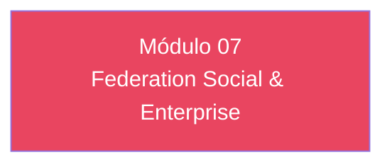

# Módulo 07 — Federation Social & Enterprise

> **Nível:** 300 
> **Tempo Total Estimado:** 10-14 horas de labs
> **Desafios:** 37-42
> **Objetivo do Módulo:** Google, Facebook, Apple login, SAML 2.0 (Okta, Azure AD), OIDC federation, attribute mapping, linking federated to local profiles

---

## Mapa do Módulo



---

## Desafio 37: Google

> **Level:** 300 | **Tempo:** 90 min

### Objetivo

Google.

---

## Desafio 38: Facebook

> **Level:** 300 | **Tempo:** 90 min

### Objetivo

Facebook.

---

## Desafio 39: Apple login

> **Level:** 300 | **Tempo:** 90 min

### Objetivo

Apple login.

---

## Desafio 40: SAML 2.0 (Okta

> **Level:** 300 | **Tempo:** 90 min

### Objetivo

SAML 2.0 (Okta.

---

## Desafio 41: Azure AD)

> **Level:** 300 | **Tempo:** 90 min

### Objetivo

Azure AD).

---

## Desafio 42: OIDC federation

> **Level:** 300 | **Tempo:** 90 min

### Objetivo

OIDC federation.

---

## Desafio 43: attribute mapping

> **Level:** 300 | **Tempo:** 90 min

### Objetivo

attribute mapping.

---

## Desafio 44: linking federated to local profiles

> **Level:** 300 | **Tempo:** 90 min

### Objetivo

linking federated to local profiles.

---

## Resumo do Módulo 07

```
Módulo 07 completo — Federation Social & Enterprise
Desafios 37-42 finalizados.
```
