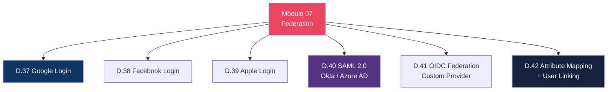
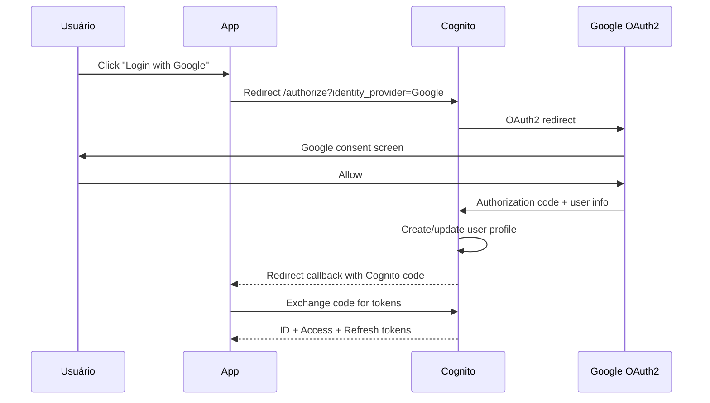
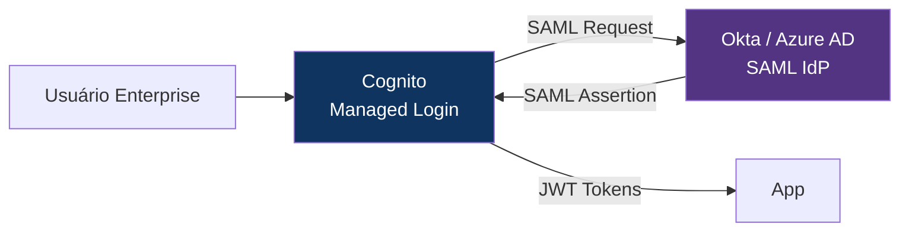

# Módulo 07 — Federation: Social & Enterprise

> **Nível:** 300 (Advanced)
> **Tempo Total Estimado:** 10-14 horas de labs
> **Custo Estimado:** ~$1
> **Objetivo do Módulo:** Implementar federation com social providers (Google, Facebook, Apple) e enterprise providers (SAML 2.0 com Okta/Azure AD, OIDC), attribute mapping e linking de users federados com perfis locais.

---

## Mapa do Módulo



---

## Desafio 37: Google Login

> **Level:** 300 | **Tempo:** 90 min | **Custo:** $0

### Fluxo



### Passo a Passo

```
1. Google Cloud Console → APIs & Services → Credentials
2. Create OAuth 2.0 Client ID
3. Authorized redirect URI: https://YOUR_DOMAIN.auth.REGION.amazoncognito.com/oauth2/idpresponse
4. Copiar Client ID e Client Secret
```

```hcl
resource "aws_cognito_identity_provider" "google" {
  user_pool_id  = aws_cognito_user_pool.main.id
  provider_name = "Google"
  provider_type = "Google"

  provider_details = {
    client_id        = var.google_client_id
    client_secret    = var.google_client_secret
    authorize_scopes = "openid email profile"
  }

  attribute_mapping = {
    email    = "email"
    name     = "name"
    picture  = "picture"
    username = "sub"
  }
}

# App Client: incluir Google como IdP
resource "aws_cognito_user_pool_client" "spa" {
  # ...
  supported_identity_providers = ["COGNITO", "Google"]
}
```

---

## Desafio 40: SAML 2.0 — Okta / Azure AD

> **Level:** 300 | **Tempo:** 120 min | **Custo:** $0

### Arquitetura



```hcl
resource "aws_cognito_identity_provider" "okta" {
  user_pool_id  = aws_cognito_user_pool.main.id
  provider_name = "Okta"
  provider_type = "SAML"

  provider_details = {
    MetadataURL = "https://empresa.okta.com/app/xxx/sso/saml/metadata"
  }

  attribute_mapping = {
    email      = "http://schemas.xmlsoap.org/ws/2005/05/identity/claims/emailaddress"
    name       = "http://schemas.xmlsoap.org/ws/2005/05/identity/claims/name"
    "custom:department" = "department"
  }
}
```

### O Que Aprendemos

| Conceito | Detalhe |
|----------|---------|
| Social login | Google, Facebook, Apple — OAuth2/OIDC |
| SAML 2.0 | Enterprise SSO (Okta, Azure AD, OneLogin) |
| Attribute mapping | Mapear claims do IdP para atributos do Cognito |
| User linking | Vincular user federado a perfil local existente |
| MetadataURL | XML com configuração do IdP (endpoints, certificates) |

> **💡 Expert Tip:** Para B2B SaaS, SAML federation é obrigatório. Clientes enterprise exigem "login com meu Azure AD/Okta". Cognito suporta múltiplos SAML IdPs — cada cliente empresa pode ter seu próprio IdP configurado. Use attribute mapping para extrair `department`, `role` ou `tenant` do assertion SAML.

---

## Resumo

```
✅ D.37-42: Social (Google/Facebook/Apple) + Enterprise (SAML/OIDC) + Attribute Mapping
Próximo: Módulo 08 — Frontend Integration
```

**Próximo:** [Módulo 08 — Frontend Integration →](modulo-08-frontend-integration.md)
