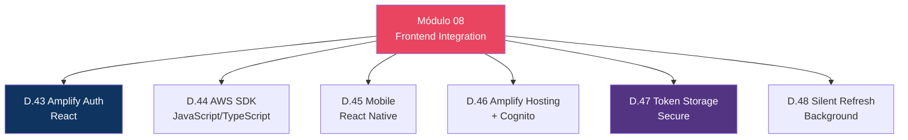

# Módulo 08 — Frontend Integration

> **Nível:** 400 (Expert)
> **Tempo Total Estimado:** 10-14 horas de labs
> **Custo Estimado:** ~$0
> **Objetivo do Módulo:** Integrar Cognito com frontends — Amplify Auth (React), AWS SDK JavaScript, mobile (React Native/Flutter), token storage seguro e silent refresh.

---

## Mapa do Módulo



---

## Desafio 43: Amplify Auth — React

> **Level:** 400 | **Tempo:** 120 min | **Custo:** $0

### Setup Rápido

```bash
# Instalar Amplify
npm create vite@latest my-app -- --template react-ts
cd my-app
npm install aws-amplify @aws-amplify/ui-react
```

```typescript
// src/main.tsx
import { Amplify } from 'aws-amplify';
import { Authenticator } from '@aws-amplify/ui-react';
import '@aws-amplify/ui-react/styles.css';

Amplify.configure({
  Auth: {
    Cognito: {
      userPoolId: 'us-east-1_XXXXX',
      userPoolClientId: 'CLIENT_ID',
      loginWith: {
        oauth: {
          domain: 'app-auth.auth.us-east-1.amazoncognito.com',
          scopes: ['openid', 'email', 'profile'],
          redirectSignIn: ['http://localhost:5173/'],
          redirectSignOut: ['http://localhost:5173/'],
          responseType: 'code',
        }
      }
    }
  }
});

function App() {
  return (
    <Authenticator>
      {({ signOut, user }) => (
        <main>
          <h1>Hello {user?.signInDetails?.loginId}</h1>
          <button onClick={signOut}>Sign out</button>
        </main>
      )}
    </Authenticator>
  );
}

export default App;
```

### Token Management

```typescript
// Acessar tokens
import { fetchAuthSession } from 'aws-amplify/auth';

async function getTokens() {
  const session = await fetchAuthSession();

  const idToken = session.tokens?.idToken?.toString();
  const accessToken = session.tokens?.accessToken?.toString();

  // Usar access token para API calls
  const response = await fetch('https://api.meusite.com/orders', {
    headers: {
      'Authorization': `Bearer ${accessToken}`
    }
  });
}
```

### O Que Aprendemos

| Conceito | Detalhe |
|----------|---------|
| Amplify Auth | Componente pronto com signup, login, MFA, social |
| `<Authenticator>` | HOC que renderiza login UI automaticamente |
| `fetchAuthSession` | Busca tokens (com refresh automático) |
| Token storage | Amplify armazena em localStorage (web) ou Keychain (mobile) |

> **💡 Expert Tip:** O `<Authenticator>` do Amplify é perfeito para MVPs e protótipos (5 minutos para ter login funcional). Para produção com branding customizado, use `signIn()`, `signUp()` e `confirmSignUp()` da API programática e construa sua própria UI. A Amplify UI é customizável via CSS themes, mas para controle total, a API é melhor.

---

## Desafio 47: Token Storage Seguro

> **Level:** 400 | **Tempo:** 60 min | **Custo:** $0

### Onde Armazenar Tokens

| Storage | Web | Mobile | Segurança | Recomendação |
|---------|-----|--------|-----------|-------------|
| localStorage | Sim | N/A | Baixa (XSS) | Não para tokens sensíveis |
| sessionStorage | Sim | N/A | Média | OK para SPAs |
| HttpOnly Cookie | Sim | N/A | Alta | Melhor para web (com CSRF protection) |
| Keychain/Keystore | N/A | Sim | Alta | Padrão para mobile |
| Memory only | Sim | Sim | Muito alta | Perde no refresh |

```
Best Practices:
├── Web SPA: HttpOnly cookie (via BFF) OU sessionStorage + short TTL
├── Mobile: Keychain (iOS) / EncryptedSharedPreferences (Android)
├── Server: Secrets Manager ou variável de ambiente encrypted
└── NUNCA: URL params, localStorage para refresh tokens, log de tokens
```

---

## Resumo

```
✅ D.43-48: React + Amplify + Mobile + Token Storage + Silent Refresh
Próximo: Módulo 09 — Advanced Patterns
```

**Próximo:** [Módulo 09 — Advanced Patterns →](modulo-09-advanced-patterns.md)
