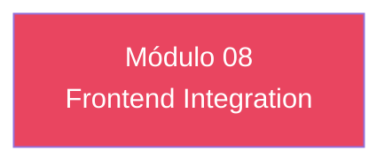

# Módulo 08 — Frontend Integration

> **Nível:** 400 
> **Tempo Total Estimado:** 10-14 horas de labs
> **Desafios:** 43-48
> **Objetivo do Módulo:** Amplify Auth (React), AWS SDK JavaScript, mobile (React Native), Amplify Hosting, secure token storage, silent refresh

---

## Mapa do Módulo



---

## Desafio 43: Amplify Auth (React)

> **Level:** 400 | **Tempo:** 90 min

### Objetivo

Amplify Auth (React).

---

## Desafio 44: AWS SDK JavaScript

> **Level:** 400 | **Tempo:** 90 min

### Objetivo

AWS SDK JavaScript.

---

## Desafio 45: mobile (React Native)

> **Level:** 400 | **Tempo:** 90 min

### Objetivo

mobile (React Native).

---

## Desafio 46: Amplify Hosting

> **Level:** 400 | **Tempo:** 90 min

### Objetivo

Amplify Hosting.

---

## Desafio 47: secure token storage

> **Level:** 400 | **Tempo:** 90 min

### Objetivo

secure token storage.

---

## Desafio 48: silent refresh

> **Level:** 400 | **Tempo:** 90 min

### Objetivo

silent refresh.

---

## Resumo do Módulo 08

```
Módulo 08 completo — Frontend Integration
Desafios 43-48 finalizados.
```
