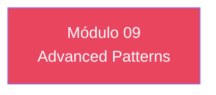

# Módulo 09 — Advanced Patterns

> **Nível:** 400 
> **Tempo Total Estimado:** 10-14 horas de labs
> **Desafios:** 49-54
> **Objetivo do Módulo:** Multi-tenant auth, passwordless (magic link), passkeys (WebAuthn), step-up auth, token customization, user migration from legacy

---

## Mapa do Módulo



---

## Desafio 49: Multi-tenant auth

> **Level:** 400 | **Tempo:** 90 min

### Objetivo

Multi-tenant auth.

---

## Desafio 50: passwordless (magic link)

> **Level:** 400 | **Tempo:** 90 min

### Objetivo

passwordless (magic link).

---

## Desafio 51: passkeys (WebAuthn)

> **Level:** 400 | **Tempo:** 90 min

### Objetivo

passkeys (WebAuthn).

---

## Desafio 52: step-up auth

> **Level:** 400 | **Tempo:** 90 min

### Objetivo

step-up auth.

---

## Desafio 53: token customization

> **Level:** 400 | **Tempo:** 90 min

### Objetivo

token customization.

---

## Desafio 54: user migration from legacy

> **Level:** 400 | **Tempo:** 90 min

### Objetivo

user migration from legacy.

---

## Resumo do Módulo 09

```
Módulo 09 completo — Advanced Patterns
Desafios 49-54 finalizados.
```
