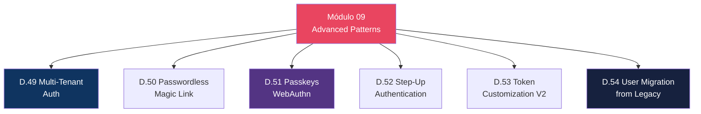
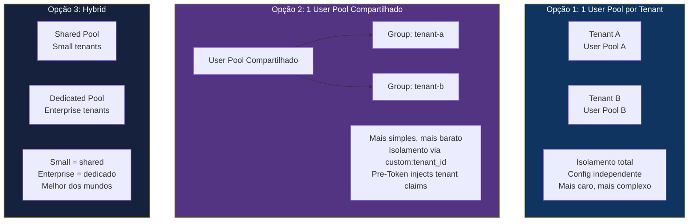
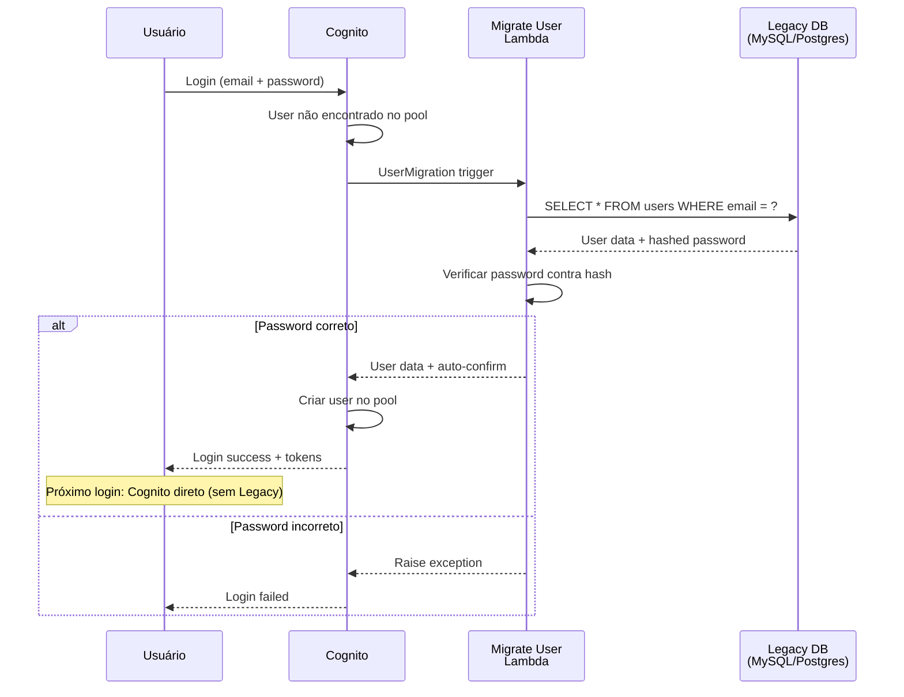

# Módulo 09 — Advanced Patterns

> **Nível:** 400 (Expert)
> **Tempo Total Estimado:** 10-14 horas de labs
> **Custo Estimado:** ~$2-5
> **Objetivo do Módulo:** Padrões avançados de autenticação — multi-tenant auth, passwordless (magic link), passkeys (WebAuthn), step-up authentication, token customization avançada e migração de users de sistema legado.

---

## Mapa do Módulo



---

## Desafio 49: Multi-Tenant Auth

> **Level:** 400 | **Tempo:** 120 min | **Custo:** ~$1

### Arquitetura Multi-Tenant



| Aspecto | Pool por Tenant | Pool Compartilhado | Hybrid |
|---------|----------------|-------------------|--------|
| **Isolamento** | Total | Lógico (claims/groups) | Misto |
| **Complexidade** | Alta (N pools) | Baixa (1 pool) | Média |
| **Custo** | N × custo/pool | 1 × custo/pool | Moderado |
| **Config independente** | Sim (MFA, password) | Não (mesma config) | Parcial |
| **Quando usar** | Regulação exige isolamento | SaaS padrão | Enterprise SaaS |

### Pool Compartilhado com Tenant Isolation

```python
# Pre-Token trigger: injetar tenant_id no token
def handler(event, context):
    user_attrs = event['request']['userAttributes']
    tenant_id = user_attrs.get('custom:tenant_id', 'default')

    event['response']['claimsOverrideDetails'] = {
        'claimsToAddOrOverride': {
            'custom:tenant_id': tenant_id
        }
    }
    return event

# Backend: SEMPRE filtrar por tenant_id
def api_handler(event, context):
    claims = event['requestContext']['authorizer']['jwt']['claims']
    tenant_id = claims['custom:tenant_id']

    # NUNCA acessar dados de outro tenant
    items = table.query(
        KeyConditionExpression=Key('pk').eq(f'TENANT#{tenant_id}')
    )
```

> **💡 Expert Tip:** Para 90% dos SaaS, pool compartilhado + `custom:tenant_id` é suficiente. Pool por tenant só vale quando: (1) regulação exige isolamento de dados em nível de infraestrutura (saúde, governo) ou (2) cada tenant precisa de configuração de auth diferente (MFA obrigatório para uns, opcional para outros). O hybrid é o mais pragmático para scale-ups.

---

## Desafio 51: Passkeys (WebAuthn)

> **Level:** 400 | **Tempo:** 90 min | **Custo:** $0

### O Que São Passkeys

```
Passkeys (WebAuthn):
├── Autenticação via biometria (fingerprint, Face ID)
├── Ou via security key (YubiKey)
├── Sem senha, sem código, sem SMS
├── Resistente a phishing (bound ao domínio)
├── Resistente a replay attacks
├── Suportado: Chrome, Safari, Firefox, iOS, Android
└── Cognito: requer Essentials ou Plus plan
```

```hcl
resource "aws_cognito_user_pool" "main" {
  # ...

  # Habilitar passkeys (requer Essentials+)
  user_pool_tier = "ESSENTIALS"

  web_authn_configuration {
    relying_party_id = "meusite.com"
    user_verification = "preferred"
  }
}
```

---

## Desafio 54: User Migration from Legacy

> **Level:** 400 | **Tempo:** 120 min | **Custo:** $0

### Fluxo de Migração



```python
# user-migration/handler.py
import pymysql
import bcrypt

def handler(event, context):
    if event['triggerSource'] == 'UserMigration_Authentication':
        email = event['userName']
        password = event['request']['password']

        # Buscar no sistema legado
        user = lookup_legacy_user(email)
        if not user:
            raise Exception('User not found in legacy system')

        # Verificar senha contra hash legado
        if not bcrypt.checkpw(password.encode(), user['password_hash'].encode()):
            raise Exception('Incorrect password')

        # Retornar dados para criar no Cognito
        event['response']['userAttributes'] = {
            'email': user['email'],
            'email_verified': 'true',
            'name': user['name'],
            'custom:legacy_id': str(user['id']),
            'custom:tenant_id': user.get('tenant_id', 'default')
        }
        event['response']['finalUserStatus'] = 'CONFIRMED'
        event['response']['messageAction'] = 'SUPPRESS'

    return event
```

### O Que Aprendemos

| Conceito | Detalhe |
|----------|---------|
| UserMigration trigger | Migra users on-demand no primeiro login |
| Zero downtime | Users migram gradualmente, sem big bang |
| Password verification | Lambda verifica contra hash do sistema legado |
| finalUserStatus | CONFIRMED = pula verificação de email |
| messageAction | SUPPRESS = não envia email de boas-vindas |

> **💡 Expert Tip:** A migração via trigger é a melhor abordagem: zero downtime, gradual, e o user nem percebe. Após 30-60 dias, ~95% dos users ativos terão migrado automaticamente. Para os restantes (inativos), use `admin-create-user` com `FORCE_CHANGE_PASSWORD` para importar em batch.

---

## Resumo

```
✅ D.49-54: Multi-tenant + Passwordless + Passkeys + Step-Up + Migration
Próximo: Módulo 10 — Cenários Expert
```

**Próximo:** [Módulo 10 — Cenários Expert →](modulo-10-cenarios-expert.md)
