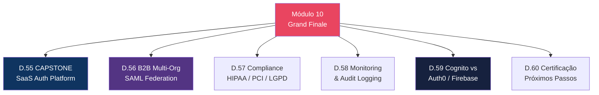
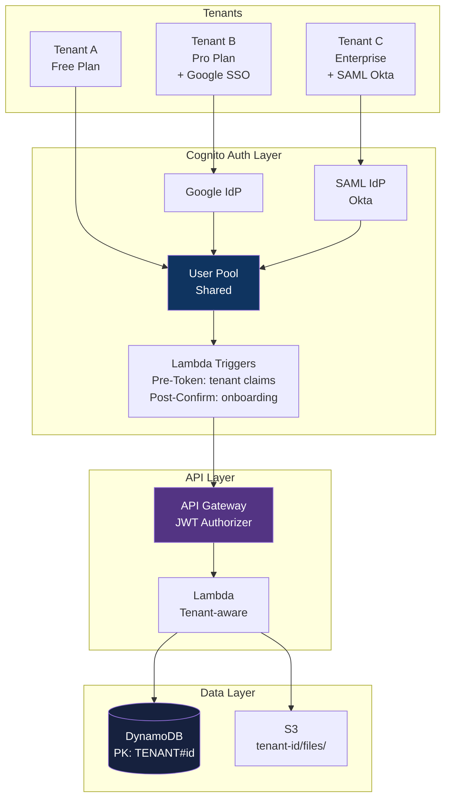

# Módulo 10 — Cenários Expert (Grand Finale)

> **Nível:** 400 (Expert)
> **Tempo Total Estimado:** 12-16 horas de labs
> **Custo Estimado:** ~$5-15
> **Objetivo do Módulo:** Aplicar tudo dos módulos 01-09 em cenários reais — SaaS platform auth completa, B2B multi-org SAML, compliance (HIPAA/PCI), monitoring e audit, comparativo Cognito vs Auth0/Firebase e preparação para certificação.

---

## Mapa do Módulo Final



---

## Desafio 55: CAPSTONE — SaaS Auth Platform

> **Level:** 400 | **Tempo:** 180 min | **Custo:** ~$5

### Objetivo

Projetar a arquitetura de autenticação completa para uma plataforma SaaS multi-tenant.

### Arquitetura



### Stack Completo

```
SaaS Auth Stack:
├── Cognito User Pool (shared)
│   ├── Custom attributes: tenant_id, plan, role
│   ├── Groups: admins, editors, viewers (per tenant)
│   ├── MFA: OPTIONAL (Free), ON (Enterprise)
│   ├── Advanced Security: ENFORCED
│   └── Managed Login: custom domain + branding
│
├── Identity Providers
│   ├── Google (social login — all tenants)
│   ├── SAML IdP per enterprise tenant
│   └── Attribute mapping: tenant → custom:tenant_id
│
├── Lambda Triggers
│   ├── Pre-Signup: validate domain, assign tenant
│   ├── Post-Confirmation: create profile, onboarding
│   ├── Pre-Token: inject tenant_id, plan, permissions
│   └── Custom Auth: passwordless for invited users
│
├── API Gateway (HTTP API)
│   ├── JWT Authorizer (Cognito)
│   ├── Routes per service
│   └── Throttling per tenant (via API key)
│
├── App Clients
│   ├── SPA client (public, PKCE)
│   ├── Mobile client (public, PKCE)
│   ├── Server client (confidential, client_credentials)
│   └── Per-tenant SAML clients (enterprise)
│
└── Monitoring
    ├── CloudTrail: auth events
    ├── CloudWatch: login metrics, errors
    └── Advanced security logs: risk events
```

---

## Desafio 59: Cognito vs Auth0 vs Firebase Auth

> **Level:** 400 | **Tempo:** 60 min | **Custo:** $0

### Comparativo

| Aspecto | Cognito | Auth0 | Firebase Auth |
|---------|---------|-------|---------------|
| **Preço (50K MAU)** | $0 (Lite) | ~$240/mês | $0 |
| **Preço (500K MAU)** | ~$7.500 (Lite) | Enterprise | $0 (limits) |
| **AWS integration** | Nativa (IAM, API GW, ALB) | Via JWT | Via JWT |
| **Social login** | Google, Facebook, Apple, Amazon | 30+ providers | Google, Facebook, Apple, etc. |
| **SAML/OIDC** | Sim | Sim | Não nativo |
| **Machine-to-Machine** | Client Credentials | Sim | Não |
| **Passkeys** | Sim (Essentials+) | Sim | Sim |
| **Custom domain** | Sim | Sim | Não |
| **Lambda triggers** | 7+ triggers | Actions/Rules | Cloud Functions |
| **Managed login** | Sim (customizável) | Sim (Universal Login) | Sim (FirebaseUI) |
| **Multi-tenant** | Groups + custom attrs | Organizations | Não nativo |
| **Vendor lock-in** | AWS ecosystem | Independente | Google ecosystem |
| **Self-hosted** | Não | Não | Não |

### Decision Framework

```
Use Cognito quando:
├── Já está no ecossistema AWS (API GW, ALB, S3, DynamoDB)
├── Precisa de Identity Pools (AWS credentials temporárias)
├── Budget é prioridade (50K MAU grátis!)
├── SAML federation para B2B
└── Machine-to-Machine (client_credentials)

Use Auth0 quando:
├── Multi-cloud ou cloud-agnostic
├── Precisa de 30+ social providers
├── UX do login é diferencial (Universal Login é excelente)
├── Time não quer gerenciar Lambda triggers
└── Enterprise features OOTB (Organizations, Branding)

Use Firebase Auth quando:
├── App mobile-first com Google ecosystem
├── Simplicidade é prioridade
├── Budget zero (gratuito até limites altos)
├── Não precisa de SAML/M2M
└── Já usa Firestore/Cloud Functions
```

---

## Desafio 60: Certificação e Próximos Passos

> **Level:** 400 | **Tempo:** 60 min | **Custo:** $0

### O Que Este Workshop Cobriu

```
┌──────────────────────────────────────────────────────────────┐
│               COGNITO WORKSHOP — COMPLETO                     │
│                                                               │
│  60 desafios · 10 módulos · Level 100 → 400                 │
│                                                               │
│  User Pools: signup, login, MFA, tokens, groups              │
│  Identity Pools: AWS credentials, role mapping               │
│  OAuth2/OIDC: Auth Code + PKCE, Client Credentials           │
│  Lambda Triggers: 7 triggers, passwordless, migration        │
│  Security: Adaptive auth, WAF, threat protection             │
│  Integration: API GW, ALB, Amplify, React                    │
│  Federation: Google, Facebook, SAML, OIDC                    │
│  Patterns: Multi-tenant, passkeys, step-up auth             │
│  Expert: SaaS platform, B2B SAML, compliance                │
│                                                               │
│  De zero a referência técnica em Amazon Cognito.             │
└──────────────────────────────────────────────────────────────┘
```

### Próximos Workshops

```
Workshops complementares neste repo:
├── cloudfront/     → CDN (integração com Cognito signed URLs)
├── aws-security/   → Security (IAM, GuardDuty, Config)
├── api-gateway/    → APIs (Cognito Authorizer, JWT)
└── (futuro) serverless/ → Lambda + API GW + DynamoDB + Cognito
```

**Próximo:** Voltar ao [README principal](../README.md) e explorar os outros workshops.
